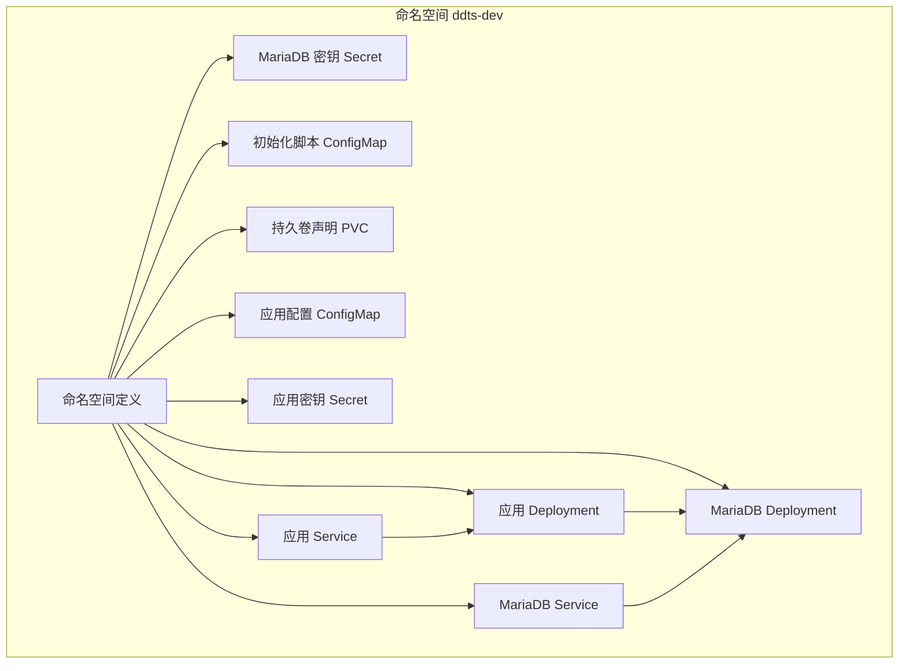
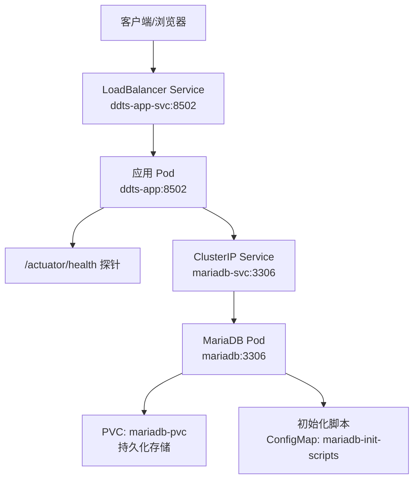
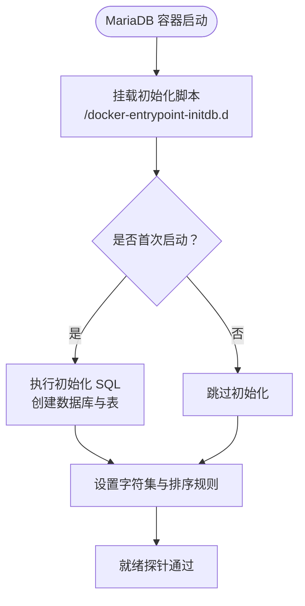
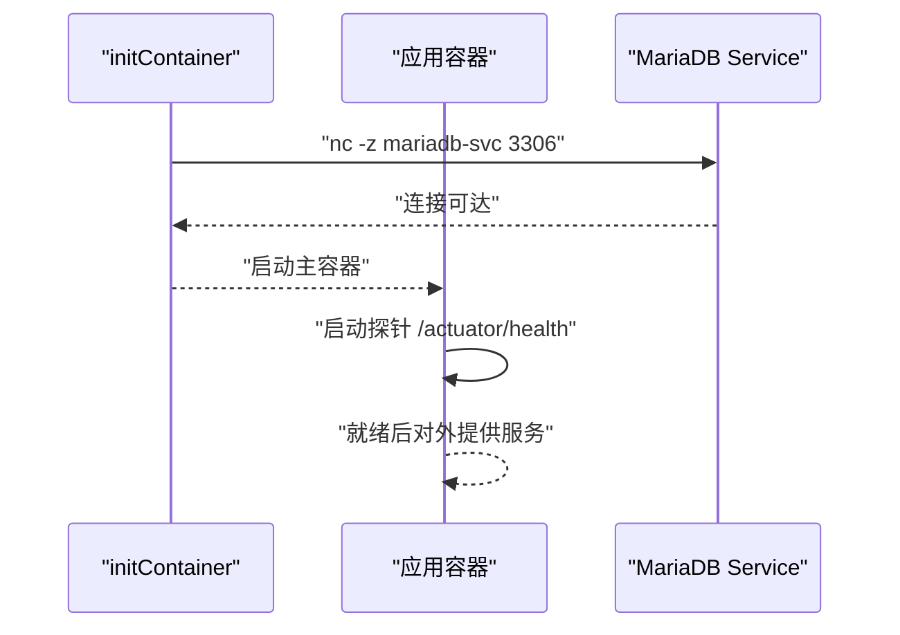
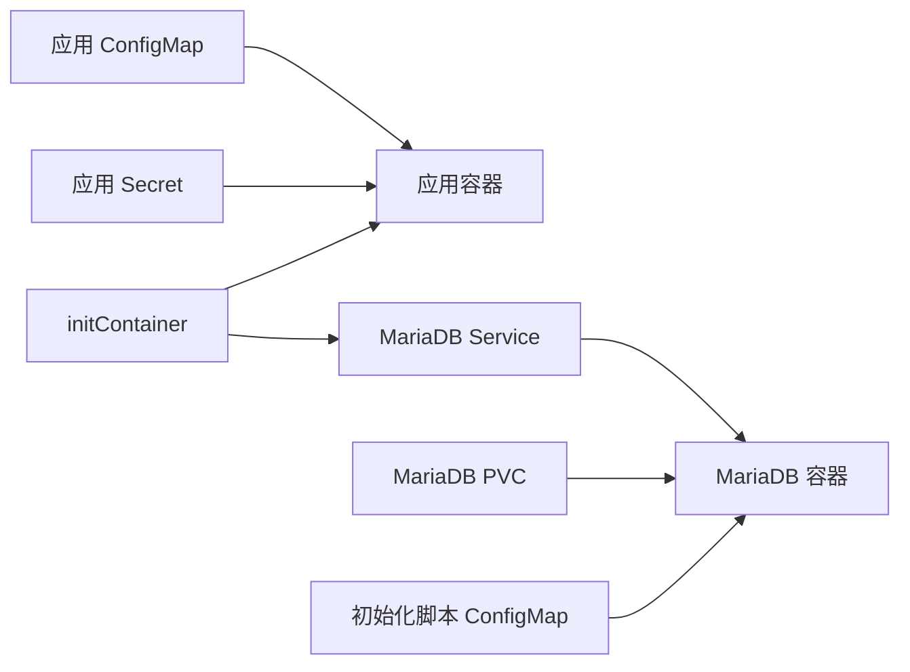

# 开发环境部署

<cite>
**本文档引用的文件**
- [00-namespace.yaml](file://deploy/k8s/dev/00-namespace.yaml)
- [01-mariadb-secret.yaml](file://deploy/k8s/dev/01-mariadb-secret.yaml)
- [02-mariadb-init-configmap.yaml](file://deploy/k8s/dev/02-mariadb-init-configmap.yaml)
- [03-mariadb-pvc.yaml](file://deploy/k8s/dev/03-mariadb-pvc.yaml)
- [04-mariadb-deployment.yaml](file://deploy/k8s/dev/04-mariadb-deployment.yaml)
- [05-mariadb-service.yaml](file://deploy/k8s/dev/05-mariadb-service.yaml)
- [06-app-configmap.yaml](file://deploy/k8s/dev/06-app-configmap.yaml)
- [07-app-secret.yaml](file://deploy/k8s/dev/07-app-secret.yaml)
- [08-app-deployment.yaml](file://deploy/k8s/dev/08-app-deployment.yaml)
- [09-app-service.yaml](file://deploy/k8s/dev/09-app-service.yaml)
- [Dockerfile](file://deploy/docker/Dockerfile)
- [env-start.sh](file://deploy/scripts/env-start.sh)
- [env-init.sh](file://deploy/scripts/env-init.sh)
- [tc-init-privileges.sql](file://common-dal/src/main/resources/sql/tc-init-privileges.sql)
</cite>

## 目录
1. [简介](#简介)
2. [项目结构](#项目结构)
3. [核心组件](#核心组件)
4. [架构总览](#架构总览)
5. [详细组件分析](#详细组件分析)
6. [依赖关系分析](#依赖关系分析)
7. [性能考虑](#性能考虑)
8. [故障排查指南](#故障排查指南)
9. [结论](#结论)
10. [附录](#附录)

## 简介
本文件面向开发环境的 Kubernetes 部署，聚焦以下目标：
- 解析开发环境命名空间配置与资源隔离策略
- 详述 MariaDB 数据库部署（含 PVC 存储、初始化脚本、连接参数）
- 阐明应用 Deployment 的镜像策略、资源限制与环境变量
- 说明 Service 暴露方式与负载均衡配置
- 提供完整的 kubectl 部署命令与验证步骤
- 给出开发环境调试配置与日志查看方法

## 项目结构
开发环境的 K8s 清单位于 deploy/k8s/dev 下，按序号命名以确保应用顺序。整体采用“命名空间隔离 + 多资源组合”的结构化组织方式。

图表来源
- [00-namespace.yaml:1-8](file://deploy/k8s/dev/00-namespace.yaml#L1-L8)
- [01-mariadb-secret.yaml:1-13](file://deploy/k8s/dev/01-mariadb-secret.yaml#L1-L13)
- [02-mariadb-init-configmap.yaml:1-224](file://deploy/k8s/dev/02-mariadb-init-configmap.yaml#L1-L224)
- [03-mariadb-pvc.yaml:1-16](file://deploy/k8s/dev/03-mariadb-pvc.yaml#L1-L16)
- [04-mariadb-deployment.yaml:1-74](file://deploy/k8s/dev/04-mariadb-deployment.yaml#L1-L74)
- [05-mariadb-service.yaml:1-18](file://deploy/k8s/dev/05-mariadb-service.yaml#L1-L18)
- [06-app-configmap.yaml:1-22](file://deploy/k8s/dev/06-app-configmap.yaml#L1-L22)
- [07-app-secret.yaml:1-14](file://deploy/k8s/dev/07-app-secret.yaml#L1-L14)
- [08-app-deployment.yaml:1-72](file://deploy/k8s/dev/08-app-deployment.yaml#L1-L72)
- [09-app-service.yaml:1-18](file://deploy/k8s/dev/09-app-service.yaml#L1-L18)

章节来源
- [00-namespace.yaml:1-8](file://deploy/k8s/dev/00-namespace.yaml#L1-L8)

## 核心组件
- 命名空间：ddts-dev，用于开发环境资源的完全隔离，包含标签 part-of 与 environment，便于筛选与审计。
- MariaDB：单副本 Deployment，使用 PVC 持久化数据；通过 ConfigMap 注入初始化 SQL；通过 Secret 注入 root 密码。
- 应用：单副本 Deployment，带启动/就绪/存活探针；通过 ConfigMap/Secret 注入数据库连接参数与密码；通过 LoadBalancer Service 暴露端口。
- 脚本：env-init.sh 一键安装工具链并启动 minikube；env-start.sh 构建镜像、加载到 minikube、部署清单、等待就绪并建立隧道。

章节来源
- [00-namespace.yaml:1-8](file://deploy/k8s/dev/00-namespace.yaml#L1-L8)
- [04-mariadb-deployment.yaml:1-74](file://deploy/k8s/dev/04-mariadb-deployment.yaml#L1-L74)
- [08-app-deployment.yaml:1-72](file://deploy/k8s/dev/08-app-deployment.yaml#L1-L72)
- [env-init.sh:1-333](file://deploy/scripts/env-init.sh#L1-L333)
- [env-start.sh:1-284](file://deploy/scripts/env-start.sh#L1-L284)

## 架构总览
下图展示开发环境在 Kubernetes 中的端到端交互：客户端通过 LoadBalancer 获取应用服务，应用通过 Service 访问 MariaDB。

图表来源
- [09-app-service.yaml:1-18](file://deploy/k8s/dev/09-app-service.yaml#L1-L18)
- [08-app-deployment.yaml:1-72](file://deploy/k8s/dev/08-app-deployment.yaml#L1-L72)
- [05-mariadb-service.yaml:1-18](file://deploy/k8s/dev/05-mariadb-service.yaml#L1-L18)
- [04-mariadb-deployment.yaml:1-74](file://deploy/k8s/dev/04-mariadb-deployment.yaml#L1-L74)
- [03-mariadb-pvc.yaml:1-16](file://deploy/k8s/dev/03-mariadb-pvc.yaml#L1-L16)
- [02-mariadb-init-configmap.yaml:1-224](file://deploy/k8s/dev/02-mariadb-init-configmap.yaml#L1-L224)

## 详细组件分析

### 命名空间与资源隔离
- 命名空间 ddts-dev 仅承载开发环境资源，避免与其它环境或集群级资源冲突。
- 所有资源均带有 app 与 environment 标签，便于按环境筛选与清理。

章节来源
- [00-namespace.yaml:1-8](file://deploy/k8s/dev/00-namespace.yaml#L1-L8)

### MariaDB 数据库部署
- 镜像与端口：使用官方 MariaDB 10.11，容器端口 3306。
- 密钥注入：通过 Secret 注入 root 密码，避免硬编码。
- 存储：PVC 使用 storageClassName standard，容量 1Gi，访问模式 ReadWriteOnce，挂载至 /var/lib/mysql。
- 初始化：通过 ConfigMap 挂载初始化脚本目录，首次启动自动执行，创建 test_master/test_slave1 数据库及表结构。
- 连接参数：应用侧通过 ConfigMap 指定 master/slave JDBC URL、用户名、驱动类等。
- 健康检查：就绪探针使用 mysqladmin ping，存活探针使用 TCP 探测。

图表来源
- [04-mariadb-deployment.yaml:1-74](file://deploy/k8s/dev/04-mariadb-deployment.yaml#L1-L74)
- [02-mariadb-init-configmap.yaml:1-224](file://deploy/k8s/dev/02-mariadb-init-configmap.yaml#L1-L224)
- [03-mariadb-pvc.yaml:1-16](file://deploy/k8s/dev/03-mariadb-pvc.yaml#L1-L16)

章节来源
- [01-mariadb-secret.yaml:1-13](file://deploy/k8s/dev/01-mariadb-secret.yaml#L1-L13)
- [02-mariadb-init-configmap.yaml:1-224](file://deploy/k8s/dev/02-mariadb-init-configmap.yaml#L1-L224)
- [03-mariadb-pvc.yaml:1-16](file://deploy/k8s/dev/03-mariadb-pvc.yaml#L1-L16)
- [04-mariadb-deployment.yaml:1-74](file://deploy/k8s/dev/04-mariadb-deployment.yaml#L1-L74)
- [05-mariadb-service.yaml:1-18](file://deploy/k8s/dev/05-mariadb-service.yaml#L1-L18)

### 应用 Deployment 配置
- 镜像策略：imagePullPolicy: Never，适用于本地 minikube 环境，直接使用本地镜像。
- 资源限制：requests/limits 设置 CPU 与内存，保证 QoS 与调度稳定性。
- 环境变量：通过 ConfigMap/Secret 注入，包括 Spring Profile、JDBC URL、用户名、池名、日志配置与 JVM 参数。
- 探针：
  - startupProbe：HTTP GET /actuator/health，失败阈值较高，适配应用冷启动。
  - readinessProbe：HTTP GET /actuator/health，快速暴露健康状态。
  - livenessProbe：HTTP GET /actuator/health，定期检测存活。
- 初始化容器：wait-for-mariadb，使用 busybox netcat 等待 mariadb-svc:3306 可达后再启动主容器，确保数据库可用性。

图表来源
- [08-app-deployment.yaml:1-72](file://deploy/k8s/dev/08-app-deployment.yaml#L1-L72)
- [05-mariadb-service.yaml:1-18](file://deploy/k8s/dev/05-mariadb-service.yaml#L1-L18)

章节来源
- [06-app-configmap.yaml:1-22](file://deploy/k8s/dev/06-app-configmap.yaml#L1-L22)
- [07-app-secret.yaml:1-14](file://deploy/k8s/dev/07-app-secret.yaml#L1-L14)
- [08-app-deployment.yaml:1-72](file://deploy/k8s/dev/08-app-deployment.yaml#L1-L72)

### Service 暴露与负载均衡
- 应用 Service 类型为 LoadBalancer，将 8502 端口暴露给外部。
- MariaDB Service 类型为 ClusterIP，仅在集群内可访问，避免外泄数据库端口。
- 访问路径：通过 minikube tunnel 获取外部 IP 后，访问 http://{EXTERNAL_IP}:8502；或使用 minikube service 命令。

章节来源
- [09-app-service.yaml:1-18](file://deploy/k8s/dev/09-app-service.yaml#L1-L18)
- [05-mariadb-service.yaml:1-18](file://deploy/k8s/dev/05-mariadb-service.yaml#L1-L18)
- [env-start.sh:160-211](file://deploy/scripts/env-start.sh#L160-L211)

### 部署与验证步骤
- 一键初始化工具链并启动 minikube
  - 执行：./deploy/scripts/env-init.sh
  - 自动安装 Java、Podman、kubectl、minikube 并启动 minikube
- 构建镜像并加载到 minikube
  - 执行：./deploy/scripts/env-start.sh dev
  - 自动构建镜像、加载到 minikube、应用清单、等待 MariaDB 与应用就绪
- 手动部署（不使用脚本）
  - 创建命名空间：kubectl apply -f deploy/k8s/dev/00-namespace.yaml
  - 部署 MariaDB：依次应用 01~05 清单
  - 部署应用：依次应用 06~09 清单
- 验证
  - Pod 状态：kubectl -n ddts-dev get pods -w
  - 服务状态：kubectl -n ddts-dev get svc
  - PVC 状态：kubectl -n ddts-dev get pvc
  - 应用健康：kubectl -n ddts-dev get pods -l app=ddts-app -o jsonpath='{.items[*].status.containerStatuses[*].ready}'
  - 数据库连通性：使用 kubectl run 或 busybox Pod 进入集群内测试 nc -z mariadb-svc 3306
  - 外部访问：minikube tunnel 或 minikube service ddts-app-svc -n ddts-dev --url

章节来源
- [env-init.sh:300-333](file://deploy/scripts/env-init.sh#L300-L333)
- [env-start.sh:129-211](file://deploy/scripts/env-start.sh#L129-L211)
- [00-namespace.yaml:1-8](file://deploy/k8s/dev/00-namespace.yaml#L1-L8)
- [01-mariadb-secret.yaml:1-13](file://deploy/k8s/dev/01-mariadb-secret.yaml#L1-L13)
- [02-mariadb-init-configmap.yaml:1-224](file://deploy/k8s/dev/02-mariadb-init-configmap.yaml#L1-L224)
- [03-mariadb-pvc.yaml:1-16](file://deploy/k8s/dev/03-mariadb-pvc.yaml#L1-L16)
- [04-mariadb-deployment.yaml:1-74](file://deploy/k8s/dev/04-mariadb-deployment.yaml#L1-L74)
- [05-mariadb-service.yaml:1-18](file://deploy/k8s/dev/05-mariadb-service.yaml#L1-L18)
- [06-app-configmap.yaml:1-22](file://deploy/k8s/dev/06-app-configmap.yaml#L1-L22)
- [07-app-secret.yaml:1-14](file://deploy/k8s/dev/07-app-secret.yaml#L1-L14)
- [08-app-deployment.yaml:1-72](file://deploy/k8s/dev/08-app-deployment.yaml#L1-L72)
- [09-app-service.yaml:1-18](file://deploy/k8s/dev/09-app-service.yaml#L1-L18)

### 开发调试与日志查看
- 日志查看
  - 应用日志：kubectl -n ddts-dev logs -l app=ddts-app -f
  - MariaDB 日志：kubectl -n ddts-dev logs -l app=mariadb -f
- 调试技巧
  - 使用 kubectl exec 进入 Pod 进行连通性测试（如 nc、mysql 客户端）
  - 查看探针状态：kubectl -n ddts-dev describe pod -l app=ddts-app
  - 查看事件：kubectl -n ddts-dev get events --sort-by=.metadata.creationTimestamp
- 测试容器（可选）
  - 在同一命名空间创建临时 busybox Pod，进行网络连通性与数据库连通性验证

章节来源
- [env-start.sh:207-211](file://deploy/scripts/env-start.sh#L207-L211)
- [08-app-deployment.yaml:52-71](file://deploy/k8s/dev/08-app-deployment.yaml#L52-L71)
- [04-mariadb-deployment.yaml:51-66](file://deploy/k8s/dev/04-mariadb-deployment.yaml#L51-L66)

## 依赖关系分析
- 应用对数据库的依赖：通过 initContainer 确保数据库可用后再启动；应用通过 Service 名称与端口访问数据库。
- 存储依赖：MariaDB 通过 PVC 持久化数据，避免 Pod 重建导致数据丢失。
- 配置依赖：应用通过 ConfigMap/Secret 注入数据库连接参数与密码，避免在 Deployment 中硬编码。

图表来源
- [06-app-configmap.yaml:1-22](file://deploy/k8s/dev/06-app-configmap.yaml#L1-L22)
- [07-app-secret.yaml:1-14](file://deploy/k8s/dev/07-app-secret.yaml#L1-L14)
- [08-app-deployment.yaml:20-32](file://deploy/k8s/dev/08-app-deployment.yaml#L20-L32)
- [05-mariadb-service.yaml:1-18](file://deploy/k8s/dev/05-mariadb-service.yaml#L1-L18)
- [03-mariadb-pvc.yaml:1-16](file://deploy/k8s/dev/03-mariadb-pvc.yaml#L1-L16)
- [02-mariadb-init-configmap.yaml:1-224](file://deploy/k8s/dev/02-mariadb-init-configmap.yaml#L1-L224)

## 性能考虑
- 资源配额：MariaDB 与应用均设置了 requests/limits，建议根据实际负载调整，避免 OOM 或调度失败。
- 探针频率：就绪/存活探针间隔较短，有利于快速发现异常，但会增加 API 压力，可根据集群规模适度放宽。
- 存储 I/O：PVC 容量较小（1Gi），适合开发场景；生产建议评估数据增长与备份策略。
- 镜像策略：开发环境使用 Never，减少网络开销；生产环境应改为 IfNotPresent 或 Always 并配合镜像仓库。

## 故障排查指南
- MariaDB 未就绪
  - 检查初始化脚本是否正确挂载与执行
  - 查看 PVC 是否绑定成功
  - 检查 Pod 事件与日志
- 应用无法启动
  - 检查 initContainer 是否等待数据库成功
  - 查看应用探针返回状态
  - 检查 ConfigMap/Secret 是否正确注入
- 外部访问失败
  - 确认 minikube tunnel 正常运行
  - 检查 LoadBalancer 外部 IP 是否分配
  - 使用 minikube service 命令获取临时访问地址

章节来源
- [env-start.sh:139-211](file://deploy/scripts/env-start.sh#L139-L211)
- [08-app-deployment.yaml:20-32](file://deploy/k8s/dev/08-app-deployment.yaml#L20-L32)
- [04-mariadb-deployment.yaml:51-66](file://deploy/k8s/dev/04-mariadb-deployment.yaml#L51-L66)

## 结论
本开发环境通过命名空间实现强隔离，结合 PVC、ConfigMap、Secret 与多层探针，提供了稳定且可调试的本地 Kubernetes 开发体验。配合一键初始化与部署脚本，极大降低了环境搭建成本。建议在团队内统一使用该流程，并根据实际负载逐步优化资源配额与存储策略。

## 附录
- 镜像构建：Dockerfile 采用多阶段构建，先在 JDK 8 环境编译，再将产物复制到轻量 JRE 运行时，最终入口通过 JAVA_OPTS 注入 JVM 参数。
- 测试容器权限：Testcontainers 初始化脚本授予 test 用户全局权限，便于自动化测试创建数据库。

章节来源
- [Dockerfile:1-50](file://deploy/docker/Dockerfile#L1-L50)
- [tc-init-privileges.sql:1-4](file://common-dal/src/main/resources/sql/tc-init-privileges.sql#L1-L4)