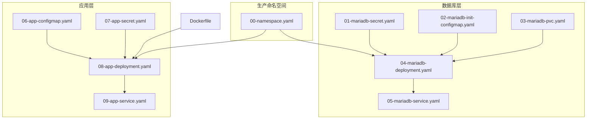
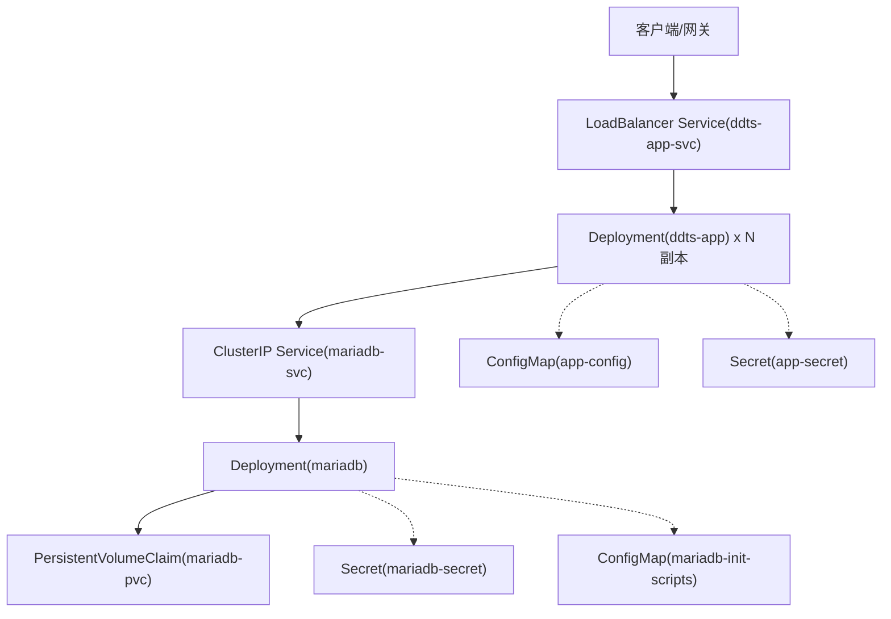
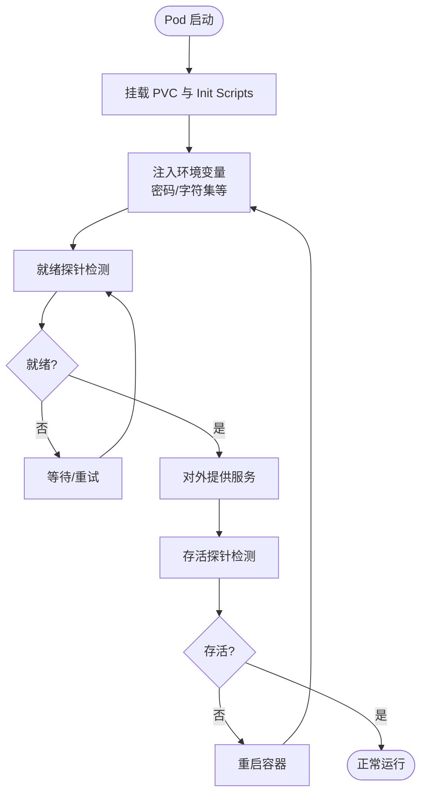
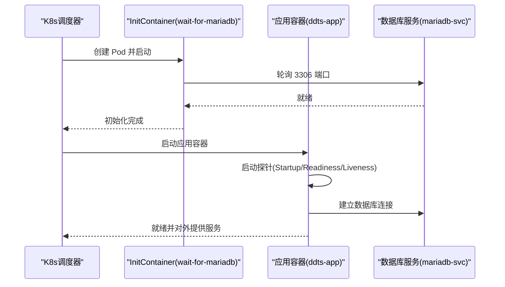
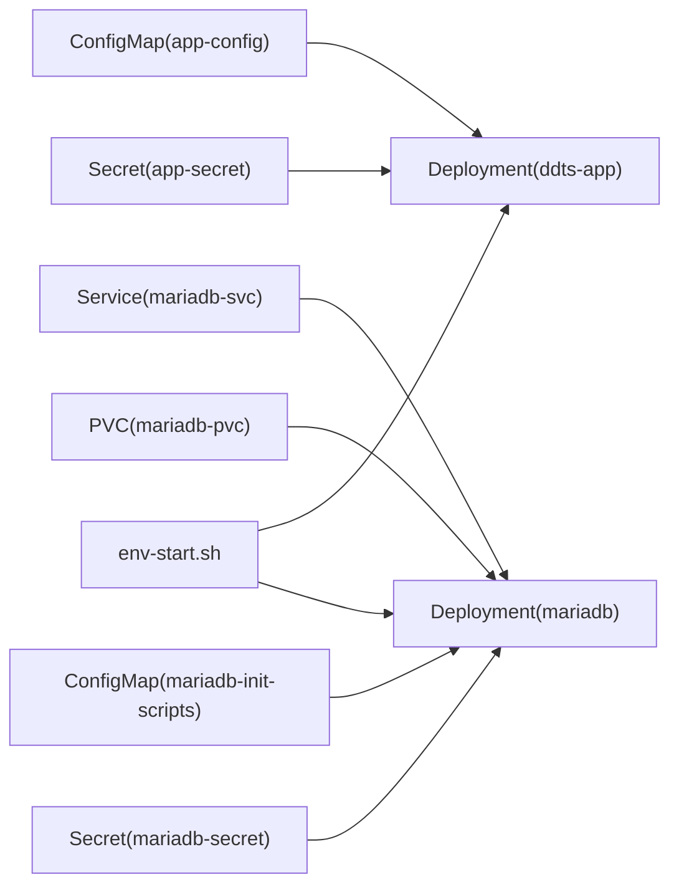

# 生产环境部署

<cite>
**本文引用的文件**
- [deploy/k8s/prod/00-namespace.yaml](file://deploy/k8s/prod/00-namespace.yaml)
- [deploy/k8s/prod/01-mariadb-secret.yaml](file://deploy/k8s/prod/01-mariadb-secret.yaml)
- [deploy/k8s/prod/02-mariadb-init-configmap.yaml](file://deploy/k8s/prod/02-mariadb-init-configmap.yaml)
- [deploy/k8s/prod/03-mariadb-pvc.yaml](file://deploy/k8s/prod/03-mariadb-pvc.yaml)
- [deploy/k8s/prod/04-mariadb-deployment.yaml](file://deploy/k8s/prod/04-mariadb-deployment.yaml)
- [deploy/k8s/prod/05-mariadb-service.yaml](file://deploy/k8s/prod/05-mariadb-service.yaml)
- [deploy/k8s/prod/06-app-configmap.yaml](file://deploy/k8s/prod/06-app-configmap.yaml)
- [deploy/k8s/prod/07-app-secret.yaml](file://deploy/k8s/prod/07-app-secret.yaml)
- [deploy/k8s/prod/08-app-deployment.yaml](file://deploy/k8s/prod/08-app-deployment.yaml)
- [deploy/k8s/prod/09-app-service.yaml](file://deploy/k8s/prod/09-app-service.yaml)
- [deploy/docker/Dockerfile](file://deploy/docker/Dockerfile)
- [biz-service-impl/src/main/resources/application.yml](file://biz-service-impl/src/main/resources/application.yml)
- [biz-service-impl/src/main/resources/application.properties](file://biz-service-impl/src/main/resources/application.properties)
- [deploy/scripts/env-start.sh](file://deploy/scripts/env-start.sh)
</cite>

## 目录
1. [引言](#引言)
2. [项目结构](#项目结构)
3. [核心组件](#核心组件)
4. [架构总览](#架构总览)
5. [详细组件分析](#详细组件分析)
6. [依赖关系分析](#依赖关系分析)
7. [性能考量](#性能考量)
8. [故障排查指南](#故障排查指南)
9. [结论](#结论)
10. [附录](#附录)

## 引言
本文件面向生产环境的 Kubernetes 部署，基于仓库中现有的生产级 K8s 清单与应用配置，系统化阐述高可用架构设计、安全配置、资源限制与扩缩容、数据库主从与读写分离、健康检查与监控、安全审计以及紧急故障处理与变更管理流程。内容严格依据现有清单与配置文件进行分析与提炼，确保可落地执行。

## 项目结构
生产环境采用按环境分层的目录组织方式，生产环境相关资源位于 deploy/k8s/prod 下，包含命名空间、MariaDB、应用等资源清单；应用通过 Dockerfile 构建镜像并在 K8s 中以 Deployment 方式运行；应用配置与密钥通过 ConfigMap/Secret 注入；脚本提供一键部署、状态查询与销毁能力。

图示来源
- [deploy/k8s/prod/00-namespace.yaml:1-8](file://deploy/k8s/prod/00-namespace.yaml#L1-L8)
- [deploy/k8s/prod/01-mariadb-secret.yaml:1-14](file://deploy/k8s/prod/01-mariadb-secret.yaml#L1-L14)
- [deploy/k8s/prod/02-mariadb-init-configmap.yaml:1-222](file://deploy/k8s/prod/02-mariadb-init-configmap.yaml#L1-L222)
- [deploy/k8s/prod/03-mariadb-pvc.yaml:1-16](file://deploy/k8s/prod/03-mariadb-pvc.yaml#L1-L16)
- [deploy/k8s/prod/04-mariadb-deployment.yaml:1-74](file://deploy/k8s/prod/04-mariadb-deployment.yaml#L1-L74)
- [deploy/k8s/prod/05-mariadb-service.yaml:1-18](file://deploy/k8s/prod/05-mariadb-service.yaml#L1-L18)
- [deploy/k8s/prod/06-app-configmap.yaml:1-22](file://deploy/k8s/prod/06-app-configmap.yaml#L1-L22)
- [deploy/k8s/prod/07-app-secret.yaml:1-15](file://deploy/k8s/prod/07-app-secret.yaml#L1-L15)
- [deploy/k8s/prod/08-app-deployment.yaml:1-72](file://deploy/k8s/prod/08-app-deployment.yaml#L1-L72)
- [deploy/k8s/prod/09-app-service.yaml:1-18](file://deploy/k8s/prod/09-app-service.yaml#L1-L18)
- [deploy/docker/Dockerfile:1-50](file://deploy/docker/Dockerfile#L1-L50)

章节来源
- [deploy/k8s/prod/00-namespace.yaml:1-8](file://deploy/k8s/prod/00-namespace.yaml#L1-L8)
- [deploy/k8s/prod/04-mariadb-deployment.yaml:1-74](file://deploy/k8s/prod/04-mariadb-deployment.yaml#L1-L74)
- [deploy/k8s/prod/08-app-deployment.yaml:1-72](file://deploy/k8s/prod/08-app-deployment.yaml#L1-L72)
- [deploy/docker/Dockerfile:1-50](file://deploy/docker/Dockerfile#L1-L50)

## 核心组件
- 命名空间与标签：统一的命名空间与环境标签便于资源分组与治理。
- MariaDB 数据库：单实例部署，使用 PVC 持久化存储，初始化脚本创建主从数据库与表结构。
- 应用服务：多副本部署，具备启动、就绪与存活探针，通过 ConfigMap/Secret 注入配置与密钥。
- 负载均衡：应用 Service 类型为 LoadBalancer，便于外部访问。
- 容器镜像：基于多阶段构建，非 root 用户运行，暴露应用端口。

章节来源
- [deploy/k8s/prod/00-namespace.yaml:1-8](file://deploy/k8s/prod/00-namespace.yaml#L1-L8)
- [deploy/k8s/prod/04-mariadb-deployment.yaml:1-74](file://deploy/k8s/prod/04-mariadb-deployment.yaml#L1-L74)
- [deploy/k8s/prod/08-app-deployment.yaml:1-72](file://deploy/k8s/prod/08-app-deployment.yaml#L1-L72)
- [deploy/k8s/prod/09-app-service.yaml:1-18](file://deploy/k8s/prod/09-app-service.yaml#L1-L18)
- [deploy/docker/Dockerfile:1-50](file://deploy/docker/Dockerfile#L1-L50)

## 架构总览
生产环境采用“命名空间隔离 + 单实例数据库 + 多副本应用 + 负载均衡”的基础架构。应用通过 Service 访问数据库，应用与数据库均处于同一命名空间内，便于网络策略与权限控制的统一管理。

图示来源
- [deploy/k8s/prod/05-mariadb-service.yaml:1-18](file://deploy/k8s/prod/05-mariadb-service.yaml#L1-L18)
- [deploy/k8s/prod/09-app-service.yaml:1-18](file://deploy/k8s/prod/09-app-service.yaml#L1-L18)
- [deploy/k8s/prod/04-mariadb-deployment.yaml:1-74](file://deploy/k8s/prod/04-mariadb-deployment.yaml#L1-L74)
- [deploy/k8s/prod/08-app-deployment.yaml:1-72](file://deploy/k8s/prod/08-app-deployment.yaml#L1-L72)
- [deploy/k8s/prod/03-mariadb-pvc.yaml:1-16](file://deploy/k8s/prod/03-mariadb-pvc.yaml#L1-L16)
- [deploy/k8s/prod/06-app-configmap.yaml:1-22](file://deploy/k8s/prod/06-app-configmap.yaml#L1-L22)
- [deploy/k8s/prod/07-app-secret.yaml:1-15](file://deploy/k8s/prod/07-app-secret.yaml#L1-L15)
- [deploy/k8s/prod/01-mariadb-secret.yaml:1-14](file://deploy/k8s/prod/01-mariadb-secret.yaml#L1-L14)
- [deploy/k8s/prod/02-mariadb-init-configmap.yaml:1-222](file://deploy/k8s/prod/02-mariadb-init-configmap.yaml#L1-L222)

## 详细组件分析

### 命名空间与标签
- 使用独立命名空间隔离生产资源，并通过标签标记环境属性，便于运维与审计。
- 建议在生产中增加 RBAC、网络策略与 Pod 安全策略，以满足合规要求。

章节来源
- [deploy/k8s/prod/00-namespace.yaml:1-8](file://deploy/k8s/prod/00-namespace.yaml#L1-L8)

### MariaDB 数据库
- 单副本部署，使用 Recreate 策略，适合生产环境的可控迁移与一致性需求。
- 探针配置：就绪探针使用本地命令检测，存活探针使用端口探测，保障启动顺序与健康状态。
- 存储：PVC 提供持久化，容量与访问模式按需调整。
- 初始化：通过 ConfigMap 注入 SQL 脚本，创建主从数据库与表结构。

图示来源
- [deploy/k8s/prod/04-mariadb-deployment.yaml:1-74](file://deploy/k8s/prod/04-mariadb-deployment.yaml#L1-L74)
- [deploy/k8s/prod/02-mariadb-init-configmap.yaml:1-222](file://deploy/k8s/prod/02-mariadb-init-configmap.yaml#L1-L222)
- [deploy/k8s/prod/03-mariadb-pvc.yaml:1-16](file://deploy/k8s/prod/03-mariadb-pvc.yaml#L1-L16)

章节来源
- [deploy/k8s/prod/04-mariadb-deployment.yaml:1-74](file://deploy/k8s/prod/04-mariadb-deployment.yaml#L1-L74)
- [deploy/k8s/prod/05-mariadb-service.yaml:1-18](file://deploy/k8s/prod/05-mariadb-service.yaml#L1-L18)
- [deploy/k8s/prod/01-mariadb-secret.yaml:1-14](file://deploy/k8s/prod/01-mariadb-secret.yaml#L1-L14)
- [deploy/k8s/prod/02-mariadb-init-configmap.yaml:1-222](file://deploy/k8s/prod/02-mariadb-init-configmap.yaml#L1-L222)
- [deploy/k8s/prod/03-mariadb-pvc.yaml:1-16](file://deploy/k8s/prod/03-mariadb-pvc.yaml#L1-L16)

### 应用服务
- 多副本部署，提升可用性与吞吐能力。
- 初始化容器等待数据库就绪，避免冷启动时的连接抖动。
- 探针：startupProbe、readinessProbe、livenessProbe 三段式保障启动与运行稳定。
- 资源：requests/limits 明确 CPU 与内存，结合 HPA 实现弹性扩缩容。
- 配置注入：通过 ConfigMap/Secret 注入 JDBC URL、用户名、密码、线程池参数与日志配置。

图示来源
- [deploy/k8s/prod/08-app-deployment.yaml:1-72](file://deploy/k8s/prod/08-app-deployment.yaml#L1-L72)
- [deploy/k8s/prod/05-mariadb-service.yaml:1-18](file://deploy/k8s/prod/05-mariadb-service.yaml#L1-L18)

章节来源
- [deploy/k8s/prod/08-app-deployment.yaml:1-72](file://deploy/k8s/prod/08-app-deployment.yaml#L1-L72)
- [deploy/k8s/prod/09-app-service.yaml:1-18](file://deploy/k8s/prod/09-app-service.yaml#L1-L18)
- [deploy/k8s/prod/06-app-configmap.yaml:1-22](file://deploy/k8s/prod/06-app-configmap.yaml#L1-L22)
- [deploy/k8s/prod/07-app-secret.yaml:1-15](file://deploy/k8s/prod/07-app-secret.yaml#L1-L15)

### 配置与密钥
- 应用配置：通过 ConfigMap 注入 JDBC URL、驱动类名、用户名、连接池名称、日志配置与 JVM 参数。
- 数据库密钥：通过 Secret 注入数据库密码，避免明文硬编码。
- 应用配置文件：Spring Profile 切换到 prod，启用生产日志与线程池参数。

章节来源
- [deploy/k8s/prod/06-app-configmap.yaml:1-22](file://deploy/k8s/prod/06-app-configmap.yaml#L1-L22)
- [deploy/k8s/prod/07-app-secret.yaml:1-15](file://deploy/k8s/prod/07-app-secret.yaml#L1-L15)
- [biz-service-impl/src/main/resources/application.yml:196-216](file://biz-service-impl/src/main/resources/application.yml#L196-L216)
- [biz-service-impl/src/main/resources/application.properties:1-14](file://biz-service-impl/src/main/resources/application.properties#L1-L14)

### 镜像与运行时
- 多阶段构建：构建阶段使用 JDK，运行阶段使用 JRE，减小镜像体积。
- 非 root 用户运行，增强安全性。
- 暴露应用端口，通过环境变量注入 JVM 参数。

章节来源
- [deploy/docker/Dockerfile:1-50](file://deploy/docker/Dockerfile#L1-L50)

## 依赖关系分析
- 应用依赖数据库 Service 名称与端口，通过 ClusterIP 暴露。
- 应用依赖 ConfigMap/Secret 提供的配置与密钥。
- 数据库依赖 PVC 提供持久化存储与初始化脚本。
- 脚本负责镜像构建、加载与部署，提供状态查询与销毁能力。

图示来源
- [deploy/k8s/prod/06-app-configmap.yaml:1-22](file://deploy/k8s/prod/06-app-configmap.yaml#L1-L22)
- [deploy/k8s/prod/07-app-secret.yaml:1-15](file://deploy/k8s/prod/07-app-secret.yaml#L1-L15)
- [deploy/k8s/prod/05-mariadb-service.yaml:1-18](file://deploy/k8s/prod/05-mariadb-service.yaml#L1-L18)
- [deploy/k8s/prod/03-mariadb-pvc.yaml:1-16](file://deploy/k8s/prod/03-mariadb-pvc.yaml#L1-L16)
- [deploy/k8s/prod/02-mariadb-init-configmap.yaml:1-222](file://deploy/k8s/prod/02-mariadb-init-configmap.yaml#L1-L222)
- [deploy/k8s/prod/01-mariadb-secret.yaml:1-14](file://deploy/k8s/prod/01-mariadb-secret.yaml#L1-L14)
- [deploy/scripts/env-start.sh:1-284](file://deploy/scripts/env-start.sh#L1-L284)

章节来源
- [deploy/scripts/env-start.sh:1-284](file://deploy/scripts/env-start.sh#L1-L284)

## 性能考量
- 资源限制：应用与数据库均配置了 requests/limits，建议结合 HPA 在流量高峰时自动扩容。
- 线程池：应用配置了 Tomcat 最大线程数与超时参数，建议根据并发峰值调优。
- 连接池：应用侧配置了 Hikari 连接池参数，建议与数据库最大连接数匹配。
- 存储：数据库 PVC 容量与 IOPS 需满足生产写入压力，必要时升级存储类型或分片。
- 网络：Service 类型为 LoadBalancer，建议配合 Ingress 与 WAF 提升吞吐与安全。

章节来源
- [deploy/k8s/prod/08-app-deployment.yaml:45-51](file://deploy/k8s/prod/08-app-deployment.yaml#L45-L51)
- [deploy/k8s/prod/04-mariadb-deployment.yaml:38-44](file://deploy/k8s/prod/04-mariadb-deployment.yaml#L38-L44)
- [biz-service-impl/src/main/resources/application.properties:10-14](file://biz-service-impl/src/main/resources/application.properties#L10-L14)
- [biz-service-impl/src/main/resources/application.yml:24-32](file://biz-service-impl/src/main/resources/application.yml#L24-L32)

## 故障排查指南
- 应用未就绪：检查 Startup/Readiness 探针返回值与日志；确认数据库 Service 可达。
- 数据库不可用：检查就绪/存活探针与初始化脚本是否执行成功；确认 PVC 是否绑定。
- 外部访问失败：确认 LoadBalancer 外部 IP 是否分配；若无则使用 minikube tunnel 或 Ingress。
- 部署与状态：使用脚本提供的状态查询功能快速定位问题。
- 密钥与配置：核对 ConfigMap/Secret 的键名与大小写，确保与应用期望一致。

章节来源
- [deploy/k8s/prod/08-app-deployment.yaml:52-71](file://deploy/k8s/prod/08-app-deployment.yaml#L52-L71)
- [deploy/k8s/prod/04-mariadb-deployment.yaml:51-66](file://deploy/k8s/prod/04-mariadb-deployment.yaml#L51-L66)
- [deploy/scripts/env-start.sh:162-211](file://deploy/scripts/env-start.sh#L162-L211)

## 结论
当前生产清单提供了基础可用的部署骨架：命名空间隔离、单实例数据库、多副本应用与负载均衡。为满足生产高可用、安全与弹性需求，建议在现有基础上补充：数据库主从复制与读写分离、HPA 自动扩缩容、RBAC/网络策略/Pod 安全策略、节点亲和性与污点容忍、备份与灾难恢复方案、完善的健康检查与监控告警体系。

## 附录

### 生产高可用与灾备建议
- 数据库主从复制与读写分离：在现有清单基础上新增从库 Deployment 与对应 Service，应用侧配置主写从读路由。
- HPA 自动扩缩容：基于 CPU/内存或自定义指标创建 HPA，与 Deployment 关联。
- 节点亲和性与反亲和性：将应用副本分散到不同节点，避免单点故障。
- 灾难恢复：定期备份 PVC 快照或数据库逻辑备份，演练恢复流程。

### 安全配置建议
- RBAC：为不同团队授予最小权限，限制对生产命名空间的变更操作。
- 网络策略：默认拒绝入站流量，仅放行必要的 Service/Ingress 出站。
- Pod 安全策略：限制特权容器、强制非 root 运行、只读根文件系统。

### 生产部署检查清单
- 基础设施
  - 集群节点健康、资源充足
  - 存储类支持所需 IOPS 与持久化
- 配置与密钥
  - ConfigMap/Secret 正确注入，键名与大小写无误
  - 数据库密码与连接串已替换为强口令
- 应用与数据库
  - 应用副本数、探针阈值合理
  - 数据库就绪与存活探针工作正常
  - PVC 已正确绑定并有足够容量
- 网络与访问
  - Service 类型与端口符合预期
  - LoadBalancer 外部 IP 可用或通过 Ingress 访问
- 监控与日志
  - 健康检查端点可访问
  - 日志输出与采集链路正常
- 安全与合规
  - RBAC/网络策略/PSP 已启用
  - 镜像与容器运行时符合安全基线

### 紧急故障处理预案
- 应用大面积不可用
  - 快速回滚至上一稳定版本
  - 检查数据库连接池与慢查询
  - 启用只读模式或降级接口
- 数据库故障
  - 切换至从库或备用实例
  - 恢复备份并重建主从
- 网络中断
  - 检查 Service/Ingress 配置
  - 临时使用 NodePort 或 Ingress 入口
- 安全事件
  - 立即隔离受影响命名空间
  - 审计日志与事件溯源
  - 修复漏洞并更新密钥

### 生产变更管理流程
- 变更申请：明确变更范围、影响面与回滚计划
- 评审与测试：在预生产验证变更
- 执行窗口：选择低峰时段执行
- 发布与验证：自动化校验健康检查与关键指标
- 回滚：如异常立即回滚并复盘