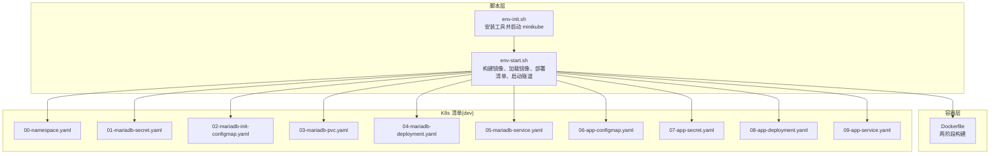
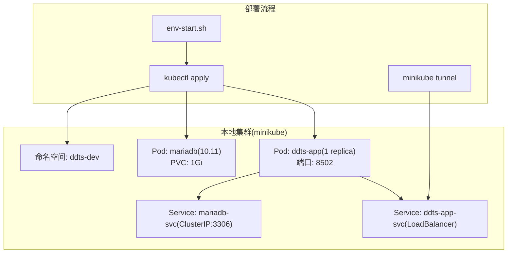
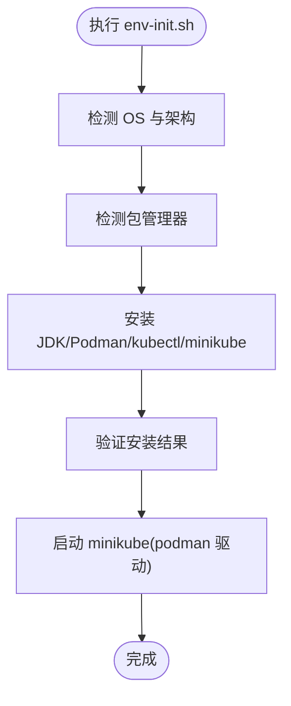
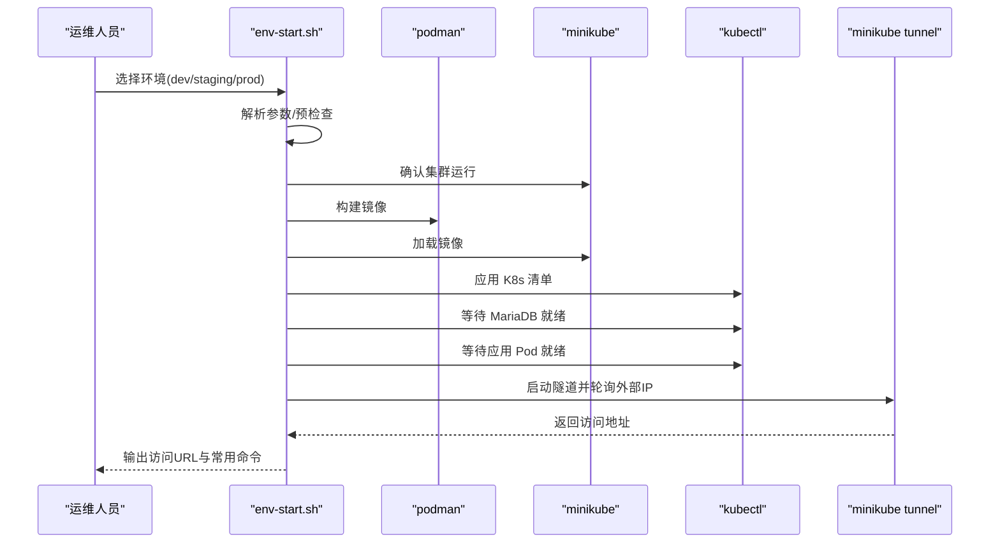
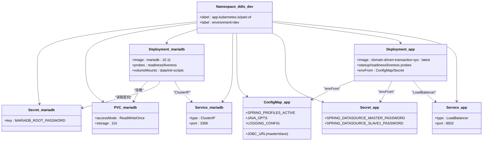
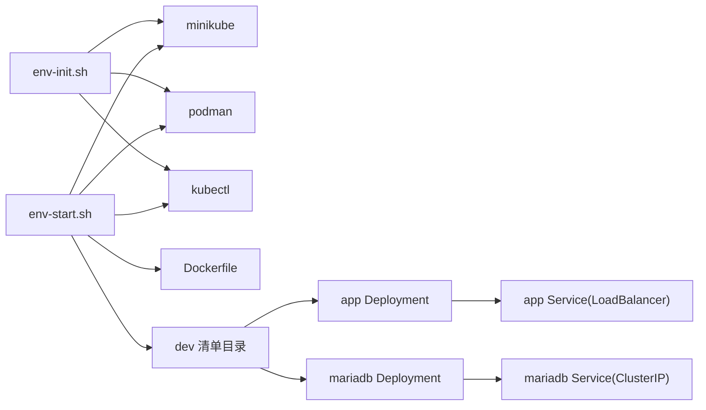

# 部署运维操作

<cite>
**本文引用的文件**
- [env-init.sh](file://deploy/scripts/env-init.sh)
- [env-start.sh](file://deploy/scripts/env-start.sh)
- [Dockerfile](file://deploy/docker/Dockerfile)
- [00-namespace.yaml](file://deploy/k8s/dev/00-namespace.yaml)
- [01-mariadb-secret.yaml](file://deploy/k8s/dev/01-mariadb-secret.yaml)
- [02-mariadb-init-configmap.yaml](file://deploy/k8s/dev/02-mariadb-init-configmap.yaml)
- [03-mariadb-pvc.yaml](file://deploy/k8s/dev/03-mariadb-pvc.yaml)
- [04-mariadb-deployment.yaml](file://deploy/k8s/dev/04-mariadb-deployment.yaml)
- [05-mariadb-service.yaml](file://deploy/k8s/dev/05-mariadb-service.yaml)
- [06-app-configmap.yaml](file://deploy/k8s/dev/06-app-configmap.yaml)
- [07-app-secret.yaml](file://deploy/k8s/dev/07-app-secret.yaml)
- [08-app-deployment.yaml](file://deploy/k8s/dev/08-app-deployment.yaml)
- [09-app-service.yaml](file://deploy/k8s/dev/09-app-service.yaml)
- [README.md](file://README.md)
</cite>

## 目录
1. [简介](#简介)
2. [项目结构](#项目结构)
3. [核心组件](#核心组件)
4. [架构总览](#架构总览)
5. [详细组件分析](#详细组件分析)
6. [依赖关系分析](#依赖关系分析)
7. [性能考虑](#性能考虑)
8. [故障排查指南](#故障排查指南)
9. [结论](#结论)
10. [附录](#附录)

## 简介
本指南面向 Kubernetes 部署与运维工程师，围绕本项目的 K8s 部署脚本、K8s 清单与容器化流程，提供从环境初始化、资源部署、日常运维到故障排查的全流程操作说明。重点涵盖：
- 环境初始化脚本的功能与使用方法（命名空间清理、权限初始化、基础资源创建）
- 环境启动脚本的执行流程与参数配置
- kubectl 常用操作（资源查询、日志查看、端口转发、配置更新）
- 部署检查清单（资源状态验证、服务连通性测试、数据库连接验证）
- 常见部署问题诊断与解决（镜像拉取失败、Pod 启动失败、网络连接问题）

## 项目结构
本项目采用“脚本 + 清单 + 容器镜像”的三层部署结构：
- 脚本层：一键初始化与启动脚本，负责工具安装、集群启动、镜像构建与加载、资源部署与隧道开启
- 清单层：K8s 清单按环境拆分（dev/staging/prod），包含命名空间、Secret、ConfigMap、Deployment、Service、PVC 等
- 容器层：两阶段 Dockerfile，先构建再运行，暴露应用端口并以非 root 用户运行

图表来源
- [env-init.sh:1-333](file://deploy/scripts/env-init.sh#L1-L333)
- [env-start.sh:1-284](file://deploy/scripts/env-start.sh#L1-L284)
- [Dockerfile:1-50](file://deploy/docker/Dockerfile#L1-L50)
- [00-namespace.yaml:1-8](file://deploy/k8s/dev/00-namespace.yaml#L1-L8)
- [01-mariadb-secret.yaml:1-13](file://deploy/k8s/dev/01-mariadb-secret.yaml#L1-L13)
- [02-mariadb-init-configmap.yaml:1-224](file://deploy/k8s/dev/02-mariadb-init-configmap.yaml#L1-L224)
- [03-mariadb-pvc.yaml:1-16](file://deploy/k8s/dev/03-mariadb-pvc.yaml#L1-L16)
- [04-mariadb-deployment.yaml:1-74](file://deploy/k8s/dev/04-mariadb-deployment.yaml#L1-L74)
- [05-mariadb-service.yaml:1-18](file://deploy/k8s/dev/05-mariadb-service.yaml#L1-L18)
- [06-app-configmap.yaml:1-22](file://deploy/k8s/dev/06-app-configmap.yaml#L1-L22)
- [07-app-secret.yaml:1-14](file://deploy/k8s/dev/07-app-secret.yaml#L1-L14)
- [08-app-deployment.yaml:1-72](file://deploy/k8s/dev/08-app-deployment.yaml#L1-L72)
- [09-app-service.yaml:1-18](file://deploy/k8s/dev/09-app-service.yaml#L1-L18)

章节来源
- [README.md:216-321](file://README.md#L216-L321)

## 核心组件
- 环境初始化脚本（env-init.sh）
  - 功能：自动检测系统与包管理器，安装 JDK 8、Podman、kubectl、minikube；启动 minikube 集群
  - 支持系统：macOS（Homebrew）、Debian/Ubuntu（APT）、RHEL/Fedora/CentOS（DNF/YUM）
  - 幂等性：已安装工具自动跳过，可重复执行
- 环境启动脚本（env-start.sh）
  - 功能：构建镜像、加载镜像至 minikube、部署 K8s 清单、等待 Pod 就绪、启动 LoadBalancer 隧道、输出访问地址
  - 参数：dev/staging/prod 环境选择；--destroy 销毁；--status 查看状态
  - 依赖：minikube、kubectl、podman 已就绪
- 容器镜像（Dockerfile）
  - 两阶段构建：JDK 8 编译 + JRE 8 运行，暴露端口 8502，非 root 用户运行
  - 构建入口：Gradle 构建 bootJar，产物复制到运行镜像
- K8s 清单（dev 环境）
  - 命名空间：ddts-dev
  - 数据库：MariaDB 10.11，PVC 1Gi，ClusterIP 服务，初始化脚本自动建库建表
  - 应用：Java 应用 Deployment（1 副本），LoadBalancer Service，ConfigMap/Secret 注入配置

章节来源
- [env-init.sh:1-333](file://deploy/scripts/env-init.sh#L1-L333)
- [env-start.sh:1-284](file://deploy/scripts/env-start.sh#L1-L284)
- [Dockerfile:1-50](file://deploy/docker/Dockerfile#L1-L50)
- [00-namespace.yaml:1-8](file://deploy/k8s/dev/00-namespace.yaml#L1-L8)
- [01-mariadb-secret.yaml:1-13](file://deploy/k8s/dev/01-mariadb-secret.yaml#L1-L13)
- [02-mariadb-init-configmap.yaml:1-224](file://deploy/k8s/dev/02-mariadb-init-configmap.yaml#L1-L224)
- [03-mariadb-pvc.yaml:1-16](file://deploy/k8s/dev/03-mariadb-pvc.yaml#L1-L16)
- [04-mariadb-deployment.yaml:1-74](file://deploy/k8s/dev/04-mariadb-deployment.yaml#L1-L74)
- [05-mariadb-service.yaml:1-18](file://deploy/k8s/dev/05-mariadb-service.yaml#L1-L18)
- [06-app-configmap.yaml:1-22](file://deploy/k8s/dev/06-app-configmap.yaml#L1-L22)
- [07-app-secret.yaml:1-14](file://deploy/k8s/dev/07-app-secret.yaml#L1-L14)
- [08-app-deployment.yaml:1-72](file://deploy/k8s/dev/08-app-deployment.yaml#L1-L72)
- [09-app-service.yaml:1-18](file://deploy/k8s/dev/09-app-service.yaml#L1-L18)

## 架构总览
下图展示 dev 环境的部署架构与交互关系：minikube 作为本地集群，env-start.sh 驱动镜像构建与加载，kubectl 应用清单，应用通过 LoadBalancer Service 暴露端口，MariaDB 通过 ClusterIP 服务供应用访问。

图表来源
- [env-start.sh:131-211](file://deploy/scripts/env-start.sh#L131-L211)
- [04-mariadb-deployment.yaml:1-74](file://deploy/k8s/dev/04-mariadb-deployment.yaml#L1-L74)
- [05-mariadb-service.yaml:1-18](file://deploy/k8s/dev/05-mariadb-service.yaml#L1-L18)
- [08-app-deployment.yaml:1-72](file://deploy/k8s/dev/08-app-deployment.yaml#L1-L72)
- [09-app-service.yaml:1-18](file://deploy/k8s/dev/09-app-service.yaml#L1-L18)

章节来源
- [README.md:216-245](file://README.md#L216-L245)

## 详细组件分析

### 环境初始化脚本（env-init.sh）
- 自动检测 OS 与包管理器，按平台安装 JDK 8、Podman、kubectl、minikube
- 启动 minikube（podman 驱动），默认内存 4Gi、CPU 2 核
- 输出下一步命令提示，引导用户启动 dev/staging/prod 环境

图表来源
- [env-init.sh:23-296](file://deploy/scripts/env-init.sh#L23-L296)

章节来源
- [env-init.sh:1-333](file://deploy/scripts/env-init.sh#L1-L333)

### 环境启动脚本（env-start.sh）
- 参数解析：dev/staging/prod 环境；--destroy 销毁；--status 查看
- 预检查：确保 minikube、kubectl、podman 就绪，K8s 清单目录存在
- 执行流程：
  - 确认 minikube 运行
  - 构建镜像（podman build）
  - 加载镜像到 minikube（minikube image load）
  - 应用 K8s 清单（kubectl apply）
  - 等待 MariaDB 与应用 Pod 就绪
  - 启动 LoadBalancer 隧道（minikube tunnel），轮询获取外部 IP
  - 输出访问地址与常用命令

图表来源
- [env-start.sh:71-211](file://deploy/scripts/env-start.sh#L71-L211)

章节来源
- [env-start.sh:1-284](file://deploy/scripts/env-start.sh#L1-L284)

### K8s 清单组件（dev 环境）
- 命名空间：ddts-dev，带环境标签
- MariaDB：
  - Secret：root 密码（base64）
  - PVC：1Gi，ReadWriteOnce
  - Deployment：10.11 版本，挂载 PVC 与初始化脚本
  - Service：ClusterIP:3306
  - 初始化脚本：自动创建 test_master/test_slave1，建表，插入占位数据
- 应用：
  - Deployment：1 副本，initContainer 等待 MariaDB 就绪，健康探针基于 /actuator/health
  - Service：LoadBalancer:8502
  - ConfigMap/Secret：注入 JDBC URL、用户名、密码、JVM 参数、日志配置

图表来源
- [00-namespace.yaml:1-8](file://deploy/k8s/dev/00-namespace.yaml#L1-L8)
- [01-mariadb-secret.yaml:1-13](file://deploy/k8s/dev/01-mariadb-secret.yaml#L1-L13)
- [02-mariadb-init-configmap.yaml:1-224](file://deploy/k8s/dev/02-mariadb-init-configmap.yaml#L1-L224)
- [03-mariadb-pvc.yaml:1-16](file://deploy/k8s/dev/03-mariadb-pvc.yaml#L1-L16)
- [04-mariadb-deployment.yaml:1-74](file://deploy/k8s/dev/04-mariadb-deployment.yaml#L1-L74)
- [05-mariadb-service.yaml:1-18](file://deploy/k8s/dev/05-mariadb-service.yaml#L1-L18)
- [06-app-configmap.yaml:1-22](file://deploy/k8s/dev/06-app-configmap.yaml#L1-L22)
- [07-app-secret.yaml:1-14](file://deploy/k8s/dev/07-app-secret.yaml#L1-L14)
- [08-app-deployment.yaml:1-72](file://deploy/k8s/dev/08-app-deployment.yaml#L1-L72)
- [09-app-service.yaml:1-18](file://deploy/k8s/dev/09-app-service.yaml#L1-L18)

章节来源
- [00-namespace.yaml:1-8](file://deploy/k8s/dev/00-namespace.yaml#L1-L8)
- [01-mariadb-secret.yaml:1-13](file://deploy/k8s/dev/01-mariadb-secret.yaml#L1-L13)
- [02-mariadb-init-configmap.yaml:1-224](file://deploy/k8s/dev/02-mariadb-init-configmap.yaml#L1-L224)
- [03-mariadb-pvc.yaml:1-16](file://deploy/k8s/dev/03-mariadb-pvc.yaml#L1-L16)
- [04-mariadb-deployment.yaml:1-74](file://deploy/k8s/dev/04-mariadb-deployment.yaml#L1-L74)
- [05-mariadb-service.yaml:1-18](file://deploy/k8s/dev/05-mariadb-service.yaml#L1-L18)
- [06-app-configmap.yaml:1-22](file://deploy/k8s/dev/06-app-configmap.yaml#L1-L22)
- [07-app-secret.yaml:1-14](file://deploy/k8s/dev/07-app-secret.yaml#L1-L14)
- [08-app-deployment.yaml:1-72](file://deploy/k8s/dev/08-app-deployment.yaml#L1-L72)
- [09-app-service.yaml:1-18](file://deploy/k8s/dev/09-app-service.yaml#L1-L18)

### kubectl 常用操作
- 资源查询
  - 查看 Pod：kubectl get pods -n ddts-dev
  - 查看 Service：kubectl get svc -n ddts-dev
  - 查看 PVC：kubectl get pvc -n ddts-dev
- 日志查看
  - 实时日志：kubectl logs -n ddts-dev -l app=ddts-app -f
- 端口转发（无需隧道的替代方案）
  - kubectl port-forward -n ddts-dev svc/ddts-app-svc 8502:8502
- 配置更新
  - 更新 ConfigMap/Secret 后滚动重启：kubectl rollout restart deployment/ddts-app -n ddts-dev
  - 应用新清单：kubectl apply -f deploy/k8s/<env>/

章节来源
- [README.md:528-545](file://README.md#L528-L545)
- [env-start.sh:215-235](file://deploy/scripts/env-start.sh#L215-L235)

## 依赖关系分析
- 脚本依赖
  - env-init.sh 依赖系统包管理器与 Homebrew/APT/DNF/YUM
  - env-start.sh 依赖 minikube、kubectl、podman，且依赖 K8s 清单目录存在
- 清单依赖
  - 应用 Deployment 依赖 ConfigMap/Secret 提供的环境变量
  - MariaDB Deployment 依赖 PVC 与初始化脚本 ConfigMap
  - 应用通过 ClusterIP 服务访问 MariaDB
- 镜像依赖
  - 应用镜像为 domain-driven-transaction-sys:latest，由 Dockerfile 两阶段构建产出

图表来源
- [env-init.sh:1-333](file://deploy/scripts/env-init.sh#L1-L333)
- [env-start.sh:1-284](file://deploy/scripts/env-start.sh#L1-L284)
- [Dockerfile:1-50](file://deploy/docker/Dockerfile#L1-L50)
- [08-app-deployment.yaml:1-72](file://deploy/k8s/dev/08-app-deployment.yaml#L1-L72)
- [09-app-service.yaml:1-18](file://deploy/k8s/dev/09-app-service.yaml#L1-L18)
- [04-mariadb-deployment.yaml:1-74](file://deploy/k8s/dev/04-mariadb-deployment.yaml#L1-L74)
- [05-mariadb-service.yaml:1-18](file://deploy/k8s/dev/05-mariadb-service.yaml#L1-L18)

章节来源
- [env-init.sh:1-333](file://deploy/scripts/env-init.sh#L1-L333)
- [env-start.sh:1-284](file://deploy/scripts/env-start.sh#L1-L284)

## 性能考虑
- JVM 堆内存与容器内存配额匹配：JVM 最大堆（-Xmx）建议不超过容器内存限制的 70%，避免 OOMKilled
- 资源请求与限制：合理设置 requests/limits，避免抢占与驱逐
- 探针配置：startupProbe/readinessProbe/livenessProbe 的周期与阈值应结合应用启动与健康检查策略调整
- 端口与协议：应用端口 8502，Service 类型 LoadBalancer，适合本地开发；生产建议根据集群能力调整

章节来源
- [README.md:445-474](file://README.md#L445-L474)
- [08-app-deployment.yaml:45-71](file://deploy/k8s/dev/08-app-deployment.yaml#L45-L71)

## 故障排查指南
- 镜像拉取失败
  - 现象：应用 Pod Pending，事件提示镜像拉取失败
  - 排查：确认镜像已通过 podman build 构建并使用 minikube image load 加载
  - 处理：重新构建并加载镜像，或在 minikube 中启用本地镜像策略
- Pod 启动失败
  - 现象：应用 Pod CrashLoopBackOff 或启动超时
  - 排查：查看 Pod 事件与日志；确认 MariaDB 已就绪；检查 JDBC 连接参数与密码
  - 处理：修正 ConfigMap/Secret；等待 MariaDB 就绪；必要时删除 PVC 重建（谨慎）
- 网络连接问题
  - 现象：无法访问应用或 Service 无外部 IP
  - 排查：确认 minikube tunnel 正在运行；检查 Service 类型与端口映射
  - 处理：启动/重启隧道；使用 kubectl port-forward 临时访问；或使用 minikube service 命令获取 URL
- 数据库初始化失败
  - 现象：MariaDB 首次启动未建库建表
  - 排查：确认初始化脚本 ConfigMap 内容正确；PVC 是否为空卷
  - 处理：检查 ConfigMap；删除 PVC 重建（会丢失数据）；或手动进入容器执行初始化 SQL

章节来源
- [env-start.sh:140-157](file://deploy/scripts/env-start.sh#L140-L157)
- [02-mariadb-init-configmap.yaml:1-224](file://deploy/k8s/dev/02-mariadb-init-configmap.yaml#L1-L224)
- [03-mariadb-pvc.yaml:1-16](file://deploy/k8s/dev/03-mariadb-pvc.yaml#L1-L16)
- [README.md:404-424](file://README.md#L404-L424)

## 结论
本指南基于项目提供的脚本与清单，给出了从环境初始化到部署上线、日常运维与故障排查的完整路径。建议在团队内统一使用 env-init.sh 与 env-start.sh，配合 K8s 清单进行标准化部署；在生产环境中，进一步完善镜像仓库、证书与 RBAC 等安全与可观测性配置。

## 附录

### 部署检查清单
- 环境准备
  - 工具安装：JDK 8、Podman、kubectl、minikube
  - minikube 集群运行，内存/CPU 足够
- 镜像与加载
  - 镜像构建成功
  - 镜像已加载至 minikube
- 资源部署
  - 命名空间创建成功
  - MariaDB Pod 就绪（Ready）
  - 应用 Pod 就绪（Ready）
- 服务连通性
  - LoadBalancer 外部 IP 分配（minikube tunnel）
  - 访问 http://<外网IP>:8502/actuator/health
- 数据库连接
  - JDBC URL、用户名、密码正确
  - 初次启动后数据库初始化完成（test_master/test_slave1 存在）

章节来源
- [env-start.sh:131-211](file://deploy/scripts/env-start.sh#L131-L211)
- [README.md:272-321](file://README.md#L272-L321)