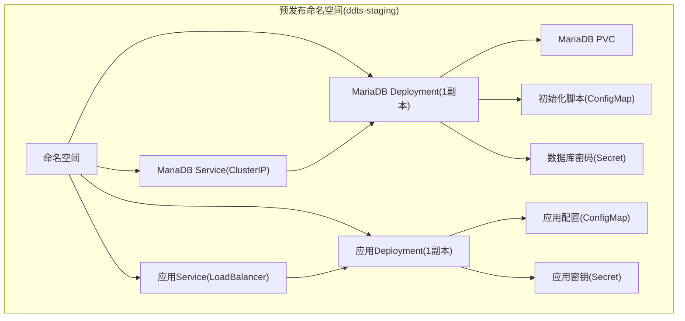
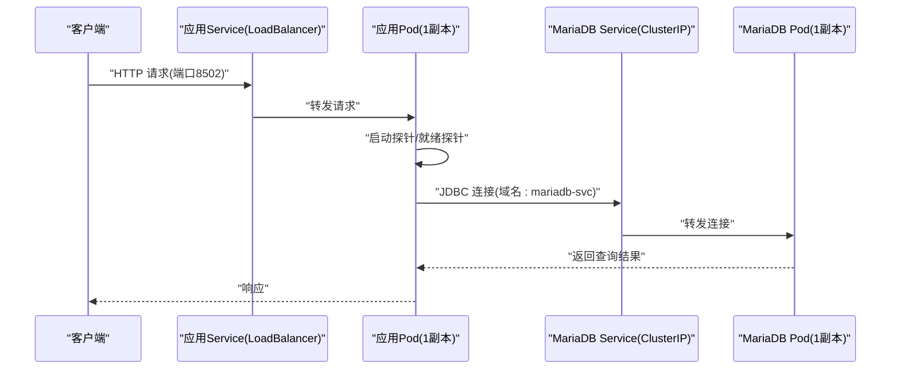
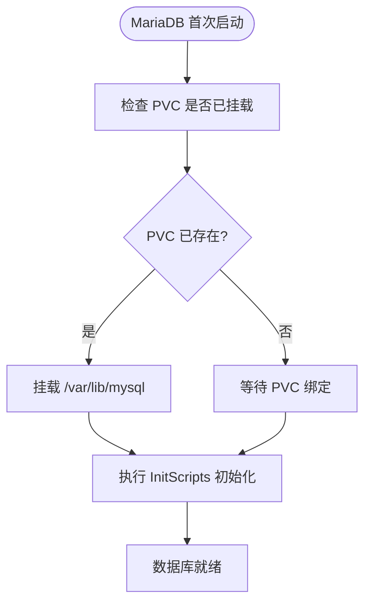
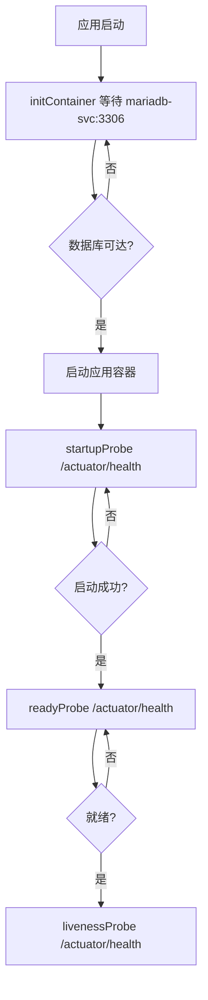
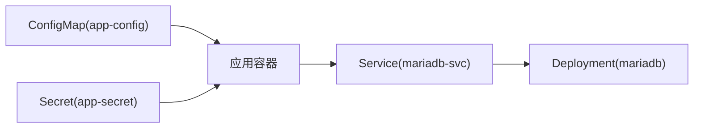
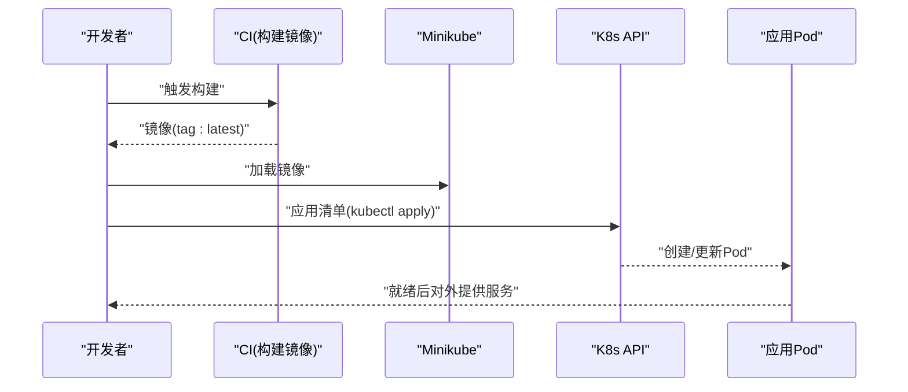

# 预发布环境部署

<cite>
**本文引用的文件**
- [deploy/k8s/staging/00-namespace.yaml](file://deploy/k8s/staging/00-namespace.yaml)
- [deploy/k8s/staging/01-mariadb-secret.yaml](file://deploy/k8s/staging/01-mariadb-secret.yaml)
- [deploy/k8s/staging/02-mariadb-init-configmap.yaml](file://deploy/k8s/staging/02-mariadb-init-configmap.yaml)
- [deploy/k8s/staging/03-mariadb-pvc.yaml](file://deploy/k8s/staging/03-mariadb-pvc.yaml)
- [deploy/k8s/staging/04-mariadb-deployment.yaml](file://deploy/k8s/staging/04-mariadb-deployment.yaml)
- [deploy/k8s/staging/05-mariadb-service.yaml](file://deploy/k8s/staging/05-mariadb-service.yaml)
- [deploy/k8s/staging/06-app-configmap.yaml](file://deploy/k8s/staging/06-app-configmap.yaml)
- [deploy/k8s/staging/07-app-secret.yaml](file://deploy/k8s/staging/07-app-secret.yaml)
- [deploy/k8s/staging/08-app-deployment.yaml](file://deploy/k8s/staging/08-app-deployment.yaml)
- [deploy/k8s/staging/09-app-service.yaml](file://deploy/k8s/staging/09-app-service.yaml)
- [deploy/k8s/dev/08-app-deployment.yaml](file://deploy/k8s/dev/08-app-deployment.yaml)
- [deploy/k8s/prod/08-app-deployment.yaml](file://deploy/k8s/prod/08-app-deployment.yaml)
- [deploy/docker/Dockerfile](file://deploy/docker/Dockerfile)
- [deploy/scripts/env-init.sh](file://deploy/scripts/env-init.sh)
- [deploy/scripts/env-start.sh](file://deploy/scripts/env-start.sh)
</cite>

## 目录
1. [简介](#简介)
2. [项目结构](#项目结构)
3. [核心组件](#核心组件)
4. [架构总览](#架构总览)
5. [详细组件分析](#详细组件分析)
6. [依赖关系分析](#依赖关系分析)
7. [性能考虑](#性能考虑)
8. [故障排查指南](#故障排查指南)
9. [结论](#结论)
10. [附录](#附录)

## 简介
本文件面向预发布（Staging）环境的 Kubernetes 部署，系统性对比预发布与生产环境在资源配置、副本数量与安全策略上的差异；深入解析数据库高可用与备份策略现状；阐述蓝绿或金丝雀发布策略在该仓库现有部署中的可扩展点；解释预发布环境特有的监控与日志配置；提供完整的部署与回滚流程，涵盖流量切换与数据迁移注意事项；并给出性能测试与压力测试方法建议。

## 项目结构
预发布环境采用独立命名空间与独立的 K8s 清单目录组织，便于隔离与复用。核心由以下部分组成：
- 命名空间与网络：Staging 命名空间、MariaDB 服务、应用服务（LoadBalancer）
- 数据库：MariaDB Deployment + PVC + InitScripts ConfigMap + Secret
- 应用：Deployment（含 initContainer 等待数据库）、ConfigMap/Secret 注入、Service 暴露
- 构建与运行：多阶段 Dockerfile、本地 Minikube+Podman 运行时

图表来源
- [deploy/k8s/staging/00-namespace.yaml:1-8](file://deploy/k8s/staging/00-namespace.yaml#L1-L8)
- [deploy/k8s/staging/04-mariadb-deployment.yaml:1-74](file://deploy/k8s/staging/04-mariadb-deployment.yaml#L1-L74)
- [deploy/k8s/staging/05-mariadb-service.yaml:1-18](file://deploy/k8s/staging/05-mariadb-service.yaml#L1-L18)
- [deploy/k8s/staging/08-app-deployment.yaml:1-72](file://deploy/k8s/staging/08-app-deployment.yaml#L1-L72)
- [deploy/k8s/staging/09-app-service.yaml:1-18](file://deploy/k8s/staging/09-app-service.yaml#L1-L18)

章节来源
- [deploy/k8s/staging/00-namespace.yaml:1-8](file://deploy/k8s/staging/00-namespace.yaml#L1-L8)
- [deploy/k8s/staging/04-mariadb-deployment.yaml:1-74](file://deploy/k8s/staging/04-mariadb-deployment.yaml#L1-L74)
- [deploy/k8s/staging/05-mariadb-service.yaml:1-18](file://deploy/k8s/staging/05-mariadb-service.yaml#L1-L18)
- [deploy/k8s/staging/08-app-deployment.yaml:1-72](file://deploy/k8s/staging/08-app-deployment.yaml#L1-L72)
- [deploy/k8s/staging/09-app-service.yaml:1-18](file://deploy/k8s/staging/09-app-service.yaml#L1-L18)

## 核心组件
- 预发布命名空间：隔离资源与权限，避免与开发/生产互相影响
- MariaDB 数据库：单副本部署，使用 PVC 持久化数据，InitScripts 初始化库表
- 应用容器：单副本部署，通过 initContainer 等待数据库就绪，健康探针保障存活/就绪
- 配置注入：应用通过 ConfigMap/Secret 注入数据库连接、日志与 JVM 参数
- 外部访问：应用 Service 类型为 LoadBalancer，结合 minikube tunnel 提供外网访问

章节来源
- [deploy/k8s/staging/00-namespace.yaml:1-8](file://deploy/k8s/staging/00-namespace.yaml#L1-L8)
- [deploy/k8s/staging/04-mariadb-deployment.yaml:1-74](file://deploy/k8s/staging/04-mariadb-deployment.yaml#L1-L74)
- [deploy/k8s/staging/08-app-deployment.yaml:1-72](file://deploy/k8s/staging/08-app-deployment.yaml#L1-L72)
- [deploy/k8s/staging/06-app-configmap.yaml:1-22](file://deploy/k8s/staging/06-app-configmap.yaml#L1-L22)
- [deploy/k8s/staging/07-app-secret.yaml:1-14](file://deploy/k8s/staging/07-app-secret.yaml#L1-L14)
- [deploy/k8s/staging/09-app-service.yaml:1-18](file://deploy/k8s/staging/09-app-service.yaml#L1-L18)

## 架构总览
下图展示预发布环境从客户端到应用再到数据库的整体链路，以及健康检查与探针的作用位置。

图表来源
- [deploy/k8s/staging/09-app-service.yaml:1-18](file://deploy/k8s/staging/09-app-service.yaml#L1-L18)
- [deploy/k8s/staging/08-app-deployment.yaml:1-72](file://deploy/k8s/staging/08-app-deployment.yaml#L1-L72)
- [deploy/k8s/staging/05-mariadb-service.yaml:1-18](file://deploy/k8s/staging/05-mariadb-service.yaml#L1-L18)
- [deploy/k8s/staging/04-mariadb-deployment.yaml:1-74](file://deploy/k8s/staging/04-mariadb-deployment.yaml#L1-L74)

## 详细组件分析

### 数据库高可用与备份策略
- 当前状态：预发布使用单副本 MariaDB Deployment，无内置主从复制或集群高可用配置
- 存储：使用 PVC 持久化 /var/lib/mysql，配合 InitScripts 在首次启动时初始化数据库
- 备份：仓库未提供数据库备份策略与自动化脚本，建议在生产环境引入定期快照/逻辑备份方案

图表来源
- [deploy/k8s/staging/04-mariadb-deployment.yaml:1-74](file://deploy/k8s/staging/04-mariadb-deployment.yaml#L1-L74)
- [deploy/k8s/staging/02-mariadb-init-configmap.yaml](file://deploy/k8s/staging/02-mariadb-init-configmap.yaml)
- [deploy/k8s/staging/03-mariadb-pvc.yaml](file://deploy/k8s/staging/03-mariadb-pvc.yaml)

章节来源
- [deploy/k8s/staging/04-mariadb-deployment.yaml:1-74](file://deploy/k8s/staging/04-mariadb-deployment.yaml#L1-L74)
- [deploy/k8s/staging/02-mariadb-init-configmap.yaml](file://deploy/k8s/staging/02-mariadb-init-configmap.yaml)
- [deploy/k8s/staging/03-mariadb-pvc.yaml](file://deploy/k8s/staging/03-mariadb-pvc.yaml)

### 应用部署与探针配置
- 副本数：预发布为 1，生产为 2，体现风险控制差异
- 资源配额：预发布与生产在 requests/limits 上有明显差异，生产更高
- 探针：应用使用 startupProbe/readyProbe/livenessProbe 保障启动与运行稳定性
- 启动顺序：initContainer 等待数据库端口 3306 就绪后再启动应用

图表来源
- [deploy/k8s/staging/08-app-deployment.yaml:1-72](file://deploy/k8s/staging/08-app-deployment.yaml#L1-L72)
- [deploy/k8s/dev/08-app-deployment.yaml:1-72](file://deploy/k8s/dev/08-app-deployment.yaml#L1-L72)
- [deploy/k8s/prod/08-app-deployment.yaml:1-72](file://deploy/k8s/prod/08-app-deployment.yaml#L1-L72)

章节来源
- [deploy/k8s/staging/08-app-deployment.yaml:1-72](file://deploy/k8s/staging/08-app-deployment.yaml#L1-L72)
- [deploy/k8s/dev/08-app-deployment.yaml:1-72](file://deploy/k8s/dev/08-app-deployment.yaml#L1-L72)
- [deploy/k8s/prod/08-app-deployment.yaml:1-72](file://deploy/k8s/prod/08-app-deployment.yaml#L1-L72)

### 安全策略与配置注入
- 密钥管理：数据库密码与应用敏感参数通过 Secret 注入
- 配置管理：数据库连接、日志配置、JVM 参数通过 ConfigMap 注入
- 网络暴露：应用 Service 使用 LoadBalancer，便于本地调试；生产建议更严格的入口控制

章节来源
- [deploy/k8s/staging/01-mariadb-secret.yaml:1-13](file://deploy/k8s/staging/01-mariadb-secret.yaml#L1-L13)
- [deploy/k8s/staging/07-app-secret.yaml:1-14](file://deploy/k8s/staging/07-app-secret.yaml#L1-L14)
- [deploy/k8s/staging/06-app-configmap.yaml:1-22](file://deploy/k8s/staging/06-app-configmap.yaml#L1-L22)
- [deploy/k8s/staging/09-app-service.yaml:1-18](file://deploy/k8s/staging/09-app-service.yaml#L1-L18)

### 预发布与生产差异对比
- 副本数：预发布 1，生产 2
- 资源配额：生产 requests/limits 更高
- 数据库：预发布单副本，生产可扩展为高可用（当前仓库未提供）

章节来源
- [deploy/k8s/staging/08-app-deployment.yaml:10-10](file://deploy/k8s/staging/08-app-deployment.yaml#L10-L10)
- [deploy/k8s/prod/08-app-deployment.yaml:10-10](file://deploy/k8s/prod/08-app-deployment.yaml#L10-L10)
- [deploy/k8s/dev/08-app-deployment.yaml:10-10](file://deploy/k8s/dev/08-app-deployment.yaml#L10-L10)

## 依赖关系分析
- 应用依赖数据库：initContainer 通过域名 mariadb-svc:3306 等待数据库就绪
- 应用依赖配置：通过 ConfigMap/Secret 注入运行时参数
- 外部访问：LoadBalancer 为应用提供外网访问能力

图表来源
- [deploy/k8s/staging/06-app-configmap.yaml:1-22](file://deploy/k8s/staging/06-app-configmap.yaml#L1-L22)
- [deploy/k8s/staging/07-app-secret.yaml:1-14](file://deploy/k8s/staging/07-app-secret.yaml#L1-L14)
- [deploy/k8s/staging/08-app-deployment.yaml:1-72](file://deploy/k8s/staging/08-app-deployment.yaml#L1-L72)
- [deploy/k8s/staging/05-mariadb-service.yaml:1-18](file://deploy/k8s/staging/05-mariadb-service.yaml#L1-L18)
- [deploy/k8s/staging/04-mariadb-deployment.yaml:1-74](file://deploy/k8s/staging/04-mariadb-deployment.yaml#L1-L74)

章节来源
- [deploy/k8s/staging/06-app-configmap.yaml:1-22](file://deploy/k8s/staging/06-app-configmap.yaml#L1-L22)
- [deploy/k8s/staging/07-app-secret.yaml:1-14](file://deploy/k8s/staging/07-app-secret.yaml#L1-L14)
- [deploy/k8s/staging/08-app-deployment.yaml:1-72](file://deploy/k8s/staging/08-app-deployment.yaml#L1-L72)
- [deploy/k8s/staging/05-mariadb-service.yaml:1-18](file://deploy/k8s/staging/05-mariadb-service.yaml#L1-L18)
- [deploy/k8s/staging/04-mariadb-deployment.yaml:1-74](file://deploy/k8s/staging/04-mariadb-deployment.yaml#L1-L74)

## 性能考虑
- 资源预留：预发布与生产在 CPU/内存 requests/limits 上存在差异，生产应根据压测结果适当上调
- 副本扩展：预发布单副本，生产双副本以提升可用性与吞吐
- 探针阈值：合理设置 startupProbe/livenessProbe/readyProbe 的失败阈值与周期，避免误杀
- 数据库：预发布单实例，生产建议引入主从复制或集群方案，并配套只读副本

## 故障排查指南
- 环境准备：使用初始化脚本安装并启动本地 Kubernetes 环境
- 部署流程：构建镜像、加载镜像至 minikube、应用清单、等待 Pod 就绪
- 访问方式：若 LoadBalancer 外部 IP 未分配，可通过 minikube tunnel 或 minikube service 获取访问地址
- 常见问题：
  - MariaDB 未就绪：检查 PVC 是否绑定、InitScripts 是否执行成功
  - 应用未就绪：查看 startupProbe/readyProbe 日志，确认数据库连通性
  - 外网不可达：确认 minikube tunnel 是否运行

章节来源
- [deploy/scripts/env-init.sh:1-333](file://deploy/scripts/env-init.sh#L1-L333)
- [deploy/scripts/env-start.sh:1-284](file://deploy/scripts/env-start.sh#L1-L284)

## 结论
该仓库提供了可直接在本地运行的预发布环境模板，具备清晰的命名空间隔离、基础的数据库持久化与应用探针机制。生产环境在副本数与资源配额上更为保守，建议在生产中补充数据库高可用与备份策略，并引入蓝绿/金丝雀发布流程以降低变更风险。

## 附录

### 部署与回滚流程（基于现有仓库）
- 部署流程
  - 初始化工具链并启动本地集群
  - 构建应用镜像并加载至本地集群
  - 应用 K8s 清单，等待 MariaDB 与应用 Pod 就绪
  - 通过 minikube tunnel 获取外网访问地址
- 回滚策略
  - 由于当前仓库未提供滚动更新策略与版本标签管理，建议在生产中启用滚动更新与镜像标签化，以便快速回滚
  - 若需回滚，可回退到上一个镜像版本并重新应用清单

图表来源
- [deploy/docker/Dockerfile:1-50](file://deploy/docker/Dockerfile#L1-L50)
- [deploy/scripts/env-start.sh:103-158](file://deploy/scripts/env-start.sh#L103-L158)

章节来源
- [deploy/docker/Dockerfile:1-50](file://deploy/docker/Dockerfile#L1-L50)
- [deploy/scripts/env-start.sh:103-158](file://deploy/scripts/env-start.sh#L103-L158)

### 蓝绿/金丝雀发布建议（概念性说明）
- 蓝绿发布：准备两套完全相同的部署（蓝/绿），通过 Service 切换指向新旧版本，实现零停机切换
- 金丝雀发布：逐步将少量流量导入新版本，观察指标与日志，再扩大流量比例直至全部切换
- 与现有仓库的适配点：当前清单未包含多版本标签与路由规则，可在生产环境中引入

[本节为概念性说明，不直接分析具体文件，故无“章节来源”]

### 监控与日志配置（基于现有仓库）
- 日志：应用通过 ConfigMap 注入日志配置文件路径，预发布使用在线日志配置
- 健康检查：应用暴露 /actuator/health，K8s 通过探针进行健康检查
- 建议：生产环境可引入集中式日志收集与指标采集（如 Prometheus/Grafana/ELK），并完善探针阈值与告警

章节来源
- [deploy/k8s/staging/06-app-configmap.yaml:20-20](file://deploy/k8s/staging/06-app-configmap.yaml#L20-L20)
- [deploy/k8s/staging/08-app-deployment.yaml:52-71](file://deploy/k8s/staging/08-app-deployment.yaml#L52-L71)

### 性能测试与压力测试方法（建议）
- 基准测试：使用压测工具对 /actuator/health 与核心接口进行基准吞吐与延迟测试
- 资源观测：结合探针与指标采集，评估 CPU/内存/IO 在不同负载下的表现
- 数据库压测：对数据库写入/查询路径进行独立压测，识别瓶颈
- 扩展验证：逐步增加副本数与资源配额，观察系统稳定性与性能拐点

[本节为通用实践建议，不直接分析具体文件，故无“章节来源”]