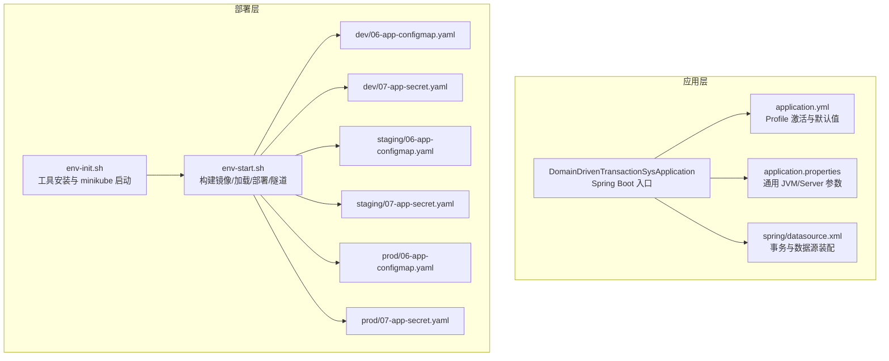
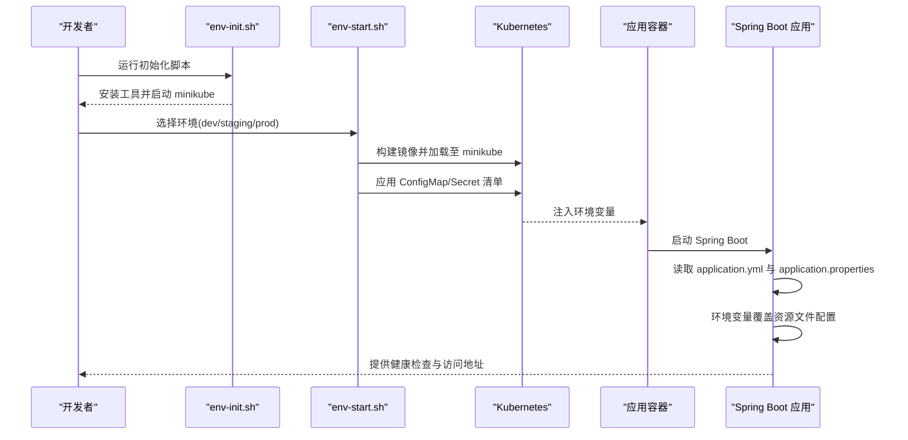
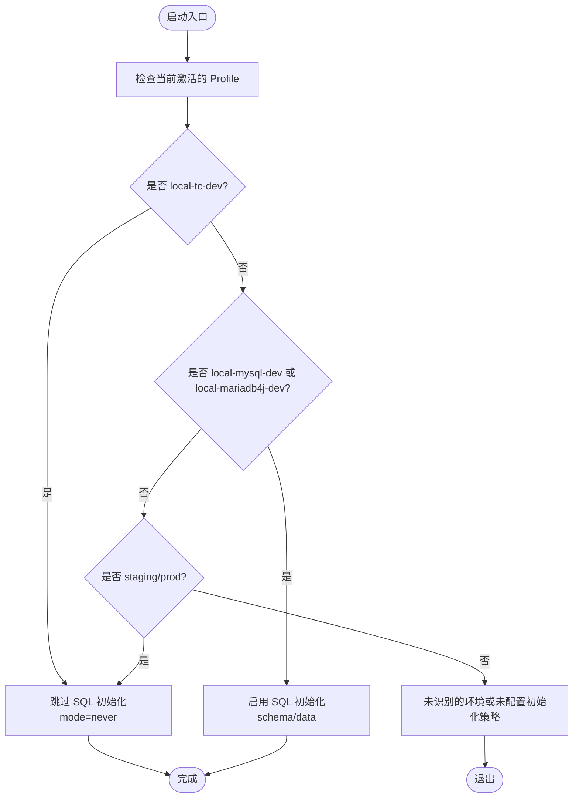
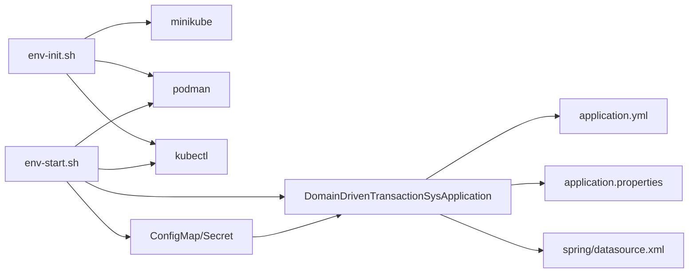

# 环境配置管理

<cite>
**本文引用的文件**
- [application.yml](file://biz-service-impl/src/main/resources/application.yml)
- [application.properties](file://biz-service-impl/src/main/resources/application.properties)
- [DomainDrivenTransactionSysApplication.java](file://biz-service-impl/src/main/java/com/magicliang/transaction/sys/DomainDrivenTransactionSysApplication.java)
- [datasource.xml](file://biz-service-impl/src/main/resources/spring/datasource.xml)
- [env-init.sh](file://deploy/scripts/env-init.sh)
- [env-start.sh](file://deploy/scripts/env-start.sh)
- [06-app-configmap.yaml（dev）](file://deploy/k8s/dev/06-app-configmap.yaml)
- [07-app-secret.yaml（dev）](file://deploy/k8s/dev/07-app-secret.yaml)
- [06-app-configmap.yaml（staging）](file://deploy/k8s/staging/06-app-configmap.yaml)
- [07-app-secret.yaml（staging）](file://deploy/k8s/staging/07-app-secret.yaml)
- [06-app-configmap.yaml（prod）](file://deploy/k8s/prod/06-app-configmap.yaml)
- [07-app-secret.yaml（prod）](file://deploy/k8s/prod/07-app-secret.yaml)
</cite>

## 目录
1. [简介](#简介)
2. [项目结构](#项目结构)
3. [核心组件](#核心组件)
4. [架构总览](#架构总览)
5. [详细组件分析](#详细组件分析)
6. [依赖分析](#依赖分析)
7. [性能考量](#性能考量)
8. [故障排查指南](#故障排查指南)
9. [结论](#结论)
10. [附录](#附录)

## 简介
本文件系统化梳理该代码库的环境配置与多环境部署策略，围绕 Spring Profile 的使用、Kubernetes 环境变量与配置覆盖、配置初始化脚本、数据库初始化与密钥管理、以及配置模板与最佳实践展开。目标是帮助开发者与运维人员快速理解并正确实施从本地到生产的一致化配置管理。

## 项目结构
本项目采用“模块化+多环境配置”的组织方式：
- 应用配置集中在资源目录中，通过 Spring Profile 按环境激活差异化配置。
- Kubernetes 部署通过 ConfigMap/Secret 注入环境变量，实现配置与镜像解耦。
- 部署脚本提供一键初始化与启动/销毁/状态查询能力。

图表来源
- [DomainDrivenTransactionSysApplication.java:52-73](file://biz-service-impl/src/main/java/com/magicliang/transaction/sys/DomainDrivenTransactionSysApplication.java#L52-L73)
- [application.yml:1-216](file://biz-service-impl/src/main/resources/application.yml#L1-L216)
- [application.properties:1-14](file://biz-service-impl/src/main/resources/application.properties#L1-L14)
- [datasource.xml:1-16](file://biz-service-impl/src/main/resources/spring/datasource.xml#L1-L16)
- [env-init.sh:1-333](file://deploy/scripts/env-init.sh#L1-L333)
- [env-start.sh:1-284](file://deploy/scripts/env-start.sh#L1-L284)
- [06-app-configmap.yaml（dev）:1-22](file://deploy/k8s/dev/06-app-configmap.yaml#L1-L22)
- [07-app-secret.yaml（dev）:1-14](file://deploy/k8s/dev/07-app-secret.yaml#L1-L14)
- [06-app-configmap.yaml（staging）:1-22](file://deploy/k8s/staging/06-app-configmap.yaml#L1-L22)
- [07-app-secret.yaml（staging）:1-14](file://deploy/k8s/staging/07-app-secret.yaml#L1-L14)
- [06-app-configmap.yaml（prod）:1-22](file://deploy/k8s/prod/06-app-configmap.yaml#L1-L22)
- [07-app-secret.yaml（prod）:1-15](file://deploy/k8s/prod/07-app-secret.yaml#L1-L15)

章节来源
- [DomainDrivenTransactionSysApplication.java:52-73](file://biz-service-impl/src/main/java/com/magicliang/transaction/sys/DomainDrivenTransactionSysApplication.java#L52-L73)
- [application.yml:1-216](file://biz-service-impl/src/main/resources/application.yml#L1-L216)
- [application.properties:1-14](file://biz-service-impl/src/main/resources/application.properties#L1-L14)
- [datasource.xml:1-16](file://biz-service-impl/src/main/resources/spring/datasource.xml#L1-L16)
- [env-init.sh:1-333](file://deploy/scripts/env-init.sh#L1-L333)
- [env-start.sh:1-284](file://deploy/scripts/env-start.sh#L1-L284)

## 核心组件
- Spring Profile 与多环境配置
  - 通过 application.yml 中的多档 YAML 文档与 spring.config.activate.on-profile 控制不同环境的激活与默认值。
  - 支持本地与 K8s 环境：local、local-mysql-dev、local-tc-dev、staging、prod。
- 环境变量与配置覆盖
  - K8s ConfigMap/Secret 将 JDBC、日志级别、JVM 参数等注入为环境变量，优先于资源文件生效。
- 配置初始化脚本
  - env-init.sh：安装 JDK/Podman/kubectl/minikube 并启动 minikube。
  - env-start.sh：构建镜像、加载至 minikube、应用 K8s 清单、等待就绪、建立隧道访问。
- 应用入口与数据源装配
  - DomainDrivenTransactionSysApplication 作为 Spring Boot 入口，引入 XML 事务与数据源配置。

章节来源
- [application.yml:64-216](file://biz-service-impl/src/main/resources/application.yml#L64-L216)
- [env-init.sh:1-333](file://deploy/scripts/env-init.sh#L1-L333)
- [env-start.sh:1-284](file://deploy/scripts/env-start.sh#L1-L284)
- [DomainDrivenTransactionSysApplication.java:52-73](file://biz-service-impl/src/main/java/com/magicliang/transaction/sys/DomainDrivenTransactionSysApplication.java#L52-L73)
- [datasource.xml:1-16](file://biz-service-impl/src/main/resources/spring/datasource.xml#L1-L16)

## 架构总览
下图展示从本地到 K8s 的配置来源与覆盖顺序，体现“环境变量 > 资源文件”的优先级原则。

图表来源
- [env-init.sh:287-296](file://deploy/scripts/env-init.sh#L287-L296)
- [env-start.sh:103-158](file://deploy/scripts/env-start.sh#L103-L158)
- [06-app-configmap.yaml（dev）:10-21](file://deploy/k8s/dev/06-app-configmap.yaml#L10-L21)
- [07-app-secret.yaml（dev）:11-13](file://deploy/k8s/dev/07-app-secret.yaml#L11-L13)
- [application.yml:67-173](file://biz-service-impl/src/main/resources/application.yml#L67-L173)

## 详细组件分析

### Spring Profile 与环境适配机制
- Profile 激活
  - application.yml 中通过 spring.config.activate.on-profile 为各环境定义独立配置块。
  - 开发环境示例：local、local-mysql-dev、local-tc-dev；预发布/生产：staging、prod。
- 默认激活与自动配置排除
  - 默认激活 local-tc-dev；显式排除自动数据源配置以避免驱动/URL 缺省导致的启动失败。
- 多数据源与 SQL 初始化
  - 支持 master/slave 多数据源配置，并在本地环境启用 SQL 初始化脚本。
- 日志与运行参数
  - 通过 application.properties 设置 OpenTelemetry、Tomcat 线程池、异步超时等 JVM/Server 参数。

章节来源
- [application.yml:4-216](file://biz-service-impl/src/main/resources/application.yml#L4-L216)
- [application.properties:1-14](file://biz-service-impl/src/main/resources/application.properties#L1-L14)

### 环境变量管理与配置覆盖策略
- K8s 注入策略
  - ConfigMap：注入 SPRING_PROFILES_ACTIVE、JDBC URL、驱动、用户名、池名、日志配置、JAVA_OPTS 等。
  - Secret：注入密码字段，避免明文暴露。
- 覆盖优先级
  - 环境变量 > 资源文件（application.yml/application.properties），确保 K8s 环境下以 Secret/ConfigMap 为准。
- 示例覆盖项
  - 数据源 JDBC URL/用户名/密码/驱动/连接池名
  - 日志配置文件路径
  - 运行内存参数（JAVA_OPTS）

章节来源
- [06-app-configmap.yaml（dev）:10-21](file://deploy/k8s/dev/06-app-configmap.yaml#L10-L21)
- [07-app-secret.yaml（dev）:11-13](file://deploy/k8s/dev/07-app-secret.yaml#L11-L13)
- [06-app-configmap.yaml（staging）:10-21](file://deploy/k8s/staging/06-app-configmap.yaml#L10-L21)
- [07-app-secret.yaml（staging）:11-13](file://deploy/k8s/staging/07-app-secret.yaml#L11-L13)
- [06-app-configmap.yaml（prod）:10-21](file://deploy/k8s/prod/06-app-configmap.yaml#L10-L21)
- [07-app-secret.yaml（prod）:11-14](file://deploy/k8s/prod/07-app-secret.yaml#L11-L14)

### 配置初始化脚本功能与使用
- env-init.sh
  - 自动检测操作系统与包管理器，安装 JDK、Podman、kubectl、minikube。
  - 在 macOS 上初始化并启动 podman machine。
  - 最终提示下一步使用 env-start.sh 启动具体环境。
- env-start.sh
  - 参数支持：dev/staging/prod，动作支持 start/destroy/status。
  - 流程：构建镜像 -> 加载至 minikube -> 应用 K8s 清单 -> 等待 MariaDB 与应用就绪 -> 启动隧道 -> 输出访问地址与常用命令。
  - 销毁前确认，避免误删生产数据。

章节来源
- [env-init.sh:1-333](file://deploy/scripts/env-init.sh#L1-L333)
- [env-start.sh:1-284](file://deploy/scripts/env-start.sh#L1-L284)

### 应用入口与数据源装配
- 入口类
  - DomainDrivenTransactionSysApplication：启用注解、引入 XML 配置与自定义属性源。
- 事务与数据源
  - datasource.xml：装配事务管理器与数据源 Bean，配合 application.yml 中的数据源配置工作。

章节来源
- [DomainDrivenTransactionSysApplication.java:52-73](file://biz-service-impl/src/main/java/com/magicliang/transaction/sys/DomainDrivenTransactionSysApplication.java#L52-L73)
- [datasource.xml:1-16](file://biz-service-impl/src/main/resources/spring/datasource.xml#L1-L16)

### 数据库初始化流程（本地/TC 场景）

图表来源
- [application.yml:136-140](file://biz-service-impl/src/main/resources/application.yml#L136-L140)
- [application.yml:108-113](file://biz-service-impl/src/main/resources/application.yml#L108-L113)
- [application.yml:136-140](file://biz-service-impl/src/main/resources/application.yml#L136-L140)

章节来源
- [application.yml:108-140](file://biz-service-impl/src/main/resources/application.yml#L108-L140)

### 配置模板与最佳实践
- 配置模板
  - 本地开发（local-tc-dev）：使用内嵌/容器化数据库，关闭 SQL 初始化，便于快速迭代。
  - 本地 MySQL/MariaDB（local-mysql-dev/local-mariadb4j-dev）：启用 SQL 初始化脚本，确保表结构与种子数据一致。
  - 预发布（staging）：使用 K8s ConfigMap/Secret 注入生产风格的 JDBC 与日志配置。
  - 生产（prod）：严格使用 Secret 管理密码，最小权限访问数据库。
- 最佳实践
  - 敏感信息：仅放入 Secret，避免硬编码在 ConfigMap 中。
  - 配置覆盖：通过环境变量覆盖资源文件，保证镜像无关性。
  - 日志策略：开发使用更详细的 offline 日志，生产使用 online 日志。
  - JVM 参数：通过 JAVA_OPTS 控制内存，结合业务峰值评估。
  - 数据库初始化：仅在本地启用初始化，生产通过迁移工具或手动脚本管理。

章节来源
- [application.yml:67-216](file://biz-service-impl/src/main/resources/application.yml#L67-L216)
- [06-app-configmap.yaml（dev）:10-21](file://deploy/k8s/dev/06-app-configmap.yaml#L10-L21)
- [07-app-secret.yaml（dev）:11-13](file://deploy/k8s/dev/07-app-secret.yaml#L11-L13)
- [06-app-configmap.yaml（staging）:10-21](file://deploy/k8s/staging/06-app-configmap.yaml#L10-L21)
- [07-app-secret.yaml（staging）:11-13](file://deploy/k8s/staging/07-app-secret.yaml#L11-L13)
- [06-app-configmap.yaml（prod）:10-21](file://deploy/k8s/prod/06-app-configmap.yaml#L10-L21)
- [07-app-secret.yaml（prod）:11-14](file://deploy/k8s/prod/07-app-secret.yaml#L11-L14)

## 依赖分析
- 组件耦合
  - 应用入口依赖资源文件与 XML 配置；K8s 通过 ConfigMap/Secret 与应用解耦。
  - 脚本与工具链：env-init.sh 依赖包管理器与 minikube；env-start.sh 依赖 Podman 与 kubectl。
- 外部依赖
  - MariaDB/MySQL 服务通过 Service 名称暴露，应用通过 JDBC URL 连接。
  - OpenTelemetry/JVM 参数通过 application.properties 与 JAVA_OPTS 控制。

图表来源
- [DomainDrivenTransactionSysApplication.java:52-73](file://biz-service-impl/src/main/java/com/magicliang/transaction/sys/DomainDrivenTransactionSysApplication.java#L52-L73)
- [application.yml:1-216](file://biz-service-impl/src/main/resources/application.yml#L1-L216)
- [application.properties:1-14](file://biz-service-impl/src/main/resources/application.properties#L1-L14)
- [datasource.xml:1-16](file://biz-service-impl/src/main/resources/spring/datasource.xml#L1-L16)
- [env-init.sh:1-333](file://deploy/scripts/env-init.sh#L1-L333)
- [env-start.sh:1-284](file://deploy/scripts/env-start.sh#L1-L284)
- [06-app-configmap.yaml（dev）:10-21](file://deploy/k8s/dev/06-app-configmap.yaml#L10-L21)
- [07-app-secret.yaml（dev）:11-13](file://deploy/k8s/dev/07-app-secret.yaml#L11-L13)

章节来源
- [DomainDrivenTransactionSysApplication.java:52-73](file://biz-service-impl/src/main/java/com/magicliang/transaction/sys/DomainDrivenTransactionSysApplication.java#L52-L73)
- [application.yml:1-216](file://biz-service-impl/src/main/resources/application.yml#L1-L216)
- [application.properties:1-14](file://biz-service-impl/src/main/resources/application.properties#L1-L14)
- [datasource.xml:1-16](file://biz-service-impl/src/main/resources/spring/datasource.xml#L1-L16)
- [env-init.sh:1-333](file://deploy/scripts/env-init.sh#L1-L333)
- [env-start.sh:1-284](file://deploy/scripts/env-start.sh#L1-L284)

## 性能考量
- 连接池与线程池
  - application.yml 中设置 Hikari 连接池参数；application.properties 中设置 Tomcat 线程池与超时，需结合业务并发与延迟要求调优。
- 日志级别
  - 开发使用 offline + Mapper 日志级别 debug，生产使用 online，降低日志开销。
- JVM 内存
  - 通过 JAVA_OPTS 控制初始/最大堆，结合压测结果逐步优化。

章节来源
- [application.yml:24-32](file://biz-service-impl/src/main/resources/application.yml#L24-L32)
- [application.properties:10-14](file://biz-service-impl/src/main/resources/application.properties#L10-L14)

## 故障排查指南
- 启动失败（缺少数据源 URL/驱动）
  - 现象：自动配置数据源失败，提示未指定 URL 或无法确定驱动。
  - 排查：确认已排除自动数据源配置并在资源文件中提供完整 JDBC 配置；或通过环境变量注入。
  - 参考
    - [DomainDrivenTransactionSysApplication.java:22-51](file://biz-service-impl/src/main/java/com/magicliang/transaction/sys/DomainDrivenTransactionSysApplication.java#L22-L51)
- MariaDB 未就绪
  - 现象：应用 Pod 长时间未就绪。
  - 排查：检查 MariaDB Pod 状态与日志；确认 Service/ClusterIP/LoadBalancer 正常。
  - 参考
    - [env-start.sh:140-157](file://deploy/scripts/env-start.sh#L140-L157)
- 密码错误或未注入
  - 现象：数据库连接失败。
  - 排查：确认 Secret 中的密码字段已正确注入，且与 JDBC URL 用户名匹配。
  - 参考
    - [07-app-secret.yaml（staging）:11-13](file://deploy/k8s/staging/07-app-secret.yaml#L11-L13)
    - [07-app-secret.yaml（prod）:11-14](file://deploy/k8s/prod/07-app-secret.yaml#L11-L14)
- 配置未生效
  - 现象：修改 ConfigMap/Secret 后应用未更新。
  - 排查：确认环境变量键名与资源文件映射一致；必要时滚动重启 Pod。
  - 参考
    - [06-app-configmap.yaml（dev）:10-21](file://deploy/k8s/dev/06-app-configmap.yaml#L10-L21)

章节来源
- [DomainDrivenTransactionSysApplication.java:22-51](file://biz-service-impl/src/main/java/com/magicliang/transaction/sys/DomainDrivenTransactionSysApplication.java#L22-L51)
- [env-start.sh:140-157](file://deploy/scripts/env-start.sh#L140-L157)
- [07-app-secret.yaml（staging）:11-13](file://deploy/k8s/staging/07-app-secret.yaml#L11-L13)
- [07-app-secret.yaml（prod）:11-14](file://deploy/k8s/prod/07-app-secret.yaml#L11-L14)
- [06-app-configmap.yaml（dev）:10-21](file://deploy/k8s/dev/06-app-configmap.yaml#L10-L21)

## 结论
本项目通过 Spring Profile 与 K8s ConfigMap/Secret 实现了清晰的多环境配置分离与覆盖策略，配合初始化脚本实现了从本地到 K8s 的一键部署与验证。建议在生产环境中坚持“配置文件化、密钥机密化、变量优先化”的原则，并结合压测与监控持续优化 JVM 与数据库连接参数。

## 附录
- 关键配置键名参考
  - SPRING_PROFILES_ACTIVE：激活的 Profile
  - SPRING_DATASOURCE_MASTER_* / SPRING_DATASOURCE_SLAVE1_*：JDBC URL、驱动、用户名、密码、连接池名
  - COMMON_ENV：应用环境标识
  - LOGGING_CONFIG：日志配置文件路径
  - JAVA_OPTS：JVM 内存与 GC 相关参数
- 常用命令
  - 初始化：./deploy/scripts/env-init.sh
  - 启动环境：./deploy/scripts/env-start.sh dev/staging/prod
  - 查看状态：./deploy/scripts/env-start.sh <env> --status
  - 销毁环境：./deploy/scripts/env-start.sh <env> --destroy

章节来源
- [06-app-configmap.yaml（dev）:10-21](file://deploy/k8s/dev/06-app-configmap.yaml#L10-L21)
- [07-app-secret.yaml（dev）:11-13](file://deploy/k8s/dev/07-app-secret.yaml#L11-L13)
- [06-app-configmap.yaml（staging）:10-21](file://deploy/k8s/staging/06-app-configmap.yaml#L10-L21)
- [07-app-secret.yaml（staging）:11-13](file://deploy/k8s/staging/07-app-secret.yaml#L11-L13)
- [06-app-configmap.yaml（prod）:10-21](file://deploy/k8s/prod/06-app-configmap.yaml#L10-L21)
- [07-app-secret.yaml（prod）:11-14](file://deploy/k8s/prod/07-app-secret.yaml#L11-L14)
- [env-init.sh:300-333](file://deploy/scripts/env-init.sh#L300-L333)
- [env-start.sh:35-47](file://deploy/scripts/env-start.sh#L35-L47)