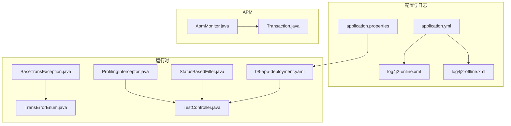
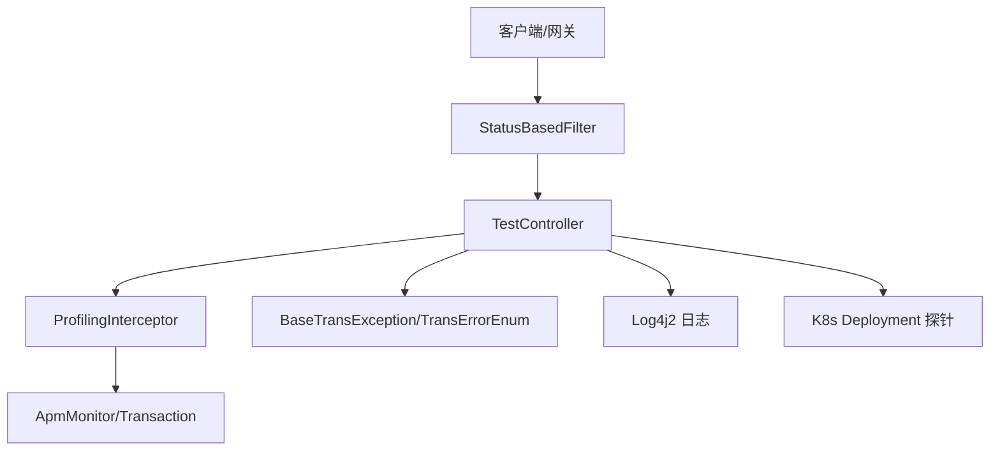
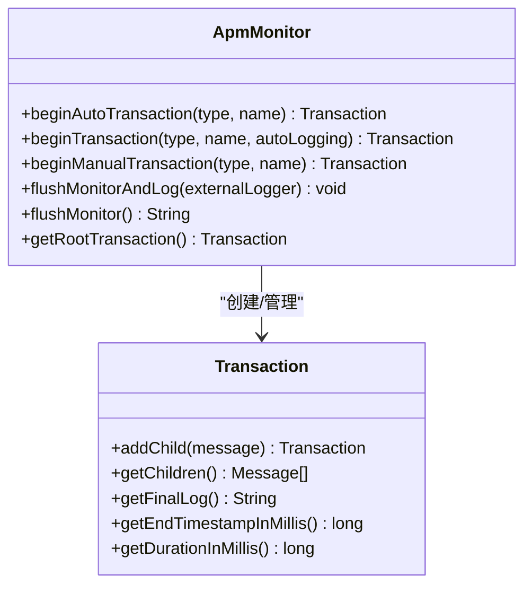
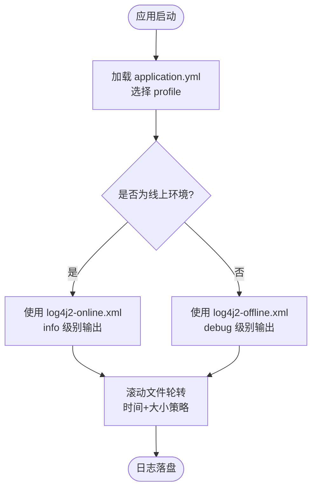
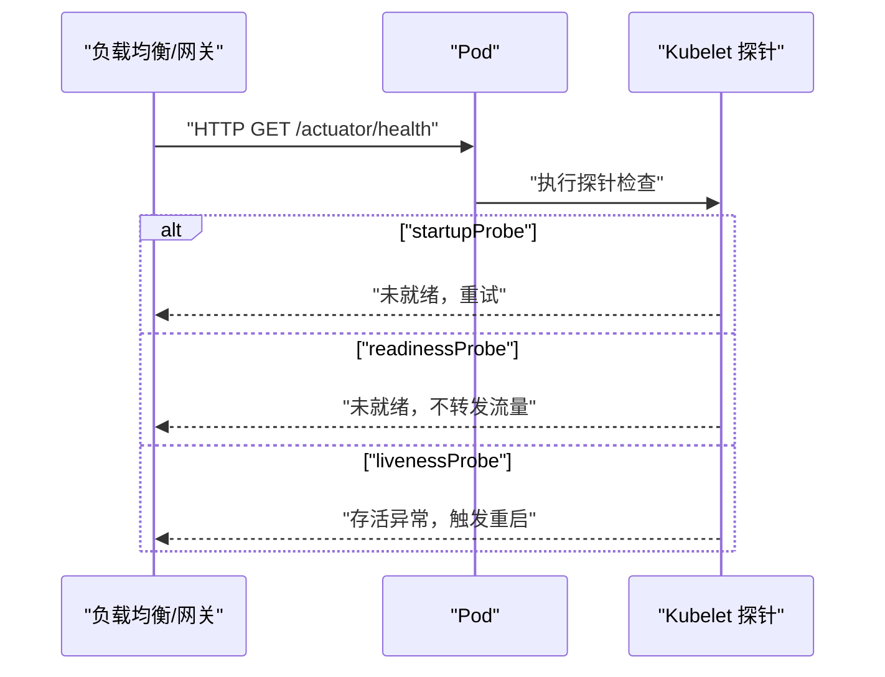
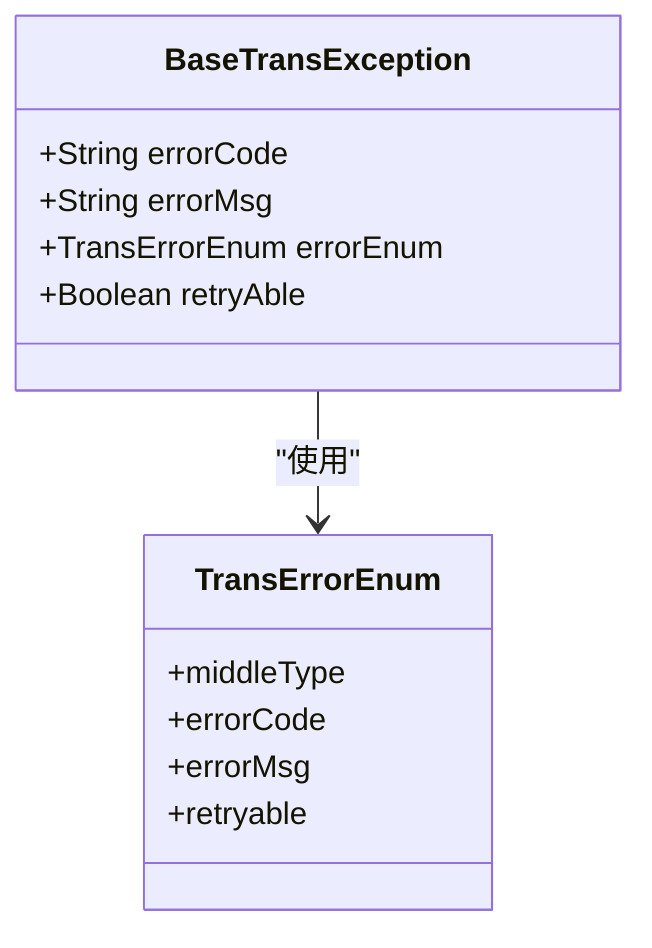
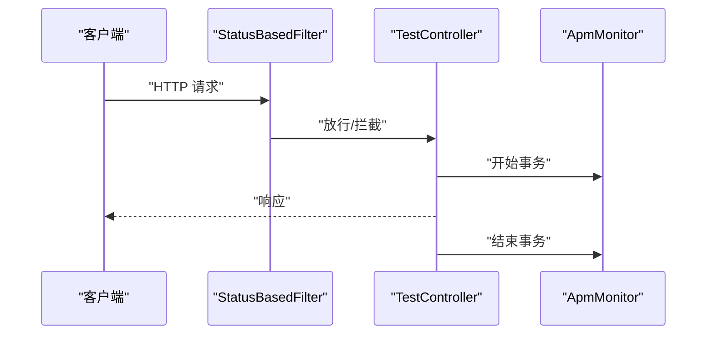
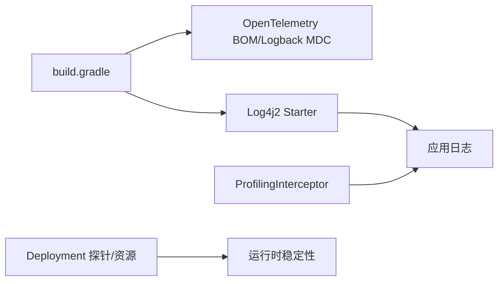

# 监控告警配置

<cite>
**本文引用的文件**
- [application.yml](file://biz-service-impl/src/main/resources/application.yml)
- [application.properties](file://biz-service-impl/src/main/resources/application.properties)
- [log4j2-online.xml](file://biz-service-impl/src/main/resources/log4j2/log4j2-online.xml)
- [log4j2-offline.xml](file://biz-service-impl/src/main/resources/log4j2/log4j2-offline.xml)
- [ApmMonitor.java](file://common-util/src/main/java/com/magicliang/transaction/sys/common/util/apm/ApmMonitor.java)
- [Transaction.java](file://common-util/src/main/java/com/magicliang/transaction/sys/common/util/apm/Transaction.java)
- [ProfilingInterceptor.java](file://core-service/src/main/java/com/magicliang/transaction/sys/aop/advice/ProfilingInterceptor.java)
- [08-app-deployment.yaml](file://deploy/k8s/prod/08-app-deployment.yaml)
- [build.gradle](file://build.gradle)
- [BaseTransException.java](file://common-util/src/main/java/com/magicliang/transaction/sys/common/exception/BaseTransException.java)
- [TransErrorEnum.java](file://common-util/src/main/java/com/magicliang/transaction/sys/common/enums/TransErrorEnum.java)
- [StatusBasedFilter.java](file://biz-service-impl/src/main/java/com/magicliang/transaction/sys/biz/service/impl/web/filter/StatusBasedFilter.java)
- [TestController.java](file://biz-service-impl/src/main/java/com/magicliang/transaction/sys/biz/service/impl/web/controller/TestController.java)
</cite>

## 目录
1. [简介](#简介)
2. [项目结构](#项目结构)
3. [核心组件](#核心组件)
4. [架构总览](#架构总览)
5. [详细组件分析](#详细组件分析)
6. [依赖分析](#依赖分析)
7. [性能考量](#性能考量)
8. [故障排查指南](#故障排查指南)
9. [结论](#结论)
10. [附录](#附录)

## 简介
本文件面向生产环境的可观测性体系建设，围绕本项目的监控告警配置进行全面梳理与落地建议。内容涵盖：
- APM 监控工具的集成与配置：性能指标采集、错误追踪与分布式链路监控
- 日志管理策略：日志级别、日志轮转与集中化收集
- 告警规则设计与阈值设定：CPU、内存、请求延迟、错误率等关键指标
- Prometheus 与 Grafana 的集成配置：监控仪表板与告警通知
- 故障排查流程与应急响应预案：确保系统稳定运行

## 项目结构
本项目采用多模块 Gradle 结构，可观测性相关的关键位置如下：
- 配置层：application.yml 与 application.properties 提供环境化配置与资源属性
- 日志层：log4j2-online.xml 与 log4j2-offline.xml 定义线上/线下日志策略
- APM 层：ApmMonitor 与 Transaction 提供事务级监控能力
- 健康探针与容器编排：Kubernetes Deployment 中的健康检查与资源限制
- 异常与错误码：BaseTransException 与 TransErrorEnum 提供统一错误模型
- 过滤器与控制器：StatusBasedFilter 与 TestController 体现请求生命周期与错误处理

**图表来源**
- [application.yml:1-216](file://biz-service-impl/src/main/resources/application.yml#L1-L216)
- [application.properties:1-14](file://biz-service-impl/src/main/resources/application.properties#L1-L14)
- [log4j2-online.xml:1-50](file://biz-service-impl/src/main/resources/log4j2/log4j2-online.xml#L1-L50)
- [log4j2-offline.xml:1-56](file://biz-service-impl/src/main/resources/log4j2/log4j2-offline.xml#L1-L56)
- [ApmMonitor.java:1-233](file://common-util/src/main/java/com/magicliang/transaction/sys/common/util/apm/ApmMonitor.java#L1-L233)
- [Transaction.java:1-62](file://common-util/src/main/java/com/magicliang/transaction/sys/common/util/apm/Transaction.java#L1-L62)
- [ProfilingInterceptor.java:1-43](file://core-service/src/main/java/com/magicliang/transaction/sys/aop/advice/ProfilingInterceptor.java#L1-L43)
- [08-app-deployment.yaml:1-72](file://deploy/k8s/prod/08-app-deployment.yaml#L1-L72)
- [BaseTransException.java:1-60](file://common-util/src/main/java/com/magicliang/transaction/sys/common/exception/BaseTransException.java#L1-L60)
- [TransErrorEnum.java:252-296](file://common-util/src/main/java/com/magicliang/transaction/sys/common/enums/TransErrorEnum.java#L252-L296)
- [StatusBasedFilter.java:20-50](file://biz-service-impl/src/main/java/com/magicliang/transaction/sys/biz/service/impl/web/filter/StatusBasedFilter.java#L20-L50)
- [TestController.java:38-85](file://biz-service-impl/src/main/java/com/magicliang/transaction/sys/biz/service/impl/web/controller/TestController.java#L38-L85)

**章节来源**
- [application.yml:1-216](file://biz-service-impl/src/main/resources/application.yml#L1-L216)
- [application.properties:1-14](file://biz-service-impl/src/main/resources/application.properties#L1-L14)
- [log4j2-online.xml:1-50](file://biz-service-impl/src/main/resources/log4j2/log4j2-online.xml#L1-L50)
- [log4j2-offline.xml:1-56](file://biz-service-impl/src/main/resources/log4j2/log4j2-offline.xml#L1-L56)
- [ApmMonitor.java:1-233](file://common-util/src/main/java/com/magicliang/transaction/sys/common/util/apm/ApmMonitor.java#L1-L233)
- [Transaction.java:1-62](file://common-util/src/main/java/com/magicliang/transaction/sys/common/util/apm/Transaction.java#L1-L62)
- [ProfilingInterceptor.java:1-43](file://core-service/src/main/java/com/magicliang/transaction/sys/aop/advice/ProfilingInterceptor.java#L1-L43)
- [08-app-deployment.yaml:1-72](file://deploy/k8s/prod/08-app-deployment.yaml#L1-L72)
- [BaseTransException.java:1-60](file://common-util/src/main/java/com/magicliang/transaction/sys/common/exception/BaseTransException.java#L1-L60)
- [TransErrorEnum.java:252-296](file://common-util/src/main/java/com/magicliang/transaction/sys/common/enums/TransErrorEnum.java#L252-L296)
- [StatusBasedFilter.java:20-50](file://biz-service-impl/src/main/java/com/magicliang/transaction/sys/biz/service/impl/web/filter/StatusBasedFilter.java#L20-L50)
- [TestController.java:38-85](file://biz-service-impl/src/main/java/com/magicliang/transaction/sys/biz/service/impl/web/controller/TestController.java#L38-L85)

## 核心组件
- APM 监控器与事务接口：提供基于线程上下文的事务树构建、自动/手动事务创建、最终日志输出与清理
- 日志配置：线上/线下两套 Log4j2 配置，分别针对生产与开发环境的输出级别与轮转策略
- 健康探针与资源：Kubernetes Deployment 中的启动、就绪与存活探针，以及 CPU/内存资源限制
- 异常与错误码：统一异常模型与错误码枚举，便于错误追踪与告警归因
- 过滤器与控制器：基于 Servlet 过滤器的错误处理与日志记录，控制器提供健康检查入口

**章节来源**
- [ApmMonitor.java:42-233](file://common-util/src/main/java/com/magicliang/transaction/sys/common/util/apm/ApmMonitor.java#L42-L233)
- [Transaction.java:18-62](file://common-util/src/main/java/com/magicliang/transaction/sys/common/util/apm/Transaction.java#L18-L62)
- [log4j2-online.xml:37-48](file://biz-service-impl/src/main/resources/log4j2/log4j2-online.xml#L37-L48)
- [log4j2-offline.xml:40-53](file://biz-service-impl/src/main/resources/log4j2/log4j2-offline.xml#L40-L53)
- [08-app-deployment.yaml:52-71](file://deploy/k8s/prod/08-app-deployment.yaml#L52-L71)
- [BaseTransException.java:21-60](file://common-util/src/main/java/com/magicliang/transaction/sys/common/exception/BaseTransException.java#L21-L60)
- [TransErrorEnum.java:252-296](file://common-util/src/main/java/com/magicliang/transaction/sys/common/enums/TransErrorEnum.java#L252-L296)
- [StatusBasedFilter.java:38-50](file://biz-service-impl/src/main/java/com/magicliang/transaction/sys/biz/service/impl/web/filter/StatusBasedFilter.java#L38-L50)
- [TestController.java:65-85](file://biz-service-impl/src/main/java/com/magicliang/transaction/sys/biz/service/impl/web/controller/TestController.java#L65-L85)

## 架构总览
本项目的可观测性体系由“配置—日志—APM—运行时—异常—容器编排”构成，形成从请求入口到日志与链路追踪的闭环。

**图表来源**
- [StatusBasedFilter.java:38-50](file://biz-service-impl/src/main/java/com/magicliang/transaction/sys/biz/service/impl/web/filter/StatusBasedFilter.java#L38-L50)
- [TestController.java:65-85](file://biz-service-impl/src/main/java/com/magicliang/transaction/sys/biz/service/impl/web/controller/TestController.java#L65-L85)
- [ProfilingInterceptor.java:34-41](file://core-service/src/main/java/com/magicliang/transaction/sys/aop/advice/ProfilingInterceptor.java#L34-L41)
- [ApmMonitor.java:82-96](file://common-util/src/main/java/com/magicliang/transaction/sys/common/util/apm/ApmMonitor.java#L82-L96)
- [Transaction.java:18-62](file://common-util/src/main/java/com/magicliang/transaction/sys/common/util/apm/Transaction.java#L18-L62)
- [BaseTransException.java:21-60](file://common-util/src/main/java/com/magicliang/transaction/sys/common/exception/BaseTransException.java#L21-L60)
- [log4j2-online.xml:37-48](file://biz-service-impl/src/main/resources/log4j2/log4j2-online.xml#L37-L48)
- [08-app-deployment.yaml:52-71](file://deploy/k8s/prod/08-app-deployment.yaml#L52-L71)

## 详细组件分析

### APM 监控工具集成与配置
- 设计理念：通过 Composite 模式将操作封装为事务，统一输出监控日志，支持自动/手动两种事务创建方式
- 线程上下文：使用 ThreadLocal 维护事务树，根事务在首次创建时注入，后续事务按父子关系追加
- 输出与清理：complete 触发最终日志生成与上下文清理，避免污染
- 使用建议：
  - 在对外服务入口与关键业务方法包裹事务，确保热点与耗时可追踪
  - 结合 ProfilingInterceptor 记录方法耗时，辅助定位慢调用
  - 在异常路径中结合 BaseTransException/TransErrorEnum，实现错误维度的链路标注

**图表来源**
- [ApmMonitor.java:70-107](file://common-util/src/main/java/com/magicliang/transaction/sys/common/util/apm/ApmMonitor.java#L70-L107)
- [Transaction.java:18-62](file://common-util/src/main/java/com/magicliang/transaction/sys/common/util/apm/Transaction.java#L18-L62)

**章节来源**
- [ApmMonitor.java:70-233](file://common-util/src/main/java/com/magicliang/transaction/sys/common/util/apm/ApmMonitor.java#L70-L233)
- [Transaction.java:18-62](file://common-util/src/main/java/com/magicliang/transaction/sys/common/util/apm/Transaction.java#L18-L62)
- [ProfilingInterceptor.java:34-41](file://core-service/src/main/java/com/magicliang/transaction/sys/aop/advice/ProfilingInterceptor.java#L34-L41)
- [BaseTransException.java:21-60](file://common-util/src/main/java/com/magicliang/transaction/sys/common/exception/BaseTransException.java#L21-L60)
- [TransErrorEnum.java:252-296](file://common-util/src/main/java/com/magicliang/transaction/sys/common/enums/TransErrorEnum.java#L252-L296)

### 日志管理策略
- 线上策略（log4j2-online.xml）：
  - 输出级别：info 及以上
  - 控制台与滚动文件双通道，文件按日期轮转，大小达到阈值触发轮转
  - 根日志器与业务包日志器均启用
- 线下策略（log4j2-offline.xml）：
  - 输出级别：debug 及以上，便于开发调试
  - 控制台与滚动文件双通道，文件按日期轮转，大小达到阈值触发轮转
  - Spring 相关包开启 debug 以便排查框架层面问题
- 环境切换：
  - application.yml 中通过 profile 切换线上/线下配置文件
  - 生产环境默认加载线上配置，避免过度日志输出

**图表来源**
- [application.yml:48-80](file://biz-service-impl/src/main/resources/application.yml#L48-L80)
- [log4j2-online.xml:37-48](file://biz-service-impl/src/main/resources/log4j2/log4j2-online.xml#L37-L48)
- [log4j2-offline.xml:40-53](file://biz-service-impl/src/main/resources/log4j2/log4j2-offline.xml#L40-L53)

**章节来源**
- [application.yml:48-80](file://biz-service-impl/src/main/resources/application.yml#L48-L80)
- [log4j2-online.xml:37-48](file://biz-service-impl/src/main/resources/log4j2/log4j2-online.xml#L37-L48)
- [log4j2-offline.xml:40-53](file://biz-service-impl/src/main/resources/log4j2/log4j2-offline.xml#L40-L53)

### 健康检查与容器编排
- 健康探针：
  - startupProbe：通过 /actuator/health 探活，失败阈值与周期设置保证启动期稳定性
  - readinessProbe：就绪检查，确保流量仅在服务完全准备后进入
  - livenessProbe：存活检查，异常时自动重启
- 资源限制：
  - requests/limits 设置 CPU 与内存，避免资源争抢导致抖动
- 建议：
  - 将 /actuator/health 与业务健康端点解耦，确保探针不计入业务指标
  - 结合 APM 与日志，定位探针失败的根因（超时、连接池耗尽、GC 抖动）

**图表来源**
- [08-app-deployment.yaml:52-71](file://deploy/k8s/prod/08-app-deployment.yaml#L52-L71)

**章节来源**
- [08-app-deployment.yaml:52-71](file://deploy/k8s/prod/08-app-deployment.yaml#L52-L71)

### 异常与错误追踪
- 统一异常模型：BaseTransException 携带错误码、错误信息与可重试标记
- 错误码枚举：TransErrorEnum 定义业务错误分类，便于告警分级与统计
- 建议：
  - 在 APM 事务中附加错误码与错误信息，形成“链路+错误”的双维观测
  - 将异常转换为结构化日志，便于检索与聚合

**图表来源**
- [BaseTransException.java:21-60](file://common-util/src/main/java/com/magicliang/transaction/sys/common/exception/BaseTransException.java#L21-L60)
- [TransErrorEnum.java:252-296](file://common-util/src/main/java/com/magicliang/transaction/sys/common/enums/TransErrorEnum.java#L252-L296)

**章节来源**
- [BaseTransException.java:21-60](file://common-util/src/main/java/com/magicliang/transaction/sys/common/exception/BaseTransException.java#L21-L60)
- [TransErrorEnum.java:252-296](file://common-util/src/main/java/com/magicliang/transaction/sys/common/enums/TransErrorEnum.java#L252-L296)

### 请求生命周期与错误处理
- 过滤器：StatusBasedFilter 在请求生命周期中拦截并处理状态码，避免 Spring 原生方案的局限
- 控制器：TestController 提供健康检查端点，便于探针与人工验证
- 建议：
  - 在过滤器中记录请求上下文与状态码，结合 APM 事务形成端到端画像
  - 将健康检查端点与业务端点分离，避免探针干扰业务指标

**图表来源**
- [StatusBasedFilter.java:38-50](file://biz-service-impl/src/main/java/com/magicliang/transaction/sys/biz/service/impl/web/filter/StatusBasedFilter.java#L38-L50)
- [TestController.java:65-85](file://biz-service-impl/src/main/java/com/magicliang/transaction/sys/biz/service/impl/web/controller/TestController.java#L65-L85)
- [ApmMonitor.java:82-96](file://common-util/src/main/java/com/magicliang/transaction/sys/common/util/apm/ApmMonitor.java#L82-L96)

**章节来源**
- [StatusBasedFilter.java:38-50](file://biz-service-impl/src/main/java/com/magicliang/transaction/sys/biz/service/impl/web/filter/StatusBasedFilter.java#L38-L50)
- [TestController.java:65-85](file://biz-service-impl/src/main/java/com/magicliang/transaction/sys/biz/service/impl/web/controller/TestController.java#L65-L85)

## 依赖分析
- Gradle 依赖：
  - OpenTelemetry Instrumentation BOM 与 Logback MDC 适配，为后续接入 Prometheus/OpenTelemetry 做准备
  - 排除 Spring Boot 默认日志实现，统一使用 Log4j2
- 运行时依赖：
  - AOP 切面（ProfilingInterceptor）与日志（Log4j2）共同构成性能与可观测性基础
  - Kubernetes Deployment 依赖健康探针与资源限制保障稳定性

**图表来源**
- [build.gradle:216-219](file://build.gradle#L216-L219)
- [ProfilingInterceptor.java:34-41](file://core-service/src/main/java/com/magicliang/transaction/sys/aop/advice/ProfilingInterceptor.java#L34-L41)
- [log4j2-online.xml:37-48](file://biz-service-impl/src/main/resources/log4j2/log4j2-online.xml#L37-L48)
- [08-app-deployment.yaml:52-71](file://deploy/k8s/prod/08-app-deployment.yaml#L52-L71)

**章节来源**
- [build.gradle:216-219](file://build.gradle#L216-L219)
- [ProfilingInterceptor.java:34-41](file://core-service/src/main/java/com/magicliang/transaction/sys/aop/advice/ProfilingInterceptor.java#L34-L41)
- [log4j2-online.xml:37-48](file://biz-service-impl/src/main/resources/log4j2/log4j2-online.xml#L37-L48)
- [08-app-deployment.yaml:52-71](file://deploy/k8s/prod/08-app-deployment.yaml#L52-L71)

## 性能考量
- 线程与连接：
  - application.properties 中 Tomcat 线程池与连接超时参数较大，适用于高并发场景，需结合压测评估
- 日志开销：
  - 线上环境 info 级别与滚动文件策略降低 IO 压力；线下 debug 级别便于问题定位
- APM 与切面：
  - ProfilingInterceptor 记录方法耗时，建议在热点路径使用，避免过度采样造成额外开销
- 健康探针：
  - 合理设置探针周期与超时，避免探针自身成为瓶颈

**章节来源**
- [application.properties:10-14](file://biz-service-impl/src/main/resources/application.properties#L10-L14)
- [log4j2-online.xml:37-48](file://biz-service-impl/src/main/resources/log4j2/log4j2-online.xml#L37-L48)
- [ProfilingInterceptor.java:34-41](file://core-service/src/main/java/com/magicliang/transaction/sys/aop/advice/ProfilingInterceptor.java#L34-L41)
- [08-app-deployment.yaml:52-71](file://deploy/k8s/prod/08-app-deployment.yaml#L52-L71)

## 故障排查指南
- 健康检查失败
  - 检查 /actuator/health 返回状态与日志
  - 核对 startupProbe/readinessProbe/livenessProbe 配置
  - 结合 APM 事务查看启动阶段耗时与异常
- 请求超时/慢调用
  - 查看 ProfilingInterceptor 记录的耗时
  - 结合 APM 事务树定位慢调用链路
  - 检查数据库连接池与 SQL 执行情况
- 日志异常
  - 确认当前 profile 对应的日志配置文件
  - 检查滚动文件策略与磁盘空间
- 错误码统计
  - 通过 TransErrorEnum 分类统计错误率
  - 在告警中按错误码与服务维度进行分级

**章节来源**
- [08-app-deployment.yaml:52-71](file://deploy/k8s/prod/08-app-deployment.yaml#L52-L71)
- [ProfilingInterceptor.java:34-41](file://core-service/src/main/java/com/magicliang/transaction/sys/aop/advice/ProfilingInterceptor.java#L34-L41)
- [ApmMonitor.java:210-222](file://common-util/src/main/java/com/magicliang/transaction/sys/common/util/apm/ApmMonitor.java#L210-L222)
- [TransErrorEnum.java:252-296](file://common-util/src/main/java/com/magicliang/transaction/sys/common/enums/TransErrorEnum.java#L252-L296)

## 结论
本项目已具备可观测性的基础能力：统一的日志策略、事务级 APM、健康探针与资源限制。建议在现有基础上进一步完善：
- 接入 Prometheus 与 Grafana，建立关键指标面板（CPU/内存/请求延迟/错误率）
- 设计告警规则与阈值，结合错误码与链路维度进行分级告警
- 将 OpenTelemetry 与日志、指标、链路打通，形成统一的观测平台

## 附录
- 配置要点速查
  - 线上/线下日志：application.yml 与 log4j2 配置文件
  - APM：ApmMonitor/Transaction 使用规范
  - 健康探针：Kubernetes Deployment 中的探针配置
  - 异常模型：BaseTransException 与 TransErrorEnum 的错误分类

**章节来源**
- [application.yml:48-80](file://biz-service-impl/src/main/resources/application.yml#L48-L80)
- [log4j2-online.xml:37-48](file://biz-service-impl/src/main/resources/log4j2/log4j2-online.xml#L37-L48)
- [log4j2-offline.xml:40-53](file://biz-service-impl/src/main/resources/log4j2/log4j2-offline.xml#L40-L53)
- [ApmMonitor.java:70-107](file://common-util/src/main/java/com/magicliang/transaction/sys/common/util/apm/ApmMonitor.java#L70-L107)
- [Transaction.java:18-62](file://common-util/src/main/java/com/magicliang/transaction/sys/common/util/apm/Transaction.java#L18-L62)
- [08-app-deployment.yaml:52-71](file://deploy/k8s/prod/08-app-deployment.yaml#L52-L71)
- [BaseTransException.java:21-60](file://common-util/src/main/java/com/magicliang/transaction/sys/common/exception/BaseTransException.java#L21-L60)
- [TransErrorEnum.java:252-296](file://common-util/src/main/java/com/magicliang/transaction/sys/common/enums/TransErrorEnum.java#L252-L296)