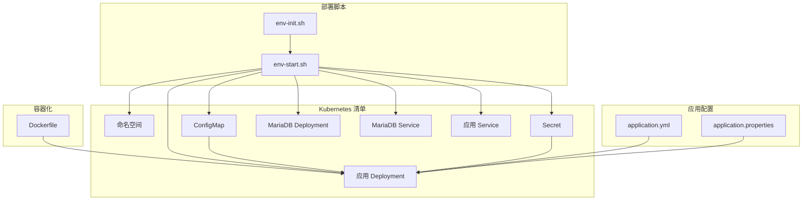
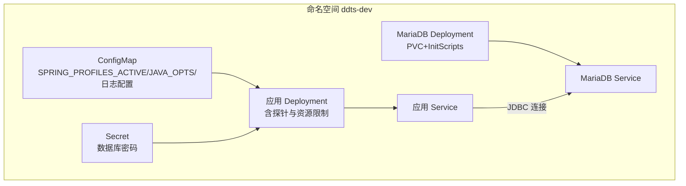
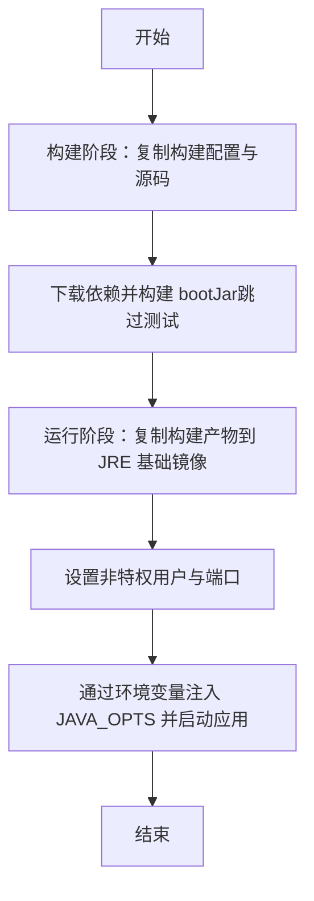
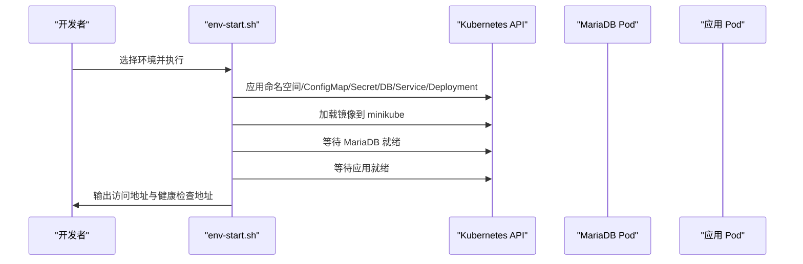
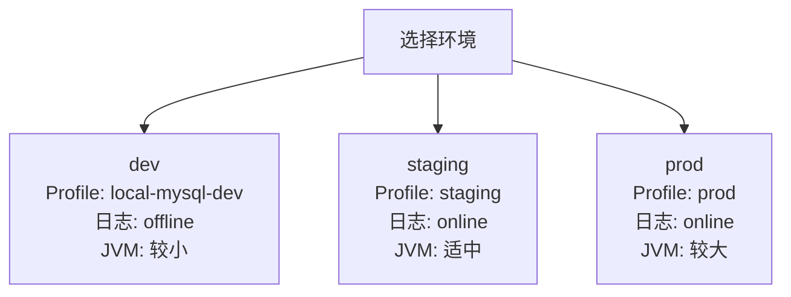
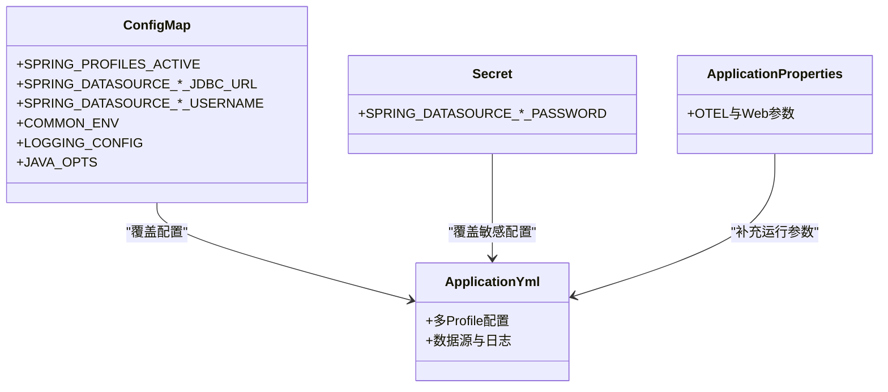
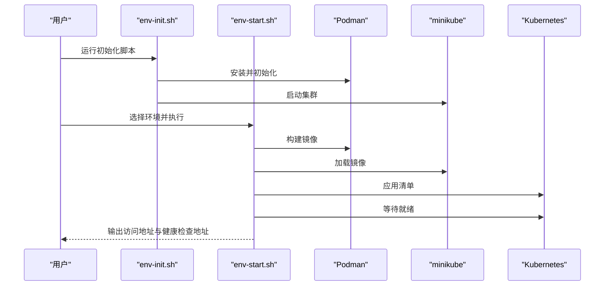
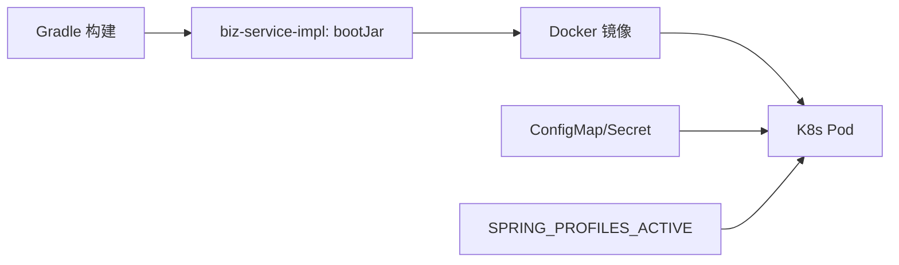

# 部署配置

<cite>
**本文引用的文件**
- [Dockerfile](file://deploy/docker/Dockerfile)
- [08-app-deployment.yaml](file://deploy/k8s/dev/08-app-deployment.yaml)
- [09-app-service.yaml](file://deploy/k8s/dev/09-app-service.yaml)
- [06-app-configmap.yaml（dev）](file://deploy/k8s/dev/06-app-configmap.yaml)
- [07-app-secret.yaml（dev）](file://deploy/k8s/dev/07-app-secret.yaml)
- [00-namespace.yaml（dev）](file://deploy/k8s/dev/00-namespace.yaml)
- [04-mariadb-deployment.yaml（dev）](file://deploy/k8s/dev/04-mariadb-deployment.yaml)
- [05-mariadb-service.yaml（dev）](file://deploy/k8s/dev/05-mariadb-service.yaml)
- [06-app-configmap.yaml（staging）](file://deploy/k8s/staging/06-app-configmap.yaml)
- [06-app-configmap.yaml（prod）](file://deploy/k8s/prod/06-app-configmap.yaml)
- [env-init.sh](file://deploy/scripts/env-init.sh)
- [env-start.sh](file://deploy/scripts/env-start.sh)
- [build.gradle](file://build.gradle)
- [application.yml](file://biz-service-impl/src/main/resources/application.yml)
- [application.properties](file://biz-service-impl/src/main/resources/application.properties)
</cite>

## 目录
1. [简介](#简介)
2. [项目结构](#项目结构)
3. [核心组件](#核心组件)
4. [架构总览](#架构总览)
5. [详细组件分析](#详细组件分析)
6. [依赖关系分析](#依赖关系分析)
7. [性能考量](#性能考量)
8. [故障排查指南](#故障排查指南)
9. [结论](#结论)
10. [附录](#附录)

## 简介
本指南面向领域驱动交易系统（Domain-Driven Transaction System），提供从容器化到 Kubernetes 的全栈部署方案。内容涵盖：
- Dockerfile 两阶段构建设计与运行时优化
- Kubernetes 清单设计与实现（命名空间、Deployment、Service、ConfigMap、Secret）
- 多环境部署策略（dev/staging/prod）与差异化配置
- 环境变量管理与 Spring Profile 适配
- 一键部署脚本使用指南（初始化、启动、停止、状态检查）
- 监控与日志策略建议（基于现有配置）

## 项目结构
围绕部署的关键目录与文件如下：
- 容器化：deploy/docker/Dockerfile
- K8s 清单：deploy/k8s/{dev,staging,prod}/{00~09}-*.yaml
- 部署脚本：deploy/scripts/{env-init.sh, env-start.sh}
- 应用配置：biz-service-impl/src/main/resources/application.yml、application.properties
- 构建配置：build.gradle

图表来源
- [Dockerfile:1-50](file://deploy/docker/Dockerfile#L1-L50)
- [08-app-deployment.yaml:1-72](file://deploy/k8s/dev/08-app-deployment.yaml#L1-L72)
- [09-app-service.yaml:1-18](file://deploy/k8s/dev/09-app-service.yaml#L1-L18)
- [06-app-configmap.yaml（dev）:1-22](file://deploy/k8s/dev/06-app-configmap.yaml#L1-L22)
- [07-app-secret.yaml（dev）:1-14](file://deploy/k8s/dev/07-app-secret.yaml#L1-L14)
- [04-mariadb-deployment.yaml（dev）:1-74](file://deploy/k8s/dev/04-mariadb-deployment.yaml#L1-L74)
- [05-mariadb-service.yaml（dev）:1-18](file://deploy/k8s/dev/05-mariadb-service.yaml#L1-L18)
- [env-init.sh:1-333](file://deploy/scripts/env-init.sh#L1-L333)
- [env-start.sh:1-284](file://deploy/scripts/env-start.sh#L1-L284)
- [application.yml:1-216](file://biz-service-impl/src/main/resources/application.yml#L1-L216)
- [application.properties:1-14](file://biz-service-impl/src/main/resources/application.properties#L1-L14)

章节来源
- [Dockerfile:1-50](file://deploy/docker/Dockerfile#L1-L50)
- [env-init.sh:1-333](file://deploy/scripts/env-init.sh#L1-L333)
- [env-start.sh:1-284](file://deploy/scripts/env-start.sh#L1-L284)

## 核心组件
- 容器镜像构建：基于两阶段构建，第一阶段使用 JDK 构建 bootJar，第二阶段使用轻量 JRE 运行，暴露应用端口并支持通过环境变量注入 JVM 参数。
- 应用部署：Kubernetes Deployment 配置健康探针（startup/readiness/liveness）、资源请求与限制、环境变量从 ConfigMap/Secret 注入。
- 数据库服务：内置 MariaDB Deployment/Service，配合 PVC 与初始化脚本。
- 多环境配置：dev/staging/prod 各自独立命名空间与 ConfigMap/Secret，通过 Spring Profile 实现差异化配置。
- 部署脚本：一键初始化开发环境工具链、构建镜像、加载至 minikube、部署并建立 LoadBalancer 访问隧道。

章节来源
- [Dockerfile:1-50](file://deploy/docker/Dockerfile#L1-L50)
- [08-app-deployment.yaml:1-72](file://deploy/k8s/dev/08-app-deployment.yaml#L1-L72)
- [04-mariadb-deployment.yaml（dev）:1-74](file://deploy/k8s/dev/04-mariadb-deployment.yaml#L1-L74)
- [06-app-configmap.yaml（dev）:1-22](file://deploy/k8s/dev/06-app-configmap.yaml#L1-L22)
- [07-app-secret.yaml（dev）:1-14](file://deploy/k8s/dev/07-app-secret.yaml#L1-L14)
- [env-start.sh:1-284](file://deploy/scripts/env-start.sh#L1-L284)

## 架构总览
下图展示应用与数据库在 Kubernetes 中的交互关系，以及环境变量与配置注入路径。

图表来源
- [08-app-deployment.yaml:1-72](file://deploy/k8s/dev/08-app-deployment.yaml#L1-L72)
- [09-app-service.yaml:1-18](file://deploy/k8s/dev/09-app-service.yaml#L1-L18)
- [06-app-configmap.yaml（dev）:1-22](file://deploy/k8s/dev/06-app-configmap.yaml#L1-L22)
- [07-app-secret.yaml（dev）:1-14](file://deploy/k8s/dev/07-app-secret.yaml#L1-L14)
- [04-mariadb-deployment.yaml（dev）:1-74](file://deploy/k8s/dev/04-mariadb-deployment.yaml#L1-L74)
- [05-mariadb-service.yaml（dev）:1-18](file://deploy/k8s/dev/05-mariadb-service.yaml#L1-L18)

## 详细组件分析

### Dockerfile 两阶段构建
- 第一阶段（builder）
  - 基于 JDK 镜像，复制构建脚本与 Gradle 配置，缓存依赖层；随后复制源码并执行构建，跳过测试以避免 Docker-in-Docker 问题。
- 第二阶段（runtime）
  - 基于 JRE 镜像，创建非特权用户，复制构建产物，设置运行用户与端口暴露；通过入口命令支持从环境变量注入 JVM 参数（如内存配置）。

图表来源
- [Dockerfile:1-50](file://deploy/docker/Dockerfile#L1-L50)

章节来源
- [Dockerfile:1-50](file://deploy/docker/Dockerfile#L1-L50)

### Kubernetes 清单设计与实现
- 命名空间
  - 每个环境一个命名空间，便于资源隔离与权限控制。
- MariaDB
  - Deployment 使用持久卷与初始化脚本挂载；Service 为 ClusterIP，供应用内部访问。
- 应用
  - Deployment 包含 initContainer 等待数据库就绪；容器定义健康探针、资源限制与请求；通过 envFrom 从 ConfigMap/Secret 注入环境变量。
  - Service 类型为 LoadBalancer，结合脚本启动隧道以获得外部访问地址。

图表来源
- [env-start.sh:1-284](file://deploy/scripts/env-start.sh#L1-L284)
- [04-mariadb-deployment.yaml（dev）:1-74](file://deploy/k8s/dev/04-mariadb-deployment.yaml#L1-L74)
- [08-app-deployment.yaml:1-72](file://deploy/k8s/dev/08-app-deployment.yaml#L1-L72)
- [09-app-service.yaml:1-18](file://deploy/k8s/dev/09-app-service.yaml#L1-L18)

章节来源
- [00-namespace.yaml（dev）:1-8](file://deploy/k8s/dev/00-namespace.yaml#L1-L8)
- [04-mariadb-deployment.yaml（dev）:1-74](file://deploy/k8s/dev/04-mariadb-deployment.yaml#L1-L74)
- [05-mariadb-service.yaml（dev）:1-18](file://deploy/k8s/dev/05-mariadb-service.yaml#L1-L18)
- [08-app-deployment.yaml:1-72](file://deploy/k8s/dev/08-app-deployment.yaml#L1-L72)
- [09-app-service.yaml:1-18](file://deploy/k8s/dev/09-app-service.yaml#L1-L18)

### 多环境部署策略
- dev
  - Profile：local-mysql-dev
  - 日志：offline（便于调试）
  - JVM：较小堆内存
- staging
  - Profile：staging
  - 日志：online（生产级）
  - JVM：适中堆内存
- prod
  - Profile：prod
  - 日志：online
  - JVM：较大堆内存

图表来源
- [06-app-configmap.yaml（dev）:1-22](file://deploy/k8s/dev/06-app-configmap.yaml#L1-L22)
- [06-app-configmap.yaml（staging）:1-22](file://deploy/k8s/staging/06-app-configmap.yaml#L1-L22)
- [06-app-configmap.yaml（prod）:1-22](file://deploy/k8s/prod/06-app-configmap.yaml#L1-L22)

章节来源
- [06-app-configmap.yaml（dev）:1-22](file://deploy/k8s/dev/06-app-configmap.yaml#L1-L22)
- [06-app-configmap.yaml（staging）:1-22](file://deploy/k8s/staging/06-app-configmap.yaml#L1-L22)
- [06-app-configmap.yaml（prod）:1-22](file://deploy/k8s/prod/06-app-configmap.yaml#L1-L22)

### 环境变量管理与配置覆盖机制
- ConfigMap
  - 注入 Spring Profile、数据库连接串、用户名、池名、通用环境标识、日志配置路径、JVM 参数等。
- Secret
  - 注入数据库密码等敏感信息。
- Spring Profile
  - 通过环境变量 SPRING_PROFILES_ACTIVE 激活不同 profile，实现配置覆盖与差异化行为。
- 应用内配置
  - application.yml 定义多 profile 的数据源与日志配置，application.properties 提供运行时参数（如 OTel、Tomcat 线程池、异步超时等）。

图表来源
- [06-app-configmap.yaml（dev）:1-22](file://deploy/k8s/dev/06-app-configmap.yaml#L1-L22)
- [07-app-secret.yaml（dev）:1-14](file://deploy/k8s/dev/07-app-secret.yaml#L1-L14)
- [application.yml:1-216](file://biz-service-impl/src/main/resources/application.yml#L1-L216)
- [application.properties:1-14](file://biz-service-impl/src/main/resources/application.properties#L1-L14)

章节来源
- [06-app-configmap.yaml（dev）:1-22](file://deploy/k8s/dev/06-app-configmap.yaml#L1-L22)
- [07-app-secret.yaml（dev）:1-14](file://deploy/k8s/dev/07-app-secret.yaml#L1-L14)
- [application.yml:1-216](file://biz-service-impl/src/main/resources/application.yml#L1-L216)
- [application.properties:1-14](file://biz-service-impl/src/main/resources/application.properties#L1-L14)

### 部署脚本使用指南
- 初始化环境
  - 自动检测系统与包管理器，安装 JDK、Podman、kubectl、minikube，并启动 minikube（podman 驱动）。
- 启动环境
  - 构建镜像 -> 加载到 minikube -> 应用 K8s 清单 -> 等待 MariaDB 与应用就绪 -> 启动 LoadBalancer 隧道 -> 输出访问地址与健康检查地址。
- 状态检查
  - 查看命名空间、Pods、Services、PVCs 等。
- 销毁环境
  - 删除命名空间（包含持久化数据）。

图表来源
- [env-init.sh:1-333](file://deploy/scripts/env-init.sh#L1-L333)
- [env-start.sh:1-284](file://deploy/scripts/env-start.sh#L1-L284)

章节来源
- [env-init.sh:1-333](file://deploy/scripts/env-init.sh#L1-L333)
- [env-start.sh:1-284](file://deploy/scripts/env-start.sh#L1-L284)

## 依赖关系分析
- 构建与打包
  - Gradle 子项目统一管理依赖与测试框架，根项目配置 Java Toolchain 与仓库镜像，biz-service-impl 产出可部署的 bootJar。
- 容器镜像
  - Dockerfile 仅复制最终产物，避免运行时包含构建依赖，降低镜像体积与攻击面。
- 运行时依赖
  - 应用通过 ConfigMap/Secret 注入数据库连接与日志配置，Spring Profile 控制不同环境行为。

图表来源
- [build.gradle:1-310](file://build.gradle#L1-L310)
- [Dockerfile:1-50](file://deploy/docker/Dockerfile#L1-L50)
- [06-app-configmap.yaml（dev）:1-22](file://deploy/k8s/dev/06-app-configmap.yaml#L1-L22)
- [07-app-secret.yaml（dev）:1-14](file://deploy/k8s/dev/07-app-secret.yaml#L1-L14)

章节来源
- [build.gradle:1-310](file://build.gradle#L1-L310)
- [Dockerfile:1-50](file://deploy/docker/Dockerfile#L1-L50)

## 性能考量
- JVM 参数
  - 通过 ConfigMap 的 JAVA_OPTS 注入堆大小，按环境调整（dev 最小、staging 适中、prod 最大）。
- 资源配额
  - Deployment 设置 requests/limits，避免资源争抢导致抖动。
- 探针策略
  - startupProbe 保证冷启动期间不被误判；readinessProbe 与 livenessProbe 协同，提升滚动更新稳定性。
- 运行时基础镜像
  - 使用 JRE 镜像减少镜像体积与启动时间，降低安全风险。

章节来源
- [08-app-deployment.yaml:1-72](file://deploy/k8s/dev/08-app-deployment.yaml#L1-L72)
- [06-app-configmap.yaml（dev）:1-22](file://deploy/k8s/dev/06-app-configmap.yaml#L1-L22)
- [Dockerfile:1-50](file://deploy/docker/Dockerfile#L1-L50)

## 故障排查指南
- 环境准备
  - 确认 minikube、kubectl、Podman 已安装并可用；若未安装，先运行初始化脚本。
- 镜像加载
  - 若应用镜像拉取失败，确认已通过脚本将镜像加载到 minikube。
- 数据库就绪
  - 应用 Deployment 中包含等待 MariaDB 就绪的 initContainer；若超时，检查 MariaDB Pod 状态与日志。
- 健康检查
  - 通过 Service 外部 IP 访问应用健康端点，或使用脚本输出的健康地址进行验证。
- 日志查看
  - 使用脚本提供的日志命令实时查看应用日志，定位异常。

章节来源
- [env-start.sh:1-284](file://deploy/scripts/env-start.sh#L1-L284)
- [08-app-deployment.yaml:1-72](file://deploy/k8s/dev/08-app-deployment.yaml#L1-L72)

## 结论
本部署方案通过两阶段 Docker 构建、Kubernetes 清单与脚本化部署，实现了从开发到生产的标准化流程。借助 Spring Profile 与 ConfigMap/Secret 的环境化配置，系统具备良好的可维护性与可扩展性。建议在生产环境中进一步完善监控与日志采集策略，以满足高可用与可观测性要求。

## 附录
- 快速操作清单
  - 初始化：./deploy/scripts/env-init.sh
  - 启动 dev：./deploy/scripts/env-start.sh dev
  - 启动 staging：./deploy/scripts/env-start.sh staging
  - 启动 prod：./deploy/scripts/env-start.sh prod
  - 查看状态：./deploy/scripts/env-start.sh <env> --status
  - 销毁环境：./deploy/scripts/env-start.sh <env> --destroy