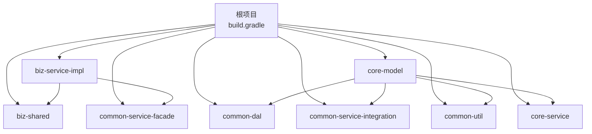
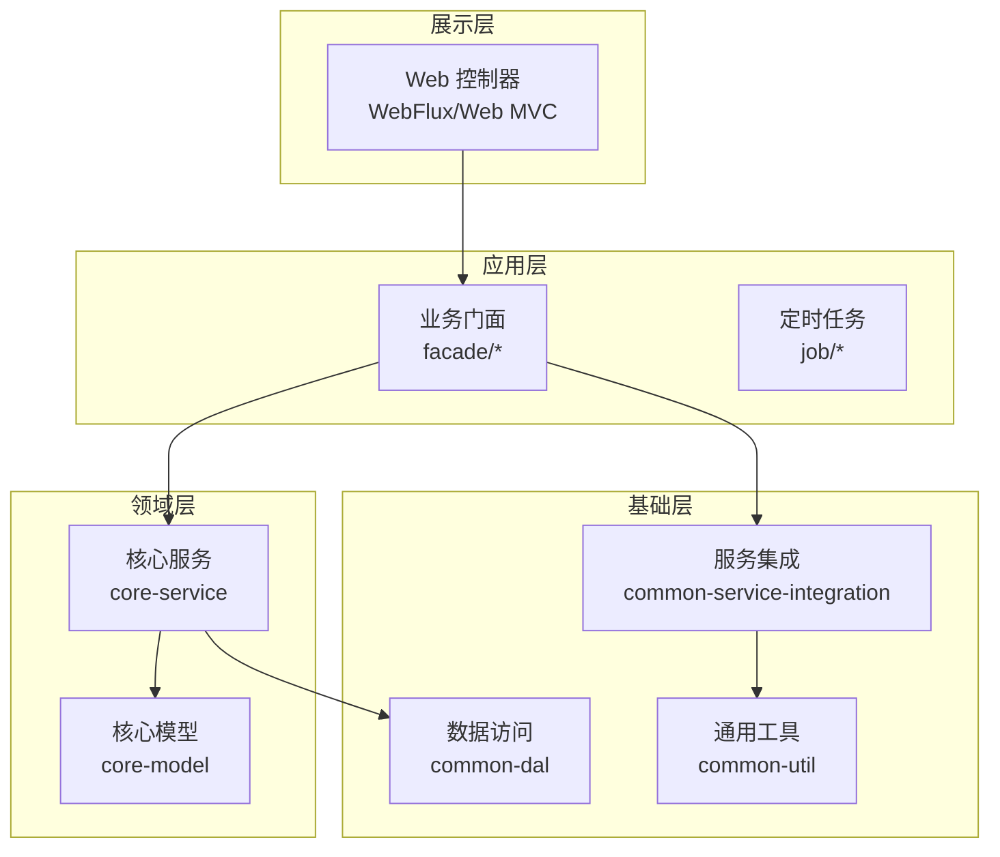
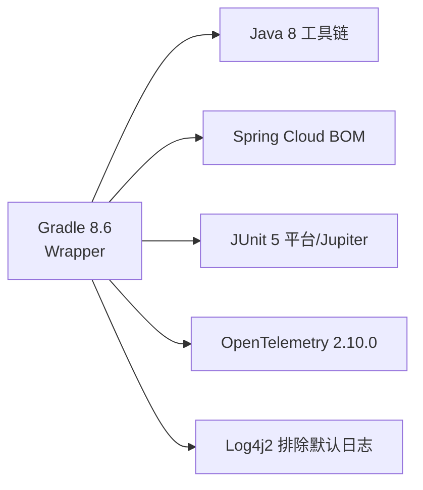

# 快速开始

<cite>
**本文引用的文件**
- [README.md](file://README.md)
- [build.gradle](file://build.gradle)
- [gradle.properties](file://gradle.properties)
- [settings.gradle](file://settings.gradle)
- [gradle-wrapper.properties](file://gradle/wrapper/gradle-wrapper.properties)
- [Dockerfile](file://deploy/docker/Dockerfile)
- [DomainDrivenTransactionSysApplication.java](file://biz-service-impl/src/main/java/com/magicliang/transaction/sys/DomainDrivenTransactionSysApplication.java)
- [application.yml](file://biz-service-impl/src/main/resources/application.yml)
- [env-start.sh](file://deploy/scripts/env-start.sh)
- [env-init.sh](file://deploy/scripts/env-init.sh)
- [biz-service-impl/build.gradle](file://biz-service-impl/build.gradle)
</cite>

## 目录
1. [简介](#简介)
2. [项目结构](#项目结构)
3. [核心组件](#核心组件)
4. [架构总览](#架构总览)
5. [详细组件分析](#详细组件分析)
6. [依赖分析](#依赖分析)
7. [性能注意事项](#性能注意事项)
8. [故障排查指南](#故障排查指南)
9. [结论](#结论)
10. [附录](#附录)

## 简介
本指南面向初学者，帮助你在最短时间内完成环境搭建、构建、测试与运行。项目基于领域驱动设计（DDD）理念，采用 Gradle 多模块构建，内置 Docker 与 Kubernetes 部署脚本，支持本地开发、集成测试与生产级部署。

## 项目结构
项目采用多模块 Gradle 架构，核心模块包括业务实现、领域模型、数据访问、通用工具与服务集成等。根项目配置统一的 Java 工具链、依赖管理与测试策略；子模块按职责划分，彼此通过 Gradle 依赖关系协作。

图表来源
- [settings.gradle:6-14](file://settings.gradle#L6-L14)
- [build.gradle:165-284](file://build.gradle#L165-L284)

章节来源
- [settings.gradle:1-16](file://settings.gradle#L1-L16)
- [build.gradle:165-284](file://build.gradle#L165-L284)

## 核心组件
- 构建系统：Gradle 8.6（自带 Wrapper），统一 Java 8 工具链，JVM 参数与并行构建优化。
- 应用入口：Spring Boot 启动类，负责加载配置、初始化数据源与线程池。
- 配置中心：application.yml 提供多 Profile 的数据库与日志配置。
- 测试体系：JUnit 5 平台，单元与集成测试目录合并，支持并行执行。
- 容器与部署：两阶段 Dockerfile，Kubernetes 清单与一键脚本，支持 dev/staging/prod 三环境。

章节来源
- [build.gradle:74-83](file://build.gradle#L74-L83)
- [gradle.properties:9-11](file://gradle.properties#L9-L11)
- [DomainDrivenTransactionSysApplication.java:62-73](file://biz-service-impl/src/main/java/com/magicliang/transaction/sys/DomainDrivenTransactionSysApplication.java#L62-L73)
- [application.yml:5-8](file://biz-service-impl/src/main/resources/application.yml#L5-L8)
- [biz-service-impl/build.gradle:49-51](file://biz-service-impl/build.gradle#L49-L51)

## 架构总览
系统采用 SOFA 分层与多模块设计，结合 Spring Boot 与 Gradle，形成“展示层-应用层-领域层-基础层”的清晰边界。数据库通过 Profile 机制支持多种接入方式，既可本地容器化，也可对接外部数据库或 K8s 环境。

图表来源
- [README.md:23-46](file://README.md#L23-L46)
- [build.gradle:165-284](file://build.gradle#L165-L284)

## 详细组件分析

### 环境要求与安装
- JDK 8：推荐使用 SDKMAN 安装，确保与 Gradle Toolchain 一致。
- Gradle 8.6：项目自带 Gradle Wrapper，无需全局安装。
- Docker Desktop 或 Podman：用于 Testcontainers 与本地容器化运行。
- 可选：minikube + kubectl + Podman（用于 K8s 一键部署）。

章节来源
- [README.md:50-54](file://README.md#L50-L54)
- [gradle-wrapper.properties:4-4](file://gradle/wrapper/gradle-wrapper.properties#L4-L4)

### Gradle 构建与 Wrapper 使用
- 使用 Gradle Wrapper 执行构建，避免环境差异。
- 常用命令：
  - 清理并构建（跳过测试）：./gradlew clean build -x test --stacktrace
  - 完整构建（包含测试）：./gradlew clean build
- 构建参数优化：JVM 最大堆、并行构建、按需配置等在 gradle.properties 中集中管理。

章节来源
- [README.md:55-63](file://README.md#L55-L63)
- [gradle.properties:9-11](file://gradle.properties#L9-L11)
- [gradle-wrapper.properties:4-4](file://gradle/wrapper/gradle-wrapper.properties#L4-L4)

### 测试运行
- 运行所有测试：./gradlew test
- 聚合测试报告：./gradlew testAggregateTestReport
- 指定测试类：./gradlew test --tests 包名.类名
- 指定测试方法：./gradlew test --tests '包名.类名#方法名'
- 通配符匹配：./gradlew test --tests '包名.类名.*'

章节来源
- [README.md:65-82](file://README.md#L65-L82)
- [build.gradle:253-272](file://build.gradle#L253-L272)

### 应用启动与 Profile 切换
- 默认 Profile：local-tc-dev（Docker/Podman 容器化 MariaDB）
- 启动应用：./gradlew bootRun
- 切换 Profile：./gradlew bootRun -Dspring.profiles.active=profile-name
- 应用入口类：DomainDrivenTransactionSysApplication

章节来源
- [application.yml:5-8](file://biz-service-impl/src/main/resources/application.yml#L5-L8)
- [README.md:205-214](file://README.md#L205-L214)
- [DomainDrivenTransactionSysApplication.java:62-73](file://biz-service-impl/src/main/java/com/magicliang/transaction/sys/DomainDrivenTransactionSysApplication.java#L62-L73)

### 数据库 Profile 说明
- local-tc-dev：Testcontainers 自动拉起 MariaDB 容器，支持 Docker Desktop 与 Podman。
- local-mariadb4j-dev：嵌入式 MariaDB（仅 x86 架构）。
- local-mysql-dev：本地 MySQL 8.0+，需手动配置连接。
- staging/prod：由 K8s 注入环境变量提供数据库连接。

章节来源
- [README.md:84-129](file://README.md#L84-L129)
- [application.yml:124-146](file://biz-service-impl/src/main/resources/application.yml#L124-L146)

### Docker Desktop 与 Podman 运行
- Docker Desktop：无需额外配置，直接 ./gradlew test 与 ./gradlew bootRun。
- Podman 替代：
  - 安装并初始化虚拟机：brew install podman；podman machine init/start
  - 配置 Testcontainers 使用 Podman socket（可选 ~/.testcontainers.properties）
  - 运行测试：export DOCKER_HOST=unix://$(podman machine inspect --format '{{.ConnectionInfo.PodmanSocket.Path}}')；./gradlew test
  - 一行命令：DOCKER_HOST=... TESTCONTAINERS_RYUK_DISABLED=true ./gradlew test

章节来源
- [README.md:130-203](file://README.md#L130-L203)

### K8s 一键部署（dev/staging/prod）
- 一键初始化：./deploy/scripts/env-init.sh（安装 JDK 8、Podman、kubectl、minikube 并启动 minikube）
- 启动环境：./deploy/scripts/env-start.sh dev/staging/prod
- 查看状态：./deploy/scripts/env-start.sh dev --status
- 销毁环境：./deploy/scripts/env-start.sh dev --destroy

章节来源
- [README.md:216-321](file://README.md#L216-L321)
- [env-init.sh:1-333](file://deploy/scripts/env-init.sh#L1-L333)
- [env-start.sh:1-284](file://deploy/scripts/env-start.sh#L1-L284)

### Dockerfile 与镜像构建
- 两阶段构建：builder（JDK 8 编译）→ runtime（JRE 8 运行）
- 非 root 用户运行，暴露端口 8502
- 通过 JAVA_OPTS 注入 JVM 参数

章节来源
- [Dockerfile:1-50](file://deploy/docker/Dockerfile#L1-L50)

### 从零开始的完整操作流程（初学者）
- 步骤 1：安装 JDK 8（推荐 SDKMAN）
- 步骤 2：安装 Docker Desktop 或 Podman
- 步骤 3：克隆项目并进入根目录
- 步骤 4：使用 Gradle Wrapper 构建（./gradlew clean build -x test）
- 步骤 5：运行测试（./gradlew test）
- 步骤 6：启动应用（./gradlew bootRun）
- 步骤 7：访问应用（默认端口 8502）

章节来源
- [README.md:48-140](file://README.md#L48-L140)
- [gradle-wrapper.properties:4-4](file://gradle/wrapper/gradle-wrapper.properties#L4-L4)

## 依赖分析
- Gradle 工具链：Java 8（languageVersion），统一依赖管理（Spring Cloud BOM）
- 测试框架：JUnit 5（平台与 Jupiter 统一版本）
- 日志：Log4j2（排除默认日志实现）
- 可观测性：OpenTelemetry 2.10.0（Instrumentation BOM）
- 构建缓存与并行：gradle.properties 中启用并行与缓存

图表来源
- [build.gradle:74-83](file://build.gradle#L74-L83)
- [build.gradle:95-117](file://build.gradle#L95-L117)
- [build.gradle:216-238](file://build.gradle#L216-L238)
- [gradle.properties:9-11](file://gradle.properties#L9-L11)

章节来源
- [build.gradle:74-83](file://build.gradle#L74-L83)
- [build.gradle:95-117](file://build.gradle#L95-L117)
- [build.gradle:216-238](file://build.gradle#L216-L238)
- [gradle.properties:9-11](file://gradle.properties#L9-L11)

## 性能注意事项
- 并行测试：根据 CPU 核心数并行执行，缩短测试时间。
- 构建缓存：启用本地构建缓存，提升增量构建速度。
- JVM 参数：合理设置 -Xmx 与 GC 参数，避免 OOM。
- 容器化：使用两阶段 Dockerfile 减小镜像体积，提高启动速度。

章节来源
- [build.gradle:253-272](file://build.gradle#L253-L272)
- [gradle.properties:9-11](file://gradle.properties#L9-L11)
- [Dockerfile:1-50](file://deploy/docker/Dockerfile#L1-L50)

## 故障排查指南
- Gradle 运行问题：参考 README 中的“常见问题”与相关截图说明。
- 数据库连接失败：确认 Profile 激活与数据库可用性（Docker/Podman 容器状态）。
- K8s 环境未就绪：检查 minikube 状态、镜像加载与 Service 外部 IP。
- 测试超时：适当增加 Testcontainers 容器启动超时或使用 Podman socket。

章节来源
- [README.md:679-688](file://README.md#L679-L688)
- [env-start.sh:140-158](file://deploy/scripts/env-start.sh#L140-L158)
- [README.md:130-203](file://README.md#L130-L203)

## 结论
通过本快速开始指南，你可以在本地或 K8s 环境中快速完成环境搭建、构建、测试与运行。建议优先使用 local-tc-dev Profile 与 Docker Desktop/Podman，以获得最简路径的本地开发体验；如需生产级部署，可参考 K8s 清单与一键脚本。

## 附录
- 常用命令速查
  - 构建：./gradlew clean build -x test
  - 测试：./gradlew test
  - 启动：./gradlew bootRun
  - K8s 初始化：./deploy/scripts/env-init.sh
  - K8s 启动：./deploy/scripts/env-start.sh dev
- Profile 切换：./gradlew bootRun -Dspring.profiles.active=local-mysql-dev

章节来源
- [README.md:55-82](file://README.md#L55-L82)
- [README.md:205-214](file://README.md#L205-L214)
- [env-init.sh:300-333](file://deploy/scripts/env-init.sh#L300-L333)
- [env-start.sh:263-281](file://deploy/scripts/env-start.sh#L263-L281)