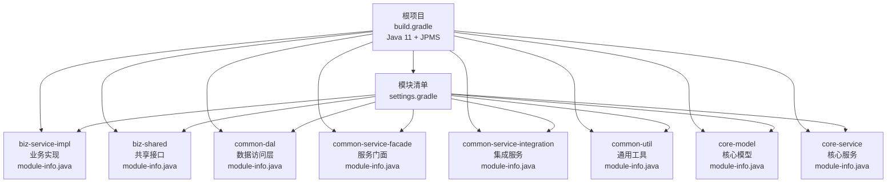
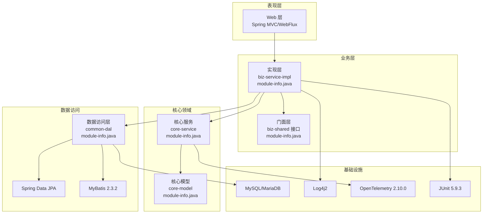
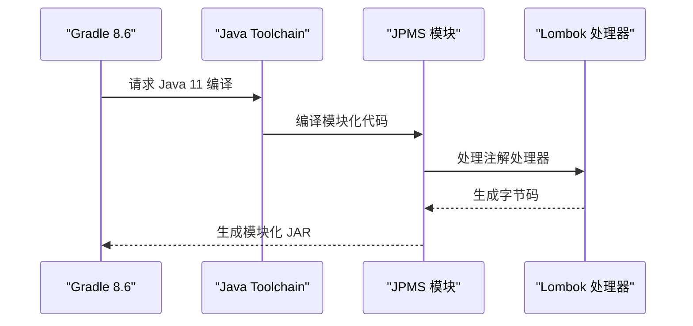
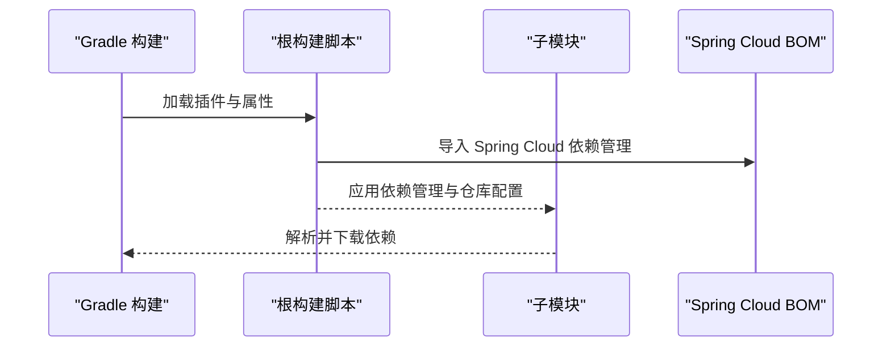
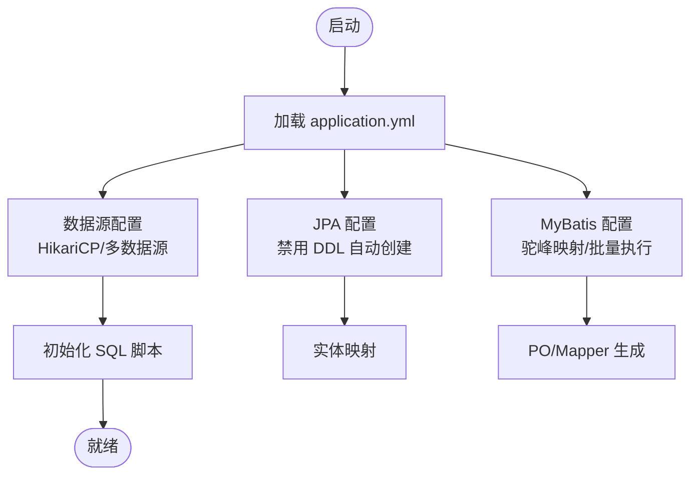
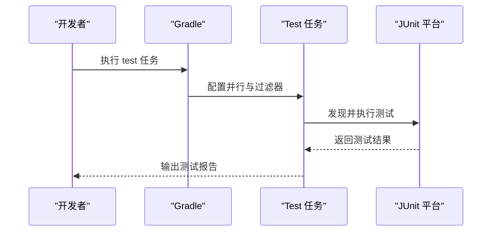
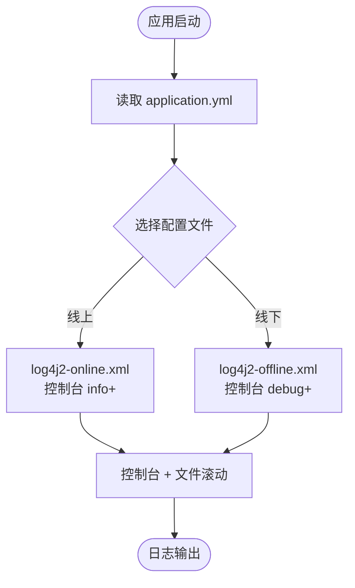
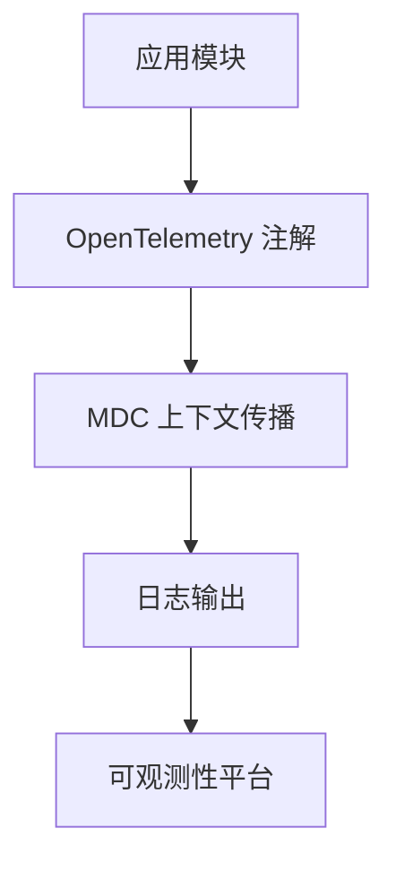
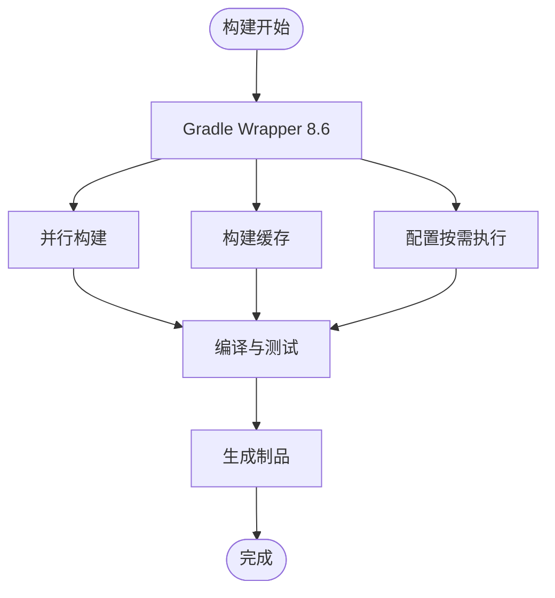
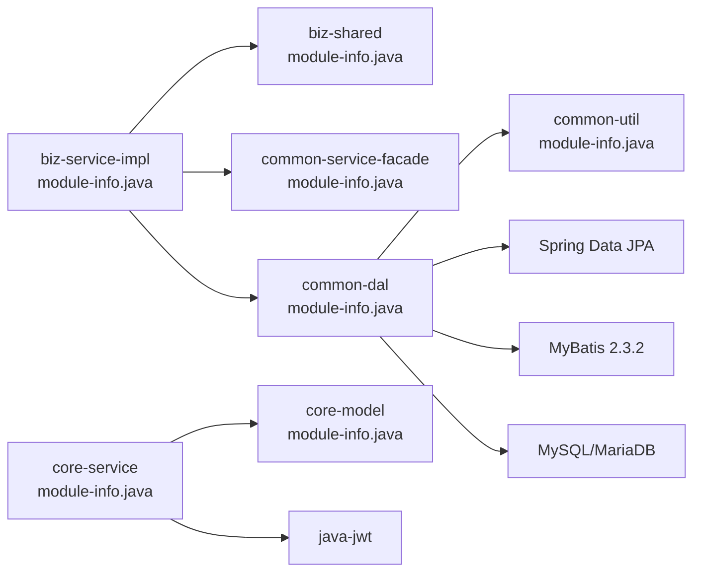

# 技术栈

<cite>
**本文档引用的文件**
- [根构建脚本 build.gradle](file://build.gradle)
- [设置脚本 settings.gradle](file://settings.gradle)
- [Gradle 属性 gradle.properties](file://gradle.properties)
- [脚本插件 script-plugin.gradle](file://script-plugin.gradle)
- [业务实现模块构建脚本 biz-service-impl/build.gradle](file://biz-service-impl/build.gradle)
- [业务实现模块配置 application.yml](file://biz-service-impl/src/main/resources/application.yml)
- [日志配置 log4j2-online.xml](file://biz-service-impl/src/main/resources/log4j2/log4j2-online.xml)
- [日志配置 log4j2-offline.xml](file://biz-service-impl/src/main/resources/log4j2/log4j2-offline.xml)
- [MyBatis 配置 mybatis.xml](file://biz-service-impl/src/main/resources/mybatis/mybatis.xml)
- [通用 DAL 模块构建脚本 common-dal/build.gradle](file://common-dal/build.gradle)
- [MyBatis 生成器配置 generatorConfig.xml](file://common-dal/src/main/resources/autogen/generatorConfig.xml)
- [核心服务模块构建脚本 core-service/build.gradle](file://core-service/build.gradle)
- [Java 11 + JPMS 模块化升级规范](file://docs/specs/002-upgrade-java11-jigsaw-modularization.md)
- [Dockerfile](file://deploy/docker/Dockerfile)
- [应用程序入口 DomainDrivenTransactionSysApplication.java](file://biz-service-impl/src/main/java/com/magicliang/transaction/sys/DomainDrivenTransactionSysApplication.java)
</cite>

## 更新摘要
**变更内容**
- 更新 Java 版本：从 Java 8 升级到 Java 11，采用 Gradle Toolchain 机制
- 新增 JPMS 模块化架构：为 8 个子模块添加 module-info.java 文件
- 更新构建配置：适配 Java 11 的编译参数和 Lombok 处理
- 更新容器化配置：Docker 基础镜像从 Java 8 升级到 Java 11

## 目录
1. [引言](#引言)
2. [项目结构](#项目结构)
3. [核心组件](#核心组件)
4. [架构概览](#架构概览)
5. [详细组件分析](#详细组件分析)
6. [依赖分析](#依赖分析)
7. [性能考虑](#性能考虑)
8. [故障排查指南](#故障排查指南)
9. [结论](#结论)

## 引言
本技术栈文档面向领域驱动交易系统，系统采用多模块 Gradle 构建，后端技术栈以 Java 11、Spring Boot 2.7.18、Spring Cloud 2021.0.8 为核心，结合 MyBatis 2.3.2 与 Spring Data JPA 提供持久层能力，使用 Log4j2 作为日志框架，并集成了 OpenTelemetry 2.10.0 以实现可观测性。测试框架采用 JUnit 5.9.3，构建工具使用 Gradle 8.6，整体设计强调模块化、可维护性和可扩展性。

**更新** 项目已完成从 Java 8 到 Java 11 的升级，并引入了 JPMS 模块化架构，为 8 个子模块提供了完整的模块化支持。

## 项目结构
项目采用多模块结构，通过 Gradle 的 settings.gradle 统一管理子模块，根构建脚本负责全局插件、依赖管理和仓库配置，子模块各自定义功能边界与依赖范围。现已完成 JPMS 模块化改造，每个模块都有对应的 module-info.java 文件。

**图表来源**
- [根构建脚本 build.gradle](file://build.gradle)
- [设置脚本 settings.gradle](file://settings.gradle)
- [Java 11 + JPMS 模块化升级规范](file://docs/specs/002-upgrade-java11-jigsaw-modularization.md)

**章节来源**
- [根构建脚本 build.gradle](file://build.gradle)
- [设置脚本 settings.gradle](file://settings.gradle)
- [Java 11 + JPMS 模块化升级规范](file://docs/specs/002-upgrade-java11-jigsaw-modularization.md)

## 核心组件
- 后端运行时与框架
  - Java 11：采用 Gradle Toolchain 机制，提供更好的版本管理和模块化支持。
  - Spring Boot 2.7.18：提供自动配置、Starter 依赖与生产级特性。
  - Spring Cloud 2021.0.8：与 Spring Boot 2.7.x 生态兼容，提供微服务治理基础。
- 持久层技术
  - Spring Data JPA：面向实体的 ORM 能力，配合 Hibernate 实现 schema 初始化策略控制。
  - MyBatis 2.3.2：通过 Spring Boot Starter 与 PO/Mapper 映射，结合 MyBatis Generator 自动生成代码。
  - 数据库支持：MySQL 与 MariaDB，通过 HikariCP 连接池与多数据源配置实现。
- 测试框架
  - JUnit 5.9.3：统一测试引擎与参数化测试能力，排除 Spring Boot Starter Test 中的旧版本依赖。
- 日志框架
  - Log4j2：通过 Spring Boot Starter Log4j2 引入，结合 profile 区分线上/线下日志级别与输出策略。
- 可观测性
  - OpenTelemetry 2.10.0：通过 instrumentation BOM 统一版本，集成注解与 MDC 支持。
- 构建工具
  - Gradle 8.6：提供并行构建、配置按需执行、构建缓存等性能优化，配合 Java 11 Toolchain 支持。

**更新** 新增 JPMS 模块化支持，每个模块都有明确的模块边界和依赖关系。

**章节来源**
- [根构建脚本 build.gradle](file://build.gradle)
- [业务实现模块配置 application.yml](file://biz-service-impl/src/main/resources/application.yml)
- [日志配置 log4j2-online.xml](file://biz-service-impl/src/main/resources/log4j2/log4j2-online.xml)
- [日志配置 log4j2-offline.xml](file://biz-service-impl/src/main/resources/log4j2/log4j2-offline.xml)
- [通用 DAL 模块构建脚本 common-dal/build.gradle](file://common-dal/build.gradle)
- [MyBatis 生成器配置 generatorConfig.xml](file://common-dal/src/main/resources/autogen/generatorConfig.xml)
- [Java 11 + JPMS 模块化升级规范](file://docs/specs/002-upgrade-java11-jigsaw-modularization.md)

## 架构概览
系统采用分层与模块化设计，业务实现模块对外提供 Web 服务，共享模块定义接口契约，DAL 模块封装数据访问，核心模型与服务模块承载领域逻辑与策略。现已完成 JPMS 模块化改造，每个模块都有明确的模块边界。

**图表来源**
- [业务实现模块构建脚本 biz-service-impl/build.gradle](file://biz-service-impl/build.gradle)
- [通用 DAL 模块构建脚本 common-dal/build.gradle](file://common-dal/build.gradle)
- [核心服务模块构建脚本 core-service/build.gradle](file://core-service/build.gradle)
- [Java 11 + JPMS 模块化升级规范](file://docs/specs/002-upgrade-java11-jigsaw-modularization.md)

## 详细组件分析

### Java 11 + JPMS 模块化升级
- Java 11 升级：通过 Gradle Toolchain 机制将 Java 版本从 8 升级到 11，提供更好的模块化支持。
- JPMS 模块化：为 8 个子模块分别添加 module-info.java 文件，实现完整的模块化架构。
- Lombok 支持：添加必要的 --add-opens 参数以支持 Lombok 在 Java 11 下的编译。
- 容器化升级：Docker 基础镜像从 eclipse-temurin:8-jdk 升级到 eclipse-temurin:11-jdk。

**图表来源**
- [根构建脚本 build.gradle](file://build.gradle)
- [Java 11 + JPMS 模块化升级规范](file://docs/specs/002-upgrade-java11-jigsaw-modularization.md)

**章节来源**
- [根构建脚本 build.gradle](file://build.gradle)
- [Java 11 + JPMS 模块化升级规范](file://docs/specs/002-upgrade-java11-jigsaw-modularization.md)
- [Dockerfile](file://deploy/docker/Dockerfile)

### Spring Boot 与 Spring Cloud 集成
- Spring Boot 2.7.18：在根构建脚本中通过插件声明版本，子模块无需重复声明即可继承。
- Spring Cloud 2021.0.8：通过 dependency-management 导入 BOM，确保与 Spring Boot 版本兼容。
- 依赖管理：根项目统一管理 JUnit 5.9.3 与 JUnit Platform 1.9.3，避免传递依赖导致的版本冲突。

**图表来源**
- [根构建脚本 build.gradle](file://build.gradle)

**章节来源**
- [根构建脚本 build.gradle](file://build.gradle)

### 持久层技术栈（JPA + MyBatis）
- Spring Data JPA
  - 通过 Starter 引入，配合 application.yml 中的 JPA 配置禁用自动 schema 创建，改用脚本初始化。
  - HikariCP 连接池参数在 yml 中集中配置，包含连接超时、最大池大小等。
- MyBatis 2.3.2
  - 通过 Starter 引入，启用驼峰命名映射与批量执行策略。
  - MyBatis Generator 插件与配置文件自动生成 PO/Mapper，支持 MySQL/MariaDB。
- 数据库支持
  - 多数据源配置示例：master/slave1，支持 MariaDB 与 MySQL 驱动。
  - 初始化脚本通过 schema-locations 与 data-locations 指定。

**图表来源**
- [业务实现模块配置 application.yml](file://biz-service-impl/src/main/resources/application.yml)
- [MyBatis 配置 mybatis.xml](file://biz-service-impl/src/main/resources/mybatis/mybatis.xml)
- [通用 DAL 模块构建脚本 common-dal/build.gradle](file://common-dal/build.gradle)
- [MyBatis 生成器配置 generatorConfig.xml](file://common-dal/src/main/resources/autogen/generatorConfig.xml)

**章节来源**
- [业务实现模块配置 application.yml](file://biz-service-impl/src/main/resources/application.yml)
- [MyBatis 配置 mybatis.xml](file://biz-service-impl/src/main/resources/mybatis/mybatis.xml)
- [通用 DAL 模块构建脚本 common-dal/build.gradle](file://common-dal/build.gradle)
- [MyBatis 生成器配置 generatorConfig.xml](file://common-dal/src/main/resources/autogen/generatorConfig.xml)

### 测试框架（JUnit 5.9.3）
- 版本统一：根项目统一设置 junitJupiterVersion 与 junitPlatformVersion，排除 Starter Test 中的旧版本依赖。
- 测试执行：启用 JUnit Platform，配置并行执行与事件日志输出。

**图表来源**
- [根构建脚本 build.gradle](file://build.gradle)

**章节来源**
- [根构建脚本 build.gradle](file://build.gradle)

### 日志框架（Log4j2）
- 引入：通过 Spring Boot Starter Log4j2 引入，排除默认日志实现以避免冲突。
- 配置：application.yml 指定日志配置文件路径，区分线上（online）与线下（offline）两种配置。
  - online：控制台输出 info 及以上级别，适合生产环境。
  - offline：控制台输出 debug 及以上级别，适合开发调试与 SQL 日志输出。

**图表来源**
- [业务实现模块配置 application.yml](file://biz-service-impl/src/main/resources/application.yml)
- [日志配置 log4j2-online.xml](file://biz-service-impl/src/main/resources/log4j2/log4j2-online.xml)
- [日志配置 log4j2-offline.xml](file://biz-service-impl/src/main/resources/log4j2/log4j2-offline.xml)

**章节来源**
- [业务实现模块配置 application.yml](file://biz-service-impl/src/main/resources/application.yml)
- [日志配置 log4j2-online.xml](file://biz-service-impl/src/main/resources/log4j2/log4j2-online.xml)
- [日志配置 log4j2-offline.xml](file://biz-service-impl/src/main/resources/log4j2/log4j2-offline.xml)

### 可观测性（OpenTelemetry 2.10.0）
- 版本管理：通过 instrumentation BOM 统一版本，确保注解与 MDC 组件版本一致。
- 集成点：核心服务模块可利用 OpenTelemetry 注解与 MDC 追踪上下文，业务实现模块可结合日志输出实现链路追踪。

**图表来源**
- [根构建脚本 build.gradle](file://build.gradle)

**章节来源**
- [根构建脚本 build.gradle](file://build.gradle)

### 构建工具（Gradle 8.6）
- 工具链：使用 Java 11 工具链，提供更好的模块化支持。
- 性能优化：开启并行构建、配置按需执行与构建缓存，设置 JVM 参数提升内存与垃圾回收性能。
- 包装器：Gradle Wrapper 固定版本 8.6，保证团队一致性。

**图表来源**
- [根构建脚本 build.gradle](file://build.gradle)
- [Gradle 属性 gradle.properties](file://gradle.properties)

**章节来源**
- [根构建脚本 build.gradle](file://build.gradle)
- [Gradle 属性 gradle.properties](file://gradle.properties)

## 依赖分析
- 模块间依赖
  - biz-service-impl 依赖 biz-shared 与 common-service-facade，体现业务实现与接口契约分离。
  - common-dal 依赖 common-util，并引入 JPA、MyBatis、Testcontainers、MariaDB4j 等支撑组件。
  - core-service 依赖 core-model，并引入 JWT 工具库。
- 外部依赖
  - Spring 生态：Spring Boot、Spring Data JPA、Spring Web/WebFlux。
  - MyBatis：MyBatis Spring Boot Starter 2.3.2。
  - 测试：JUnit 5.9.3、Spring Boot Test（排除旧版 JUnit）。
  - 日志：Spring Boot Starter Log4j2。
  - 可观测性：OpenTelemetry Instrumentation BOM 2.10.0。
  - 数据库：MySQL Connector/J 5.1.47、MariaDB Java Client。

**图表来源**
- [业务实现模块构建脚本 biz-service-impl/build.gradle](file://biz-service-impl/build.gradle)
- [通用 DAL 模块构建脚本 common-dal/build.gradle](file://common-dal/build.gradle)
- [核心服务模块构建脚本 core-service/build.gradle](file://core-service/build.gradle)
- [Java 11 + JPMS 模块化升级规范](file://docs/specs/002-upgrade-java11-jigsaw-modularization.md)

**章节来源**
- [业务实现模块构建脚本 biz-service-impl/build.gradle](file://biz-service-impl/build.gradle)
- [通用 DAL 模块构建脚本 common-dal/build.gradle](file://common-dal/build.gradle)
- [核心服务模块构建脚本 core-service/build.gradle](file://core-service/build.gradle)
- [Java 11 + JPMS 模块化升级规范](file://docs/specs/002-upgrade-java11-jigsaw-modularization.md)

## 性能考虑
- 构建性能
  - 并行构建与构建缓存显著缩短增量构建时间。
  - 配置按需执行减少不必要的任务解析。
  - JVM 参数调优降低 GC 压力。
- 运行时性能
  - HikariCP 连接池参数针对高并发场景进行优化。
  - MyBatis 批量执行与驼峰映射减少 ORM 开销。
  - Log4j2 滚动文件 Appender 降低磁盘 IO 压力。
- 可观测性
  - OpenTelemetry 注解与 MDC 便于链路追踪与性能分析。
- 模块化性能
  - JPMS 提供编译期的强封装和依赖可见性检查。
  - 自动模块与显式模块的混合模式确保兼容性。

## 故障排查指南
- 日志级别问题
  - 线上环境应使用 online 配置，线下环境使用 offline 配置以开启 SQL 日志。
- 数据源初始化
  - 确认 application.yml 中的 schema-locations 与 data-locations 路径正确。
  - 多数据源配置需检查 master/slave1 的 JDBC URL、用户名与密码。
- 测试执行
  - 如遇 JUnit 版本冲突，确认已排除 Starter Test 中的旧版本依赖。
- 构建失败
  - 检查 Gradle Wrapper 版本是否为 8.6，清理缓存后重试。
- Java 11 升级问题
  - 确认 gradle.properties 中的 JVM 参数已更新为 Java 11 兼容格式。
  - 检查 Lombok 是否需要额外的 --add-opens 参数。
- JPMS 模块化问题
  - 确认所有 module-info.java 文件已正确配置。
  - 检查模块间的 exports 和 opens 配置是否正确。
  - 验证三方库的 automatic module name 是否正确。

**章节来源**
- [业务实现模块配置 application.yml](file://biz-service-impl/src/main/resources/application.yml)
- [日志配置 log4j2-online.xml](file://biz-service-impl/src/main/resources/log4j2/log4j2-online.xml)
- [日志配置 log4j2-offline.xml](file://biz-service-impl/src/main/resources/log4j2/log4j2-offline.xml)
- [根构建脚本 build.gradle](file://build.gradle)
- [Java 11 + JPMS 模块化升级规范](file://docs/specs/002-upgrade-java11-jigsaw-modularization.md)

## 结论
本技术栈以 Java 11 为基础，结合 Spring Boot 2.7.18 与 Spring Cloud 2021.0.8 构建稳定的企业级后端服务；通过 JPA 与 MyBatis 双轨持久层满足不同场景需求；JUnit 5.9.3 保障测试质量；Log4j2 提供灵活的日志输出；OpenTelemetry 2.10.0 实现可观测性；Gradle 8.6 提升构建效率与一致性。**更新** 项目已完成从 Java 8 到 Java 11 的升级，并引入了 JPMS 模块化架构，为 8 个子模块提供了完整的模块化支持，增强了代码的封装性和可维护性。模块化设计使系统具备良好的可维护性与扩展性，适合持续演进的领域驱动交易系统。