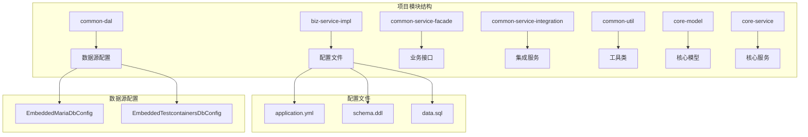
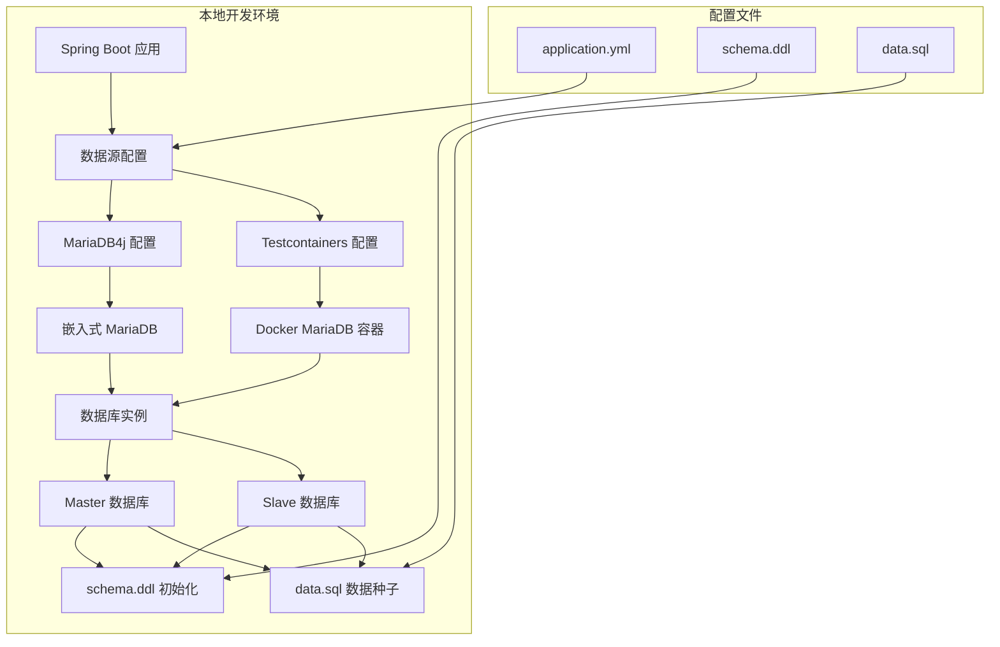
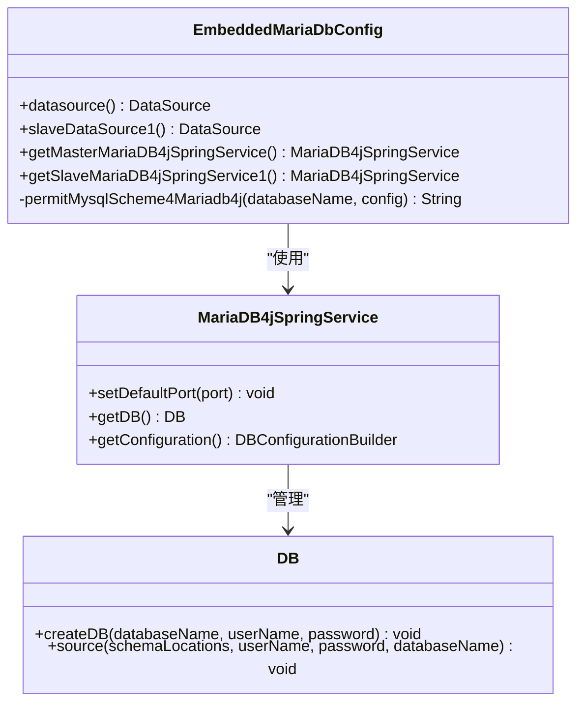
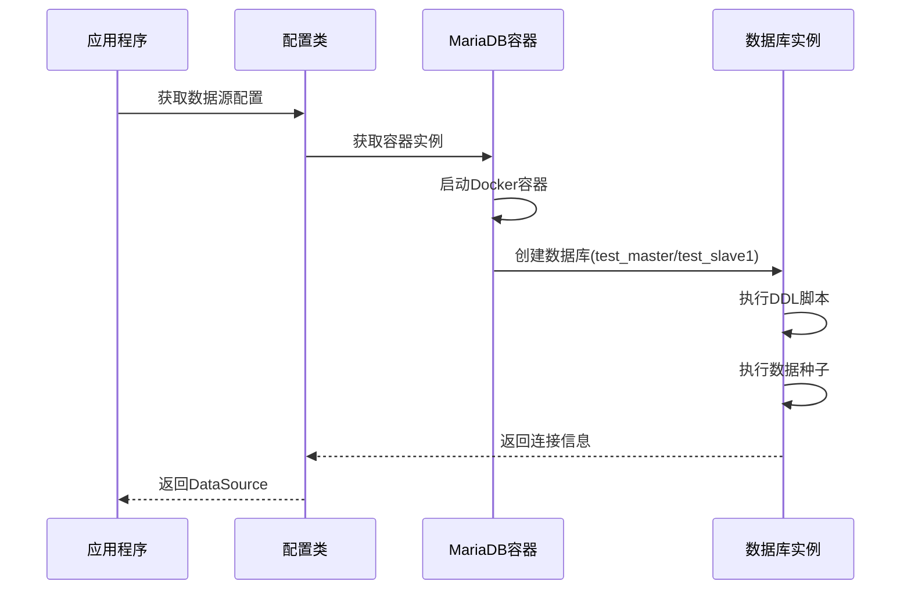
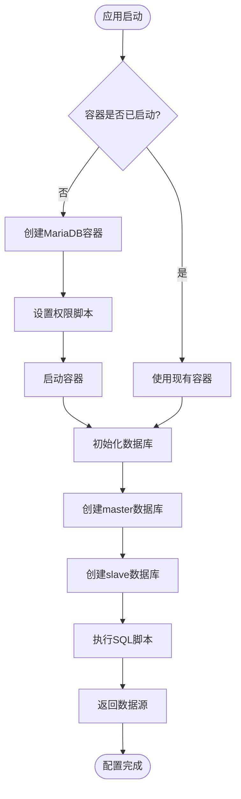
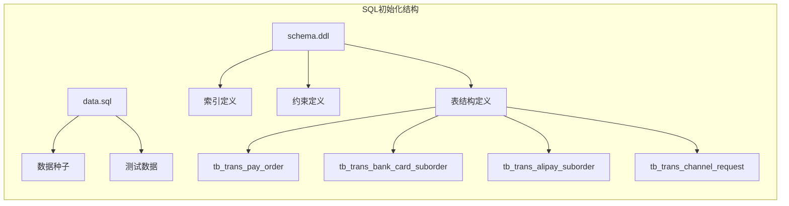
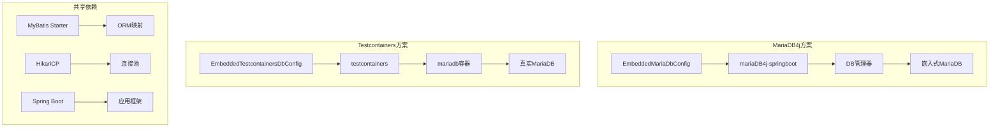

# local-mariadb4j-dev 本地MariaDB配置

<cite>
**本文档引用的文件**
- [application.yml](file://biz-service-impl/src/main/resources/application.yml)
- [EmbeddedMariaDbConfig.java](file://common-dal/src/main/java/com/magicliang/transaction/sys/common/dal/datasource/EmbeddedMariaDbConfig.java)
- [EmbeddedTestcontainersDbConfig.java](file://common-dal/src/main/java/com/magicliang/transaction/sys/common/dal/datasource/EmbeddedTestcontainersDbConfig.java)
- [tc-init-privileges.sql](file://common-dal/src/main/resources/sql/tc-init-privileges.sql)
- [schema.ddl](file://biz-service-impl/src/main/resources/sql/mysql/schema.ddl)
- [data.sql](file://biz-service-impl/src/main/resources/sql/mysql/data.sql)
- [common-dal/build.gradle](file://common-dal/build.gradle)
- [biz-service-impl/build.gradle](file://biz-service-impl/build.gradle)
</cite>

## 目录
1. [简介](#简介)
2. [项目结构](#项目结构)
3. [核心组件](#核心组件)
4. [架构概览](#架构概览)
5. [详细组件分析](#详细组件分析)
6. [依赖分析](#依赖分析)
7. [性能考虑](#性能考虑)
8. [故障排除指南](#故障排除指南)
9. [结论](#结论)
10. [附录](#附录)

## 简介

local-mariadb4j-dev 是本项目提供的本地MariaDB嵌入式数据库配置方案，旨在为开发者提供快速、便捷的本地数据库环境。该配置方案支持两种实现方式：MariaDB4j嵌入式数据库和Testcontainers Docker容器方案，满足不同开发需求。

本配置方案具有以下特点：
- 支持多数据源配置（master和slave）
- 提供完整的数据库初始化脚本
- 支持多种开发环境配置
- 兼容MariaDB和MySQL协议
- 提供灵活的配置选项

## 项目结构

项目采用多模块架构，local-mariadb4j-dev配置主要涉及以下模块：



**图表来源**
- [application.yml:1-216](file://biz-service-impl/src/main/resources/application.yml#L1-L216)
- [EmbeddedMariaDbConfig.java:1-184](file://common-dal/src/main/java/com/magicliang/transaction/sys/common/dal/datasource/EmbeddedMariaDbConfig.java#L1-L184)
- [EmbeddedTestcontainersDbConfig.java:1-154](file://common-dal/src/main/java/com/magicliang/transaction/sys/common/dal/datasource/EmbeddedTestcontainersDbConfig.java#L1-L154)

**章节来源**
- [application.yml:1-216](file://biz-service-impl/src/main/resources/application.yml#L1-L216)
- [common-dal/build.gradle:1-62](file://common-dal/build.gradle#L1-L62)

## 核心组件

### 数据源配置概述

项目提供了两种本地数据库配置方案，分别针对不同的使用场景：

#### MariaDB4j嵌入式数据库配置
- **适用场景**：需要纯Java实现的嵌入式数据库
- **特点**：无需Docker，直接在内存中运行
- **端口**：默认4306（master），4307（slave1）
- **驱动**：org.mariadb.jdbc.Driver

#### Testcontainers Docker容器配置
- **适用场景**：需要真实MariaDB环境的开发
- **特点**：基于Docker的真实容器
- **镜像**：mariadb:10.11
- **用户名**：test（具有全局权限）
- **密码**：test

**章节来源**
- [EmbeddedMariaDbConfig.java:24-35](file://common-dal/src/main/java/com/magicliang/transaction/sys/common/dal/datasource/EmbeddedMariaDbConfig.java#L24-L35)
- [EmbeddedTestcontainersDbConfig.java:25-33](file://common-dal/src/main/java/com/magicliang/transaction/sys/common/dal/datasource/EmbeddedTestcontainersDbConfig.java#L25-L33)

## 架构概览

local-mariadb4j-dev配置的整体架构如下：



**图表来源**
- [application.yml:85-146](file://biz-service-impl/src/main/resources/application.yml#L85-L146)
- [EmbeddedMariaDbConfig.java:55-135](file://common-dal/src/main/java/com/magicliang/transaction/sys/common/dal/datasource/EmbeddedMariaDbConfig.java#L55-L135)
- [EmbeddedTestcontainersDbConfig.java:64-101](file://common-dal/src/main/java/com/magicliang/transaction/sys/common/dal/datasource/EmbeddedTestcontainersDbConfig.java#L64-L101)

## 详细组件分析

### MariaDB4j嵌入式数据库配置

#### 配置类分析



**图表来源**
- [EmbeddedMariaDbConfig.java:39-183](file://common-dal/src/main/java/com/magicliang/transaction/sys/common/dal/datasource/EmbeddedMariaDbConfig.java#L39-L183)

#### 数据源配置详情

| 配置项 | Master数据源 | Slave数据源 |
|--------|-------------|-------------|
| 数据库名称 | test_master | test_slave1 |
| 端口号 | 4306 | 4307 |
| 用户名 | root | root |
| 密码 | 12345678 | 12345678 |
| 驱动类 | org.mariadb.jdbc.Driver | org.mariadb.jdbc.Driver |
| JDBC URL | 自动生成 | 自动生成 |

**章节来源**
- [application.yml:86-100](file://biz-service-impl/src/main/resources/application.yml#L86-L100)
- [EmbeddedMariaDbConfig.java:58-135](file://common-dal/src/main/java/com/magicliang/transaction/sys/common/dal/datasource/EmbeddedMariaDbConfig.java#L58-L135)

### Testcontainers Docker容器配置

#### 容器配置分析



**图表来源**
- [EmbeddedTestcontainersDbConfig.java:64-136](file://common-dal/src/main/java/com/magicliang/transaction/sys/common/dal/datasource/EmbeddedTestcontainersDbConfig.java#L64-L136)

#### 容器初始化流程



**图表来源**
- [EmbeddedTestcontainersDbConfig.java:107-136](file://common-dal/src/main/java/com/magicliang/transaction/sys/common/dal/datasource/EmbeddedTestcontainersDbConfig.java#L107-L136)
- [tc-init-privileges.sql:1-4](file://common-dal/src/main/resources/sql/tc-init-privileges.sql#L1-L4)

**章节来源**
- [EmbeddedTestcontainersDbConfig.java:38-154](file://common-dal/src/main/java/com/magicliang/transaction/sys/common/dal/datasource/EmbeddedTestcontainersDbConfig.java#L38-L154)

### SQL初始化配置

#### schema-locations和data-locations配置

| 配置项 | 路径 | 说明 |
|--------|------|------|
| schema-locations | sql/mysql/schema.ddl | 数据库结构定义文件 |
| data-locations | sql/mysql/data.sql | 数据种子文件 |

#### SQL脚本结构



**图表来源**
- [application.yml:108-112](file://biz-service-impl/src/main/resources/application.yml#L108-L112)
- [schema.ddl:1-145](file://biz-service-impl/src/main/resources/sql/mysql/schema.ddl#L1-L145)

**章节来源**
- [application.yml:108-112](file://biz-service-impl/src/main/resources/application.yml#L108-L112)
- [schema.ddl:1-145](file://biz-service-impl/src/main/resources/sql/mysql/schema.ddl#L1-L145)
- [data.sql:1-2](file://biz-service-impl/src/main/resources/sql/mysql/data.sql#L1-L2)

## 依赖分析

### 核心依赖关系



**图表来源**
- [common-dal/build.gradle:37-52](file://common-dal/build.gradle#L37-L52)
- [EmbeddedMariaDbConfig.java:6-9](file://common-dal/src/main/java/com/magicliang/transaction/sys/common/dal/datasource/EmbeddedMariaDbConfig.java#L6-L9)
- [EmbeddedTestcontainersDbConfig.java:22-23](file://common-dal/src/main/java/com/magicliang/transaction/sys/common/dal/datasource/EmbeddedTestcontainersDbConfig.java#L22-L23)

### 依赖版本信息

| 依赖项 | 版本 | 用途 |
|--------|------|------|
| ch.vorburger.mariaDB4j:mariaDB4j-springboot | 2.5.3 | MariaDB4j集成 |
| org.testcontainers:testcontainers | 1.19.8 | 测试容器框架 |
| org.testcontainers:mariadb | 1.19.8 | MariaDB容器 |
| org.mariadb.jdbc:mariadb-java-client | - | MariaDB JDBC驱动 |
| mysql:mysql-connector-java | 5.1.47 | MySQL兼容驱动 |

**章节来源**
- [common-dal/build.gradle:37-52](file://common-dal/build.gradle#L37-L52)

## 性能考虑

### MariaDB4j方案性能特点

1. **内存效率**：完全在内存中运行，启动速度快
2. **资源占用**：较低的系统资源消耗
3. **并发性能**：适合单机开发环境
4. **数据持久性**：内存中数据，重启丢失

### Testcontainers方案性能特点

1. **真实环境**：接近生产环境的性能特征
2. **资源开销**：Docker容器带来额外的系统开销
3. **启动时间**：容器启动需要额外时间
4. **数据持久性**：支持数据持久化配置

### 选择建议

| 场景 | 推荐方案 | 原因 |
|------|----------|------|
| 快速开发调试 | MariaDB4j | 启动快，无Docker依赖 |
| 真实环境测试 | Testcontainers | 接近生产环境 |
| CI/CD环境 | Testcontainers | 可靠的容器化部署 |
| 资源受限环境 | MariaDB4j | 更低的资源消耗 |

## 故障排除指南

### 常见问题及解决方案

#### 端口冲突问题

**问题描述**：MariaDB4j端口被占用导致启动失败

**解决方案**：
1. 检查端口占用情况
2. 修改application.yml中的端口号
3. 确保端口未被其他服务占用

#### 数据库初始化失败

**问题描述**：SQL脚本执行失败或数据库创建失败

**解决方案**：
1. 检查schema.ddl文件语法
2. 验证SQL脚本路径配置
3. 确认数据库用户权限

#### Testcontainers启动失败

**问题描述**：Docker容器无法启动或连接失败

**解决方案**：
1. 确认Docker服务正常运行
2. 检查网络连接
3. 验证Docker镜像可用性

**章节来源**
- [EmbeddedMariaDbConfig.java:149-151](file://common-dal/src/main/java/com/magicliang/transaction/sys/common/dal/datasource/EmbeddedMariaDbConfig.java#L149-L151)
- [EmbeddedTestcontainersDbConfig.java:48-61](file://common-dal/src/main/java/com/magicliang/transaction/sys/common/dal/datasource/EmbeddedTestcontainersDbConfig.java#L48-L61)

## 结论

local-mariadb4j-dev提供了灵活的本地MariaDB配置方案，满足不同开发场景的需求。MariaDB4j方案适合快速开发和调试，而Testcontainers方案更适合需要真实环境测试的场景。

### 最佳实践建议

1. **开发阶段**：优先使用MariaDB4j方案，提高开发效率
2. **测试阶段**：使用Testcontainers方案，确保测试准确性
3. **CI/CD**：统一使用Testcontainers方案，保证环境一致性
4. **性能优化**：根据项目规模选择合适的方案
5. **监控配置**：合理配置连接池参数和日志级别

## 附录

### 配置文件详解

#### application.yml关键配置

```yaml
# 激活local-mariadb4j-dev配置文件
spring:
  config:
    activate:
      on-profile: local-mariadb4j-dev

# 数据源配置
datasource:
  master:
    schemaName: test_master
    port: 4306
    userName: root
    password: 12345678
    driver-class-name: org.mariadb.jdbc.Driver
  slave1:
    schemaName: test_slave1
    port: 4307
    userName: root
    password: 12345678
    driver-class-name: org.mariadb.jdbc.Driver

# SQL初始化配置
sql:
  init:
    schema-locations: sql/mysql/schema.ddl
    data-locations: sql/mysql/data.sql
```

#### SQL脚本示例

**表结构定义示例**：
- `tb_trans_pay_order`：支付订单主表
- `tb_trans_bank_card_suborder`：银行卡子订单表  
- `tb_trans_alipay_suborder`：支付宝子订单表
- `tb_trans_channel_request`：支付请求表

**章节来源**
- [application.yml:85-112](file://biz-service-impl/src/main/resources/application.yml#L85-L112)
- [schema.ddl:1-145](file://biz-service-impl/src/main/resources/sql/mysql/schema.ddl#L1-L145)