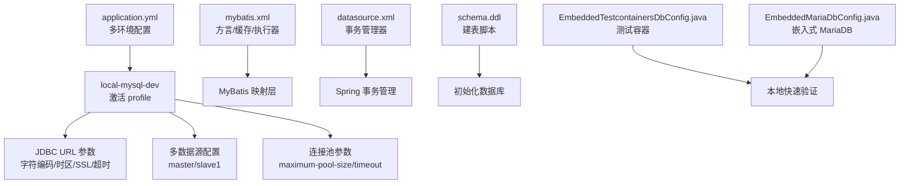
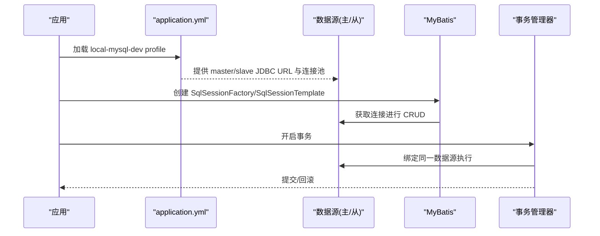
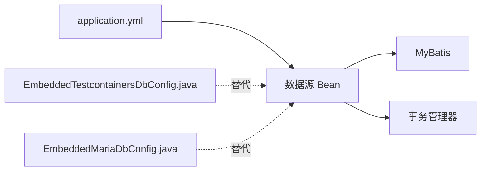

# local-mysql-dev 本地MySQL配置

<cite>
**本文档引用的文件**
- [application.yml](file://biz-service-impl/src/main/resources/application.yml)
- [datasource.xml](file://biz-service-impl/src/main/resources/spring/datasource.xml)
- [mybatis.xml](file://biz-service-impl/src/main/resources/mybatis/mybatis.xml)
- [EmbeddedMariaDbConfig.java](file://common-dal/src/main/java/com/magicliang/transaction/sys/common/dal/datasource/EmbeddedMariaDbConfig.java)
- [EmbeddedTestcontainersDbConfig.java](file://common-dal/src/main/java/com/magicliang/transaction/sys/common/dal/datasource/EmbeddedTestcontainersDbConfig.java)
- [MyBatis-configuration.MD](file://common-dal/src/main/java/com/magicliang/transaction/sys/common/dal/mybatis/MyBatis-configuration.MD)
- [schema.ddl](file://biz-service-impl/src/main/resources/sql/mysql/schema.ddl)
- [data.sql](file://biz-service-impl/src/main/resources/sql/mysql/data.sql)
- [01-mariadb-secret.yaml](file://deploy/k8s/dev/01-mariadb-secret.yaml)
</cite>

## 目录
1. [简介](#简介)
2. [项目结构](#项目结构)
3. [核心组件](#核心组件)
4. [架构概览](#架构概览)
5. [详细组件分析](#详细组件分析)
6. [依赖关系分析](#依赖关系分析)
7. [性能考量](#性能考量)
8. [故障排查指南](#故障排查指南)
9. [结论](#结论)
10. [附录](#附录)

## 简介
本文件面向 local-mysql-dev 本地 MySQL 开发环境，提供完整的数据库连接配置说明与实践建议。内容涵盖：
- JDBC URL 参数设置（字符编码、时区、SSL、超时、批量重写等）
- 多数据源配置（master 与 slave）
- 连接池参数优化（最大池大小、连接超时等）
- MySQL 服务器安装与初始化脚本
- 连接问题排查与性能调优建议

## 项目结构
local-mysql-dev 配置位于应用资源目录中，结合 Spring Profile 机制实现按环境切换。关键文件包括：
- 应用配置：application.yml（含多环境 profile 与数据库配置）
- MyBatis 配置：mybatis.xml（方言、缓存与执行器设置）
- 传统 XML 事务配置：datasource.xml（事务管理器绑定数据源）
- 数据库初始化：schema.ddl、data.sql
- 测试容器/嵌入式数据库配置：EmbeddedTestcontainersDbConfig.java、EmbeddedMariaDbConfig.java
- Kubernetes 密钥示例：01-mariadb-secret.yaml

图表来源
- [application.yml:148-173](file://biz-service-impl/src/main/resources/application.yml#L148-L173)
- [mybatis.xml:1-18](file://biz-service-impl/src/main/resources/mybatis/mybatis.xml#L1-L18)
- [datasource.xml:1-16](file://biz-service-impl/src/main/resources/spring/datasource.xml#L1-L16)
- [schema.ddl:1-145](file://biz-service-impl/src/main/resources/sql/mysql/schema.ddl#L1-L145)
- [EmbeddedTestcontainersDbConfig.java:25-46](file://common-dal/src/main/java/com/magicliang/transaction/sys/common/dal/datasource/EmbeddedTestcontainersDbConfig.java#L25-L46)
- [EmbeddedMariaDbConfig.java:24-158](file://common-dal/src/main/java/com/magicliang/transaction/sys/common/dal/datasource/EmbeddedMariaDbConfig.java#L24-L158)

章节来源
- [application.yml:148-173](file://biz-service-impl/src/main/resources/application.yml#L148-L173)
- [mybatis.xml:1-18](file://biz-service-impl/src/main/resources/mybatis/mybatis.xml#L1-L18)
- [datasource.xml:1-16](file://biz-service-impl/src/main/resources/spring/datasource.xml#L1-L16)
- [schema.ddl:1-145](file://biz-service-impl/src/main/resources/sql/mysql/schema.ddl#L1-L145)

## 核心组件
- 应用配置（application.yml）
  - 通过 Spring Profile 切换 local-mysql-dev，启用 MySQL 连接配置
  - 提供 master 与 slave1 的 JDBC URL、用户名、密码与连接池命名
- MyBatis 配置（mybatis.xml）
  - 设置方言为 mysql，关闭二级缓存、降低一级缓存作用域、默认批处理执行器
- 事务配置（datasource.xml）
  - 将 DataSourceTransactionManager 绑定到名为 dataSource 的数据源 Bean
- 数据库初始化（schema.ddl、data.sql）
  - 定义核心业务表结构与初始化占位
- 测试容器/嵌入式数据库（EmbeddedTestcontainersDbConfig.java、EmbeddedMariaDbConfig.java）
  - 提供本地快速验证的 MariaDB 替代方案（与 local-mysql-dev 语义等价）

章节来源
- [application.yml:148-173](file://biz-service-impl/src/main/resources/application.yml#L148-L173)
- [mybatis.xml:5-15](file://biz-service-impl/src/main/resources/mybatis/mybatis.xml#L5-L15)
- [datasource.xml:8-14](file://biz-service-impl/src/main/resources/spring/datasource.xml#L8-L14)
- [schema.ddl:1-145](file://biz-service-impl/src/main/resources/sql/mysql/schema.ddl#L1-L145)
- [EmbeddedTestcontainersDbConfig.java:25-46](file://common-dal/src/main/java/com/magicliang/transaction/sys/common/dal/datasource/EmbeddedTestcontainersDbConfig.java#L25-L46)
- [EmbeddedMariaDbConfig.java:24-158](file://common-dal/src/main/java/com/magicliang/transaction/sys/common/dal/datasource/EmbeddedMariaDbConfig.java#L24-L158)

## 架构概览
local-mysql-dev 的数据库访问路径如下：
- 应用启动加载 application.yml 中的 local-mysql-dev profile
- 读取 master 与 slave1 的 JDBC URL 与连接池配置
- MyBatis 通过 SqlSessionFactory 与 SqlSessionTemplate 访问数据
- Spring 事务管理器绑定 DataSourceTransactionManager 与数据源

图表来源
- [application.yml:148-173](file://biz-service-impl/src/main/resources/application.yml#L148-L173)
- [mybatis.xml:1-18](file://biz-service-impl/src/main/resources/mybatis/mybatis.xml#L1-L18)
- [datasource.xml:8-14](file://biz-service-impl/src/main/resources/spring/datasource.xml#L8-L14)

## 详细组件分析

### JDBC URL 参数详解（local-mysql-dev）
- 字符编码
  - 参数：characterEncoding=utf-8
  - 作用：确保客户端与服务器间字符编码一致，避免乱码
- 时区
  - 参数：serverTimezone=Asia/Shanghai
  - 作用：统一时区，避免 Java 时间与数据库时间差异导致的异常
- SSL 设置
  - 参数：useSSL=true
  - 说明：生产环境建议关闭（如 useSSL=false），开发环境可开启以验证连接
- 超时控制
  - connectTimeout：连接超时
  - socketTimeout：Socket 读取超时
- 其他关键参数
  - autoReconnect=false：避免自动重连带来的副作用
  - failOverReadOnly=false：主从切换时避免只读模式
  - zeroDateTimeBehavior=convertToNull：将零日期转换为 NULL
  - useAffectedRows=true：使用受影响行数而非警告
  - allowMultiQueries=true：允许批量 SQL
  - rewriteBatchedStatements=true：批量语句重写优化
  - useCompression=true：启用网络压缩
  - maxRows=0：不限制结果集行数
  - useUnicode=true：启用 Unicode
  - useDynamicCharsetInfo=false：固定字符集信息

章节来源
- [application.yml:154-167](file://biz-service-impl/src/main/resources/application.yml#L154-L167)

### 多数据源配置（master 与 slave）
- master 数据源
  - jdbc-url：指向本地 MySQL 主库 test_master
  - driver-class-name：com.mysql.cj.jdbc.Driver
  - 用户名/密码：root/12345678
  - 连接池命名：master-pool
- slave1 数据源
  - jdbc-url：指向本地 MySQL 从库 test_slave
  - driver-class-name：com.mysql.cj.jdbc.Driver
  - 用户名/密码：root/12345678
  - 连接池命名：slave-pool
- 配置要点
  - 使用嵌套对象方式在 datasource 下定义 master 与 slave1
  - 保持 driver-class-name 与 JDBC URL 参数一致
  - 为 master/slave 分配独立的 pool-name，便于监控与调优

章节来源
- [application.yml:152-167](file://biz-service-impl/src/main/resources/application.yml#L152-L167)

### 连接池参数优化
- maximum-pool-size：连接池最大连接数
- connection-timeout：获取连接的超时时间
- min-idle：最小空闲连接数
- max-lifetime：连接最大存活时间
- pool-name：连接池命名（master-pool/slave-pool）
- connectionTestQuery：连接有效性检测 SQL（SELECT 1）

章节来源
- [application.yml:24-32](file://biz-service-impl/src/main/resources/application.yml#L24-L32)
- [application.yml:152-167](file://biz-service-impl/src/main/resources/application.yml#L152-L167)

### MyBatis 配置要点
- dialect：mysql
- cacheEnabled：false（关闭二级缓存）
- localCacheScope：STATEMENT（降低一级缓存作用域）
- defaultExecutorType：BATCH（默认批处理执行器）
- 适用场景：开发调试阶段，减少缓存干扰；生产环境可根据需求调整

章节来源
- [mybatis.xml:5-15](file://biz-service-impl/src/main/resources/mybatis/mybatis.xml#L5-L15)

### 传统 XML 事务配置
- 事务管理器绑定到名为 dataSource 的数据源 Bean
- 保证事务与数据源一致性，避免跨数据源事务问题

章节来源
- [datasource.xml:8-14](file://biz-service-impl/src/main/resources/spring/datasource.xml#L8-L14)

### 数据库初始化脚本
- schema.ddl：定义核心业务表（tb_trans_pay_order、tb_trans_bank_card_suborder、tb_trans_alipay_suborder、tb_trans_channel_request）
- data.sql：初始化占位（可替换为实际种子数据）
- 建议：在本地 MySQL 中执行 schema.ddl 创建 test_master 与 test_slave 库及表结构

章节来源
- [schema.ddl:1-145](file://biz-service-impl/src/main/resources/sql/mysql/schema.ddl#L1-L145)
- [data.sql:1-2](file://biz-service-impl/src/main/resources/sql/mysql/data.sql#L1-L2)

### 测试容器与嵌入式数据库（对比验证）
- EmbeddedTestcontainersDbConfig.java：使用 Testcontainers 启动 MariaDB 容器，单容器双库（test_master/test_slave1），与 local-mysql-dev 语义等价
- EmbeddedMariaDbConfig.java：使用 MariaDB4j 嵌入式数据库，支持本地快速验证
- 适用场景：无需安装 MySQL 时的替代方案

章节来源
- [EmbeddedTestcontainersDbConfig.java:25-46](file://common-dal/src/main/java/com/magicliang/transaction/sys/common/dal/datasource/EmbeddedTestcontainersDbConfig.java#L25-L46)
- [EmbeddedTestcontainersDbConfig.java:71-101](file://common-dal/src/main/java/com/magicliang/transaction/sys/common/dal/datasource/EmbeddedTestcontainersDbConfig.java#L71-L101)
- [EmbeddedMariaDbConfig.java:24-158](file://common-dal/src/main/java/com/magicliang/transaction/sys/common/dal/datasource/EmbeddedMariaDbConfig.java#L24-L158)

## 依赖关系分析
- application.yml 依赖 Spring Profile 机制，按环境加载不同配置
- MyBatis 依赖数据源 Bean（由 application.yml 提供）
- 事务管理器依赖数据源 Bean（由 datasource.xml 绑定）
- 测试容器配置与本地 MySQL 配置互为替代方案

图表来源
- [application.yml:148-173](file://biz-service-impl/src/main/resources/application.yml#L148-L173)
- [datasource.xml:8-14](file://biz-service-impl/src/main/resources/spring/datasource.xml#L8-L14)
- [EmbeddedTestcontainersDbConfig.java:25-46](file://common-dal/src/main/java/com/magicliang/transaction/sys/common/dal/datasource/EmbeddedTestcontainersDbConfig.java#L25-L46)
- [EmbeddedMariaDbConfig.java:24-158](file://common-dal/src/main/java/com/magicliang/transaction/sys/common/dal/datasource/EmbeddedMariaDbConfig.java#L24-L158)

## 性能考量
- 连接池参数
  - maximum-pool-size：根据并发请求数与数据库承载能力设定，避免过大导致数据库压力
  - connection-timeout：设置合理超时，防止线程长时间阻塞
  - min-idle：维持一定空闲连接，降低突发流量下的连接创建开销
  - max-lifetime：避免连接老化引发的隐性问题
- JDBC URL 优化
  - rewriteBatchedStatements=true：提升批量插入/更新性能
  - useCompression=true：在网络延迟较高时减少带宽占用
  - allowMultiQueries=true：谨慎使用，避免 SQL 注入与复杂事务边界
- MyBatis 执行器
  - defaultExecutorType=BATCH：适合批量写入场景
  - cacheEnabled=false：避免缓存导致的内存与一致性问题
- 监控与日志
  - 开启 SQL 日志仅限线下环境，避免线上性能损耗
  - 通过连接池命名（master-pool/slave-pool）区分主从监控指标

章节来源
- [application.yml:24-32](file://biz-service-impl/src/main/resources/application.yml#L24-L32)
- [application.yml:152-167](file://biz-service-impl/src/main/resources/application.yml#L152-L167)
- [mybatis.xml:8-15](file://biz-service-impl/src/main/resources/mybatis/mybatis.xml#L8-L15)

## 故障排查指南
- 连接超时
  - 检查 connection-timeout 与 connectTimeout 是否过低
  - 确认数据库端口可达与防火墙策略
- 字符集乱码
  - 确认 characterEncoding=utf-8 与数据库字符集一致
  - 校验 serverTimezone 与时区配置
- SSL 相关异常
  - 开发环境 useSSL=true 可验证连接；生产环境建议 useSSL=false 并确保网络加密
- 自动重连问题
  - autoReconnect=false 避免异常重连；如需重连，建议在应用层处理
- 时区不一致
  - 统一 serverTimezone=Asia/Shanghai，避免 Java 时间与数据库时间偏差
- 批量执行异常
  - 检查 rewriteBatchedStatements 与 allowMultiQueries 的兼容性
  - 确保 SQL 语法符合批量执行规范
- 事务未生效
  - 确认事务管理器绑定的数据源与 MyBatis 使用的数据源一致
- 初始化失败
  - 检查 schema.ddl 是否正确执行，确认 test_master/test_slave 库存在
  - 如使用嵌入式数据库，确认容器或服务已启动

章节来源
- [application.yml:154-167](file://biz-service-impl/src/main/resources/application.yml#L154-L167)
- [datasource.xml:8-14](file://biz-service-impl/src/main/resources/spring/datasource.xml#L8-L14)
- [schema.ddl:1-145](file://biz-service-impl/src/main/resources/sql/mysql/schema.ddl#L1-L145)
- [EmbeddedTestcontainersDbConfig.java:25-46](file://common-dal/src/main/java/com/magicliang/transaction/sys/common/dal/datasource/EmbeddedTestcontainersDbConfig.java#L25-L46)
- [EmbeddedMariaDbConfig.java:24-158](file://common-dal/src/main/java/com/magicliang/transaction/sys/common/dal/datasource/EmbeddedMariaDbConfig.java#L24-L158)

## 结论
local-mysql-dev 通过 Spring Profile 与 application.yml 提供了清晰的本地 MySQL 连接配置模板，结合 MyBatis 与传统 XML 事务配置，能够满足开发与测试需求。建议：
- 生产环境关闭 useSSL=false，统一字符集与时区
- 合理设置连接池参数，结合监控指标持续优化
- 使用 schema.ddl 初始化本地数据库，确保表结构一致
- 如需替代方案，可采用 Testcontainers 或 MariaDB4j 的嵌入式数据库

## 附录

### MySQL 服务器安装与配置（通用步骤）
- 安装 MySQL（版本建议与 JDBC 驱动兼容）
- 创建数据库与用户
  - test_master：主库
  - test_slave：从库
- 执行 schema.ddl 初始化表结构
- 验证连接：使用 JDBC URL 与用户名/密码进行连通性测试

章节来源
- [schema.ddl:1-145](file://biz-service-impl/src/main/resources/sql/mysql/schema.ddl#L1-L145)
- [application.yml:152-167](file://biz-service-impl/src/main/resources/application.yml#L152-L167)

### Kubernetes 密钥示例（参考）
- 示例密钥包含 MARIADB_ROOT_PASSWORD，可用于容器化部署场景
- 本地开发可忽略该文件，但了解其用途有助于理解生产部署

章节来源
- [01-mariadb-secret.yaml:10-12](file://deploy/k8s/dev/01-mariadb-secret.yaml#L10-L12)