# local-tc-dev 开发环境配置

<cite>
**本文档引用的文件**
- [EmbeddedTestcontainersDbConfig.java](file://common-dal/src/main/java/com/magicliang/transaction/sys/common/dal/datasource/EmbeddedTestcontainersDbConfig.java)
- [EmbeddedMariaDbConfig.java](file://common-dal/src/main/java/com/magicliang/transaction/sys/common/dal/datasource/EmbeddedMariaDbConfig.java)
- [application.yml](file://biz-service-impl/src/main/resources/application.yml)
- [tc-init-privileges.sql](file://common-dal/src/main/resources/sql/tc-init-privileges.sql)
- [schema.ddl](file://biz-service-impl/src/main/resources/sql/mysql/schema.ddl)
- [data.sql](file://biz-service-impl/src/main/resources/sql/mysql/data.sql)
- [README.md](file://README.md)
- [DomainDrivenTransactionSysApplicationIntegrationTest.java](file://biz-service-impl/src/test/integration/java/com/magicliang/transaction/sys/DomainDrivenTransactionSysApplicationIntegrationTest.java)
- [Dockerfile](file://deploy/docker/Dockerfile)
</cite>

## 目录
1. [简介](#简介)
2. [项目结构](#项目结构)
3. [核心组件](#核心组件)
4. [架构概览](#架构概览)
5. [详细组件分析](#详细组件分析)
6. [依赖关系分析](#依赖关系分析)
7. [性能考虑](#性能考虑)
8. [故障排查指南](#故障排查指南)
9. [结论](#结论)
10. [附录](#附录)

## 简介

local-tc-dev 是本项目推荐的本地开发环境配置，通过 Testcontainers 自动管理 MariaDB 容器，为开发者提供开箱即用的数据库环境。该配置支持所有芯片架构（ARM64/AMD64/x86_64）和操作系统，包括 Docker Desktop 和 Podman 两种容器运行时。

本配置的核心特性包括：
- 自动启动 MariaDB 10.11 Docker 容器
- 支持双数据库模式（test_master 和 test_slave1）
- 自动执行数据库初始化脚本
- 容器生命周期自动管理
- 与 Spring Profile 机制无缝集成

## 项目结构

该项目采用 Gradle 多模块架构，local-tc-dev 配置主要涉及以下关键模块：

```mermaid
graph TB
subgraph "项目模块结构"
A[biz-service-impl<br/>应用启动模块]
B[common-dal<br/>数据访问层]
C[common-util<br/>通用工具]
D[core-service<br/>核心服务]
E[core-model<br/>领域模型]
end
subgraph "配置相关"
F[application.yml<br/>Spring配置]
G[EmbeddedTestcontainersDbConfig.java<br/>容器配置]
H[tc-init-privileges.sql<br/>权限脚本]
I[schema.ddl<br/>数据库结构]
J[data.sql<br/>初始化数据]
end
A --> B
B --> C
D --> E
F --> G
G --> H
G --> I
G --> J
```

**图表来源**
- [application.yml:121-146](file://biz-service-impl/src/main/resources/application.yml#L121-L146)
- [EmbeddedTestcontainersDbConfig.java:34-37](file://common-dal/src/main/java/com/magicliang/transaction/sys/common/dal/datasource/EmbeddedTestcontainersDbConfig.java#L34-L37)

**章节来源**
- [settings.gradle:7-14](file://settings.gradle#L7-L14)
- [README.md:23-35](file://README.md#L23-L35)

## 核心组件

local-tc-dev 开发环境配置由以下几个核心组件构成：

### EmbeddedTestcontainersDbConfig
这是整个配置的核心，负责：
- 管理 Testcontainers MariaDB 容器的生命周期
- 自动创建和初始化数据库
- 提供主从数据库的数据源配置
- 处理数据库初始化脚本执行

### 数据库初始化机制
配置包含三层初始化机制：
1. **容器级初始化**：通过 tc-init-privileges.sql 授予 test 用户全局权限
2. **数据库级初始化**：根据 schema-locations 和 data-locations 执行 DDL 和数据初始化
3. **Spring Boot 集成**：通过 application.yml 配置自动化的数据库管理

### 环境配置
支持多种运行环境：
- **Docker Desktop**：默认推荐的容器运行时
- **Podman**：macOS/Linux 的替代方案
- **本地 MySQL**：生产环境的连接配置

**章节来源**
- [EmbeddedTestcontainersDbConfig.java:25-33](file://common-dal/src/main/java/com/magicliang/transaction/sys/common/dal/datasource/EmbeddedTestcontainersDbConfig.java#L25-L33)
- [application.yml:121-146](file://biz-service-impl/src/main/resources/application.yml#L121-L146)

## 架构概览

local-tc-dev 配置的整体架构如下：

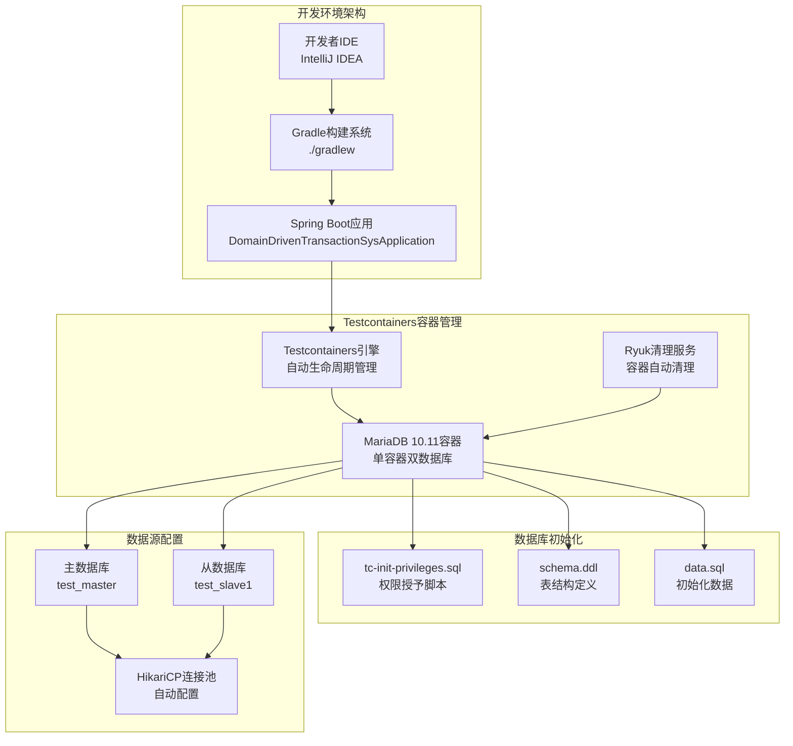

**图表来源**
- [EmbeddedTestcontainersDbConfig.java:48-62](file://common-dal/src/main/java/com/magicliang/transaction/sys/common/dal/datasource/EmbeddedTestcontainersDbConfig.java#L48-L62)
- [application.yml:125-140](file://biz-service-impl/src/main/resources/application.yml#L125-L140)

## 详细组件分析

### EmbeddedTestcontainersDbConfig 组件分析

#### 类结构图

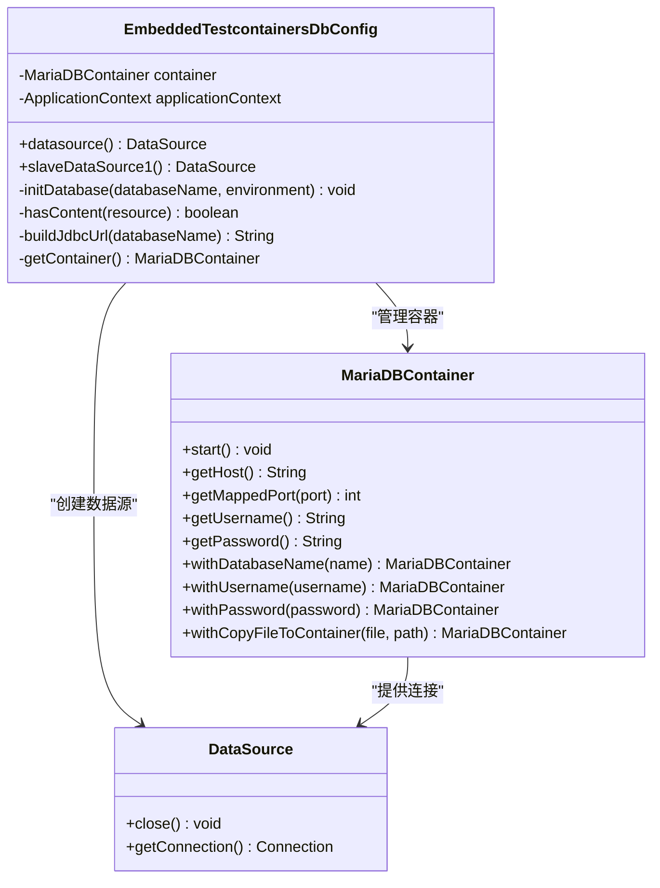

**图表来源**
- [EmbeddedTestcontainersDbConfig.java:34-154](file://common-dal/src/main/java/com/magicliang/transaction/sys/common/dal/datasource/EmbeddedTestcontainersDbConfig.java#L34-L154)

#### 数据库生命周期管理流程

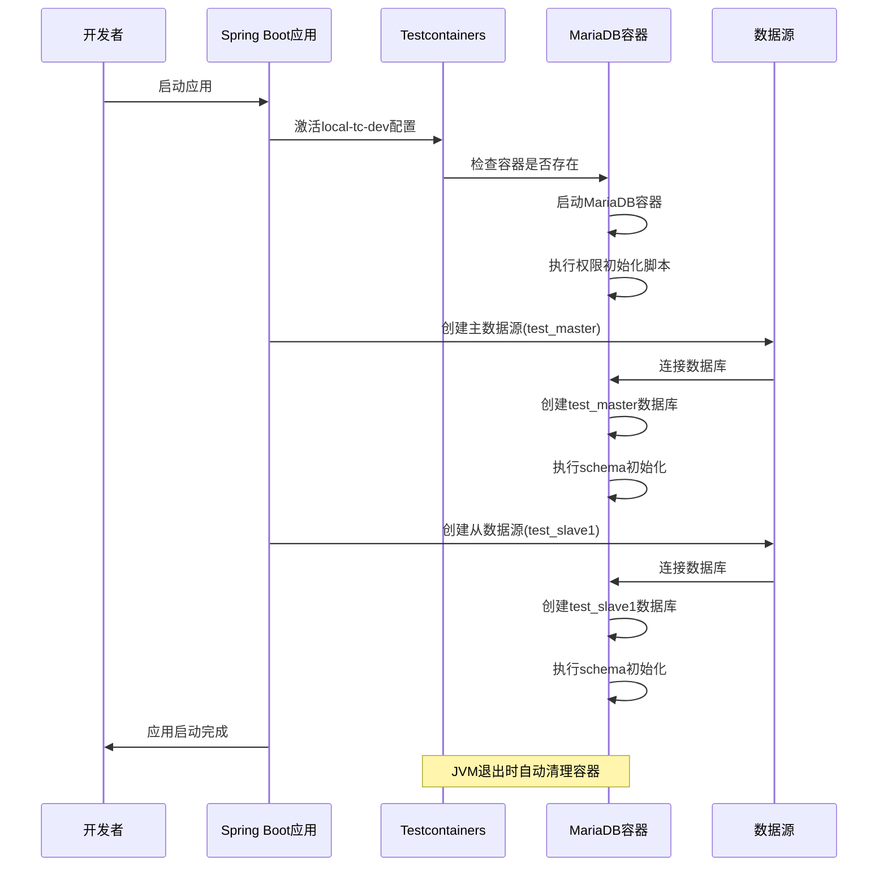

**图表来源**
- [EmbeddedTestcontainersDbConfig.java:48-62](file://common-dal/src/main/java/com/magicliang/transaction/sys/common/dal/datasource/EmbeddedTestcontainersDbConfig.java#L48-L62)
- [EmbeddedTestcontainersDbConfig.java:107-136](file://common-dal/src/main/java/com/magicliang/transaction/sys/common/dal/datasource/EmbeddedTestcontainersDbConfig.java#L107-L136)

#### 数据库初始化脚本配置

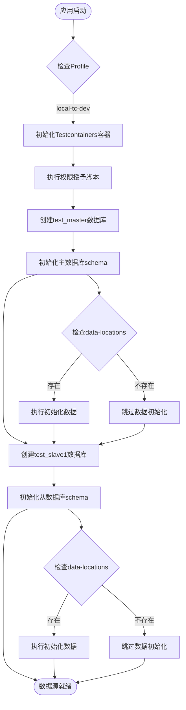

**图表来源**
- [EmbeddedTestcontainersDbConfig.java:107-136](file://common-dal/src/main/java/com/magicliang/transaction/sys/common/dal/datasource/EmbeddedTestcontainersDbConfig.java#L107-L136)
- [application.yml:136-140](file://biz-service-impl/src/main/resources/application.yml#L136-L140)

**章节来源**
- [EmbeddedTestcontainersDbConfig.java:107-136](file://common-dal/src/main/java/com/magicliang/transaction/sys/common/dal/datasource/EmbeddedTestcontainersDbConfig.java#L107-L136)
- [tc-init-privileges.sql:1-4](file://common-dal/src/main/resources/sql/tc-init-privileges.sql#L1-L4)

### 数据库连接配置分析

#### 主从数据库配置

local-tc-dev 支持双数据库模式，通过不同的 JDBC URL 连接到同一容器内的不同数据库：

| 配置项 | 主数据库(test_master) | 从数据库(test_slave1) |
|--------|----------------------|----------------------|
| 数据库名 | test_master | test_slave1 |
| 用户名 | test | test |
| 密码 | test | test |
| 驱动类 | org.mariadb.jdbc.Driver | org.mariadb.jdbc.Driver |
| 连接池 | HikariCP | HikariCP |

#### 环境变量配置

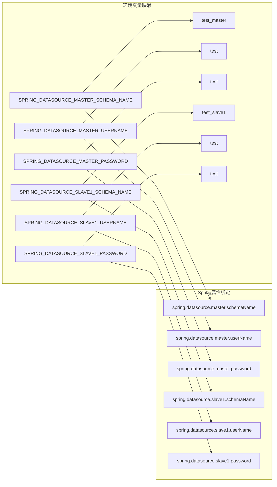

**图表来源**
- [application.yml:125-135](file://biz-service-impl/src/main/resources/application.yml#L125-L135)

**章节来源**
- [application.yml:125-140](file://biz-service-impl/src/main/resources/application.yml#L125-L140)

### 容器化数据库配置

#### Docker Desktop 使用方法

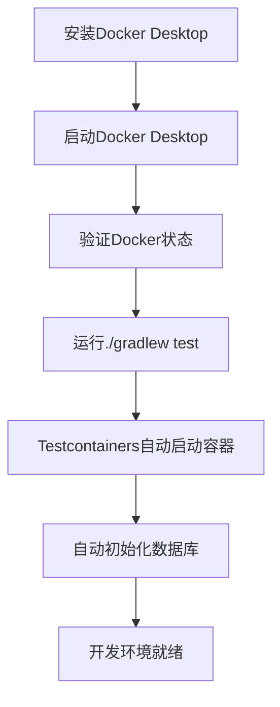

**图表来源**
- [README.md:130-140](file://README.md#L130-L140)

#### Podman 使用方法

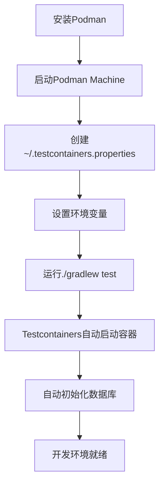

**图表来源**
- [README.md:142-203](file://README.md#L142-L203)

**章节来源**
- [README.md:130-203](file://README.md#L130-L203)

## 依赖关系分析

### 组件依赖图

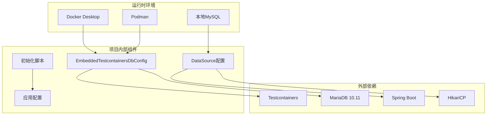

**图表来源**
- [EmbeddedTestcontainersDbConfig.java:22-23](file://common-dal/src/main/java/com/magicliang/transaction/sys/common/dal/datasource/EmbeddedTestcontainersDbConfig.java#L22-L23)
- [application.yml:121-146](file://biz-service-impl/src/main/resources/application.yml#L121-L146)

### 数据流分析

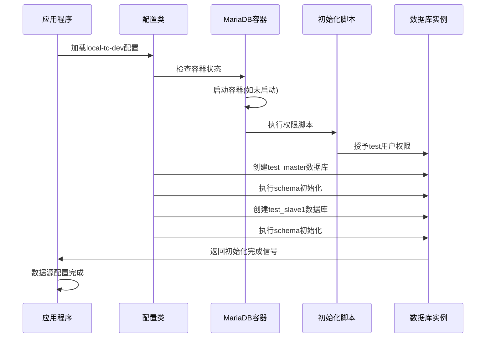

**图表来源**
- [EmbeddedTestcontainersDbConfig.java:48-62](file://common-dal/src/main/java/com/magicliang/transaction/sys/common/dal/datasource/EmbeddedTestcontainersDbConfig.java#L48-L62)
- [EmbeddedTestcontainersDbConfig.java:107-136](file://common-dal/src/main/java/com/magicliang/transaction/sys/common/dal/datasource/EmbeddedTestcontainersDbConfig.java#L107-L136)

**章节来源**
- [EmbeddedTestcontainersDbConfig.java:48-136](file://common-dal/src/main/java/com/magicliang/transaction/sys/common/dal/datasource/EmbeddedTestcontainersDbConfig.java#L48-L136)

## 性能考虑

### 连接池配置优化

local-tc-dev 默认使用 HikariCP 连接池，配置了以下关键参数：
- **minimum-idle**: 5 - 最小空闲连接数
- **maximum-pool-size**: 30 - 最大连接池大小  
- **max-lifetime**: 1800000 - 连接最大生命周期(毫秒)
- **connection-timeout**: 1000 - 连接超时时间(毫秒)

### 容器性能优化

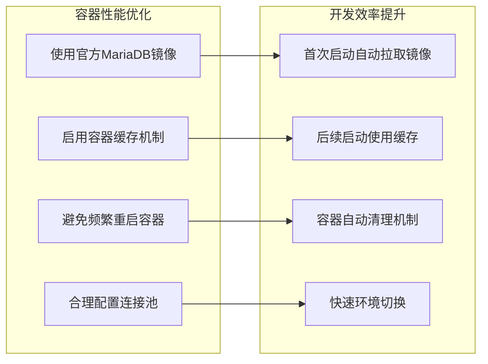

### 内存和资源管理

- **容器内存限制**：MariaDB容器默认使用系统分配的内存
- **连接池内存**：HikariCP根据maximum-pool-size控制内存使用
- **JVM内存**：通过JAVA_OPTS环境变量控制应用内存

## 故障排查指南

### 常见问题及解决方案

#### 1. Docker Desktop 连接问题

**问题症状**：
- Testcontainers无法连接到Docker守护进程
- 容器启动失败

**解决方案**：
1. 确认Docker Desktop正在运行
2. 检查Docker Desktop的权限设置
3. 重启Docker Desktop服务

#### 2. Podman 运行时配置问题

**问题症状**：
- Testcontainers无法找到Podman socket
- 容器启动超时

**解决方案**：
1. 创建`~/.testcontainers.properties`文件
2. 配置正确的docker.host路径
3. 设置ryuk.container.privileged=true
4. 验证Podman机器状态

#### 3. 数据库初始化失败

**问题症状**：
- 应用启动时报数据库连接错误
- schema初始化失败

**解决方案**：
1. 检查tc-init-privileges.sql文件是否存在
2. 验证schema.ddl文件的SQL语法
3. 确认数据库权限配置正确
4. 查看容器日志获取详细错误信息

#### 4. 端口冲突问题

**问题症状**：
- MariaDB容器启动失败
- 端口被占用

**解决方案**：
1. 检查宿主机端口占用情况
2. 修改application.yml中的端口配置
3. 重启相关服务释放端口

### 调试技巧

#### 启用详细日志

在application.yml中添加以下配置：

```yaml
logging:
  level:
    org.testcontainers: DEBUG
    org.mariadb: DEBUG
    com.zaxxer.hikari: DEBUG
```

#### 验证容器状态

使用以下命令检查容器状态：

```bash
# 查看Testcontainers相关容器
docker ps -a | grep testcontainers

# 查看MariaDB容器日志
docker logs <container_id>

# 检查端口映射
docker port <container_id>
```

**章节来源**
- [README.md:679-691](file://README.md#L679-L691)

## 结论

local-tc-dev 开发环境配置提供了完整的容器化数据库解决方案，具有以下优势：

1. **零配置启动**：通过Testcontainers自动管理MariaDB容器
2. **跨平台支持**：支持Docker Desktop和Podman两种运行时
3. **自动化管理**：自动创建数据库、执行初始化脚本
4. **灵活配置**：支持多种环境变量和配置选项
5. **开发友好**：提供详细的日志和故障排查指导

该配置特别适合需要快速搭建开发环境的团队，减少了环境配置的复杂性和维护成本。通过合理的性能优化和故障排查机制，能够为开发者提供稳定可靠的数据库开发体验。

## 附录

### 快速开始指南

1. **安装Docker Desktop或Podman**
2. **克隆项目并进入根目录**
3. **运行`./gradlew test`启动测试**
4. **应用启动后即可开始开发**

### 高级配置选项

#### 自定义初始化脚本

可以通过修改application.yml中的schema-locations和data-locations来定制数据库初始化内容：

```yaml
spring:
  sql:
    init:
      schema-locations: classpath:sql/custom-schema.ddl
      data-locations: classpath:sql/custom-data.sql
```

#### 环境变量覆盖

支持通过环境变量覆盖默认配置：

```bash
export SPRING_DATASOURCE_MASTER_SCHEMA_NAME="my_custom_db"
export SPRING_DATASOURCE_MASTER_USERNAME="custom_user"
export SPRING_DATASOURCE_MASTER_PASSWORD="custom_password"
```