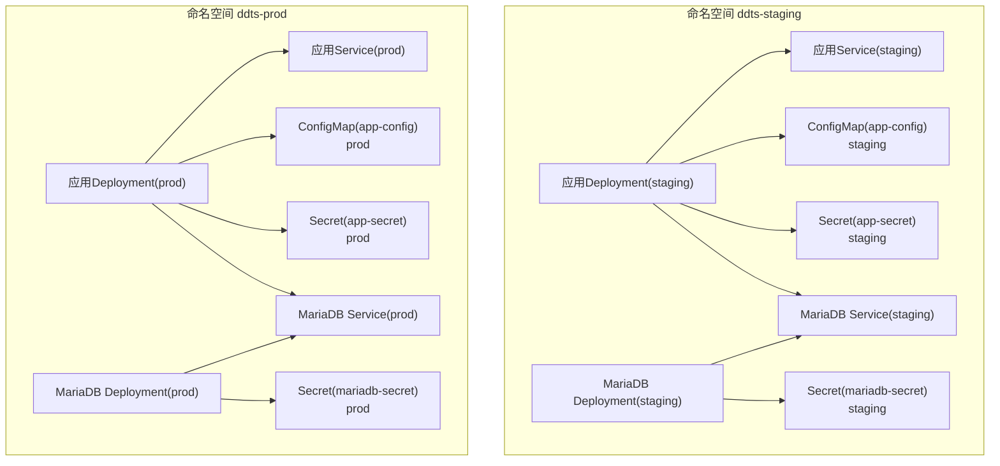
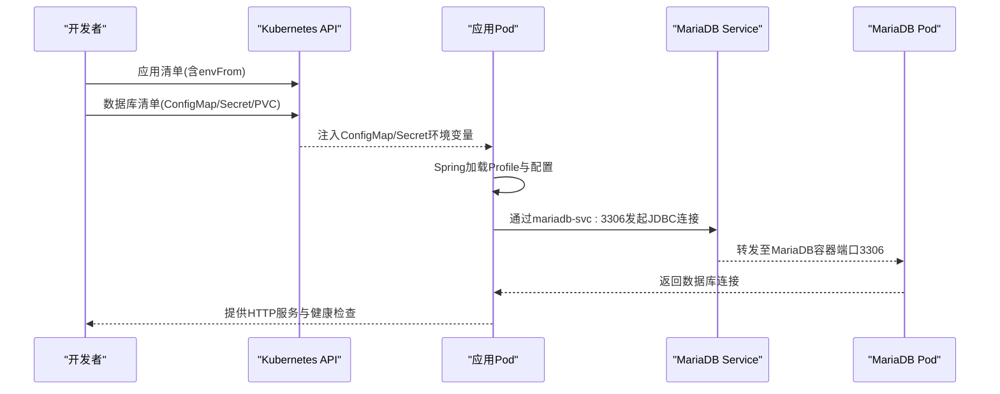
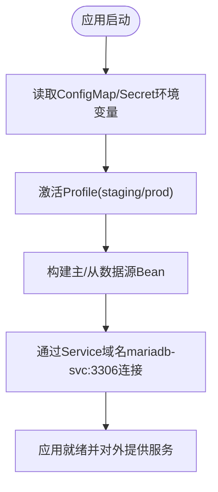
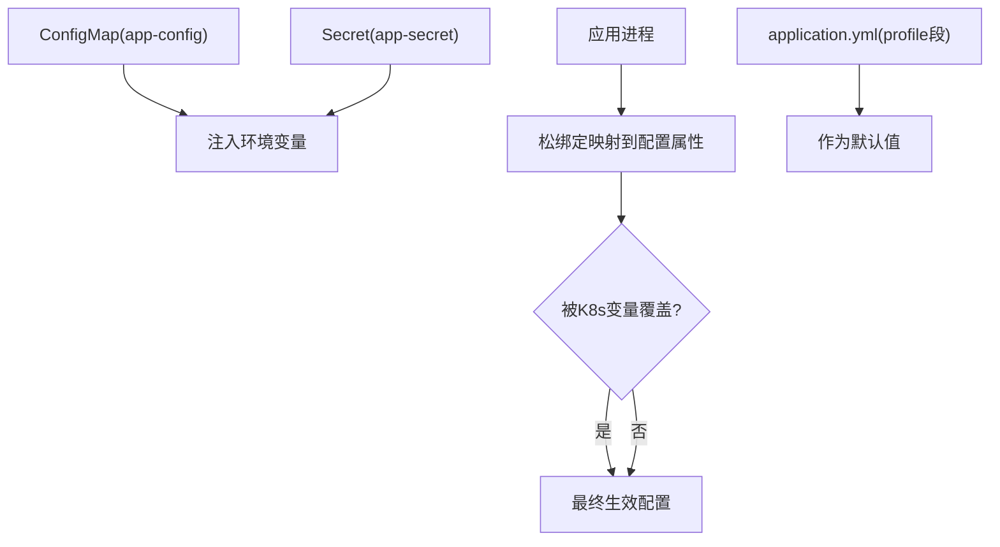
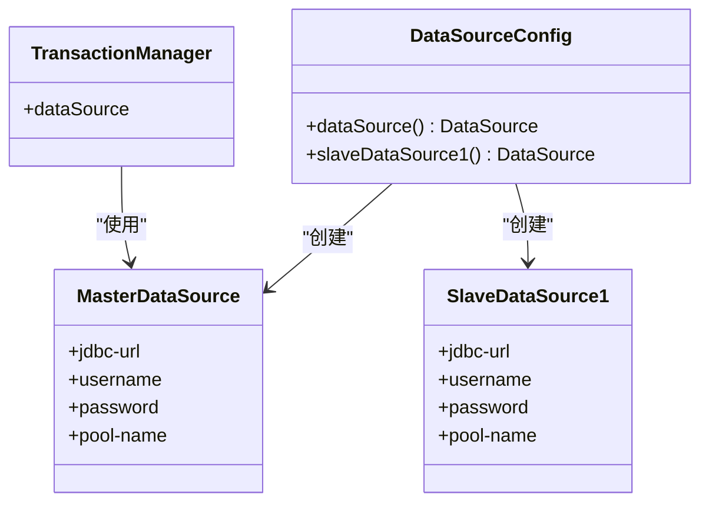
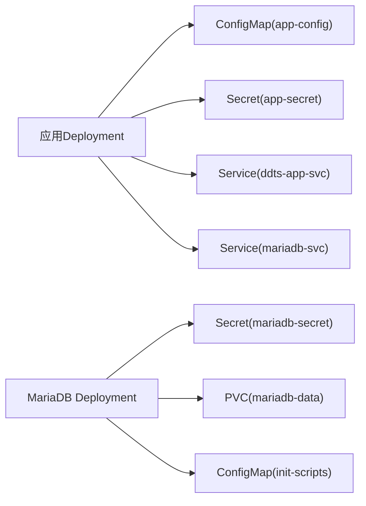

# staging和prod生产环境配置

<cite>
**本文引用的文件**
- [deploy/k8s/prod/06-app-configmap.yaml](file://deploy/k8s/prod/06-app-configmap.yaml)
- [deploy/k8s/prod/07-app-secret.yaml](file://deploy/k8s/prod/07-app-secret.yaml)
- [deploy/k8s/prod/08-app-deployment.yaml](file://deploy/k8s/prod/08-app-deployment.yaml)
- [deploy/k8s/prod/05-mariadb-service.yaml](file://deploy/k8s/prod/05-mariadb-service.yaml)
- [deploy/k8s/prod/04-mariadb-deployment.yaml](file://deploy/k8s/prod/04-mariadb-deployment.yaml)
- [deploy/k8s/prod/01-mariadb-secret.yaml](file://deploy/k8s/prod/01-mariadb-secret.yaml)
- [deploy/k8s/staging/06-app-configmap.yaml](file://deploy/k8s/staging/06-app-configmap.yaml)
- [deploy/k8s/staging/07-app-secret.yaml](file://deploy/k8s/staging/07-app-secret.yaml)
- [deploy/k8s/staging/08-app-deployment.yaml](file://deploy/k8s/staging/08-app-deployment.yaml)
- [deploy/k8s/staging/05-mariadb-service.yaml](file://deploy/k8s/staging/05-mariadb-service.yaml)
- [deploy/k8s/staging/04-mariadb-deployment.yaml](file://deploy/k8s/staging/04-mariadb-deployment.yaml)
- [deploy/k8s/staging/01-mariadb-secret.yaml](file://deploy/k8s/staging/01-mariadb-secret.yaml)
- [biz-service-impl/src/main/resources/application.yml](file://biz-service-impl/src/main/resources/application.yml)
- [biz-service-impl/src/main/resources/application.properties](file://biz-service-impl/src/main/resources/application.properties)
- [biz-service-impl/src/main/resources/spring/datasource.xml](file://biz-service-impl/src/main/resources/spring/datasource.xml)
- [common-dal/src/main/java/com/magicliang/transaction/sys/common/dal/datasource/DataSourceConfig.java](file://common-dal/src/main/java/com/magicliang/transaction/sys/common/dal/datasource/DataSourceConfig.java)
- [README.md](file://README.md)
- [deploy/scripts/env-start.sh](file://deploy/scripts/env-start.sh)
</cite>

## 目录
1. [简介](#简介)
2. [项目结构](#项目结构)
3. [核心组件](#核心组件)
4. [架构总览](#架构总览)
5. [详细组件分析](#详细组件分析)
6. [依赖关系分析](#依赖关系分析)
7. [性能考量](#性能考量)
8. [故障排查指南](#故障排查指南)
9. [结论](#结论)
10. [附录](#附录)

## 简介
本文件面向staging与prod生产环境，系统性说明Kubernetes下的数据库配置与安全策略，涵盖ConfigMap与Secret的使用、环境变量覆盖机制（含SPRING_DATASOURCE_MASTER_JDBC_URL等关键项）、生产安全（密码管理、SSL与网络访问控制）、Kubernetes部署与数据库服务发现配置，以及生产监控与故障排查建议。内容基于仓库中的Kubernetes清单、Spring配置与脚本，确保可操作与可追溯。

## 项目结构
- 环境隔离：dev/staging/prod三套独立的Kubernetes命名空间与资源清单，分别位于deploy/k8s/dev、deploy/k8s/staging、deploy/k8s/prod。
- 应用与数据库：应用Deployment通过envFrom注入ConfigMap/Secret；MariaDB以Deployment+Service+PVC形式提供数据库服务；应用通过ClusterIP Service域名mariadb-svc访问数据库。
- Spring Profile：通过SPRING_PROFILES_ACTIVE激活对应环境（staging/prod），并在application.yml中定义profile段落，配合K8s环境变量实现松绑定覆盖。

图表来源
- [deploy/k8s/staging/08-app-deployment.yaml:1-72](file://deploy/k8s/staging/08-app-deployment.yaml#L1-L72)
- [deploy/k8s/staging/05-mariadb-service.yaml:1-18](file://deploy/k8s/staging/05-mariadb-service.yaml#L1-L18)
- [deploy/k8s/staging/04-mariadb-deployment.yaml:1-74](file://deploy/k8s/staging/04-mariadb-deployment.yaml#L1-L74)
- [deploy/k8s/staging/06-app-configmap.yaml:1-22](file://deploy/k8s/staging/06-app-configmap.yaml#L1-L22)
- [deploy/k8s/staging/07-app-secret.yaml:1-14](file://deploy/k8s/staging/07-app-secret.yaml#L1-L14)
- [deploy/k8s/staging/01-mariadb-secret.yaml:1-13](file://deploy/k8s/staging/01-mariadb-secret.yaml#L1-L13)
- [deploy/k8s/prod/08-app-deployment.yaml:1-72](file://deploy/k8s/prod/08-app-deployment.yaml#L1-L72)
- [deploy/k8s/prod/05-mariadb-service.yaml:1-18](file://deploy/k8s/prod/05-mariadb-service.yaml#L1-L18)
- [deploy/k8s/prod/04-mariadb-deployment.yaml:1-74](file://deploy/k8s/prod/04-mariadb-deployment.yaml#L1-L74)
- [deploy/k8s/prod/06-app-configmap.yaml:1-22](file://deploy/k8s/prod/06-app-configmap.yaml#L1-L22)
- [deploy/k8s/prod/07-app-secret.yaml:1-15](file://deploy/k8s/prod/07-app-secret.yaml#L1-L15)
- [deploy/k8s/prod/01-mariadb-secret.yaml:1-14](file://deploy/k8s/prod/01-mariadb-secret.yaml#L1-L14)

章节来源
- [README.md:347-451](file://README.md#L347-L451)

## 核心组件
- 应用配置（ConfigMap）
  - staging/prod分别提供SPRING_PROFILES_ACTIVE、JDBC URL、驱动类名、用户名、连接池名称、日志配置、JVM参数等键值。
  - 示例路径：[deploy/k8s/staging/06-app-configmap.yaml:1-22](file://deploy/k8s/staging/06-app-configmap.yaml#L1-L22)、[deploy/k8s/prod/06-app-configmap.yaml:1-22](file://deploy/k8s/prod/06-app-configmap.yaml#L1-L22)
- 应用密钥（Secret）
  - staging/prod分别提供主库与从库密码（base64编码），用于数据库认证。
  - 示例路径：[deploy/k8s/staging/07-app-secret.yaml:1-14](file://deploy/k8s/staging/07-app-secret.yaml#L1-L14)、[deploy/k8s/prod/07-app-secret.yaml:1-15](file://deploy/k8s/prod/07-app-secret.yaml#L1-L15)
- MariaDB密钥（Secret）
  - staging/prod分别提供MARIADB_ROOT_PASSWORD，用于MariaDB实例初始化与运维。
  - 示例路径：[deploy/k8s/staging/01-mariadb-secret.yaml:1-13](file://deploy/k8s/staging/01-mariadb-secret.yaml#L1-L13)、[deploy/k8s/prod/01-mariadb-secret.yaml:1-14](file://deploy/k8s/prod/01-mariadb-secret.yaml#L1-L14)
- 应用Deployment
  - 通过envFrom同时引用app-config与app-secret；包含健康检查探针与资源限制。
  - 示例路径：[deploy/k8s/staging/08-app-deployment.yaml:1-72](file://deploy/k8s/staging/08-app-deployment.yaml#L1-L72)、[deploy/k8s/prod/08-app-deployment.yaml:1-72](file://deploy/k8s/prod/08-app-deployment.yaml#L1-L72)
- MariaDB Deployment与Service
  - 通过Service暴露ClusterIP:3306；容器内挂载PVC与初始化脚本ConfigMap。
  - 示例路径：[deploy/k8s/staging/04-mariadb-deployment.yaml:1-74](file://deploy/k8s/staging/04-mariadb-deployment.yaml#L1-L74)、[deploy/k8s/staging/05-mariadb-service.yaml:1-18](file://deploy/k8s/staging/05-mariadb-service.yaml#L1-L18)、[deploy/k8s/prod/04-mariadb-deployment.yaml:1-74](file://deploy/k8s/prod/04-mariadb-deployment.yaml#L1-L74)、[deploy/k8s/prod/05-mariadb-service.yaml:1-18](file://deploy/k8s/prod/05-mariadb-service.yaml#L1-L18)
- Spring Profile与数据源配置
  - application.yml定义staging/prod profile段，配合DataSourceConfig.java创建主/从数据源Bean。
  - 示例路径：[biz-service-impl/src/main/resources/application.yml:175-215](file://biz-service-impl/src/main/resources/application.yml#L175-L215)、[common-dal/src/main/java/com/magicliang/transaction/sys/common/dal/datasource/DataSourceConfig.java:22-82](file://common-dal/src/main/java/com/magicliang/transaction/sys/common/dal/datasource/DataSourceConfig.java#L22-L82)

章节来源
- [deploy/k8s/staging/06-app-configmap.yaml:1-22](file://deploy/k8s/staging/06-app-configmap.yaml#L1-L22)
- [deploy/k8s/staging/07-app-secret.yaml:1-14](file://deploy/k8s/staging/07-app-secret.yaml#L1-L14)
- [deploy/k8s/prod/06-app-configmap.yaml:1-22](file://deploy/k8s/prod/06-app-configmap.yaml#L1-L22)
- [deploy/k8s/prod/07-app-secret.yaml:1-15](file://deploy/k8s/prod/07-app-secret.yaml#L1-L15)
- [deploy/k8s/staging/08-app-deployment.yaml:1-72](file://deploy/k8s/staging/08-app-deployment.yaml#L1-L72)
- [deploy/k8s/prod/08-app-deployment.yaml:1-72](file://deploy/k8s/prod/08-app-deployment.yaml#L1-L72)
- [deploy/k8s/staging/04-mariadb-deployment.yaml:1-74](file://deploy/k8s/staging/04-mariadb-deployment.yaml#L1-L74)
- [deploy/k8s/staging/05-mariadb-service.yaml:1-18](file://deploy/k8s/staging/05-mariadb-service.yaml#L1-L18)
- [deploy/k8s/prod/04-mariadb-deployment.yaml:1-74](file://deploy/k8s/prod/04-mariadb-deployment.yaml#L1-L74)
- [deploy/k8s/prod/05-mariadb-service.yaml:1-18](file://deploy/k8s/prod/05-mariadb-service.yaml#L1-L18)
- [biz-service-impl/src/main/resources/application.yml:175-215](file://biz-service-impl/src/main/resources/application.yml#L175-L215)
- [common-dal/src/main/java/com/magicliang/transaction/sys/common/dal/datasource/DataSourceConfig.java:22-82](file://common-dal/src/main/java/com/magicliang/transaction/sys/common/dal/datasource/DataSourceConfig.java#L22-L82)

## 架构总览
下图展示应用与数据库在Kubernetes中的交互关系，强调环境变量覆盖与服务发现：

图表来源
- [deploy/k8s/staging/08-app-deployment.yaml:40-44](file://deploy/k8s/staging/08-app-deployment.yaml#L40-L44)
- [deploy/k8s/prod/08-app-deployment.yaml:40-44](file://deploy/k8s/prod/08-app-deployment.yaml#L40-L44)
- [deploy/k8s/staging/05-mariadb-service.yaml:10-17](file://deploy/k8s/staging/05-mariadb-service.yaml#L10-L17)
- [deploy/k8s/prod/05-mariadb-service.yaml:10-17](file://deploy/k8s/prod/05-mariadb-service.yaml#L10-L17)

章节来源
- [README.md:347-451](file://README.md#L347-L451)

## 详细组件分析

### 数据库配置与服务发现
- 应用侧通过SPRING_DATASOURCE_MASTER_JDBC_URL与SPRING_DATASOURCE_SLAVE1_JDBC_URL指向mariadb-svc:3306，实现集群内服务发现。
- MariaDB Service类型为ClusterIP，端口3306，目标端口3306，selector匹配MariaDB Pod标签。
- 初次启动MariaDB会执行初始化脚本（ConfigMap挂载至/docker-entrypoint-initdb.d），创建数据库与表结构，并写入初始数据。

图表来源
- [biz-service-impl/src/main/resources/application.yml:175-215](file://biz-service-impl/src/main/resources/application.yml#L175-L215)
- [common-dal/src/main/java/com/magicliang/transaction/sys/common/dal/datasource/DataSourceConfig.java:33-52](file://common-dal/src/main/java/com/magicliang/transaction/sys/common/dal/datasource/DataSourceConfig.java#L33-L52)
- [deploy/k8s/staging/05-mariadb-service.yaml:10-17](file://deploy/k8s/staging/05-mariadb-service.yaml#L10-L17)
- [deploy/k8s/prod/05-mariadb-service.yaml:10-17](file://deploy/k8s/prod/05-mariadb-service.yaml#L10-L17)

章节来源
- [deploy/k8s/staging/05-mariadb-service.yaml:1-18](file://deploy/k8s/staging/05-mariadb-service.yaml#L1-L18)
- [deploy/k8s/prod/05-mariadb-service.yaml:1-18](file://deploy/k8s/prod/05-mariadb-service.yaml#L1-L18)
- [deploy/k8s/staging/04-mariadb-deployment.yaml:1-74](file://deploy/k8s/staging/04-mariadb-deployment.yaml#L1-L74)
- [deploy/k8s/prod/04-mariadb-deployment.yaml:1-74](file://deploy/k8s/prod/04-mariadb-deployment.yaml#L1-L74)

### 环境变量覆盖机制
- K8s通过envFrom将ConfigMap与Secret注入为环境变量，Spring Boot以松绑定方式映射到配置属性。
- 关键覆盖项（示例路径）：
  - SPRING_PROFILES_ACTIVE → 激活对应Profile
  - SPRING_DATASOURCE_MASTER_JDBC_URL → 主库JDBC URL
  - SPRING_DATASOURCE_MASTER_USERNAME → 主库用户名
  - SPRING_DATASOURCE_MASTER_PASSWORD → 主库密码（Secret）
  - SPRING_DATASOURCE_SLAVE1_JDBC_URL → 从库JDBC URL
  - SPRING_DATASOURCE_SLAVE1_USERNAME → 从库用户名
  - SPRING_DATASOURCE_SLAVE1_PASSWORD → 从库密码（Secret）
  - JAVA_OPTS → JVM参数
  - COMMON_ENV → 业务环境标识
  - LOGGING_CONFIG → 日志配置路径

图表来源
- [deploy/k8s/staging/06-app-configmap.yaml:10-21](file://deploy/k8s/staging/06-app-configmap.yaml#L10-L21)
- [deploy/k8s/staging/07-app-secret.yaml:10-13](file://deploy/k8s/staging/07-app-secret.yaml#L10-L13)
- [deploy/k8s/prod/06-app-configmap.yaml:10-21](file://deploy/k8s/prod/06-app-configmap.yaml#L10-L21)
- [deploy/k8s/prod/07-app-secret.yaml:10-14](file://deploy/k8s/prod/07-app-secret.yaml#L10-L14)
- [biz-service-impl/src/main/resources/application.yml:175-215](file://biz-service-impl/src/main/resources/application.yml#L175-L215)

章节来源
- [README.md:361-385](file://README.md#L361-L385)

### 生产安全配置
- 密码管理
  - MariaDB root密码与应用数据库密码均以Secret存储，base64编码，避免明文泄露。
  - 修改密码需同步更新MariaDB Secret与应用Secret，并滚动重启相关Pod。
  - 参考路径：[deploy/k8s/staging/01-mariadb-secret.yaml:11-12](file://deploy/k8s/staging/01-mariadb-secret.yaml#L11-L12)、[deploy/k8s/staging/07-app-secret.yaml:11-13](file://deploy/k8s/staging/07-app-secret.yaml#L11-L13)、[deploy/k8s/prod/01-mariadb-secret.yaml:11-13](file://deploy/k8s/prod/01-mariadb-secret.yaml#L11-L13)、[deploy/k8s/prod/07-app-secret.yaml:11-14](file://deploy/k8s/prod/07-app-secret.yaml#L11-L14)
- SSL配置
  - 当前JDBC URL中useSSL=false，适用于集群内通信；若需跨网络或外部访问，应启用SSL并配置证书校验。
  - 可在JDBC URL查询参数中调整useSSL/connectTimeout/socketTimeout等。
  - 参考路径：[deploy/k8s/staging/06-app-configmap.yaml:11-18](file://deploy/k8s/staging/06-app-configmap.yaml#L11-L18)、[deploy/k8s/prod/06-app-configmap.yaml:11-18](file://deploy/k8s/prod/06-app-configmap.yaml#L11-L18)
- 网络访问控制
  - MariaDB Service为ClusterIP，仅允许同命名空间内的Pod访问；如需外部访问，可通过Service类型调整或Ingress/LoadBalancer。
  - 参考路径：[deploy/k8s/staging/05-mariadb-service.yaml:10-17](file://deploy/k8s/staging/05-mariadb-service.yaml#L10-L17)、[deploy/k8s/prod/05-mariadb-service.yaml:10-17](file://deploy/k8s/prod/05-mariadb-service.yaml#L10-L17)

章节来源
- [README.md:404-444](file://README.md#L404-L444)

### Kubernetes部署配置示例
- 应用Deployment
  - envFrom同时引用app-config与app-secret；设置startup/readiness/liveness探针；定义CPU/Memory请求与限制。
  - 参考路径：[deploy/k8s/staging/08-app-deployment.yaml:40-71](file://deploy/k8s/staging/08-app-deployment.yaml#L40-L71)、[deploy/k8s/prod/08-app-deployment.yaml:40-71](file://deploy/k8s/prod/08-app-deployment.yaml#L40-L71)
- 应用Service
  - LoadBalancer类型，暴露8502端口；selector匹配应用Pod标签。
  - 参考路径：[deploy/k8s/staging/09-app-service.yaml:1-17](file://deploy/k8s/staging/09-app-service.yaml#L1-L17)、[deploy/k8s/prod/09-app-service.yaml:1-17](file://deploy/k8s/prod/09-app-service.yaml#L1-L17)
- MariaDB Deployment
  - 挂载PVC与初始化脚本ConfigMap；设置探针；容器端口3306。
  - 参考路径：[deploy/k8s/staging/04-mariadb-deployment.yaml:45-73](file://deploy/k8s/staging/04-mariadb-deployment.yaml#L45-L73)、[deploy/k8s/prod/04-mariadb-deployment.yaml:45-73](file://deploy/k8s/prod/04-mariadb-deployment.yaml#L45-L73)

章节来源
- [deploy/k8s/staging/08-app-deployment.yaml:1-72](file://deploy/k8s/staging/08-app-deployment.yaml#L1-L72)
- [deploy/k8s/prod/08-app-deployment.yaml:1-72](file://deploy/k8s/prod/08-app-deployment.yaml#L1-L72)
- [deploy/k8s/staging/09-app-service.yaml:1-17](file://deploy/k8s/staging/09-app-service.yaml#L1-L17)
- [deploy/k8s/prod/09-app-service.yaml:1-17](file://deploy/k8s/prod/09-app-service.yaml#L1-L17)
- [deploy/k8s/staging/04-mariadb-deployment.yaml:1-74](file://deploy/k8s/staging/04-mariadb-deployment.yaml#L1-L74)
- [deploy/k8s/prod/04-mariadb-deployment.yaml:1-74](file://deploy/k8s/prod/04-mariadb-deployment.yaml#L1-L74)

### 数据源Bean与事务管理
- DataSourceConfig.java在staging/prod/profile激活时创建主/从数据源Bean，并将主数据源标记为@Primary。
- spring/datasource.xml定义了基于DataSource的事务管理器，与Spring Boot自动配置协同工作。

图表来源
- [common-dal/src/main/java/com/magicliang/transaction/sys/common/dal/datasource/DataSourceConfig.java:33-52](file://common-dal/src/main/java/com/magicliang/transaction/sys/common/dal/datasource/DataSourceConfig.java#L33-L52)
- [biz-service-impl/src/main/resources/spring/datasource.xml:8-14](file://biz-service-impl/src/main/resources/spring/datasource.xml#L8-L14)

章节来源
- [common-dal/src/main/java/com/magicliang/transaction/sys/common/dal/datasource/DataSourceConfig.java:22-82](file://common-dal/src/main/java/com/magicliang/transaction/sys/common/dal/datasource/DataSourceConfig.java#L22-L82)
- [biz-service-impl/src/main/resources/spring/datasource.xml:1-16](file://biz-service-impl/src/main/resources/spring/datasource.xml#L1-L16)

## 依赖关系分析
- 组件耦合
  - 应用Deployment依赖ConfigMap/Secret提供配置；依赖MariaDB Service进行数据库访问。
  - 数据源Bean依赖application.yml中profile段的属性前缀（spring.datasource.master.*、spring.datasource.slave1.*）。
- 外部依赖
  - MariaDB官方镜像；Kubernetes Service/Deployment/ConfigMap/Secret/PVC资源。
- 可能的循环依赖
  - 无显式循环依赖；Spring配置与K8s资源解耦。

图表来源
- [deploy/k8s/staging/08-app-deployment.yaml:40-44](file://deploy/k8s/staging/08-app-deployment.yaml#L40-L44)
- [deploy/k8s/prod/08-app-deployment.yaml:40-44](file://deploy/k8s/prod/08-app-deployment.yaml#L40-L44)
- [deploy/k8s/staging/05-mariadb-service.yaml:10-17](file://deploy/k8s/staging/05-mariadb-service.yaml#L10-L17)
- [deploy/k8s/prod/05-mariadb-service.yaml:10-17](file://deploy/k8s/prod/05-mariadb-service.yaml#L10-L17)
- [deploy/k8s/staging/04-mariadb-deployment.yaml:67-73](file://deploy/k8s/staging/04-mariadb-deployment.yaml#L67-L73)
- [deploy/k8s/prod/04-mariadb-deployment.yaml:67-73](file://deploy/k8s/prod/04-mariadb-deployment.yaml#L67-L73)

章节来源
- [README.md:347-451](file://README.md#L347-L451)

## 性能考量
- 连接池与超时
  - JDBC URL中包含socketTimeout、connectTimeout、useCompression等参数，可在高延迟或高负载环境下调优。
  - 参考路径：[deploy/k8s/staging/06-app-configmap.yaml:11-18](file://deploy/k8s/staging/06-app-configmap.yaml#L11-L18)、[deploy/k8s/prod/06-app-configmap.yaml:11-18](file://deploy/k8s/prod/06-app-configmap.yaml#L11-L18)
- JVM参数
  - 通过JAVA_OPTS设置堆大小与GC策略，建议在staging/prod中根据实际负载调整。
  - 参考路径：[deploy/k8s/staging/06-app-configmap.yaml:21-21](file://deploy/k8s/staging/06-app-configmap.yaml#L21-L21)、[deploy/k8s/prod/06-app-configmap.yaml:21-21](file://deploy/k8s/prod/06-app-configmap.yaml#L21-L21)
- 资源限制
  - Deployment中定义requests/limits，建议结合HPA与监控指标动态扩容。
  - 参考路径：[deploy/k8s/staging/08-app-deployment.yaml:45-51](file://deploy/k8s/staging/08-app-deployment.yaml#L45-L51)、[deploy/k8s/prod/08-app-deployment.yaml:45-51](file://deploy/k8s/prod/08-app-deployment.yaml#L45-L51)

## 故障排查指南
- 应用未就绪
  - 检查探针路径与端口是否正确；查看Pod事件与日志。
  - 参考路径：[deploy/k8s/staging/08-app-deployment.yaml:52-71](file://deploy/k8s/staging/08-app-deployment.yaml#L52-L71)、[deploy/k8s/prod/08-app-deployment.yaml:52-71](file://deploy/k8s/prod/08-app-deployment.yaml#L52-L71)
- 数据库连接失败
  - 确认JDBC URL、用户名、密码是否与ConfigMap/Secret一致；检查Service DNS解析与端口连通性。
  - 参考路径：[deploy/k8s/staging/06-app-configmap.yaml:11-18](file://deploy/k8s/staging/06-app-configmap.yaml#L11-L18)、[deploy/k8s/prod/06-app-configmap.yaml:11-18](file://deploy/k8s/prod/06-app-configmap.yaml#L11-L18)、[deploy/k8s/staging/05-mariadb-service.yaml:10-17](file://deploy/k8s/staging/05-mariadb-service.yaml#L10-L17)、[deploy/k8s/prod/05-mariadb-service.yaml:10-17](file://deploy/k8s/prod/05-mariadb-service.yaml#L10-L17)
- MariaDB未就绪
  - 查看MariaDB Pod就绪探针状态与日志；确认PVC与初始化脚本是否成功。
  - 参考路径：[deploy/k8s/staging/04-mariadb-deployment.yaml:51-66](file://deploy/k8s/staging/04-mariadb-deployment.yaml#L51-L66)、[deploy/k8s/prod/04-mariadb-deployment.yaml:51-66](file://deploy/k8s/prod/04-mariadb-deployment.yaml#L51-L66)
- 密码问题
  - 修改MariaDB root密码与应用数据库密码需同步更新Secret并重启Pod；如PVC已初始化，需手动执行ALTER USER或重建PVC。
  - 参考路径：[README.md:404-425](file://README.md#L404-L425)
- 访问入口
  - LoadBalancer分配外部IP后，可通过Service URL访问；若未分配，使用minikube tunnel或kubectl port-forward临时调试。
  - 参考路径：[deploy/scripts/env-start.sh:162-211](file://deploy/scripts/env-start.sh#L162-L211)

章节来源
- [README.md:404-451](file://README.md#L404-L451)
- [deploy/scripts/env-start.sh:136-158](file://deploy/scripts/env-start.sh#L136-L158)

## 结论
本方案通过Kubernetes的ConfigMap/Secret实现配置与密钥的集中管理，结合Spring Profile与松绑定机制完成环境变量覆盖，确保staging与prod环境的隔离与一致性。MariaDB以Service形式提供稳定的服务发现，配合PVC与初始化脚本实现数据持久化与Schema初始化。生产安全方面，采用Secret存储密码、ClusterIP限制网络暴露、可选SSL增强传输安全。建议在生产环境中持续完善监控与告警、定期轮换密钥、按需调整JDBC与JVM参数，并通过HPA与资源配额保障稳定性。

## 附录
- 环境变量覆盖优先级（从高到低）
  - K8s Secret环境变量 > K8s ConfigMap环境变量 > application.yml中profile段默认值 > application.yml主段默认值
  - 参考路径：[README.md:365-369](file://README.md#L365-L369)
- Profile与环境映射
  - staging → SPRING_PROFILES_ACTIVE=staging → application.yml中staging profile段
  - prod → SPRING_PROFILES_ACTIVE=prod → application.yml中prod profile段
  - 参考路径：[README.md:349-358](file://README.md#L349-L358)