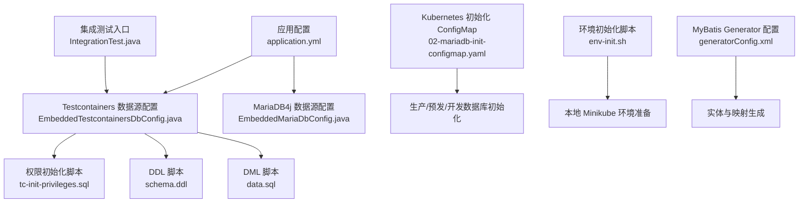
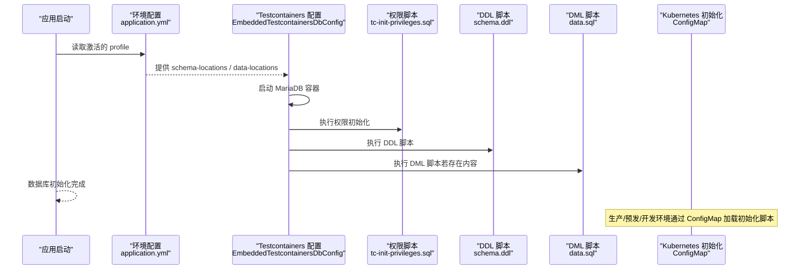
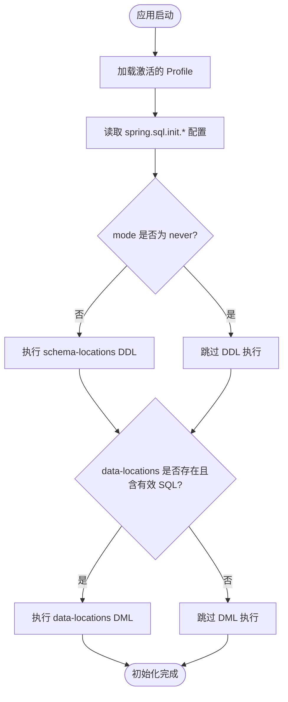
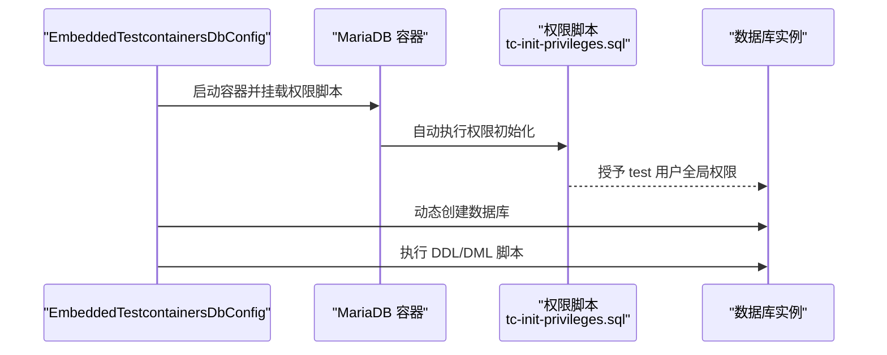
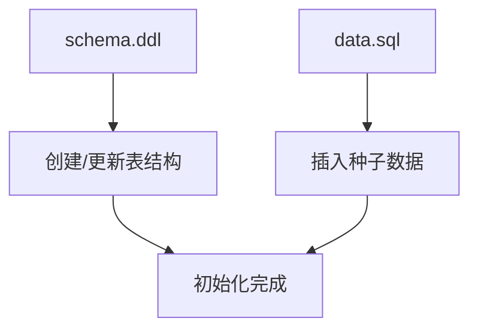
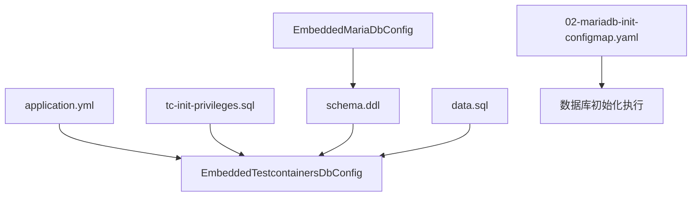

# 数据库初始化和脚本管理

<cite>
**本文档引用的文件**
- [application.yml](file://biz-service-impl/src/main/resources/application.yml)
- [EmbeddedTestcontainersDbConfig.java](file://common-dal/src/main/java/com/magicliang/transaction/sys/common/dal/datasource/EmbeddedTestcontainersDbConfig.java)
- [tc-init-privileges.sql](file://common-dal/src/main/resources/sql/tc-init-privileges.sql)
- [schema.ddl](file://biz-service-impl/src/main/resources/sql/mysql/schema.ddl)
- [data.sql](file://biz-service-impl/src/main/resources/sql/mysql/data.sql)
- [EmbeddedMariaDbConfig.java](file://common-dal/src/main/java/com/magicliang/transaction/sys/common/dal/datasource/EmbeddedMariaDbConfig.java)
- [02-mariadb-init-configmap.yaml](file://deploy/k8s/dev/02-mariadb-init-configmap.yaml)
- [env-init.sh](file://deploy/scripts/env-init.sh)
- [DomainDrivenTransactionSysApplicationIntegrationTest.java](file://biz-service-impl/src/test/integration/java/com/magicliang/transaction/sys/DomainDrivenTransactionSysApplicationIntegrationTest.java)
- [generatorConfig.xml](file://common-dal/src/main/resources/autogen/generatorConfig.xml)
</cite>

## 目录
1. [简介](#简介)
2. [项目结构](#项目结构)
3. [核心组件](#核心组件)
4. [架构概览](#架构概览)
5. [详细组件分析](#详细组件分析)
6. [依赖分析](#依赖分析)
7. [性能考虑](#性能考虑)
8. [故障排查指南](#故障排查指南)
9. [结论](#结论)
10. [附录](#附录)

## 简介
本文件面向数据库初始化与脚本管理，系统性阐述DDL/DML脚本的组织结构与执行顺序，schema-locations与data-locations的配置机制与优先级，Testcontainers环境下的权限初始化脚本，数据库版本管理与迁移策略，脚本执行失败的排查方法与回滚机制，以及不同环境下的脚本加载策略与自定义配置方法。旨在帮助开发者在本地开发、集成测试、Kubernetes部署等多环境下稳定、可控地完成数据库初始化与演进。

## 项目结构
项目采用多模块结构，数据库初始化相关的关键位置如下：
- 应用配置与环境切换：biz-service-impl/src/main/resources/application.yml
- 测试容器数据库初始化：common-dal/src/main/java/com/magicliang/transaction/sys/common/dal/datasource/EmbeddedTestcontainersDbConfig.java
- 权限初始化脚本：common-dal/src/main/resources/sql/tc-init-privileges.sql
- DDL/DML脚本：biz-service-impl/src/main/resources/sql/mysql/schema.ddl、biz-service-impl/src/main/resources/sql/mysql/data.sql
- MariaDB4j嵌入式数据库配置：common-dal/src/main/java/com/magicliang/transaction/sys/common/dal/datasource/EmbeddedMariaDbConfig.java
- Kubernetes初始化脚本：deploy/k8s/dev/02-mariadb-init-configmap.yaml
- 环境初始化脚本：deploy/scripts/env-init.sh
- 集成测试入口：biz-service-impl/src/test/integration/java/com/magicliang/transaction/sys/DomainDrivenTransactionSysApplicationIntegrationTest.java
- MyBatis Generator配置：common-dal/src/main/resources/autogen/generatorConfig.xml

图表来源
- [application.yml:121-146](file://biz-service-impl/src/main/resources/application.yml#L121-L146)
- [EmbeddedTestcontainersDbConfig.java:107-136](file://common-dal/src/main/java/com/magicliang/transaction/sys/common/dal/datasource/EmbeddedTestcontainersDbConfig.java#L107-L136)
- [tc-init-privileges.sql:1-4](file://common-dal/src/main/resources/sql/tc-init-privileges.sql#L1-L4)
- [schema.ddl:1-145](file://biz-service-impl/src/main/resources/sql/mysql/schema.ddl#L1-L145)
- [data.sql:1-2](file://biz-service-impl/src/main/resources/sql/mysql/data.sql#L1-L2)
- [EmbeddedMariaDbConfig.java:61-125](file://common-dal/src/main/java/com/magicliang/transaction/sys/common/dal/datasource/EmbeddedMariaDbConfig.java#L61-L125)
- [02-mariadb-init-configmap.yaml:1-224](file://deploy/k8s/dev/02-mariadb-init-configmap.yaml#L1-L224)
- [env-init.sh:1-333](file://deploy/scripts/env-init.sh#L1-L333)
- [DomainDrivenTransactionSysApplicationIntegrationTest.java:52-56](file://biz-service-impl/src/test/integration/java/com/magicliang/transaction/sys/DomainDrivenTransactionSysApplicationIntegrationTest.java#L52-L56)
- [generatorConfig.xml:1-64](file://common-dal/src/main/resources/autogen/generatorConfig.xml#L1-L64)

章节来源
- [application.yml:121-146](file://biz-service-impl/src/main/resources/application.yml#L121-L146)
- [EmbeddedTestcontainersDbConfig.java:107-136](file://common-dal/src/main/java/com/magicliang/transaction/sys/common/dal/datasource/EmbeddedTestcontainersDbConfig.java#L107-L136)
- [EmbeddedMariaDbConfig.java:61-125](file://common-dal/src/main/java/com/magicliang/transaction/sys/common/dal/datasource/EmbeddedMariaDbConfig.java#L61-L125)
- [02-mariadb-init-configmap.yaml:1-224](file://deploy/k8s/dev/02-mariadb-init-configmap.yaml#L1-L224)
- [env-init.sh:1-333](file://deploy/scripts/env-init.sh#L1-L333)
- [DomainDrivenTransactionSysApplicationIntegrationTest.java:52-56](file://biz-service-impl/src/test/integration/java/com/magicliang/transaction/sys/DomainDrivenTransactionSysApplicationIntegrationTest.java#L52-L56)
- [generatorConfig.xml:1-64](file://common-dal/src/main/resources/autogen/generatorConfig.xml#L1-L64)

## 核心组件
- 配置驱动的脚本加载：通过application.yml中的spring.sql.init.schema-locations与spring.sql.init.data-locations，按环境激活加载对应脚本。
- Testcontainers容器化数据库：EmbeddedTestcontainersDbConfig在容器启动后，动态创建数据库并执行DDL/DML脚本。
- MariaDB4j嵌入式数据库：EmbeddedMariaDbConfig负责本地开发环境的嵌入式数据库初始化。
- Kubernetes初始化：通过ConfigMap挂载SQL脚本，实现集群内数据库初始化。
- 集成测试：DomainDrivenTransactionSysApplicationIntegrationTest确保测试上下文启动时数据库已正确初始化。

章节来源
- [application.yml:121-146](file://biz-service-impl/src/main/resources/application.yml#L121-L146)
- [EmbeddedTestcontainersDbConfig.java:107-136](file://common-dal/src/main/java/com/magicliang/transaction/sys/common/dal/datasource/EmbeddedTestcontainersDbConfig.java#L107-L136)
- [EmbeddedMariaDbConfig.java:61-125](file://common-dal/src/main/java/com/magicliang/transaction/sys/common/dal/datasource/EmbeddedMariaDbConfig.java#L61-L125)
- [02-mariadb-init-configmap.yaml:1-224](file://deploy/k8s/dev/02-mariadb-init-configmap.yaml#L1-L224)
- [DomainDrivenTransactionSysApplicationIntegrationTest.java:52-56](file://biz-service-impl/src/test/integration/java/com/magicliang/transaction/sys/DomainDrivenTransactionSysApplicationIntegrationTest.java#L52-L56)

## 架构概览
下图展示从配置到脚本执行的总体流程，涵盖本地Testcontainers、MariaDB4j以及Kubernetes三种初始化路径。

图表来源
- [application.yml:121-146](file://biz-service-impl/src/main/resources/application.yml#L121-L146)
- [EmbeddedTestcontainersDbConfig.java:107-136](file://common-dal/src/main/java/com/magicliang/transaction/sys/common/dal/datasource/EmbeddedTestcontainersDbConfig.java#L107-L136)
- [tc-init-privileges.sql:1-4](file://common-dal/src/main/resources/sql/tc-init-privileges.sql#L1-L4)
- [schema.ddl:1-145](file://biz-service-impl/src/main/resources/sql/mysql/schema.ddl#L1-L145)
- [data.sql:1-2](file://biz-service-impl/src/main/resources/sql/mysql/data.sql#L1-L2)
- [02-mariadb-init-configmap.yaml:1-224](file://deploy/k8s/dev/02-mariadb-init-configmap.yaml#L1-L224)

## 详细组件分析

### 配置驱动的脚本加载与优先级
- 配置项
  - spring.sql.init.schema-locations：指定DDL脚本位置
  - spring.sql.init.data-locations：指定DML脚本位置
  - spring.sql.init.mode：控制初始化模式（如never）
- 优先级与生效顺序
  - 通过Spring Profile激活不同环境配置块，最终生效的是当前激活profile对应的配置
  - 若未显式设置spring.sql.init.mode或设为never，则按schema-locations与data-locations加载脚本
- 执行顺序
  - 先执行DDL（schema-locations），再执行DML（data-locations），仅当data.sql存在有效SQL内容时才执行

图表来源
- [application.yml:121-146](file://biz-service-impl/src/main/resources/application.yml#L121-L146)
- [EmbeddedTestcontainersDbConfig.java:122-132](file://common-dal/src/main/java/com/magicliang/transaction/sys/common/dal/datasource/EmbeddedTestcontainersDbConfig.java#L122-L132)
- [schema.ddl:1-145](file://biz-service-impl/src/main/resources/sql/mysql/schema.ddl#L1-L145)
- [data.sql:1-2](file://biz-service-impl/src/main/resources/sql/mysql/data.sql#L1-L2)

章节来源
- [application.yml:121-146](file://biz-service-impl/src/main/resources/application.yml#L121-L146)
- [EmbeddedTestcontainersDbConfig.java:122-132](file://common-dal/src/main/java/com/magicliang/transaction/sys/common/dal/datasource/EmbeddedTestcontainersDbConfig.java#L122-L132)

### Testcontainers 环境下的权限初始化脚本
- 目标：为test用户授予全局权限，使其可在容器内动态创建数据库并执行初始化
- 机制：容器启动时将tc-init-privileges.sql复制到/docker-entrypoint-initdb.d/目录，随MariaDB初始化流程自动执行
- 影响：后续通过EmbeddedTestcontainersDbConfig动态创建数据库并执行DDL/DML成为可能

图表来源
- [EmbeddedTestcontainersDbConfig.java:48-62](file://common-dal/src/main/java/com/magicliang/transaction/sys/common/dal/datasource/EmbeddedTestcontainersDbConfig.java#L48-L62)
- [tc-init-privileges.sql:1-4](file://common-dal/src/main/resources/sql/tc-init-privileges.sql#L1-L4)

章节来源
- [EmbeddedTestcontainersDbConfig.java:48-62](file://common-dal/src/main/java/com/magicliang/transaction/sys/common/dal/datasource/EmbeddedTestcontainersDbConfig.java#L48-L62)
- [tc-init-privileges.sql:1-4](file://common-dal/src/main/resources/sql/tc-init-privileges.sql#L1-L4)

### DDL/DML 脚本组织与执行
- DDL组织：schema.ddl集中定义所有表结构、索引与注释，遵循统一命名与约束规范
- DML组织：data.sql预留种子数据占位，便于测试与初始化
- 执行策略：按配置加载，先DDL后DML；DML仅在存在有效内容时执行

图表来源
- [schema.ddl:1-145](file://biz-service-impl/src/main/resources/sql/mysql/schema.ddl#L1-L145)
- [data.sql:1-2](file://biz-service-impl/src/main/resources/sql/mysql/data.sql#L1-L2)

章节来源
- [schema.ddl:1-145](file://biz-service-impl/src/main/resources/sql/mysql/schema.ddl#L1-L145)
- [data.sql:1-2](file://biz-service-impl/src/main/resources/sql/mysql/data.sql#L1-L2)

### MariaDB4j 嵌入式数据库初始化
- 适用场景：本地开发与部分测试环境
- 初始化流程：创建数据库，随后加载schema-locations对应的DDL脚本
- 注意事项：当使用MariaDB4j时，需在配置中启用initialization-mode以确保schema按预期生成

章节来源
- [EmbeddedMariaDbConfig.java:61-125](file://common-dal/src/main/java/com/magicliang/transaction/sys/common/dal/datasource/EmbeddedMariaDbConfig.java#L61-L125)

### Kubernetes 环境下的脚本加载策略
- 通过ConfigMap挂载初始化脚本，包含数据库创建、DDL与DML
- 支持多环境（dev/staging/prod），每个环境独立维护ConfigMap
- 应用通过环境变量或挂载方式读取数据库连接信息，初始化脚本在数据库首次启动时执行

章节来源
- [02-mariadb-init-configmap.yaml:1-224](file://deploy/k8s/dev/02-mariadb-init-configmap.yaml#L1-L224)

### 集成测试与数据库可用性验证
- 集成测试类排除数据源自动配置，确保测试期间数据库处于可控状态
- 通过启动完整Spring上下文，验证数据库初始化与业务功能协同工作

章节来源
- [DomainDrivenTransactionSysApplicationIntegrationTest.java:52-56](file://biz-service-impl/src/test/integration/java/com/magicliang/transaction/sys/DomainDrivenTransactionSysApplicationIntegrationTest.java#L52-L56)

### 数据库版本管理与迁移策略
- 版本化脚本：建议将DDL/DML脚本按版本号前缀命名（如001_init_schema.sql、002_seed_data.sql），并在Kubernetes ConfigMap或CI流水线中按序执行
- 迁移策略：生产环境优先采用ConfigMap或专用迁移工具；开发环境可沿用Testcontainers/MariaDB4j初始化流程
- 回滚策略：在ConfigMap中维护“降级脚本”，或在CI中记录当前版本并提供回滚作业

（本节为通用实践指导，无需具体文件引用）

## 依赖分析
- 组件耦合
  - EmbeddedTestcontainersDbConfig依赖application.yml提供的配置与ClassPath资源
  - tc-init-privileges.sql与schema.ddl/data.sql共同构成容器内初始化闭环
  - MariaDB4j配置与Testcontainers配置互为替代方案，服务于不同环境
  - Kubernetes ConfigMap独立于应用配置，通过运维手段管理脚本版本
- 外部依赖
  - Testcontainers与MariaDB镜像
  - Spring Boot的SQL初始化机制（ScriptUtils）
  - Kubernetes ConfigMap与持久化存储

图表来源
- [application.yml:121-146](file://biz-service-impl/src/main/resources/application.yml#L121-L146)
- [EmbeddedTestcontainersDbConfig.java:107-136](file://common-dal/src/main/java/com/magicliang/transaction/sys/common/dal/datasource/EmbeddedTestcontainersDbConfig.java#L107-L136)
- [tc-init-privileges.sql:1-4](file://common-dal/src/main/resources/sql/tc-init-privileges.sql#L1-L4)
- [schema.ddl:1-145](file://biz-service-impl/src/main/resources/sql/mysql/schema.ddl#L1-L145)
- [data.sql:1-2](file://biz-service-impl/src/main/resources/sql/mysql/data.sql#L1-L2)
- [EmbeddedMariaDbConfig.java:61-125](file://common-dal/src/main/java/com/magicliang/transaction/sys/common/dal/datasource/EmbeddedMariaDbConfig.java#L61-L125)
- [02-mariadb-init-configmap.yaml:1-224](file://deploy/k8s/dev/02-mariadb-init-configmap.yaml#L1-L224)

章节来源
- [application.yml:121-146](file://biz-service-impl/src/main/resources/application.yml#L121-L146)
- [EmbeddedTestcontainersDbConfig.java:107-136](file://common-dal/src/main/java/com/magicliang/transaction/sys/common/dal/datasource/EmbeddedTestcontainersDbConfig.java#L107-L136)
- [EmbeddedMariaDbConfig.java:61-125](file://common-dal/src/main/java/com/magicliang/transaction/sys/common/dal/datasource/EmbeddedMariaDbConfig.java#L61-L125)
- [02-mariadb-init-configmap.yaml:1-224](file://deploy/k8s/dev/02-mariadb-init-configmap.yaml#L1-L224)

## 性能考虑
- 初始化批处理：合并多条DDL/DML为单次执行，减少连接开销
- 脚本体积：避免在data.sql中存放大量数据，必要时分批导入
- 索引策略：DDL中合理设计索引，避免初始化阶段造成长时间锁表
- 容器资源：Testcontainers容器应分配足够内存与CPU，避免初始化超时

（本节为通用指导，无需具体文件引用）

## 故障排查指南
- 常见问题
  - 权限不足：确认tc-init-privileges.sql已执行，test用户具备全局权限
  - 脚本为空：data.sql若仅含注释或空白，将被忽略，需添加有效SQL
  - 驱动与URL：检查driver-class-name与JDBC URL是否匹配
  - 模式冲突：hibernate.ddl-auto需设为none，避免与脚本冲突
- 排查步骤
  - 检查激活的Profile与对应配置块
  - 查看容器日志与初始化输出
  - 验证schema-locations与data-locations路径正确
  - 在Kubernetes环境中检查ConfigMap内容与挂载情况
- 回滚机制
  - 本地：删除容器与卷，重新拉起容器并重放初始化脚本
  - Kubernetes：通过ConfigMap回滚至上一版本，或执行降级脚本

章节来源
- [EmbeddedTestcontainersDbConfig.java:138-147](file://common-dal/src/main/java/com/magicliang/transaction/sys/common/dal/datasource/EmbeddedTestcontainersDbConfig.java#L138-L147)
- [application.yml:38-39](file://biz-service-impl/src/main/resources/application.yml#L38-L39)

## 结论
本项目通过配置驱动的脚本加载、Testcontainers与MariaDB4j两种本地初始化方案、以及Kubernetes ConfigMap的集群化初始化，实现了跨环境一致的数据库初始化体验。建议在生产环境采用ConfigMap或专用迁移工具进行版本化管理，并结合回滚策略保障变更安全。

## 附录
- MyBatis Generator配置：通过generatorConfig.xml生成实体与映射，配合DDL保持模型一致性
- 环境初始化脚本：env-init.sh提供Minikube与相关工具的一键安装与启动

章节来源
- [generatorConfig.xml:1-64](file://common-dal/src/main/resources/autogen/generatorConfig.xml#L1-L64)
- [env-init.sh:1-333](file://deploy/scripts/env-init.sh#L1-L333)