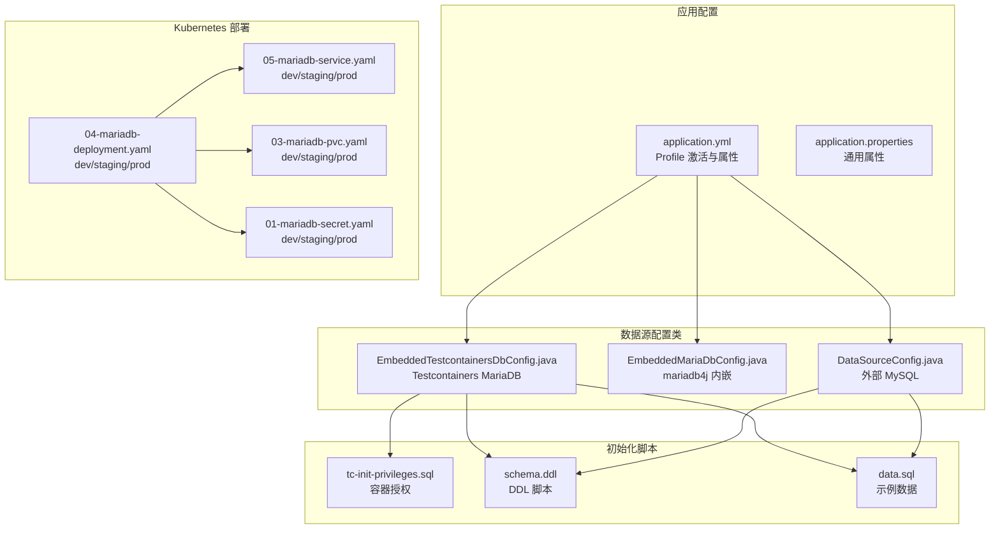
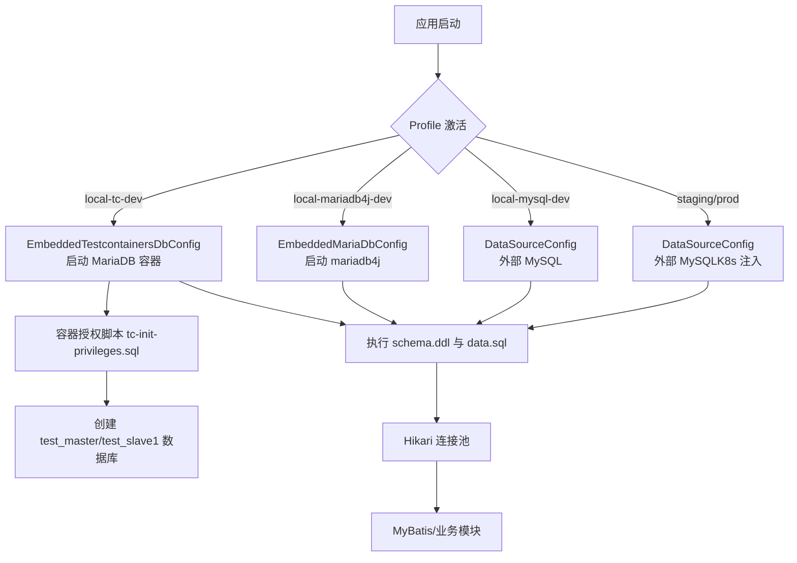
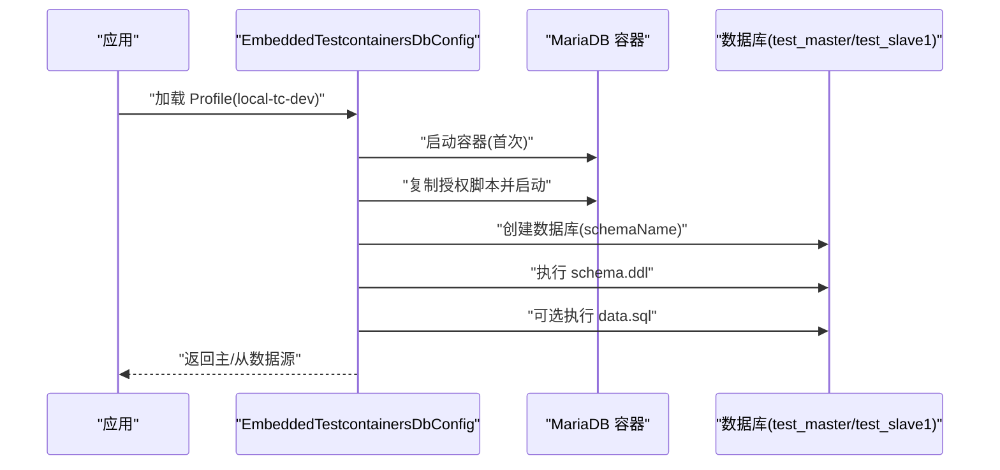
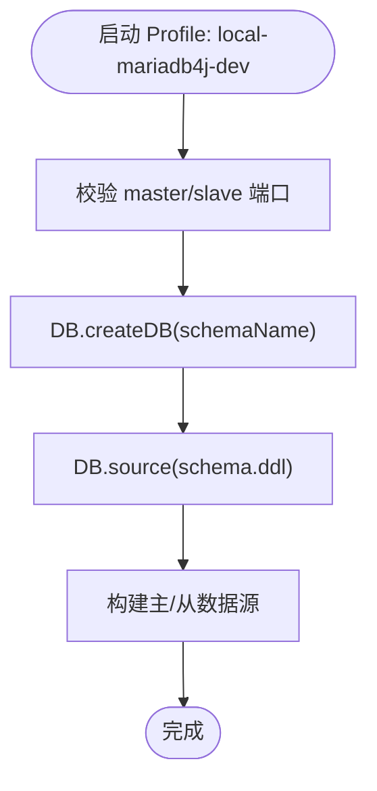
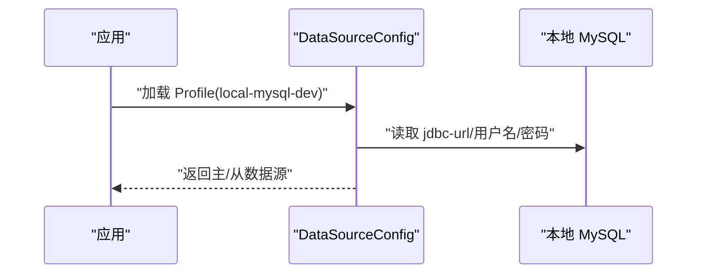
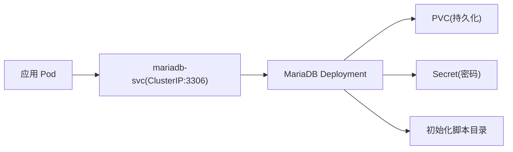
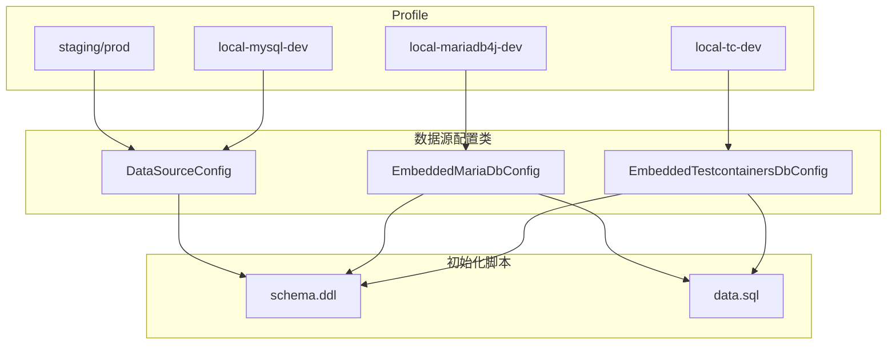

# 数据库配置

<cite>
**本文引用的文件**
- [EmbeddedTestcontainersDbConfig.java](file://common-dal/src/main/java/com/magicliang/transaction/sys/common/dal/datasource/EmbeddedTestcontainersDbConfig.java)
- [EmbeddedMariaDbConfig.java](file://common-dal/src/main/java/com/magicliang/transaction/sys/common/dal/datasource/EmbeddedMariaDbConfig.java)
- [DataSourceConfig.java](file://common-dal/src/main/java/com/magicliang/transaction/sys/common/dal/datasource/DataSourceConfig.java)
- [application.yml](file://biz-service-impl/src/main/resources/application.yml)
- [application.properties](file://biz-service-impl/src/main/resources/application.properties)
- [tc-init-privileges.sql](file://common-dal/src/main/resources/sql/tc-init-privileges.sql)
- [schema.ddl](file://biz-service-impl/src/main/resources/sql/mysql/schema.ddl)
- [data.sql](file://biz-service-impl/src/main/resources/sql/mysql/data.sql)
- [README.md](file://README.md)
- [04-mariadb-deployment.yaml](file://deploy/k8s/dev/04-mariadb-deployment.yaml)
- [03-mariadb-pvc.yaml](file://deploy/k8s/dev/03-mariadb-pvc.yaml)
- [05-mariadb-service.yaml](file://deploy/k8s/dev/05-mariadb-service.yaml)
- [01-mariadb-secret.yaml](file://deploy/k8s/dev/01-mariadb-secret.yaml)
</cite>

## 更新摘要
**变更内容**
- 新增local-tc-dev作为默认开发配置，基于Testcontainers管理MariaDB容器
- 移除mariadb4j架构限制说明，强调Testcontainers支持所有芯片架构
- 更新Testcontainers架构说明，包括Docker Desktop和Podman兼容性
- 强调local-tc-dev为推荐配置，无需Docker/Podman限制

## 目录
1. [简介](#简介)
2. [项目结构](#项目结构)
3. [核心组件](#核心组件)
4. [架构总览](#架构总览)
5. [详细组件分析](#详细组件分析)
6. [依赖分析](#依赖分析)
7. [性能考量](#性能考量)
8. [故障排除指南](#故障排除指南)
9. [结论](#结论)
10. [附录](#附录)

## 简介
本文件面向领域驱动交易系统的数据库配置，系统支持四种 Profile 的数据库配置与生命周期管理，分别为：
- local-tc-dev（推荐，默认激活）
- local-mariadb4j-dev
- local-mysql-dev
- staging / prod（Kubernetes 环境）

重点说明 Testcontainers 自动管理的 MariaDB 容器配置（Docker Desktop 与 Podman 兼容），以及 EmbeddedTestcontainersDbConfig 的数据库初始化与生命周期管理机制；同时提供数据库初始化脚本说明与执行流程，给出不同环境的最佳实践与故障排除建议。

## 项目结构
围绕数据库配置的关键文件分布如下：
- 配置文件：application.yml（Profile 激活与各环境数据源配置）、application.properties（通用应用属性）
- 数据源配置类：EmbeddedTestcontainersDbConfig（Testcontainers）、EmbeddedMariaDbConfig（mariadb4j）、DataSourceConfig（外部 MySQL）
- 初始化脚本：tc-init-privileges.sql（容器内授权）、schema.ddl（DDL）、data.sql（示例数据）
- 部署与运维：Kubernetes YAML（dev/staging/prod 环境的 MariaDB 部署、Service、PVC、Secret）

**图表来源**
- [application.yml:1-216](file://biz-service-impl/src/main/resources/application.yml#L1-L216)
- [EmbeddedTestcontainersDbConfig.java:1-154](file://common-dal/src/main/java/com/magicliang/transaction/sys/common/dal/datasource/EmbeddedTestcontainersDbConfig.java#L1-L154)
- [EmbeddedMariaDbConfig.java:1-184](file://common-dal/src/main/java/com/magicliang/transaction/sys/common/dal/datasource/EmbeddedMariaDbConfig.java#L1-L184)
- [DataSourceConfig.java:1-82](file://common-dal/src/main/java/com/magicliang/transaction/sys/common/dal/datasource/DataSourceConfig.java#L1-L82)
- [tc-init-privileges.sql:1-4](file://common-dal/src/main/resources/sql/tc-init-privileges.sql#L1-L4)
- [schema.ddl:1-145](file://biz-service-impl/src/main/resources/sql/mysql/schema.ddl#L1-L145)
- [data.sql:1-2](file://biz-service-impl/src/main/resources/sql/mysql/data.sql#L1-L2)
- [04-mariadb-deployment.yaml:1-74](file://deploy/k8s/dev/04-mariadb-deployment.yaml#L1-L74)
- [05-mariadb-service.yaml:1-18](file://deploy/k8s/dev/05-mariadb-service.yaml#L1-L18)
- [03-mariadb-pvc.yaml:1-16](file://deploy/k8s/dev/03-mariadb-pvc.yaml#L1-L16)
- [01-mariadb-secret.yaml:1-13](file://deploy/k8s/dev/01-mariadb-secret.yaml#L1-L13)

**章节来源**
- [application.yml:1-216](file://biz-service-impl/src/main/resources/application.yml#L1-L216)
- [application.properties:1-14](file://biz-service-impl/src/main/resources/application.properties#L1-L14)

## 核心组件
- Testcontainers MariaDB（local-tc-dev）
  - 通过 Testcontainers 启动 MariaDB 10.11 容器，支持 Docker Desktop 与 Podman
  - 单容器双数据库：test_master 与 test_slave1，分别对应主从数据源
  - 容器内执行授权脚本，自动创建数据库并执行 DDL/可选 data.sql
  - 首次运行自动拉取镜像，后续使用缓存
- mariadb4j（local-mariadb4j-dev）
  - 在 JVM 进程内启动 MariaDB 原生二进制，无需 Docker
  - 端口：master=4306、slave=4307（需确保端口可用）
  - 支持所有芯片架构，包括 ARM64/AMD64/x86_64
- 外部 MySQL（local-mysql-dev）
  - 连接本地 MySQL 8.0+ 实例，需手动创建数据库并执行 DDL
  - 通过 @ConfigurationProperties 绑定属性
- Staging/Prod（Kubernetes）
  - 由 K8s ConfigMap/Secret 注入环境变量，应用侧通过 Profile 读取
  - MariaDB 以 Deployment/PVC/Service 形式部署，持久化存储

**章节来源**
- [EmbeddedTestcontainersDbConfig.java:25-154](file://common-dal/src/main/java/com/magicliang/transaction/sys/common/dal/datasource/EmbeddedTestcontainersDbConfig.java#L25-L154)
- [EmbeddedMariaDbConfig.java:24-184](file://common-dal/src/main/java/com/magicliang/transaction/sys/common/dal/datasource/EmbeddedMariaDbConfig.java#L24-L184)
- [DataSourceConfig.java:22-82](file://common-dal/src/main/java/com/magicliang/transaction/sys/common/dal/datasource/DataSourceConfig.java#L22-L82)
- [application.yml:101-216](file://biz-service-impl/src/main/resources/application.yml#L101-L216)
- [README.md:98-218](file://README.md#L98-L218)

## 架构总览
下图展示四类 Profile 的数据源选择与初始化路径，以及 Testcontainers 的生命周期管理与授权脚本注入。

**图表来源**
- [EmbeddedTestcontainersDbConfig.java:48-152](file://common-dal/src/main/java/com/magicliang/transaction/sys/common/dal/datasource/EmbeddedTestcontainersDbConfig.java#L48-L152)
- [EmbeddedMariaDbConfig.java:55-135](file://common-dal/src/main/java/com/magicliang/transaction/sys/common/dal/datasource/EmbeddedMariaDbConfig.java#L55-L135)
- [DataSourceConfig.java:33-52](file://common-dal/src/main/java/com/magicliang/transaction/sys/common/dal/datasource/DataSourceConfig.java#L33-L52)
- [tc-init-privileges.sql:1-4](file://common-dal/src/main/resources/sql/tc-init-privileges.sql#L1-L4)
- [schema.ddl:1-145](file://biz-service-impl/src/main/resources/sql/mysql/schema.ddl#L1-L145)
- [data.sql:1-2](file://biz-service-impl/src/main/resources/sql/mysql/data.sql#L1-L2)

## 详细组件分析

### Testcontainers MariaDB（local-tc-dev）
- 容器特性
  - 单例容器，JVM 生命周期内仅启动一次，退出时由 Testcontainers Ryuk 清理
  - 容器内复制授权脚本，授予 test 用户全局权限，以便动态创建数据库
  - 通过 JDBC URL 连接 test_master 与 test_slave1，实现双数据库语义
  - 支持所有芯片架构（ARM64/AMD64/x86_64）和操作系统
- 初始化流程
  - 启动容器后，使用 rootUrl 连接容器根数据库，创建目标数据库
  - 连接目标数据库，按 spring.sql.init.* 属性执行 schema.ddl 与 data.sql
  - 若 data.sql 为空或不存在，则跳过 data.sql 执行
- Docker/Podman 兼容
  - 通过 Testcontainers 的容器运行时适配，支持 Docker Desktop 与 Podman

**图表来源**
- [EmbeddedTestcontainersDbConfig.java:48-152](file://common-dal/src/main/java/com/magicliang/transaction/sys/common/dal/datasource/EmbeddedTestcontainersDbConfig.java#L48-L152)
- [tc-init-privileges.sql:1-4](file://common-dal/src/main/resources/sql/tc-init-privileges.sql#L1-L4)
- [schema.ddl:1-145](file://biz-service-impl/src/main/resources/sql/mysql/schema.ddl#L1-L145)
- [data.sql:1-2](file://biz-service-impl/src/main/resources/sql/mysql/data.sql#L1-L2)

**章节来源**
- [EmbeddedTestcontainersDbConfig.java:25-154](file://common-dal/src/main/java/com/magicliang/transaction/sys/common/dal/datasource/EmbeddedTestcontainersDbConfig.java#L25-L154)
- [application.yml:121-147](file://biz-service-impl/src/main/resources/application.yml#L121-L147)
- [tc-init-privileges.sql:1-4](file://common-dal/src/main/resources/sql/tc-init-privileges.sql#L1-L4)

### mariadb4j（local-mariadb4j-dev）
- 特性
  - 在 JVM 内部启动 MariaDB 原生二进制，无需 Docker
  - master=4306、slave=4307 端口，需确保端口未被占用
  - 通过 permitMysqlScheme 兼容 JDBC URL
  - 支持所有芯片架构，包括 ARM64/AMD64/x86_64
- 初始化
  - 通过 DB.createDB 创建数据库
  - 通过 DB.source 执行 schema.ddl（需在配置中启用初始化策略）
- 优势
  - 无需 Docker/Podman，跨平台兼容性更好
  - 支持 ARM 芯片架构

**图表来源**
- [EmbeddedMariaDbConfig.java:55-135](file://common-dal/src/main/java/com/magicliang/transaction/sys/common/dal/datasource/EmbeddedMariaDbConfig.java#L55-L135)
- [application.yml:82-120](file://biz-service-impl/src/main/resources/application.yml#L82-L120)

**章节来源**
- [EmbeddedMariaDbConfig.java:24-184](file://common-dal/src/main/java/com/magicliang/transaction/sys/common/dal/datasource/EmbeddedMariaDbConfig.java#L24-L184)
- [application.yml:82-120](file://biz-service-impl/src/main/resources/application.yml#L82-L120)

### 外部 MySQL（local-mysql-dev）
- 特性
  - 连接本地 MySQL 8.0+ 实例，需手动创建数据库并执行 DDL
  - 通过 @ConfigurationProperties 绑定 spring.datasource.master.* 与 slave1.*
- 初始化
  - 不使用内置初始化脚本，需自行准备 schema 与数据

**图表来源**
- [DataSourceConfig.java:33-52](file://common-dal/src/main/java/com/magicliang/transaction/sys/common/dal/datasource/DataSourceConfig.java#L33-L52)
- [application.yml:148-174](file://biz-service-impl/src/main/resources/application.yml#L148-L174)

**章节来源**
- [DataSourceConfig.java:22-82](file://common-dal/src/main/java/com/magicliang/transaction/sys/common/dal/datasource/DataSourceConfig.java#L22-L82)
- [application.yml:148-174](file://biz-service-impl/src/main/resources/application.yml#L148-L174)

### Staging/Prod（Kubernetes）
- 特性
  - 通过 K8s ConfigMap/Secret 提供数据库连接信息（JDBC URL、用户名、密码）
  - 应用侧通过 Profile 读取，不直接暴露在代码中
- 部署结构
  - Deployment：MariaDB 10.11，挂载 PVC 存储与初始化脚本目录
  - Service：ClusterIP 暴露 3306
  - PVC：持久化存储
  - Secret：root 密码等敏感信息

**图表来源**
- [05-mariadb-service.yaml:1-18](file://deploy/k8s/dev/05-mariadb-service.yaml#L1-L18)
- [04-mariadb-deployment.yaml:1-74](file://deploy/k8s/dev/04-mariadb-deployment.yaml#L1-L74)
- [03-mariadb-pvc.yaml:1-16](file://deploy/k8s/dev/03-mariadb-pvc.yaml#L1-L16)
- [01-mariadb-secret.yaml:1-13](file://deploy/k8s/dev/01-mariadb-secret.yaml#L1-L13)
- [application.yml:175-216](file://biz-service-impl/src/main/resources/application.yml#L175-L216)

**章节来源**
- [application.yml:175-216](file://biz-service-impl/src/main/resources/application.yml#L175-L216)
- [04-mariadb-deployment.yaml:1-74](file://deploy/k8s/dev/04-mariadb-deployment.yaml#L1-L74)
- [05-mariadb-service.yaml:1-18](file://deploy/k8s/dev/05-mariadb-service.yaml#L1-L18)
- [03-mariadb-pvc.yaml:1-16](file://deploy/k8s/dev/03-mariadb-pvc.yaml#L1-L16)
- [01-mariadb-secret.yaml:1-13](file://deploy/k8s/dev/01-mariadb-secret.yaml#L1-L13)

## 依赖分析
- Profile 与数据源配置的耦合关系
  - local-tc-dev → EmbeddedTestcontainersDbConfig（Testcontainers）
  - local-mariadb4j-dev → EmbeddedMariaDbConfig（mariadb4j）
  - local-mysql-dev → DataSourceConfig（外部 MySQL）
  - staging/prod → DataSourceConfig（外部 MySQL，K8s 注入）
- 初始化脚本依赖
  - Testcontainers 与 mariadb4j 依赖 schema.ddl；data.sql 可选
  - K8s 部署可挂载初始化脚本目录，实现数据库初始化

**图表来源**
- [application.yml:1-216](file://biz-service-impl/src/main/resources/application.yml#L1-L216)
- [EmbeddedTestcontainersDbConfig.java:107-136](file://common-dal/src/main/java/com/magicliang/transaction/sys/common/dal/datasource/EmbeddedTestcontainersDbConfig.java#L107-L136)
- [EmbeddedMariaDbConfig.java:110-121](file://common-dal/src/main/java/com/magicliang/transaction/sys/common/dal/datasource/EmbeddedMariaDbConfig.java#L110-L121)
- [DataSourceConfig.java:33-52](file://common-dal/src/main/java/com/magicliang/transaction/sys/common/dal/datasource/DataSourceConfig.java#L33-L52)
- [schema.ddl:1-145](file://biz-service-impl/src/main/resources/sql/mysql/schema.ddl#L1-L145)
- [data.sql:1-2](file://biz-service-impl/src/main/resources/sql/mysql/data.sql#L1-L2)

**章节来源**
- [application.yml:1-216](file://biz-service-impl/src/main/resources/application.yml#L1-L216)
- [EmbeddedTestcontainersDbConfig.java:107-136](file://common-dal/src/main/java/com/magicliang/transaction/sys/common/dal/datasource/EmbeddedTestcontainersDbConfig.java#L107-L136)
- [EmbeddedMariaDbConfig.java:110-121](file://common-dal/src/main/java/com/magicliang/transaction/sys/common/dal/datasource/EmbeddedMariaDbConfig.java#L110-L121)
- [DataSourceConfig.java:33-52](file://common-dal/src/main/java/com/magicliang/transaction/sys/common/dal/datasource/DataSourceConfig.java#L33-L52)

## 性能考量
- 连接池与超时
  - HikariCP 池参数已在 application.yml 中配置，可根据负载调整最小空闲、最大池大小、最大生存时间与连接超时
- 初始化策略
  - local-tc-dev 与 mariadb4j 显式执行 DDL/可选 data.sql，避免 Spring Boot 自动初始化带来的不确定性
  - staging/prod 由 K8s 注入配置，建议在部署阶段完成 schema 初始化
- 容器与端口
  - Testcontainers 首次拉取镜像约 400MB，后续使用缓存；mariadb4j 需确保端口未被占用
- 索引与查询
  - schema.ddl 中包含状态与时间维度索引示例，建议结合业务查询模式评估索引策略

**章节来源**
- [application.yml:24-32](file://biz-service-impl/src/main/resources/application.yml#L24-L32)
- [application.yml:121-147](file://biz-service-impl/src/main/resources/application.yml#L121-L147)
- [schema.ddl:68-78](file://biz-service-impl/src/main/resources/sql/mysql/schema.ddl#L68-L78)

## 故障排除指南
- Testcontainers MariaDB（local-tc-dev）
  - 容器启动失败
    - 检查 Docker/Podman 是否正常运行
    - 查看容器日志与端口映射是否冲突
  - 授权失败
    - 确认 tc-init-privileges.sql 已复制至容器并执行
    - 校验 test 用户权限与密码
  - 初始化失败
    - 检查 schema.ddl 语法与 data.sql 是否存在可执行内容
    - 确认 spring.sql.init.* 属性正确指向资源路径
- mariadb4j（local-mariadb4j-dev）
  - 端口占用
    - 更改 master=4306 与 slave=4307 端口，确保未被占用
  - 初始化异常
    - 确保 schema.ddl 路径正确，必要时在配置中启用初始化策略
- 外部 MySQL（local-mysql-dev）
  - 连接失败
    - 校验 jdbc-url、用户名、密码与网络连通性
    - 确认数据库已创建并具备相应权限
- Staging/Prod（Kubernetes）
  - 连接失败
    - 检查 ConfigMap/Secret 是否正确注入环境变量
    - 确认 Service 名称与端口、命名空间一致
  - 数据库未初始化
    - 检查 MariaDB Deployment 是否挂载初始化脚本目录
    - 确认 PVC 存储可用且初始化脚本已生效

**章节来源**
- [EmbeddedTestcontainersDbConfig.java:107-136](file://common-dal/src/main/java/com/magicliang/transaction/sys/common/dal/datasource/EmbeddedTestcontainersDbConfig.java#L107-L136)
- [EmbeddedMariaDbConfig.java:142-181](file://common-dal/src/main/java/com/magicliang/transaction/sys/common/dal/datasource/EmbeddedMariaDbConfig.java#L142-L181)
- [DataSourceConfig.java:33-52](file://common-dal/src/main/java/com/magicliang/transaction/sys/common/dal/datasource/DataSourceConfig.java#L33-L52)
- [04-mariadb-deployment.yaml:45-49](file://deploy/k8s/dev/04-mariadb-deployment.yaml#L45-L49)
- [05-mariadb-service.yaml:10-16](file://deploy/k8s/dev/05-mariadb-service.yaml#L10-L16)
- [03-mariadb-pvc.yaml:10-15](file://deploy/k8s/dev/03-mariadb-pvc.yaml#L10-L15)
- [01-mariadb-secret.yaml:10-12](file://deploy/k8s/dev/01-mariadb-secret.yaml#L10-L12)

## 结论
- local-tc-dev（推荐）：通过 Testcontainers 自动管理 MariaDB 容器，支持 Docker/Podman，一键创建双数据库并执行初始化脚本，适合开发与测试全流程自动化
- local-mariadb4j-dev：无需 Docker 的内嵌 MariaDB，适合快速本地验证，支持所有芯片架构
- local-mysql-dev：适合已有本地 MySQL 环境的团队，需手动维护数据库与初始化
- staging/prod：通过 K8s 注入配置，生产安全可控，建议在部署阶段完成数据库初始化与权限控制

## 附录
- 切换 Profile
  - 默认：local-tc-dev（需要 Docker/Podman）
  - 其他：local-mariadb4j-dev、local-mysql-dev、staging、prod
- 初始化脚本
  - schema.ddl：DDL 建表与索引定义
  - data.sql：示例数据（可选）
  - tc-init-privileges.sql：容器内授权脚本

**章节来源**
- [README.md:205-218](file://README.md#L205-L218)
- [application.yml:1-216](file://biz-service-impl/src/main/resources/application.yml#L1-L216)
- [schema.ddl:1-145](file://biz-service-impl/src/main/resources/sql/mysql/schema.ddl#L1-L145)
- [data.sql:1-2](file://biz-service-impl/src/main/resources/sql/mysql/data.sql#L1-L2)
- [tc-init-privileges.sql:1-4](file://common-dal/src/main/resources/sql/tc-init-privileges.sql#L1-L4)