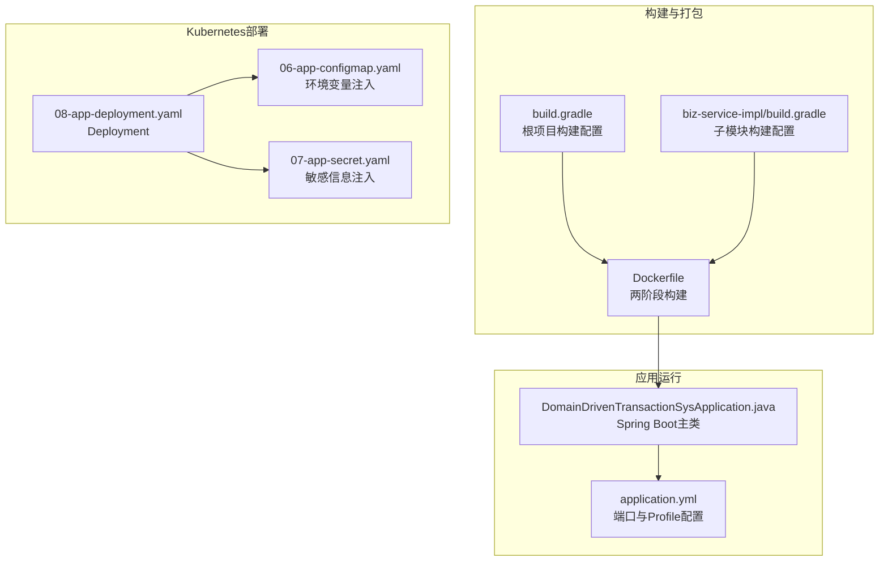
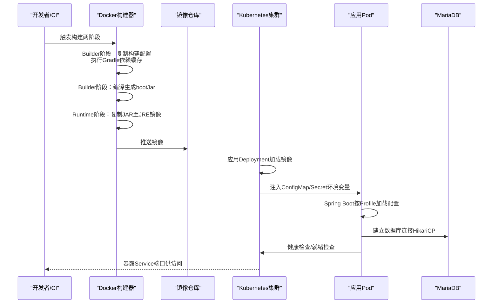
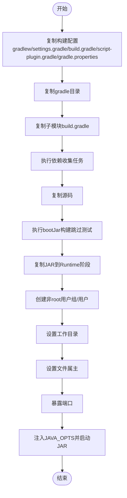
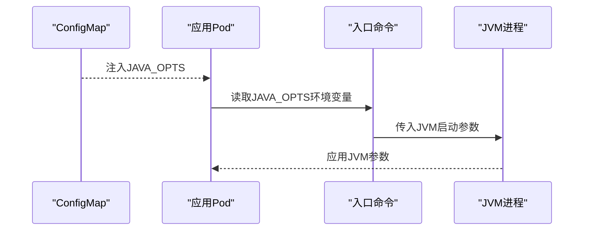
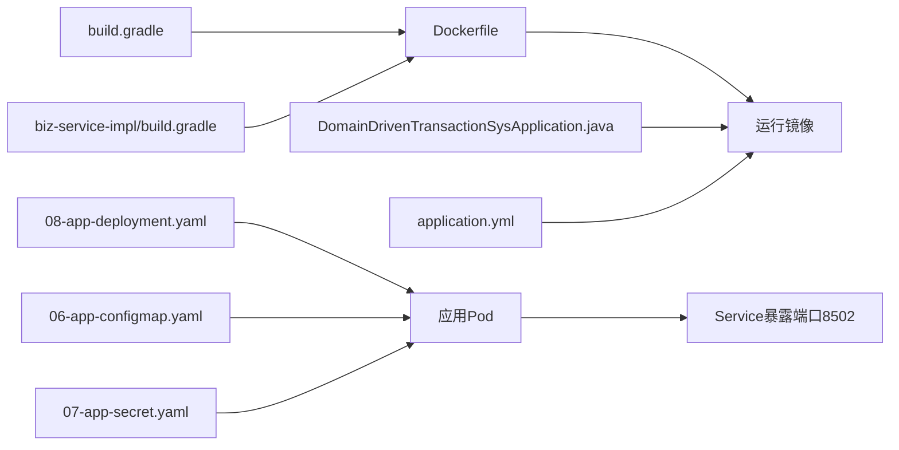

# Docker容器化部署

<cite>
**本文档引用的文件**
- [Dockerfile](file://deploy/docker/Dockerfile)
- [build.gradle](file://build.gradle)
- [biz-service-impl/build.gradle](file://biz-service-impl/build.gradle)
- [DomainDrivenTransactionSysApplication.java](file://biz-service-impl/src/main/java/com/magicliang/transaction/sys/DomainDrivenTransactionSysApplication.java)
- [application.yml](file://biz-service-impl/src/main/resources/application.yml)
- [08-app-deployment.yaml](file://deploy/k8s/dev/08-app-deployment.yaml)
- [06-app-configmap.yaml](file://deploy/k8s/dev/06-app-configmap.yaml)
- [07-app-secret.yaml](file://deploy/k8s/dev/07-app-secret.yaml)
- [gradle.yml](file://.github/workflows/gradle.yml)
- [env-start.sh](file://deploy/scripts/env-start.sh)
- [env-init.sh](file://deploy/scripts/env-init.sh)
- [README.md](file://README.md)
</cite>

## 目录
1. [简介](#简介)
2. [项目结构](#项目结构)
3. [核心组件](#核心组件)
4. [架构总览](#架构总览)
5. [详细组件分析](#详细组件分析)
6. [依赖关系分析](#依赖关系分析)
7. [性能考量](#性能考量)
8. [故障排查指南](#故障排查指南)
9. [结论](#结论)
10. [附录](#附录)

## 简介
本文件面向领域驱动交易系统，提供完整的Docker容器化部署文档。重点解析两阶段Docker构建流程：Builder阶段通过Gradle依赖缓存优化构建效率；Runtime阶段采用轻量级JRE镜像，降低镜像体积与攻击面。详细说明WORKDIR设置、用户权限配置、端口暴露与入口命令的配置原理，阐述两阶段构建在镜像体积与安全隔离方面的优势，并给出构建命令示例、JAVA_OPTS环境变量注入机制、容器运行最佳实践与性能调优建议。

## 项目结构
围绕容器化部署的关键文件与目录如下：
- Dockerfile：两阶段构建定义，Builder阶段使用JDK镜像编译，Runtime阶段使用JRE镜像运行
- Gradle构建配置：根项目与子模块构建脚本，控制bootJar生成与依赖管理
- Spring Boot应用：主类与配置文件，定义端口、Profile与数据源
- Kubernetes清单：Dev/Staging/Prod环境的Deployment、ConfigMap、Secret
- 部署脚本：一键初始化与启动脚本，封装镜像构建与K8s部署流程

**图表来源**
- [Dockerfile:1-50](file://deploy/docker/Dockerfile#L1-L50)
- [build.gradle:1-310](file://build.gradle#L1-L310)
- [biz-service-impl/build.gradle:1-80](file://biz-service-impl/build.gradle#L1-L80)
- [DomainDrivenTransactionSysApplication.java:1-150](file://biz-service-impl/src/main/java/com/magicliang/transaction/sys/DomainDrivenTransactionSysApplication.java#L1-L150)
- [application.yml:64-66](file://biz-service-impl/src/main/resources/application.yml#L64-L66)
- [08-app-deployment.yaml:1-72](file://deploy/k8s/dev/08-app-deployment.yaml#L1-L72)
- [06-app-configmap.yaml:1-22](file://deploy/k8s/dev/06-app-configmap.yaml#L1-L22)
- [07-app-secret.yaml:1-14](file://deploy/k8s/dev/07-app-secret.yaml#L1-L14)

**章节来源**
- [Dockerfile:1-50](file://deploy/docker/Dockerfile#L1-L50)
- [README.md:216-346](file://README.md#L216-L346)

## 核心组件
- 两阶段Docker构建
  - Builder阶段：基于JDK镜像，复制构建配置文件以利用Docker层缓存，随后编译生成bootJar
  - Runtime阶段：基于JRE镜像，仅包含运行时依赖，非root用户运行，暴露应用端口
- Gradle构建与缓存优化
  - 通过先复制构建脚本与子模块构建文件，再复制源码，确保依赖下载层不因源码变更失效
- Spring Boot应用与配置
  - 主类负责启动，application.yml定义端口与Profile
- Kubernetes部署与环境变量注入
  - Deployment定义容器端口、探针与资源限制；ConfigMap/Secret注入环境变量，覆盖默认配置

**章节来源**
- [Dockerfile:1-50](file://deploy/docker/Dockerfile#L1-L50)
- [build.gradle:1-310](file://build.gradle#L1-L310)
- [biz-service-impl/build.gradle:1-80](file://biz-service-impl/build.gradle#L1-L80)
- [DomainDrivenTransactionSysApplication.java:69-73](file://biz-service-impl/src/main/java/com/magicliang/transaction/sys/DomainDrivenTransactionSysApplication.java#L69-L73)
- [application.yml:64-66](file://biz-service-impl/src/main/resources/application.yml#L64-L66)
- [08-app-deployment.yaml:34-72](file://deploy/k8s/dev/08-app-deployment.yaml#L34-L72)
- [06-app-configmap.yaml:10-21](file://deploy/k8s/dev/06-app-configmap.yaml#L10-L21)
- [07-app-secret.yaml:10-14](file://deploy/k8s/dev/07-app-secret.yaml#L10-L14)

## 架构总览
容器化部署的整体流程如下：开发者在本地或CI中通过Dockerfile完成两阶段构建，生成最终运行镜像；随后通过Kubernetes Deployment将应用部署到集群，ConfigMap/Secret注入环境变量，Spring Boot根据Profile与环境变量加载配置，应用监听配置端口并提供健康检查。

**图表来源**
- [Dockerfile:1-50](file://deploy/docker/Dockerfile#L1-L50)
- [08-app-deployment.yaml:34-72](file://deploy/k8s/dev/08-app-deployment.yaml#L34-L72)
- [06-app-configmap.yaml:10-21](file://deploy/k8s/dev/06-app-configmap.yaml#L10-L21)
- [07-app-secret.yaml:10-14](file://deploy/k8s/dev/07-app-secret.yaml#L10-L14)
- [application.yml:64-66](file://biz-service-impl/src/main/resources/application.yml#L64-L66)

## 详细组件分析

### Dockerfile两阶段构建详解
- Builder阶段（JDK镜像）
  - 复制构建脚本与Gradle配置，确保依赖下载层缓存稳定
  - 执行Gradle依赖收集任务，进一步优化缓存命中
  - 复制源码并编译生成bootJar，跳过测试以缩短构建时间
- Runtime阶段（JRE镜像）
  - 创建非root系统用户组与用户，切换运行用户
  - 设置工作目录，复制JAR至运行目录，设置文件属主
  - 暴露应用端口，通过入口命令注入JAVA_OPTS并启动JAR

**图表来源**
- [Dockerfile:1-50](file://deploy/docker/Dockerfile#L1-L50)

**章节来源**
- [Dockerfile:1-50](file://deploy/docker/Dockerfile#L1-L50)

### WORKDIR、用户权限与端口暴露
- WORKDIR设置
  - Builder阶段：/workspace便于构建过程中的文件组织
  - Runtime阶段：/app作为应用工作目录，便于JAR复制与运行
- 用户权限配置
  - 创建系统用户组与用户，chown将运行目录属主设为非root用户，降低容器攻击面
- 端口暴露
  - 应用端口在配置文件中定义为8502，Dockerfile中EXPOSE暴露该端口
- 入口命令
  - 通过sh -c注入JAVA_OPTS，实现JVM参数的灵活配置

**章节来源**
- [Dockerfile:6-49](file://deploy/docker/Dockerfile#L6-L49)
- [application.yml:64-66](file://biz-service-impl/src/main/resources/application.yml#L64-L66)

### JAVA_OPTS环境变量注入机制
- 注入方式
  - 通过Kubernetes ConfigMap注入JAVA_OPTS，容器启动时由入口命令读取并传入JVM
- 配置位置
  - Dev环境：ConfigMap中包含JAVA_OPTS字段
  - Staging/Prod环境：通过对应环境的ConfigMap注入
- 作用范围
  - 适用于所有环境，用于设置JVM堆大小、GC策略等参数

**图表来源**
- [06-app-configmap.yaml:21-21](file://deploy/k8s/dev/06-app-configmap.yaml#L21-L21)
- [Dockerfile:49-49](file://deploy/docker/Dockerfile#L49-L49)

**章节来源**
- [06-app-configmap.yaml:21-21](file://deploy/k8s/dev/06-app-configmap.yaml#L21-L21)
- [Dockerfile:49-49](file://deploy/docker/Dockerfile#L49-L49)

### Gradle构建与缓存优化
- 依赖缓存优化
  - 先复制构建脚本与子模块构建文件，再复制源码，确保依赖下载层不因源码变更失效
- 构建任务
  - 使用bootJar任务生成可执行JAR，跳过测试以缩短构建时间
- 版本与工具链
  - 根项目使用Gradle 8.6与Java Toolchain 8，确保与Docker/JRE版本一致

**章节来源**
- [Dockerfile:10-29](file://deploy/docker/Dockerfile#L10-L29)
- [build.gradle:306-310](file://build.gradle#L306-L310)
- [biz-service-impl/build.gradle:26-28](file://biz-service-impl/build.gradle#L26-L28)

### Spring Boot应用与配置
- 主类启动
  - 主类负责启动Spring Boot应用，记录启动日志
- 端口与Profile
  - application.yml中定义server.port为8502，配合Docker EXPOSE
  - 通过Spring Profile机制支持多环境配置，K8s通过ConfigMap注入SPRING_PROFILES_ACTIVE
- 数据源与连接池
  - HikariCP连接池配置，支持主从库与不同环境的JDBC URL

**章节来源**
- [DomainDrivenTransactionSysApplication.java:69-73](file://biz-service-impl/src/main/java/com/magicliang/transaction/sys/DomainDrivenTransactionSysApplication.java#L69-L73)
- [application.yml:64-66](file://biz-service-impl/src/main/resources/application.yml#L64-L66)
- [application.yml:17-32](file://biz-service-impl/src/main/resources/application.yml#L17-L32)

### Kubernetes部署与探针
- Deployment配置
  - 定义容器端口、资源请求与限制、启动/就绪/存活探针
  - 通过envFrom从ConfigMap/Secret注入环境变量
- 探针策略
  - 启动探针：定期访问/actuator/health，失败阈值较高以适应冷启动
  - 就绪探针：快速判断应用是否可接收流量
  - 存活探针：定期检查健康状态

**章节来源**
- [08-app-deployment.yaml:34-72](file://deploy/k8s/dev/08-app-deployment.yaml#L34-L72)
- [06-app-configmap.yaml:10-21](file://deploy/k8s/dev/06-app-configmap.yaml#L10-L21)
- [07-app-secret.yaml:10-14](file://deploy/k8s/dev/07-app-secret.yaml#L10-L14)

## 依赖关系分析
Docker构建与K8s部署之间的依赖关系如下：

**图表来源**
- [Dockerfile:1-50](file://deploy/docker/Dockerfile#L1-L50)
- [build.gradle:1-310](file://build.gradle#L1-L310)
- [biz-service-impl/build.gradle:1-80](file://biz-service-impl/build.gradle#L1-L80)
- [DomainDrivenTransactionSysApplication.java:1-150](file://biz-service-impl/src/main/java/com/magicliang/transaction/sys/DomainDrivenTransactionSysApplication.java#L1-L150)
- [application.yml:1-216](file://biz-service-impl/src/main/resources/application.yml#L1-L216)
- [08-app-deployment.yaml:1-72](file://deploy/k8s/dev/08-app-deployment.yaml#L1-L72)
- [06-app-configmap.yaml:1-22](file://deploy/k8s/dev/06-app-configmap.yaml#L1-L22)
- [07-app-secret.yaml:1-14](file://deploy/k8s/dev/07-app-secret.yaml#L1-L14)

**章节来源**
- [Dockerfile:1-50](file://deploy/docker/Dockerfile#L1-L50)
- [08-app-deployment.yaml:34-72](file://deploy/k8s/dev/08-app-deployment.yaml#L34-L72)

## 性能考量
- 镜像体积优化
  - Runtime阶段使用JRE镜像，移除JDK相关工具与开发依赖，显著降低镜像体积
  - 通过两阶段构建，仅将编译产物复制到最终镜像
- 构建缓存优化
  - 先复制构建脚本与子模块构建文件，再复制源码，确保依赖下载层不因源码变更失效
  - 依赖收集任务提前执行，进一步提升缓存命中率
- JVM参数调优
  - 通过ConfigMap注入JAVA_OPTS，合理设置-Xms与-Xmx，避免超过K8s资源限制导致OOMKilled
  - 建议结合GC日志与监控指标，逐步优化GC参数
- 资源配额与探针
  - 合理设置requests与limits，避免过度分配导致调度困难
  - 启动探针失败阈值应考虑冷启动时间，避免频繁重启

[本节为通用指导，无需特定文件来源]

## 故障排查指南
- 构建失败
  - 检查Dockerfile中依赖收集与bootJar任务是否执行成功
  - 确认Gradle版本与Java Toolchain版本一致
- 镜像启动失败
  - 检查非root用户权限与文件属主设置
  - 确认端口暴露与容器端口一致
- 应用无法连接数据库
  - 检查ConfigMap/Secret中的JDBC URL、用户名与密码是否正确
  - 确认MariaDB服务可用且PVC初始化完成
- 健康检查失败
  - 检查/actuator/health端点是否可达
  - 调整启动探针失败阈值与周期，避免冷启动导致误判

**章节来源**
- [Dockerfile:36-49](file://deploy/docker/Dockerfile#L36-L49)
- [08-app-deployment.yaml:52-71](file://deploy/k8s/dev/08-app-deployment.yaml#L52-L71)
- [06-app-configmap.yaml:10-21](file://deploy/k8s/dev/06-app-configmap.yaml#L10-L21)
- [07-app-secret.yaml:10-14](file://deploy/k8s/dev/07-app-secret.yaml#L10-L14)

## 结论
本项目通过两阶段Docker构建与JRE运行时镜像，实现了镜像体积与安全性的双重优化；结合Gradle缓存策略与K8s环境变量注入，提供了灵活的配置管理与部署能力。建议在生产环境中严格控制JVM参数与资源配额，并持续监控应用健康状态与性能指标，以获得稳定的容器化运行体验。

[本节为总结性内容，无需特定文件来源]

## 附录

### 构建命令与参数说明
- 本地构建镜像
  - 使用Podman构建：podman build -t domain-driven-transaction-sys:latest -f deploy/docker/Dockerfile .
- CI/CD集成
  - GitHub Actions使用Gradle构建任务，构建完成后可继续推送镜像至私有仓库

**章节来源**
- [Dockerfile:1-50](file://deploy/docker/Dockerfile#L1-L50)
- [gradle.yml:28-31](file://.github/workflows/gradle.yml#L28-L31)

### 容器运行最佳实践
- 非root用户运行，最小权限原则
- 合理设置JVM参数与资源配额，避免OOMKilled
- 使用探针保障健康与可用性
- 通过ConfigMap/Secret集中管理配置与敏感信息

**章节来源**
- [Dockerfile:36-49](file://deploy/docker/Dockerfile#L36-L49)
- [08-app-deployment.yaml:45-71](file://deploy/k8s/dev/08-app-deployment.yaml#L45-L71)
- [06-app-configmap.yaml:10-21](file://deploy/k8s/dev/06-app-configmap.yaml#L10-L21)
- [07-app-secret.yaml:10-14](file://deploy/k8s/dev/07-app-secret.yaml#L10-L14)