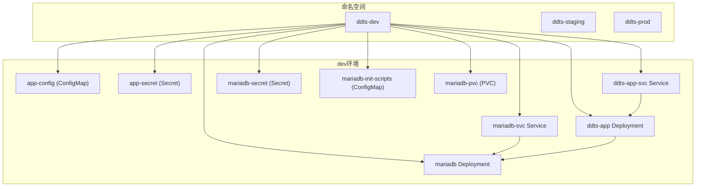
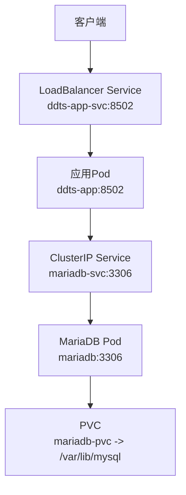
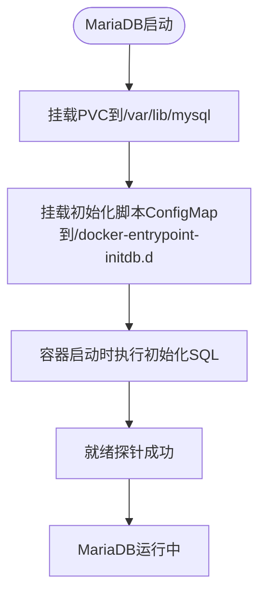
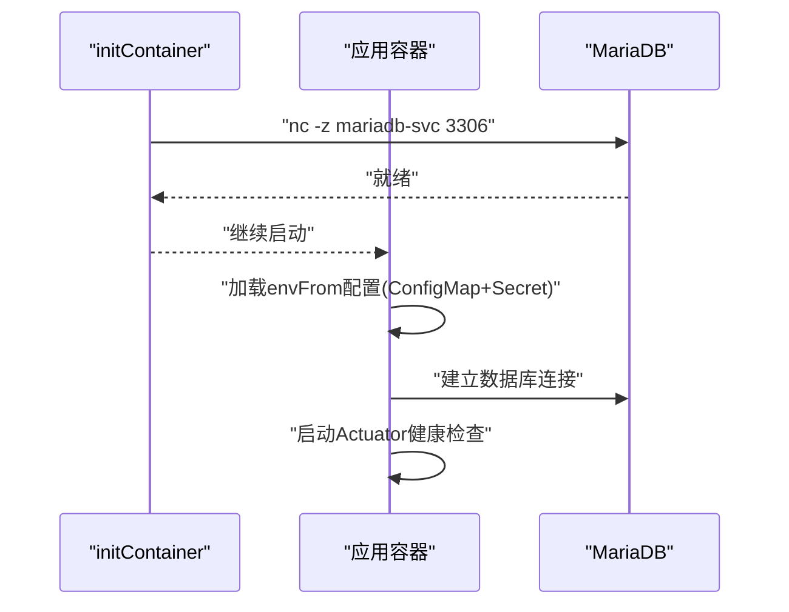
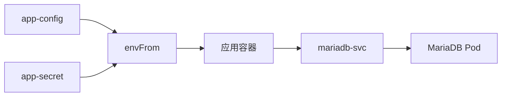

# Kubernetes集群部署

<cite>
**本文档引用的文件**
- [00-namespace.yaml](file://deploy/k8s/dev/00-namespace.yaml)
- [01-mariadb-secret.yaml](file://deploy/k8s/dev/01-mariadb-secret.yaml)
- [02-mariadb-init-configmap.yaml](file://deploy/k8s/dev/02-mariadb-init-configmap.yaml)
- [03-mariadb-pvc.yaml](file://deploy/k8s/dev/03-mariadb-pvc.yaml)
- [04-mariadb-deployment.yaml](file://deploy/k8s/dev/04-mariadb-deployment.yaml)
- [05-mariadb-service.yaml](file://deploy/k8s/dev/05-mariadb-service.yaml)
- [06-app-configmap.yaml](file://deploy/k8s/dev/06-app-configmap.yaml)
- [07-app-secret.yaml](file://deploy/k8s/dev/07-app-secret.yaml)
- [08-app-deployment.yaml](file://deploy/k8s/dev/08-app-deployment.yaml)
- [09-app-service.yaml](file://deploy/k8s/dev/09-app-service.yaml)
- [00-namespace.yaml](file://deploy/k8s/staging/00-namespace.yaml)
- [00-namespace.yaml](file://deploy/k8s/prod/00-namespace.yaml)
- [Dockerfile](file://deploy/docker/Dockerfile)
- [env-init.sh](file://deploy/scripts/env-init.sh)
- [env-start.sh](file://deploy/scripts/env-start.sh)
</cite>

## 目录
1. [简介](#简介)
2. [项目结构](#项目结构)
3. [核心组件](#核心组件)
4. [架构总览](#架构总览)
5. [详细组件分析](#详细组件分析)
6. [依赖关系分析](#依赖关系分析)
7. [性能与资源规划](#性能与资源规划)
8. [kubectl命令行操作指南](#kubectl命令行操作指南)
9. [环境变量覆盖与配置优先级](#环境变量覆盖与配置优先级)
10. [部署流程与回滚策略](#部署流程与回滚策略)
11. [故障排查指南](#故障排查指南)
12. [结论](#结论)

## 简介
本文件面向领域驱动交易系统在Kubernetes集群上的部署，提供dev/staging/prod三套环境的独立部署架构与配置差异说明；深入解析K8s清单文件（命名空间、Deployment、Service、ConfigMap、Secret等）的结构与配置要点；介绍环境特定的配置管理（ConfigMap中的应用配置与Secret中的敏感信息）；说明Pod健康检查、资源限制与自动扩缩容策略；提供kubectl命令行操作指南与常用部署命令；详解环境变量覆盖机制与配置优先级；并给出完整的部署流程、回滚策略与故障排查方法。

## 项目结构
本项目的Kubernetes部署位于deploy/k8s目录下，按环境拆分：dev、staging、prod。每个环境包含一套完整的资源清单，用于创建独立的命名空间、数据库（MariaDB）、应用服务与网络暴露。

- 环境目录组织
  - dev：开发环境，包含MariaDB与应用的完整栈
  - staging：预生产环境，结构与dev一致
  - prod：生产环境，结构与dev一致

- 关键资源清单（以dev为例）
  - 命名空间：00-namespace.yaml
  - MariaDB相关：01-mariadb-secret.yaml、02-mariadb-init-configmap.yaml、03-mariadb-pvc.yaml、04-mariadb-deployment.yaml、05-mariadb-service.yaml
  - 应用相关：06-app-configmap.yaml、07-app-secret.yaml、08-app-deployment.yaml、09-app-service.yaml

图示来源
- [00-namespace.yaml:1-8](file://deploy/k8s/dev/00-namespace.yaml#L1-L8)
- [06-app-configmap.yaml:1-22](file://deploy/k8s/dev/06-app-configmap.yaml#L1-L22)
- [07-app-secret.yaml:1-14](file://deploy/k8s/dev/07-app-secret.yaml#L1-L14)
- [08-app-deployment.yaml:1-72](file://deploy/k8s/dev/08-app-deployment.yaml#L1-L72)
- [09-app-service.yaml:1-18](file://deploy/k8s/dev/09-app-service.yaml#L1-L18)
- [01-mariadb-secret.yaml:1-13](file://deploy/k8s/dev/01-mariadb-secret.yaml#L1-L13)
- [02-mariadb-init-configmap.yaml:1-224](file://deploy/k8s/dev/02-mariadb-init-configmap.yaml#L1-L224)
- [03-mariadb-pvc.yaml:1-16](file://deploy/k8s/dev/03-mariadb-pvc.yaml#L1-L16)
- [04-mariadb-deployment.yaml:1-74](file://deploy/k8s/dev/04-mariadb-deployment.yaml#L1-L74)
- [05-mariadb-service.yaml:1-18](file://deploy/k8s/dev/05-mariadb-service.yaml#L1-L18)

章节来源
- [00-namespace.yaml:1-8](file://deploy/k8s/dev/00-namespace.yaml#L1-L8)
- [06-app-configmap.yaml:1-22](file://deploy/k8s/dev/06-app-configmap.yaml#L1-L22)
- [07-app-secret.yaml:1-14](file://deploy/k8s/dev/07-app-secret.yaml#L1-L14)
- [08-app-deployment.yaml:1-72](file://deploy/k8s/dev/08-app-deployment.yaml#L1-L72)
- [09-app-service.yaml:1-18](file://deploy/k8s/dev/09-app-service.yaml#L1-L18)
- [01-mariadb-secret.yaml:1-13](file://deploy/k8s/dev/01-mariadb-secret.yaml#L1-L13)
- [02-mariadb-init-configmap.yaml:1-224](file://deploy/k8s/dev/02-mariadb-init-configmap.yaml#L1-L224)
- [03-mariadb-pvc.yaml:1-16](file://deploy/k8s/dev/03-mariadb-pvc.yaml#L1-L16)
- [04-mariadb-deployment.yaml:1-74](file://deploy/k8s/dev/04-mariadb-deployment.yaml#L1-L74)
- [05-mariadb-service.yaml:1-18](file://deploy/k8s/dev/05-mariadb-service.yaml#L1-L18)

## 核心组件
- 命名空间（Namespace）
  - 作用：隔离dev/staging/prod三套环境的资源
  - 示例：dev使用ddts-dev，staging使用ddts-staging，prod使用ddts-prod

- 数据库（MariaDB）
  - 使用Deployment运行MariaDB镜像，通过Secret注入root密码
  - 通过ConfigMap挂载初始化SQL脚本，完成数据库与表结构初始化
  - 通过PVC持久化数据存储

- 应用服务（Spring Boot）
  - 使用Deployment运行应用容器，端口8502
  - 通过ConfigMap注入非敏感配置（如数据库连接URL、日志配置、JVM参数）
  - 通过Secret注入敏感配置（如数据库密码）
  - 通过Service对外暴露（LoadBalancer），便于本地访问

- 健康检查与探针
  - 应用：使用Actuator健康端点进行startupProbe/readinessProbe/livenessProbe
  - MariaDB：使用mysqladmin ping与TCP探测

- 资源限制与请求
  - MariaDB：requests.cpu=250m、limits.cpu=500m；requests.memory=256Mi、limits.memory=512Mi
  - 应用：requests.cpu=250m、limits.cpu=1000m；requests.memory=512Mi、limits.memory=768Mi

章节来源
- [00-namespace.yaml:1-8](file://deploy/k8s/dev/00-namespace.yaml#L1-L8)
- [04-mariadb-deployment.yaml:1-74](file://deploy/k8s/dev/04-mariadb-deployment.yaml#L1-L74)
- [05-mariadb-service.yaml:1-18](file://deploy/k8s/dev/05-mariadb-service.yaml#L1-L18)
- [06-app-configmap.yaml:1-22](file://deploy/k8s/dev/06-app-configmap.yaml#L1-L22)
- [07-app-secret.yaml:1-14](file://deploy/k8s/dev/07-app-secret.yaml#L1-L14)
- [08-app-deployment.yaml:1-72](file://deploy/k8s/dev/08-app-deployment.yaml#L1-L72)
- [09-app-service.yaml:1-18](file://deploy/k8s/dev/09-app-service.yaml#L1-L18)

## 架构总览
下图展示dev环境的端到端架构：客户端通过LoadBalancer Service访问应用，应用通过ClusterIP Service访问MariaDB，MariaDB的数据持久化由PVC提供。

图示来源
- [09-app-service.yaml:1-18](file://deploy/k8s/dev/09-app-service.yaml#L1-L18)
- [08-app-deployment.yaml:1-72](file://deploy/k8s/dev/08-app-deployment.yaml#L1-L72)
- [05-mariadb-service.yaml:1-18](file://deploy/k8s/dev/05-mariadb-service.yaml#L1-L18)
- [04-mariadb-deployment.yaml:1-74](file://deploy/k8s/dev/04-mariadb-deployment.yaml#L1-L74)
- [03-mariadb-pvc.yaml:1-16](file://deploy/k8s/dev/03-mariadb-pvc.yaml#L1-L16)

## 详细组件分析

### 命名空间（Namespace）
- 设计目的：为不同环境提供逻辑隔离，避免资源冲突
- 标签：包含part-of与environment标签，便于筛选与审计

章节来源
- [00-namespace.yaml:1-8](file://deploy/k8s/dev/00-namespace.yaml#L1-L8)
- [00-namespace.yaml:1-8](file://deploy/k8s/staging/00-namespace.yaml#L1-L8)
- [00-namespace.yaml:1-8](file://deploy/k8s/prod/00-namespace.yaml#L1-L8)

### MariaDB组件
- Secret（mariadb-secret）
  - 存储数据库root密码，供MariaDB容器读取
- ConfigMap（mariadb-init-scripts）
  - 包含初始化SQL：创建数据库、建表、索引等
  - 同时为master与slave数据库重复初始化
- PVC（mariadb-pvc）
  - 请求1Gi存储，使用默认storageClass
- Deployment（mariadb）
  - 单副本，Recreate策略
  - 挂载PVC与init-scripts ConfigMap
  - 探针：readiness使用mysqladmin ping，liveness使用TCP探测
- Service（mariadb-svc）
  - ClusterIP暴露3306端口，供应用内部访问

图示来源
- [04-mariadb-deployment.yaml:1-74](file://deploy/k8s/dev/04-mariadb-deployment.yaml#L1-L74)
- [02-mariadb-init-configmap.yaml:1-224](file://deploy/k8s/dev/02-mariadb-init-configmap.yaml#L1-L224)
- [03-mariadb-pvc.yaml:1-16](file://deploy/k8s/dev/03-mariadb-pvc.yaml#L1-L16)
- [05-mariadb-service.yaml:1-18](file://deploy/k8s/dev/05-mariadb-service.yaml#L1-L18)

章节来源
- [01-mariadb-secret.yaml:1-13](file://deploy/k8s/dev/01-mariadb-secret.yaml#L1-L13)
- [02-mariadb-init-configmap.yaml:1-224](file://deploy/k8s/dev/02-mariadb-init-configmap.yaml#L1-L224)
- [03-mariadb-pvc.yaml:1-16](file://deploy/k8s/dev/03-mariadb-pvc.yaml#L1-L16)
- [04-mariadb-deployment.yaml:1-74](file://deploy/k8s/dev/04-mariadb-deployment.yaml#L1-L74)
- [05-mariadb-service.yaml:1-18](file://deploy/k8s/dev/05-mariadb-service.yaml#L1-L18)

### 应用组件（Spring Boot）
- ConfigMap（app-config）
  - 非敏感配置：激活profile、主从数据源URL、驱动类名、用户名、池名、日志配置、JVM参数等
- Secret（app-secret）
  - 敏感配置：主从数据源密码
- Deployment（ddts-app）
  - 容器端口8502，imagePullPolicy Never（本地镜像）
  - envFrom同时引用ConfigMap与Secret
  - 资源请求与限制
  - 健康检查：startupProbe/readinessProbe/livenessProbe均指向/actuator/health
  - initContainer等待MariaDB可用
- Service（ddts-app-svc）
  - LoadBalancer暴露8502端口

图示来源
- [08-app-deployment.yaml:1-72](file://deploy/k8s/dev/08-app-deployment.yaml#L1-L72)
- [06-app-configmap.yaml:1-22](file://deploy/k8s/dev/06-app-configmap.yaml#L1-L22)
- [07-app-secret.yaml:1-14](file://deploy/k8s/dev/07-app-secret.yaml#L1-L14)
- [04-mariadb-deployment.yaml:1-74](file://deploy/k8s/dev/04-mariadb-deployment.yaml#L1-L74)

章节来源
- [06-app-configmap.yaml:1-22](file://deploy/k8s/dev/06-app-configmap.yaml#L1-L22)
- [07-app-secret.yaml:1-14](file://deploy/k8s/dev/07-app-secret.yaml#L1-L14)
- [08-app-deployment.yaml:1-72](file://deploy/k8s/dev/08-app-deployment.yaml#L1-L72)
- [09-app-service.yaml:1-18](file://deploy/k8s/dev/09-app-service.yaml#L1-L18)

### 环境差异与配置要点
- 命名空间
  - dev: ddts-dev
  - staging: ddts-staging
  - prod: ddts-prod
- 应用配置
  - dev使用local-mysql-dev profile与本地数据库URL
  - staging/prod可按需调整profile与数据库URL
- 密钥管理
  - dev使用明文base64示例值，实际应替换为真实密钥
  - MariaDB root密码与应用数据源密码均通过Secret管理

章节来源
- [00-namespace.yaml:1-8](file://deploy/k8s/dev/00-namespace.yaml#L1-L8)
- [00-namespace.yaml:1-8](file://deploy/k8s/staging/00-namespace.yaml#L1-L8)
- [00-namespace.yaml:1-8](file://deploy/k8s/prod/00-namespace.yaml#L1-L8)
- [06-app-configmap.yaml:1-22](file://deploy/k8s/dev/06-app-configmap.yaml#L1-L22)
- [07-app-secret.yaml:1-14](file://deploy/k8s/dev/07-app-secret.yaml#L1-L14)
- [01-mariadb-secret.yaml:1-13](file://deploy/k8s/dev/01-mariadb-secret.yaml#L1-L13)

## 依赖关系分析
- 应用对数据库的依赖
  - 应用通过Service mariadb-svc访问MariaDB
  - 应用启动前通过initContainer等待数据库端口就绪
- 配置依赖
  - 应用通过envFrom同时引用ConfigMap与Secret
  - ConfigMap与Secret共同构成应用运行所需的全部配置

图示来源
- [08-app-deployment.yaml:1-72](file://deploy/k8s/dev/08-app-deployment.yaml#L1-L72)
- [06-app-configmap.yaml:1-22](file://deploy/k8s/dev/06-app-configmap.yaml#L1-L22)
- [07-app-secret.yaml:1-14](file://deploy/k8s/dev/07-app-secret.yaml#L1-L14)
- [05-mariadb-service.yaml:1-18](file://deploy/k8s/dev/05-mariadb-service.yaml#L1-L18)

章节来源
- [08-app-deployment.yaml:1-72](file://deploy/k8s/dev/08-app-deployment.yaml#L1-L72)
- [05-mariadb-service.yaml:1-18](file://deploy/k8s/dev/05-mariadb-service.yaml#L1-L18)

## 性能与资源规划
- 资源建议
  - MariaDB：CPU 250m~500m，内存256Mi~512Mi，适用于开发测试场景
  - 应用：CPU 250m~1000m，内存512Mi~768Mi，结合JVM参数JAVA_OPTS进行调优
- 探针设置
  - 应用：startupProbe较严格（较长超时与周期），readinessProbe较快，livenessProbe适中
  - MariaDB：readiness使用ping，liveness使用TCP，确保连接可用性
- 自动扩缩容
  - 当前清单未包含HPA或Deployment副本数调整策略，建议在staging/prod引入基于CPU/自定义指标的HPA

章节来源
- [04-mariadb-deployment.yaml:1-74](file://deploy/k8s/dev/04-mariadb-deployment.yaml#L1-L74)
- [08-app-deployment.yaml:1-72](file://deploy/k8s/dev/08-app-deployment.yaml#L1-L72)

## kubectl命令行操作指南
以下命令基于env-start.sh脚本的实现，直接使用kubectl进行操作（请先切换到项目根目录）：

- 查看命名空间与资源
  - kubectl get ns
  - kubectl get pods -n ddts-dev
  - kubectl get svc -n ddts-dev
  - kubectl get pvc -n ddts-dev

- 查看应用日志
  - kubectl logs -n ddts-dev -l app=ddts-app -f

- 查看MariaDB日志
  - kubectl logs -n ddts-dev -l app=mariadb -f

- 进入应用容器调试
  - kubectl exec -it -n ddts-dev -l app=ddts-app -- sh

- 查看服务访问地址
  - kubectl get svc ddts-app-svc -n ddts-dev -o jsonpath='{.status.loadBalancer.ingress[0].ip}'
  - minikube service ddts-app-svc -n ddts-dev --url

- 删除命名空间（慎用，会删除该环境所有资源）
  - kubectl delete namespace ddts-dev

章节来源
- [env-start.sh:207-211](file://deploy/scripts/env-start.sh#L207-L211)
- [env-start.sh:227-235](file://deploy/scripts/env-start.sh#L227-L235)
- [env-start.sh:257-259](file://deploy/scripts/env-start.sh#L257-L259)

## 环境变量覆盖与配置优先级
- 配置来源
  - ConfigMap：非敏感配置（如数据库URL、日志配置、JVM参数）
  - Secret：敏感配置（如数据库密码）
  - Deployment通过envFrom统一注入，无需逐项声明
- 优先级与覆盖
  - 清单中未显式在容器env中覆盖，因此envFrom的ConfigMap与Secret生效
  - 若后续在容器env中显式指定同名变量，则容器env将覆盖envFrom注入的值
- JVM参数
  - Dockerfile中ENTRYPOINT支持通过JAVA_OPTS环境变量注入JVM参数
  - 可通过ConfigMap的JAVA_OPTS键进行集中管理

章节来源
- [08-app-deployment.yaml:40-44](file://deploy/k8s/dev/08-app-deployment.yaml#L40-L44)
- [06-app-configmap.yaml:21-21](file://deploy/k8s/dev/06-app-configmap.yaml#L21-L21)
- [Dockerfile:48-49](file://deploy/docker/Dockerfile#L48-L49)

## 部署流程与回滚策略
- 一键初始化与启动（本地minikube）
  - 初始化工具链：./deploy/scripts/env-init.sh
  - 启动环境：./deploy/scripts/env-start.sh dev 或 ./deploy/scripts/env-start.sh staging 或 ./deploy/scripts/env-start.sh prod
  - 销毁环境：./deploy/scripts/env-start.sh <env> --destroy
  - 查看状态：./deploy/scripts/env-start.sh <env> --status
- 手工kubectl流程
  - 构建镜像并加载至minikube
    - podman build -t domain-driven-transaction-sys:latest -f deploy/docker/Dockerfile .
    - podman save domain-driven-transaction-sys:latest | minikube image load --daemon=false -
  - 应用清单
    - kubectl apply -f deploy/k8s/<env>/
  - 等待MariaDB与应用就绪
    - kubectl wait pod -l app=mariadb --for=condition=ready -n ddts-<env> --timeout=120s
    - kubectl wait pod -l app=ddts-app --for=condition=ready -n ddts-<env> --timeout=300s
  - 访问服务
    - minikube service ddts-app-svc -n ddts-<env> --url
- 回滚策略
  - 当前清单未启用Deployment滚动更新策略与历史版本保留，建议在staging/prod启用
  - 可通过kubectl rollout undo进行回滚（需配合Deployment的revision历史）

章节来源
- [env-init.sh:298-333](file://deploy/scripts/env-init.sh#L298-L333)
- [env-start.sh:103-127](file://deploy/scripts/env-start.sh#L103-L127)
- [env-start.sh:131-158](file://deploy/scripts/env-start.sh#L131-L158)
- [env-start.sh:263-281](file://deploy/scripts/env-start.sh#L263-L281)

## 故障排查指南
- 应用无法就绪
  - 检查健康检查端点：/actuator/health
  - 查看日志：kubectl logs -n ddts-dev -l app=ddts-app -f
  - 确认initContainer是否等待MariaDB就绪
- 数据库连接失败
  - 检查Service名称与端口：mariadb-svc:3306
  - 确认Secret中的root密码正确
  - 检查初始化脚本是否成功执行
- 外部IP未分配（LoadBalancer）
  - 启动minikube tunnel后台进程
  - 等待外部IP出现或使用minikube service命令获取URL
- 资源不足
  - 调整Deployment的resources.requests/limits
  - 检查节点资源与PVC容量

章节来源
- [08-app-deployment.yaml:52-71](file://deploy/k8s/dev/08-app-deployment.yaml#L52-L71)
- [04-mariadb-deployment.yaml:51-66](file://deploy/k8s/dev/04-mariadb-deployment.yaml#L51-L66)
- [env-start.sh:162-211](file://deploy/scripts/env-start.sh#L162-L211)
- [env-start.sh:140-157](file://deploy/scripts/env-start.sh#L140-L157)

## 结论
本部署方案为领域驱动交易系统提供了清晰的dev/staging/prod三环境分离架构，通过命名空间、Deployment、Service、ConfigMap与Secret实现了配置与密钥的解耦管理，并内置了健康检查与资源限制。结合env-init.sh与env-start.sh脚本，可在本地minikube快速完成构建、加载、部署与访问。建议在staging/prod环境中进一步完善HPA、滚动更新策略与密钥轮换流程，以满足生产级可靠性与安全性要求。