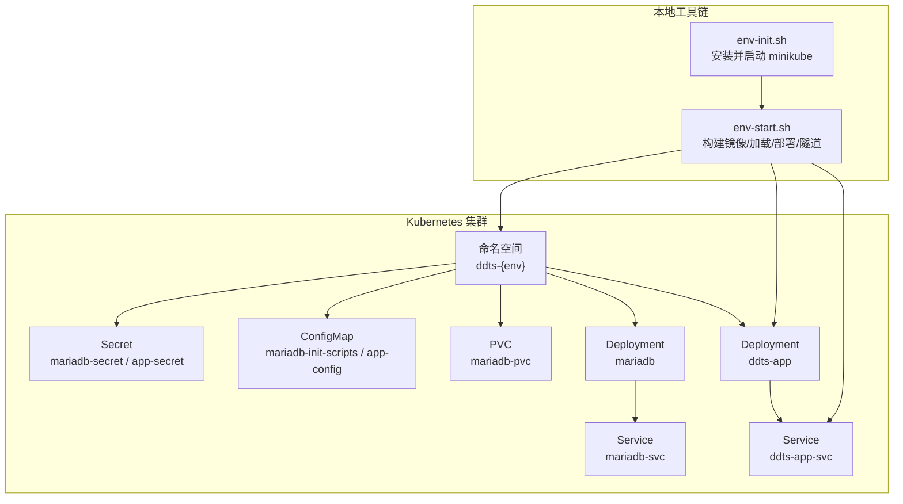
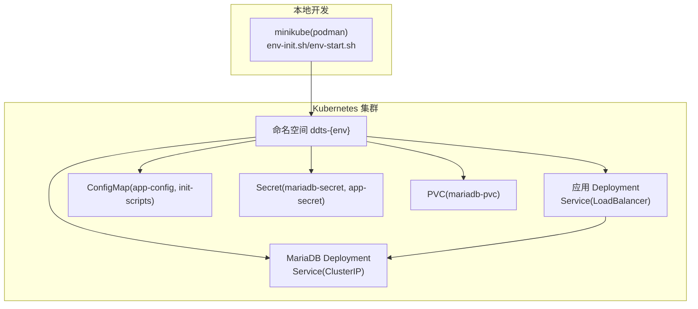
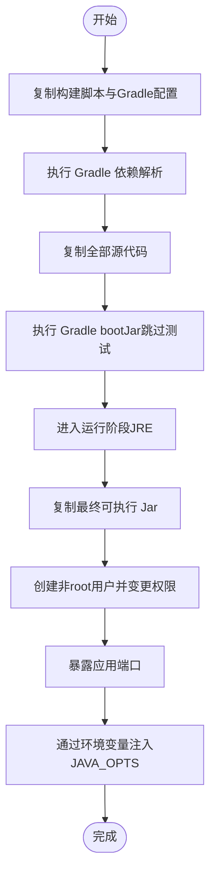
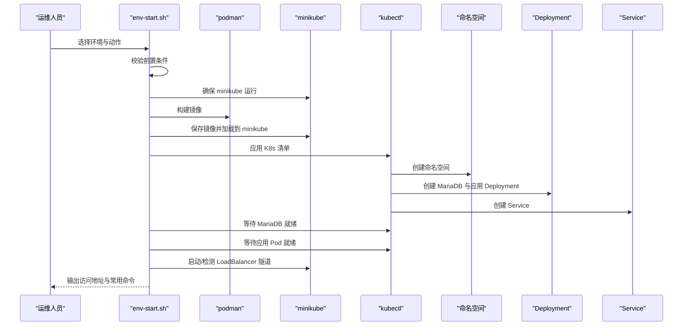
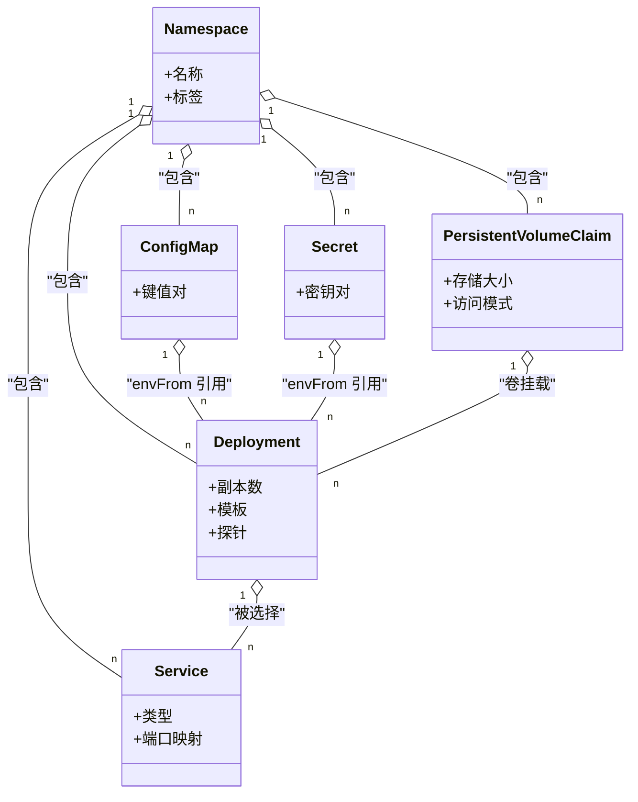
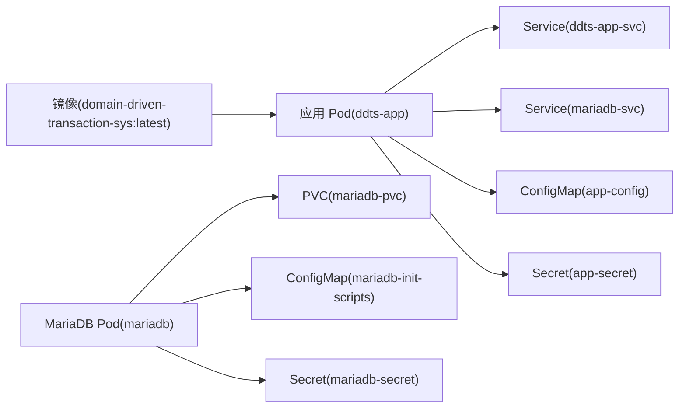

# 部署指南

<cite>
**本文引用的文件**
- [Dockerfile](file://deploy/docker/Dockerfile)
- [env-start.sh](file://deploy/scripts/env-start.sh)
- [env-init.sh](file://deploy/scripts/env-init.sh)
- [00-namespace.yaml](file://deploy/k8s/dev/00-namespace.yaml)
- [01-mariadb-secret.yaml](file://deploy/k8s/dev/01-mariadb-secret.yaml)
- [02-mariadb-init-configmap.yaml](file://deploy/k8s/dev/02-mariadb-init-configmap.yaml)
- [03-mariadb-pvc.yaml](file://deploy/k8s/dev/03-mariadb-pvc.yaml)
- [04-mariadb-deployment.yaml](file://deploy/k8s/dev/04-mariadb-deployment.yaml)
- [05-mariadb-service.yaml](file://deploy/k8s/dev/05-mariadb-service.yaml)
- [06-app-configmap.yaml](file://deploy/k8s/dev/06-app-configmap.yaml)
- [07-app-secret.yaml](file://deploy/k8s/dev/07-app-secret.yaml)
- [08-app-deployment.yaml](file://deploy/k8s/dev/08-app-deployment.yaml)
- [09-app-service.yaml](file://deploy/k8s/dev/09-app-service.yaml)
- [application.yml](file://biz-service-impl/src/main/resources/application.yml)
- [application.properties](file://biz-service-impl/src/main/resources/application.properties)
- [DomainDrivenTransactionSysApplication.java](file://biz-service-impl/src/main/java/com/magicliang/transaction/sys/DomainDrivenTransactionSysApplication.java)
</cite>

## 目录
1. [简介](#简介)
2. [项目结构](#项目结构)
3. [核心组件](#核心组件)
4. [架构总览](#架构总览)
5. [详细组件分析](#详细组件分析)
6. [依赖关系分析](#依赖关系分析)
7. [性能与容量规划](#性能与容量规划)
8. [故障排查指南](#故障排查指南)
9. [结论](#结论)
10. [附录](#附录)

## 简介
本指南面向运维与开发团队，提供领域驱动交易系统的完整部署方案，涵盖：
- Docker 两阶段构建与镜像优化
- Kubernetes 多环境（dev/staging/prod）独立部署
- Podman 替代 Docker 的本地开发集群（minikube 驱动）
- K8s 清单文件结构与关键资源定义
- 一键部署脚本 env-start.sh 的使用与参数说明
- 环境变量覆盖机制与配置优先级
- 运维操作手册与常见问题排查

## 项目结构
与部署相关的关键目录与文件：
- deploy/docker/Dockerfile：两阶段构建的镜像定义
- deploy/scripts/env-init.sh：一键安装 Java/Podman/kubectl/minikube 并启动 minikube
- deploy/scripts/env-start.sh：一键部署/销毁/状态查询脚本
- deploy/k8s/{dev,staging,prod}：各环境的 K8s 清单
- biz-service-impl/resources：应用配置与引导入口

图表来源
- [env-init.sh:300-333](file://deploy/scripts/env-init.sh#L300-L333)
- [env-start.sh:103-127](file://deploy/scripts/env-start.sh#L103-L127)
- [00-namespace.yaml:1-8](file://deploy/k8s/dev/00-namespace.yaml#L1-L8)
- [01-mariadb-secret.yaml:1-13](file://deploy/k8s/dev/01-mariadb-secret.yaml#L1-L13)
- [02-mariadb-init-configmap.yaml:1-224](file://deploy/k8s/dev/02-mariadb-init-configmap.yaml#L1-L224)
- [03-mariadb-pvc.yaml:1-16](file://deploy/k8s/dev/03-mariadb-pvc.yaml#L1-L16)
- [04-mariadb-deployment.yaml:1-74](file://deploy/k8s/dev/04-mariadb-deployment.yaml#L1-L74)
- [05-mariadb-service.yaml:1-18](file://deploy/k8s/dev/05-mariadb-service.yaml#L1-L18)
- [06-app-configmap.yaml:1-22](file://deploy/k8s/dev/06-app-configmap.yaml#L1-L22)
- [07-app-secret.yaml:1-14](file://deploy/k8s/dev/07-app-secret.yaml#L1-L14)
- [08-app-deployment.yaml:1-72](file://deploy/k8s/dev/08-app-deployment.yaml#L1-L72)
- [09-app-service.yaml:1-18](file://deploy/k8s/dev/09-app-service.yaml#L1-L18)

章节来源
- [Dockerfile:1-50](file://deploy/docker/Dockerfile#L1-L50)
- [env-init.sh:1-333](file://deploy/scripts/env-init.sh#L1-L333)
- [env-start.sh:1-284](file://deploy/scripts/env-start.sh#L1-L284)

## 核心组件
- 容器镜像构建（两阶段）
  - 构建阶段：使用 Gradle 下载依赖并打包 bootJar，跳过测试以避免 Docker-in-Docker 依赖
  - 运行阶段：基于轻量 JRE 镜像，非 root 用户运行，暴露应用端口，支持通过环境变量注入 JVM 参数
- 应用配置
  - 通过 Spring Profiles 激活不同环境配置；K8s 中通过 ConfigMap/Secret 注入环境变量实现覆盖
  - 应用端口与 Actuator 健康检查路径固定，便于探针与外部访问
- 数据库（MariaDB）
  - 使用 Deployment + PVC + Service，初始化脚本通过 ConfigMap 注入
  - 应用侧通过 Service 名称访问数据库，确保跨环境一致性
- 负载均衡与外部访问
  - 应用 Service 类型为 LoadBalancer，结合 minikube tunnel 提供外部 IP

章节来源
- [Dockerfile:23-49](file://deploy/docker/Dockerfile#L23-L49)
- [application.yml:1-216](file://biz-service-impl/src/main/resources/application.yml#L1-L216)
- [application.properties:1-14](file://biz-service-impl/src/main/resources/application.properties#L1-L14)
- [04-mariadb-deployment.yaml:1-74](file://deploy/k8s/dev/04-mariadb-deployment.yaml#L1-L74)
- [08-app-deployment.yaml:1-72](file://deploy/k8s/dev/08-app-deployment.yaml#L1-L72)
- [09-app-service.yaml:1-18](file://deploy/k8s/dev/09-app-service.yaml#L1-L18)

## 架构总览
整体部署架构围绕“本地开发集群 + 多环境 K8s 清单”的模式展开。应用与数据库均以 Deployment 形式运行，通过 Service 暴露服务；应用通过环境变量与配置映射实现环境解耦。

图表来源
- [env-init.sh:287-296](file://deploy/scripts/env-init.sh#L287-L296)
- [env-start.sh:103-127](file://deploy/scripts/env-start.sh#L103-L127)
- [00-namespace.yaml:1-8](file://deploy/k8s/dev/00-namespace.yaml#L1-L8)
- [04-mariadb-deployment.yaml:1-74](file://deploy/k8s/dev/04-mariadb-deployment.yaml#L1-L74)
- [08-app-deployment.yaml:1-72](file://deploy/k8s/dev/08-app-deployment.yaml#L1-L72)
- [06-app-configmap.yaml:1-22](file://deploy/k8s/dev/06-app-configmap.yaml#L1-L22)
- [07-app-secret.yaml:1-14](file://deploy/k8s/dev/07-app-secret.yaml#L1-L14)
- [03-mariadb-pvc.yaml:1-16](file://deploy/k8s/dev/03-mariadb-pvc.yaml#L1-L16)

## 详细组件分析

### Docker 镜像与两阶段构建
- 构建阶段
  - 使用 JDK 基础镜像，先复制构建脚本与 Gradle 配置以利用层缓存
  - 执行 Gradle 依赖解析与打包，跳过测试
- 运行阶段
  - 使用精简 JRE 镜像，创建非 root 用户，设置工作目录与权限
  - 暴露应用端口，通过环境变量注入 JVM 参数，便于在 K8s 中灵活调整内存与 GC 参数

图表来源
- [Dockerfile:23-49](file://deploy/docker/Dockerfile#L23-L49)

章节来源
- [Dockerfile:1-50](file://deploy/docker/Dockerfile#L1-L50)

### 一键部署脚本 env-start.sh
- 功能概览
  - 支持 dev/staging/prod 三套环境
  - 子命令：启动、销毁、状态查询
  - 自动检查前置条件（minikube/podman/kubectl），必要时提示先执行初始化脚本
- 关键流程
  - 启动：确保 minikube 运行 -> 构建镜像（podman）-> 加载到 minikube -> 应用 K8s 清单 -> 等待 MariaDB 与应用就绪 -> 启动 LoadBalancer 隧道 -> 输出访问地址与常用命令
  - 销毁：确认后删除命名空间及其所有资源（含持久化数据）
  - 状态：查看命名空间内 Pod/Service/PVC 状态
- 使用示例
  - 启动 dev 环境：./deploy/scripts/env-start.sh dev
  - 销毁 staging 环境：./deploy/scripts/env-start.sh staging --destroy
  - 查看 prod 状态：./deploy/scripts/env-start.sh prod --status

图表来源
- [env-start.sh:73-211](file://deploy/scripts/env-start.sh#L73-L211)

章节来源
- [env-start.sh:1-284](file://deploy/scripts/env-start.sh#L1-L284)

### 初始化脚本 env-init.sh（可选）
- 自动识别操作系统与包管理器
- 安装并启动：JDK 8、Podman、kubectl、minikube
- 验证安装并启动 minikube（podman 驱动）

章节来源
- [env-init.sh:1-333](file://deploy/scripts/env-init.sh#L1-L333)

### K8s 清单文件结构与配置
- 命名空间
  - ddts-dev / ddts-staging / ddts-prod
- MariaDB
  - Secret：存储数据库 root 密码
  - ConfigMap：初始化 SQL（创建库、表、索引）
  - PVC：申请持久化存储
  - Deployment：单副本，健康检查，挂载 PVC 与初始化脚本
  - Service：ClusterIP 暴露 3306
- 应用
  - ConfigMap：Spring Profile、数据源连接串、用户名、日志配置、JVM 参数
  - Secret：数据源密码
  - Deployment：包含 initContainer 等待 MariaDB 就绪；配置启动/就绪/存活探针；envFrom 引用 ConfigMap/Secret
  - Service：LoadBalancer，暴露 8502

图表来源
- [00-namespace.yaml:1-8](file://deploy/k8s/dev/00-namespace.yaml#L1-L8)
- [01-mariadb-secret.yaml:1-13](file://deploy/k8s/dev/01-mariadb-secret.yaml#L1-L13)
- [02-mariadb-init-configmap.yaml:1-224](file://deploy/k8s/dev/02-mariadb-init-configmap.yaml#L1-L224)
- [03-mariadb-pvc.yaml:1-16](file://deploy/k8s/dev/03-mariadb-pvc.yaml#L1-L16)
- [04-mariadb-deployment.yaml:1-74](file://deploy/k8s/dev/04-mariadb-deployment.yaml#L1-L74)
- [05-mariadb-service.yaml:1-18](file://deploy/k8s/dev/05-mariadb-service.yaml#L1-L18)
- [06-app-configmap.yaml:1-22](file://deploy/k8s/dev/06-app-configmap.yaml#L1-L22)
- [07-app-secret.yaml:1-14](file://deploy/k8s/dev/07-app-secret.yaml#L1-L14)
- [08-app-deployment.yaml:1-72](file://deploy/k8s/dev/08-app-deployment.yaml#L1-L72)
- [09-app-service.yaml:1-18](file://deploy/k8s/dev/09-app-service.yaml#L1-L18)

章节来源
- [00-namespace.yaml:1-8](file://deploy/k8s/dev/00-namespace.yaml#L1-L8)
- [01-mariadb-secret.yaml:1-13](file://deploy/k8s/dev/01-mariadb-secret.yaml#L1-L13)
- [02-mariadb-init-configmap.yaml:1-224](file://deploy/k8s/dev/02-mariadb-init-configmap.yaml#L1-L224)
- [03-mariadb-pvc.yaml:1-16](file://deploy/k8s/dev/03-mariadb-pvc.yaml#L1-L16)
- [04-mariadb-deployment.yaml:1-74](file://deploy/k8s/dev/04-mariadb-deployment.yaml#L1-L74)
- [05-mariadb-service.yaml:1-18](file://deploy/k8s/dev/05-mariadb-service.yaml#L1-L18)
- [06-app-configmap.yaml:1-22](file://deploy/k8s/dev/06-app-configmap.yaml#L1-L22)
- [07-app-secret.yaml:1-14](file://deploy/k8s/dev/07-app-secret.yaml#L1-L14)
- [08-app-deployment.yaml:1-72](file://deploy/k8s/dev/08-app-deployment.yaml#L1-L72)
- [09-app-service.yaml:1-18](file://deploy/k8s/dev/09-app-service.yaml#L1-L18)

### 环境变量覆盖机制与配置优先级
- 应用侧配置
  - 通过 Spring Profiles 激活不同环境配置（如 local-mysql-dev、staging、prod）
  - server.port、日志配置、数据源连接串、池参数等在 yml 中按 Profile 分离
- K8s 注入
  - 应用 Deployment 通过 envFrom 引用 ConfigMap 与 Secret，实现变量注入
  - Dockerfile 中 ENTRYPOINT 支持通过 JAVA_OPTS 注入 JVM 参数
- 优先级原则
  - K8s Secret/ConfigMap > 应用默认 Profile 配置
  - 若需覆盖特定属性，建议在对应环境的 ConfigMap/Secret 中设置同名键
  - 应用端口与 Actuator 健康检查路径固定，便于统一探针配置

章节来源
- [application.yml:1-216](file://biz-service-impl/src/main/resources/application.yml#L1-L216)
- [application.properties:1-14](file://biz-service-impl/src/main/resources/application.properties#L1-L14)
- [06-app-configmap.yaml:1-22](file://deploy/k8s/dev/06-app-configmap.yaml#L1-L22)
- [07-app-secret.yaml:1-14](file://deploy/k8s/dev/07-app-secret.yaml#L1-L14)
- [Dockerfile:48-49](file://deploy/docker/Dockerfile#L48-L49)

## 依赖关系分析
- 组件耦合
  - 应用 Deployment 依赖 MariaDB Service 名称（mariadb-svc）进行连接
  - 应用通过 ConfigMap/Secret 获取数据库连接串与凭据
  - 应用 Service 为 LoadBalancer，配合 minikube tunnel 提供外部访问
- 外部依赖
  - minikube（podman 驱动）用于本地集群
  - podman 用于镜像构建与加载
  - kubectl 用于应用清单与状态查询

图表来源
- [08-app-deployment.yaml:1-72](file://deploy/k8s/dev/08-app-deployment.yaml#L1-L72)
- [09-app-service.yaml:1-18](file://deploy/k8s/dev/09-app-service.yaml#L1-L18)
- [04-mariadb-deployment.yaml:1-74](file://deploy/k8s/dev/04-mariadb-deployment.yaml#L1-L74)
- [03-mariadb-pvc.yaml:1-16](file://deploy/k8s/dev/03-mariadb-pvc.yaml#L1-L16)
- [02-mariadb-init-configmap.yaml:1-224](file://deploy/k8s/dev/02-mariadb-init-configmap.yaml#L1-L224)
- [01-mariadb-secret.yaml:1-13](file://deploy/k8s/dev/01-mariadb-secret.yaml#L1-L13)
- [06-app-configmap.yaml:1-22](file://deploy/k8s/dev/06-app-configmap.yaml#L1-L22)
- [07-app-secret.yaml:1-14](file://deploy/k8s/dev/07-app-secret.yaml#L1-L14)

章节来源
- [env-start.sh:103-158](file://deploy/scripts/env-start.sh#L103-L158)
- [08-app-deployment.yaml:1-72](file://deploy/k8s/dev/08-app-deployment.yaml#L1-L72)
- [09-app-service.yaml:1-18](file://deploy/k8s/dev/09-app-service.yaml#L1-L18)
- [04-mariadb-deployment.yaml:1-74](file://deploy/k8s/dev/04-mariadb-deployment.yaml#L1-L74)

## 性能与容量规划
- JVM 内存与并发
  - 通过 ConfigMap 设置 JAVA_OPTS，建议根据业务峰值 QPS 调整 -Xms/-Xmx
  - Tomcat 线程池参数可在 application.properties 中调整
- 数据库连接池
  - 应用配置中已设置 Hikari 连接池参数，结合 K8s 资源限制与请求合理分配
- 探针与启动时间
  - 应用设置了启动探针与就绪/存活探针，建议根据数据库初始化耗时适当调整阈值

章节来源
- [06-app-configmap.yaml:1-22](file://deploy/k8s/dev/06-app-configmap.yaml#L1-L22)
- [application.properties:10-14](file://biz-service-impl/src/main/resources/application.properties#L10-L14)
- [08-app-deployment.yaml:52-71](file://deploy/k8s/dev/08-app-deployment.yaml#L52-L71)

## 故障排查指南
- 镜像构建失败
  - 确认本地已安装 JDK 8、Gradle 可正常执行
  - 检查 Docker/Podman 是否可用，必要时先执行初始化脚本
- minikube 未运行或无法加载镜像
  - 使用初始化脚本启动 minikube，或手动执行 minikube start --driver=podman
  - 确认镜像已保存并加载到 minikube
- MariaDB 未就绪
  - 查看 Pod 状态与事件，确认初始化脚本是否成功
  - 检查 PVC 是否绑定成功
- 应用 Pod 未就绪
  - 查看应用日志，确认数据库连接串与凭据是否正确
  - 检查探针配置与超时设置
- 外部访问无 IP
  - 确认 minikube tunnel 已启动，等待 LoadBalancer 分配外部 IP
  - 如长时间未分配，使用 kubectl describe svc 获取详细信息

章节来源
- [env-start.sh:73-89](file://deploy/scripts/env-start.sh#L73-L89)
- [env-start.sh:140-157](file://deploy/scripts/env-start.sh#L140-L157)
- [env-start.sh:162-211](file://deploy/scripts/env-start.sh#L162-L211)
- [04-mariadb-deployment.yaml:51-65](file://deploy/k8s/dev/04-mariadb-deployment.yaml#L51-L65)
- [08-app-deployment.yaml:52-71](file://deploy/k8s/dev/08-app-deployment.yaml#L52-L71)

## 结论
本部署方案通过两阶段 Docker 构建、K8s 多环境清单与一键脚本，实现了从本地开发到生产环境的一致化交付。借助 ConfigMap/Secret 的环境变量注入与 Spring Profiles 的配置分离，系统具备良好的可维护性与可扩展性。建议在生产环境中进一步完善资源配额、探针阈值与备份策略，并结合 CI/CD 实现自动化发布。

## 附录
- 一键部署脚本参数说明
  - ./deploy/scripts/env-start.sh <env> [--destroy|--status]
  - env：dev | staging | prod
  - --destroy：销毁指定环境（删除命名空间及其中所有资源）
  - --status：查看指定环境状态（Pod/Service/PVC）
- 常用命令速查
  - 查看命名空间：kubectl get ns
  - 查看 Pod：kubectl get pods -n ddts-{env}
  - 查看服务：kubectl get svc -n ddts-{env}
  - 查看 PVC：kubectl get pvc -n ddts-{env}
  - 查看日志：kubectl logs -n ddts-{env} -l app=ddts-app -f
  - 外部访问：minikube service ddts-app-svc -n ddts-{env} --url

章节来源
- [env-start.sh:35-47](file://deploy/scripts/env-start.sh#L35-L47)
- [env-start.sh:215-235](file://deploy/scripts/env-start.sh#L215-L235)