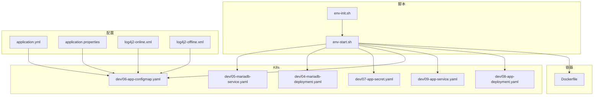
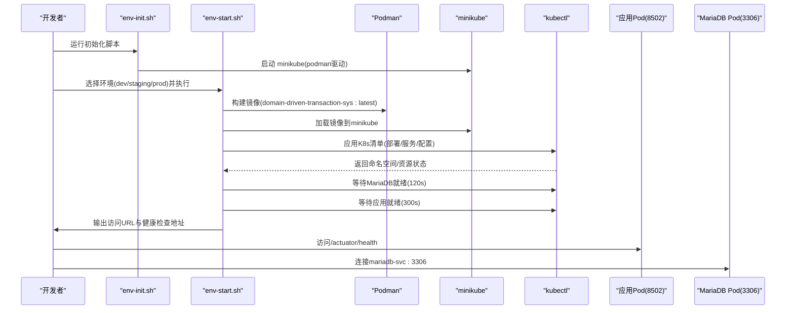
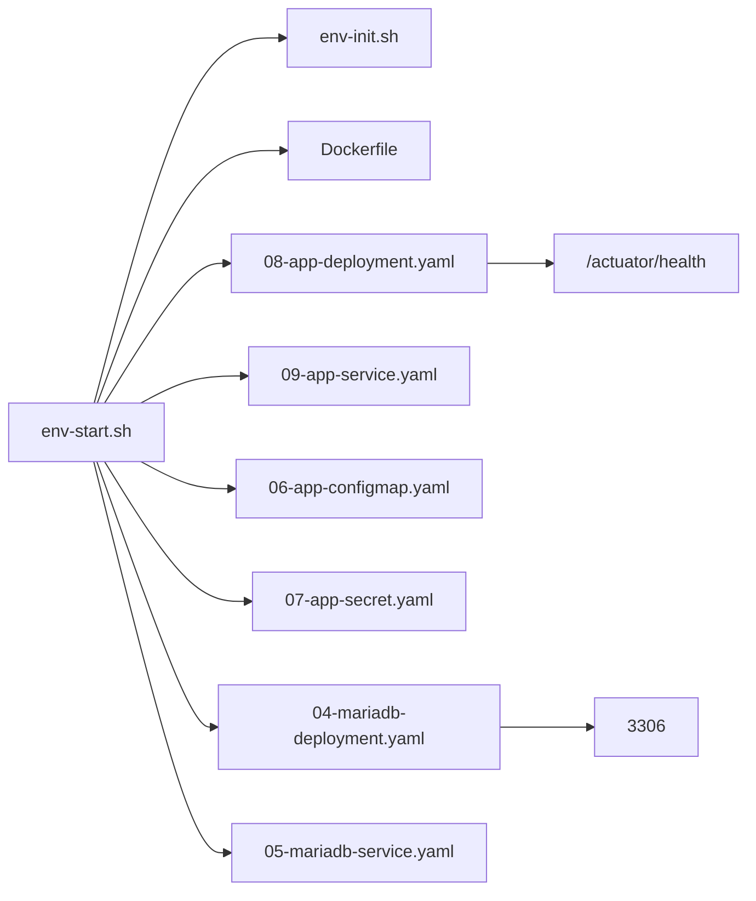

# 部署运维操作

<cite>
**本文引用的文件**
- [env-start.sh](file://deploy/scripts/env-start.sh)
- [env-init.sh](file://deploy/scripts/env-init.sh)
- [Dockerfile](file://deploy/docker/Dockerfile)
- [application.yml](file://biz-service-impl/src/main/resources/application.yml)
- [application.properties](file://biz-service-impl/src/main/resources/application.properties)
- [08-app-deployment.yaml](file://deploy/k8s/dev/08-app-deployment.yaml)
- [09-app-service.yaml](file://deploy/k8s/dev/09-app-service.yaml)
- [06-app-configmap.yaml](file://deploy/k8s/dev/06-app-configmap.yaml)
- [07-app-secret.yaml](file://deploy/k8s/dev/07-app-secret.yaml)
- [04-mariadb-deployment.yaml](file://deploy/k8s/dev/04-mariadb-deployment.yaml)
- [05-mariadb-service.yaml](file://deploy/k8s/dev/05-mariadb-service.yaml)
- [log4j2-online.xml](file://biz-service-impl/src/main/resources/log4j2/log4j2-online.xml)
- [log4j2-offline.xml](file://biz-service-impl/src/main/resources/log4j2/log4j2-offline.xml)
- [clean.sh](file://clean.sh)
</cite>

## 目录
1. [简介](#简介)
2. [项目结构](#项目结构)
3. [核心组件](#核心组件)
4. [架构总览](#架构总览)
5. [详细组件分析](#详细组件分析)
6. [依赖关系分析](#依赖关系分析)
7. [性能与容量规划](#性能与容量规划)
8. [故障排查指南](#故障排查指南)
9. [结论](#结论)
10. [附录](#附录)

## 简介
本操作手册面向领域驱动交易系统（Domain-Driven Transaction System）的部署与运维，聚焦以下目标：
- 详解一键启动脚本 env-start.sh 的使用方法，包括参数、环境准备与启动流程。
- 说明初始化脚本 env-init.sh 的功能与使用场景。
- 提供部署前检查清单（依赖服务、网络、权限等）。
- 介绍部署过程中的监控指标与健康检查方法。
- 详述常见部署问题的诊断与解决（端口冲突、内存不足、数据库连接失败等）。
- 给出版本升级与回滚的操作建议。
- 总结日志查看、性能监控与容量规划的最佳实践。

## 项目结构
该仓库采用多模块 Gradle 工程，结合 Docker 容器化与 Kubernetes 编排进行本地开发与测试环境的快速搭建。部署相关的关键文件如下：
- 脚本层：env-init.sh（环境初始化）、env-start.sh（一键启动/销毁/状态查询）
- 容器层：Dockerfile（应用镜像构建）
- 配置层：application.yml（多环境配置）、application.properties（运行参数）
- 编排层：Kubernetes 清单（dev/staging/prod 三套）
- 日志层：log4j2 在线/离线配置

图表来源
- [env-start.sh:1-284](file://deploy/scripts/env-start.sh#L1-L284)
- [env-init.sh:1-333](file://deploy/scripts/env-init.sh#L1-L333)
- [Dockerfile:1-50](file://deploy/docker/Dockerfile#L1-L50)
- [application.yml:1-216](file://biz-service-impl/src/main/resources/application.yml#L1-L216)
- [application.properties:1-14](file://biz-service-impl/src/main/resources/application.properties#L1-L14)
- [08-app-deployment.yaml:1-72](file://deploy/k8s/dev/08-app-deployment.yaml#L1-L72)
- [09-app-service.yaml:1-18](file://deploy/k8s/dev/09-app-service.yaml#L1-L18)
- [06-app-configmap.yaml:1-22](file://deploy/k8s/dev/06-app-configmap.yaml#L1-L22)
- [07-app-secret.yaml:1-14](file://deploy/k8s/dev/07-app-secret.yaml#L1-L14)
- [04-mariadb-deployment.yaml:1-74](file://deploy/k8s/dev/04-mariadb-deployment.yaml#L1-L74)
- [05-mariadb-service.yaml:1-18](file://deploy/k8s/dev/05-mariadb-service.yaml#L1-L18)
- [log4j2-online.xml:1-50](file://biz-service-impl/src/main/resources/log4j2/log4j2-online.xml#L1-L50)
- [log4j2-offline.xml:1-56](file://biz-service-impl/src/main/resources/log4j2/log4j2-offline.xml#L1-L56)

章节来源
- [env-start.sh:1-284](file://deploy/scripts/env-start.sh#L1-L284)
- [env-init.sh:1-333](file://deploy/scripts/env-init.sh#L1-L333)
- [Dockerfile:1-50](file://deploy/docker/Dockerfile#L1-L50)
- [application.yml:1-216](file://biz-service-impl/src/main/resources/application.yml#L1-L216)
- [application.properties:1-14](file://biz-service-impl/src/main/resources/application.properties#L1-L14)
- [08-app-deployment.yaml:1-72](file://deploy/k8s/dev/08-app-deployment.yaml#L1-L72)
- [09-app-service.yaml:1-18](file://deploy/k8s/dev/09-app-service.yaml#L1-L18)
- [06-app-configmap.yaml:1-22](file://deploy/k8s/dev/06-app-configmap.yaml#L1-L22)
- [07-app-secret.yaml:1-14](file://deploy/k8s/dev/07-app-secret.yaml#L1-L14)
- [04-mariadb-deployment.yaml:1-74](file://deploy/k8s/dev/04-mariadb-deployment.yaml#L1-L74)
- [05-mariadb-service.yaml:1-18](file://deploy/k8s/dev/05-mariadb-service.yaml#L1-L18)
- [log4j2-online.xml:1-50](file://biz-service-impl/src/main/resources/log4j2/log4j2-online.xml#L1-L50)
- [log4j2-offline.xml:1-56](file://biz-service-impl/src/main/resources/log4j2/log4j2-offline.xml#L1-L56)

## 核心组件
- 初始化脚本 env-init.sh：自动识别操作系统与包管理器，安装并校验 Java、Podman、kubectl、minikube，并启动 minikube（Podman 驱动），为后续一键启动提供基础环境。
- 启动脚本 env-start.sh：负责预检、构建镜像、加载镜像到 minikube、部署 K8s 资源、建立 LoadBalancer 访问隧道、等待 Pod 就绪并输出访问地址与常用运维命令。
- 应用镜像 Dockerfile：分阶段构建（Gradle 构建 + 轻量运行时 JRE），暴露 8502 端口，支持通过 JAVA_OPTS 注入 JVM 参数。
- 多环境配置 application.yml：定义 dev/staging/prod 等 profile 下的数据源、SQL 初始化、日志级别等；application.properties：定义 OpenTelemetry 关闭、Tomcat 线程池、异步超时等运行参数。
- K8s 清单：dev 环境包含 MariaDB Deployment/Service、应用 Deployment/Service、ConfigMap/Secret，以及 initContainer 等就绪策略。

章节来源
- [env-init.sh:1-333](file://deploy/scripts/env-init.sh#L1-L333)
- [env-start.sh:1-284](file://deploy/scripts/env-start.sh#L1-L284)
- [Dockerfile:1-50](file://deploy/docker/Dockerfile#L1-L50)
- [application.yml:1-216](file://biz-service-impl/src/main/resources/application.yml#L1-L216)
- [application.properties:1-14](file://biz-service-impl/src/main/resources/application.properties#L1-L14)
- [08-app-deployment.yaml:1-72](file://deploy/k8s/dev/08-app-deployment.yaml#L1-L72)
- [09-app-service.yaml:1-18](file://deploy/k8s/dev/09-app-service.yaml#L1-L18)
- [06-app-configmap.yaml:1-22](file://deploy/k8s/dev/06-app-configmap.yaml#L1-L22)
- [07-app-secret.yaml:1-14](file://deploy/k8s/dev/07-app-secret.yaml#L1-L14)
- [04-mariadb-deployment.yaml:1-74](file://deploy/k8s/dev/04-mariadb-deployment.yaml#L1-L74)
- [05-mariadb-service.yaml:1-18](file://deploy/k8s/dev/05-mariadb-service.yaml#L1-L18)

## 架构总览
下图展示从本地开发环境到应用上线的全链路：初始化工具 → 构建镜像 → 加载镜像 → 部署 K8s → 访问入口（LoadBalancer）→ 健康检查。

图表来源
- [env-start.sh:103-158](file://deploy/scripts/env-start.sh#L103-L158)
- [env-start.sh:162-211](file://deploy/scripts/env-start.sh#L162-L211)
- [08-app-deployment.yaml:52-71](file://deploy/k8s/dev/08-app-deployment.yaml#L52-L71)
- [04-mariadb-deployment.yaml:51-66](file://deploy/k8s/dev/04-mariadb-deployment.yaml#L51-L66)

章节来源
- [env-start.sh:1-284](file://deploy/scripts/env-start.sh#L1-L284)
- [08-app-deployment.yaml:1-72](file://deploy/k8s/dev/08-app-deployment.yaml#L1-L72)
- [04-mariadb-deployment.yaml:1-74](file://deploy/k8s/dev/04-mariadb-deployment.yaml#L1-L74)

## 详细组件分析

### 一键启动脚本 env-start.sh 使用指南
- 支持的环境：dev、staging、prod（通过命名空间 ddts-{env} 隔离）
- 支持的动作：启动（默认）、销毁（--destroy）、状态（--status）
- 关键步骤：
  - 预检：检查 podman、minikube、kubectl 是否存在，K8s 清单目录是否存在
  - minikube 状态：若未运行则启动（Podman 驱动，内存/核数默认）
  - 构建镜像：使用 Podman 从根目录 Dockerfile 构建 latest 镜像
  - 加载镜像：将镜像保存并加载到 minikube
  - 部署：应用对应环境的 K8s 清单
  - 等待就绪：先等待 MariaDB Pod 就绪，再等待应用 Pod 就绪
  - 隧道：启动 minikube tunnel 并等待 LoadBalancer 外部 IP，输出访问地址与健康检查地址
  - 状态：列出命名空间内 Pods/SVC/PVC
  - 销毁：删除命名空间（含持久化数据）

常用命令示例（路径引用）：
- 启动 dev 环境：[env-start.sh:42-45](file://deploy/scripts/env-start.sh#L42-L45)
- 销毁 staging 环境：[env-start.sh:44-45](file://deploy/scripts/env-start.sh#L44-L45)
- 查看 prod 环境状态：[env-start.sh:44-45](file://deploy/scripts/env-start.sh#L44-L45)
- 预检与 minikube 启动：[env-start.sh:73-99](file://deploy/scripts/env-start.sh#L73-L99)
- 构建与加载镜像：[env-start.sh:103-127](file://deploy/scripts/env-start.sh#L103-L127)
- 部署与等待就绪：[env-start.sh:131-158](file://deploy/scripts/env-start.sh#L131-L158)
- 隧道与访问地址：[env-start.sh:162-211](file://deploy/scripts/env-start.sh#L162-L211)
- 状态查询：[env-start.sh:215-235](file://deploy/scripts/env-start.sh#L215-L235)
- 销毁确认与删除：[env-start.sh:239-259](file://deploy/scripts/env-start.sh#L239-L259)

章节来源
- [env-start.sh:1-284](file://deploy/scripts/env-start.sh#L1-L284)

### 初始化脚本 env-init.sh 使用指南
- 自动识别 OS 与包管理器（macOS Homebrew、Debian/Ubuntu apt、RHEL/Fedora/CentOS dnf/yum）
- 安装顺序：JDK 8（Temurin）、Podman、kubectl、minikube
- 校验安装：输出各工具版本，失败则退出
- 启动 minikube：使用 podman 驱动，内存/CPU 默认参数
- 下一步：提示执行 env-start.sh 选择环境启动

常用命令示例（路径引用）：
- 运行初始化：[env-init.sh:326-330](file://deploy/scripts/env-init.sh#L326-L330)
- 启动 minikube：[env-init.sh:287-296](file://deploy/scripts/env-init.sh#L287-L296)

章节来源
- [env-init.sh:1-333](file://deploy/scripts/env-init.sh#L1-L333)

### 应用镜像与运行参数
- 镜像构建：分阶段构建，最终运行时基于 Eclipse Temurin 8 JRE，暴露 8502 端口，入口通过 JAVA_OPTS 注入 JVM 参数
- 运行参数：application.properties 中定义了 OTel 关闭、Tomcat 线程池、异步超时等
- 日志配置：application.yml 指定在线/离线日志配置文件，K8s ConfigMap 中可切换

章节来源
- [Dockerfile:1-50](file://deploy/docker/Dockerfile#L1-L50)
- [application.properties:1-14](file://biz-service-impl/src/main/resources/application.properties#L1-L14)
- [application.yml:48-50](file://biz-service-impl/src/main/resources/application.yml#L48-L50)

### K8s 清单与就绪策略
- 应用 Deployment：initContainer 等待 mariadb-svc:3306 就绪；配置启动/就绪/存活探针；请求/限制资源；通过 ConfigMap/Secret 注入环境变量
- 应用 Service：LoadBalancer 类型，映射 8502 端口
- MariaDB Deployment/Service：ClusterIP 类型，挂载 PVC 与初始化脚本，配置就绪/存活探针
- ConfigMap/Secret：注入 JDBC URL、用户名、密码、日志配置、JAVA_OPTS 等

章节来源
- [08-app-deployment.yaml:1-72](file://deploy/k8s/dev/08-app-deployment.yaml#L1-L72)
- [09-app-service.yaml:1-18](file://deploy/k8s/dev/09-app-service.yaml#L1-L18)
- [06-app-configmap.yaml:1-22](file://deploy/k8s/dev/06-app-configmap.yaml#L1-L22)
- [07-app-secret.yaml:1-14](file://deploy/k8s/dev/07-app-secret.yaml#L1-L14)
- [04-mariadb-deployment.yaml:1-74](file://deploy/k8s/dev/04-mariadb-deployment.yaml#L1-L74)
- [05-mariadb-service.yaml:1-18](file://deploy/k8s/dev/05-mariadb-service.yaml#L1-L18)

## 依赖关系分析
- 脚本依赖：env-start.sh 依赖 env-init.sh 完成工具安装；两者均依赖 minikube/podman/kubectl
- 镜像依赖：Dockerfile 依赖 Gradle 构建产物；运行时依赖 JRE
- 配置依赖：application.yml 通过 Spring Profile 切换不同环境；K8s ConfigMap/Secret 覆盖关键配置
- 探针依赖：应用探针依赖 Actuator /actuator/health；MariaDB 探针依赖 mysqladmin/ping 与端口探测

图表来源
- [env-start.sh:1-284](file://deploy/scripts/env-start.sh#L1-L284)
- [Dockerfile:1-50](file://deploy/docker/Dockerfile#L1-L50)
- [08-app-deployment.yaml:52-71](file://deploy/k8s/dev/08-app-deployment.yaml#L52-L71)
- [09-app-service.yaml:1-18](file://deploy/k8s/dev/09-app-service.yaml#L1-L18)
- [06-app-configmap.yaml:1-22](file://deploy/k8s/dev/06-app-configmap.yaml#L1-L22)
- [07-app-secret.yaml:1-14](file://deploy/k8s/dev/07-app-secret.yaml#L1-L14)
- [04-mariadb-deployment.yaml:51-66](file://deploy/k8s/dev/04-mariadb-deployment.yaml#L51-L66)
- [05-mariadb-service.yaml:1-18](file://deploy/k8s/dev/05-mariadb-service.yaml#L1-L18)

章节来源
- [env-start.sh:1-284](file://deploy/scripts/env-start.sh#L1-L284)
- [Dockerfile:1-50](file://deploy/docker/Dockerfile#L1-L50)
- [08-app-deployment.yaml:1-72](file://deploy/k8s/dev/08-app-deployment.yaml#L1-L72)
- [09-app-service.yaml:1-18](file://deploy/k8s/dev/09-app-service.yaml#L1-L18)
- [06-app-configmap.yaml:1-22](file://deploy/k8s/dev/06-app-configmap.yaml#L1-L22)
- [07-app-secret.yaml:1-14](file://deploy/k8s/dev/07-app-secret.yaml#L1-L14)
- [04-mariadb-deployment.yaml:1-74](file://deploy/k8s/dev/04-mariadb-deployment.yaml#L1-L74)
- [05-mariadb-service.yaml:1-18](file://deploy/k8s/dev/05-mariadb-service.yaml#L1-L18)

## 性能与容量规划
- JVM 内存：通过 ConfigMap 的 JAVA_OPTS 注入（例如 -Xms/-Xmx），建议按峰值 QPS 与 GC 行为调优
- Tomcat 线程池：application.properties 中已配置最大线程与最小空闲线程，可根据并发请求调整
- 数据库连接池：application.yml 中 Hikari 配置了最小空闲与最大池大小，需结合慢查询与锁等待优化
- 资源请求/限制：应用 Deployment 已设置 requests/limits，建议结合 CPU/内存监控逐步扩容
- 日志级别：生产环境使用在线日志配置，避免过量 IO；开发环境可使用离线日志提升可观测性

章节来源
- [application.properties:10-14](file://biz-service-impl/src/main/resources/application.properties#L10-L14)
- [application.yml:24-32](file://biz-service-impl/src/main/resources/application.yml#L24-L32)
- [06-app-configmap.yaml:21-21](file://deploy/k8s/dev/06-app-configmap.yaml#L21-L21)
- [08-app-deployment.yaml:45-51](file://deploy/k8s/dev/08-app-deployment.yaml#L45-L51)
- [log4j2-online.xml:1-50](file://biz-service-impl/src/main/resources/log4j2/log4j2-online.xml#L1-L50)
- [log4j2-offline.xml:1-56](file://biz-service-impl/src/main/resources/log4j2/log4j2-offline.xml#L1-L56)

## 故障排查指南
- 端口冲突
  - 现象：minikube tunnel 或 Service 外部 IP 长时间 pending
  - 排查：确认宿主网络路由与系统防火墙；检查 minikube tunnel 是否已在运行；必要时重启隧道
  - 参考：[env-start.sh:162-211](file://deploy/scripts/env-start.sh#L162-L211)
- 内存不足
  - 现象：Pod OOMKilled 或启动缓慢
  - 排查：增大 Deployment requests/limits；调整 JAVA_OPTS -Xmx；检查数据库连接池大小
  - 参考：[08-app-deployment.yaml:45-51](file://deploy/k8s/dev/08-app-deployment.yaml#L45-L51)，[06-app-configmap.yaml:21-21](file://deploy/k8s/dev/06-app-configmap.yaml#L21-L21)，[application.yml:24-32](file://biz-service-impl/src/main/resources/application.yml#L24-L32)
- 数据库连接失败
  - 现象：应用启动探针失败、MariaDB 探针失败
  - 排查：确认 ConfigMap/Secret 中 JDBC URL/用户名/密码；确认 Service 名称与端口；确认 initContainer 成功等待
  - 参考：[06-app-configmap.yaml:10-18](file://deploy/k8s/dev/06-app-configmap.yaml#L10-L18)，[07-app-secret.yaml:10-13](file://deploy/k8s/dev/07-app-secret.yaml#L10-L13)，[04-mariadb-deployment.yaml:51-66](file://deploy/k8s/dev/04-mariadb-deployment.yaml#L51-L66)，[08-app-deployment.yaml:20-32](file://deploy/k8s/dev/08-app-deployment.yaml#L20-L32)
- 镜像加载失败
  - 现象：minikube image load 失败
  - 排查：确认 podman 版本与镜像标签；尝试重新构建并加载
  - 参考：[env-start.sh:118-127](file://deploy/scripts/env-start.sh#L118-L127)
- 健康检查失败
  - 现象：/actuator/health 不可用
  - 排查：查看应用日志；确认数据库连通性；检查探针路径与端口
  - 参考：[08-app-deployment.yaml:52-71](file://deploy/k8s/dev/08-app-deployment.yaml#L52-L71)，[env-start.sh:140-157](file://deploy/scripts/env-start.sh#L140-L157)

章节来源
- [env-start.sh:1-284](file://deploy/scripts/env-start.sh#L1-L284)
- [08-app-deployment.yaml:1-72](file://deploy/k8s/dev/08-app-deployment.yaml#L1-L72)
- [06-app-configmap.yaml:1-22](file://deploy/k8s/dev/06-app-configmap.yaml#L1-L22)
- [07-app-secret.yaml:1-14](file://deploy/k8s/dev/07-app-secret.yaml#L1-L14)
- [04-mariadb-deployment.yaml:1-74](file://deploy/k8s/dev/04-mariadb-deployment.yaml#L1-L74)

## 结论
本操作手册围绕 env-init.sh 与 env-start.sh 的使用，结合 Docker 镜像与 K8s 清单，给出了从环境准备到部署、监控与故障排查的完整流程。建议在生产环境中进一步完善 CI/CD 流水线、密钥管理与资源配额策略，并持续优化 JVM 与数据库连接池参数以满足业务峰值需求。

## 附录

### 部署前检查清单
- 工具安装与版本
  - Java、Podman、kubectl、minikube 是否安装并可执行
  - minikube 状态是否为 Running（Podman 驱动）
- 网络与权限
  - 本机是否具备 sudo 权限以启动 minikube tunnel
  - 防火墙与代理是否影响 LoadBalancer 外部 IP 分配
- 配置与密钥
  - K8s ConfigMap/Secret 是否正确注入 JDBC URL、用户名、密码、日志配置、JAVA_OPTS
  - application.yml 的 Spring Profile 是否与目标环境匹配
- 资源与容量
  - Deployment requests/limits 是否合理
  - MariaDB PVC 是否绑定成功

章节来源
- [env-init.sh:242-283](file://deploy/scripts/env-init.sh#L242-L283)
- [env-start.sh:73-89](file://deploy/scripts/env-start.sh#L73-L89)
- [06-app-configmap.yaml:1-22](file://deploy/k8s/dev/06-app-configmap.yaml#L1-L22)
- [07-app-secret.yaml:1-14](file://deploy/k8s/dev/07-app-secret.yaml#L1-L14)
- [application.yml:1-216](file://biz-service-impl/src/main/resources/application.yml#L1-L216)
- [08-app-deployment.yaml:45-51](file://deploy/k8s/dev/08-app-deployment.yaml#L45-L51)
- [04-mariadb-deployment.yaml:67-74](file://deploy/k8s/dev/04-mariadb-deployment.yaml#L67-L74)

### 健康检查与监控指标
- 健康检查
  - 应用：/actuator/health（就绪/存活探针均指向该路径）
  - 数据库：MariaDB 就绪/存活探针分别使用 mysqladmin 与端口探测
- 指标建议
  - JVM：堆内存、GC 次数与耗时、线程数
  - 应用：QPS、P95/P99 延迟、错误率、活动连接数
  - 数据库：连接数、慢查询、锁等待

章节来源
- [08-app-deployment.yaml:52-71](file://deploy/k8s/dev/08-app-deployment.yaml#L52-L71)
- [04-mariadb-deployment.yaml:51-66](file://deploy/k8s/dev/04-mariadb-deployment.yaml#L51-L66)

### 日志查看与最佳实践
- 日志配置
  - 生产环境使用在线日志配置，避免过多 IO
  - 开发环境使用离线日志，便于调试 SQL 与框架日志
- 日志查看
  - 使用 kubectl logs -n ddts-{env} -l app=ddts-app -f 实时查看
- 最佳实践
  - 控制日志级别，避免高频 debug
  - 使用滚动文件与时间轮转，定期清理

章节来源
- [application.yml:48-50](file://biz-service-impl/src/main/resources/application.yml#L48-L50)
- [log4j2-online.xml:1-50](file://biz-service-impl/src/main/resources/log4j2/log4j2-online.xml#L1-L50)
- [log4j2-offline.xml:1-56](file://biz-service-impl/src/main/resources/log4j2/log4j2-offline.xml#L1-L56)
- [env-start.sh:209-209](file://deploy/scripts/env-start.sh#L209-L209)

### 版本升级与回滚建议
- 升级流程
  - 更新 Dockerfile 或 Gradle 构建产物，重新构建镜像并加载到 minikube
  - 应用新 K8s 清单，观察探针与日志
- 回滚流程
  - 恢复旧镜像标签并重新应用清单
  - 如涉及数据库结构变更，需配合迁移脚本与备份恢复
- 注意事项
  - 保留历史镜像与 ConfigMap/Secret 快照
  - 对关键变更进行灰度发布与 A/B 验证

章节来源
- [Dockerfile:1-50](file://deploy/docker/Dockerfile#L1-L50)
- [env-start.sh:103-127](file://deploy/scripts/env-start.sh#L103-L127)
- [08-app-deployment.yaml:34-36](file://deploy/k8s/dev/08-app-deployment.yaml#L34-L36)

### 清理与缓存
- 清理构建缓存与中间产物，避免磁盘占用
- 常用清理脚本路径：[clean.sh:1-8](file://clean.sh#L1-L8)

章节来源
- [clean.sh:1-8](file://clean.sh#L1-L8)