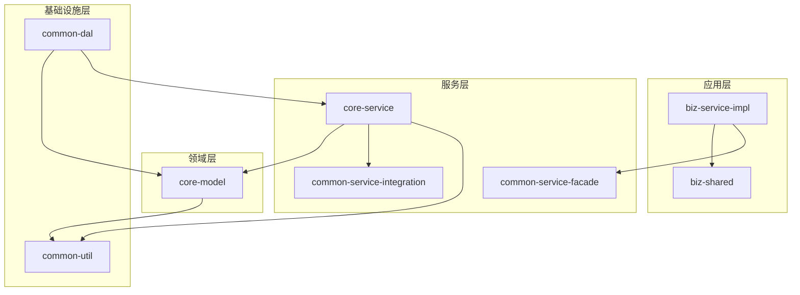
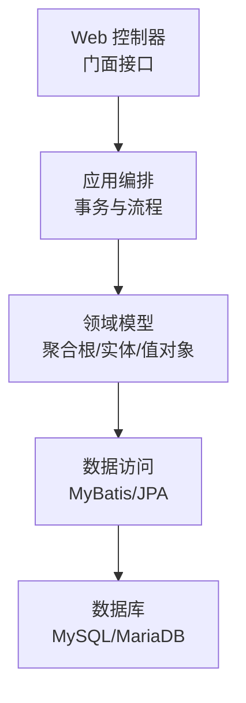
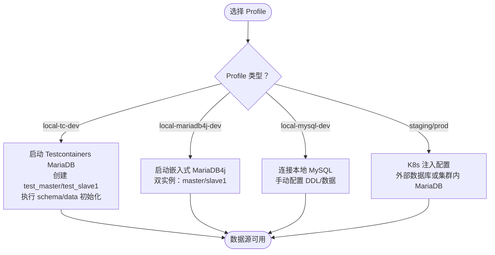
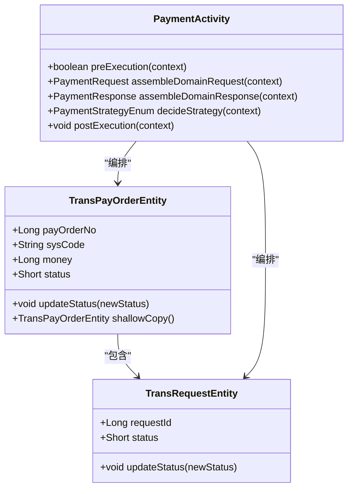
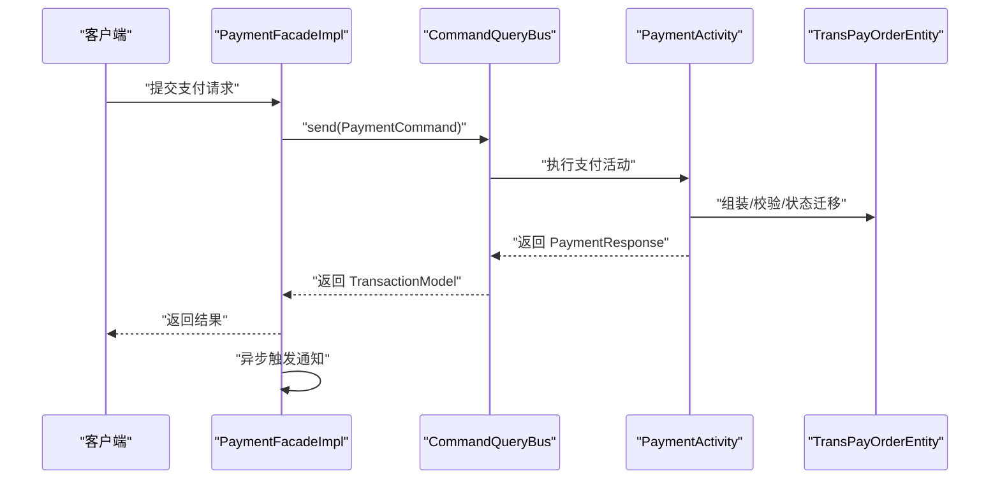
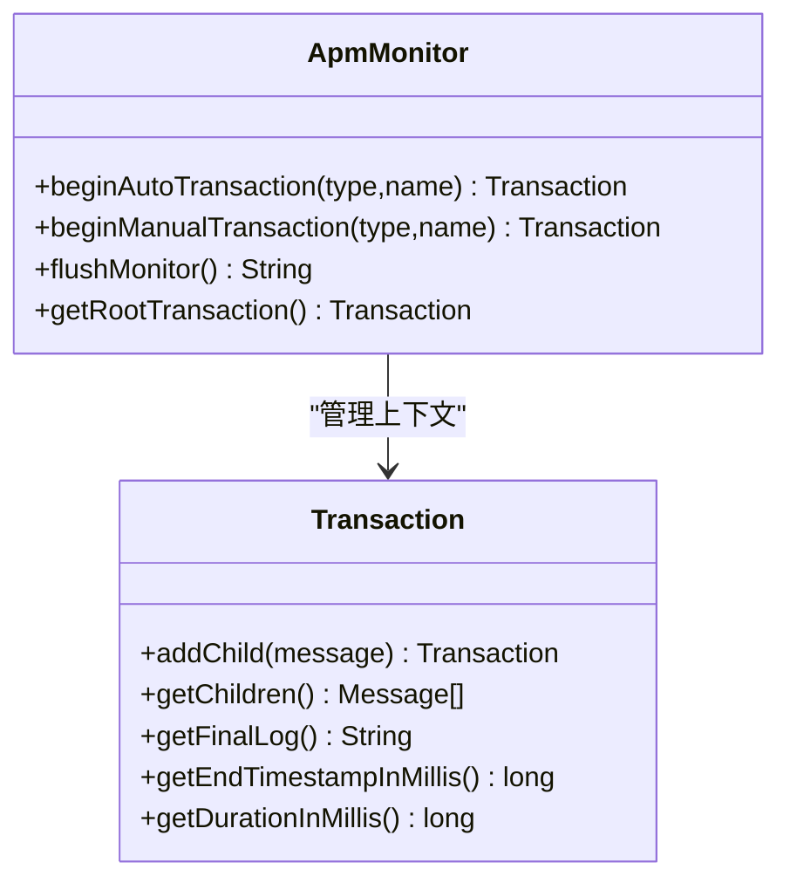
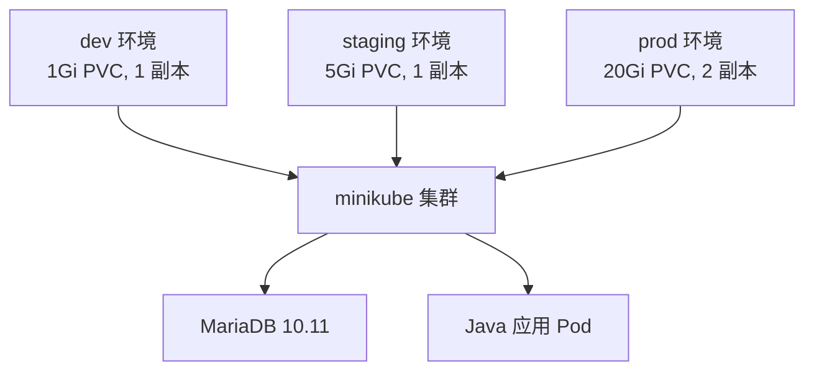
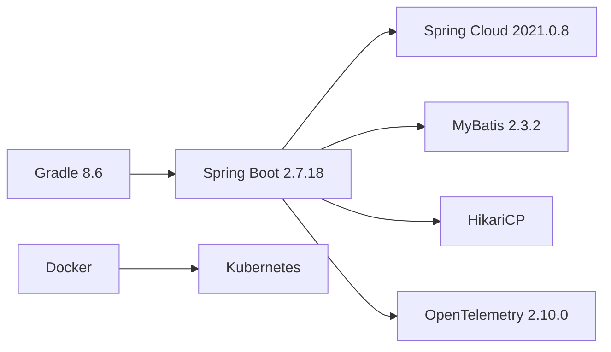

# 项目概述

<cite>
**本文档引用的文件**
- [README.md](file://README.md)
- [build.gradle](file://build.gradle)
- [settings.gradle](file://settings.gradle)
- [gradle.properties](file://gradle.properties)
- [application.yml](file://biz-service-impl/src/main/resources/application.yml)
- [DomainDrivenTransactionSysApplication.java](file://biz-service-impl/src/main/java/com/magicliang/transaction/sys/DomainDrivenTransactionSysApplication.java)
- [DataSourceConfig.java](file://common-dal/src/main/java/com/magicliang/transaction/sys/common/dal/datasource/DataSourceConfig.java)
- [EmbeddedMariaDbConfig.java](file://common-dal/src/main/java/com/magicliang/transaction/sys/common/dal/datasource/EmbeddedMariaDbConfig.java)
- [EmbeddedTestcontainersDbConfig.java](file://common-dal/src/main/java/com/magicliang/transaction/sys/common/dal/datasource/EmbeddedTestcontainersDbConfig.java)
- [ApmMonitor.java](file://common-util/src/main/java/com/magicliang/transaction/sys/common/util/apm/ApmMonitor.java)
- [Transaction.java](file://common-util/src/main/java/com/magicliang/transaction/sys/common/util/apm/Transaction.java)
- [CommonConfig.java](file://core-service/src/main/java/com/magicliang/transaction/sys/core/config/CommonConfig.java)
- [Dockerfile](file://deploy/docker/Dockerfile)
- [TransPayOrderEntity.java](file://core-model/src/main/java/com/magicliang/transaction/sys/core/model/entity/TransPayOrderEntity.java)
- [PaymentActivity.java](file://core-service/src/main/java/com/magicliang/transaction/sys/core/domain/activity/payment/PaymentActivity.java)
- [PaymentFacadeImpl.java](file://biz-service-impl/src/main/java/com/magicliang/transaction/sys/biz/service/impl/facade/impl/PaymentFacadeImpl.java)
</cite>

## 目录
1. [引言](#引言)
2. [项目结构](#项目结构)
3. [核心组件](#核心组件)
4. [架构总览](#架构总览)
5. [详细组件分析](#详细组件分析)
6. [依赖分析](#依赖分析)
7. [性能考量](#性能考量)
8. [故障排查指南](#故障排查指南)
9. [结论](#结论)
10. [附录](#附录)

## 引言
本项目是一个基于领域驱动设计（DDD）原则构建的交易系统示例，旨在演示如何在 Java 8 + Spring Boot 2.7.18 环境下实现企业级交易系统架构。项目采用 Gradle 多模块构建，遵循 SOFA 分层架构设计，强调“展示层-应用层-领域层-基础层”的职责分离。同时，项目提供了完善的可观测性（OpenTelemetry 集成）、多数据库配置方案（Testcontainers、嵌入式 MariaDB、外部数据库）以及容器化与 Kubernetes 部署能力，既适合初学者理解 DDD 与分层架构思想，也为有经验的开发者提供了可落地的工程实践参考。

## 项目结构
项目采用 Gradle 多模块架构，核心模块包括：
- biz-service-impl：业务服务实现层，包含 Web MVC/WebFlux 支持，是应用的可启动模块
- biz-shared：业务共享模块，提供业务级别的共享组件
- common-dal：数据访问层，集成 JPA 与 MyBatis，支持多数据源
- common-service-facade：服务门面层，定义对外暴露的服务接口
- common-service-integration：服务集成层，处理第三方系统集成
- common-util：通用工具类库
- core-model：核心领域模型，包含领域实体、值对象、聚合根等
- core-service：核心服务层，实现业务逻辑

**图表来源**
- [settings.gradle:7-14](file://settings.gradle#L7-L14)
- [build.gradle:165-284](file://build.gradle#L165-L284)

**章节来源**
- [README.md:23-47](file://README.md#L23-L47)
- [settings.gradle:1-16](file://settings.gradle#L1-L16)
- [build.gradle:165-284](file://build.gradle#L165-L284)

## 核心组件
- 分层架构与 SOFA 模型：项目严格遵循 SOFA 分层（展示层、应用层、领域层、基础层），通过模块边界清晰划分职责，降低耦合度，提升可维护性与可测试性。
- 多模块构建：根项目通过 Gradle 统一管理依赖与测试配置，子模块按职责拆分，避免重复与交叉依赖。
- 数据库配置：通过 Spring Profile 机制支持多种数据库接入（Testcontainers、嵌入式 MariaDB、外部数据库），并提供 K8s 环境下的配置覆盖与注入。
- 可观测性：集成 OpenTelemetry 与自研 APM 监控体系，结合日志与线程池监控，形成端到端的可观测性闭环。
- 容器化与部署：提供 Dockerfile 两阶段构建与 K8s 清单，支持 dev/staging/prod 三套环境，具备一键初始化与销毁能力。

**章节来源**
- [README.md:547-576](file://README.md#L547-L576)
- [build.gradle:15-34](file://build.gradle#L15-L34)
- [application.yml:4-80](file://biz-service-impl/src/main/resources/application.yml#L4-L80)

## 架构总览
项目采用 SOFA 分层模型，结合 DDD 的四层架构（表示层、应用层、领域层、基础设施层）。在本项目中：
- 展示层：Web 控制器与门面层负责请求接入、参数校验与响应封装
- 应用层：编排业务流程、事务管理与跨聚合协调
- 领域层：核心业务逻辑与领域模型，强调不变量与业务语义
- 基础设施层：数据访问、第三方集成与技术支撑

**图表来源**
- [README.md:549-560](file://README.md#L549-L560)
- [DomainDrivenTransactionSysApplication.java:52-73](file://biz-service-impl/src/main/java/com/magicliang/transaction/sys/DomainDrivenTransactionSysApplication.java#L52-L73)

**章节来源**
- [README.md:547-560](file://README.md#L547-L560)

## 详细组件分析

### 数据库配置与 Profile 策略
项目通过 Spring Profile 机制支持多种数据库接入方式，覆盖本地开发、集成测试与生产环境：
- local-tc-dev（默认）：Testcontainers 自动启动 MariaDB 10.11 容器，自动创建双数据库并执行初始化脚本，无需手动安装数据库
- local-mariadb4j-dev：嵌入式 MariaDB（JVM 进程内），支持双实例，仅 x86 架构
- local-mysql-dev：连接本地 MySQL 8.0+，需手动配置连接信息
- staging/prod：由 K8s ConfigMap/Secret 注入，支持外部数据库或集群内 MariaDB

**图表来源**
- [application.yml:8-216](file://biz-service-impl/src/main/resources/application.yml#L8-L216)
- [EmbeddedTestcontainersDbConfig.java:36-101](file://common-dal/src/main/java/com/magicliang/transaction/sys/common/dal/datasource/EmbeddedTestcontainersDbConfig.java#L36-L101)
- [EmbeddedMariaDbConfig.java:37-181](file://common-dal/src/main/java/com/magicliang/transaction/sys/common/dal/datasource/EmbeddedMariaDbConfig.java#L37-L181)
- [DataSourceConfig.java:22-52](file://common-dal/src/main/java/com/magicliang/transaction/sys/common/dal/datasource/DataSourceConfig.java#L22-L52)

**章节来源**
- [README.md:84-130](file://README.md#L84-L130)
- [application.yml:8-216](file://biz-service-impl/src/main/resources/application.yml#L8-L216)
- [EmbeddedTestcontainersDbConfig.java:36-154](file://common-dal/src/main/java/com/magicliang/transaction/sys/common/dal/datasource/EmbeddedTestcontainersDbConfig.java#L36-L154)
- [EmbeddedMariaDbConfig.java:37-184](file://common-dal/src/main/java/com/magicliang/transaction/sys/common/dal/datasource/EmbeddedMariaDbConfig.java#L37-L184)
- [DataSourceConfig.java:22-82](file://common-dal/src/main/java/com/magicliang/transaction/sys/common/dal/datasource/DataSourceConfig.java#L22-L82)

### DDD 领域模型与业务活动
核心领域模型围绕“支付订单”展开，采用聚合根与实体组合的方式表达业务不变量与状态迁移。支付活动负责编排支付流程，结合策略模式与前置/后置检查，确保状态迁移与幂等控制。

**图表来源**
- [TransPayOrderEntity.java:32-215](file://core-model/src/main/java/com/magicliang/transaction/sys/core/model/entity/TransPayOrderEntity.java#L32-L215)
- [PaymentActivity.java:38-202](file://core-service/src/main/java/com/magicliang/transaction/sys/core/domain/activity/payment/PaymentActivity.java#L38-L202)

**章节来源**
- [TransPayOrderEntity.java:18-216](file://core-model/src/main/java/com/magicliang/transaction/sys/core/model/entity/TransPayOrderEntity.java#L18-L216)
- [PaymentActivity.java:27-202](file://core-service/src/main/java/com/magicliang/transaction/sys/core/domain/activity/payment/PaymentActivity.java#L27-L202)

### 门面与并发执行
门面层负责对外暴露业务能力，结合命令/查询总线与并发执行策略，实现批量支付与异步通知的解耦。

**图表来源**
- [PaymentFacadeImpl.java:34-166](file://biz-service-impl/src/main/java/com/magicliang/transaction/sys/biz/service/impl/facade/impl/PaymentFacadeImpl.java#L34-L166)
- [PaymentActivity.java:95-120](file://core-service/src/main/java/com/magicliang/transaction/sys/core/domain/activity/payment/PaymentActivity.java#L95-L120)

**章节来源**
- [PaymentFacadeImpl.java:23-166](file://biz-service-impl/src/main/java/com/magicliang/transaction/sys/biz/service/impl/facade/impl/PaymentFacadeImpl.java#L23-L166)

### 可观测性与监控
项目集成了 OpenTelemetry 与自研 APM 监控体系，通过线程本地上下文记录调用树，输出性能日志，辅助定位热点与瓶颈。

**图表来源**
- [ApmMonitor.java:42-233](file://common-util/src/main/java/com/magicliang/transaction/sys/common/util/apm/ApmMonitor.java#L42-L233)
- [Transaction.java:18-62](file://common-util/src/main/java/com/magicliang/transaction/sys/common/util/apm/Transaction.java#L18-L62)

**章节来源**
- [build.gradle:216-220](file://build.gradle#L216-L220)
- [ApmMonitor.java:11-41](file://common-util/src/main/java/com/magicliang/transaction/sys/common/util/apm/ApmMonitor.java#L11-L41)
- [Transaction.java:5-17](file://common-util/src/main/java/com/magicliang/transaction/sys/common/util/apm/Transaction.java#L5-L17)

### 容器化与 Kubernetes 部署
项目提供两阶段 Dockerfile 构建与 K8s 清单，支持 dev/staging/prod 三套环境，具备一键初始化、启动、状态查看与销毁能力。

**图表来源**
- [Dockerfile:1-50](file://deploy/docker/Dockerfile#L1-L50)
- [README.md:216-333](file://README.md#L216-L333)

**章节来源**
- [Dockerfile:1-50](file://deploy/docker/Dockerfile#L1-L50)
- [README.md:216-333](file://README.md#L216-L333)

## 依赖分析
- 构建与测试：Gradle 8.6 + Spring Boot 2.7.18 + Spring Cloud 2021.0.8；JUnit 5 并行测试；统一依赖管理与工具链
- 数据库：HikariCP 连接池；MyBatis 2.3.2；支持 MySQL/MariaDB；Profile 驱动多数据源
- 可观测性：OpenTelemetry 2.10.0（Instrumentation BOM）；自研 APM 监控
- 容器与部署：Docker 两阶段构建；K8s 清单与脚本工具链

**图表来源**
- [build.gradle:15-34](file://build.gradle#L15-L34)
- [build.gradle:216-220](file://build.gradle#L216-L220)
- [Dockerfile:1-50](file://deploy/docker/Dockerfile#L1-L50)

**章节来源**
- [build.gradle:15-34](file://build.gradle#L15-L34)
- [build.gradle:216-220](file://build.gradle#L216-L220)
- [gradle.properties:9-12](file://gradle.properties#L9-L12)

## 性能考量
- 数据库连接池：HikariCP 默认池大小与生命周期配置，结合 Profile 选择合适的数据库后端
- 并发与批处理：门面层通过线程池与弹性锁控制批量支付吞吐，结合分布式锁避免竞争
- 观测性：APM 监控与 OpenTelemetry 结合，便于定位热点与瓶颈
- 容器资源：K8s 环境下 JVM 堆与容器内存限制需匹配，避免 OOM

**章节来源**
- [application.yml:24-32](file://biz-service-impl/src/main/resources/application.yml#L24-L32)
- [PaymentFacadeImpl.java:37-93](file://biz-service-impl/src/main/java/com/magicliang/transaction/sys/biz/service/impl/facade/impl/PaymentFacadeImpl.java#L37-L93)
- [README.md:445-454](file://README.md#L445-L454)

## 故障排查指南
- Profile 切换：确认 application.yml 中的 spring.profiles.active 与启动参数一致
- Testcontainers/Podman：若使用 Podman，需配置 testcontainers.properties 与 DOCKER_HOST；必要时启用镜像加速
- K8s 环境：Secret/ConfigMap 注入顺序与优先级需符合预期；数据库密码与 JDBC URL 需保持一致
- 日志级别：根据环境切换 log4j2 配置文件，线下可开启 MyBatis SQL 日志

**章节来源**
- [README.md:130-215](file://README.md#L130-L215)
- [application.yml:48-80](file://biz-service-impl/src/main/resources/application.yml#L48-L80)

## 结论
本项目以 DDD 为核心思想，结合 SOFA 分层与多模块架构，提供了从领域建模到基础设施的完整实现路径。通过多数据库配置与 K8s 部署方案，项目既满足本地开发的便捷性，又具备生产级的可运维性。配合 OpenTelemetry 与自研 APM 监控，能够有效支撑复杂交易场景的可观测性需求。建议在实际落地中，结合业务特性进一步细化领域模型与策略扩展点，持续完善测试与监控体系。

## 附录
- 快速开始：安装 JDK 8 与 Gradle 8.6，执行构建与测试；通过 Gradle 任务启动应用或运行集成测试
- Profile 说明：local-tc-dev（默认）、local-mariadb4j-dev、local-mysql-dev、staging、prod
- K8s 部署：使用 env-init.sh 与 env-start.sh 一键初始化与启动，支持状态查看与销毁

**章节来源**
- [README.md:48-83](file://README.md#L48-L83)
- [README.md:216-333](file://README.md#L216-L333)