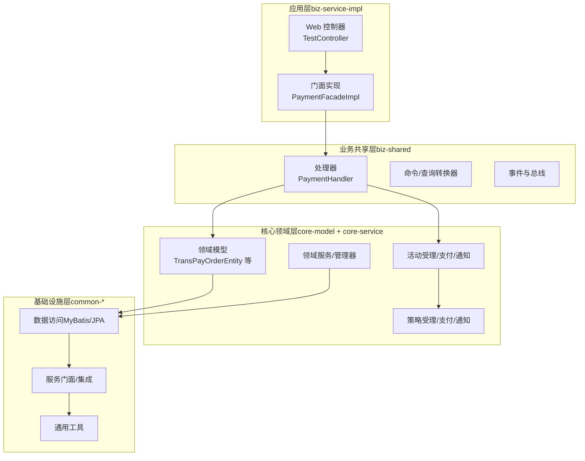
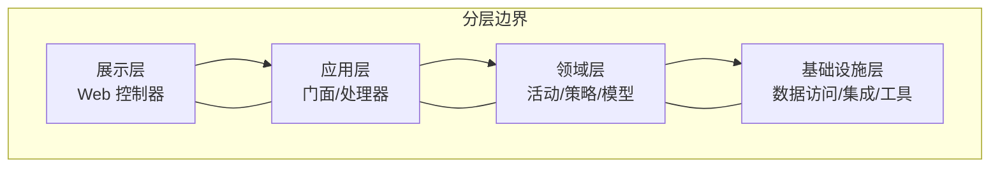
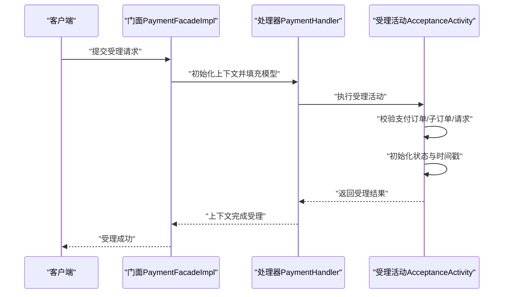
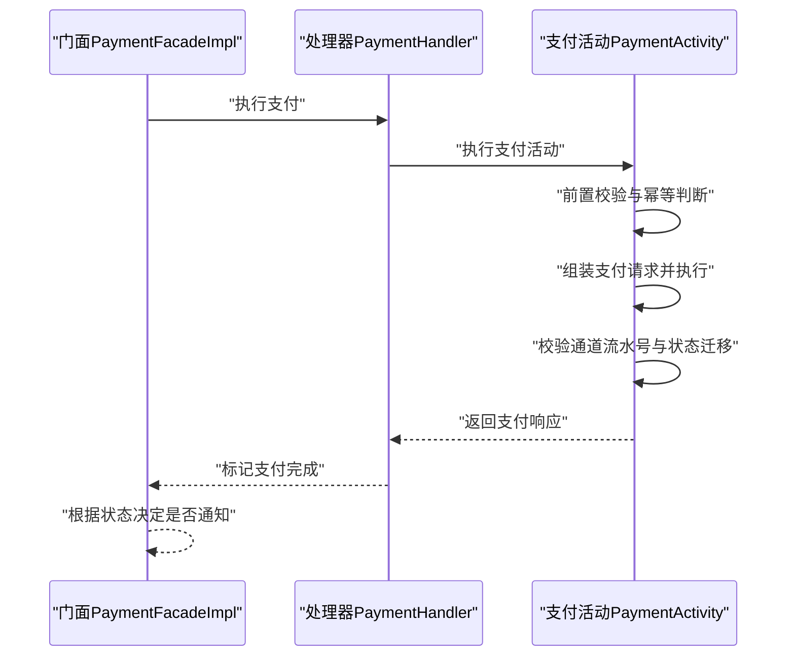
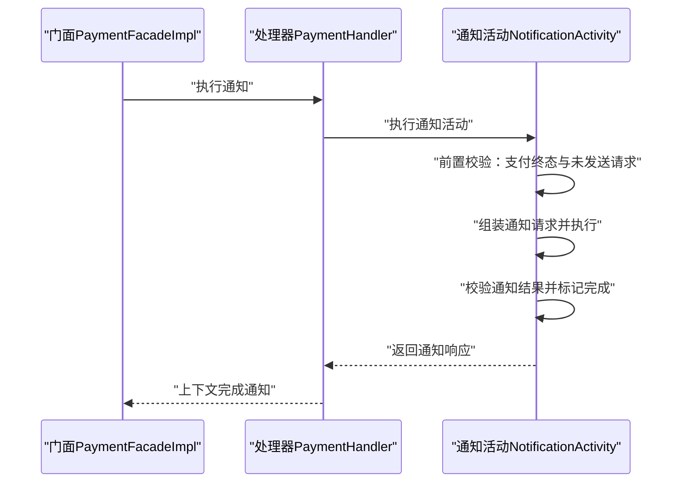
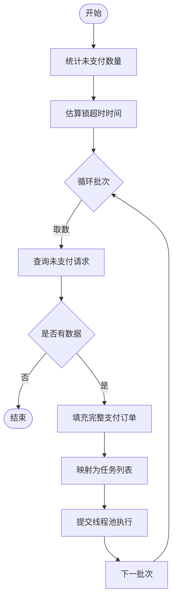
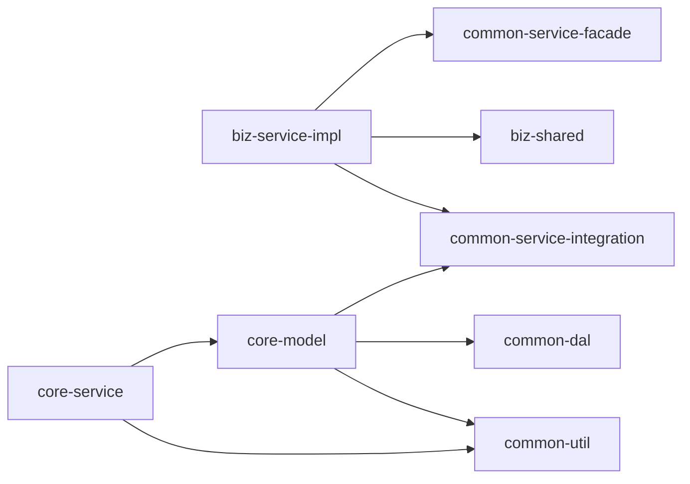

# 项目简介

<cite>
**本文档引用的文件**
- [README.md](file://README.md)
- [DomainDrivenTransactionSysApplication.java](file://biz-service-impl/src/main/java/com/magicliang/transaction/sys/DomainDrivenTransactionSysApplication.java)
- [build.gradle](file://build.gradle)
- [settings.gradle](file://settings.gradle)
- [gradle.properties](file://gradle.properties)
- [application.yml](file://biz-service-impl/src/main/resources/application.yml)
- [TransPayOrderEntity.java](file://core-model/src/main/java/com/magicliang/transaction/sys/core/model/entity/TransPayOrderEntity.java)
- [PaymentActivity.java](file://core-service/src/main/java/com/magicliang/transaction/sys/core/domain/activity/payment/PaymentActivity.java)
- [AcceptanceActivity.java](file://core-service/src/main/java/com/magicliang/transaction/sys/core/domain/activity/acceptance/AcceptanceActivity.java)
- [NotificationActivity.java](file://core-service/src/main/java/com/magicliang/transaction/sys/core/domain/activity/notification/NotificationActivity.java)
- [PaymentHandler.java](file://biz-shared/src/main/java/com/magicliang/transaction/sys/biz/shared/handler/PaymentHandler.java)
- [PaymentFacadeImpl.java](file://biz-service-impl/src/main/java/com/magicliang/transaction/sys/biz/service/impl/facade/impl/PaymentFacadeImpl.java)
- [TestController.java](file://biz-service-impl/src/main/java/com/magicliang/transaction/sys/biz/service/impl/web/controller/TestController.java)
</cite>

## 目录
1. [引言](#引言)
2. [项目结构](#项目结构)
3. [核心组件](#核心组件)
4. [架构总览](#架构总览)
5. [详细组件分析](#详细组件分析)
6. [依赖分析](#依赖分析)
7. [性能考量](#性能考量)
8. [故障排查指南](#故障排查指南)
9. [结论](#结论)
10. [附录](#附录)

## 引言
本项目是一个基于领域驱动设计（DDD）原则构建的交易系统示例工程，旨在演示如何在 Java 8 + Spring Boot 2.7.18 环境下实现企业级交易系统架构。项目采用 Gradle 多模块与 SOFA 分层架构设计，围绕“受理—支付—通知”主业务链路，提供清晰的领域模型、可扩展的策略体系与稳定可靠的基础设施。

项目的核心价值主张：
- 以 DDD 为核心指导，将复杂业务收敛到领域模型与活动（Activity）中，提升可维护性与演进能力
- 通过 SOFA 分层实现职责清晰、边界明确的系统架构，便于横向扩展与团队协作
- 提供多数据库 Profile 与容器化部署方案，兼顾本地开发与生产环境一致性
- 以模块化组织代码，降低耦合并增强复用度

## 项目结构
项目采用 Gradle 多模块组织，模块划分遵循 SOFA 分层与职责边界：
- biz-service-impl：业务服务实现层，包含 Web 控制器与应用启动入口，是可启动模块
- biz-shared：业务共享层，提供处理器、命令/查询转换器、事件与总线等共享能力
- core-model：核心领域模型层，包含实体、值对象、聚合根、请求/响应与领域事件
- core-service：核心服务层，包含活动（受理/支付/通知）、策略、领域服务与管理器
- common-dal：数据访问层，集成 MyBatis/JPA，支持多数据源与 SQL 管理
- common-service-facade：服务门面层，定义对外暴露的服务接口
- common-service-integration：服务集成层，处理第三方系统对接
- common-util：通用工具库，提供枚举、常量、断言、工具类与异常体系

图表来源
- [settings.gradle:6-14](file://settings.gradle#L6-L14)
- [DomainDrivenTransactionSysApplication.java:52-62](file://biz-service-impl/src/main/java/com/magicliang/transaction/sys/DomainDrivenTransactionSysApplication.java#L52-L62)
- [build.gradle:164-284](file://build.gradle#L164-L284)

章节来源
- [settings.gradle:1-16](file://settings.gradle#L1-L16)
- [build.gradle:164-284](file://build.gradle#L164-L284)
- [README.md:23-47](file://README.md#L23-L47)

## 核心组件
- 应用启动与配置
  - 应用入口类负责启动 Spring Boot 并注册启动期初始化任务，结合 XML 配置与属性源加载，确保数据源与 Bean 生命周期可控
  - 通过 Profile 机制切换数据库配置，支持 Testcontainers、嵌入式 MariaDB 与外部 MySQL/生产环境
- 领域模型
  - 支付订单实体作为聚合根，承载状态、时间戳、扩展信息与关联的子订单、请求等聚合内对象
  - 通过状态迁移与版本控制保障并发安全与幂等性
- 活动与策略
  - 受理活动：完成支付订单与请求的初始化校验与状态迁移
  - 支付活动：根据策略执行支付，更新支付订单与请求状态，并影响通知活动的执行时机
  - 通知活动：在支付终态后异步通知上游，支持 RPC 等策略
- 业务处理器与门面
  - 业务处理器负责上下文初始化、幂等校验与模型填充，串联领域活动
  - 门面实现提供批量支付、异步支付与通知编排，配合分布式锁与线程池实现高吞吐

章节来源
- [DomainDrivenTransactionSysApplication.java:62-150](file://biz-service-impl/src/main/java/com/magicliang/transaction/sys/DomainDrivenTransactionSysApplication.java#L62-L150)
- [application.yml:1-216](file://biz-service-impl/src/main/resources/application.yml#L1-L216)
- [TransPayOrderEntity.java:1-216](file://core-model/src/main/java/com/magicliang/transaction/sys/core/model/entity/TransPayOrderEntity.java#L1-L216)
- [AcceptanceActivity.java:1-198](file://core-service/src/main/java/com/magicliang/transaction/sys/core/domain/activity/acceptance/AcceptanceActivity.java#L1-L198)
- [PaymentActivity.java:1-202](file://core-service/src/main/java/com/magicliang/transaction/sys/core/domain/activity/payment/PaymentActivity.java#L1-L202)
- [NotificationActivity.java:1-183](file://core-service/src/main/java/com/magicliang/transaction/sys/core/domain/activity/notification/NotificationActivity.java#L1-L183)
- [PaymentHandler.java:1-139](file://biz-shared/src/main/java/com/magicliang/transaction/sys/biz/shared/handler/PaymentHandler.java#L1-L139)
- [PaymentFacadeImpl.java:1-166](file://biz-service-impl/src/main/java/com/magicliang/transaction/sys/biz/service/impl/facade/impl/PaymentFacadeImpl.java#L1-L166)

## 架构总览
项目遵循 SOFA 分层架构，强调“展示层-应用层-领域层-基础层”的职责分离与依赖方向：
- 展示层：Web 控制器负责请求接入、参数封装与响应输出
- 应用层：门面与处理器编排业务流程，协调事务与幂等
- 领域层：活动与策略承载核心业务规则，聚合根与实体维护状态与不变量
- 基础设施层：数据访问、第三方集成与通用工具提供技术支撑

图表来源
- [README.md:547-560](file://README.md#L547-L560)
- [TestController.java:48-50](file://biz-service-impl/src/main/java/com/magicliang/transaction/sys/biz/service/impl/web/controller/TestController.java#L48-L50)
- [PaymentFacadeImpl.java:32-52](file://biz-service-impl/src/main/java/com/magicliang/transaction/sys/biz/service/impl/facade/impl/PaymentFacadeImpl.java#L32-L52)
- [PaymentHandler.java:26-40](file://biz-shared/src/main/java/com/magicliang/transaction/sys/biz/shared/handler/PaymentHandler.java#L26-L40)
- [AcceptanceActivity.java:41-44](file://core-service/src/main/java/com/magicliang/transaction/sys/core/domain/activity/acceptance/AcceptanceActivity.java#L41-L44)
- [PaymentActivity.java:36-39](file://core-service/src/main/java/com/magicliang/transaction/sys/core/domain/activity/payment/PaymentActivity.java#L36-L39)
- [NotificationActivity.java:39-42](file://core-service/src/main/java/com/magicliang/transaction/sys/core/domain/activity/notification/NotificationActivity.java#L39-L42)

## 详细组件分析

### 支付受理流程（受理活动）
受理活动负责在支付受理阶段完成模型校验与状态初始化，确保后续支付与通知活动的前置条件满足。

图表来源
- [PaymentFacadeImpl.java:115-118](file://biz-service-impl/src/main/java/com/magicliang/transaction/sys/biz/service/impl/facade/impl/PaymentFacadeImpl.java#L115-L118)
- [PaymentHandler.java:64-70](file://biz-shared/src/main/java/com/magicliang/transaction/sys/biz/shared/handler/PaymentHandler.java#L64-L70)
- [AcceptanceActivity.java:56-92](file://core-service/src/main/java/com/magicliang/transaction/sys/core/domain/activity/acceptance/AcceptanceActivity.java#L56-L92)

章节来源
- [AcceptanceActivity.java:56-92](file://core-service/src/main/java/com/magicliang/transaction/sys/core/domain/activity/acceptance/AcceptanceActivity.java#L56-L92)
- [TransPayOrderEntity.java:196-204](file://core-model/src/main/java/com/magicliang/transaction/sys/core/model/entity/TransPayOrderEntity.java#L196-L204)

### 支付执行流程（支付活动）
支付活动根据策略执行支付，更新支付订单与请求状态，并决定是否继续通知活动。

图表来源
- [PaymentHandler.java:64-70](file://biz-shared/src/main/java/com/magicliang/transaction/sys/biz/shared/handler/PaymentHandler.java#L64-L70)
- [PaymentActivity.java:52-87](file://core-service/src/main/java/com/magicliang/transaction/sys/core/domain/activity/payment/PaymentActivity.java#L52-L87)
- [PaymentActivity.java:150-169](file://core-service/src/main/java/com/magicliang/transaction/sys/core/domain/activity/payment/PaymentActivity.java#L150-L169)

章节来源
- [PaymentActivity.java:52-87](file://core-service/src/main/java/com/magicliang/transaction/sys/core/domain/activity/payment/PaymentActivity.java#L52-L87)
- [PaymentActivity.java:150-169](file://core-service/src/main/java/com/magicliang/transaction/sys/core/domain/activity/payment/PaymentActivity.java#L150-L169)

### 通知处理流程（通知活动）
通知活动在支付终态后异步通知上游，支持 RPC 等策略，并对未发送的通知请求进行状态更新与重试计数。

图表来源
- [PaymentHandler.java:64-70](file://biz-shared/src/main/java/com/magicliang/transaction/sys/biz/shared/handler/PaymentHandler.java#L64-L70)
- [NotificationActivity.java:55-88](file://core-service/src/main/java/com/magicliang/transaction/sys/core/domain/activity/notification/NotificationActivity.java#L55-L88)
- [NotificationActivity.java:171-181](file://core-service/src/main/java/com/magicliang/transaction/sys/core/domain/activity/notification/NotificationActivity.java#L171-L181)

章节来源
- [NotificationActivity.java:55-88](file://core-service/src/main/java/com/magicliang/transaction/sys/core/domain/activity/notification/NotificationActivity.java#L55-L88)
- [NotificationActivity.java:171-181](file://core-service/src/main/java/com/magicliang/transaction/sys/core/domain/activity/notification/NotificationActivity.java#L171-L181)

### 批量支付与异步编排
门面实现提供批量支付与异步支付能力，结合分布式锁与线程池，实现高吞吐与可伸缩的支付编排。

图表来源
- [PaymentFacadeImpl.java:66-93](file://biz-service-impl/src/main/java/com/magicliang/transaction/sys/biz/service/impl/facade/impl/PaymentFacadeImpl.java#L66-L93)
- [PaymentFacadeImpl.java:100-107](file://biz-service-impl/src/main/java/com/magicliang/transaction/sys/biz/service/impl/facade/impl/PaymentFacadeImpl.java#L100-L107)
- [PaymentFacadeImpl.java:155-163](file://biz-service-impl/src/main/java/com/magicliang/transaction/sys/biz/service/impl/facade/impl/PaymentFacadeImpl.java#L155-L163)

章节来源
- [PaymentFacadeImpl.java:66-93](file://biz-service-impl/src/main/java/com/magicliang/transaction/sys/biz/service/impl/facade/impl/PaymentFacadeImpl.java#L66-L93)
- [PaymentFacadeImpl.java:100-107](file://biz-service-impl/src/main/java/com/magicliang/transaction/sys/biz/service/impl/facade/impl/PaymentFacadeImpl.java#L100-L107)
- [PaymentFacadeImpl.java:155-163](file://biz-service-impl/src/main/java/com/magicliang/transaction/sys/biz/service/impl/facade/impl/PaymentFacadeImpl.java#L155-L163)

## 依赖分析
- 模块依赖
  - biz-service-impl 依赖 biz-shared 与服务门面/集成模块，承担应用启动与 Web 接入
  - core-model 依赖 common-util、common-service-integration 与 common-dal，承载领域模型与数据访问
  - core-service 依赖 core-model 与 common-util，提供活动、策略与领域服务
- 技术依赖
  - Spring Boot 2.7.18 + Spring Cloud 2021.0.8，统一版本管理与依赖约束
  - MyBatis 2.3.2 + Spring Data JPA，支持多数据源与 SQL 管理
  - Log4j2 + OpenTelemetry，提供日志与可观测性
  - Gradle 8.6 + Java 8 工具链，确保构建稳定性与兼容性

图表来源
- [settings.gradle:6-14](file://settings.gradle#L6-L14)
- [build.gradle:164-284](file://build.gradle#L164-L284)

章节来源
- [build.gradle:164-284](file://build.gradle#L164-L284)
- [gradle.properties:1-12](file://gradle.properties#L1-L12)

## 性能考量
- 线程池与吞吐
  - 门面实现内置线程池与任务映射，支持批量支付与异步通知，吞吐与延迟受数据库写入与通道调用影响
- 分布式锁与批处理
  - 批量支付通过分布式锁保护临界区，结合估算锁超时时间与分批取数，避免长时间持有锁
- 数据库与连接池
  - HikariCP 连接池参数可按环境调优；多数据源配置支持主从分离与读写分离
- 观测性与日志
  - OpenTelemetry 与 Log4j2 提供链路追踪与日志采集，建议按环境切换日志级别

章节来源
- [PaymentFacadeImpl.java:36-52](file://biz-service-impl/src/main/java/com/magicliang/transaction/sys/biz/service/impl/facade/impl/PaymentFacadeImpl.java#L36-L52)
- [application.yml:24-32](file://biz-service-impl/src/main/resources/application.yml#L24-L32)

## 故障排查指南
- 启动失败与数据源
  - 若自动配置数据源未生效，需排除自动配置或使用 XML/配置类显式声明数据源
  - Profile 切换后确认 JDBC URL、用户名与密码正确，必要时检查 K8s 环境变量覆盖
- 数据库 Profile 选择
  - 本地开发推荐 Testcontainers（local-tc-dev），或嵌入式 MariaDB（local-mariadb4j-dev），或外部 MySQL（local-mysql-dev）
  - 预发/生产环境通过 K8s ConfigMap/Secret 注入数据库连接
- 端口与服务发现
  - 应用默认端口为 8502；K8s 环境可通过 LoadBalancer 获取外部访问地址
- 日志与诊断
  - 线下环境可启用详细日志与 MyBatis SQL 输出；线上环境建议精简日志级别

章节来源
- [DomainDrivenTransactionSysApplication.java:22-51](file://biz-service-impl/src/main/java/com/magicliang/transaction/sys/DomainDrivenTransactionSysApplication.java#L22-L51)
- [application.yml:1-216](file://biz-service-impl/src/main/resources/application.yml#L1-L216)
- [README.md:84-130](file://README.md#L84-L130)
- [README.md:216-333](file://README.md#L216-L333)

## 结论
本项目以 DDD 为核心，结合 SOFA 分层与多模块架构，构建了具备清晰边界与可扩展性的交易系统示例。通过受理—支付—通知的主业务链路，演示了领域模型、活动与策略的协同工作方式；借助门面与处理器实现应用层编排，配合分布式锁与线程池实现高吞吐与稳定性。同时，完善的 Profile 与容器化部署方案，使得开发与生产环境保持一致，便于快速落地与持续演进。

## 附录
- 快速开始
  - 构建：./gradlew clean build -x test
  - 运行测试：./gradlew test
  - 启动应用：./gradlew bootRun
- 数据库 Profile
  - local-tc-dev（推荐）：Testcontainers 自动管理 MariaDB
  - local-mariadb4j-dev：嵌入式 MariaDB（x86 架构）
  - local-mysql-dev：本地 MySQL
  - staging/prod：K8s 环境，由 ConfigMap/Secret 注入配置
- Docker/K8s 部署
  - 两阶段 Dockerfile，支持 Podman/minikube
  - dev/staging/prod 三套环境，独立命名空间与 PVC

章节来源
- [README.md:48-83](file://README.md#L48-L83)
- [README.md:130-333](file://README.md#L130-L333)
- [README.md:547-576](file://README.md#L547-L576)