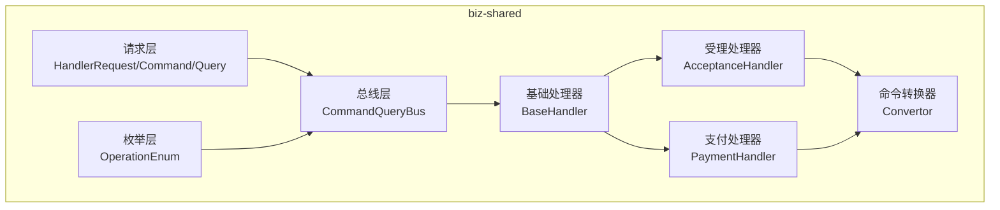
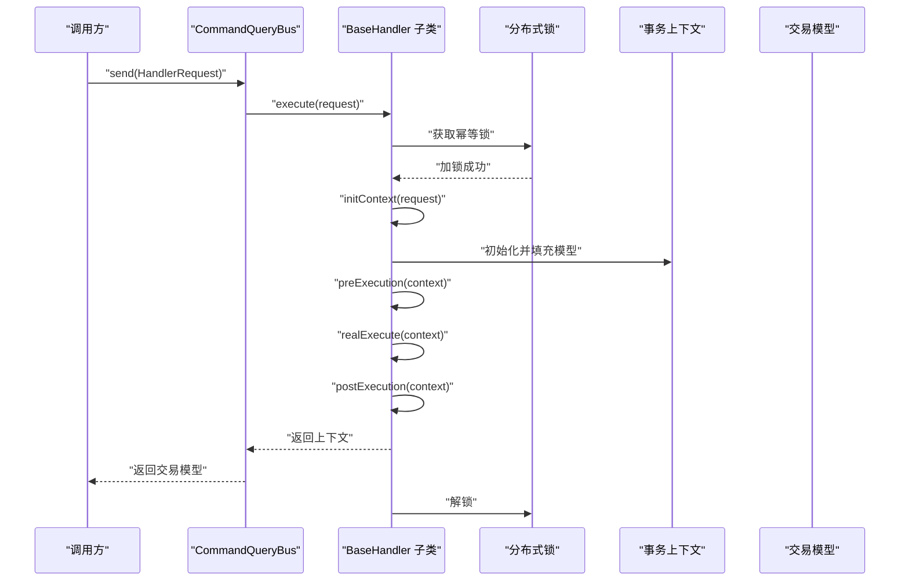
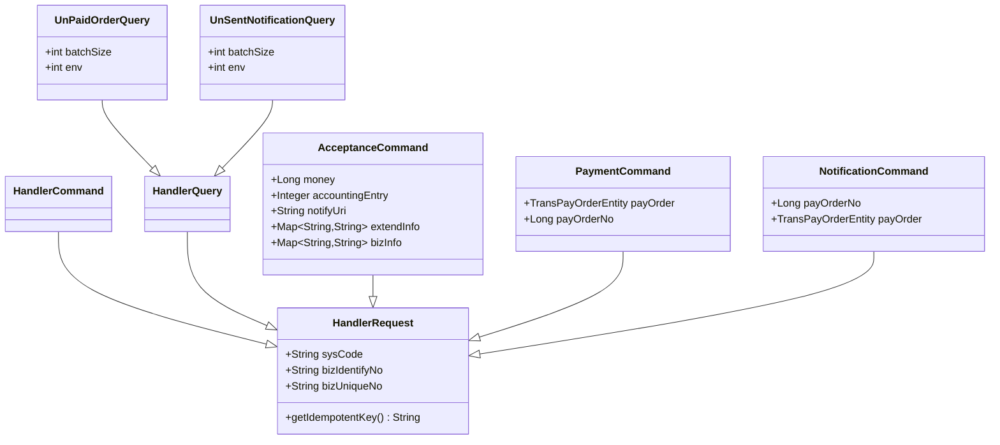
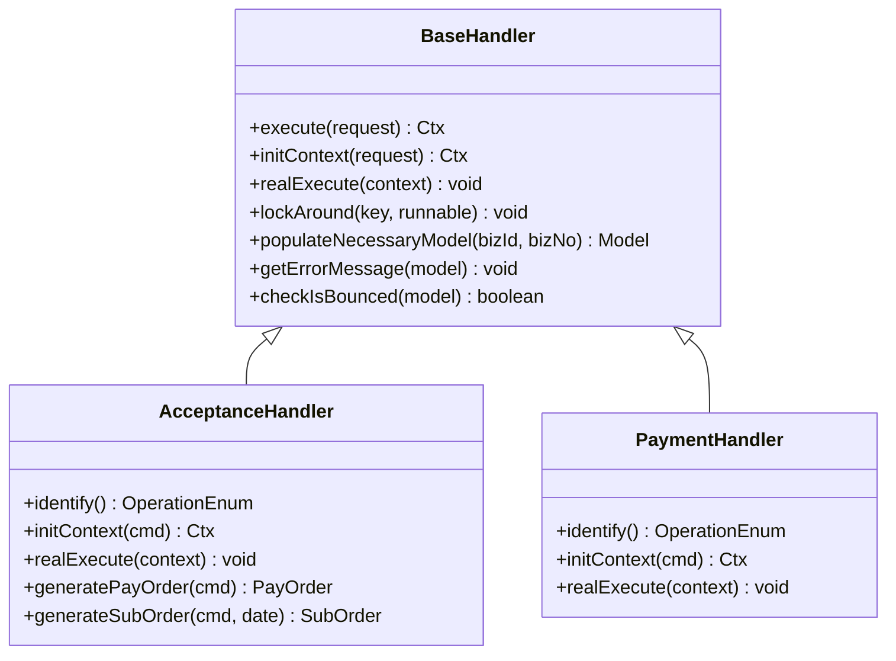
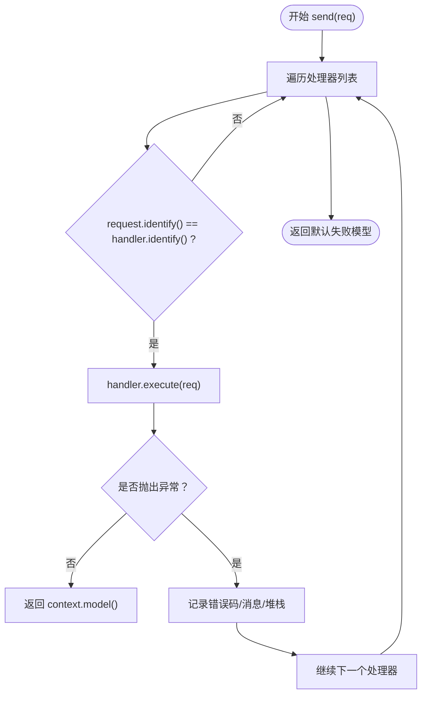
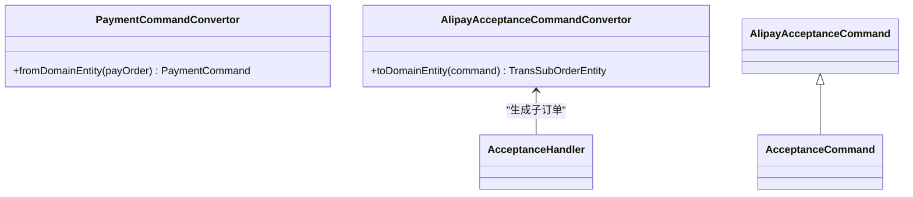
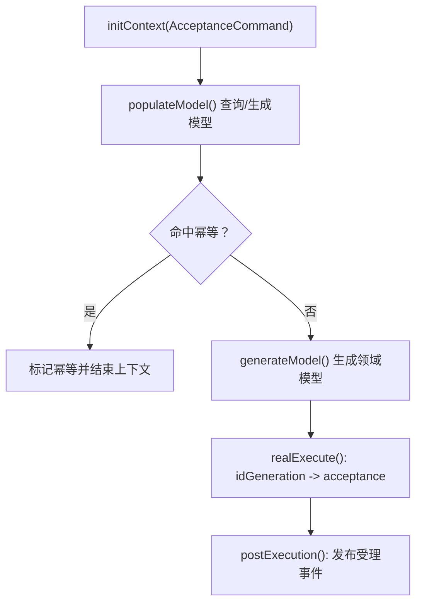
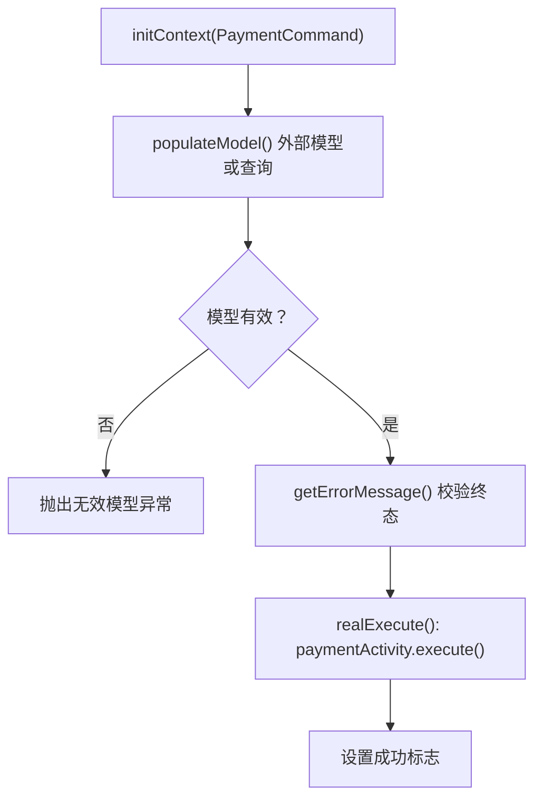
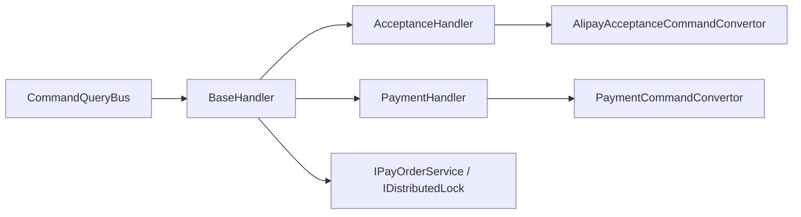

# 业务共享层

<cite>
**本文引用的文件**
- [HandlerRequest.java](file://biz-shared/src/main/java/com/magicliang/transaction/sys/biz/shared/request/HandlerRequest.java)
- [HandlerCommand.java](file://biz-shared/src/main/java/com/magicliang/transaction/sys/biz/shared/request/HandlerCommand.java)
- [HandlerQuery.java](file://biz-shared/src/main/java/com/magicliang/transaction/sys/biz/shared/request/HandlerQuery.java)
- [OperationEnum.java](file://biz-shared/src/main/java/com/magicliang/transaction/sys/biz/shared/enums/OperationEnum.java)
- [BaseHandler.java](file://biz-shared/src/main/java/com/magicliang/transaction/sys/biz/shared/handler/BaseHandler.java)
- [CommandQueryBus.java](file://biz-shared/src/main/java/com/magicliang/transaction/sys/biz/shared/locator/CommandQueryBus.java)
- [AcceptanceHandler.java](file://biz-shared/src/main/java/com/magicliang/transaction/sys/biz/shared/handler/AcceptanceHandler.java)
- [PaymentHandler.java](file://biz-shared/src/main/java/com/magicliang/transaction/sys/biz/shared/handler/PaymentHandler.java)
- [AcceptanceCommand.java](file://biz-shared/src/main/java/com/magicliang/transaction/sys/biz/shared/request/acceptance/AcceptanceCommand.java)
- [AlipayAcceptanceCommand.java](file://biz-shared/src/main/java/com/magicliang/transaction/sys/biz/shared/request/acceptance/AlipayAcceptanceCommand.java)
- [AlipayAcceptanceCommandConvertor.java](file://biz-shared/src/main/java/com/magicliang/transaction/sys/biz/shared/request/acceptance/convertor/AlipayAcceptanceCommandConvertor.java)
- [PaymentCommand.java](file://biz-shared/src/main/java/com/magicliang/transaction/sys/biz/shared/request/payment/PaymentCommand.java)
- [PaymentCommandConvertor.java](file://biz-shared/src/main/java/com/magicliang/transaction/sys/biz/shared/request/payment/convertor/PaymentCommandConvertor.java)
- [NotificationCommand.java](file://biz-shared/src/main/java/com/magicliang/transaction/sys/biz/shared/request/notification/NotificationCommand.java)
- [NotificationCommandConvertor.java](file://biz-shared/src/main/java/com/magicliang/transaction/sys/biz/shared/request/notification/convertor/NotificationCommandConvertor.java)
- [UnPaidOrderQuery.java](file://biz-shared/src/main/java/com/magicliang/transaction/sys/biz/shared/request/payment/UnPaidOrderQuery.java)
- [UnSentNotificationQuery.java](file://biz-shared/src/main/java/com/magicliang/transaction/sys/biz/shared/request/notification/UnSentNotificationQuery.java)
</cite>

## 目录
1. [引言](#引言)
2. [项目结构](#项目结构)
3. [核心组件](#核心组件)
4. [架构总览](#架构总览)
5. [详细组件分析](#详细组件分析)
6. [依赖分析](#依赖分析)
7. [性能考虑](#性能考虑)
8. [故障排查指南](#故障排查指南)
9. [结论](#结论)
10. [附录](#附录)

## 引言
本文件面向“业务共享层”（biz-shared），系统化阐述该模块作为业务逻辑共享组件的设计理念与实现方式。重点覆盖以下主题：
- 请求/响应模型：HandlerRequest、HandlerCommand、HandlerQuery 的职责与关系
- 处理器模式：BaseHandler 抽象与具体处理器（PaymentHandler、AcceptanceHandler 等）的实现
- 命令对象与转换器：PaymentCommand、AcceptanceCommand、NotificationCommand 及其转换器
- 总线分发：CommandQueryBus 如何根据 OperationEnum 将请求路由到对应处理器
- 幂等与一致性：分布式锁、上下文与模型的幂等校验策略
- 复用与标准化：通过统一接口与约定实现跨模块的业务逻辑复用

## 项目结构
biz-shared 模块采用“请求-处理器-总线”的分层组织方式，核心目录如下：
- request：定义统一的请求基类与各业务命令/查询对象
- handler：定义基础处理器与具体业务处理器
- locator：请求分发总线，负责根据操作类型选择处理器
- enums：操作类型枚举，用于识别请求/处理器
- event：应用事件发布（可扩展）

图表来源
- [CommandQueryBus.java:1-79](file://biz-shared/src/main/java/com/magicliang/transaction/sys/biz/shared/locator/CommandQueryBus.java#L1-L79)
- [BaseHandler.java:1-244](file://biz-shared/src/main/java/com/magicliang/transaction/sys/biz/shared/handler/BaseHandler.java#L1-L244)
- [AcceptanceHandler.java:1-231](file://biz-shared/src/main/java/com/magicliang/transaction/sys/biz/shared/handler/AcceptanceHandler.java#L1-L231)
- [PaymentHandler.java:1-139](file://biz-shared/src/main/java/com/magicliang/transaction/sys/biz/shared/handler/PaymentHandler.java#L1-L139)
- [OperationEnum.java:1-97](file://biz-shared/src/main/java/com/magicliang/transaction/sys/biz/shared/enums/OperationEnum.java#L1-L97)

章节来源
- [HandlerRequest.java:1-46](file://biz-shared/src/main/java/com/magicliang/transaction/sys/biz/shared/request/HandlerRequest.java#L1-L46)
- [HandlerCommand.java:1-15](file://biz-shared/src/main/java/com/magicliang/transaction/sys/biz/shared/request/HandlerCommand.java#L1-L15)
- [HandlerQuery.java:1-14](file://biz-shared/src/main/java/com/magicliang/transaction/sys/biz/shared/request/HandlerQuery.java#L1-L14)
- [OperationEnum.java:1-97](file://biz-shared/src/main/java/com/magicliang/transaction/sys/biz/shared/enums/OperationEnum.java#L1-L97)
- [CommandQueryBus.java:1-79](file://biz-shared/src/main/java/com/magicliang/transaction/sys/biz/shared/locator/CommandQueryBus.java#L1-L79)
- [BaseHandler.java:1-244](file://biz-shared/src/main/java/com/magicliang/transaction/sys/biz/shared/handler/BaseHandler.java#L1-L244)
- [AcceptanceHandler.java:1-231](file://biz-shared/src/main/java/com/magicliang/transaction/sys/biz/shared/handler/AcceptanceHandler.java#L1-L231)
- [PaymentHandler.java:1-139](file://biz-shared/src/main/java/com/magicliang/transaction/sys/biz/shared/handler/PaymentHandler.java#L1-L139)

## 核心组件
本节聚焦于请求模型、处理器基类与总线分发机制。

- 请求模型
  - HandlerRequest：统一的业务请求基类，包含系统来源、业务标识与幂等键生成逻辑
  - HandlerCommand：写入型请求（命令），继承自 HandlerRequest
  - HandlerQuery：查询型请求，继承自 HandlerRequest
- 处理器基类 BaseHandler
  - 统一的执行流程：加锁 -> 初始化上下文 -> 前置 -> 真执行 -> 后置 -> 返回上下文
  - 提供幂等键、分布式锁封装、错误码映射与终态校验
- 总线 CommandQueryBus
  - 通过扫描注入的处理器列表，按 OperationEnum 进行匹配分发
  - 统一异常捕获与日志记录，返回标准化的交易模型

章节来源
- [HandlerRequest.java:17-46](file://biz-shared/src/main/java/com/magicliang/transaction/sys/biz/shared/request/HandlerRequest.java#L17-L46)
- [HandlerCommand.java:12-14](file://biz-shared/src/main/java/com/magicliang/transaction/sys/biz/shared/request/HandlerCommand.java#L12-L14)
- [HandlerQuery.java:12-13](file://biz-shared/src/main/java/com/magicliang/transaction/sys/biz/shared/request/HandlerQuery.java#L12-L13)
- [BaseHandler.java:93-121](file://biz-shared/src/main/java/com/magicliang/transaction/sys/biz/shared/handler/BaseHandler.java#L93-L121)
- [BaseHandler.java:174-179](file://biz-shared/src/main/java/com/magicliang/transaction/sys/biz/shared/handler/BaseHandler.java#L174-L179)
- [BaseHandler.java:198-213](file://biz-shared/src/main/java/com/magicliang/transaction/sys/biz/shared/handler/BaseHandler.java#L198-L213)
- [CommandQueryBus.java:42-77](file://biz-shared/src/main/java/com/magicliang/transaction/sys/biz/shared/locator/CommandQueryBus.java#L42-L77)

## 架构总览
下面以序列图展示一次请求从发送到处理器执行的关键流程。

图表来源
- [CommandQueryBus.java:42-77](file://biz-shared/src/main/java/com/magicliang/transaction/sys/biz/shared/locator/CommandQueryBus.java#L42-L77)
- [BaseHandler.java:93-121](file://biz-shared/src/main/java/com/magicliang/transaction/sys/biz/shared/handler/BaseHandler.java#L93-L121)

## 详细组件分析

### 请求模型与命令对象
- HandlerRequest
  - 统一字段：sysCode、bizIdentifyNo、bizUniqueNo
  - 幂等键：getIdempotentKey() 由 bizIdentifyNo 与 bizUniqueNo 组合
- HandlerCommand/HandlerQuery
  - 命令用于写入或变更状态；查询用于只读检索
- 典型命令对象
  - AcceptanceCommand：受理命令，包含金额、会计分录、回调地址、扩展信息等
  - PaymentCommand：支付命令，支持外部传入完整支付订单或仅传订单号
  - NotificationCommand：通知命令，支持外部传入支付订单或订单号
- 典型查询对象
  - UnPaidOrderQuery：未支付订单查询，含批次大小与环境
  - UnSentNotificationQuery：未发送通知查询，含批次大小与环境

图表来源
- [HandlerRequest.java:18-46](file://biz-shared/src/main/java/com/magicliang/transaction/sys/biz/shared/request/HandlerRequest.java#L18-L46)
- [HandlerCommand.java:12-14](file://biz-shared/src/main/java/com/magicliang/transaction/sys/biz/shared/request/HandlerCommand.java#L12-L14)
- [HandlerQuery.java:12-13](file://biz-shared/src/main/java/com/magicliang/transaction/sys/biz/shared/request/HandlerQuery.java#L12-L13)
- [AcceptanceCommand.java:21-74](file://biz-shared/src/main/java/com/magicliang/transaction/sys/biz/shared/request/acceptance/AcceptanceCommand.java#L21-L74)
- [PaymentCommand.java:20-44](file://biz-shared/src/main/java/com/magicliang/transaction/sys/biz/shared/request/payment/PaymentCommand.java#L20-L44)
- [NotificationCommand.java:20-43](file://biz-shared/src/main/java/com/magicliang/transaction/sys/biz/shared/request/notification/NotificationCommand.java#L20-L43)
- [UnPaidOrderQuery.java:19-40](file://biz-shared/src/main/java/com/magicliang/transaction/sys/biz/shared/request/payment/UnPaidOrderQuery.java#L19-L40)
- [UnSentNotificationQuery.java:19-40](file://biz-shared/src/main/java/com/magicliang/transaction/sys/biz/shared/request/notification/UnSentNotificationQuery.java#L19-L40)

章节来源
- [HandlerRequest.java:17-46](file://biz-shared/src/main/java/com/magicliang/transaction/sys/biz/shared/request/HandlerRequest.java#L17-L46)
- [AcceptanceCommand.java:21-74](file://biz-shared/src/main/java/com/magicliang/transaction/sys/biz/shared/request/acceptance/AcceptanceCommand.java#L21-L74)
- [PaymentCommand.java:20-44](file://biz-shared/src/main/java/com/magicliang/transaction/sys/biz/shared/request/payment/PaymentCommand.java#L20-L44)
- [NotificationCommand.java:20-43](file://biz-shared/src/main/java/com/magicliang/transaction/sys/biz/shared/request/notification/NotificationCommand.java#L20-L43)
- [UnPaidOrderQuery.java:19-40](file://biz-shared/src/main/java/com/magicliang/transaction/sys/biz/shared/request/payment/UnPaidOrderQuery.java#L19-L40)
- [UnSentNotificationQuery.java:19-40](file://biz-shared/src/main/java/com/magicliang/transaction/sys/biz/shared/request/notification/UnSentNotificationQuery.java#L19-L40)

### 处理器模式与基类设计
- BaseHandler
  - execute() 统一流程：加锁、initContext、preExecution、realExecute、postExecution、清理上下文
  - 幂等与终态校验：通过幂等键与支付订单状态判断，避免重复执行与错误终态
  - 锁封装：lockAround() 提供便捷的锁执行回调
- 具体处理器
  - AcceptanceHandler：受理流程，生成支付订单与子订单，发布领域事件
  - PaymentHandler：支付流程，直接调用支付活动，设置成功标志

图表来源
- [BaseHandler.java:38-121](file://biz-shared/src/main/java/com/magicliang/transaction/sys/biz/shared/handler/BaseHandler.java#L38-L121)
- [BaseHandler.java:174-232](file://biz-shared/src/main/java/com/magicliang/transaction/sys/biz/shared/handler/BaseHandler.java#L174-L232)
- [AcceptanceHandler.java:32-89](file://biz-shared/src/main/java/com/magicliang/transaction/sys/biz/shared/handler/AcceptanceHandler.java#L32-L89)
- [PaymentHandler.java:28-70](file://biz-shared/src/main/java/com/magicliang/transaction/sys/biz/shared/handler/PaymentHandler.java#L28-L70)

章节来源
- [BaseHandler.java:93-121](file://biz-shared/src/main/java/com/magicliang/transaction/sys/biz/shared/handler/BaseHandler.java#L93-L121)
- [BaseHandler.java:174-179](file://biz-shared/src/main/java/com/magicliang/transaction/sys/biz/shared/handler/BaseHandler.java#L174-L179)
- [BaseHandler.java:198-232](file://biz-shared/src/main/java/com/magicliang/transaction/sys/biz/shared/handler/BaseHandler.java#L198-L232)
- [AcceptanceHandler.java:43-89](file://biz-shared/src/main/java/com/magicliang/transaction/sys/biz/shared/handler/AcceptanceHandler.java#L43-L89)
- [PaymentHandler.java:36-70](file://biz-shared/src/main/java/com/magicliang/transaction/sys/biz/shared/handler/PaymentHandler.java#L36-L70)

### 总线分发与操作类型
- CommandQueryBus
  - 注入处理器列表，遍历匹配 request.identify() 与 handler.identify()
  - 捕获业务异常，填充交易模型错误码与消息
- OperationEnum
  - 定义受理、支付、通知、查询等操作类型，作为处理器与请求的契约标识

图表来源
- [CommandQueryBus.java:42-77](file://biz-shared/src/main/java/com/magicliang/transaction/sys/biz/shared/locator/CommandQueryBus.java#L42-L77)
- [OperationEnum.java:18-49](file://biz-shared/src/main/java/com/magicliang/transaction/sys/biz/shared/enums/OperationEnum.java#L18-L49)

章节来源
- [CommandQueryBus.java:42-77](file://biz-shared/src/main/java/com/magicliang/transaction/sys/biz/shared/locator/CommandQueryBus.java#L42-L77)
- [OperationEnum.java:18-49](file://biz-shared/src/main/java/com/magicliang/transaction/sys/biz/shared/enums/OperationEnum.java#L18-L49)

### 命令转换器与模型生成
- 支付命令转换器
  - PaymentCommandConvertor：提供从领域模型到支付命令的转换入口（当前实现占位）
- 受理命令转换器
  - AlipayAcceptanceCommandConvertor：将支付宝受理命令转换为领域子订单实体，支撑受理流程的子订单生成
- 支付宝受理命令
  - AlipayAcceptanceCommand：扩展受理命令，承载支付宝余额支付所需的子订单字段

图表来源
- [PaymentCommandConvertor.java:15-38](file://biz-shared/src/main/java/com/magicliang/transaction/sys/biz/shared/request/payment/convertor/PaymentCommandConvertor.java#L15-L38)
- [AlipayAcceptanceCommandConvertor.java:15-34](file://biz-shared/src/main/java/com/magicliang/transaction/sys/biz/shared/request/acceptance/convertor/AlipayAcceptanceCommandConvertor.java#L15-L34)
- [AlipayAcceptanceCommand.java](file://biz-shared/src/main/java/com/magicliang/transaction/sys/biz/shared/request/acceptance/AlipayAcceptanceCommand.java)
- [AcceptanceHandler.java:192-197](file://biz-shared/src/main/java/com/magicliang/transaction/sys/biz/shared/handler/AcceptanceHandler.java#L192-L197)

章节来源
- [PaymentCommandConvertor.java:15-38](file://biz-shared/src/main/java/com/magicliang/transaction/sys/biz/shared/request/payment/convertor/PaymentCommandConvertor.java#L15-L38)
- [AlipayAcceptanceCommandConvertor.java:15-34](file://biz-shared/src/main/java/com/magicliang/transaction/sys/biz/shared/request/acceptance/convertor/AlipayAcceptanceCommandConvertor.java#L15-L34)
- [AlipayAcceptanceCommand.java](file://biz-shared/src/main/java/com/magicliang/transaction/sys/biz/shared/request/acceptance/AlipayAcceptanceCommand.java)
- [AcceptanceHandler.java:192-197](file://biz-shared/src/main/java/com/magicliang/transaction/sys/biz/shared/handler/AcceptanceHandler.java#L192-L197)

### 具体处理器实现要点

#### 受理处理器（AcceptanceHandler）
- 幂等与模型填充：优先尝试从数据库填充完整/轻量模型，命中则直接标记幂等并结束上下文
- 领域模型生成：从受理命令生成支付订单与子订单，支持支付宝余额子订单转换
- 领域事件：在后置阶段发布受理完成事件

图表来源
- [AcceptanceHandler.java:106-128](file://biz-shared/src/main/java/com/magicliang/transaction/sys/biz/shared/handler/AcceptanceHandler.java#L106-L128)
- [AcceptanceHandler.java:136-141](file://biz-shared/src/main/java/com/magicliang/transaction/sys/biz/shared/handler/AcceptanceHandler.java#L136-L141)
- [AcceptanceHandler.java:192-197](file://biz-shared/src/main/java/com/magicliang/transaction/sys/biz/shared/handler/AcceptanceHandler.java#L192-L197)
- [AcceptanceHandler.java:218-228](file://biz-shared/src/main/java/com/magicliang/transaction/sys/biz/shared/handler/AcceptanceHandler.java#L218-L228)

章节来源
- [AcceptanceHandler.java:53-89](file://biz-shared/src/main/java/com/magicliang/transaction/sys/biz/shared/handler/AcceptanceHandler.java#L53-L89)
- [AcceptanceHandler.java:106-128](file://biz-shared/src/main/java/com/magicliang/transaction/sys/biz/shared/handler/AcceptanceHandler.java#L106-L128)
- [AcceptanceHandler.java:136-141](file://biz-shared/src/main/java/com/magicliang/transaction/sys/biz/shared/handler/AcceptanceHandler.java#L136-L141)
- [AcceptanceHandler.java:218-228](file://biz-shared/src/main/java/com/magicliang/transaction/sys/biz/shared/handler/AcceptanceHandler.java#L218-L228)

#### 支付处理器（PaymentHandler）
- 幂等与模型填充：支持外部传入完整支付订单或通过业务标识查询完整模型
- 终态校验：对失败、关闭、退票等终态进行错误码映射与消息填充
- 直接支付：调用支付活动，设置交易模型成功标志

图表来源
- [PaymentHandler.java:96-137](file://biz-shared/src/main/java/com/magicliang/transaction/sys/biz/shared/handler/PaymentHandler.java#L96-L137)
- [PaymentHandler.java:198-213](file://biz-shared/src/main/java/com/magicliang/transaction/sys/biz/shared/handler/BaseHandler.java#L198-L213)

章节来源
- [PaymentHandler.java:47-70](file://biz-shared/src/main/java/com/magicliang/transaction/sys/biz/shared/handler/PaymentHandler.java#L47-L70)
- [PaymentHandler.java:96-137](file://biz-shared/src/main/java/com/magicliang/transaction/sys/biz/shared/handler/PaymentHandler.java#L96-L137)
- [BaseHandler.java:198-213](file://biz-shared/src/main/java/com/magicliang/transaction/sys/biz/shared/handler/BaseHandler.java#L198-L213)

## 依赖分析
- 组件耦合
  - BaseHandler 依赖领域活动与服务（IDistributedLock、IPayOrderService、各 Activity）
  - 具体处理器依赖 BaseHandler 与领域模型生成逻辑
  - CommandQueryBus 通过 OperationEnum 与 HandlerRequest/HandlerCommand/HandlerQuery 契约解耦
- 外部依赖
  - Spring 容器注入处理器列表与领域服务
  - 日志与异常工具用于统一记录与错误传播

图表来源
- [CommandQueryBus.java:32-33](file://biz-shared/src/main/java/com/magicliang/transaction/sys/biz/shared/locator/CommandQueryBus.java#L32-L33)
- [BaseHandler.java:46-85](file://biz-shared/src/main/java/com/magicliang/transaction/sys/biz/shared/handler/BaseHandler.java#L46-L85)
- [AcceptanceHandler.java:36-36](file://biz-shared/src/main/java/com/magicliang/transaction/sys/biz/shared/handler/AcceptanceHandler.java#L36-L36)
- [AlipayAcceptanceCommandConvertor.java:15-34](file://biz-shared/src/main/java/com/magicliang/transaction/sys/biz/shared/request/acceptance/convertor/AlipayAcceptanceCommandConvertor.java#L15-L34)
- [PaymentCommandConvertor.java:15-38](file://biz-shared/src/main/java/com/magicliang/transaction/sys/biz/shared/request/payment/convertor/PaymentCommandConvertor.java#L15-L38)

章节来源
- [CommandQueryBus.java:32-33](file://biz-shared/src/main/java/com/magicliang/transaction/sys/biz/shared/locator/CommandQueryBus.java#L32-L33)
- [BaseHandler.java:46-85](file://biz-shared/src/main/java/com/magicliang/transaction/sys/biz/shared/handler/BaseHandler.java#L46-L85)

## 性能考虑
- 幂等与锁粒度
  - 使用幂等键进行分布式锁，避免重复执行带来的资源浪费
  - 建议合理设置锁过期时间，防止死锁与长时间阻塞
- 模型填充策略
  - 受理场景优先使用轻量模型，减少不必要的全量查询
  - 支付场景优先支持外部传入完整模型，缩短查询路径
- 总线分发
  - 处理器列表应保持稳定，避免频繁扫描与反射开销
  - 对异常进行快速失败与降级，避免阻塞后续请求

## 故障排查指南
- 常见错误与定位
  - 幂等键为空：触发无效幂等键异常，检查上游 sysCode、bizIdentifyNo、bizUniqueNo
  - 支付订单终态错误：失败、关闭、退票状态会映射为相应错误码与消息
  - 未知异常：CommandQueryBus 记录异常堆栈，便于定位具体处理器与请求参数
- 排查步骤
  - 核对 OperationEnum 与请求类型是否一致
  - 检查幂等键组合是否唯一且与上游一致
  - 关注处理器日志与交易模型中的错误码/消息

章节来源
- [BaseHandler.java:174-179](file://biz-shared/src/main/java/com/magicliang/transaction/sys/biz/shared/handler/BaseHandler.java#L174-L179)
- [BaseHandler.java:198-213](file://biz-shared/src/main/java/com/magicliang/transaction/sys/biz/shared/handler/BaseHandler.java#L198-L213)
- [CommandQueryBus.java:55-71](file://biz-shared/src/main/java/com/magicliang/transaction/sys/biz/shared/locator/CommandQueryBus.java#L55-L71)

## 结论
biz-shared 通过统一的请求模型、处理器基类与总线分发机制，实现了业务逻辑的标准化与复用。借助幂等键、分布式锁与终态校验，保障了跨模块调用的一致性与可靠性。命令转换器与领域模型生成逻辑进一步提升了扩展性与可维护性。建议在实际接入时严格遵循 OperationEnum 与请求契约，并结合日志与异常机制进行快速定位与修复。

## 附录
- 设计要点速览
  - 请求模型：HandlerRequest/HandlerCommand/HandlerQuery 三者分工明确
  - 处理器基类：统一生命周期与幂等控制
  - 总线分发：按 OperationEnum 匹配处理器
  - 转换器：命令到领域模型的桥梁
  - 幂等与终态：通过锁与状态校验保证一致性