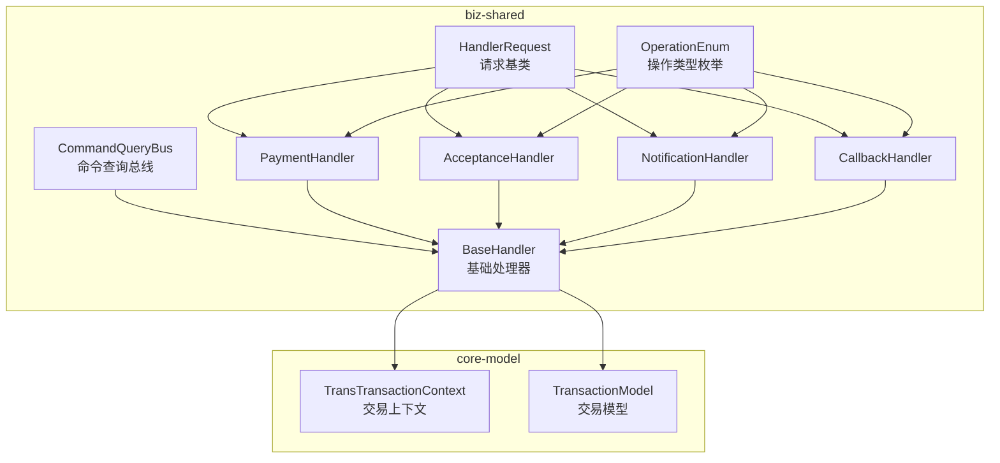
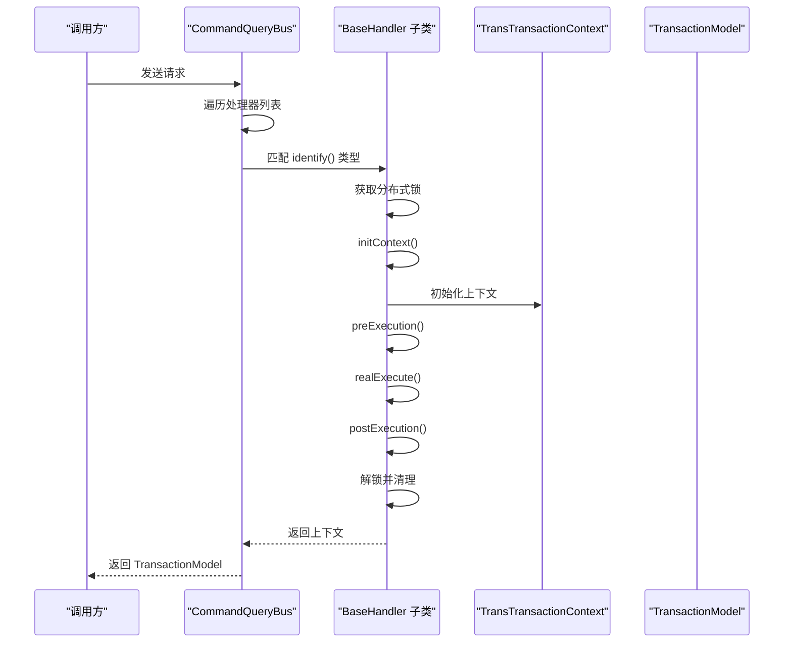
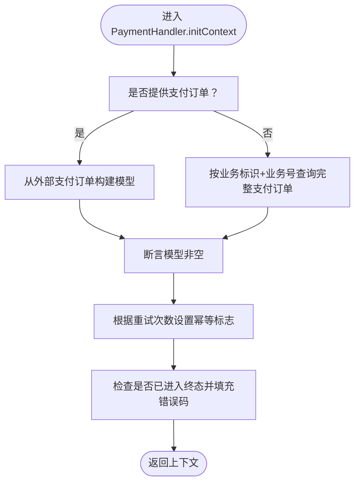
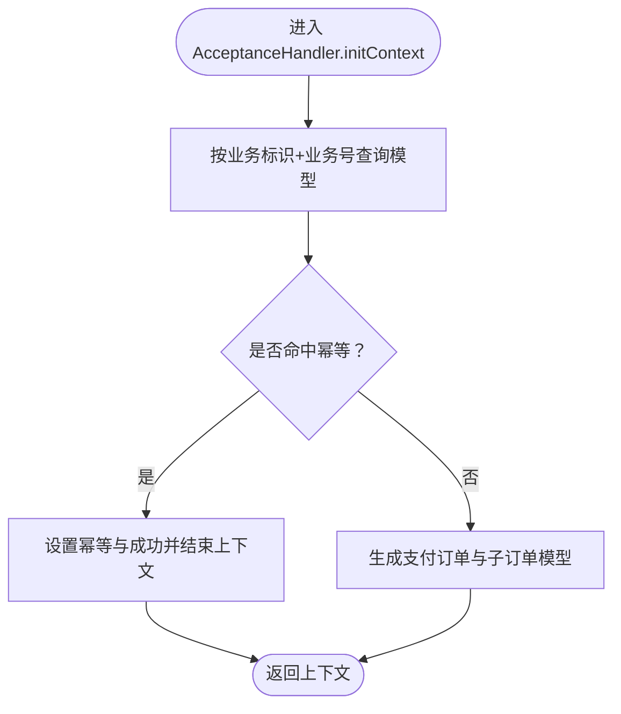
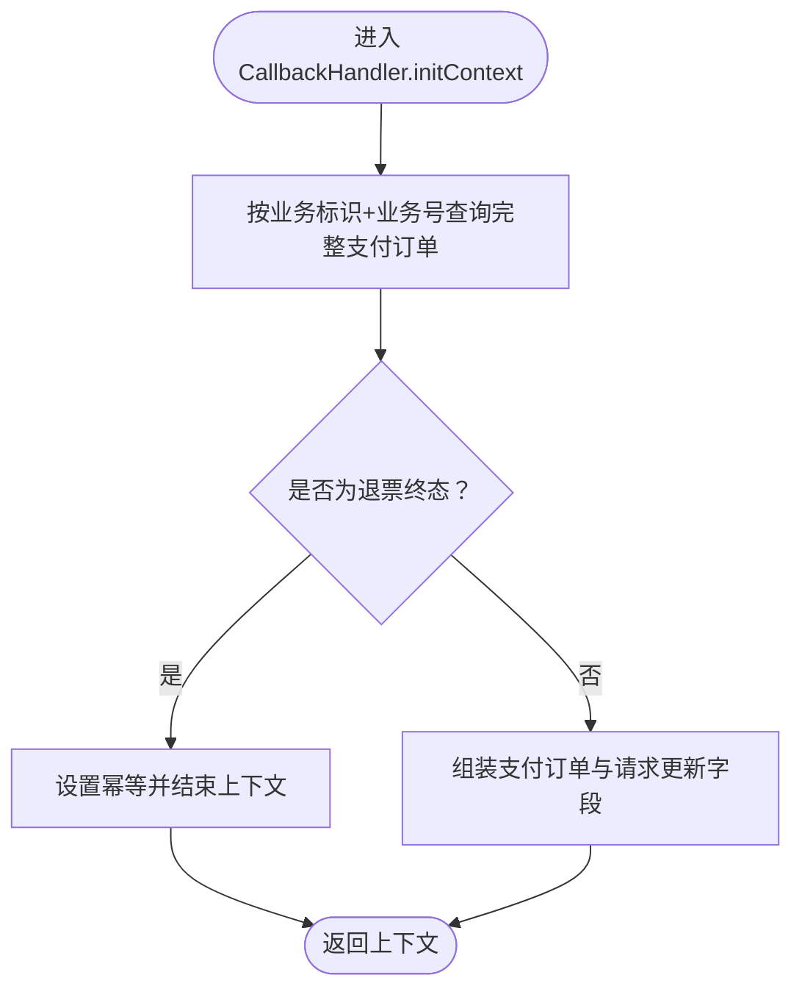
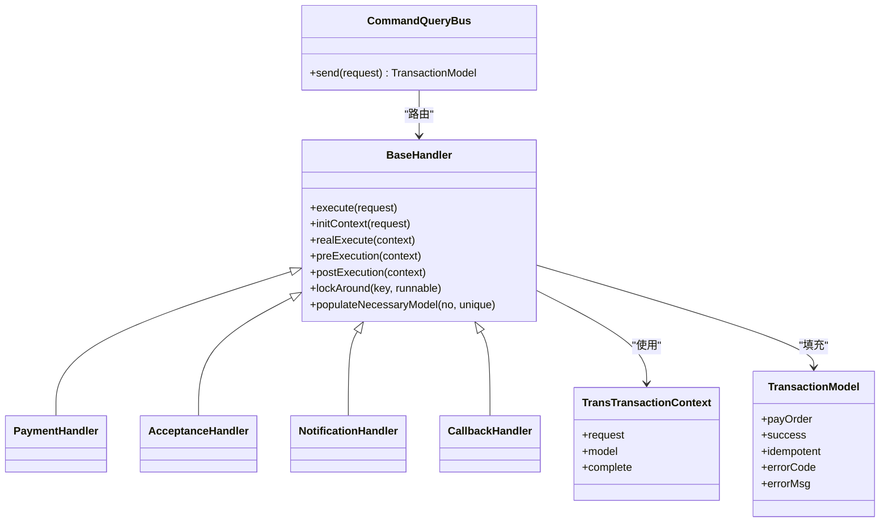

# 业务处理器

<cite>
**本文引用的文件**
- [BaseHandler.java](file://biz-shared/src/main/java/com/magicliang/transaction/sys/biz/shared/handler/BaseHandler.java)
- [PaymentHandler.java](file://biz-shared/src/main/java/com/magicliang/transaction/sys/biz/shared/handler/PaymentHandler.java)
- [AcceptanceHandler.java](file://biz-shared/src/main/java/com/magicliang/transaction/sys/biz/shared/handler/AcceptanceHandler.java)
- [NotificationHandler.java](file://biz-shared/src/main/java/com/magicliang/transaction/sys/biz/shared/handler/NotificationHandler.java)
- [CallbackHandler.java](file://biz-shared/src/main/java/com/magicliang/transaction/sys/biz/shared/handler/CallbackHandler.java)
- [CommandQueryBus.java](file://biz-shared/src/main/java/com/magicliang/transaction/sys/biz/shared/locator/CommandQueryBus.java)
- [HandlerRequest.java](file://biz-shared/src/main/java/com/magicliang/transaction/sys/biz/shared/request/HandlerRequest.java)
- [OperationEnum.java](file://biz-shared/src/main/java/com/magicliang/transaction/sys/biz/shared/enums/OperationEnum.java)
- [TransTransactionContext.java](file://core-model/src/main/java/com/magicliang/transaction/sys/core/model/context/TransTransactionContext.java)
- [TransactionModel.java](file://core-model/src/main/java/com/magicliang/transaction/sys/core/model/context/TransactionModel.java)
- [PaymentCommand.java](file://biz-shared/src/main/java/com/magicliang/transaction/sys/biz/shared/request/payment/PaymentCommand.java)
- [AcceptanceCommand.java](file://biz-shared/src/main/java/com/magicliang/transaction/sys/biz/shared/request/acceptance/AcceptanceCommand.java)
- [NotificationCommand.java](file://biz-shared/src/main/java/com/magicliang/transaction/sys/biz/shared/request/notification/NotificationCommand.java)
- [CallbackCommand.java](file://biz-shared/src/main/java/com/magicliang/transaction/sys/biz/shared/request/callback/CallbackCommand.java)
- [CommonConfig.java](file://core-service/src/main/java/com/magicliang/transaction/sys/core/config/CommonConfig.java)
</cite>

## 目录
1. [引言](#引言)
2. [项目结构](#项目结构)
3. [核心组件](#核心组件)
4. [架构总览](#架构总览)
5. [详细组件分析](#详细组件分析)
6. [依赖分析](#依赖分析)
7. [性能考量](#性能考量)
8. [故障排查指南](#故障排查指南)
9. [结论](#结论)
10. [附录](#附录)

## 引言
本文件围绕“业务处理器”主题，系统化阐述处理器模式的设计思想与实现原理，详解基类 BaseHandler 提供的通用能力与扩展点；并逐项解析 PaymentHandler、AcceptanceHandler、NotificationHandler、CallbackHandler 的职责边界与处理逻辑。文档还覆盖处理器生命周期、异常处理机制、事务管理策略、处理器注册与路由机制（通过 CommandQueryBus 动态分发），以及开发最佳实践与性能优化建议。

## 项目结构
业务处理器位于 biz-shared 模块的 handler 包中，配合 core-model 中的上下文与模型对象，形成“请求-上下文-处理器-领域活动”的清晰分层。CommandQueryBus 作为统一调度入口，负责根据请求类型识别处理器并执行。

图表来源
- [CommandQueryBus.java:27-79](file://biz-shared/src/main/java/com/magicliang/transaction/sys/biz/shared/locator/CommandQueryBus.java#L27-L79)
- [BaseHandler.java:38-121](file://biz-shared/src/main/java/com/magicliang/transaction/sys/biz/shared/handler/BaseHandler.java#L38-L121)
- [TransTransactionContext.java:27-139](file://core-model/src/main/java/com/magicliang/transaction/sys/core/model/context/TransTransactionContext.java#L27-L139)
- [TransactionModel.java:17-44](file://core-model/src/main/java/com/magicliang/transaction/sys/core/model/context/TransactionModel.java#L17-L44)

章节来源
- [CommandQueryBus.java:27-79](file://biz-shared/src/main/java/com/magicliang/transaction/sys/biz/shared/locator/CommandQueryBus.java#L27-L79)
- [HandlerRequest.java:18-46](file://biz-shared/src/main/java/com/magicliang/transaction/sys/biz/shared/request/HandlerRequest.java#L18-L46)
- [OperationEnum.java:18-97](file://biz-shared/src/main/java/com/magicliang/transaction/sys/biz/shared/enums/OperationEnum.java#L18-L97)

## 核心组件
- 基础处理器 BaseHandler：提供统一的执行骨架（加锁、上下文初始化、前置/真实执行/后置、解锁清理）、幂等与终态校验、分布式锁回调工具、上下文与模型填充等通用能力。
- 交易上下文 TransTransactionContext：承载请求、领域模型与各活动的请求/响应状态，保证单线程内的上下文唯一性。
- 交易模型 TransactionModel：封装支付订单实体与执行结果、幂等标记、错误信息等。
- 统一调度 CommandQueryBus：扫描并维护处理器列表，按请求类型识别处理器并执行，捕获异常并回填错误信息。
- 请求基类 HandlerRequest：统一幂等键生成（业务标识+业务号），并声明 identify() 以匹配处理器类型。

章节来源
- [BaseHandler.java:38-121](file://biz-shared/src/main/java/com/magicliang/transaction/sys/biz/shared/handler/BaseHandler.java#L38-L121)
- [TransTransactionContext.java:27-139](file://core-model/src/main/java/com/magicliang/transaction/sys/core/model/context/TransTransactionContext.java#L27-L139)
- [TransactionModel.java:17-44](file://core-model/src/main/java/com/magicliang/transaction/sys/core/model/context/TransactionModel.java#L17-L44)
- [CommandQueryBus.java:42-77](file://biz-shared/src/main/java/com/magicliang/transaction/sys/biz/shared/locator/CommandQueryBus.java#L42-L77)
- [HandlerRequest.java:42-44](file://biz-shared/src/main/java/com/magicliang/transaction/sys/biz/shared/request/HandlerRequest.java#L42-L44)

## 架构总览
处理器模式采用“请求-上下文-处理器-领域活动”的分层设计。CommandQueryBus 作为入口，依据 OperationEnum 将请求路由至对应处理器；处理器在分布式锁保护下执行，贯穿 preExecution、realExecute、postExecution 三个阶段；最终通过上下文返回统一的 TransactionModel。

图表来源
- [CommandQueryBus.java:42-77](file://biz-shared/src/main/java/com/magicliang/transaction/sys/biz/shared/locator/CommandQueryBus.java#L42-L77)
- [BaseHandler.java:93-121](file://biz-shared/src/main/java/com/magicliang/transaction/sys/biz/shared/handler/BaseHandler.java#L93-L121)
- [TransTransactionContext.java:27-139](file://core-model/src/main/java/com/magicliang/transaction/sys/core/model/context/TransTransactionContext.java#L27-L139)
- [TransactionModel.java:17-44](file://core-model/src/main/java/com/magicliang/transaction/sys/core/model/context/TransactionModel.java#L17-L44)

## 详细组件分析

### BaseHandler 基类
- 生命周期
  - execute(): 统一入口，加锁、initContext、preExecution、realExecute、postExecution、解锁与上下文清理。
  - initContext(): 抽象方法，由子类实现上下文初始化与幂等检查。
  - realExecute(): 抽象方法，由子类实现核心业务逻辑。
  - preExecution/postExecution: 可覆写，用于扩展前置/后置行为。
- 幂等与终态校验
  - populateNecessaryModel(): 子类可按需填充必要领域模型。
  - getErrorMessage()/checkIsBounced(): 对写支付订单类操作进行终态校验与错误码填充。
- 分布式锁
  - lockAround(): 提供幂等键与过期时间的锁回调执行能力。
- 依赖注入
  - 分布式锁、支付订单服务、领域活动（id 生成、受理、支付、通知）均通过 Spring 注入。

章节来源
- [BaseHandler.java:38-121](file://biz-shared/src/main/java/com/magicliang/transaction/sys/biz/shared/handler/BaseHandler.java#L38-L121)
- [BaseHandler.java:163-179](file://biz-shared/src/main/java/com/magicliang/transaction/sys/biz/shared/handler/BaseHandler.java#L163-L179)
- [BaseHandler.java:198-232](file://biz-shared/src/main/java/com/magicliang/transaction/sys/biz/shared/handler/BaseHandler.java#L198-L232)

### PaymentHandler 支付处理器
- 职责
  - 直接发起支付，完成后标记成功。
- 关键逻辑
  - initContext(): 初始化上下文并填充交易模型；若外部已提供支付订单则短路；否则按业务标识与业务号查询完整模型。
  - realExecute(): 调用支付活动执行。
  - populateNecessaryModel(): 查询完整支付订单并封装为交易模型。
  - 幂等与终态：populateModel() 中对重试次数进行幂等标记，并对已进入终态的支付订单进行错误码填充。

图表来源
- [PaymentHandler.java:47-138](file://biz-shared/src/main/java/com/magicliang/transaction/sys/biz/shared/handler/PaymentHandler.java#L47-L138)

章节来源
- [PaymentHandler.java:28-139](file://biz-shared/src/main/java/com/magicliang/transaction/sys/biz/shared/handler/PaymentHandler.java#L28-L139)
- [PaymentCommand.java:20-44](file://biz-shared/src/main/java/com/magicliang/transaction/sys/biz/shared/request/payment/PaymentCommand.java#L20-L44)

### AcceptanceHandler 受理处理器
- 职责
  - 生成受理所需的支付订单与子订单，触发 id 生成与受理活动，完成后标记成功。
- 关键逻辑
  - initContext(): 若命中幂等（已存在模型），直接设置幂等与成功并提前结束；否则生成模型。
  - realExecute(): 先执行 id 生成，再执行受理。
  - populateNecessaryModel(): 受理场景仅需轻量模型（查询支付订单即可）。
  - postExecution(): 触发领域事件“支付订单已受理”。

图表来源
- [AcceptanceHandler.java:54-128](file://biz-shared/src/main/java/com/magicliang/transaction/sys/biz/shared/handler/AcceptanceHandler.java#L54-L128)

章节来源
- [AcceptanceHandler.java:32-231](file://biz-shared/src/main/java/com/magicliang/transaction/sys/biz/shared/handler/AcceptanceHandler.java#L32-L231)
- [AcceptanceCommand.java:19-74](file://biz-shared/src/main/java/com/magicliang/transaction/sys/biz/shared/request/acceptance/AcceptanceCommand.java#L19-L74)

### NotificationHandler 通知处理器
- 职责
  - 对已完成的支付订单发起通知，完成后标记成功。
- 关键逻辑
  - initContext(): 填充完整支付订单模型；若外部已提供则短路；否则按业务标识与业务号查询。
  - realExecute(): 调用通知活动执行。
  - populateNecessaryModel(): 查询完整支付订单并封装为交易模型。
  - 幂等：遍历通知请求的重试次数，命中幂等则标记并结束。

章节来源
- [NotificationHandler.java:29-139](file://biz-shared/src/main/java/com/magicliang/transaction/sys/biz/shared/handler/NotificationHandler.java#L29-L139)
- [NotificationCommand.java:18-43](file://biz-shared/src/main/java/com/magicliang/transaction/sys/biz/shared/request/notification/NotificationCommand.java#L18-L43)

### CallbackHandler 回调处理器
- 职责
  - 根据上游回调更新支付订单状态与请求状态，完成后标记成功。
- 关键逻辑
  - initContext(): 填充完整支付订单模型；若命中退票终态则幂等并提前结束。
  - realExecute(): 调用支付订单服务更新领域模型。
  - assemblePayOrderBeforeUpdate(): 根据回调状态设置支付订单时间戳、流水号、错误码等，并同步支付请求状态。

图表来源
- [CallbackHandler.java:51-127](file://biz-shared/src/main/java/com/magicliang/transaction/sys/biz/shared/handler/CallbackHandler.java#L51-L127)

章节来源
- [CallbackHandler.java:32-190](file://biz-shared/src/main/java/com/magicliang/transaction/sys/biz/shared/handler/CallbackHandler.java#L32-L190)
- [CallbackCommand.java:18-67](file://biz-shared/src/main/java/com/magicliang/transaction/sys/biz/shared/request/callback/CallbackCommand.java#L18-L67)

### CommandQueryBus 路由与分发
- 注册与发现
  - 通过注入 List<BaseHandler> 自动收集所有处理器。
- 路由机制
  - 遍历处理器，比较请求 identify() 与处理器 identify()，匹配后执行。
- 异常处理
  - 捕获 BaseTransException，提取错误码与错误信息回填至 TransactionModel；记录日志并统计耗时。
- 性能与可观测性
  - 记录请求与模型 JSON、耗时等信息，便于追踪。

章节来源
- [CommandQueryBus.java:27-79](file://biz-shared/src/main/java/com/magicliang/transaction/sys/biz/shared/locator/CommandQueryBus.java#L27-L79)

## 依赖分析
- 处理器与上下文/模型
  - 所有处理器均持有 TransTransactionContext 与 TransactionModel，确保跨活动的状态一致性。
- 处理器与领域活动
  - BaseHandler 注入 idGenerationActivity、acceptanceActivity、paymentActivity、notificationActivity，处理器仅编排调用。
- 处理器与服务
  - BaseHandler 注入 IPayOrderService 与 IDistributedLock，用于模型填充与并发控制。
- 路由与类型
  - OperationEnum 作为统一类型标识，HandlerRequest 定义幂等键生成规则，保障路由与幂等的一致性。

图表来源
- [BaseHandler.java:38-121](file://biz-shared/src/main/java/com/magicliang/transaction/sys/biz/shared/handler/BaseHandler.java#L38-L121)
- [TransTransactionContext.java:27-139](file://core-model/src/main/java/com/magicliang/transaction/sys/core/model/context/TransTransactionContext.java#L27-L139)
- [TransactionModel.java:17-44](file://core-model/src/main/java/com/magicliang/transaction/sys/core/model/context/TransactionModel.java#L17-L44)
- [CommandQueryBus.java:27-79](file://biz-shared/src/main/java/com/magicliang/transaction/sys/biz/shared/locator/CommandQueryBus.java#L27-L79)

## 性能考量
- 分布式锁粒度与超时
  - 使用幂等键与统一锁时长（CommonConfig.lockExpiration），避免长时间持锁导致阻塞。
- 幂等短路
  - 受理与通知等场景命中幂等可直接返回，减少重复计算与数据库访问。
- 模型填充策略
  - 受理场景仅需轻量模型，避免不必要的完整模型查询；支付与通知场景按需查询完整模型。
- 日志与监控
  - CommandQueryBus 记录耗时与上下文，便于定位慢路径与异常。

章节来源
- [CommonConfig.java:20-45](file://core-service/src/main/java/com/magicliang/transaction/sys/core/config/CommonConfig.java#L20-L45)
- [AcceptanceHandler.java:89-98](file://biz-shared/src/main/java/com/magicliang/transaction/sys/biz/shared/handler/AcceptanceHandler.java#L89-L98)
- [CommandQueryBus.java:67-71](file://biz-shared/src/main/java/com/magicliang/transaction/sys/biz/shared/locator/CommandQueryBus.java#L67-L71)

## 故障排查指南
- 常见错误来源
  - 支付订单终态错误：当支付订单处于失败/关闭/退票等终态时，处理器会填充对应错误码与错误信息。
  - 无效操作类型：CommandQueryBus 未匹配到处理器时，回填无效操作错误码与错误信息。
  - 无效支付订单状态：回调场景对状态进行严格校验，非法状态将抛出异常。
- 排查步骤
  - 查看 TransactionModel.errorCode/errorMsg 是否被填充。
  - 检查请求幂等键（业务标识+业务号）是否正确生成。
  - 核对 OperationEnum 与处理器 identify() 是否一致。
  - 关注 CommandQueryBus 的日志输出，确认耗时与上下文序列化结果。

章节来源
- [BaseHandler.java:198-242](file://biz-shared/src/main/java/com/magicliang/transaction/sys/biz/shared/handler/BaseHandler.java#L198-L242)
- [CommandQueryBus.java:55-76](file://biz-shared/src/main/java/com/magicliang/transaction/sys/biz/shared/locator/CommandQueryBus.java#L55-L76)
- [CallbackHandler.java:144-172](file://biz-shared/src/main/java/com/magicliang/transaction/sys/biz/shared/handler/CallbackHandler.java#L144-L172)

## 结论
该处理器体系通过统一的上下文与模型、严格的幂等与终态校验、以及可插拔的领域活动编排，实现了高内聚、低耦合的业务处理框架。CommandQueryBus 提供了简洁的路由与异常回填机制，使新增处理器只需实现少量抽象方法即可无缝接入。遵循本文最佳实践与性能建议，可在保证一致性的同时提升吞吐与稳定性。

## 附录
- 开发最佳实践
  - 明确幂等键生成规则，确保幂等键与业务标识+业务号一致。
  - 在 initContext 中完成幂等检查与模型填充，避免在 realExecute 中做重复工作。
  - 对写支付订单类操作使用 getErrorMessage/checkIsBounced 进行终态校验。
  - 使用 lockAround 包裹需要强一致性的关键段落，避免锁范围过大。
  - 在 postExecution 中仅做副作用（如事件发布），不改变领域模型。
- 性能优化建议
  - 优先使用轻量模型，按需查询完整模型。
  - 合理设置锁时长，避免热点键长期持锁。
  - 对高频路径增加缓存与批量处理（如批量通知）。
  - 通过日志与指标持续观测耗时分布，定位瓶颈。