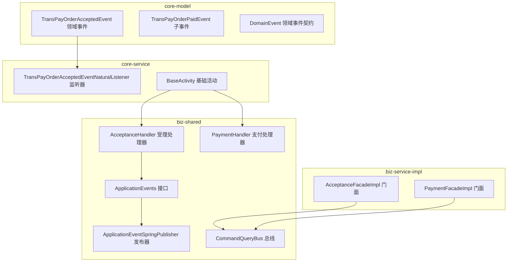
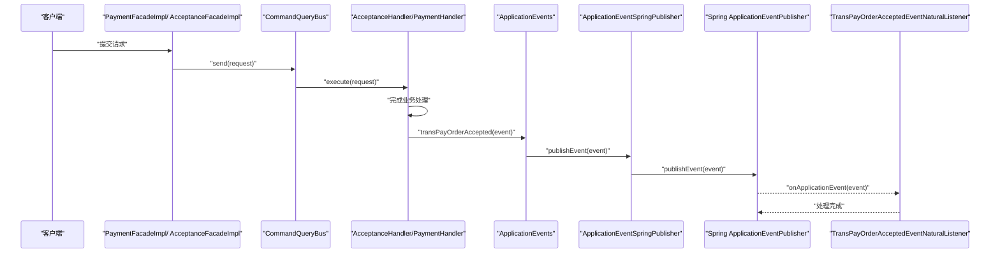
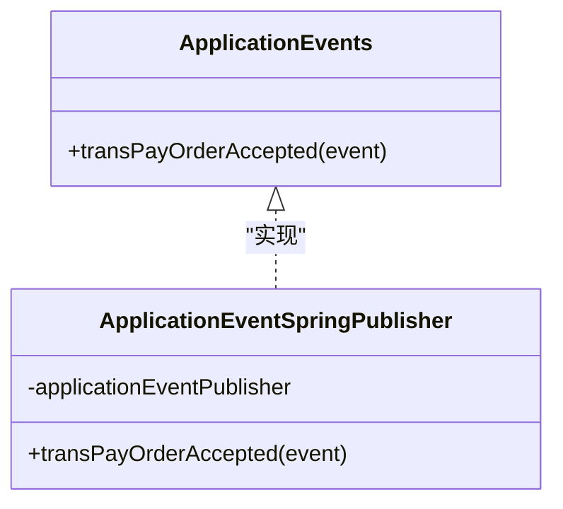
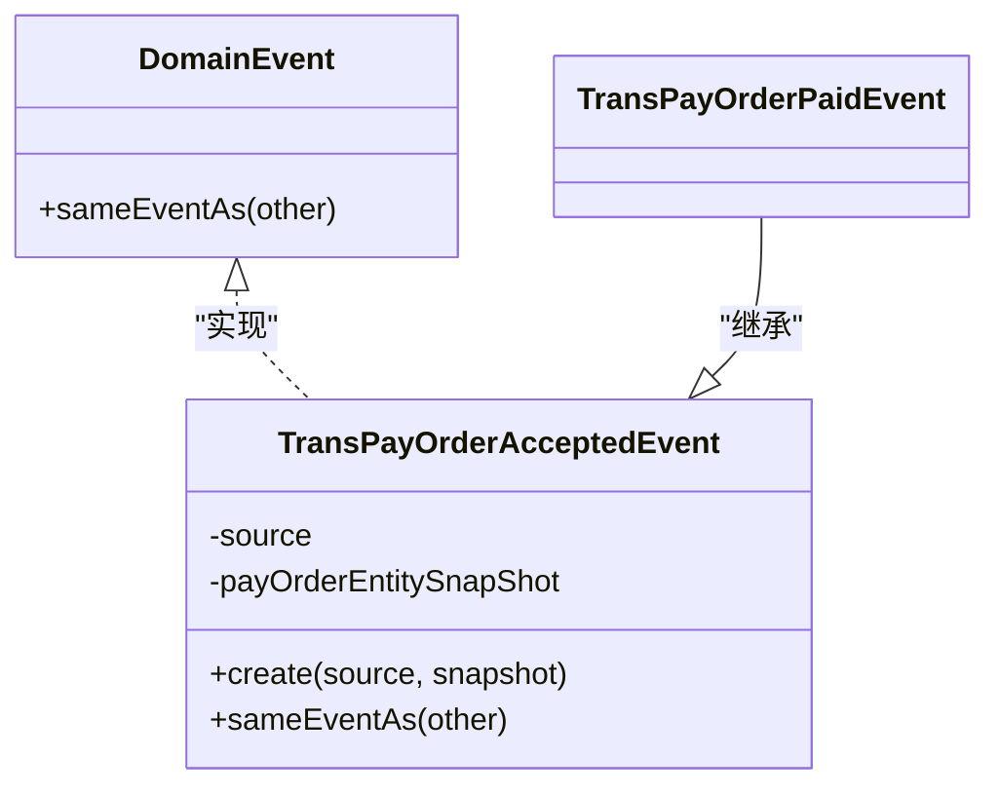
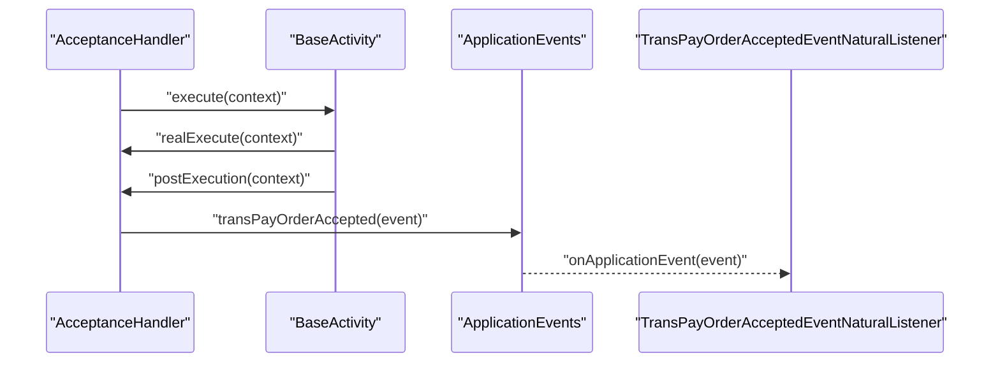
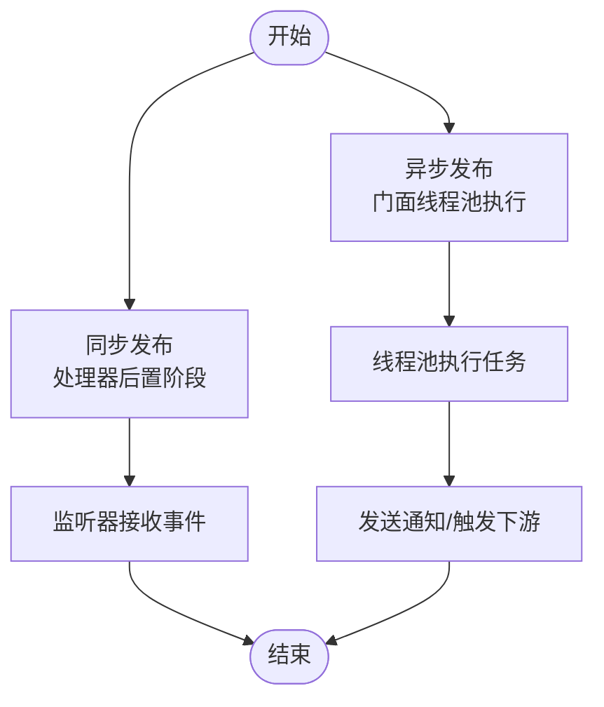
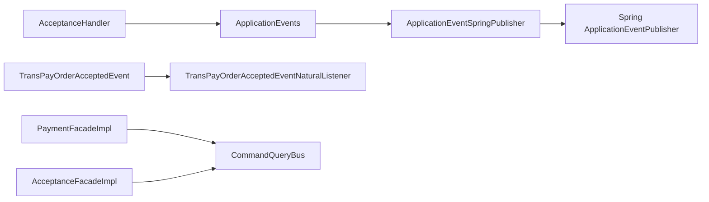

# 事件系统

<cite>
**本文引用的文件**
- [ApplicationEventSpringPublisher.java](file://biz-shared/src/main/java/com/magicliang/transaction/sys/biz/shared/event/ApplicationEventSpringPublisher.java)
- [ApplicationEvents.java](file://biz-shared/src/main/java/com/magicliang/transaction/sys/biz/shared/event/ApplicationEvents.java)
- [TransPayOrderAcceptedEvent.java](file://core-model/src/main/java/com/magicliang/transaction/sys/core/model/event/TransPayOrderAcceptedEvent.java)
- [TransPayOrderPaidEvent.java](file://core-model/src/main/java/com/magicliang/transaction/sys/core/model/event/TransPayOrderPaidEvent.java)
- [TransPayOrderAcceptedEventNaturalListener.java](file://core-service/src/main/java/com/magicliang/transaction/sys/core/event/TransPayOrderAcceptedEventNaturalListener.java)
- [AcceptanceHandler.java](file://biz-shared/src/main/java/com/magicliang/transaction/sys/biz/shared/handler/AcceptanceHandler.java)
- [PaymentHandler.java](file://biz-shared/src/main/java/com/magicliang/transaction/sys/biz/shared/handler/PaymentHandler.java)
- [CommandQueryBus.java](file://biz-shared/src/main/java/com/magicliang/transaction/sys/biz/shared/locator/CommandQueryBus.java)
- [AcceptanceFacadeImpl.java](file://biz-service-impl/src/main/java/com/magicliang/transaction/sys/biz/service/impl/facade/impl/AcceptanceFacadeImpl.java)
- [PaymentFacadeImpl.java](file://biz-service-impl/src/main/java/com/magicliang/transaction/sys/biz/service/impl/facade/impl/PaymentFacadeImpl.java)
- [DomainEvent.java](file://core-model/src/main/java/com/magicliang/transaction/sys/core/shared/DomainEvent.java)
- [BaseActivity.java](file://core-service/src/main/java/com/magicliang/transaction/sys/core/domain/activity/BaseActivity.java)
- [DomainDrivenTransactionSysApplicationIntegrationTest.java](file://biz-service-impl/src/test/integration/java/com/magicliang/transaction/sys/DomainDrivenTransactionSysApplicationIntegrationTest.java)
</cite>

## 目录
1. [引言](#引言)
2. [项目结构](#项目结构)
3. [核心组件](#核心组件)
4. [架构总览](#架构总览)
5. [详细组件分析](#详细组件分析)
6. [依赖分析](#依赖分析)
7. [性能考虑](#性能考虑)
8. [故障排查指南](#故障排查指南)
9. [结论](#结论)
10. [附录](#附录)

## 引言
本文件围绕交易系统的事件驱动架构展开，系统采用“应用层事件接口 + Spring 事件发布器”的方式实现领域事件的发布与监听，强调业务解耦与跨模块通信。文档将从事件定义、发布、监听与处理流程入手，解释同步与异步事件处理模式，并给出扩展与自定义事件的实践指南，最后结合交易系统场景展示事件驱动架构的应用价值。

## 项目结构
事件系统相关代码主要分布在以下模块与包中：
- biz-shared：应用层事件接口与发布器、处理器、门面与总线
- core-model：领域事件与领域共享契约
- core-service：事件监听器与基础活动
- biz-service-impl：对外门面与异步处理示例

图表来源
- [ApplicationEvents.java:1-22](file://biz-shared/src/main/java/com/magicliang/transaction/sys/biz/shared/event/ApplicationEvents.java#L1-L22)
- [ApplicationEventSpringPublisher.java:1-32](file://biz-shared/src/main/java/com/magicliang/transaction/sys/biz/shared/event/ApplicationEventSpringPublisher.java#L1-L32)
- [AcceptanceHandler.java:1-231](file://biz-shared/src/main/java/com/magicliang/transaction/sys/biz/shared/handler/AcceptanceHandler.java#L1-L231)
- [PaymentHandler.java:1-139](file://biz-shared/src/main/java/com/magicliang/transaction/sys/biz/shared/handler/PaymentHandler.java#L1-L139)
- [CommandQueryBus.java:1-79](file://biz-shared/src/main/java/com/magicliang/transaction/sys/biz/shared/locator/CommandQueryBus.java#L1-L79)
- [TransPayOrderAcceptedEvent.java:1-54](file://core-model/src/main/java/com/magicliang/transaction/sys/core/model/event/TransPayOrderAcceptedEvent.java#L1-L54)
- [TransPayOrderPaidEvent.java:1-20](file://core-model/src/main/java/com/magicliang/transaction/sys/core/model/event/TransPayOrderPaidEvent.java#L1-L20)
- [TransPayOrderAcceptedEventNaturalListener.java:1-33](file://core-service/src/main/java/com/magicliang/transaction/sys/core/event/TransPayOrderAcceptedEventNaturalListener.java#L1-L33)
- [BaseActivity.java:1-139](file://core-service/src/main/java/com/magicliang/transaction/sys/core/domain/activity/BaseActivity.java#L1-L139)
- [AcceptanceFacadeImpl.java:1-33](file://biz-service-impl/src/main/java/com/magicliang/transaction/sys/biz/service/impl/facade/impl/AcceptanceFacadeImpl.java#L1-L33)
- [PaymentFacadeImpl.java:1-166](file://biz-service-impl/src/main/java/com/magicliang/transaction/sys/biz/service/impl/facade/impl/PaymentFacadeImpl.java#L1-L166)

章节来源
- [ApplicationEvents.java:1-22](file://biz-shared/src/main/java/com/magicliang/transaction/sys/biz/shared/event/ApplicationEvents.java#L1-L22)
- [ApplicationEventSpringPublisher.java:1-32](file://biz-shared/src/main/java/com/magicliang/transaction/sys/biz/shared/event/ApplicationEventSpringPublisher.java#L1-L32)
- [TransPayOrderAcceptedEvent.java:1-54](file://core-model/src/main/java/com/magicliang/transaction/sys/core/model/event/TransPayOrderAcceptedEvent.java#L1-L54)
- [TransPayOrderAcceptedEventNaturalListener.java:1-33](file://core-service/src/main/java/com/magicliang/transaction/sys/core/event/TransPayOrderAcceptedEventNaturalListener.java#L1-L33)
- [AcceptanceHandler.java:1-231](file://biz-shared/src/main/java/com/magicliang/transaction/sys/biz/shared/handler/AcceptanceHandler.java#L1-L231)
- [PaymentHandler.java:1-139](file://biz-shared/src/main/java/com/magicliang/transaction/sys/biz/shared/handler/PaymentHandler.java#L1-L139)
- [CommandQueryBus.java:1-79](file://biz-shared/src/main/java/com/magicliang/transaction/sys/biz/shared/locator/CommandQueryBus.java#L1-L79)
- [AcceptanceFacadeImpl.java:1-33](file://biz-service-impl/src/main/java/com/magicliang/transaction/sys/biz/service/impl/facade/impl/AcceptanceFacadeImpl.java#L1-L33)
- [PaymentFacadeImpl.java:1-166](file://biz-service-impl/src/main/java/com/magicliang/transaction/sys/biz/service/impl/facade/impl/PaymentFacadeImpl.java#L1-L166)

## 核心组件
- 应用层事件接口 ApplicationEvents：定义应用层可发布的事件契约，隔离具体发布实现细节。
- Spring 事件发布器 ApplicationEventSpringPublisher：基于 Spring 的 ApplicationEventPublisher 实现，负责将领域事件发布到 Spring 容器。
- 领域事件 TransPayOrderAcceptedEvent：继承 Spring ApplicationEvent 并实现领域事件契约，包含快照数据以保证事件稳定性。
- 事件监听器 TransPayOrderAcceptedEventNaturalListener：监听受理事件，用于日志记录或后续处理。
- 受理处理器 AcceptanceHandler：在业务完成后发布受理事件，体现“先完成业务，再广播事件”的原则。
- 支付处理器 PaymentHandler：支付流程相关处理，可作为事件下游消费者或进一步发布支付事件。
- 门面与总线：AcceptanceFacadeImpl、PaymentFacadeImpl 通过 CommandQueryBus 将请求分发至对应处理器；PaymentFacadeImpl 展示了异步通知的典型用法。

章节来源
- [ApplicationEvents.java:1-22](file://biz-shared/src/main/java/com/magicliang/transaction/sys/biz/shared/event/ApplicationEvents.java#L1-L22)
- [ApplicationEventSpringPublisher.java:1-32](file://biz-shared/src/main/java/com/magicliang/transaction/sys/biz/shared/event/ApplicationEventSpringPublisher.java#L1-L32)
- [TransPayOrderAcceptedEvent.java:1-54](file://core-model/src/main/java/com/magicliang/transaction/sys/core/model/event/TransPayOrderAcceptedEvent.java#L1-L54)
- [TransPayOrderAcceptedEventNaturalListener.java:1-33](file://core-service/src/main/java/com/magicliang/transaction/sys/core/event/TransPayOrderAcceptedEventNaturalListener.java#L1-L33)
- [AcceptanceHandler.java:1-231](file://biz-shared/src/main/java/com/magicliang/transaction/sys/biz/shared/handler/AcceptanceHandler.java#L1-L231)
- [PaymentHandler.java:1-139](file://biz-shared/src/main/java/com/magicliang/transaction/sys/biz/shared/handler/PaymentHandler.java#L1-L139)
- [CommandQueryBus.java:1-79](file://biz-shared/src/main/java/com/magicliang/transaction/sys/biz/shared/locator/CommandQueryBus.java#L1-L79)
- [AcceptanceFacadeImpl.java:1-33](file://biz-service-impl/src/main/java/com/magicliang/transaction/sys/biz/service/impl/facade/impl/AcceptanceFacadeImpl.java#L1-L33)
- [PaymentFacadeImpl.java:1-166](file://biz-service-impl/src/main/java/com/magicliang/transaction/sys/biz/service/impl/facade/impl/PaymentFacadeImpl.java#L1-L166)

## 架构总览
事件系统遵循“应用层接口 + Spring 发布 + 领域事件 + 监听器”的分层设计，确保业务逻辑与事件传播解耦。下图展示了从门面到处理器、再到事件发布的端到端流程。

图表来源
- [PaymentFacadeImpl.java:1-166](file://biz-service-impl/src/main/java/com/magicliang/transaction/sys/biz/service/impl/facade/impl/PaymentFacadeImpl.java#L1-L166)
- [AcceptanceFacadeImpl.java:1-33](file://biz-service-impl/src/main/java/com/magicliang/transaction/sys/biz/service/impl/facade/impl/AcceptanceFacadeImpl.java#L1-L33)
- [CommandQueryBus.java:1-79](file://biz-shared/src/main/java/com/magicliang/transaction/sys/biz/shared/locator/CommandQueryBus.java#L1-L79)
- [AcceptanceHandler.java:1-231](file://biz-shared/src/main/java/com/magicliang/transaction/sys/biz/shared/handler/AcceptanceHandler.java#L1-L231)
- [ApplicationEvents.java:1-22](file://biz-shared/src/main/java/com/magicliang/transaction/sys/biz/shared/event/ApplicationEvents.java#L1-L22)
- [ApplicationEventSpringPublisher.java:1-32](file://biz-shared/src/main/java/com/magicliang/transaction/sys/biz/shared/event/ApplicationEventSpringPublisher.java#L1-L32)
- [TransPayOrderAcceptedEventNaturalListener.java:1-33](file://core-service/src/main/java/com/magicliang/transaction/sys/core/event/TransPayOrderAcceptedEventNaturalListener.java#L1-L33)

## 详细组件分析

### 应用层事件接口与发布器
- ApplicationEvents：定义应用层事件的统一入口，便于替换底层实现（如切换到消息中间件）。
- ApplicationEventSpringPublisher：基于 Spring 的 ApplicationEventPublisher 实现，负责将事件发布到容器。

图表来源
- [ApplicationEvents.java:1-22](file://biz-shared/src/main/java/com/magicliang/transaction/sys/biz/shared/event/ApplicationEvents.java#L1-L22)
- [ApplicationEventSpringPublisher.java:1-32](file://biz-shared/src/main/java/com/magicliang/transaction/sys/biz/shared/event/ApplicationEventSpringPublisher.java#L1-L32)

章节来源
- [ApplicationEvents.java:1-22](file://biz-shared/src/main/java/com/magicliang/transaction/sys/biz/shared/event/ApplicationEvents.java#L1-L22)
- [ApplicationEventSpringPublisher.java:1-32](file://biz-shared/src/main/java/com/magicliang/transaction/sys/biz/shared/event/ApplicationEventSpringPublisher.java#L1-L32)

### 领域事件模型与继承关系
- TransPayOrderAcceptedEvent：继承 Spring ApplicationEvent，实现领域事件契约，包含快照数据，避免事件传播过程中的状态漂移。
- TransPayOrderPaidEvent：继承受理事件，形成事件层次，便于区分不同阶段的事件。

图表来源
- [DomainEvent.java:1-18](file://core-model/src/main/java/com/magicliang/transaction/sys/core/shared/DomainEvent.java#L1-L18)
- [TransPayOrderAcceptedEvent.java:1-54](file://core-model/src/main/java/com/magicliang/transaction/sys/core/model/event/TransPayOrderAcceptedEvent.java#L1-L54)
- [TransPayOrderPaidEvent.java:1-20](file://core-model/src/main/java/com/magicliang/transaction/sys/core/model/event/TransPayOrderPaidEvent.java#L1-L20)

章节来源
- [TransPayOrderAcceptedEvent.java:1-54](file://core-model/src/main/java/com/magicliang/transaction/sys/core/model/event/TransPayOrderAcceptedEvent.java#L1-L54)
- [TransPayOrderPaidEvent.java:1-20](file://core-model/src/main/java/com/magicliang/transaction/sys/core/model/event/TransPayOrderPaidEvent.java#L1-L20)
- [DomainEvent.java:1-18](file://core-model/src/main/java/com/magicliang/transaction/sys/core/shared/DomainEvent.java#L1-L18)

### 事件监听与处理
- TransPayOrderAcceptedEventNaturalListener：作为 Spring ApplicationListener，接收受理事件，可用于日志、审计或触发下游流程。
- BaseActivity：基础活动封装了活动生命周期（前置/真执行/后置），处理器在后置阶段发布事件，确保业务写入成功后再广播。

图表来源
- [AcceptanceHandler.java:1-231](file://biz-shared/src/main/java/com/magicliang/transaction/sys/biz/shared/handler/AcceptanceHandler.java#L1-L231)
- [BaseActivity.java:1-139](file://core-service/src/main/java/com/magicliang/transaction/sys/core/domain/activity/BaseActivity.java#L1-L139)
- [TransPayOrderAcceptedEventNaturalListener.java:1-33](file://core-service/src/main/java/com/magicliang/transaction/sys/core/event/TransPayOrderAcceptedEventNaturalListener.java#L1-L33)

章节来源
- [TransPayOrderAcceptedEventNaturalListener.java:1-33](file://core-service/src/main/java/com/magicliang/transaction/sys/core/event/TransPayOrderAcceptedEventNaturalListener.java#L1-L33)
- [BaseActivity.java:1-139](file://core-service/src/main/java/com/magicliang/transaction/sys/core/domain/activity/BaseActivity.java#L1-L139)
- [AcceptanceHandler.java:1-231](file://biz-shared/src/main/java/com/magicliang/transaction/sys/biz/shared/handler/AcceptanceHandler.java#L1-L231)

### 同步与异步事件处理模式
- 同步事件：处理器在完成业务后立即发布事件，监听器同步接收并处理。该模式简单可靠，适合低延迟、强一致要求的场景。
- 异步事件：门面层通过线程池异步执行支付并发送通知，或将事件发布与后续处理解耦，提升吞吐与可用性。异步模式需关注幂等与重试策略。

图表来源
- [AcceptanceHandler.java:1-231](file://biz-shared/src/main/java/com/magicliang/transaction/sys/biz/shared/handler/AcceptanceHandler.java#L1-L231)
- [PaymentFacadeImpl.java:1-166](file://biz-service-impl/src/main/java/com/magicliang/transaction/sys/biz/service/impl/facade/impl/PaymentFacadeImpl.java#L1-L166)

章节来源
- [AcceptanceHandler.java:1-231](file://biz-shared/src/main/java/com/magicliang/transaction/sys/biz/shared/handler/AcceptanceHandler.java#L1-L231)
- [PaymentFacadeImpl.java:1-166](file://biz-service-impl/src/main/java/com/magicliang/transaction/sys/biz/service/impl/facade/impl/PaymentFacadeImpl.java#L1-L166)

### 事件在业务解耦中的作用
- 事件作为“最终一致性”的桥梁，使上游处理器无需关心下游依赖，降低模块间耦合度。
- 通过事件监听器，可在不修改核心业务逻辑的前提下扩展通知、审计、统计等功能。
- 事件层次（受理 → 支付）清晰表达业务流转，便于维护与演进。

章节来源
- [TransPayOrderAcceptedEvent.java:1-54](file://core-model/src/main/java/com/magicliang/transaction/sys/core/model/event/TransPayOrderAcceptedEvent.java#L1-L54)
- [TransPayOrderPaidEvent.java:1-20](file://core-model/src/main/java/com/magicliang/transaction/sys/core/model/event/TransPayOrderPaidEvent.java#L1-L20)
- [TransPayOrderAcceptedEventNaturalListener.java:1-33](file://core-service/src/main/java/com/magicliang/transaction/sys/core/event/TransPayOrderAcceptedEventNaturalListener.java#L1-L33)

### 交易系统中的事件驱动应用
- 受理阶段：AcceptanceHandler 完成订单受理后发布受理事件，下游可据此触发通知或风控。
- 支付阶段：PaymentHandler 完成支付后可发布支付事件，监听器执行后续动作（如异步通知）。
- 门面层：PaymentFacadeImpl 提供异步支付与通知能力，结合线程池提升吞吐。

章节来源
- [AcceptanceHandler.java:1-231](file://biz-shared/src/main/java/com/magicliang/transaction/sys/biz/shared/handler/AcceptanceHandler.java#L1-L231)
- [PaymentHandler.java:1-139](file://biz-shared/src/main/java/com/magicliang/transaction/sys/biz/shared/handler/PaymentHandler.java#L1-L139)
- [PaymentFacadeImpl.java:1-166](file://biz-service-impl/src/main/java/com/magicliang/transaction/sys/biz/service/impl/facade/impl/PaymentFacadeImpl.java#L1-L166)

## 依赖分析
- 组件内聚与耦合
  - ApplicationEvents 与 ApplicationEventSpringPublisher 解耦事件发布与应用层接口，便于替换实现。
  - 领域事件仅依赖 Spring ApplicationEvent 与领域契约，保持最小依赖。
  - 监听器与处理器通过事件契约解耦，监听器可独立演进。
- 外部依赖
  - Spring ApplicationEventPublisher 提供事件发布基础设施。
  - 线程池与门面层提供异步能力支撑。

图表来源
- [ApplicationEvents.java:1-22](file://biz-shared/src/main/java/com/magicliang/transaction/sys/biz/shared/event/ApplicationEvents.java#L1-L22)
- [ApplicationEventSpringPublisher.java:1-32](file://biz-shared/src/main/java/com/magicliang/transaction/sys/biz/shared/event/ApplicationEventSpringPublisher.java#L1-L32)
- [AcceptanceHandler.java:1-231](file://biz-shared/src/main/java/com/magicliang/transaction/sys/biz/shared/handler/AcceptanceHandler.java#L1-L231)
- [TransPayOrderAcceptedEvent.java:1-54](file://core-model/src/main/java/com/magicliang/transaction/sys/core/model/event/TransPayOrderAcceptedEvent.java#L1-L54)
- [TransPayOrderAcceptedEventNaturalListener.java:1-33](file://core-service/src/main/java/com/magicliang/transaction/sys/core/event/TransPayOrderAcceptedEventNaturalListener.java#L1-L33)
- [PaymentFacadeImpl.java:1-166](file://biz-service-impl/src/main/java/com/magicliang/transaction/sys/biz/service/impl/facade/impl/PaymentFacadeImpl.java#L1-L166)
- [AcceptanceFacadeImpl.java:1-33](file://biz-service-impl/src/main/java/com/magicliang/transaction/sys/biz/service/impl/facade/impl/AcceptanceFacadeImpl.java#L1-L33)

章节来源
- [ApplicationEvents.java:1-22](file://biz-shared/src/main/java/com/magicliang/transaction/sys/biz/shared/event/ApplicationEvents.java#L1-L22)
- [ApplicationEventSpringPublisher.java:1-32](file://biz-shared/src/main/java/com/magicliang/transaction/sys/biz/shared/event/ApplicationEventSpringPublisher.java#L1-L32)
- [AcceptanceHandler.java:1-231](file://biz-shared/src/main/java/com/magicliang/transaction/sys/biz/shared/handler/AcceptanceHandler.java#L1-L231)
- [TransPayOrderAcceptedEvent.java:1-54](file://core-model/src/main/java/com/magicliang/transaction/sys/core/model/event/TransPayOrderAcceptedEvent.java#L1-L54)
- [TransPayOrderAcceptedEventNaturalListener.java:1-33](file://core-service/src/main/java/com/magicliang/transaction/sys/core/event/TransPayOrderAcceptedEventNaturalListener.java#L1-L33)
- [PaymentFacadeImpl.java:1-166](file://biz-service-impl/src/main/java/com/magicliang/transaction/sys/biz/service/impl/facade/impl/PaymentFacadeImpl.java#L1-L166)
- [AcceptanceFacadeImpl.java:1-33](file://biz-service-impl/src/main/java/com/magicliang/transaction/sys/biz/service/impl/facade/impl/AcceptanceFacadeImpl.java#L1-L33)

## 性能考虑
- 同步发布：事件发布发生在处理器后置阶段，确保业务写入成功后再广播，适合低延迟场景。
- 异步发布：通过线程池异步执行支付与通知，提升吞吐；需关注线程池容量、队列长度与拒绝策略。
- 监听器处理：监听器应尽量轻量化，避免阻塞事件传播；复杂逻辑建议下沉到后台任务或消息队列。

## 故障排查指南
- 事件未被监听
  - 检查监听器是否注册为 Spring 组件且泛型签名正确。
  - 确认事件类型与监听器泛型匹配。
- 事件重复或丢失
  - 使用领域事件的等价性判断方法避免重复处理。
  - 对外发布建议引入幂等键与去重策略。
- 测试验证
  - 单元测试可通过注入 ApplicationEvents 并发布事件进行验证。
  - 集成测试可验证门面 → 总线 → 处理器 → 监听器的完整链路。

章节来源
- [TransPayOrderAcceptedEvent.java:1-54](file://core-model/src/main/java/com/magicliang/transaction/sys/core/model/event/TransPayOrderAcceptedEvent.java#L1-L54)
- [TransPayOrderAcceptedEventNaturalListener.java:1-33](file://core-service/src/main/java/com/magicliang/transaction/sys/core/event/TransPayOrderAcceptedEventNaturalListener.java#L1-L33)
- [DomainDrivenTransactionSysApplicationIntegrationTest.java:78-83](file://biz-service-impl/src/test/integration/java/com/magicliang/transaction/sys/DomainDrivenTransactionSysApplicationIntegrationTest.java#L78-L83)

## 结论
事件系统通过应用层接口与 Spring 发布器实现了领域事件的标准化发布，配合监听器与门面层异步能力，有效降低了模块间的耦合度，提升了系统的可扩展性与可维护性。在交易系统中，事件驱动架构能够清晰表达业务流转，支持跨模块的松耦合通信，并为后续引入消息中间件或分布式事件总线提供了平滑迁移路径。

## 附录
- 扩展与自定义事件指南
  - 定义领域事件：继承 Spring ApplicationEvent 并实现领域事件契约，必要时提供快照数据。
  - 发布事件：在处理器后置阶段调用应用层事件接口发布事件。
  - 监听事件：注册 Spring 监听器，实现业务处理逻辑。
  - 异步处理：在门面层或服务层使用线程池异步执行事件相关操作。
- 交易系统场景建议
  - 受理事件：触发通知、风控与审计。
  - 支付事件：触发下游通知与对账。
  - 批量处理：结合门面层异步能力与线程池，提升吞吐。