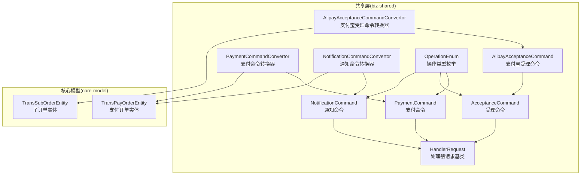
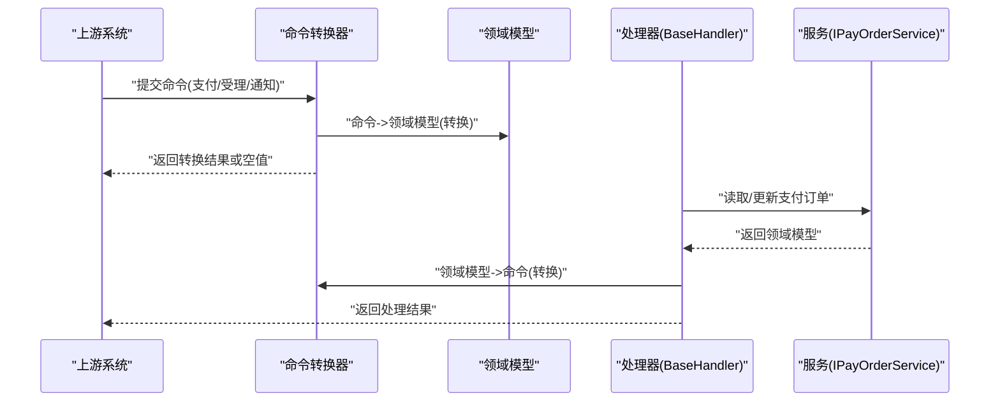
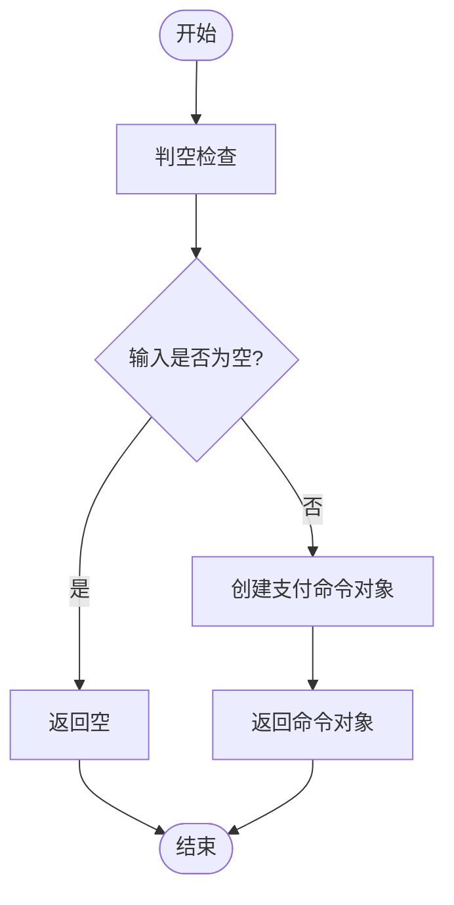
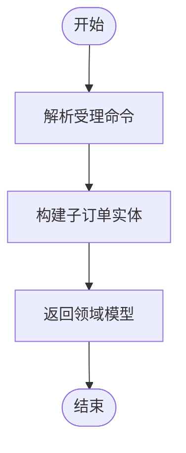
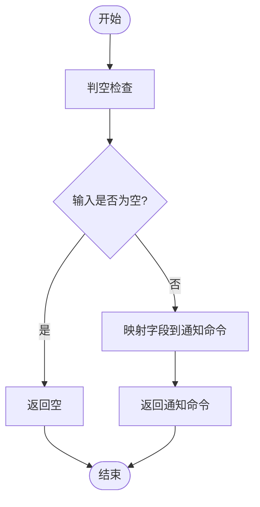
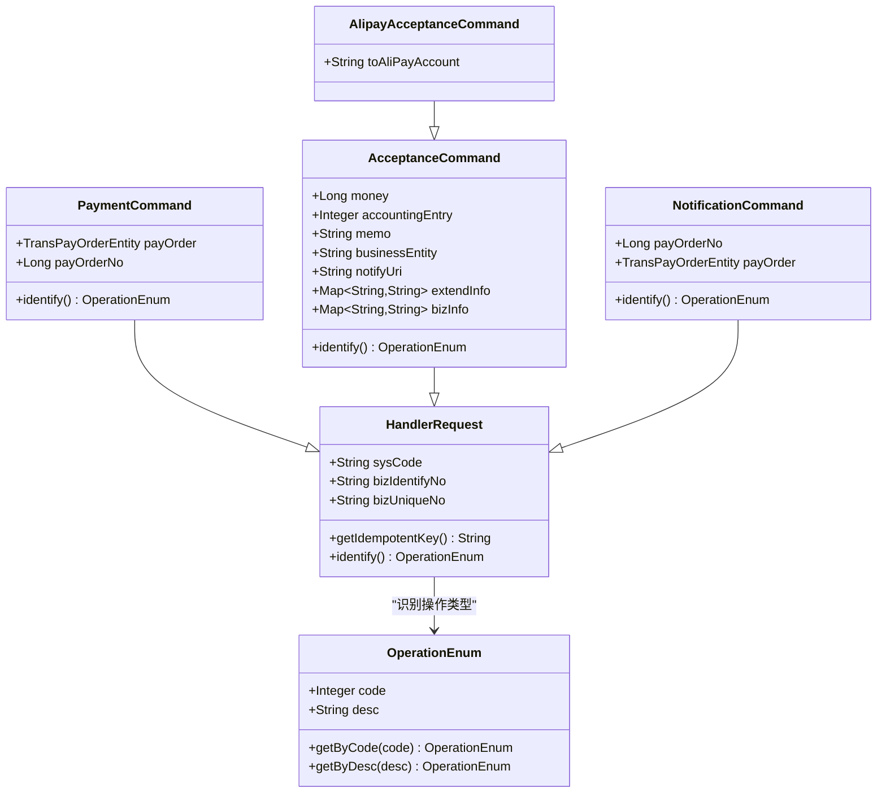
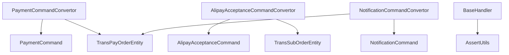

# 命令转换器

<cite>
**本文引用的文件**
- [PaymentCommandConvertor.java](file://biz-shared/src/main/java/com/magicliang/transaction/sys/biz/shared/request/payment/convertor/PaymentCommandConvertor.java)
- [AlipayAcceptanceCommandConvertor.java](file://biz-shared/src/main/java/com/magicliang/transaction/sys/biz/shared/request/acceptance/convertor/AlipayAcceptanceCommandConvertor.java)
- [NotificationCommandConvertor.java](file://biz-shared/src/main/java/com/magicliang/transaction/sys/biz/shared/request/notification/convertor/NotificationCommandConvertor.java)
- [PaymentCommand.java](file://biz-shared/src/main/java/com/magicliang/transaction/sys/biz/shared/request/payment/PaymentCommand.java)
- [AlipayAcceptanceCommand.java](file://biz-shared/src/main/java/com/magicliang/transaction/sys/biz/shared/request/acceptance/AlipayAcceptanceCommand.java)
- [AcceptanceCommand.java](file://biz-shared/src/main/java/com/magicliang/transaction/sys/biz/shared/request/acceptance/AcceptanceCommand.java)
- [NotificationCommand.java](file://biz-shared/src/main/java/com/magicliang/transaction/sys/biz/shared/request/notification/NotificationCommand.java)
- [HandlerRequest.java](file://biz-shared/src/main/java/com/magicliang/transaction/sys/biz/shared/request/HandlerRequest.java)
- [OperationEnum.java](file://biz-shared/src/main/java/com/magicliang/transaction/sys/biz/shared/enums/OperationEnum.java)
- [TransPayOrderEntity.java](file://core-model/src/main/java/com/magicliang/transaction/sys/core/model/entity/TransPayOrderEntity.java)
- [TransSubOrderEntity.java](file://core-model/src/main/java/com/magicliang/transaction/sys/core/model/entity/TransSubOrderEntity.java)
- [BaseHandler.java](file://biz-shared/src/main/java/com/magicliang/transaction/sys/biz/shared/handler/BaseHandler.java)
- [AssertUtils.java](file://common-util/src/main/java/com/magicliang/transaction/sys/common/util/AssertUtils.java)
</cite>

## 目录
1. [引言](#引言)
2. [项目结构](#项目结构)
3. [核心组件](#核心组件)
4. [架构总览](#架构总览)
5. [详细组件分析](#详细组件分析)
6. [依赖分析](#依赖分析)
7. [性能考虑](#性能考虑)
8. [故障排查指南](#故障排查指南)
9. [结论](#结论)
10. [附录](#附录)

## 引言
本文件围绕“命令转换器”主题，系统化梳理并说明该系统中用于将外部输入或不同格式的数据转换为内部统一命令对象的设计与实现。重点覆盖以下方面：
- 设计模式与作用机制：以静态工厂风格的转换器为核心，结合领域模型与命令模型之间的双向映射，确保跨边界的数据一致性与可追踪性。
- 典型转换器实现：PaymentCommandConvertor、AlipayAcceptanceCommandConvertor、NotificationCommandConvertor 的职责、转换逻辑、数据验证与异常处理策略。
- 扩展与自定义指南：如何在现有框架下扩展新的转换器，处理复杂业务数据转换场景。

## 项目结构
命令转换器位于共享层 biz-shared 的 request 包下，分别对应 payment、acceptance、notification 三大业务域；同时，核心领域模型位于 core-model 层，二者通过转换器建立松耦合的桥接关系。

图表来源
- [PaymentCommand.java:1-44](file://biz-shared/src/main/java/com/magicliang/transaction/sys/biz/shared/request/payment/PaymentCommand.java#L1-L44)
- [AcceptanceCommand.java:1-74](file://biz-shared/src/main/java/com/magicliang/transaction/sys/biz/shared/request/acceptance/AcceptanceCommand.java#L1-L74)
- [AlipayAcceptanceCommand.java:1-25](file://biz-shared/src/main/java/com/magicliang/transaction/sys/biz/shared/request/acceptance/AlipayAcceptanceCommand.java#L1-L25)
- [NotificationCommand.java:1-43](file://biz-shared/src/main/java/com/magicliang/transaction/sys/biz/shared/request/notification/NotificationCommand.java#L1-L43)
- [PaymentCommandConvertor.java:1-38](file://biz-shared/src/main/java/com/magicliang/transaction/sys/biz/shared/request/payment/convertor/PaymentCommandConvertor.java#L1-L38)
- [AlipayAcceptanceCommandConvertor.java:1-34](file://biz-shared/src/main/java/com/magicliang/transaction/sys/biz/shared/request/acceptance/convertor/AlipayAcceptanceCommandConvertor.java#L1-L34)
- [NotificationCommandConvertor.java:1-37](file://biz-shared/src/main/java/com/magicliang/transaction/sys/biz/shared/request/notification/convertor/NotificationCommandConvertor.java#L1-L37)
- [HandlerRequest.java:1-46](file://biz-shared/src/main/java/com/magicliang/transaction/sys/biz/shared/request/HandlerRequest.java#L1-L46)
- [OperationEnum.java:1-97](file://biz-shared/src/main/java/com/magicliang/transaction/sys/biz/shared/enums/OperationEnum.java#L1-L97)
- [TransPayOrderEntity.java:1-216](file://core-model/src/main/java/com/magicliang/transaction/sys/core/model/entity/TransPayOrderEntity.java#L1-L216)
- [TransSubOrderEntity.java:1-24](file://core-model/src/main/java/com/magicliang/transaction/sys/core/model/entity/TransSubOrderEntity.java#L1-L24)

章节来源
- [PaymentCommandConvertor.java:1-38](file://biz-shared/src/main/java/com/magicliang/transaction/sys/biz/shared/request/payment/convertor/PaymentCommandConvertor.java#L1-L38)
- [AlipayAcceptanceCommandConvertor.java:1-34](file://biz-shared/src/main/java/com/magicliang/transaction/sys/biz/shared/request/acceptance/convertor/AlipayAcceptanceCommandConvertor.java#L1-L34)
- [NotificationCommandConvertor.java:1-37](file://biz-shared/src/main/java/com/magicliang/transaction/sys/biz/shared/request/notification/convertor/NotificationCommandConvertor.java#L1-L37)
- [PaymentCommand.java:1-44](file://biz-shared/src/main/java/com/magicliang/transaction/sys/biz/shared/request/payment/PaymentCommand.java#L1-L44)
- [AlipayAcceptanceCommand.java:1-25](file://biz-shared/src/main/java/com/magicliang/transaction/sys/biz/shared/request/acceptance/AlipayAcceptanceCommand.java#L1-L25)
- [AcceptanceCommand.java:1-74](file://biz-shared/src/main/java/com/magicliang/transaction/sys/biz/shared/request/acceptance/AcceptanceCommand.java#L1-L74)
- [NotificationCommand.java:1-43](file://biz-shared/src/main/java/com/magicliang/transaction/sys/biz/shared/request/notification/NotificationCommand.java#L1-L43)
- [HandlerRequest.java:1-46](file://biz-shared/src/main/java/com/magicliang/transaction/sys/biz/shared/request/HandlerRequest.java#L1-L46)
- [OperationEnum.java:1-97](file://biz-shared/src/main/java/com/magicliang/transaction/sys/biz/shared/enums/OperationEnum.java#L1-L97)
- [TransPayOrderEntity.java:1-216](file://core-model/src/main/java/com/magicliang/transaction/sys/core/model/entity/TransPayOrderEntity.java#L1-L216)
- [TransSubOrderEntity.java:1-24](file://core-model/src/main/java/com/magicliang/transaction/sys/core/model/entity/TransSubOrderEntity.java#L1-L24)

## 核心组件
- 命令模型与基类
  - HandlerRequest：统一的请求基类，提供幂等键生成与公共字段（来源系统、业务标识等）。
  - PaymentCommand：支付命令，承载支付订单或订单号等关键信息，并标识操作类型为支付。
  - AcceptanceCommand：受理命令，包含金额、会计分录方向、回调地址、扩展信息等。
  - AlipayAcceptanceCommand：支付宝受理命令，扩展目标支付宝账户字段。
  - NotificationCommand：通知命令，包含支付订单号或完整支付订单，标识操作类型为通知。
- 枚举与标识
  - OperationEnum：统一的操作类型枚举，用于命令识别与路由。
- 领域模型
  - TransPayOrderEntity：支付订单聚合根，包含状态、金额、渠道信息、扩展信息等。
  - TransSubOrderEntity：子订单实体，当前与支付订单存在一对一关系。
- 转换器
  - PaymentCommandConvertor：将领域模型转换为支付命令。
  - AlipayAcceptanceCommandConvertor：将支付宝受理命令转换为领域模型。
  - NotificationCommandConvertor：将领域模型转换为通知命令。

章节来源
- [HandlerRequest.java:1-46](file://biz-shared/src/main/java/com/magicliang/transaction/sys/biz/shared/request/HandlerRequest.java#L1-L46)
- [PaymentCommand.java:1-44](file://biz-shared/src/main/java/com/magicliang/transaction/sys/biz/shared/request/payment/PaymentCommand.java#L1-L44)
- [AcceptanceCommand.java:1-74](file://biz-shared/src/main/java/com/magicliang/transaction/sys/biz/shared/request/acceptance/AcceptanceCommand.java#L1-L74)
- [AlipayAcceptanceCommand.java:1-25](file://biz-shared/src/main/java/com/magicliang/transaction/sys/biz/shared/request/acceptance/AlipayAcceptanceCommand.java#L1-L25)
- [NotificationCommand.java:1-43](file://biz-shared/src/main/java/com/magicliang/transaction/sys/biz/shared/request/notification/NotificationCommand.java#L1-L43)
- [OperationEnum.java:1-97](file://biz-shared/src/main/java/com/magicliang/transaction/sys/biz/shared/enums/OperationEnum.java#L1-L97)
- [TransPayOrderEntity.java:1-216](file://core-model/src/main/java/com/magicliang/transaction/sys/core/model/entity/TransPayOrderEntity.java#L1-L216)
- [TransSubOrderEntity.java:1-24](file://core-model/src/main/java/com/magicliang/transaction/sys/core/model/entity/TransSubOrderEntity.java#L1-L24)

## 架构总览
命令转换器在系统中的定位如下：
- 输入侧：来自上游系统的请求或事件，封装为命令对象。
- 转换层：根据命令类型与来源，选择对应的转换器，将命令映射为领域模型或反向映射为命令。
- 处理层：处理器在分布式锁保护下，基于转换后的模型执行业务流程。

图表来源
- [PaymentCommandConvertor.java:30-36](file://biz-shared/src/main/java/com/magicliang/transaction/sys/biz/shared/request/payment/convertor/PaymentCommandConvertor.java#L30-L36)
- [AlipayAcceptanceCommandConvertor.java:30-32](file://biz-shared/src/main/java/com/magicliang/transaction/sys/biz/shared/request/acceptance/convertor/AlipayAcceptanceCommandConvertor.java#L30-L32)
- [NotificationCommandConvertor.java:30-35](file://biz-shared/src/main/java/com/magicliang/transaction/sys/biz/shared/request/notification/convertor/NotificationCommandConvertor.java#L30-L35)
- [BaseHandler.java:93-121](file://biz-shared/src/main/java/com/magicliang/transaction/sys/biz/shared/handler/BaseHandler.java#L93-L121)

## 详细组件分析

### PaymentCommandConvertor（支付命令转换器）
- 职责
  - 将领域模型 TransPayOrderEntity 转换为支付命令 PaymentCommand。
- 转换逻辑
  - 若输入领域模型为空，直接返回空；否则创建并返回一个新的支付命令对象。
- 数据验证与异常处理
  - 当前实现对空输入进行显式判空并返回空，未见进一步字段校验与异常抛出逻辑。
- 可扩展点
  - 建议补充：将领域模型的关键字段映射到命令对象（如订单号、金额、回调地址、扩展信息等），并在映射前后进行断言与校验，必要时抛出自定义异常。

图表来源
- [PaymentCommandConvertor.java:30-36](file://biz-shared/src/main/java/com/magicliang/transaction/sys/biz/shared/request/payment/convertor/PaymentCommandConvertor.java#L30-L36)

章节来源
- [PaymentCommandConvertor.java:1-38](file://biz-shared/src/main/java/com/magicliang/transaction/sys/biz/shared/request/payment/convertor/PaymentCommandConvertor.java#L1-L38)
- [PaymentCommand.java:1-44](file://biz-shared/src/main/java/com/magicliang/transaction/sys/biz/shared/request/payment/PaymentCommand.java#L1-L44)
- [TransPayOrderEntity.java:1-216](file://core-model/src/main/java/com/magicliang/transaction/sys/core/model/entity/TransPayOrderEntity.java#L1-L216)

### AlipayAcceptanceCommandConvertor（支付宝受理命令转换器）
- 职责
  - 将支付宝受理命令 AlipayAcceptanceCommand 转换为领域模型 TransSubOrderEntity。
- 转换逻辑
  - 当前实现返回空，尚未完成字段映射与模型构建。
- 数据验证与异常处理
  - 未见显式的参数校验与异常处理。
- 可扩展点
  - 建议补充：从命令对象提取必要字段，构建子订单实体；在转换前后进行断言与校验，确保金额、会计方向、回调地址等关键字段合法。

图表来源
- [AlipayAcceptanceCommandConvertor.java:30-32](file://biz-shared/src/main/java/com/magicliang/transaction/sys/biz/shared/request/acceptance/convertor/AlipayAcceptanceCommandConvertor.java#L30-L32)
- [AlipayAcceptanceCommand.java:17-24](file://biz-shared/src/main/java/com/magicliang/transaction/sys/biz/shared/request/acceptance/AlipayAcceptanceCommand.java#L17-L24)
- [TransSubOrderEntity.java:17-24](file://core-model/src/main/java/com/magicliang/transaction/sys/core/model/entity/TransSubOrderEntity.java#L17-L24)

章节来源
- [AlipayAcceptanceCommandConvertor.java:1-34](file://biz-shared/src/main/java/com/magicliang/transaction/sys/biz/shared/request/acceptance/convertor/AlipayAcceptanceCommandConvertor.java#L1-L34)
- [AlipayAcceptanceCommand.java:1-25](file://biz-shared/src/main/java/com/magicliang/transaction/sys/biz/shared/request/acceptance/AlipayAcceptanceCommand.java#L1-L25)
- [TransSubOrderEntity.java:1-24](file://core-model/src/main/java/com/magicliang/transaction/sys/core/model/entity/TransSubOrderEntity.java#L1-L24)

### NotificationCommandConvertor（通知命令转换器）
- 职责
  - 将领域模型 TransPayOrderEntity 转换为通知命令 NotificationCommand。
- 转换逻辑
  - 当前实现对空输入返回空，未完成命令对象的字段填充。
- 数据验证与异常处理
  - 未见显式的参数校验与异常处理。
- 可扩展点
  - 建议补充：从支付订单提取订单号或完整订单，填充通知命令；在转换前后进行断言与校验，确保订单状态、回调地址等关键信息有效。

图表来源
- [NotificationCommandConvertor.java:30-35](file://biz-shared/src/main/java/com/magicliang/transaction/sys/biz/shared/request/notification/convertor/NotificationCommandConvertor.java#L30-L35)
- [NotificationCommand.java:20-42](file://biz-shared/src/main/java/com/magicliang/transaction/sys/biz/shared/request/notification/NotificationCommand.java#L20-L42)
- [TransPayOrderEntity.java:36-165](file://core-model/src/main/java/com/magicliang/transaction/sys/core/model/entity/TransPayOrderEntity.java#L36-L165)

章节来源
- [NotificationCommandConvertor.java:1-37](file://biz-shared/src/main/java/com/magicliang/transaction/sys/biz/shared/request/notification/convertor/NotificationCommandConvertor.java#L1-L37)
- [NotificationCommand.java:1-43](file://biz-shared/src/main/java/com/magicliang/transaction/sys/biz/shared/request/notification/NotificationCommand.java#L1-L43)
- [TransPayOrderEntity.java:1-216](file://core-model/src/main/java/com/magicliang/transaction/sys/core/model/entity/TransPayOrderEntity.java#L1-L216)

### 命令与枚举的识别机制
- 命令对象通过覆写 identify 方法返回 OperationEnum，用于区分受理、支付、通知等操作类型。
- HandlerRequest 提供幂等键生成逻辑，便于分布式锁与上下文管理。

图表来源
- [HandlerRequest.java:18-46](file://biz-shared/src/main/java/com/magicliang/transaction/sys/biz/shared/request/HandlerRequest.java#L18-L46)
- [PaymentCommand.java:20-42](file://biz-shared/src/main/java/com/magicliang/transaction/sys/biz/shared/request/payment/PaymentCommand.java#L20-L42)
- [AcceptanceCommand.java:21-72](file://biz-shared/src/main/java/com/magicliang/transaction/sys/biz/shared/request/acceptance/AcceptanceCommand.java#L21-L72)
- [AlipayAcceptanceCommand.java:17-24](file://biz-shared/src/main/java/com/magicliang/transaction/sys/biz/shared/request/acceptance/AlipayAcceptanceCommand.java#L17-L24)
- [NotificationCommand.java:20-42](file://biz-shared/src/main/java/com/magicliang/transaction/sys/biz/shared/request/notification/NotificationCommand.java#L20-L42)
- [OperationEnum.java:18-96](file://biz-shared/src/main/java/com/magicliang/transaction/sys/biz/shared/enums/OperationEnum.java#L18-L96)

章节来源
- [HandlerRequest.java:1-46](file://biz-shared/src/main/java/com/magicliang/transaction/sys/biz/shared/request/HandlerRequest.java#L1-L46)
- [OperationEnum.java:1-97](file://biz-shared/src/main/java/com/magicliang/transaction/sys/biz/shared/enums/OperationEnum.java#L1-L97)

## 依赖分析
- 转换器与命令/模型的关系
  - PaymentCommandConvertor 依赖 PaymentCommand 与 TransPayOrderEntity。
  - AlipayAcceptanceCommandConvertor 依赖 AlipayAcceptanceCommand 与 TransSubOrderEntity。
  - NotificationCommandConvertor 依赖 NotificationCommand 与 TransPayOrderEntity。
- 处理器与断言工具
  - BaseHandler 在执行流程中使用断言工具进行幂等键与前置条件校验，保障分布式锁与上下文安全。

图表来源
- [PaymentCommandConvertor.java:3-4](file://biz-shared/src/main/java/com/magicliang/transaction/sys/biz/shared/request/payment/convertor/PaymentCommandConvertor.java#L3-L4)
- [AlipayAcceptanceCommandConvertor.java:3-4](file://biz-shared/src/main/java/com/magicliang/transaction/sys/biz/shared/request/acceptance/convertor/AlipayAcceptanceCommandConvertor.java#L3-L4)
- [NotificationCommandConvertor.java:3-4](file://biz-shared/src/main/java/com/magicliang/transaction/sys/biz/shared/request/notification/convertor/NotificationCommandConvertor.java#L3-L4)
- [BaseHandler.java:176-178](file://biz-shared/src/main/java/com/magicliang/transaction/sys/biz/shared/handler/BaseHandler.java#L176-L178)
- [AssertUtils.java:19-109](file://common-util/src/main/java/com/magicliang/transaction/sys/common/util/AssertUtils.java#L19-L109)

章节来源
- [BaseHandler.java:1-244](file://biz-shared/src/main/java/com/magicliang/transaction/sys/biz/shared/handler/BaseHandler.java#L1-L244)
- [AssertUtils.java:1-109](file://common-util/src/main/java/com/magicliang/transaction/sys/common/util/AssertUtils.java#L1-L109)

## 性能考虑
- 转换器采用静态工厂风格，避免额外的对象分配与依赖注入开销，适合高频调用场景。
- 建议在转换过程中尽量减少不必要的深拷贝与序列化，优先使用字段映射与轻量级对象。
- 对于大字段（如扩展信息 Map），建议延迟加载或按需映射，避免无谓的内存占用。

## 故障排查指南
- 常见问题
  - 空输入导致的空返回：确认上游是否正确传递命令对象；在调用前进行空值检查。
  - 字段缺失或非法：在转换前后加入断言与校验，使用断言工具进行防御性编程。
  - 幂等键无效：确保 HandlerRequest 的幂等键生成逻辑被正确使用，避免并发冲突。
- 排查步骤
  - 在转换器入口处打印日志，记录输入命令与输出模型的关键字段。
  - 在处理器执行前调用断言工具，快速定位非法输入。
  - 结合分布式锁与上下文清理，排查锁竞争与资源泄漏。

章节来源
- [AssertUtils.java:35-107](file://common-util/src/main/java/com/magicliang/transaction/sys/common/util/AssertUtils.java#L35-L107)
- [BaseHandler.java:93-121](file://biz-shared/src/main/java/com/magicliang/transaction/sys/biz/shared/handler/BaseHandler.java#L93-L121)

## 结论
命令转换器在本系统中承担了“边界数据桥接”的关键角色，通过静态工厂风格的转换器与统一的命令/模型接口，实现了跨模块、跨系统的数据一致性与可追踪性。当前实现已具备基本骨架，建议在各转换器中补充字段映射、断言校验与异常处理，以提升健壮性与可维护性。

## 附录
- 开发与扩展指南
  - 新增转换器
    - 在对应包下创建静态转换器类，提供 fromXxx 与 toXxx 方法，遵循现有命名与注释规范。
    - 映射字段时，优先使用领域模型的只读属性，避免修改原对象。
  - 数据验证
    - 在转换前后使用断言工具进行非空、非负、范围等校验，必要时抛出自定义异常。
  - 异常处理
    - 统一捕获与包装异常，保留上下文信息以便上层处理器与日志系统定位问题。
  - 复杂场景
    - 对于多态命令或嵌套模型，建议引入策略模式或工厂模式，按命令类型分派转换逻辑。