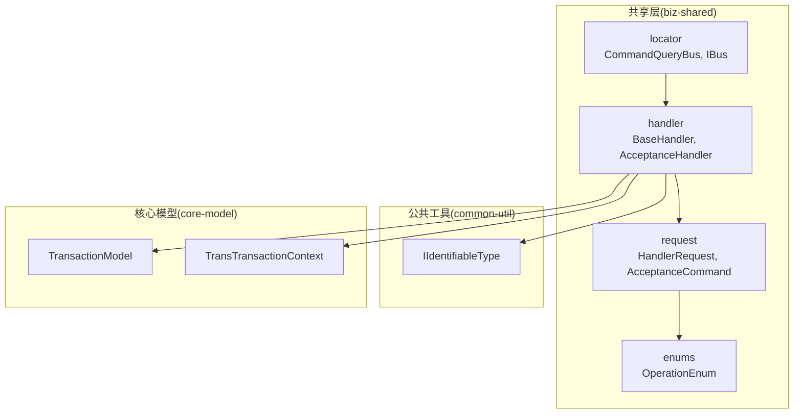
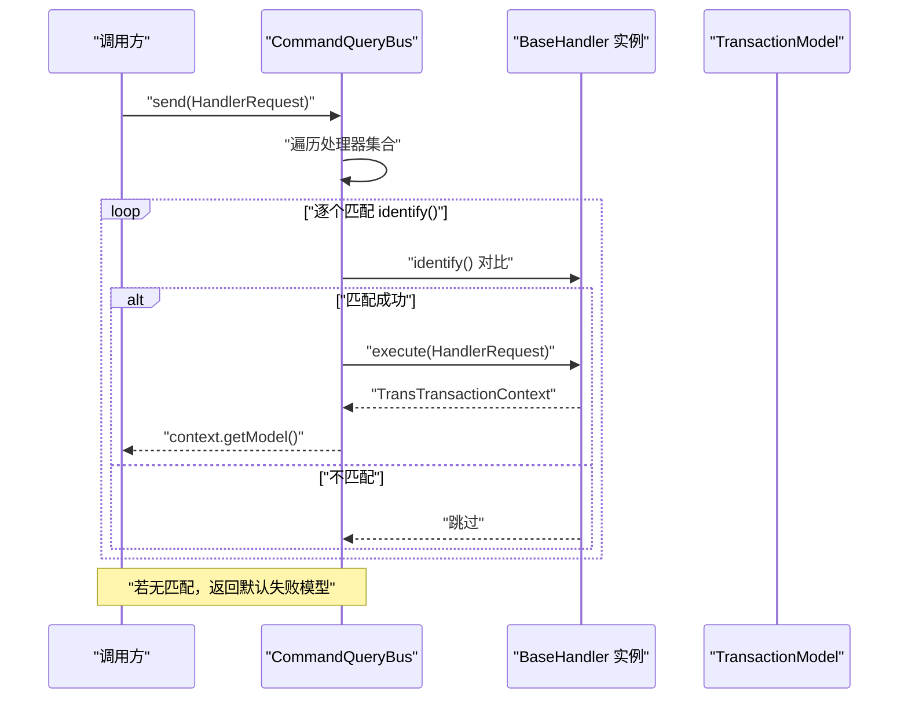
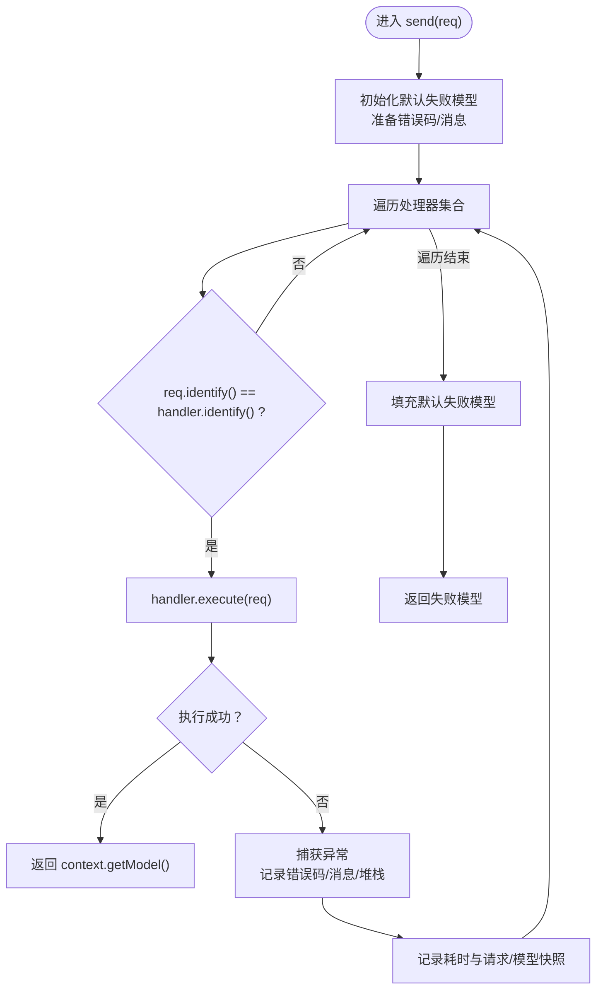
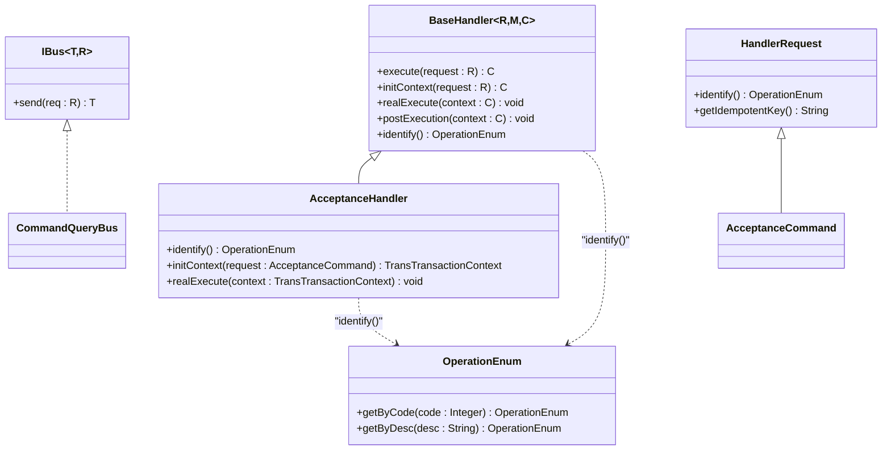
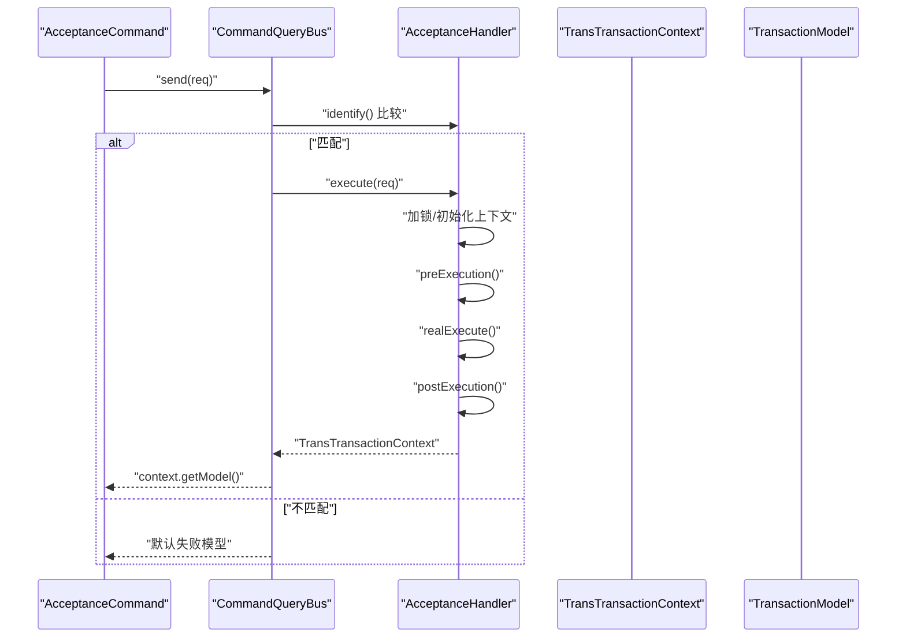
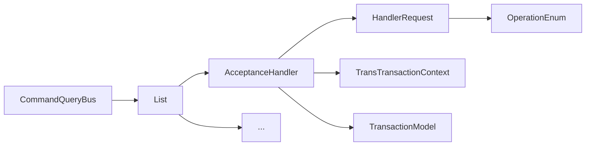

# 总线定位器

<cite>
**本文引用的文件**
- [CommandQueryBus.java](file://biz-shared/src/main/java/com/magicliang/transaction/sys/biz/shared/locator/CommandQueryBus.java)
- [IBus.java](file://biz-shared/src/main/java/com/magicliang/transaction/sys/biz/shared/locator/IBus.java)
- [BaseHandler.java](file://biz-shared/src/main/java/com/magicliang/transaction/sys/biz/shared/handler/BaseHandler.java)
- [HandlerRequest.java](file://biz-shared/src/main/java/com/magicliang/transaction/sys/biz/shared/request/HandlerRequest.java)
- [AcceptanceHandler.java](file://biz-shared/src/main/java/com/magicliang/transaction/sys/biz/shared/handler/AcceptanceHandler.java)
- [AcceptanceCommand.java](file://biz-shared/src/main/java/com/magicliang/transaction/sys/biz/shared/request/acceptance/AcceptanceCommand.java)
- [OperationEnum.java](file://biz-shared/src/main/java/com/magicliang/transaction/sys/biz/shared/enums/OperationEnum.java)
- [IIdentifiableType.java](file://common-util/src/main/java/com/magicliang/transaction/sys/common/type/IIdentifiableType.java)
- [TransactionModel.java](file://core-model/src/main/java/com/magicliang/transaction/sys/core/model/context/TransactionModel.java)
- [TransTransactionContext.java](file://core-model/src/main/java/com/magicliang/transaction/sys/core/model/context/TransTransactionContext.java)
</cite>

## 目录
1. [引言](#引言)
2. [项目结构](#项目结构)
3. [核心组件](#核心组件)
4. [架构总览](#架构总览)
5. [详细组件分析](#详细组件分析)
6. [依赖分析](#依赖分析)
7. [性能考虑](#性能考虑)
8. [故障排查指南](#故障排查指南)
9. [结论](#结论)
10. [附录](#附录)

## 引言
本文件围绕“总线定位器”展开，重点阐述命令/查询总线 CommandQueryBus 的设计理念与实现机制，解释 IBus 接口的抽象能力与多态性设计，并深入说明命令与查询的分发机制（处理器注册、查找与调用流程）。同时，文档覆盖总线在依赖注入与运行时解析中的作用，以及如何通过总线实现业务逻辑的动态绑定；最后提供扩展方法与自定义总线的开发指南，帮助在复杂业务场景中以总线模式实现灵活的业务编排。

## 项目结构
总线定位器位于共享模块 biz-shared 的 locator 包中，配合 handler 与 request 子包共同构成“请求-处理器-上下文-模型”的闭环。核心文件如下：
- 定位器与接口：CommandQueryBus、IBus
- 抽象处理器：BaseHandler
- 请求基类：HandlerRequest
- 典型处理器与请求：AcceptanceHandler、AcceptanceCommand
- 识别接口：IIdentifiableType
- 枚举：OperationEnum
- 核心模型与上下文：TransactionModel、TransTransactionContext

图表来源
- [CommandQueryBus.java:1-79](file://biz-shared/src/main/java/com/magicliang/transaction/sys/biz/shared/locator/CommandQueryBus.java#L1-L79)
- [IBus.java:1-26](file://biz-shared/src/main/java/com/magicliang/transaction/sys/biz/shared/locator/IBus.java#L1-L26)
- [BaseHandler.java:1-244](file://biz-shared/src/main/java/com/magicliang/transaction/sys/biz/shared/handler/BaseHandler.java#L1-L244)
- [HandlerRequest.java:1-46](file://biz-shared/src/main/java/com/magicliang/transaction/sys/biz/shared/request/HandlerRequest.java#L1-L46)
- [AcceptanceHandler.java:1-231](file://biz-shared/src/main/java/com/magicliang/transaction/sys/biz/shared/handler/AcceptanceHandler.java#L1-L231)
- [AcceptanceCommand.java:1-74](file://biz-shared/src/main/java/com/magicliang/transaction/sys/biz/shared/request/acceptance/AcceptanceCommand.java#L1-L74)
- [OperationEnum.java:1-97](file://biz-shared/src/main/java/com/magicliang/transaction/sys/biz/shared/enums/OperationEnum.java#L1-L97)
- [IIdentifiableType.java:1-21](file://common-util/src/main/java/com/magicliang/transaction/sys/common/type/IIdentifiableType.java#L1-L21)
- [TransactionModel.java:1-44](file://core-model/src/main/java/com/magicliang/transaction/sys/core/model/context/TransactionModel.java#L1-L44)
- [TransTransactionContext.java:1-139](file://core-model/src/main/java/com/magicliang/transaction/sys/core/model/context/TransTransactionContext.java#L1-L139)

章节来源
- [CommandQueryBus.java:1-79](file://biz-shared/src/main/java/com/magicliang/transaction/sys/biz/shared/locator/CommandQueryBus.java#L1-L79)
- [IBus.java:1-26](file://biz-shared/src/main/java/com/magicliang/transaction/sys/biz/shared/locator/IBus.java#L1-L26)

## 核心组件
- IBus 接口：定义统一的 send(R req) 分发入口，约束请求与交易模型的泛型关系，体现接口抽象与多态性。
- CommandQueryBus 实现：通过 Spring 注入收集所有 BaseHandler 实例，按请求类型识别（OperationEnum）进行匹配与执行，负责异常捕获、日志记录与耗时统计。
- BaseHandler 抽象处理器：封装分布式锁、上下文初始化、前置/真实/后置执行阶段、幂等键生成与清理等横切逻辑，屏蔽各领域活动细节。
- HandlerRequest 请求基类：提供幂等键生成策略与基础字段（来源系统、业务标识等），统一请求识别能力。
- AcceptanceHandler/AcceptanceCommand：受理场景的典型实现，演示如何通过 identify() 将请求与处理器绑定。
- OperationEnum：操作类型枚举，作为识别码贯穿请求与处理器。
- TransactionModel/TransTransactionContext：承载领域模型与跨活动的上下文数据，支持幂等标记与错误信息回填。

章节来源
- [IBus.java:17-26](file://biz-shared/src/main/java/com/magicliang/transaction/sys/biz/shared/locator/IBus.java#L17-L26)
- [CommandQueryBus.java:42-77](file://biz-shared/src/main/java/com/magicliang/transaction/sys/biz/shared/locator/CommandQueryBus.java#L42-L77)
- [BaseHandler.java:38-121](file://biz-shared/src/main/java/com/magicliang/transaction/sys/biz/shared/handler/BaseHandler.java#L38-L121)
- [HandlerRequest.java:18-46](file://biz-shared/src/main/java/com/magicliang/transaction/sys/biz/shared/request/HandlerRequest.java#L18-L46)
- [AcceptanceHandler.java:32-80](file://biz-shared/src/main/java/com/magicliang/transaction/sys/biz/shared/handler/AcceptanceHandler.java#L32-L80)
- [AcceptanceCommand.java:21-72](file://biz-shared/src/main/java/com/magicliang/transaction/sys/biz/shared/request/acceptance/AcceptanceCommand.java#L21-L72)
- [OperationEnum.java:18-49](file://biz-shared/src/main/java/com/magicliang/transaction/sys/biz/shared/enums/OperationEnum.java#L18-L49)
- [TransactionModel.java:17-43](file://core-model/src/main/java/com/magicliang/transaction/sys/core/model/context/TransactionModel.java#L17-L43)
- [TransTransactionContext.java:27-138](file://core-model/src/main/java/com/magicliang/transaction/sys/core/model/context/TransTransactionContext.java#L27-L138)

## 架构总览
总线模式将“请求识别—处理器分发—上下文执行—模型产出”解耦，形成可扩展的业务编排中心。CommandQueryBus 作为调度者，依赖 Spring 运行时解析所有实现了 IIdentifiableType 的处理器；每个处理器负责自身领域的上下文生命周期与活动编排。

图表来源
- [CommandQueryBus.java:42-77](file://biz-shared/src/main/java/com/magicliang/transaction/sys/biz/shared/locator/CommandQueryBus.java#L42-L77)
- [BaseHandler.java:93-121](file://biz-shared/src/main/java/com/magicliang/transaction/sys/biz/shared/handler/BaseHandler.java#L93-L121)
- [HandlerRequest.java:18-46](file://biz-shared/src/main/java/com/magicliang/transaction/sys/biz/shared/request/HandlerRequest.java#L18-L46)
- [OperationEnum.java:18-49](file://biz-shared/src/main/java/com/magicliang/transaction/sys/biz/shared/enums/OperationEnum.java#L18-L49)

## 详细组件分析

### CommandQueryBus 设计与实现
- 角色定位：集中式请求分发器，负责识别请求类型并委派给对应处理器。
- 处理器集合：通过 Spring 注入 List<BaseHandler>，自动收集所有可用处理器。
- 分发策略：遍历处理器，比较 HandlerRequest.identify() 与处理器 identify()，命中即执行。
- 异常与回退：捕获业务异常与未知异常，记录错误码/错误信息与堆栈摘要；若无匹配处理器，返回默认失败模型（包含预设错误码与错误信息）。
- 性能与可观测性：记录执行耗时与请求/模型快照，便于追踪与优化。

图表来源
- [CommandQueryBus.java:42-77](file://biz-shared/src/main/java/com/magicliang/transaction/sys/biz/shared/locator/CommandQueryBus.java#L42-L77)

章节来源
- [CommandQueryBus.java:27-77](file://biz-shared/src/main/java/com/magicliang/transaction/sys/biz/shared/locator/CommandQueryBus.java#L27-L77)

### IBus 接口与多态性设计
- 泛型约束：T extends TransactionModel、R extends HandlerRequest，确保 send 方法在编译期约束输入输出类型。
- 多态性：不同处理器通过 identify() 返回 OperationEnum 的具体枚举值，实现“同一接口、多种行为”的多态绑定。
- 扩展性：新增业务只需实现新的 HandlerRequest 与对应的 BaseHandler 子类，并在 identify() 中返回唯一 OperationEnum，即可被总线自动发现与分发。

图表来源
- [IBus.java:17-26](file://biz-shared/src/main/java/com/magicliang/transaction/sys/biz/shared/locator/IBus.java#L17-L26)
- [HandlerRequest.java:18-46](file://biz-shared/src/main/java/com/magicliang/transaction/sys/biz/shared/request/HandlerRequest.java#L18-L46)
- [BaseHandler.java:38-121](file://biz-shared/src/main/java/com/magicliang/transaction/sys/biz/shared/handler/BaseHandler.java#L38-L121)
- [AcceptanceHandler.java:32-80](file://biz-shared/src/main/java/com/magicliang/transaction/sys/biz/shared/handler/AcceptanceHandler.java#L32-L80)
- [OperationEnum.java:18-49](file://biz-shared/src/main/java/com/magicliang/transaction/sys/biz/shared/enums/OperationEnum.java#L18-L49)

章节来源
- [IBus.java:17-26](file://biz-shared/src/main/java/com/magicliang/transaction/sys/biz/shared/locator/IBus.java#L17-L26)
- [HandlerRequest.java:18-46](file://biz-shared/src/main/java/com/magicliang/transaction/sys/biz/shared/request/HandlerRequest.java#L18-L46)
- [OperationEnum.java:18-49](file://biz-shared/src/main/java/com/magicliang/transaction/sys/biz/shared/enums/OperationEnum.java#L18-L49)

### 处理器注册、查找与调用流程
- 注册：所有 BaseHandler 子类通过 Spring 组件注解（如 @Service）被容器管理；CommandQueryBus 通过 List<BaseHandler> 自动注入全部处理器。
- 查找：CommandQueryBus 遍历处理器集合，比较 HandlerRequest.identify() 与处理器 identify() 的返回值（OperationEnum）。
- 调用：匹配成功后，调用处理器 execute()，该方法内部完成分布式锁、上下文初始化、前置/真实/后置执行与上下文清理。
- 结果：返回 TransTransactionContext 中的 TransactionModel，供上层使用。

图表来源
- [CommandQueryBus.java:42-77](file://biz-shared/src/main/java/com/magicliang/transaction/sys/biz/shared/locator/CommandQueryBus.java#L42-L77)
- [AcceptanceHandler.java:32-80](file://biz-shared/src/main/java/com/magicliang/transaction/sys/biz/shared/handler/AcceptanceHandler.java#L32-L80)
- [BaseHandler.java:93-121](file://biz-shared/src/main/java/com/magicliang/transaction/sys/biz/shared/handler/BaseHandler.java#L93-L121)
- [AcceptanceCommand.java:68-72](file://biz-shared/src/main/java/com/magicliang/transaction/sys/biz/shared/request/acceptance/AcceptanceCommand.java#L68-L72)

章节来源
- [CommandQueryBus.java:42-77](file://biz-shared/src/main/java/com/magicliang/transaction/sys/biz/shared/locator/CommandQueryBus.java#L42-L77)
- [BaseHandler.java:93-121](file://biz-shared/src/main/java/com/magicliang/transaction/sys/biz/shared/handler/BaseHandler.java#L93-L121)
- [AcceptanceHandler.java:32-80](file://biz-shared/src/main/java/com/magicliang/transaction/sys/biz/shared/handler/AcceptanceHandler.java#L32-L80)

### 依赖注入与运行时解析
- 处理器集合注入：CommandQueryBus 通过 List<BaseHandler> 获取所有处理器实例，体现了 Spring 的“按类型收集”能力。
- 请求识别：HandlerRequest 与 BaseHandler 均实现 IIdentifiableType，统一通过 identify() 返回 OperationEnum，保证识别一致性。
- 动态绑定：新增处理器仅需实现 identify() 与 execute() 的业务逻辑，无需修改总线或现有处理器，天然支持开闭原则。

章节来源
- [CommandQueryBus.java:32-33](file://biz-shared/src/main/java/com/magicliang/transaction/sys/biz/shared/locator/CommandQueryBus.java#L32-L33)
- [HandlerRequest.java:18-46](file://biz-shared/src/main/java/com/magicliang/transaction/sys/biz/shared/request/HandlerRequest.java#L18-L46)
- [BaseHandler.java:38-40](file://biz-shared/src/main/java/com/magicliang/transaction/sys/biz/shared/handler/BaseHandler.java#L38-L40)
- [IIdentifiableType.java:12-20](file://common-util/src/main/java/com/magicliang/transaction/sys/common/type/IIdentifiableType.java#L12-L20)

### 业务模型与上下文
- TransactionModel：承载领域模型（支付订单）、成功标志、幂等标志、错误码与错误信息，作为处理器执行结果的载体。
- TransTransactionContext：跨活动的上下文容器，包含各阶段请求/响应与完成状态，支持在处理器间传递与复用。

章节来源
- [TransactionModel.java:17-43](file://core-model/src/main/java/com/magicliang/transaction/sys/core/model/context/TransactionModel.java#L17-L43)
- [TransTransactionContext.java:27-138](file://core-model/src/main/java/com/magicliang/transaction/sys/core/model/context/TransTransactionContext.java#L27-L138)

## 依赖分析
- 组件内聚与耦合
  - CommandQueryBus 与 BaseHandler 通过识别接口解耦，仅依赖 identify() 的约定。
  - BaseHandler 依赖分布式锁、领域活动与服务，但对外暴露统一的 execute() 生命周期。
  - HandlerRequest 与 OperationEnum 提供稳定的识别契约，降低上层与实现细节的耦合。
- 外部依赖
  - Spring：依赖注入与组件扫描，实现处理器自动注册与总线聚合。
  - 日志与异常：统一记录与回填错误信息，保障可观测性与可恢复性。

图表来源
- [CommandQueryBus.java:32-33](file://biz-shared/src/main/java/com/magicliang/transaction/sys/biz/shared/locator/CommandQueryBus.java#L32-L33)
- [AcceptanceHandler.java:32-80](file://biz-shared/src/main/java/com/magicliang/transaction/sys/biz/shared/handler/AcceptanceHandler.java#L32-L80)
- [HandlerRequest.java:18-46](file://biz-shared/src/main/java/com/magicliang/transaction/sys/biz/shared/request/HandlerRequest.java#L18-L46)
- [OperationEnum.java:18-49](file://biz-shared/src/main/java/com/magicliang/transaction/sys/biz/shared/enums/OperationEnum.java#L18-L49)
- [TransTransactionContext.java:27-138](file://core-model/src/main/java/com/magicliang/transaction/sys/core/model/context/TransTransactionContext.java#L27-L138)
- [TransactionModel.java:17-43](file://core-model/src/main/java/com/magicliang/transaction/sys/core/model/context/TransactionModel.java#L17-L43)

章节来源
- [CommandQueryBus.java:32-33](file://biz-shared/src/main/java/com/magicliang/transaction/sys/biz/shared/locator/CommandQueryBus.java#L32-L33)
- [BaseHandler.java:38-121](file://biz-shared/src/main/java/com/magicliang/transaction/sys/biz/shared/handler/BaseHandler.java#L38-L121)
- [HandlerRequest.java:18-46](file://biz-shared/src/main/java/com/magicliang/transaction/sys/biz/shared/request/HandlerRequest.java#L18-L46)
- [OperationEnum.java:18-49](file://biz-shared/src/main/java/com/magicliang/transaction/sys/biz/shared/enums/OperationEnum.java#L18-L49)
- [TransTransactionContext.java:27-138](file://core-model/src/main/java/com/magicliang/transaction/sys/core/model/context/TransTransactionContext.java#L27-L138)
- [TransactionModel.java:17-43](file://core-model/src/main/java/com/magicliang/transaction/sys/core/model/context/TransactionModel.java#L17-L43)

## 性能考虑
- 处理器遍历：当前实现为线性扫描，处理器数量增长时可能影响分发性能。建议在处理器较多场景引入映射表（如按 OperationEnum 预索引）以降低查找成本。
- 分布式锁：处理器执行全程受分布式锁保护，避免并发冲突，但需关注锁粒度与超时配置，防止热点竞争导致延迟放大。
- 日志与序列化：执行耗时统计与请求/模型快照打印有助于诊断，但在高并发场景应控制日志级别与序列化开销。
- 幂等与回退：异常路径与默认失败模型可快速返回，减少无效计算；建议结合熔断与限流策略提升整体稳定性。

## 故障排查指南
- 无匹配处理器
  - 现象：返回默认失败模型，错误码与错误信息来自预设。
  - 排查：确认请求 identify() 与处理器 identify() 返回值一致，且处理器被 Spring 正确注册。
- 业务异常
  - 现象：捕获 BaseTransException，错误码/消息从异常对象提取，堆栈摘要记录。
  - 排查：查看异常日志，定位具体处理器与执行阶段；核对幂等键与上下文状态。
- 未知异常
  - 现象：统一记录 unknown exception，便于定位未预期问题。
  - 排查：检查处理器实现与外部依赖（服务、数据库、RPC）的可用性。
- 幂等与终态校验
  - 现象：幂等命中时提前结束并标记成功；对已进入终态的支付订单进行错误码回填。
  - 排查：确认 populateNecessaryModel 与 getErrorMessage 的逻辑正确性，避免误判。

章节来源
- [CommandQueryBus.java:42-77](file://biz-shared/src/main/java/com/magicliang/transaction/sys/biz/shared/locator/CommandQueryBus.java#L42-L77)
- [BaseHandler.java:198-242](file://biz-shared/src/main/java/com/magicliang/transaction/sys/biz/shared/handler/BaseHandler.java#L198-L242)
- [AcceptanceHandler.java:106-128](file://biz-shared/src/main/java/com/magicliang/transaction/sys/biz/shared/handler/AcceptanceHandler.java#L106-L128)

## 结论
CommandQueryBus 通过 IBus 抽象与 IIdentifiableType 约定，将请求识别与处理器执行解耦，借助 Spring 实现处理器的自动注册与运行时解析。BaseHandler 统一了分布式锁、上下文生命周期与活动编排，使新增业务仅需实现识别与执行逻辑即可无缝接入。该模式在复杂业务场景中提供了良好的扩展性与可维护性，适合构建以“请求-处理器-上下文-模型”为核心的业务编排中心。

## 附录
- 扩展方法
  - 新增处理器：实现新的 HandlerRequest 与 BaseHandler 子类，重写 identify() 与 realExecute()，并在 Spring 中注册。
  - 自定义总线：可参考 IBus 泛型约束与 CommandQueryBus 的分发策略，实现更复杂的路由规则（如按租户/渠道/优先级）。
  - 性能优化：引入识别映射表、缓存常见处理器、异步日志与采样统计。
- 开发指南
  - 明确 OperationEnum 的取值与语义，确保 identify() 的唯一性与可读性。
  - 在处理器中严格遵循 execute() 生命周期，避免跨线程共享可变状态。
  - 使用幂等键与上下文完成幂等校验，必要时对终态数据进行错误码回填。
  - 通过 TransTransactionContext 串联各活动，保持模型一致性与可追踪性。