# 请求响应模型

<cite>
**本文引用的文件**
- [HandlerRequest.java](file://biz-shared/src/main/java/com/magicliang/transaction/sys/biz/shared/request/HandlerRequest.java)
- [HandlerCommand.java](file://biz-shared/src/main/java/com/magicliang/transaction/sys/biz/shared/request/HandlerCommand.java)
- [HandlerQuery.java](file://biz-shared/src/main/java/com/magicliang/transaction/sys/biz/shared/request/HandlerQuery.java)
- [PaymentCommand.java](file://biz-shared/src/main/java/com/magicliang/transaction/sys/biz/shared/request/payment/PaymentCommand.java)
- [AcceptanceCommand.java](file://biz-shared/src/main/java/com/magicliang/transaction/sys/biz/shared/request/acceptance/AcceptanceCommand.java)
- [NotificationCommand.java](file://biz-shared/src/main/java/com/magicliang/transaction/sys/biz/shared/request/notification/NotificationCommand.java)
- [CallbackCommand.java](file://biz-shared/src/main/java/com/magicliang/transaction/sys/biz/shared/request/callback/CallbackCommand.java)
- [OperationEnum.java](file://biz-shared/src/main/java/com/magicliang/transaction/sys/biz/shared/enums/OperationEnum.java)
- [BaseHandler.java](file://biz-shared/src/main/java/com/magicliang/transaction/sys/biz/shared/handler/BaseHandler.java)
- [PaymentHandler.java](file://biz-shared/src/main/java/com/magicliang/transaction/sys/biz/shared/handler/PaymentHandler.java)
- [AcceptanceHandler.java](file://biz-shared/src/main/java/com/magicliang/transaction/sys/biz/shared/handler/AcceptanceHandler.java)
- [NotificationHandler.java](file://biz-shared/src/main/java/com/magicliang/transaction/sys/biz/shared/handler/NotificationHandler.java)
- [CallbackHandler.java](file://biz-shared/src/main/java/com/magicliang/transaction/sys/biz/shared/handler/CallbackHandler.java)
- [CommandQueryBus.java](file://biz-shared/src/main/java/com/magicliang/transaction/sys/biz/shared/locator/CommandQueryBus.java)
- [IResponse.java](file://core-model/src/main/java/com/magicliang/transaction/sys/core/model/response/IResponse.java)
- [PaymentResponse.java](file://core-model/src/main/java/com/magicliang/transaction/sys/core/model/response/payment/PaymentResponse.java)
</cite>

## 目录
1. [引言](#引言)
2. [项目结构](#项目结构)
3. [核心组件](#核心组件)
4. [架构总览](#架构总览)
5. [详细组件分析](#详细组件分析)
6. [依赖分析](#依赖分析)
7. [性能考量](#性能考量)
8. [故障排查指南](#故障排查指南)
9. [结论](#结论)
10. [附录](#附录)

## 引言
本文件围绕“请求响应模型”展开，系统性阐述 HandlerCommand、HandlerQuery、HandlerRequest 等基类的设计理念与职责分离原则；详解支付、受理、通知、回调等业务类型的命令对象设计（字段定义、验证规则、序列化机制）；阐明命令对象与响应对象的对应关系，并说明如何通过统一的请求响应模型实现业务逻辑的标准化与可扩展性。文末提供使用示例与最佳实践，帮助读者正确创建与使用各类命令对象。

## 项目结构
该系统采用分层与领域驱动相结合的组织方式：
- biz-shared：共享层，包含请求模型、处理器基类、命令总线与业务枚举等
- core-model：核心模型层，包含领域实体、请求/响应模型、事件等
- core-service：核心服务层，包含领域活动、策略与服务实现
- common-*：公共模块，提供工具、常量、异常与集成能力

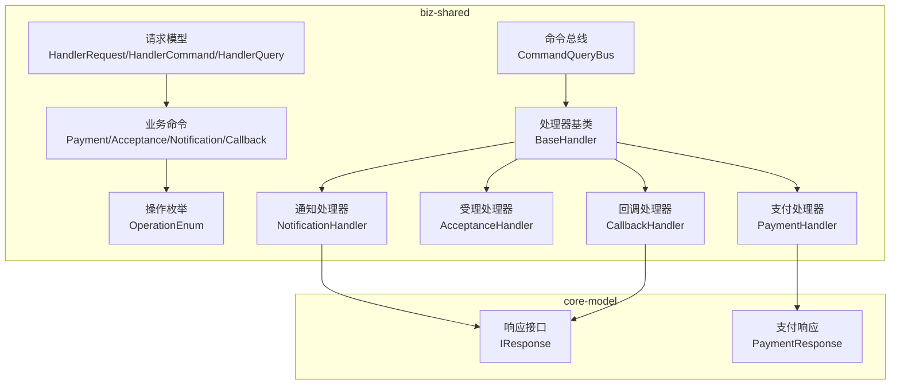

图表来源
- [HandlerRequest.java:1-46](file://biz-shared/src/main/java/com/magicliang/transaction/sys/biz/shared/request/HandlerRequest.java#L1-L46)
- [HandlerCommand.java:1-15](file://biz-shared/src/main/java/com/magicliang/transaction/sys/biz/shared/request/HandlerCommand.java#L1-L15)
- [HandlerQuery.java:1-14](file://biz-shared/src/main/java/com/magicliang/transaction/sys/biz/shared/request/HandlerQuery.java#L1-L14)
- [OperationEnum.java:1-97](file://biz-shared/src/main/java/com/magicliang/transaction/sys/biz/shared/enums/OperationEnum.java#L1-L97)
- [CommandQueryBus.java:1-79](file://biz-shared/src/main/java/com/magicliang/transaction/sys/biz/shared/locator/CommandQueryBus.java#L1-L79)
- [BaseHandler.java:1-244](file://biz-shared/src/main/java/com/magicliang/transaction/sys/biz/shared/handler/BaseHandler.java#L1-L244)
- [PaymentHandler.java:1-139](file://biz-shared/src/main/java/com/magicliang/transaction/sys/biz/shared/handler/PaymentHandler.java#L1-L139)
- [AcceptanceHandler.java:1-231](file://biz-shared/src/main/java/com/magicliang/transaction/sys/biz/shared/handler/AcceptanceHandler.java#L1-L231)
- [NotificationHandler.java:1-139](file://biz-shared/src/main/java/com/magicliang/transaction/sys/biz/shared/handler/NotificationHandler.java#L1-L139)
- [CallbackHandler.java:1-190](file://biz-shared/src/main/java/com/magicliang/transaction/sys/biz/shared/handler/CallbackHandler.java#L1-L190)
- [IResponse.java:1-15](file://core-model/src/main/java/com/magicliang/transaction/sys/core/model/response/IResponse.java#L1-L15)
- [PaymentResponse.java:1-28](file://core-model/src/main/java/com/magicliang/transaction/sys/core/model/response/payment/PaymentResponse.java#L1-L28)

章节来源
- [HandlerRequest.java:1-46](file://biz-shared/src/main/java/com/magicliang/transaction/sys/biz/shared/request/HandlerRequest.java#L1-L46)
- [HandlerCommand.java:1-15](file://biz-shared/src/main/java/com/magicliang/transaction/sys/biz/shared/request/HandlerCommand.java#L1-L15)
- [HandlerQuery.java:1-14](file://biz-shared/src/main/java/com/magicliang/transaction/sys/biz/shared/request/HandlerQuery.java#L1-L14)
- [OperationEnum.java:1-97](file://biz-shared/src/main/java/com/magicliang/transaction/sys/biz/shared/enums/OperationEnum.java#L1-L97)
- [CommandQueryBus.java:1-79](file://biz-shared/src/main/java/com/magicliang/transaction/sys/biz/shared/locator/CommandQueryBus.java#L1-L79)
- [BaseHandler.java:1-244](file://biz-shared/src/main/java/com/magicliang/transaction/sys/biz/shared/handler/BaseHandler.java#L1-L244)
- [PaymentHandler.java:1-139](file://biz-shared/src/main/java/com/magicliang/transaction/sys/biz/shared/handler/PaymentHandler.java#L1-L139)
- [AcceptanceHandler.java:1-231](file://biz-shared/src/main/java/com/magicliang/transaction/sys/biz/shared/handler/AcceptanceHandler.java#L1-L231)
- [NotificationHandler.java:1-139](file://biz-shared/src/main/java/com/magicliang/transaction/sys/biz/shared/handler/NotificationHandler.java#L1-L139)
- [CallbackHandler.java:1-190](file://biz-shared/src/main/java/com/magicliang/transaction/sys/biz/shared/handler/CallbackHandler.java#L1-L190)
- [IResponse.java:1-15](file://core-model/src/main/java/com/magicliang/transaction/sys/core/model/response/IResponse.java#L1-L15)
- [PaymentResponse.java:1-28](file://core-model/src/main/java/com/magicliang/transaction/sys/core/model/response/payment/PaymentResponse.java#L1-L28)

## 核心组件
- HandlerRequest：统一请求基类，定义幂等键、上游系统标识、业务唯一标识等通用字段，提供幂等键计算方法
- HandlerCommand：命令型请求，继承自 HandlerRequest，用于表达“写入/变更”意图
- HandlerQuery：查询型请求，继承自 HandlerRequest，用于表达“只读/查询”意图
- OperationEnum：操作类型枚举，统一标识受理、支付、通知、回调等操作类型
- BaseHandler：处理器基类，定义执行流程骨架（加锁、上下文初始化、前置/真执行/后置、解锁清理），并提供幂等与状态校验能力
- CommandQueryBus：命令/查询分发总线，根据请求类型匹配处理器并执行

章节来源
- [HandlerRequest.java:18-46](file://biz-shared/src/main/java/com/magicliang/transaction/sys/biz/shared/request/HandlerRequest.java#L18-L46)
- [HandlerCommand.java:12-14](file://biz-shared/src/main/java/com/magicliang/transaction/sys/biz/shared/request/HandlerCommand.java#L12-L14)
- [HandlerQuery.java:12-13](file://biz-shared/src/main/java/com/magicliang/transaction/sys/biz/shared/request/HandlerQuery.java#L12-L13)
- [OperationEnum.java:18-49](file://biz-shared/src/main/java/com/magicliang/transaction/sys/biz/shared/enums/OperationEnum.java#L18-L49)
- [BaseHandler.java:93-121](file://biz-shared/src/main/java/com/magicliang/transaction/sys/biz/shared/handler/BaseHandler.java#L93-L121)
- [CommandQueryBus.java:42-77](file://biz-shared/src/main/java/com/magicliang/transaction/sys/biz/shared/locator/CommandQueryBus.java#L42-L77)

## 架构总览
统一请求响应模型通过“请求基类 + 操作枚举 + 处理器基类 + 总线分发”的方式，将不同业务命令对象标准化，确保：
- 统一的幂等键与身份识别
- 统一的执行生命周期与错误处理
- 统一的响应接口与最小上下文暴露

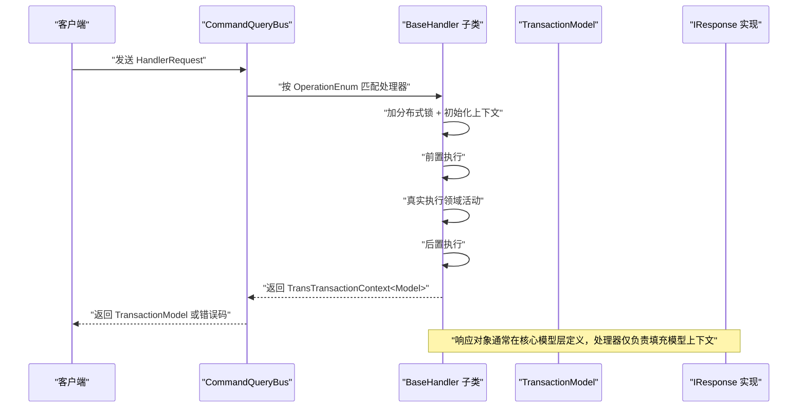

图表来源
- [CommandQueryBus.java:42-77](file://biz-shared/src/main/java/com/magicliang/transaction/sys/biz/shared/locator/CommandQueryBus.java#L42-L77)
- [BaseHandler.java:93-121](file://biz-shared/src/main/java/com/magicliang/transaction/sys/biz/shared/handler/BaseHandler.java#L93-L121)
- [IResponse.java:12-14](file://core-model/src/main/java/com/magicliang/transaction/sys/core/model/response/IResponse.java#L12-L14)

## 详细组件分析

### 基类设计与职责分离
- HandlerRequest：集中定义幂等键、上游系统标识、业务唯一标识等跨业务通用字段，避免重复代码
- HandlerCommand/HandlerQuery：通过继承 HandlerRequest，分别承载“写入/变更”和“只读/查询”的语义，便于总线分发与处理器选择
- OperationEnum：为每个命令对象提供统一的类型标识，使处理器与总线能按类型路由

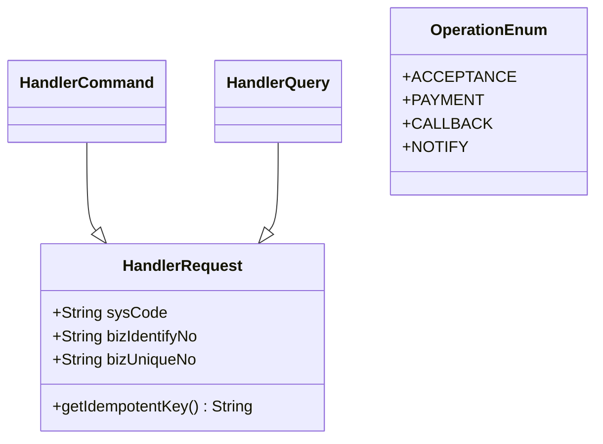

图表来源
- [HandlerRequest.java:18-46](file://biz-shared/src/main/java/com/magicliang/transaction/sys/biz/shared/request/HandlerRequest.java#L18-L46)
- [HandlerCommand.java:12-14](file://biz-shared/src/main/java/com/magicliang/transaction/sys/biz/shared/request/HandlerCommand.java#L12-L14)
- [HandlerQuery.java:12-13](file://biz-shared/src/main/java/com/magicliang/transaction/sys/biz/shared/request/HandlerQuery.java#L12-L13)
- [OperationEnum.java:18-49](file://biz-shared/src/main/java/com/magicliang/transaction/sys/biz/shared/enums/OperationEnum.java#L18-L49)

章节来源
- [HandlerRequest.java:18-46](file://biz-shared/src/main/java/com/magicliang/transaction/sys/biz/shared/request/HandlerRequest.java#L18-L46)
- [HandlerCommand.java:12-14](file://biz-shared/src/main/java/com/magicliang/transaction/sys/biz/shared/request/HandlerCommand.java#L12-L14)
- [HandlerQuery.java:12-13](file://biz-shared/src/main/java/com/magicliang/transaction/sys/biz/shared/request/HandlerQuery.java#L12-L13)
- [OperationEnum.java:18-49](file://biz-shared/src/main/java/com/magicliang/transaction/sys/biz/shared/enums/OperationEnum.java#L18-L49)

### 支付命令 PaymentCommand
- 字段定义：支持直接传入完整支付订单或通过支付订单号与业务标识进行查询
- 验证规则：identify() 明确类型为支付；处理器侧会校验模型是否填充成功、是否处于终态
- 序列化机制：使用 Lombok 注解，遵循 Java Bean 规范，便于 JSON 序列化/反序列化
- 与响应的关系：处理器填充 TransactionModel，最终由上层统一返回模型；支付响应对象在核心模型层定义

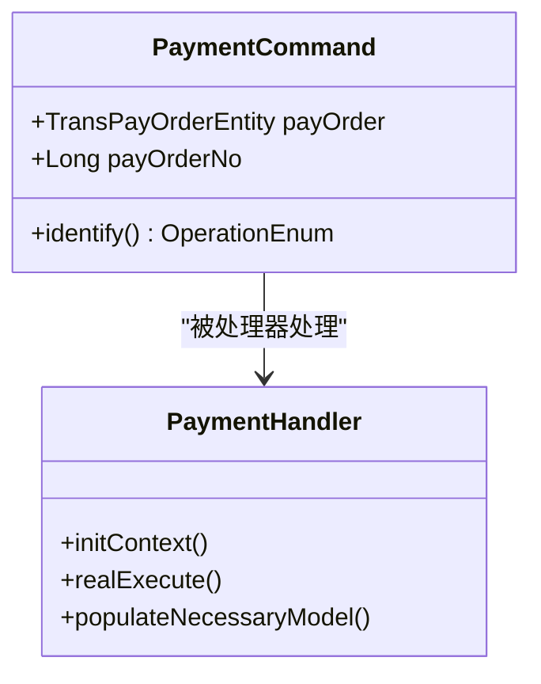

图表来源
- [PaymentCommand.java:20-42](file://biz-shared/src/main/java/com/magicliang/transaction/sys/biz/shared/request/payment/PaymentCommand.java#L20-L42)
- [PaymentHandler.java:47-88](file://biz-shared/src/main/java/com/magicliang/transaction/sys/biz/shared/handler/PaymentHandler.java#L47-L88)

章节来源
- [PaymentCommand.java:18-42](file://biz-shared/src/main/java/com/magicliang/transaction/sys/biz/shared/request/payment/PaymentCommand.java#L18-L42)
- [PaymentHandler.java:47-138](file://biz-shared/src/main/java/com/magicliang/transaction/sys/biz/shared/handler/PaymentHandler.java#L47-L138)

### 受理命令 AcceptanceCommand
- 字段定义：金额、会计分录方向、备注、业务主体、回调地址、扩展信息（平台/业务）
- 验证规则：identify() 明确类型为受理；处理器侧会生成支付订单与子订单，校验幂等与终态
- 序列化机制：Lombok 注解，支持 JSON 序列化
- 与响应的关系：处理器生成领域模型并触发领域事件，最终统一返回模型

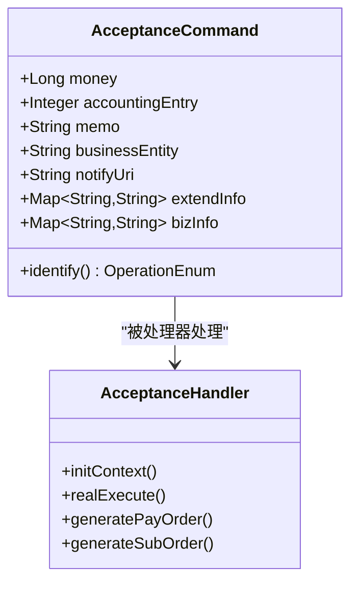

图表来源
- [AcceptanceCommand.java:21-71](file://biz-shared/src/main/java/com/magicliang/transaction/sys/biz/shared/request/acceptance/AcceptanceCommand.java#L21-L71)
- [AcceptanceHandler.java:54-128](file://biz-shared/src/main/java/com/magicliang/transaction/sys/biz/shared/handler/AcceptanceHandler.java#L54-L128)

章节来源
- [AcceptanceCommand.java:19-71](file://biz-shared/src/main/java/com/magicliang/transaction/sys/biz/shared/request/acceptance/AcceptanceCommand.java#L19-L71)
- [AcceptanceHandler.java:54-229](file://biz-shared/src/main/java/com/magicliang/transaction/sys/biz/shared/handler/AcceptanceHandler.java#L54-L229)

### 通知命令 NotificationCommand
- 字段定义：支付订单号或支付订单对象、回调参数等
- 验证规则：identify() 明确类型为通知；处理器侧校验幂等与重试次数
- 序列化机制：Lombok 注解，支持 JSON 序列化
- 与响应的关系：处理器执行通知活动，最终统一返回模型

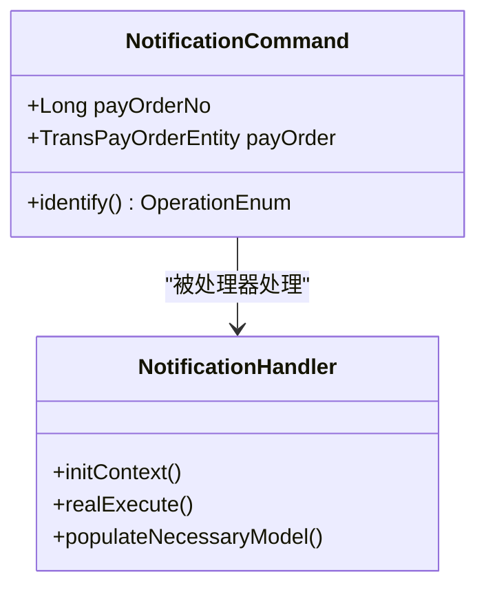

图表来源
- [NotificationCommand.java:20-41](file://biz-shared/src/main/java/com/magicliang/transaction/sys/biz/shared/request/notification/NotificationCommand.java#L20-L41)
- [NotificationHandler.java:49-136](file://biz-shared/src/main/java/com/magicliang/transaction/sys/biz/shared/handler/NotificationHandler.java#L49-L136)

章节来源
- [NotificationCommand.java:18-41](file://biz-shared/src/main/java/com/magicliang/transaction/sys/biz/shared/request/notification/NotificationCommand.java#L18-L41)
- [NotificationHandler.java:49-136](file://biz-shared/src/main/java/com/magicliang/transaction/sys/biz/shared/handler/NotificationHandler.java#L49-L136)

### 回调命令 CallbackCommand
- 字段定义：回调业务号、支付订单状态、回调时间、业务时间、回调参数、错误码/消息
- 验证规则：identify() 明确类型为回调；处理器侧校验状态枚举、幂等与终态约束
- 序列化机制：Lombok 注解，支持 JSON 序列化
- 与响应的关系：处理器更新支付订单与请求状态，最终统一返回模型

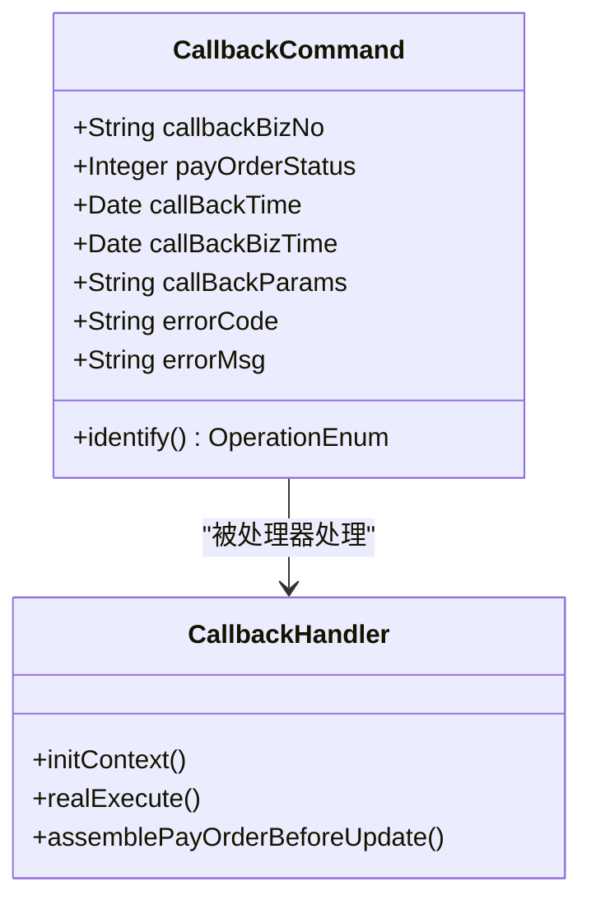

图表来源
- [CallbackCommand.java:20-65](file://biz-shared/src/main/java/com/magicliang/transaction/sys/biz/shared/request/callback/CallbackCommand.java#L20-L65)
- [CallbackHandler.java:51-189](file://biz-shared/src/main/java/com/magicliang/transaction/sys/biz/shared/handler/CallbackHandler.java#L51-L189)

章节来源
- [CallbackCommand.java:18-65](file://biz-shared/src/main/java/com/magicliang/transaction/sys/biz/shared/request/callback/CallbackCommand.java#L18-L65)
- [CallbackHandler.java:51-189](file://biz-shared/src/main/java/com/magicliang/transaction/sys/biz/shared/handler/CallbackHandler.java#L51-L189)

### 响应对象与统一模型
- IResponse：响应接口，约束最小上下文暴露，与具体策略解耦
- PaymentResponse：支付响应，包含渠道支付流水号与错误码
- 处理器通过填充 TransactionModel 返回结果，上层可据此构造 IResponse 或统一包装

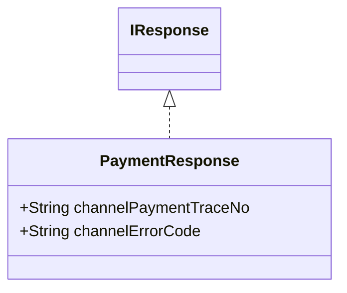

图表来源
- [IResponse.java:12-14](file://core-model/src/main/java/com/magicliang/transaction/sys/core/model/response/IResponse.java#L12-L14)
- [PaymentResponse.java:16-27](file://core-model/src/main/java/com/magicliang/transaction/sys/core/model/response/payment/PaymentResponse.java#L16-L27)

章节来源
- [IResponse.java:12-14](file://core-model/src/main/java/com/magicliang/transaction/sys/core/model/response/IResponse.java#L12-L14)
- [PaymentResponse.java:16-27](file://core-model/src/main/java/com/magicliang/transaction/sys/core/model/response/payment/PaymentResponse.java#L16-L27)

### 处理器执行流程与幂等
- BaseHandler.execute() 定义标准执行流程：加锁 → 初始化上下文 → 前置 → 真执行 → 后置 → 解锁清理
- 幂等键来自 HandlerRequest.getIdempotentKey()，处理器内使用分布式锁保证并发安全
- 处理器可对终态与退票状态进行校验，必要时提前结束并标记成功

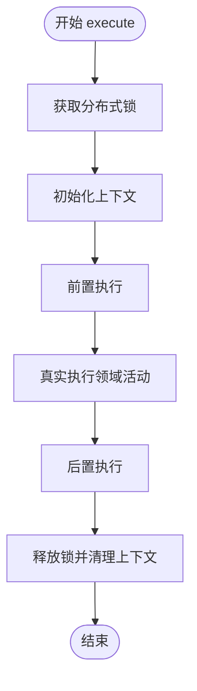

图表来源
- [BaseHandler.java:93-121](file://biz-shared/src/main/java/com/magicliang/transaction/sys/biz/shared/handler/BaseHandler.java#L93-L121)
- [HandlerRequest.java:42-44](file://biz-shared/src/main/java/com/magicliang/transaction/sys/biz/shared/request/HandlerRequest.java#L42-L44)

章节来源
- [BaseHandler.java:93-121](file://biz-shared/src/main/java/com/magicliang/transaction/sys/biz/shared/handler/BaseHandler.java#L93-L121)
- [HandlerRequest.java:42-44](file://biz-shared/src/main/java/com/magicliang/transaction/sys/biz/shared/request/HandlerRequest.java#L42-L44)

### 总线分发与类型路由
- CommandQueryBus 根据请求 identify() 与处理器 identify() 匹配，执行并返回 TransactionModel
- 发生异常时捕获并填充错误码/错误信息，最终返回兜底模型

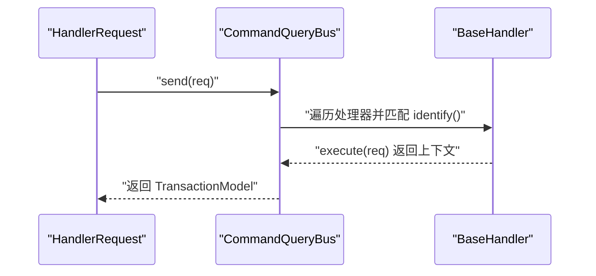

图表来源
- [CommandQueryBus.java:42-77](file://biz-shared/src/main/java/com/magicliang/transaction/sys/biz/shared/locator/CommandQueryBus.java#L42-L77)
- [BaseHandler.java:38-40](file://biz-shared/src/main/java/com/magicliang/transaction/sys/biz/shared/handler/BaseHandler.java#L38-L40)

章节来源
- [CommandQueryBus.java:42-77](file://biz-shared/src/main/java/com/magicliang/transaction/sys/biz/shared/locator/CommandQueryBus.java#L42-L77)
- [BaseHandler.java:38-40](file://biz-shared/src/main/java/com/magicliang/transaction/sys/biz/shared/handler/BaseHandler.java#L38-L40)

## 依赖分析
- 请求模型依赖：HandlerRequest 依赖 OperationEnum 与通用标识接口；各业务命令通过 identify() 指定类型
- 处理器依赖：BaseHandler 依赖分布式锁、支付订单服务、领域活动与上下文工厂；各处理器实现真实执行逻辑
- 总线依赖：CommandQueryBus 依赖处理器集合与异常封装，负责分发与兜底

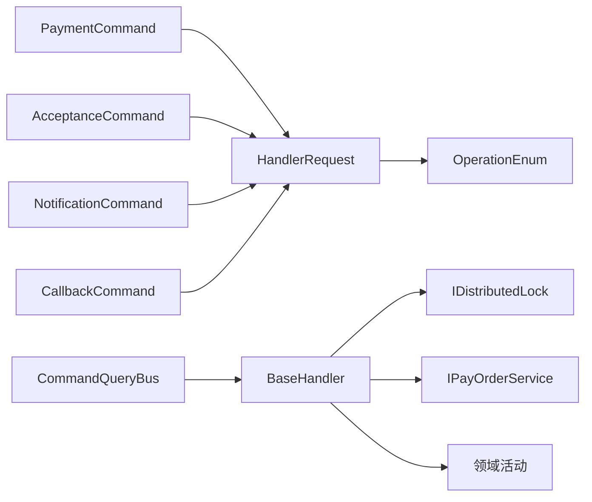

图表来源
- [HandlerRequest.java:18-46](file://biz-shared/src/main/java/com/magicliang/transaction/sys/biz/shared/request/HandlerRequest.java#L18-L46)
- [OperationEnum.java:18-49](file://biz-shared/src/main/java/com/magicliang/transaction/sys/biz/shared/enums/OperationEnum.java#L18-L49)
- [PaymentCommand.java:20-42](file://biz-shared/src/main/java/com/magicliang/transaction/sys/biz/shared/request/payment/PaymentCommand.java#L20-L42)
- [AcceptanceCommand.java:21-71](file://biz-shared/src/main/java/com/magicliang/transaction/sys/biz/shared/request/acceptance/AcceptanceCommand.java#L21-L71)
- [NotificationCommand.java:20-41](file://biz-shared/src/main/java/com/magicliang/transaction/sys/biz/shared/request/notification/NotificationCommand.java#L20-L41)
- [CallbackCommand.java:20-65](file://biz-shared/src/main/java/com/magicliang/transaction/sys/biz/shared/request/callback/CallbackCommand.java#L20-L65)
- [BaseHandler.java:46-85](file://biz-shared/src/main/java/com/magicliang/transaction/sys/biz/shared/handler/BaseHandler.java#L46-L85)
- [CommandQueryBus.java:32-33](file://biz-shared/src/main/java/com/magicliang/transaction/sys/biz/shared/locator/CommandQueryBus.java#L32-L33)

章节来源
- [HandlerRequest.java:18-46](file://biz-shared/src/main/java/com/magicliang/transaction/sys/biz/shared/request/HandlerRequest.java#L18-L46)
- [OperationEnum.java:18-49](file://biz-shared/src/main/java/com/magicliang/transaction/sys/biz/shared/enums/OperationEnum.java#L18-L49)
- [BaseHandler.java:46-85](file://biz-shared/src/main/java/com/magicliang/transaction/sys/biz/shared/handler/BaseHandler.java#L46-L85)
- [CommandQueryBus.java:32-33](file://biz-shared/src/main/java/com/magicliang/transaction/sys/biz/shared/locator/CommandQueryBus.java#L32-L33)

## 性能考量
- 幂等与锁：通过幂等键与分布式锁避免重复执行，减少无效写入与资源竞争
- 主库校验：处理器在初始化上下文时从主库校验幂等与模型完整性，降低回滚与重试成本
- 统一序列化：Lombok 提供高效序列化支持，结合日志打点与异常兜底，提升可观测性与稳定性

## 故障排查指南
- 幂等键为空：处理器在锁环绕前校验幂等键非空，避免无键执行
- 终态与退票：处理器对支付订单终态与退票状态进行校验，命中则提前结束并返回成功
- 异常捕获：总线捕获业务异常并填充错误码/错误信息，便于定位问题

章节来源
- [BaseHandler.java:176-178](file://biz-shared/src/main/java/com/magicliang/transaction/sys/biz/shared/handler/BaseHandler.java#L176-L178)
- [BaseHandler.java:222-232](file://biz-shared/src/main/java/com/magicliang/transaction/sys/biz/shared/handler/BaseHandler.java#L222-L232)
- [CommandQueryBus.java:55-63](file://biz-shared/src/main/java/com/magicliang/transaction/sys/biz/shared/locator/CommandQueryBus.java#L55-L63)

## 结论
通过 HandlerRequest/HandlerCommand/HandlerQuery 的基类设计与 OperationEnum 的统一类型标识，结合 BaseHandler 的执行骨架与 CommandQueryBus 的分发机制，系统实现了请求响应模型的标准化与可扩展性。支付、受理、通知、回调等业务命令对象在统一契约下具备清晰的字段定义、验证规则与序列化机制，配合处理器的幂等与终态校验，确保了业务逻辑的一致性与可靠性。

## 附录
- 使用示例与最佳实践（步骤说明）
  - 创建命令对象：根据业务场景选择 PaymentCommand、AcceptanceCommand、NotificationCommand 或 CallbackCommand，填写必填字段（如 sysCode、bizIdentifyNo、bizUniqueNo）
  - 设置幂等键：依赖 HandlerRequest.getIdempotentKey() 自动生成，确保同一业务标识与唯一号组合的全局唯一性
  - 发送请求：通过 CommandQueryBus.send() 发送请求，等待返回 TransactionModel
  - 处理响应：根据业务需要构造 IResponse 或统一包装，读取 channelPaymentTraceNo、channelErrorCode 等字段
  - 最佳实践
    - 严格区分 HandlerCommand 与 HandlerQuery 的语义，避免混用
    - 对支付类命令进行终态与退票状态校验，防止重复处理
    - 使用 Lombok 注解保持命令对象简洁、可序列化
    - 在高并发场景下依赖分布式锁与幂等键，避免重复写入