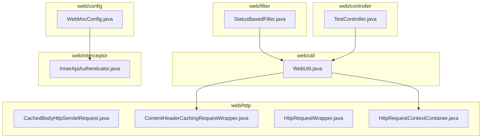
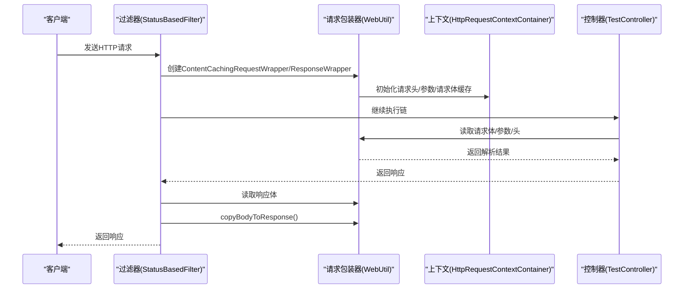
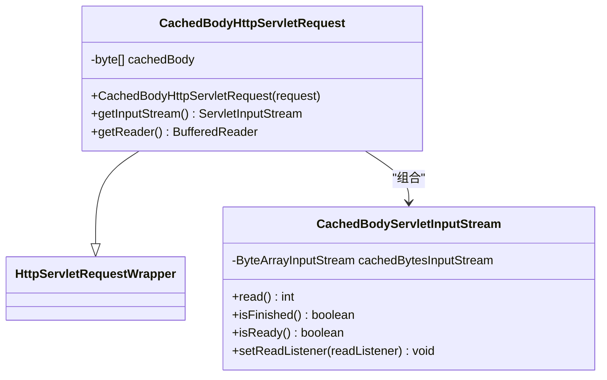
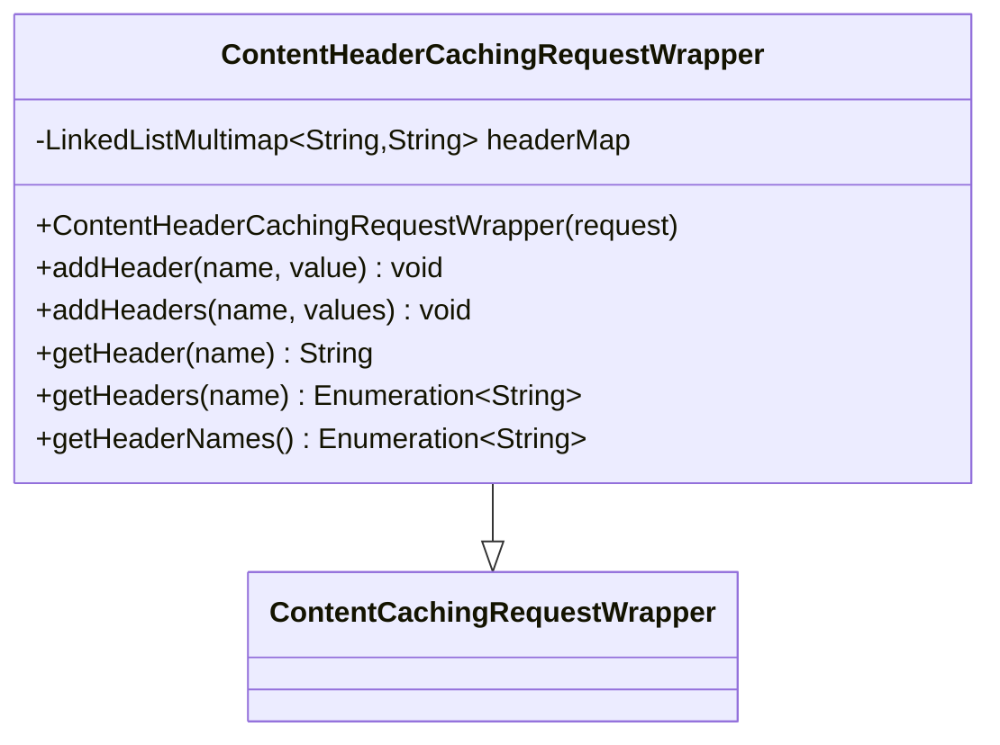
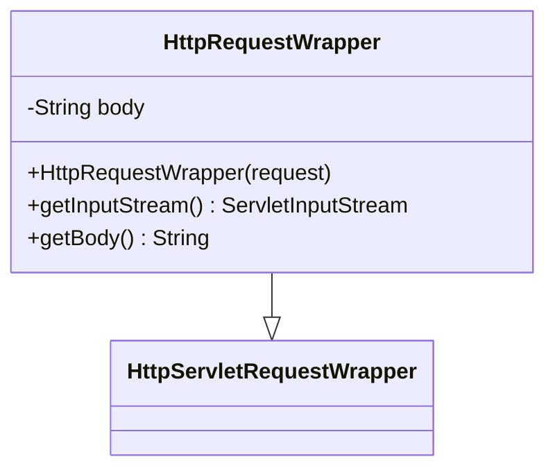
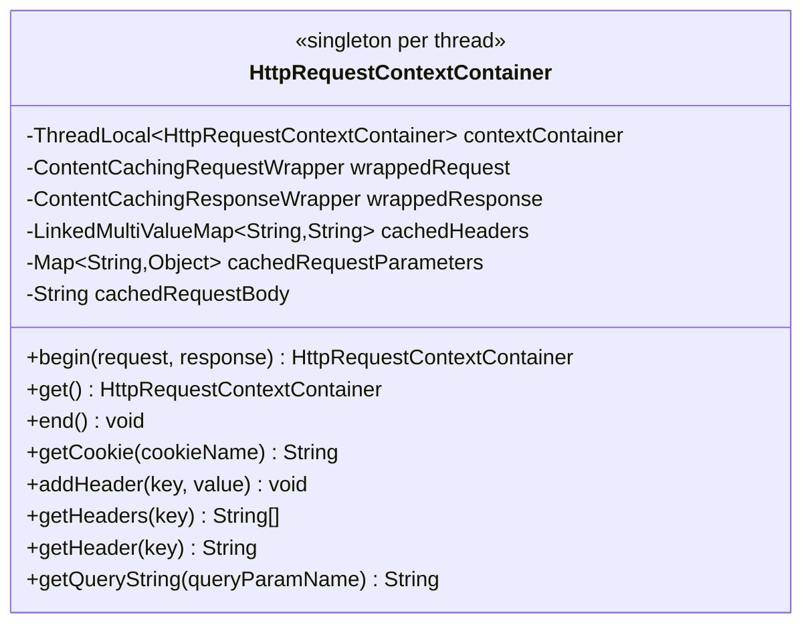
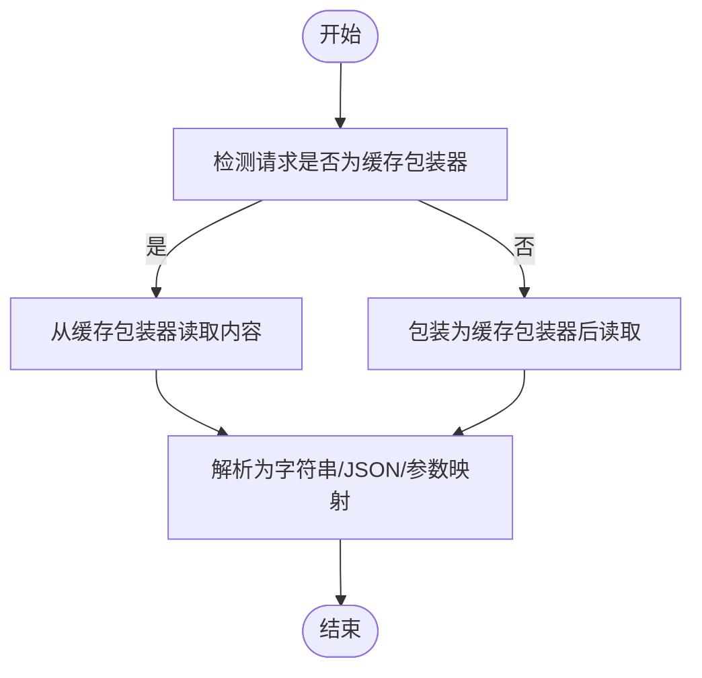
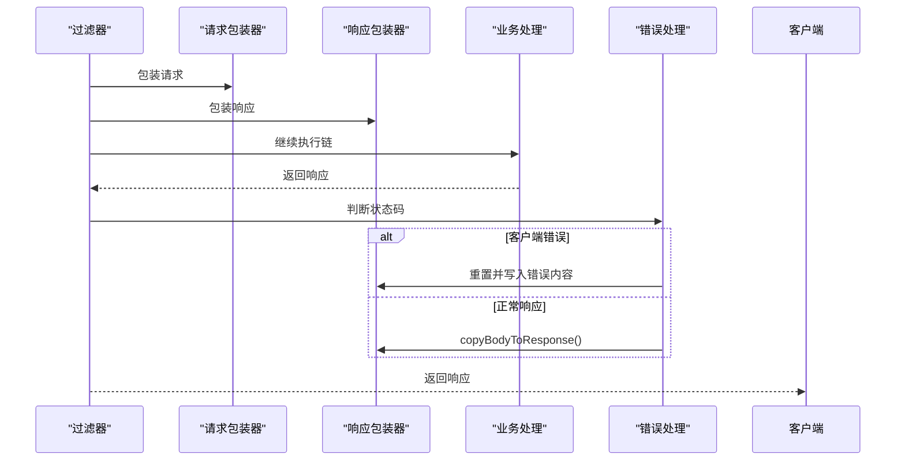
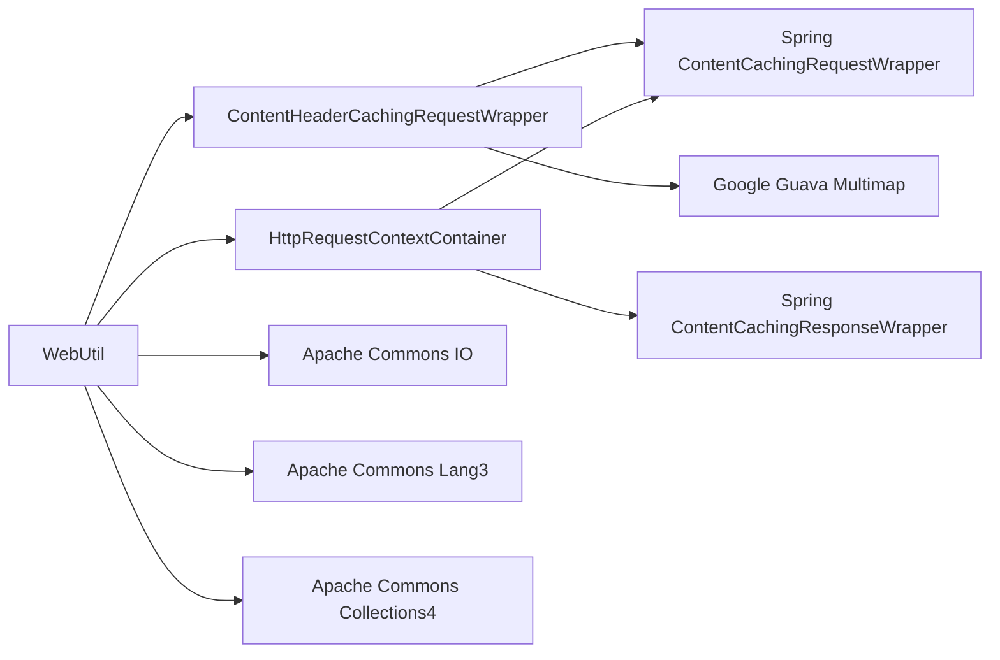

# HTTP请求包装

<cite>
**本文引用的文件**
- [CachedBodyHttpServletRequest.java](file://biz-service-impl/src/main/java/com/magicliang/transaction/sys/biz/service/impl/web/http/CachedBodyHttpServletRequest.java)
- [ContentHeaderCachingRequestWrapper.java](file://biz-service-impl/src/main/java/com/magicliang/transaction/sys/biz/service/impl/web/http/ContentHeaderCachingRequestWrapper.java)
- [HttpRequestWrapper.java](file://biz-service-impl/src/main/java/com/magicliang/transaction/sys/biz/service/impl/web/http/HttpRequestWrapper.java)
- [HttpRequestContextContainer.java](file://biz-service-impl/src/main/java/com/magicliang/transaction/sys/biz/service/impl/web/http/HttpRequestContextContainer.java)
- [WebUtil.java](file://biz-service-impl/src/main/java/com/magicliang/transaction/sys/biz/service/impl/web/util/WebUtil.java)
- [StatusBasedFilter.java](file://biz-service-impl/src/main/java/com/magicliang/transaction/sys/biz/service/impl/web/filter/StatusBasedFilter.java)
- [WebMvcConfig.java](file://biz-service-impl/src/main/java/com/magicliang/transaction/sys/biz/service/impl/web/config/WebMvcConfig.java)
- [InnerApiAuthenticator.java](file://biz-service-impl/src/main/java/com/magicliang/transaction/sys/biz/service/impl/web/interceptor/InnerApiAuthenticator.java)
- [TestController.java](file://biz-service-impl/src/main/java/com/magicliang/transaction/sys/biz/service/impl/web/controller/TestController.java)
</cite>

## 目录
1. [简介](#简介)
2. [项目结构](#项目结构)
3. [核心组件](#核心组件)
4. [架构总览](#架构总览)
5. [组件详解](#组件详解)
6. [依赖关系分析](#依赖关系分析)
7. [性能考量](#性能考量)
8. [故障排查指南](#故障排查指南)
9. [结论](#结论)
10. [附录](#附录)

## 简介
本文件聚焦于HTTP请求包装模块，系统性阐述以下组件的设计与实现：
- CachedBodyHttpServletRequest：实现请求体一次性读取后的缓存与多次消费
- ContentHeaderCachingRequestWrapper：在缓存请求体的同时，保留并可动态增删改的请求头
- HttpRequestWrapper：基于字符流的请求体缓存包装器（适用于文本/JSON）
- HttpRequestContextContainer：请求上下文容器，统一管理请求头、参数、请求体、响应缓存，并通过ThreadLocal实现线程隔离
- WebUtil：围绕请求/响应包装器的工具集，提供读取请求体、解析JSON、添加请求头等便捷方法
- StatusBasedFilter：基于过滤器的请求/响应缓存与错误处理示例
- WebMvcConfig/InnerApiAuthenticator：拦截器配置与鉴权示例

目标是帮助读者理解如何通过装饰器模式解决“重复读取请求体”、“修改请求参数/头”、“增强请求功能”等常见问题，并掌握请求上下文管理的最佳实践与性能注意事项。

## 项目结构
该模块位于biz-service-impl工程的web子包内，围绕HTTP请求包装与上下文管理形成清晰分层：
- http：请求包装器与上下文容器
- util：Web工具类，封装对包装器的读取与操作
- filter/interceptor/config：过滤器与拦截器配置，用于接入包装器
- controller：演示接口，便于验证包装器行为

图表来源
- [CachedBodyHttpServletRequest.java:1-77](file://biz-service-impl/src/main/java/com/magicliang/transaction/sys/biz/service/impl/web/http/CachedBodyHttpServletRequest.java#L1-L77)
- [ContentHeaderCachingRequestWrapper.java:1-105](file://biz-service-impl/src/main/java/com/magicliang/transaction/sys/biz/service/impl/web/http/ContentHeaderCachingRequestWrapper.java#L1-L105)
- [HttpRequestWrapper.java:1-59](file://biz-service-impl/src/main/java/com/magicliang/transaction/sys/biz/service/impl/web/http/HttpRequestWrapper.java#L1-L59)
- [HttpRequestContextContainer.java:1-214](file://biz-service-impl/src/main/java/com/magicliang/transaction/sys/biz/service/impl/web/http/HttpRequestContextContainer.java#L1-L214)
- [WebUtil.java:1-512](file://biz-service-impl/src/main/java/com/magicliang/transaction/sys/biz/service/impl/web/util/WebUtil.java#L1-L512)
- [StatusBasedFilter.java:1-158](file://biz-service-impl/src/main/java/com/magicliang/transaction/sys/biz/service/impl/web/filter/StatusBasedFilter.java#L1-L158)
- [WebMvcConfig.java:1-75](file://biz-service-impl/src/main/java/com/magicliang/transaction/sys/biz/service/impl/web/config/WebMvcConfig.java#L1-L75)
- [InnerApiAuthenticator.java:1-27](file://biz-service-impl/src/main/java/com/magicliang/transaction/sys/biz/service/impl/web/interceptor/InnerApiAuthenticator.java#L1-L27)
- [TestController.java:1-241](file://biz-service-impl/src/main/java/com/magicliang/transaction/sys/biz/service/impl/web/controller/TestController.java#L1-L241)

章节来源
- [WebMvcConfig.java:1-75](file://biz-service-impl/src/main/java/com/magicliang/transaction/sys/biz/service/impl/web/config/WebMvcConfig.java#L1-L75)
- [StatusBasedFilter.java:1-158](file://biz-service-impl/src/main/java/com/magicliang/transaction/sys/biz/service/impl/web/filter/StatusBasedFilter.java#L1-L158)

## 核心组件
- CachedBodyHttpServletRequest：继承HttpServletRequestWrapper，一次性读取并缓存请求体字节，随后通过自定义ServletInputStream实现重复读取
- ContentHeaderCachingRequestWrapper：在缓存请求体的基础上，额外缓存请求头集合，支持动态新增/覆盖请求头
- HttpRequestWrapper：基于字符流读取请求体，生成字符串缓存，适合JSON/文本场景
- HttpRequestContextContainer：以ThreadLocal为作用域，缓存请求头、参数、请求体与响应体，提供统一的上下文访问入口
- WebUtil：提供读取请求体、解析JSON、获取Cookie/参数、向请求头添加键值等工具方法，内部对包装器进行适配

章节来源
- [CachedBodyHttpServletRequest.java:23-77](file://biz-service-impl/src/main/java/com/magicliang/transaction/sys/biz/service/impl/web/http/CachedBodyHttpServletRequest.java#L23-L77)
- [ContentHeaderCachingRequestWrapper.java:24-105](file://biz-service-impl/src/main/java/com/magicliang/transaction/sys/biz/service/impl/web/http/ContentHeaderCachingRequestWrapper.java#L24-L105)
- [HttpRequestWrapper.java:20-59](file://biz-service-impl/src/main/java/com/magicliang/transaction/sys/biz/service/impl/web/http/HttpRequestWrapper.java#L20-L59)
- [HttpRequestContextContainer.java:38-214](file://biz-service-impl/src/main/java/com/magicliang/transaction/sys/biz/service/impl/web/http/HttpRequestContextContainer.java#L38-L214)
- [WebUtil.java:34-512](file://biz-service-impl/src/main/java/com/magicliang/transaction/sys/biz/service/impl/web/util/WebUtil.java#L34-L512)

## 架构总览
请求包装器与上下文容器在过滤器/拦截器阶段被创建与注入，随后在控制器与业务层通过工具类统一读取与增强，最终在过滤器阶段完成响应体回写。

图表来源
- [StatusBasedFilter.java:49-86](file://biz-service-impl/src/main/java/com/magicliang/transaction/sys/biz/service/impl/web/filter/StatusBasedFilter.java#L49-L86)
- [WebUtil.java:118-124](file://biz-service-impl/src/main/java/com/magicliang/transaction/sys/biz/service/impl/web/util/WebUtil.java#L118-L124)
- [HttpRequestContextContainer.java:77-85](file://biz-service-impl/src/main/java/com/magicliang/transaction/sys/biz/service/impl/web/http/HttpRequestContextContainer.java#L77-L85)
- [TestController.java:66-70](file://biz-service-impl/src/main/java/com/magicliang/transaction/sys/biz/service/impl/web/controller/TestController.java#L66-L70)

## 组件详解

### CachedBodyHttpServletRequest
- 设计要点
  - 在构造函数中读取原始请求体字节并缓存
  - 重写getInputStream/getReader，返回可重复消费的输入流/读取器
  - 内部类CachedBodyServletInputStream实现ServletInputStream，提供基础读取与状态判断
- 适用场景
  - 需要多次读取请求体（日志、签名验证、消息转换器等）
  - 避免“流已消费”的异常
- 复杂度与性能
  - 时间复杂度O(n)，空间复杂度O(n)，n为请求体大小
  - 仅在构造时读取一次，后续读取来自内存缓存

图表来源
- [CachedBodyHttpServletRequest.java:23-77](file://biz-service-impl/src/main/java/com/magicliang/transaction/sys/biz/service/impl/web/http/CachedBodyHttpServletRequest.java#L23-L77)

章节来源
- [CachedBodyHttpServletRequest.java:27-47](file://biz-service-impl/src/main/java/com/magicliang/transaction/sys/biz/service/impl/web/http/CachedBodyHttpServletRequest.java#L27-L47)

### ContentHeaderCachingRequestWrapper
- 设计要点
  - 继承Spring的ContentCachingRequestWrapper，复用其请求体缓存能力
  - 在构造时遍历原始请求头并缓存到多值映射中
  - 提供addHeader/addHeaders方法，支持在请求作用域内动态修改请求头
  - 重写getHeader/getHeaders/getHeaderNames，优先返回缓存值，再回退到原始值
- 适用场景
  - 需要修改/追加请求头（如透传上游信息、添加追踪ID）
  - 需要多次读取请求头且保持一致性
- 复杂度与性能
  - 头部缓存为O(h)，h为头数量；读取时按需合并，避免重复遍历

图表来源
- [ContentHeaderCachingRequestWrapper.java:24-105](file://biz-service-impl/src/main/java/com/magicliang/transaction/sys/biz/service/impl/web/http/ContentHeaderCachingRequestWrapper.java#L24-L105)

章节来源
- [ContentHeaderCachingRequestWrapper.java:31-102](file://biz-service-impl/src/main/java/com/magicliang/transaction/sys/biz/service/impl/web/http/ContentHeaderCachingRequestWrapper.java#L31-L102)

### HttpRequestWrapper
- 设计要点
  - 在构造时通过IOUtils读取请求体为字符串并缓存
  - 重写getInputStream，返回基于缓存字符串的ByteArrayInputStream
  - 适用于JSON/文本场景，避免重复读取字符流
- 适用场景
  - 需要多次读取请求体字符串（如参数校验、日志记录）
- 复杂度与性能
  - 时间/空间复杂度O(m)，m为请求体长度；注意字符编码与大文本开销

图表来源
- [HttpRequestWrapper.java:20-59](file://biz-service-impl/src/main/java/com/magicliang/transaction/sys/biz/service/impl/web/http/HttpRequestWrapper.java#L20-L59)

章节来源
- [HttpRequestWrapper.java:24-53](file://biz-service-impl/src/main/java/com/magicliang/transaction/sys/biz/service/impl/web/http/HttpRequestWrapper.java#L24-L53)

### HttpRequestContextContainer
- 设计要点
  - 使用ThreadLocal确保每个线程拥有独立上下文
  - 缓存请求头（多值）、请求参数（Map）、请求体（字符串）、响应体（缓存包装器）
  - 提供getCookie/getHeader/getHeaders/getQueryString等便捷方法
  - 生命周期：begin创建，end销毁并回写响应
- 适用场景
  - 需要在多个处理阶段共享请求上下文（日志、追踪、鉴权、参数透传）
- 复杂度与性能
  - 头部与参数缓存为O(k)，k为键数量；字符串请求体为O(b)，b为字节数
  - ThreadLocal避免跨线程污染，但需确保end正确释放

图表来源
- [HttpRequestContextContainer.java:38-214](file://biz-service-impl/src/main/java/com/magicliang/transaction/sys/biz/service/impl/web/http/HttpRequestContextContainer.java#L38-L214)

章节来源
- [HttpRequestContextContainer.java:77-99](file://biz-service-impl/src/main/java/com/magicliang/transaction/sys/biz/service/impl/web/http/HttpRequestContextContainer.java#L77-L99)

### WebUtil：请求包装器工具集
- 设计要点
  - 提供getBodyString/getBodyJson/getQueryString/getCookie等静态方法
  - 对ContentCachingRequestWrapper进行适配，必要时自动包装
  - 支持向ContentHeaderCachingRequestWrapper添加请求头
  - 对tryLoadCacheContent进行保护性调用，避免破坏Spring消息转换流程
- 适用场景
  - 在业务层快速读取请求体、参数、头、Cookie，减少样板代码
- 性能与注意事项
  - 避免在过滤器链之前强制加载缓存内容，防止破坏@RequestBody绑定
  - 对空编码/异常进行兜底处理，保证稳定性

图表来源
- [WebUtil.java:118-124](file://biz-service-impl/src/main/java/com/magicliang/transaction/sys/biz/service/impl/web/util/WebUtil.java#L118-L124)
- [WebUtil.java:360-376](file://biz-service-impl/src/main/java/com/magicliang/transaction/sys/biz/service/impl/web/util/WebUtil.java#L360-L376)

章节来源
- [WebUtil.java:394-402](file://biz-service-impl/src/main/java/com/magicliang/transaction/sys/biz/service/impl/web/util/WebUtil.java#L394-L402)

### 过滤器与拦截器集成
- StatusBasedFilter
  - 使用ContentCachingRequestWrapper/ResponseWrapper包裹请求/响应
  - 在过滤器链结束后读取请求/响应体并根据状态码进行错误重写或回写
- WebMvcConfig/InnerApiAuthenticator
  - 注册拦截器，可在preHandle阶段进行鉴权与上下文准备
  - 结合HttpRequestContextContainer实现跨阶段上下文传递

图表来源
- [StatusBasedFilter.java:49-86](file://biz-service-impl/src/main/java/com/magicliang/transaction/sys/biz/service/impl/web/filter/StatusBasedFilter.java#L49-L86)

章节来源
- [WebMvcConfig.java:40-45](file://biz-service-impl/src/main/java/com/magicliang/transaction/sys/biz/service/impl/web/config/WebMvcConfig.java#L40-L45)
- [InnerApiAuthenticator.java:20-26](file://biz-service-impl/src/main/java/com/magicliang/transaction/sys/biz/service/impl/web/interceptor/InnerApiAuthenticator.java#L20-L26)

## 依赖关系分析
- 组件耦合
  - ContentHeaderCachingRequestWrapper依赖Spring的ContentCachingRequestWrapper
  - HttpRequestContextContainer同时依赖请求/响应缓存包装器与多值映射
  - WebUtil对多种包装器进行适配，形成统一入口
- 外部依赖
  - Apache Commons（IOUtils、CollectionUtils、Lang3）
  - Google Guava（Multimap）
  - Spring Web（ContentCachingRequestWrapper/ResponseWrapper）

图表来源
- [WebUtil.java:1-512](file://biz-service-impl/src/main/java/com/magicliang/transaction/sys/biz/service/impl/web/util/WebUtil.java#L1-L512)
- [ContentHeaderCachingRequestWrapper.java:1-105](file://biz-service-impl/src/main/java/com/magicliang/transaction/sys/biz/service/impl/web/http/ContentHeaderCachingRequestWrapper.java#L1-L105)
- [HttpRequestContextContainer.java:1-214](file://biz-service-impl/src/main/java/com/magicliang/transaction/sys/biz/service/impl/web/http/HttpRequestContextContainer.java#L1-L214)

章节来源
- [WebUtil.java:3-22](file://biz-service-impl/src/main/java/com/magicliang/transaction/sys/biz/service/impl/web/util/WebUtil.java#L3-L22)
- [ContentHeaderCachingRequestWrapper.java:3-13](file://biz-service-impl/src/main/java/com/magicliang/transaction/sys/biz/service/impl/web/http/ContentHeaderCachingRequestWrapper.java#L3-L13)
- [HttpRequestContextContainer.java:1-22](file://biz-service-impl/src/main/java/com/magicliang/transaction/sys/biz/service/impl/web/http/HttpRequestContextContainer.java#L1-L22)

## 性能考量
- 请求体缓存
  - CachedBodyHttpServletRequest/HttpRequestWrapper均将请求体复制到内存，大请求体会增加GC压力与内存占用
  - 建议限制最大请求体大小，或在网关层进行限流与拒绝
- 多次读取
  - 通过包装器避免重复读取底层流，提升可读性与稳定性
- 线程隔离
  - ThreadLocal避免跨线程共享，但需确保end正确清理，防止内存泄漏
- 编码与异常
  - 对字符编码异常进行兜底，避免因编码问题导致解析失败
- Spring消息转换
  - 遵循WebUtil注释建议，不要在过滤器链之前强制加载缓存内容，以免破坏@RequestBody绑定

章节来源
- [WebUtil.java:378-402](file://biz-service-impl/src/main/java/com/magicliang/transaction/sys/biz/service/impl/web/util/WebUtil.java#L378-L402)
- [HttpRequestContextContainer.java:90-99](file://biz-service-impl/src/main/java/com/magicliang/transaction/sys/biz/service/impl/web/http/HttpRequestContextContainer.java#L90-L99)

## 故障排查指南
- 重复读取请求体异常
  - 现象：第二次读取InputStream报错
  - 处理：使用CachedBodyHttpServletRequest或HttpRequestWrapper进行包装
- 请求头未生效
  - 现象：修改请求头后下游未识别
  - 处理：使用ContentHeaderCachingRequestWrapper的addHeader方法，并在过滤器/拦截器阶段尽早应用
- 响应体丢失
  - 现象：过滤器链结束后响应为空
  - 处理：确保在过滤器末尾调用copyBodyToResponse()，或使用WebUtil工具读取后再回写
- 上下文泄漏
  - 现象：线程池复用导致上下文残留
  - 处理：在业务结束时调用HttpRequestContextContainer.end()，确保ThreadLocal清理

章节来源
- [StatusBasedFilter.java:78-84](file://biz-service-impl/src/main/java/com/magicliang/transaction/sys/biz/service/impl/web/filter/StatusBasedFilter.java#L78-L84)
- [HttpRequestContextContainer.java:90-99](file://biz-service-impl/src/main/java/com/magicliang/transaction/sys/biz/service/impl/web/http/HttpRequestContextContainer.java#L90-L99)

## 结论
本模块通过装饰器模式与上下文容器，有效解决了HTTP请求的重复读取、请求头动态修改、请求体解析与响应回写等关键问题。结合过滤器/拦截器与工具类，实现了高可用、可扩展的请求处理链路。在生产环境中，应重点关注内存占用、线程安全与Spring消息转换的兼容性，确保性能与稳定性的平衡。

## 附录
- 使用建议
  - 在过滤器阶段尽早包装请求/响应，避免后续处理破坏流
  - 通过WebUtil统一封装读取逻辑，减少重复代码
  - 对大请求体进行限流与拒绝策略，降低内存压力
  - 在业务结束时调用HttpRequestContextContainer.end()，确保资源回收