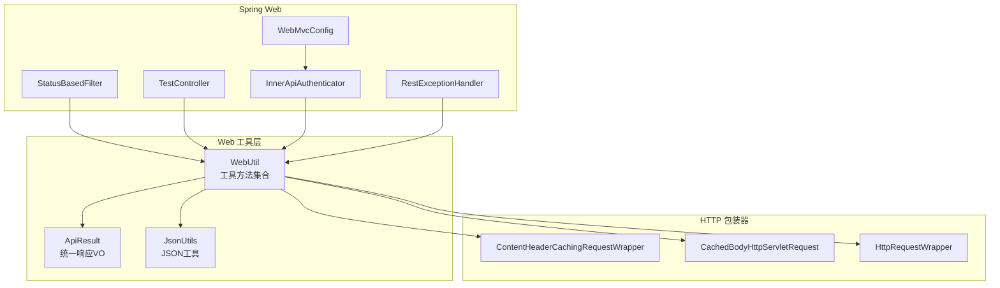
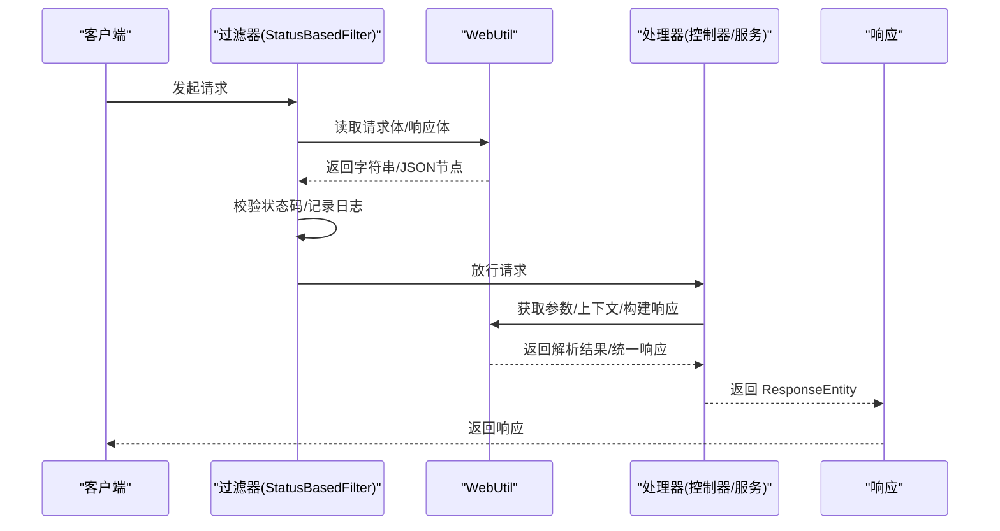
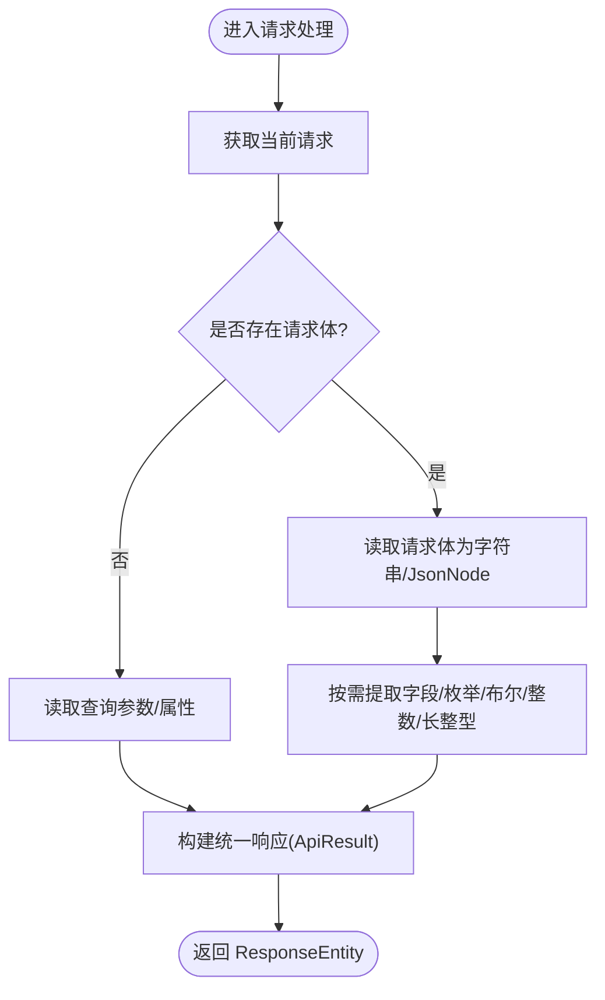
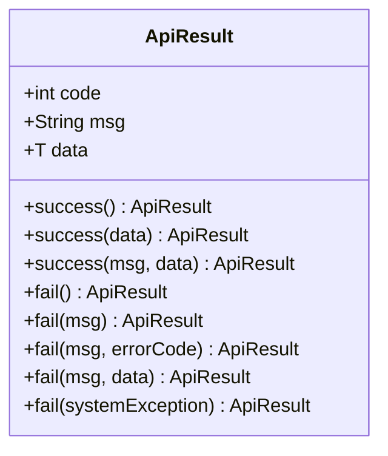
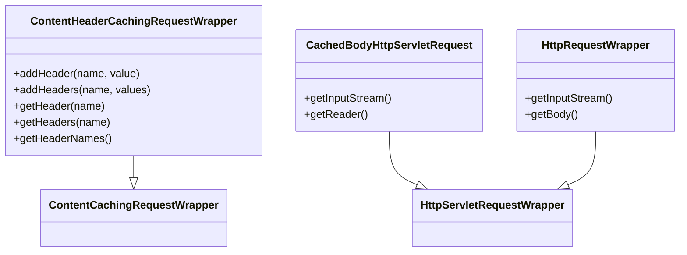
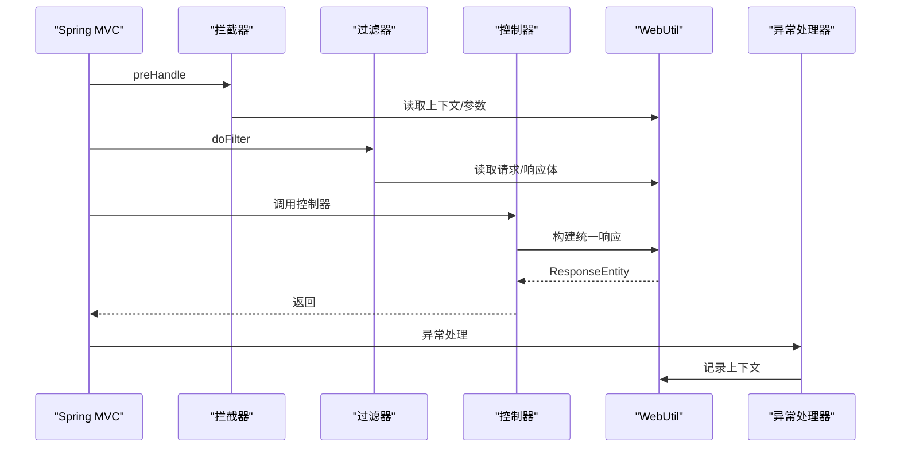
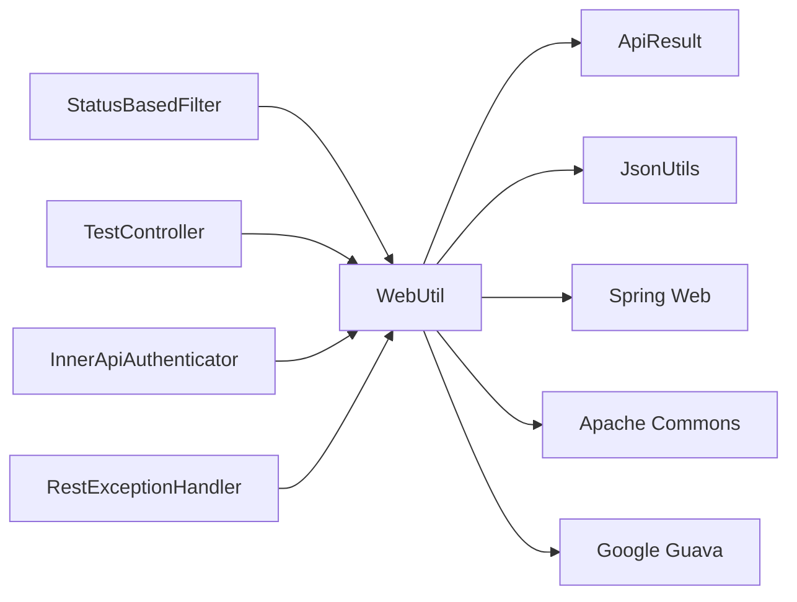

# Web工具类

<cite>
**本文引用的文件**
- [WebUtil.java](file://biz-service-impl/src/main/java/com/magicliang/transaction/sys/biz/service/impl/web/util/WebUtil.java)
- [ApiResult.java](file://biz-service-impl/src/main/java/com/magicliang/transaction/sys/biz/service/impl/web/model/vo/ApiResult.java)
- [CachedBodyHttpServletRequest.java](file://biz-service-impl/src/main/java/com/magicliang/transaction/sys/biz/service/impl/web/http/CachedBodyHttpServletRequest.java)
- [ContentHeaderCachingRequestWrapper.java](file://biz-service-impl/src/main/java/com/magicliang/transaction/sys/biz/service/impl/web/http/ContentHeaderCachingRequestWrapper.java)
- [HttpRequestWrapper.java](file://biz-service-impl/src/main/java/com/magicliang/transaction/sys/biz/service/impl/web/http/HttpRequestWrapper.java)
- [JsonUtils.java](file://common-util/src/main/java/com/magicliang/transaction/sys/common/util/JsonUtils.java)
- [TestController.java](file://biz-service-impl/src/main/java/com/magicliang/transaction/sys/biz/service/impl/web/controller/TestController.java)
- [StatusBasedFilter.java](file://biz-service-impl/src/main/java/com/magicliang/transaction/sys/biz/service/impl/web/filter/StatusBasedFilter.java)
- [WebMvcConfig.java](file://biz-service-impl/src/main/java/com/magicliang/transaction/sys/biz/service/impl/web/config/WebMvcConfig.java)
- [RestExceptionHandler.java](file://biz-service-impl/src/main/java/com/magicliang/transaction/sys/biz/service/impl/web/advice/RestExceptionHandler.java)
- [InnerApiAuthenticator.java](file://biz-service-impl/src/main/java/com/magicliang/transaction/sys/biz/service/impl/web/interceptor/InnerApiAuthenticator.java)
- [HttpRequestContextContainer.java](file://biz-service-impl/src/main/java/com/magicliang/transaction/sys/biz/service/impl/web/http/HttpRequestContextContainer.java)
</cite>

## 目录
1. [简介](#简介)
2. [项目结构](#项目结构)
3. [核心组件](#核心组件)
4. [架构总览](#架构总览)
5. [详细组件分析](#详细组件分析)
6. [依赖分析](#依赖分析)
7. [性能考量](#性能考量)
8. [故障排查指南](#故障排查指南)
9. [结论](#结论)
10. [附录](#附录)

## 简介
本文件系统性梳理并解读 Web 工具类模块（WebUtil）在领域驱动交易系统中的职责与实现，重点覆盖以下方面：
- 请求处理：获取当前请求、读取请求体、解析查询参数、读取 Cookie、获取请求路径与绝对 URL
- 响应生成：统一响应封装、成功/失败响应、HTTP 状态封装
- 参数解析：从请求体 JSON 中提取布尔、整数、长整型、文本等字段，并支持必填校验
- URL 构建与头部管理：复制绝对 URL、添加请求头（含缓存头包装）
- 与 Spring Web 生态的协作：过滤器、拦截器、异常处理、配置类的集成点
- 设计原则与最佳实践：单例工具类、线程安全、幂等读取、错误处理与日志记录

## 项目结构
Web 工具类位于 biz-service-impl 模块的 web/util 下，围绕 WebUtil 提供的静态方法，配合以下周边组件协同工作：
- VO 层：ApiResult 统一响应结构
- HTTP 包装器：ContentHeaderCachingRequestWrapper、CachedBodyHttpServletRequest、HttpRequestWrapper
- 控制器与过滤器：TestController、StatusBasedFilter
- Spring 配置与拦截器：WebMvcConfig、InnerApiAuthenticator、RestExceptionHandler
- JSON 工具：JsonUtils（用于 JSON 解析与节点转换）

图表来源
- [WebUtil.java:1-512](file://biz-service-impl/src/main/java/com/magicliang/transaction/sys/biz/service/impl/web/util/WebUtil.java#L1-L512)
- [ApiResult.java:1-87](file://biz-service-impl/src/main/java/com/magicliang/transaction/sys/biz/service/impl/web/model/vo/ApiResult.java#L1-L87)
- [JsonUtils.java:1-293](file://common-util/src/main/java/com/magicliang/transaction/sys/common/util/JsonUtils.java#L1-L293)
- [ContentHeaderCachingRequestWrapper.java:1-105](file://biz-service-impl/src/main/java/com/magicliang/transaction/sys/biz/service/impl/web/http/ContentHeaderCachingRequestWrapper.java#L1-L105)
- [CachedBodyHttpServletRequest.java:1-77](file://biz-service-impl/src/main/java/com/magicliang/transaction/sys/biz/service/impl/web/http/CachedBodyHttpServletRequest.java#L1-L77)
- [HttpRequestWrapper.java:1-59](file://biz-service-impl/src/main/java/com/magicliang/transaction/sys/biz/service/impl/web/http/HttpRequestWrapper.java#L1-L59)
- [WebMvcConfig.java:1-75](file://biz-service-impl/src/main/java/com/magicliang/transaction/sys/biz/service/impl/web/config/WebMvcConfig.java#L1-L75)
- [InnerApiAuthenticator.java:1-27](file://biz-service-impl/src/main/java/com/magicliang/transaction/sys/biz/service/impl/web/interceptor/InnerApiAuthenticator.java#L1-L27)
- [StatusBasedFilter.java:1-158](file://biz-service-impl/src/main/java/com/magicliang/transaction/sys/biz/service/impl/web/filter/StatusBasedFilter.java#L1-L158)
- [TestController.java:1-241](file://biz-service-impl/src/main/java/com/magicliang/transaction/sys/biz/service/impl/web/controller/TestController.java#L1-L241)
- [RestExceptionHandler.java:1-40](file://biz-service-impl/src/main/java/com/magicliang/transaction/sys/biz/service/impl/web/advice/RestExceptionHandler.java#L1-L40)

章节来源
- [WebUtil.java:1-512](file://biz-service-impl/src/main/java/com/magicliang/transaction/sys/biz/service/impl/web/util/WebUtil.java#L1-L512)
- [WebMvcConfig.java:1-75](file://biz-service-impl/src/main/java/com/magicliang/transaction/sys/biz/service/impl/web/config/WebMvcConfig.java#L1-L75)

## 核心组件
- WebUtil：提供请求上下文获取、请求体读取、参数解析、Cookie 读取、查询参数读取、统一响应封装、URL 构建、请求头添加等能力。所有方法均为静态，采用“单例工具类”模式，避免实例化开销。
- ApiResult：统一响应结构，包含状态码、消息与数据域，提供 success/fail 多种工厂方法，便于快速构建标准响应。
- JsonUtils：基于 Jackson 的 JSON 工具，提供对象与 JSON 的互转、JsonNode 转换、序列化策略控制等，WebUtil 使用其将请求体转为 JsonNode 以支持字段级解析。
- HTTP 包装器：
  - ContentHeaderCachingRequestWrapper：在 ContentCachingRequestWrapper 基础上扩展多值头管理与动态添加头的能力，便于在过滤器/拦截器中读取与修改请求头。
  - CachedBodyHttpServletRequest：将原始请求体缓存为字节数组，支持多次读取与 Reader/InputStream 的复用。
  - HttpRequestWrapper：通用请求包装器，支持将 Reader 内容缓存为字符串，便于在不同阶段重复消费。

章节来源
- [WebUtil.java:34-512](file://biz-service-impl/src/main/java/com/magicliang/transaction/sys/biz/service/impl/web/util/WebUtil.java#L34-L512)
- [ApiResult.java:15-87](file://biz-service-impl/src/main/java/com/magicliang/transaction/sys/biz/service/impl/web/model/vo/ApiResult.java#L15-L87)
- [JsonUtils.java:29-293](file://common-util/src/main/java/com/magicliang/transaction/sys/common/util/JsonUtils.java#L29-L293)
- [ContentHeaderCachingRequestWrapper.java:24-105](file://biz-service-impl/src/main/java/com/magicliang/transaction/sys/biz/service/impl/web/http/ContentHeaderCachingRequestWrapper.java#L24-L105)
- [CachedBodyHttpServletRequest.java:23-77](file://biz-service-impl/src/main/java/com/magicliang/transaction/sys/biz/service/impl/web/http/CachedBodyHttpServletRequest.java#L23-L77)
- [HttpRequestWrapper.java:20-59](file://biz-service-impl/src/main/java/com/magicliang/transaction/sys/biz/service/impl/web/http/HttpRequestWrapper.java#L20-L59)

## 架构总览
WebUtil 作为横切能力，贯穿请求生命周期的关键节点：
- 在过滤器中读取请求/响应体，进行日志与错误重写
- 在控制器中快速获取请求上下文、参数与统一响应
- 在拦截器中进行鉴权与上下文透传
- 在异常处理器中统一返回 ApiResult 结构

图表来源
- [StatusBasedFilter.java:48-86](file://biz-service-impl/src/main/java/com/magicliang/transaction/sys/biz/service/impl/web/filter/StatusBasedFilter.java#L48-L86)
- [WebUtil.java:45-267](file://biz-service-impl/src/main/java/com/magicliang/transaction/sys/biz/service/impl/web/util/WebUtil.java#L45-L267)

## 详细组件分析

### WebUtil：请求处理与响应生成
- 请求上下文与请求体
  - getCurrentRequest：从 RequestContextHolder 获取当前请求，避免直接注入 HttpServletRequest 导致的线程与作用域问题
  - getBodyString/getCurrentRequestBody：读取请求体，支持 ContentCachingRequestWrapper 与普通请求两种场景；对嵌套包装进行兼容处理
  - getBodyJson/getCurrentRequestBodyJson：将请求体转为 JsonNode，便于字段级读取
- 参数解析
  - hasBodyParam：判断请求体是否包含某键
  - getBodyParamAsBoolean/getBodyParamAsText/getBodyParamAsInteger/getBodyParamAsLong：从 JSON 中读取对应类型的值，支持必填校验与空值处理
  - getEnumFromRequest：从请求体枚举文本转为目标枚举类型，异常时抛出运行时异常
  - getQueryString/getCurrentRequestQueryString：读取查询参数
  - getParameterMap：将查询参数与表单参数聚合为 Map
- Cookie 与路径
  - getCookie/getCurrentRequestCookie：读取 Cookie 值，支持默认值
  - getPath：拼接上下文路径与 Servlet 路径
  - copyAbsoluteURL：复制绝对 URL（含查询串）
  - getHostWithoutScheme：读取 Host 头
- 响应与统一结构
  - getSuccessResult/getFailResult：快速构建 ResponseEntity<ApiResult<T>>
  - ok/rawOk：返回 ResponseEntity.ok(...)
  - failResult：构建 ApiResult<String> 或带数据的 ApiResult<T>
- 请求头管理
  - addHeader/addHeaderToCurrentHttpRequest/addHeaderToHttpRequest/addHeaderToRequestWrapper：在 ContentHeaderCachingRequestWrapper 中动态添加请求头

图表来源
- [WebUtil.java:45-267](file://biz-service-impl/src/main/java/com/magicliang/transaction/sys/biz/service/impl/web/util/WebUtil.java#L45-L267)

章节来源
- [WebUtil.java:45-267](file://biz-service-impl/src/main/java/com/magicliang/transaction/sys/biz/service/impl/web/util/WebUtil.java#L45-L267)

### ApiResult：统一响应模型
- 字段：code、msg、data
- 工厂方法：success/fail 多种重载，支持无参、仅消息、消息+错误码、消息+数据
- 与 WebUtil 协作：WebUtil 通过 ApiResult 构建统一响应，简化控制器返回逻辑

图表来源
- [ApiResult.java:15-87](file://biz-service-impl/src/main/java/com/magicliang/transaction/sys/biz/service/impl/web/model/vo/ApiResult.java#L15-L87)

章节来源
- [ApiResult.java:15-87](file://biz-service-impl/src/main/java/com/magicliang/transaction/sys/biz/service/impl/web/model/vo/ApiResult.java#L15-L87)

### HTTP 包装器：幂等读取与动态头管理
- ContentHeaderCachingRequestWrapper：在 ContentCachingRequestWrapper 基础上，维护多值头映射，支持动态添加头并在后续读取时生效
- CachedBodyHttpServletRequest：将输入流内容缓存为字节数组，支持多次读取与 Reader/InputStream 复用
- HttpRequestWrapper：将 Reader 内容缓存为字符串，便于在不同阶段重复消费

图表来源
- [ContentHeaderCachingRequestWrapper.java:24-105](file://biz-service-impl/src/main/java/com/magicliang/transaction/sys/biz/service/impl/web/http/ContentHeaderCachingRequestWrapper.java#L24-L105)
- [CachedBodyHttpServletRequest.java:23-77](file://biz-service-impl/src/main/java/com/magicliang/transaction/sys/biz/service/impl/web/http/CachedBodyHttpServletRequest.java#L23-L77)
- [HttpRequestWrapper.java:20-59](file://biz-service-impl/src/main/java/com/magicliang/transaction/sys/biz/service/impl/web/http/HttpRequestWrapper.java#L20-L59)

章节来源
- [ContentHeaderCachingRequestWrapper.java:24-105](file://biz-service-impl/src/main/java/com/magicliang/transaction/sys/biz/service/impl/web/http/ContentHeaderCachingRequestWrapper.java#L24-L105)
- [CachedBodyHttpServletRequest.java:23-77](file://biz-service-impl/src/main/java/com/magicliang/transaction/sys/biz/service/impl/web/http/CachedBodyHttpServletRequest.java#L23-L77)
- [HttpRequestWrapper.java:20-59](file://biz-service-impl/src/main/java/com/magicliang/transaction/sys/biz/service/impl/web/http/HttpRequestWrapper.java#L20-L59)

### 与 Spring Web 的集成点
- 过滤器：StatusBasedFilter 使用 WebUtil 读取请求/响应体，进行日志记录与错误重写
- 控制器：TestController 展示了 WebUtil.getPath 的使用场景
- 拦截器：WebMvcConfig 注册 InnerApiAuthenticator，WebUtil 可在拦截器中读取上下文
- 异常处理：RestExceptionHandler 统一处理异常，WebUtil 可用于记录请求上下文

图表来源
- [WebMvcConfig.java:39-55](file://biz-service-impl/src/main/java/com/magicliang/transaction/sys/biz/service/impl/web/config/WebMvcConfig.java#L39-L55)
- [InnerApiAuthenticator.java:20-26](file://biz-service-impl/src/main/java/com/magicliang/transaction/sys/biz/service/impl/web/interceptor/InnerApiAuthenticator.java#L20-L26)
- [StatusBasedFilter.java:48-86](file://biz-service-impl/src/main/java/com/magicliang/transaction/sys/biz/service/impl/web/filter/StatusBasedFilter.java#L48-L86)
- [TestController.java:65-70](file://biz-service-impl/src/main/java/com/magicliang/transaction/sys/biz/service/impl/web/controller/TestController.java#L65-L70)
- [RestExceptionHandler.java:24-38](file://biz-service-impl/src/main/java/com/magicliang/transaction/sys/biz/service/impl/web/advice/RestExceptionHandler.java#L24-L38)

章节来源
- [WebMvcConfig.java:39-55](file://biz-service-impl/src/main/java/com/magicliang/transaction/sys/biz/service/impl/web/config/WebMvcConfig.java#L39-L55)
- [StatusBasedFilter.java:48-86](file://biz-service-impl/src/main/java/com/magicliang/transaction/sys/biz/service/impl/web/filter/StatusBasedFilter.java#L48-L86)
- [TestController.java:65-70](file://biz-service-impl/src/main/java/com/magicliang/transaction/sys/biz/service/impl/web/controller/TestController.java#L65-L70)
- [RestExceptionHandler.java:24-38](file://biz-service-impl/src/main/java/com/magicliang/transaction/sys/biz/service/impl/web/advice/RestExceptionHandler.java#L24-L38)

## 依赖分析
- WebUtil 依赖
  - ApiResult：统一响应结构
  - JsonUtils：JSON 解析与节点转换
  - Spring Web：RequestContextHolder、ContentCachingRequestWrapper/ResponseWrapper、ServletRequestAttributes
  - Apache Commons：IOUtils、StringUtils、collections4
  - Google Guava：LinkedListMultimap（用于多值头管理）
- 与过滤器/拦截器/控制器的耦合
  - 过滤器：强依赖 WebUtil 的请求/响应体读取能力
  - 控制器：弱依赖，主要用于路径与统一响应
  - 拦截器：可选依赖，用于上下文透传与鉴权
  - 异常处理器：弱依赖，用于记录上下文

图表来源
- [WebUtil.java:1-512](file://biz-service-impl/src/main/java/com/magicliang/transaction/sys/biz/service/impl/web/util/WebUtil.java#L1-L512)
- [ApiResult.java:1-87](file://biz-service-impl/src/main/java/com/magicliang/transaction/sys/biz/service/impl/web/model/vo/ApiResult.java#L1-L87)
- [JsonUtils.java:1-293](file://common-util/src/main/java/com/magicliang/transaction/sys/common/util/JsonUtils.java#L1-L293)
- [StatusBasedFilter.java:1-158](file://biz-service-impl/src/main/java/com/magicliang/transaction/sys/biz/service/impl/web/filter/StatusBasedFilter.java#L1-L158)
- [TestController.java:1-241](file://biz-service-impl/src/main/java/com/magicliang/transaction/sys/biz/service/impl/web/controller/TestController.java#L1-L241)
- [InnerApiAuthenticator.java:1-27](file://biz-service-impl/src/main/java/com/magicliang/transaction/sys/biz/service/impl/web/interceptor/InnerApiAuthenticator.java#L1-L27)
- [RestExceptionHandler.java:1-40](file://biz-service-impl/src/main/java/com/magicliang/transaction/sys/biz/service/impl/web/advice/RestExceptionHandler.java#L1-L40)

章节来源
- [WebUtil.java:1-512](file://biz-service-impl/src/main/java/com/magicliang/transaction/sys/biz/service/impl/web/util/WebUtil.java#L1-L512)

## 性能考量
- 请求体读取的幂等性
  - ContentCachingRequestWrapper 仅能一次性消费 InputStream，WebUtil 通过 tryLoadCacheContent 与双重检查避免重复读取，减少异常风险
- JSON 解析与缓存
  - JsonUtils 提供多种 ObjectMapper 实例与缓存策略，WebUtil 使用 JsonUtils.toJsonNode 将请求体转为 JsonNode，兼顾性能与兼容性
- 线程安全
  - WebUtil 为纯工具类，依赖 RequestContextHolder 的 ThreadLocal 获取当前请求；在多线程/异步场景中需确保在正确线程内调用
- 日志与异常
  - 对读取异常进行捕获与日志记录，避免影响主流程；必要时抛出运行时异常以中断非法请求

## 故障排查指南
- 请求体为空或读取异常
  - 现象：getBodyString 返回空串或 null
  - 排查：确认是否在过滤器链之前调用 readCachingRequest；检查 ContentCachingRequestWrapper 是否被正确包装
  - 参考路径：[WebUtil.java:360-402](file://biz-service-impl/src/main/java/com/magicliang/transaction/sys/biz/service/impl/web/util/WebUtil.java#L360-L402)
- 参数解析异常
  - 现象：getEnumFromRequest 抛出运行时异常
  - 排查：确认请求体 JSON 中枚举文本与目标枚举定义一致；检查 hasBodyParam 与 getBodyJson 的返回值
  - 参考路径：[WebUtil.java:134-145](file://biz-service-impl/src/main/java/com/magicliang/transaction/sys/biz/service/impl/web/util/WebUtil.java#L134-L145)
- 响应头未生效
  - 现象：addHeaderToHttpRequest 返回 false
  - 排查：确认请求已被 ContentHeaderCachingRequestWrapper 包装；优先使用 addHeaderToRequestWrapper
  - 参考路径：[WebUtil.java:489-500](file://biz-service-impl/src/main/java/com/magicliang/transaction/sys/biz/service/impl/web/util/WebUtil.java#L489-L500)
- 统一响应未标准化
  - 现象：控制器返回结构不一致
  - 排查：统一使用 WebUtil.getSuccessResult/getFailResult 构建 ResponseEntity<ApiResult<T>>
  - 参考路径：[WebUtil.java:430-464](file://biz-service-impl/src/main/java/com/magicliang/transaction/sys/biz/service/impl/web/util/WebUtil.java#L430-L464)

章节来源
- [WebUtil.java:360-402](file://biz-service-impl/src/main/java/com/magicliang/transaction/sys/biz/service/impl/web/util/WebUtil.java#L360-L402)
- [WebUtil.java:134-145](file://biz-service-impl/src/main/java/com/magicliang/transaction/sys/biz/service/impl/web/util/WebUtil.java#L134-L145)
- [WebUtil.java:489-500](file://biz-service-impl/src/main/java/com/magicliang/transaction/sys/biz/service/impl/web/util/WebUtil.java#L489-L500)
- [WebUtil.java:430-464](file://biz-service-impl/src/main/java/com/magicliang/transaction/sys/biz/service/impl/web/util/WebUtil.java#L430-L464)

## 结论
WebUtil 通过“静态工具方法 + 统一响应 + HTTP 包装器”的组合，为 Web 开发提供了高内聚、低耦合的基础设施能力：
- 显著提升请求处理与参数解析的效率与一致性
- 通过统一响应结构与工具方法，降低控制器样板代码
- 与 Spring Web 过滤器/拦截器/异常处理无缝集成，保障可观测性与可维护性
- 在保证功能完整性的同时，通过幂等读取、缓存策略与错误处理，确保可靠性与性能

## 附录
- 最佳实践清单
  - 在过滤器中使用 WebUtil 读取请求/响应体，避免在 @RequestBody 之前调用 tryLoadCacheContent
  - 统一使用 WebUtil 构建响应，确保前后端交互的一致性
  - 对必填参数使用 required 参数进行校验，避免空值传播
  - 在需要动态修改请求头时，优先使用 ContentHeaderCachingRequestWrapper 并通过 WebUtil 添加
- 常见业务场景
  - 日志与审计：在过滤器中记录请求/响应体与状态码
  - 统一错误处理：在异常处理器中结合 WebUtil 记录上下文
  - 鉴权与上下文透传：在拦截器中使用 WebUtil 获取 Cookie/参数并注入上下文容器