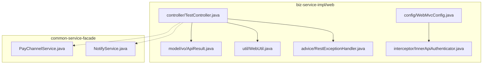
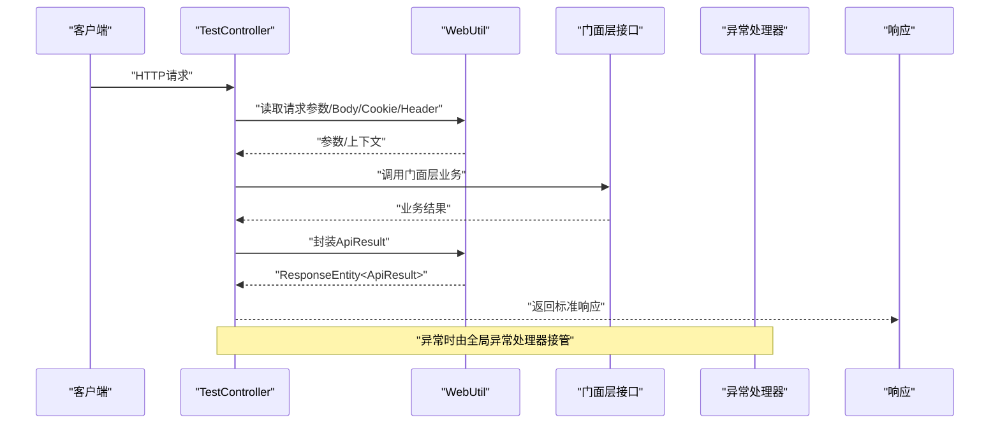
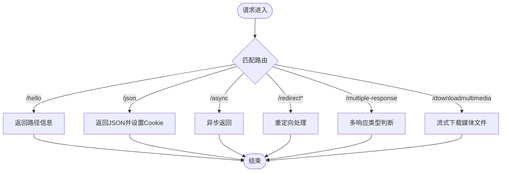
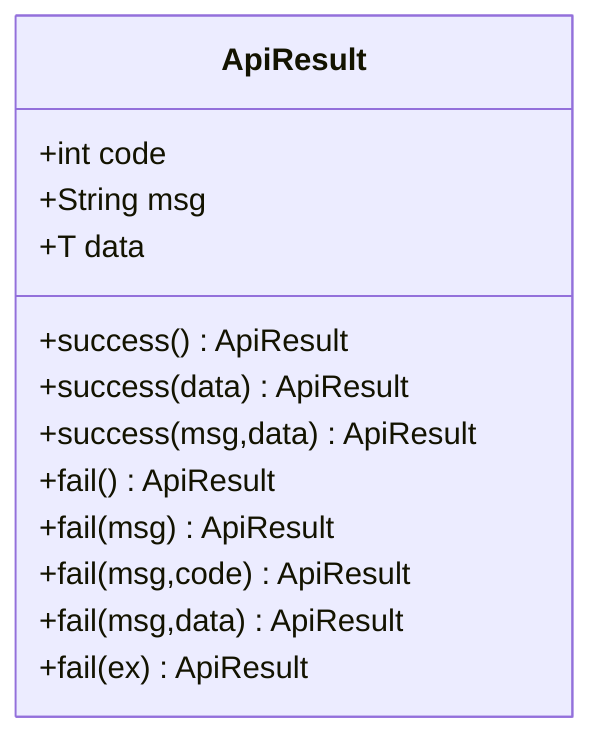
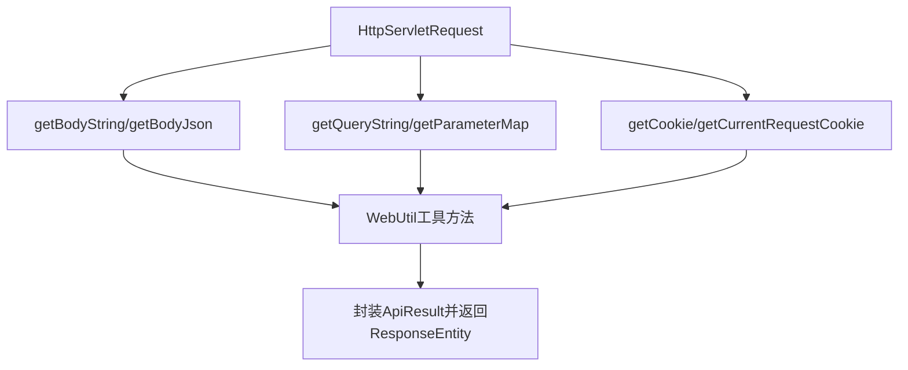
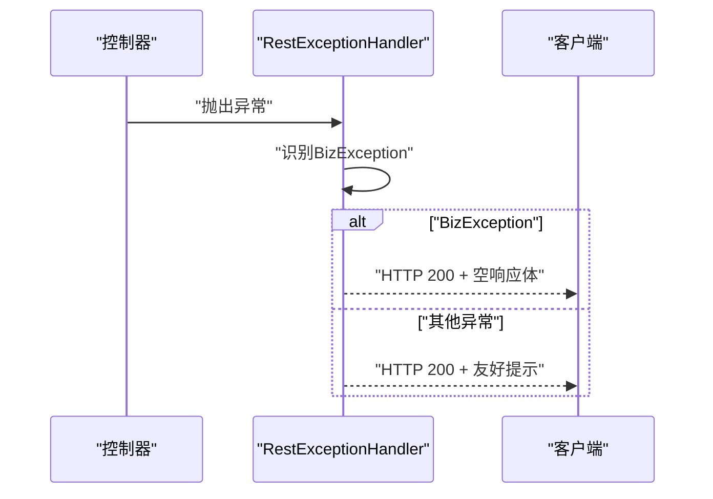
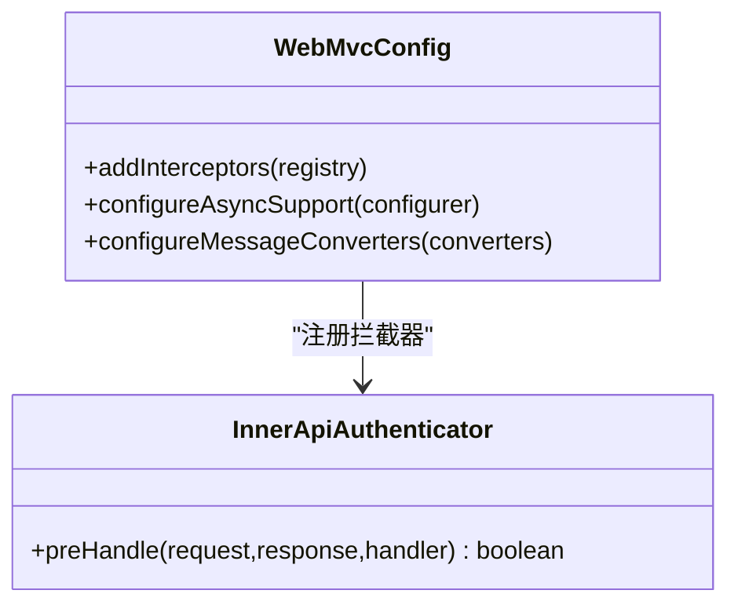
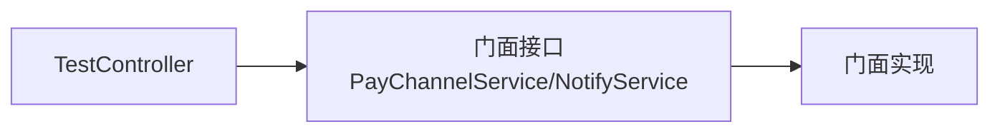
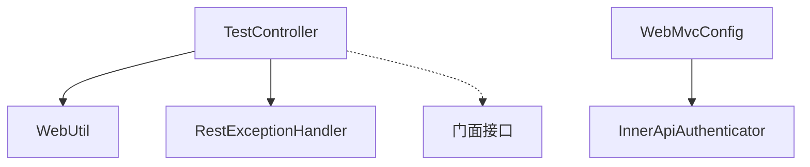

# Web控制器

<cite>
**本文档引用的文件**
- [TestController.java](file://biz-service-impl/src/main/java/com/magicliang/transaction/sys/biz/service/impl/web/controller/TestController.java)
- [ApiResult.java](file://biz-service-impl/src/main/java/com/magicliang/transaction/sys/biz/service/impl/web/model/vo/ApiResult.java)
- [WebUtil.java](file://biz-service-impl/src/main/java/com/magicliang/transaction/sys/biz/service/impl/web/util/WebUtil.java)
- [RestExceptionHandler.java](file://biz-service-impl/src/main/java/com/magicliang/transaction/sys/biz/service/impl/web/advice/RestExceptionHandler.java)
- [WebMvcConfig.java](file://biz-service-impl/src/main/java/com/magicliang/transaction/sys/biz/service/impl/web/config/WebMvcConfig.java)
- [InnerApiAuthenticator.java](file://biz-service-impl/src/main/java/com/magicliang/transaction/sys/biz/service/impl/web/interceptor/InnerApiAuthenticator.java)
- [README.md](file://README.md)
- [biz-service-impl/README.md](file://biz-service-impl/README.md)
- [PayChannelService.java](file://common-service-facade/src/main/java/com/magicliang/transaction/sys/common/service/facade/PayChannelService.java)
- [NotifyService.java](file://common-service-facade/src/main/java/com/magicliang/transaction/sys/common/service/facade/NotifyService.java)
</cite>

## 目录
1. [引言](#引言)
2. [项目结构](#项目结构)
3. [核心组件](#核心组件)
4. [架构总览](#架构总览)
5. [详细组件分析](#详细组件分析)
6. [依赖关系分析](#依赖关系分析)
7. [性能考虑](#性能考虑)
8. [故障排查指南](#故障排查指南)
9. [结论](#结论)

## 引言
本文件聚焦于Web控制器模块，特别是TestController作为系统RESTful API入口的设计与实现。文档将系统阐述HTTP接口定义、请求参数处理、响应数据封装等关键点；深入解析ApiResult统一响应模型的设计理念与使用方法；说明控制器层如何通过标准API对外暴露业务能力，并阐明与门面层的交互关系。

## 项目结构
Web控制器位于biz-service-impl模块的web子包中，采用Spring MVC注解驱动的REST风格设计。该模块同时包含：
- 控制器层：TestController
- 响应封装：ApiResult统一响应模型
- 工具类：WebUtil（请求参数、Cookie、Header、响应封装辅助）
- 异常处理：RestExceptionHandler
- Web配置：WebMvcConfig（拦截器、异步支持、消息转换器）
- 拦截器：InnerApiAuthenticator（网关鉴权）

图表来源
- [TestController.java:48-50](file://biz-service-impl/src/main/java/com/magicliang/transaction/sys/biz/service/impl/web/controller/TestController.java#L48-L50)
- [ApiResult.java:15-34](file://biz-service-impl/src/main/java/com/magicliang/transaction/sys/biz/service/impl/web/model/vo/ApiResult.java#L15-L34)
- [WebUtil.java:34-512](file://biz-service-impl/src/main/java/com/magicliang/transaction/sys/biz/service/impl/web/util/WebUtil.java#L34-L512)
- [RestExceptionHandler.java:24-39](file://biz-service-impl/src/main/java/com/magicliang/transaction/sys/biz/service/impl/web/advice/RestExceptionHandler.java#L24-L39)
- [WebMvcConfig.java:25-75](file://biz-service-impl/src/main/java/com/magicliang/transaction/sys/biz/service/impl/web/config/WebMvcConfig.java#L25-L75)
- [InnerApiAuthenticator.java:20-26](file://biz-service-impl/src/main/java/com/magicliang/transaction/sys/biz/service/impl/web/interceptor/InnerApiAuthenticator.java#L20-L26)
- [PayChannelService.java:12-14](file://common-service-facade/src/main/java/com/magicliang/transaction/sys/common/service/facade/PayChannelService.java#L12-L14)
- [NotifyService.java:13-15](file://common-service-facade/src/main/java/com/magicliang/transaction/sys/common/service/facade/NotifyService.java#L13-L15)

章节来源
- [README.md:23-47](file://README.md#L23-L47)
- [biz-service-impl/README.md:1-5](file://biz-service-impl/README.md#L1-L5)

## 核心组件
- TestController：RESTful API入口，提供多样的HTTP接口，涵盖同步、异步、重定向、文件流式下载、Cookie设置等场景。
- ApiResult：统一响应模型，提供成功/失败的标准化返回结构，便于前端统一处理。
- WebUtil：请求上下文工具，提供请求体读取、参数提取、Cookie读取、Header操作、响应封装等能力。
- RestExceptionHandler：全局异常处理，将异常转换为统一的响应结构。
- WebMvcConfig：Web配置，注册拦截器、配置异步支持、消息转换器扩展点。
- InnerApiAuthenticator：网关鉴权拦截器，对请求进行预处理。

章节来源
- [TestController.java:48-50](file://biz-service-impl/src/main/java/com/magicliang/transaction/sys/biz/service/impl/web/controller/TestController.java#L48-L50)
- [ApiResult.java:15-87](file://biz-service-impl/src/main/java/com/magicliang/transaction/sys/biz/service/impl/web/model/vo/ApiResult.java#L15-L87)
- [WebUtil.java:34-512](file://biz-service-impl/src/main/java/com/magicliang/transaction/sys/biz/service/impl/web/util/WebUtil.java#L34-L512)
- [RestExceptionHandler.java:24-39](file://biz-service-impl/src/main/java/com/magicliang/transaction/sys/biz/service/impl/web/advice/RestExceptionHandler.java#L24-L39)
- [WebMvcConfig.java:25-75](file://biz-service-impl/src/main/java/com/magicliang/transaction/sys/biz/service/impl/web/config/WebMvcConfig.java#L25-L75)
- [InnerApiAuthenticator.java:20-26](file://biz-service-impl/src/main/java/com/magicliang/transaction/sys/biz/service/impl/web/interceptor/InnerApiAuthenticator.java#L20-L26)

## 架构总览
Web控制器遵循SOFA分层架构的“展示层”职责，负责：
- 接收HTTP请求，进行参数解析与校验
- 调用门面层或核心服务完成业务处理
- 统一封装响应，返回标准ApiResult结构
- 提供跨域、异步、拦截器等横切能力

图表来源
- [TestController.java:65-70](file://biz-service-impl/src/main/java/com/magicliang/transaction/sys/biz/service/impl/web/controller/TestController.java#L65-L70)
- [WebUtil.java:430-464](file://biz-service-impl/src/main/java/com/magicliang/transaction/sys/biz/service/impl/web/util/WebUtil.java#L430-L464)
- [RestExceptionHandler.java:26-38](file://biz-service-impl/src/main/java/com/magicliang/transaction/sys/biz/service/impl/web/advice/RestExceptionHandler.java#L26-L38)

## 详细组件分析

### TestController：RESTful API入口
- 路由前缀：/res/v1/test
- 方法覆盖：GET、异步CompletionStage、重定向、文件流式下载等
- 典型接口：
  - GET /hello：返回路径信息
  - GET /json：返回JSON并设置Cookie
  - GET /async：异步返回
  - GET /redirect1、/redirect2、/redirect3：多种重定向方式
  - GET /multiple-response：根据参数返回不同响应类型
  - GET /downloadmultimedia：流式下载多媒体文件

图表来源
- [TestController.java:65-195](file://biz-service-impl/src/main/java/com/magicliang/transaction/sys/biz/service/impl/web/controller/TestController.java#L65-L195)

章节来源
- [TestController.java:48-241](file://biz-service-impl/src/main/java/com/magicliang/transaction/sys/biz/service/impl/web/controller/TestController.java#L48-L241)

### ApiResult：统一响应模型
- 结构字段：code、msg、data
- 成功/失败静态工厂方法：success(...)、fail(...)
- 与WebUtil配合：WebUtil.getSuccessResult(...)、WebUtil.getFailResult(...)

图表来源
- [ApiResult.java:15-87](file://biz-service-impl/src/main/java/com/magicliang/transaction/sys/biz/service/impl/web/model/vo/ApiResult.java#L15-L87)

章节来源
- [ApiResult.java:15-87](file://biz-service-impl/src/main/java/com/magicliang/transaction/sys/biz/service/impl/web/model/vo/ApiResult.java#L15-L87)

### WebUtil：请求与响应工具
- 请求体读取：getBodyString、getBodyJson、getCurrentRequestBody
- 参数提取：getQueryString、getCurrentRequestQueryString、getParameterMap
- Cookie读取：getCookie、getCurrentRequestCookie
- Header操作：addHeader、addHeaderToCurrentHttpRequest、addHeaderToHttpRequest
- 响应封装：getSuccessResult、getFailResult、ok、rawOk

图表来源
- [WebUtil.java:118-267](file://biz-service-impl/src/main/java/com/magicliang/transaction/sys/biz/service/impl/web/util/WebUtil.java#L118-L267)
- [WebUtil.java:430-464](file://biz-service-impl/src/main/java/com/magicliang/transaction/sys/biz/service/impl/web/util/WebUtil.java#L430-L464)

章节来源
- [WebUtil.java:34-512](file://biz-service-impl/src/main/java/com/magicliang/transaction/sys/biz/service/impl/web/util/WebUtil.java#L34-L512)

### RestExceptionHandler：全局异常处理
- 统一捕获异常，区分业务异常与系统异常
- 对业务异常返回OK状态码，对系统异常返回友好提示

图表来源
- [RestExceptionHandler.java:26-38](file://biz-service-impl/src/main/java/com/magicliang/transaction/sys/biz/service/impl/web/advice/RestExceptionHandler.java#L26-L38)

章节来源
- [RestExceptionHandler.java:24-39](file://biz-service-impl/src/main/java/com/magicliang/transaction/sys/biz/service/impl/web/advice/RestExceptionHandler.java#L24-L39)

### WebMvcConfig：Web配置
- 注册拦截器：InnerApiAuthenticator，排除Swagger相关路径
- 异步支持：配置线程池TaskExecutor
- 消息转换器：预留扩展点

图表来源
- [WebMvcConfig.java:39-55](file://biz-service-impl/src/main/java/com/magicliang/transaction/sys/biz/service/impl/web/config/WebMvcConfig.java#L39-L55)
- [InnerApiAuthenticator.java:20-26](file://biz-service-impl/src/main/java/com/magicliang/transaction/sys/biz/service/impl/web/interceptor/InnerApiAuthenticator.java#L20-L26)

章节来源
- [WebMvcConfig.java:25-75](file://biz-service-impl/src/main/java/com/magicliang/transaction/sys/biz/service/impl/web/config/WebMvcConfig.java#L25-L75)
- [InnerApiAuthenticator.java:18-26](file://biz-service-impl/src/main/java/com/magicliang/transaction/sys/biz/service/impl/web/interceptor/InnerApiAuthenticator.java#L18-L26)

### 门面层交互关系
- 控制器通过接口与门面层解耦，典型接口：
  - PayChannelService：支付通道服务接口
  - NotifyService：通知服务接口
- 控制器不直接依赖具体实现，仅面向接口编程，便于替换与测试

图表来源
- [PayChannelService.java:12-14](file://common-service-facade/src/main/java/com/magicliang/transaction/sys/common/service/facade/PayChannelService.java#L12-L14)
- [NotifyService.java:13-15](file://common-service-facade/src/main/java/com/magicliang/transaction/sys/common/service/facade/NotifyService.java#L13-L15)

章节来源
- [PayChannelService.java:12-14](file://common-service-facade/src/main/java/com/magicliang/transaction/sys/common/service/facade/PayChannelService.java#L12-L14)
- [NotifyService.java:13-15](file://common-service-facade/src/main/java/com/magicliang/transaction/sys/common/service/facade/NotifyService.java#L13-L15)

## 依赖关系分析
- 控制器依赖工具类WebUtil进行请求解析与响应封装
- 控制器依赖异常处理器RestExceptionHandler进行异常统一处理
- WebMvcConfig注册拦截器与异步支持，增强横切能力
- 控制器面向门面接口编程，体现分层解耦

图表来源
- [TestController.java:48-50](file://biz-service-impl/src/main/java/com/magicliang/transaction/sys/biz/service/impl/web/controller/TestController.java#L48-L50)
- [WebUtil.java:34-512](file://biz-service-impl/src/main/java/com/magicliang/transaction/sys/biz/service/impl/web/util/WebUtil.java#L34-L512)
- [RestExceptionHandler.java:24-39](file://biz-service-impl/src/main/java/com/magicliang/transaction/sys/biz/service/impl/web/advice/RestExceptionHandler.java#L24-L39)
- [WebMvcConfig.java:25-75](file://biz-service-impl/src/main/java/com/magicliang/transaction/sys/biz/service/impl/web/config/WebMvcConfig.java#L25-L75)
- [InnerApiAuthenticator.java:20-26](file://biz-service-impl/src/main/java/com/magicliang/transaction/sys/biz/service/impl/web/interceptor/InnerApiAuthenticator.java#L20-L26)

章节来源
- [TestController.java:48-241](file://biz-service-impl/src/main/java/com/magicliang/transaction/sys/biz/service/impl/web/controller/TestController.java#L48-L241)
- [WebUtil.java:34-512](file://biz-service-impl/src/main/java/com/magicliang/transaction/sys/biz/service/impl/web/util/WebUtil.java#L34-L512)
- [RestExceptionHandler.java:24-39](file://biz-service-impl/src/main/java/com/magicliang/transaction/sys/biz/service/impl/web/advice/RestExceptionHandler.java#L24-L39)
- [WebMvcConfig.java:25-75](file://biz-service-impl/src/main/java/com/magicliang/transaction/sys/biz/service/impl/web/config/WebMvcConfig.java#L25-L75)
- [InnerApiAuthenticator.java:18-26](file://biz-service-impl/src/main/java/com/magicliang/transaction/sys/biz/service/impl/web/interceptor/InnerApiAuthenticator.java#L18-L26)

## 性能考虑
- 异步处理：通过CompletionStage/ResponseEntity实现异步响应，提升吞吐
- 流式下载：使用StreamingResponseBody进行大文件传输，降低内存占用
- 拦截器与异步线程池：合理配置线程池大小，避免阻塞
- 请求体缓存：ContentCachingRequestWrapper在必要时缓存请求体，但需注意只读一次的限制

## 故障排查指南
- 统一异常处理：业务异常与系统异常分别处理，确保返回结构一致
- 请求体读取：确认请求体仅能读取一次，避免重复消费导致的空内容
- Cookie与Header：设置Cookie时注意SameSite、Secure、HttpOnly等属性
- 重定向：RedirectView与字符串重定向的行为差异，优先使用RedirectView
- 文件下载：确保Content-Type与Transfer-Encoding正确设置，异常时回退为JSON响应

章节来源
- [RestExceptionHandler.java:26-38](file://biz-service-impl/src/main/java/com/magicliang/transaction/sys/biz/service/impl/web/advice/RestExceptionHandler.java#L26-L38)
- [TestController.java:156-195](file://biz-service-impl/src/main/java/com/magicliang/transaction/sys/biz/service/impl/web/controller/TestController.java#L156-L195)
- [WebUtil.java:118-124](file://biz-service-impl/src/main/java/com/magicliang/transaction/sys/biz/service/impl/web/util/WebUtil.java#L118-L124)

## 结论
TestController作为Web控制器的核心入口，通过清晰的REST接口设计、完善的请求参数处理、统一的ApiResult响应封装，以及与门面层的解耦交互，实现了标准的API对外暴露。结合WebUtil、RestExceptionHandler、WebMvcConfig与拦截器，构建了健壮、可扩展且易于维护的Web层架构。