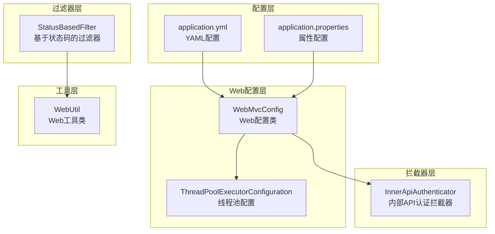
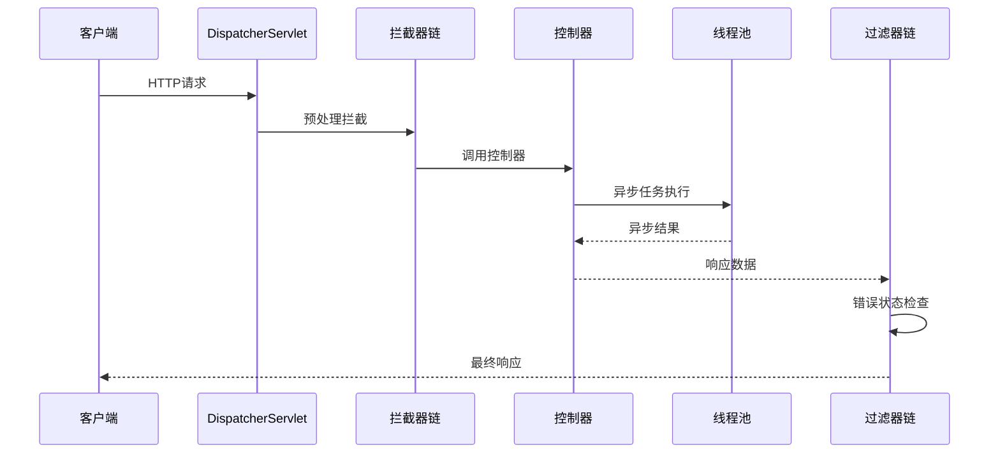
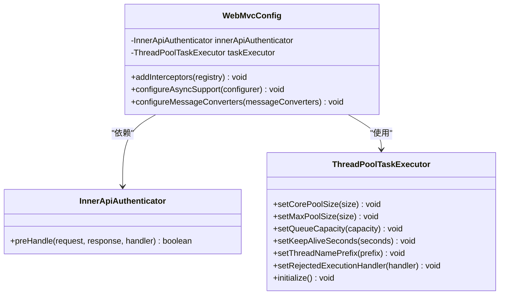
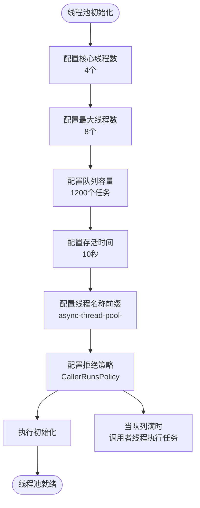
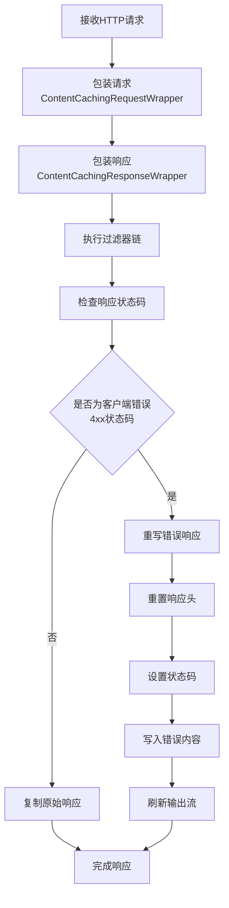
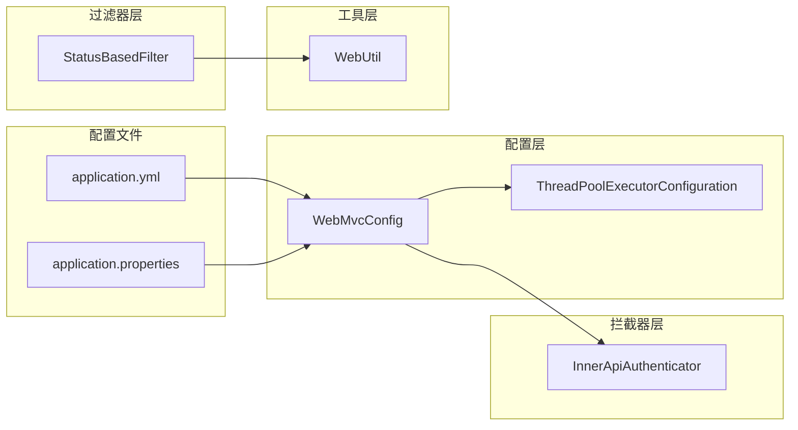

# Web配置管理

<cite>
**本文档引用的文件**
- [WebMvcConfig.java](file://biz-service-impl/src/main/java/com/magicliang/transaction/sys/biz/service/impl/web/config/WebMvcConfig.java)
- [ThreadPoolExecutorConfiguration.java](file://biz-service-impl/src/main/java/com/magicliang/transaction/sys/biz/service/impl/web/config/ThreadPoolExecutorConfiguration.java)
- [InnerApiAuthenticator.java](file://biz-service-impl/src/main/java/com/magicliang/transaction/sys/biz/service/impl/web/interceptor/InnerApiAuthenticator.java)
- [StatusBasedFilter.java](file://biz-service-impl/src/main/java/com/magicliang/transaction/sys/biz/service/impl/web/filter/StatusBasedFilter.java)
- [TestController.java](file://biz-service-impl/src/main/java/com/magicliang/transaction/sys/biz/service/impl/web/controller/TestController.java)
- [WebUtil.java](file://biz-service-impl/src/main/java/com/magicliang/transaction/sys/biz/service/impl/web/util/WebUtil.java)
- [application.yml](file://biz-service-impl/src/main/resources/application.yml)
- [application.properties](file://biz-service-impl/src/main/resources/application.properties)
- [DomainDrivenTransactionSysApplication.java](file://biz-service-impl/src/main/java/com/magicliang/transaction/sys/DomainDrivenTransactionSysApplication.java)
</cite>

## 目录
1. [简介](#简介)
2. [项目结构](#项目结构)
3. [核心组件](#核心组件)
4. [架构概览](#架构概览)
5. [详细组件分析](#详细组件分析)
6. [依赖分析](#依赖分析)
7. [性能考虑](#性能考虑)
8. [故障排查指南](#故障排查指南)
9. [结论](#结论)

## 简介

本文档深入分析了该领域驱动交易系统的Web配置管理模块，重点介绍了WebMvcConfig和ThreadPoolExecutorConfiguration等配置类的设计与实现。该系统采用Spring Boot框架，结合自定义的Web配置和线程池管理，实现了高性能的Web服务架构。

系统的核心特点包括：
- 自定义的WebMvc配置，支持异步请求处理和拦截器注册
- 独立的线程池配置，支持业务异步处理
- 基于过滤器的错误状态处理机制
- 多环境配置管理，支持开发、测试、生产等不同环境

## 项目结构

该Web配置管理模块位于biz-service-impl模块中，采用清晰的分层架构：

**图表来源**
- [WebMvcConfig.java:1-75](file://biz-service-impl/src/main/java/com/magicliang/transaction/sys/biz/service/impl/web/config/WebMvcConfig.java#L1-L75)
- [ThreadPoolExecutorConfiguration.java:1-52](file://biz-service-impl/src/main/java/com/magicliang/transaction/sys/biz/service/impl/web/config/ThreadPoolExecutorConfiguration.java#L1-L52)

**章节来源**
- [WebMvcConfig.java:1-75](file://biz-service-impl/src/main/java/com/magicliang/transaction/sys/biz/service/impl/web/config/WebMvcConfig.java#L1-L75)
- [ThreadPoolExecutorConfiguration.java:1-52](file://biz-service-impl/src/main/java/com/magicliang/transaction/sys/biz/service/impl/web/config/ThreadPoolExecutorConfiguration.java#L1-L52)

## 核心组件

### WebMvcConfig配置类

WebMvcConfig是Spring MVC的核心配置类，负责Web层的整体配置管理：

**主要功能特性：**
- **拦截器配置**：注册内部API认证拦截器，排除Swagger相关路径
- **异步支持配置**：配置线程池执行器用于异步请求处理
- **消息转换器配置**：预留JSON消息转换器扩展点

**配置要点：**
- 拦截器注册使用`addInterceptor()`方法
- 异步支持通过`configureAsyncSupport()`配置
- 支持排除特定路径（如Swagger接口）

**章节来源**
- [WebMvcConfig.java:25-55](file://biz-service-impl/src/main/java/com/magicliang/transaction/sys/biz/service/impl/web/config/WebMvcConfig.java#L25-L55)

### ThreadPoolExecutorConfiguration线程池配置

该配置类提供了独立的线程池管理，支持业务异步处理：

**线程池参数配置：**
- 核心线程数：4个
- 最大线程数：8个  
- 队列容量：1200个任务
- 线程存活时间：10秒
- 线程名称前缀：async-thread-pool-
- 拒绝策略：CallerRunsPolicy（调用者线程执行）

**设计考量：**
- 采用CallerRunsPolicy避免任务丢失
- 合理的队列容量支持突发流量
- 短生命周期线程减少资源占用

**章节来源**
- [ThreadPoolExecutorConfiguration.java:22-50](file://biz-service-impl/src/main/java/com/magicliang/transaction/sys/biz/service/impl/web/config/ThreadPoolExecutorConfiguration.java#L22-L50)

### InnerApiAuthenticator拦截器

这是一个简单的内部API认证拦截器，实现了AsyncHandlerInterceptor接口：

**功能特点：**
- 实现了基本的预处理逻辑
- 支持异步处理器拦截
- 提供扩展点用于实际认证逻辑

**章节来源**
- [InnerApiAuthenticator.java:18-26](file://biz-service-impl/src/main/java/com/magicliang/transaction/sys/biz/service/impl/web/interceptor/InnerApiAuthenticator.java#L18-L26)

### StatusBasedFilter过滤器

基于状态码的过滤器，实现了错误处理和响应重写：

**核心功能：**
- 监控HTTP响应状态码
- 检测客户端错误（4xx状态码）
- 重写错误响应内容
- 支持请求/响应体缓存

**错误处理机制：**
- 客户端错误时重写响应
- 保留原始响应头信息
- 设置统一的错误格式

**章节来源**
- [StatusBasedFilter.java:38-157](file://biz-service-impl/src/main/java/com/magicliang/transaction/sys/biz/service/impl/web/filter/StatusBasedFilter.java#L38-L157)

## 架构概览

系统采用分层架构设计，各组件职责明确：

**图表来源**
- [WebMvcConfig.java:39-55](file://biz-service-impl/src/main/java/com/magicliang/transaction/sys/biz/service/impl/web/config/WebMvcConfig.java#L39-L55)
- [StatusBasedFilter.java:48-86](file://biz-service-impl/src/main/java/com/magicliang/transaction/sys/biz/service/impl/web/filter/StatusBasedFilter.java#L48-L86)

## 详细组件分析

### Web配置类详细分析

WebMvcConfig实现了WebMvcConfigurer接口，提供了完整的Web配置能力：

**图表来源**
- [WebMvcConfig.java:25-55](file://biz-service-impl/src/main/java/com/magicliang/transaction/sys/biz/service/impl/web/config/WebMvcConfig.java#L25-L55)
- [ThreadPoolExecutorConfiguration.java:29-50](file://biz-service-impl/src/main/java/com/magicliang/transaction/sys/biz/service/impl/web/config/ThreadPoolExecutorConfiguration.java#L29-L50)

**章节来源**
- [WebMvcConfig.java:25-75](file://biz-service-impl/src/main/java/com/magicliang/transaction/sys/biz/service/impl/web/config/WebMvcConfig.java#L25-L75)

### 线程池配置深度分析

ThreadPoolExecutorConfiguration提供了企业级的线程池配置：

**图表来源**
- [ThreadPoolExecutorConfiguration.java:29-50](file://biz-service-impl/src/main/java/com/magicliang/transaction/sys/biz/service/impl/web/config/ThreadPoolExecutorConfiguration.java#L29-L50)

**配置参数说明：**
- **核心线程数(4)**：保证最小并发处理能力
- **最大线程数(8)**：支持峰值并发需求
- **队列容量(1200)**：缓冲大量并发请求
- **存活时间(10秒)**：避免空闲线程长期占用资源
- **拒绝策略(CallerRuns)**：确保任务不会丢失

**章节来源**
- [ThreadPoolExecutorConfiguration.java:22-52](file://biz-service-impl/src/main/java/com/magicliang/transaction/sys/biz/service/impl/web/config/ThreadPoolExecutorConfiguration.java#L22-L52)

### 过滤器错误处理机制

StatusBasedFilter实现了智能的错误状态处理：

**图表来源**
- [StatusBasedFilter.java:48-86](file://biz-service-impl/src/main/java/com/magicliang/transaction/sys/biz/service/impl/web/filter/StatusBasedFilter.java#L48-L86)

**错误处理策略：**
- 客户端错误(4xx)：统一格式化错误响应
- 服务器错误(5xx)：保持原始响应内容
- 特殊路径排除：健康检查等不受过滤器影响

**章节来源**
- [StatusBasedFilter.java:88-157](file://biz-service-impl/src/main/java/com/magicliang/transaction/sys/biz/service/impl/web/filter/StatusBasedFilter.java#L88-L157)

## 依赖分析

系统配置依赖关系清晰，各组件耦合度适中：

**图表来源**
- [WebMvcConfig.java:27-31](file://biz-service-impl/src/main/java/com/magicliang/transaction/sys/biz/service/impl/web/config/WebMvcConfig.java#L27-L31)
- [StatusBasedFilter.java:3](file://biz-service-impl/src/main/java/com/magicliang/transaction/sys/biz/service/impl/web/filter/StatusBasedFilter.java#L3)

**依赖关系特点：**
- WebMvcConfig依赖拦截器和线程池
- 过滤器依赖Web工具类进行请求/响应处理
- 配置文件提供运行时参数支持
- 组件间依赖关系简单明确

**章节来源**
- [WebMvcConfig.java:27-31](file://biz-service-impl/src/main/java/com/magicliang/transaction/sys/biz/service/impl/web/config/WebMvcConfig.java#L27-L31)
- [StatusBasedFilter.java:3](file://biz-service-impl/src/main/java/com/magicliang/transaction/sys/biz/service/impl/web/filter/StatusBasedFilter.java#L3)

## 性能考虑

### 线程池性能调优策略

基于当前配置，提供以下性能优化建议：

**线程池参数调优：**
- **核心线程数**：根据CPU核心数和I/O密集度调整
- **队列容量**：监控任务积压情况动态调整
- **拒绝策略**：根据业务重要性选择合适的策略

**异步处理优化：**
- 合理使用CompletableFuture进行异步操作
- 避免长时间阻塞操作
- 监控线程池执行统计信息

**Tomcat连接器配置：**
- **最大线程数**：400个，支持高并发请求
- **最小空闲线程**：20个，保证快速响应
- **连接超时**：360000毫秒，支持长连接

**章节来源**
- [application.properties:10-14](file://biz-service-impl/src/main/resources/application.properties#L10-L14)

### Web层性能优化配置

**异步请求超时配置：**
- **请求超时时间**：360000毫秒（6分钟）
- **适合长耗时操作**：支付处理、通知发送等

**静态资源优化：**
- **静态路径模式**：/assets/**
- **静态资源位置**：classpath:/public
- **支持静态文件缓存**

**章节来源**
- [application.properties:7-9](file://biz-service-impl/src/main/resources/application.properties#L7-L9)
- [application.properties:14](file://biz-service-impl/src/main/resources/application.properties#L14)

### 环境配置管理

系统支持多环境配置，通过YAML文件实现：

**配置文件结构：**
- **基础配置**：通用应用配置
- **环境特定配置**：local、staging、prod等
- **配置优先级**：按文件顺序生效

**环境切换机制：**
- 通过`spring.profiles.active`切换环境
- 支持Kubernetes环境变量覆盖
- 数据源配置按环境分离

**章节来源**
- [application.yml:4-216](file://biz-service-impl/src/main/resources/application.yml#L4-L216)

## 故障排查指南

### 常见问题诊断

**线程池相关问题：**
- **任务积压**：检查队列容量和线程数配置
- **拒绝任务**：监控拒绝策略触发频率
- **线程泄漏**：验证线程池正确关闭

**Web配置问题：**
- **拦截器不生效**：确认路径匹配规则
- **异步请求超时**：检查请求超时配置
- **过滤器异常**：查看过滤器链执行顺序

**性能问题排查：**
- **高延迟**：监控线程池执行时间和队列长度
- **内存泄漏**：检查过滤器包装器使用
- **连接池问题**：验证数据库连接配置

### 调试工具和方法

**日志配置：**
- 开发环境使用offline配置
- 生产环境使用online配置
- 支持不同级别的日志输出

**监控指标：**
- 线程池执行统计
- 请求处理时间
- 错误率统计

**章节来源**
- [application.yml:48-50](file://biz-service-impl/src/main/resources/application.yml#L48-L50)
- [DomainDrivenTransactionSysApplication.java:80-102](file://biz-service-impl/src/main/java/com/magicliang/transaction/sys/DomainDrivenTransactionSysApplication.java#L80-L102)

## 结论

该Web配置管理模块展现了良好的架构设计和实现质量：

**设计优势：**
- 清晰的分层架构，职责分离明确
- 灵活的配置管理，支持多环境部署
- 完善的错误处理机制
- 合理的性能配置策略

**最佳实践建议：**
- 根据实际业务负载调整线程池参数
- 定期监控系统性能指标
- 建立完善的监控告警机制
- 制定配置变更审批流程

**未来改进方向：**
- 增加动态配置更新支持
- 完善性能监控和告警
- 优化异步处理策略
- 加强安全防护措施

该配置模块为整个交易系统的稳定运行提供了坚实的基础，通过合理的参数配置和监控机制，能够有效支撑高并发场景下的业务需求。