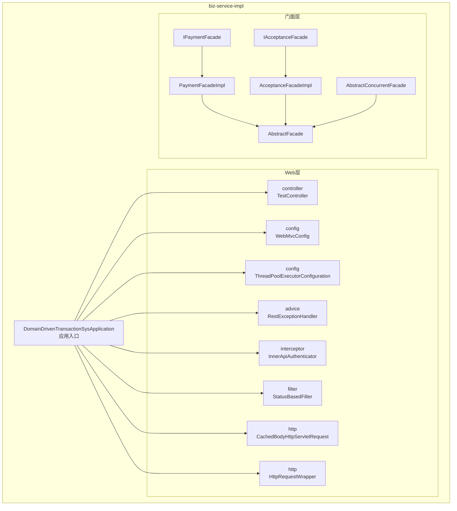
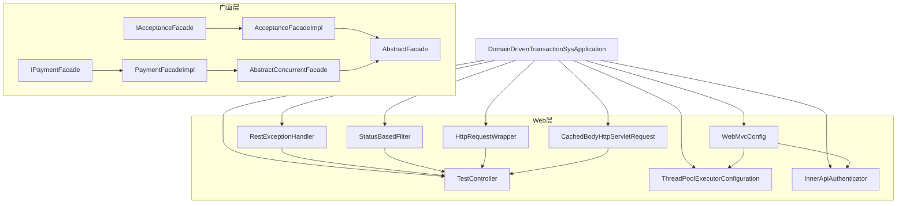
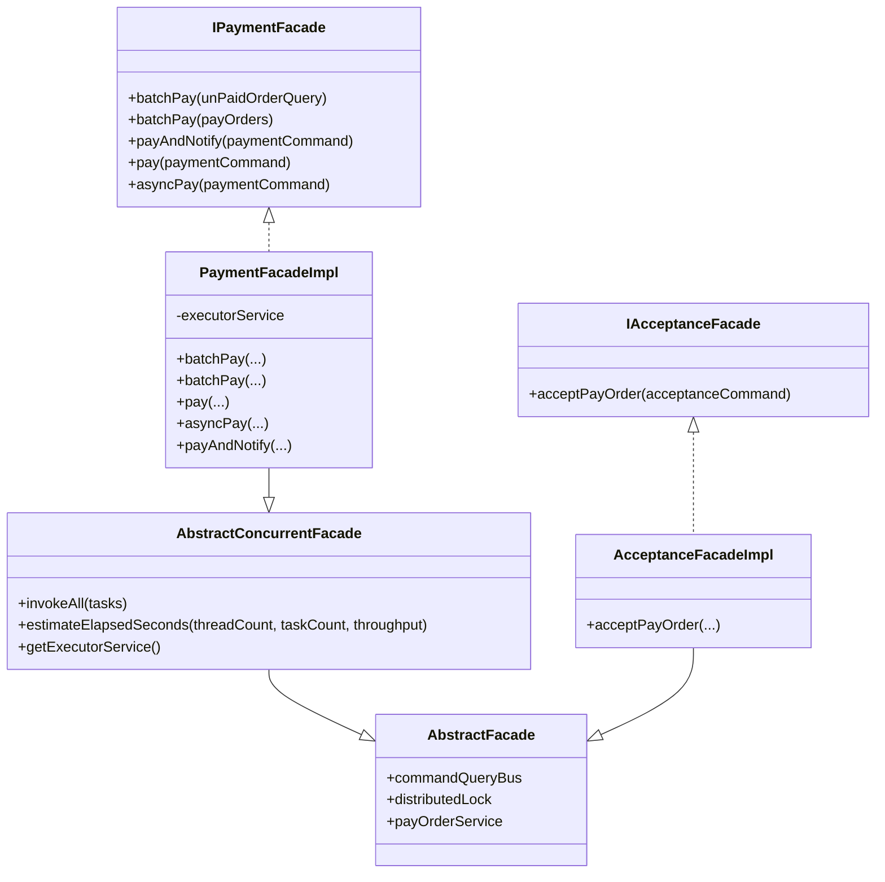
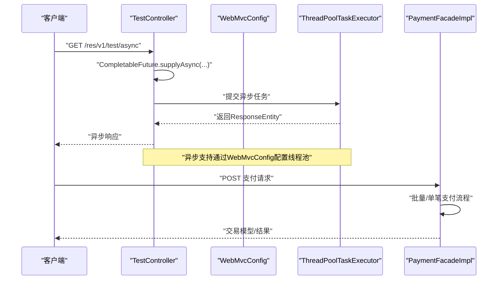
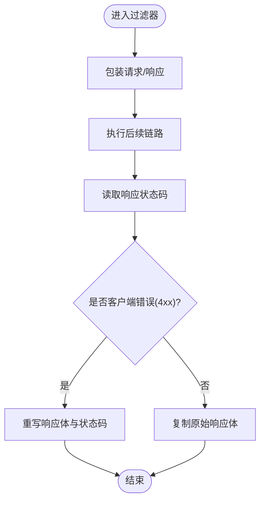
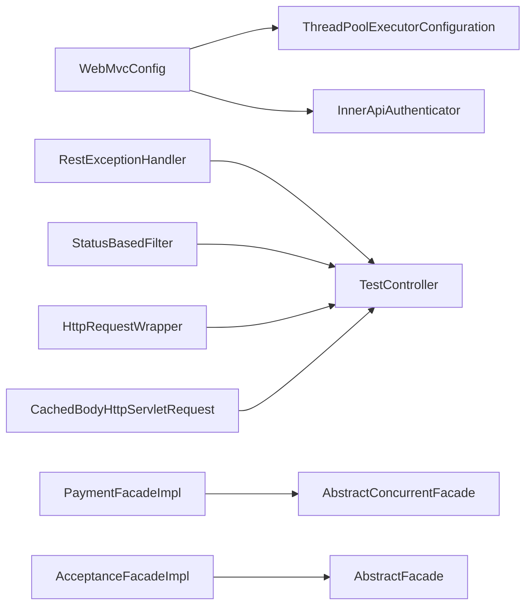

# 业务服务实现层

<cite>
**本文引用的文件**
- [DomainDrivenTransactionSysApplication.java](file://biz-service-impl/src/main/java/com/magicliang/transaction/sys/DomainDrivenTransactionSysApplication.java)
- [TestController.java](file://biz-service-impl/src/main/java/com/magicliang/transaction/sys/biz/service/impl/web/controller/TestController.java)
- [WebMvcConfig.java](file://biz-service-impl/src/main/java/com/magicliang/transaction/sys/biz/service/impl/web/config/WebMvcConfig.java)
- [ThreadPoolExecutorConfiguration.java](file://biz-service-impl/src/main/java/com/magicliang/transaction/sys/biz/service/impl/web/config/ThreadPoolExecutorConfiguration.java)
- [RestExceptionHandler.java](file://biz-service-impl/src/main/java/com/magicliang/transaction/sys/biz/service/impl/web/advice/RestExceptionHandler.java)
- [InnerApiAuthenticator.java](file://biz-service-impl/src/main/java/com/magicliang/transaction/sys/biz/service/impl/web/interceptor/InnerApiAuthenticator.java)
- [StatusBasedFilter.java](file://biz-service-impl/src/main/java/com/magicliang/transaction/sys/biz/service/impl/web/filter/StatusBasedFilter.java)
- [CachedBodyHttpServletRequest.java](file://biz-service-impl/src/main/java/com/magicliang/transaction/sys/biz/service/impl/web/http/CachedBodyHttpServletRequest.java)
- [HttpRequestWrapper.java](file://biz-service-impl/src/main/java/com/magicliang/transaction/sys/biz/service/impl/web/http/HttpRequestWrapper.java)
- [AbstractFacade.java](file://biz-service-impl/src/main/java/com/magicliang/transaction/sys/biz/service/impl/facade/impl/AbstractFacade.java)
- [AbstractConcurrentFacade.java](file://biz-service-impl/src/main/java/com/magicliang/transaction/sys/biz/service/impl/facade/impl/AbstractConcurrentFacade.java)
- [PaymentFacadeImpl.java](file://biz-service-impl/src/main/java/com/magicliang/transaction/sys/biz/service/impl/facade/impl/PaymentFacadeImpl.java)
- [AcceptanceFacadeImpl.java](file://biz-service-impl/src/main/java/com/magicliang/transaction/sys/biz/service/impl/facade/impl/AcceptanceFacadeImpl.java)
- [IPaymentFacade.java](file://biz-service-impl/src/main/java/com/magicliang/transaction/sys/biz/service/impl/facade/IPaymentFacade.java)
- [IAcceptanceFacade.java](file://biz-service-impl/src/main/java/com/magicliang/transaction/sys/biz/service/impl/facade/IAcceptanceFacade.java)
</cite>

## 目录
1. [引言](#引言)
2. [项目结构](#项目结构)
3. [核心组件](#核心组件)
4. [架构总览](#架构总览)
5. [详细组件分析](#详细组件分析)
6. [依赖分析](#依赖分析)
7. [性能考量](#性能考量)
8. [故障排查指南](#故障排查指南)
9. [结论](#结论)
10. [附录](#附录)

## 引言
本文件聚焦biz-service-impl模块，作为系统入口与业务实现的核心，全面阐述其Web层（控制器、门面实现、拦截器、过滤器、HTTP请求包装）的设计与实现，并深入解析门面模式在支付与受理场景中的应用。同时，给出线程池配置、异常处理、HTTP请求包装等Web配置管理要点，以及RESTful API设计与实现的实践建议。

## 项目结构
biz-service-impl模块采用按职责分层的组织方式：
- 应用入口与启动：DomainDrivenTransactionSysApplication负责Spring Boot引导、资源导入与启动阶段初始化。
- Web层：controller、config、advice、filter、http、interceptor、util等子包协同完成请求接入、拦截、包装与响应处理。
- 业务门面层：facade接口与实现类（如PaymentFacadeImpl、AcceptanceFacadeImpl）提供统一业务入口，封装领域交互与并发控制。
- 资源与配置：resources目录包含Spring XML、MyBatis配置、日志配置、数据库脚本与静态资源等。

图表来源
- [DomainDrivenTransactionSysApplication.java:62-73](file://biz-service-impl/src/main/java/com/magicliang/transaction/sys/DomainDrivenTransactionSysApplication.java#L62-L73)
- [WebMvcConfig.java:25-55](file://biz-service-impl/src/main/java/com/magicliang/transaction/sys/biz/service/impl/web/config/WebMvcConfig.java#L25-L55)
- [ThreadPoolExecutorConfiguration.java:22-50](file://biz-service-impl/src/main/java/com/magicliang/transaction/sys/biz/service/impl/web/config/ThreadPoolExecutorConfiguration.java#L22-L50)
- [RestExceptionHandler.java:24-38](file://biz-service-impl/src/main/java/com/magicliang/transaction/sys/biz/service/impl/web/advice/RestExceptionHandler.java#L24-L38)
- [InnerApiAuthenticator.java:20-25](file://biz-service-impl/src/main/java/com/magicliang/transaction/sys/biz/service/impl/web/interceptor/InnerApiAuthenticator.java#L20-L25)
- [StatusBasedFilter.java:38-86](file://biz-service-impl/src/main/java/com/magicliang/transaction/sys/biz/service/impl/web/filter/StatusBasedFilter.java#L38-L86)
- [CachedBodyHttpServletRequest.java:23-47](file://biz-service-impl/src/main/java/com/magicliang/transaction/sys/biz/service/impl/web/http/CachedBodyHttpServletRequest.java#L23-L47)
- [HttpRequestWrapper.java:20-57](file://biz-service-impl/src/main/java/com/magicliang/transaction/sys/biz/service/impl/web/http/HttpRequestWrapper.java#L20-L57)
- [AbstractFacade.java:17-36](file://biz-service-impl/src/main/java/com/magicliang/transaction/sys/biz/service/impl/facade/impl/AbstractFacade.java#L17-L36)
- [AbstractConcurrentFacade.java:25-80](file://biz-service-impl/src/main/java/com/magicliang/transaction/sys/biz/service/impl/facade/impl/AbstractConcurrentFacade.java#L25-L80)
- [PaymentFacadeImpl.java:34-118](file://biz-service-impl/src/main/java/com/magicliang/transaction/sys/biz/service/impl/facade/impl/PaymentFacadeImpl.java#L34-L118)
- [AcceptanceFacadeImpl.java:20-31](file://biz-service-impl/src/main/java/com/magicliang/transaction/sys/biz/service/impl/facade/impl/AcceptanceFacadeImpl.java#L20-L31)
- [IPaymentFacade.java:18-57](file://biz-service-impl/src/main/java/com/magicliang/transaction/sys/biz/service/impl/facade/IPaymentFacade.java#L18-L57)
- [IAcceptanceFacade.java:15-23](file://biz-service-impl/src/main/java/com/magicliang/transaction/sys/biz/service/impl/facade/IAcceptanceFacade.java#L15-L23)

章节来源
- [DomainDrivenTransactionSysApplication.java:62-73](file://biz-service-impl/src/main/java/com/magicliang/transaction/sys/DomainDrivenTransactionSysApplication.java#L62-L73)
- [WebMvcConfig.java:25-55](file://biz-service-impl/src/main/java/com/magicliang/transaction/sys/biz/service/impl/web/config/WebMvcConfig.java#L25-L55)

## 核心组件
- 应用入口与启动
  - DomainDrivenTransactionSysApplication作为Spring Boot入口，启用事务管理、加载XML配置与属性文件，并在启动阶段打印Bean清单与执行特殊文件读取逻辑，便于诊断与初始化。
- Web层配置与组件
  - WebMvcConfig：注册拦截器（内网API鉴权）、配置异步支持使用的线程池。
  - ThreadPoolExecutorConfiguration：定义异步线程池，设置核心/最大线程、队列容量、存活时间、拒绝策略与线程名前缀。
  - RestExceptionHandler：统一异常处理，区分业务异常与运行时异常，返回约定的响应状态。
  - InnerApiAuthenticator：基于AsyncHandlerInterceptor的鉴权拦截器（当前实现为放行）。
  - StatusBasedFilter：基于OncePerRequestFilter的错误码过滤器，捕获客户端错误并重写响应。
  - HTTP请求包装：CachedBodyHttpServletRequest与HttpRequestWrapper分别提供输入流缓存与请求体缓存能力，支持多次读取与复用。
- 门面层
  - AbstractFacade：抽象门面基类，注入命令/查询总线、分布式锁与支付订单服务。
  - AbstractConcurrentFacade：并发门面基类，提供批量任务执行、结果聚合统计与超时估算。
  - PaymentFacadeImpl：支付门面实现，支持批量支付、单笔支付、异步支付与支付后通知。
  - AcceptanceFacadeImpl：受理门面实现，封装受理命令到领域流程的调用。
  - IPaymentFacade/IAcceptanceFacade：门面接口，定义统一业务契约。

章节来源
- [DomainDrivenTransactionSysApplication.java:80-102](file://biz-service-impl/src/main/java/com/magicliang/transaction/sys/DomainDrivenTransactionSysApplication.java#L80-L102)
- [WebMvcConfig.java:39-55](file://biz-service-impl/src/main/java/com/magicliang/transaction/sys/biz/service/impl/web/config/WebMvcConfig.java#L39-L55)
- [ThreadPoolExecutorConfiguration.java:29-50](file://biz-service-impl/src/main/java/com/magicliang/transaction/sys/biz/service/impl/web/config/ThreadPoolExecutorConfiguration.java#L29-L50)
- [RestExceptionHandler.java:26-38](file://biz-service-impl/src/main/java/com/magicliang/transaction/sys/biz/service/impl/web/advice/RestExceptionHandler.java#L26-L38)
- [InnerApiAuthenticator.java:22-25](file://biz-service-impl/src/main/java/com/magicliang/transaction/sys/biz/service/impl/web/interceptor/InnerApiAuthenticator.java#L22-L25)
- [StatusBasedFilter.java:48-86](file://biz-service-impl/src/main/java/com/magicliang/transaction/sys/biz/service/impl/web/filter/StatusBasedFilter.java#L48-L86)
- [CachedBodyHttpServletRequest.java:27-47](file://biz-service-impl/src/main/java/com/magicliang/transaction/sys/biz/service/impl/web/http/CachedBodyHttpServletRequest.java#L27-L47)
- [HttpRequestWrapper.java:24-57](file://biz-service-impl/src/main/java/com/magicliang/transaction/sys/biz/service/impl/web/http/HttpRequestWrapper.java#L24-L57)
- [AbstractFacade.java:22-35](file://biz-service-impl/src/main/java/com/magicliang/transaction/sys/biz/service/impl/facade/impl/AbstractFacade.java#L22-L35)
- [AbstractConcurrentFacade.java:37-93](file://biz-service-impl/src/main/java/com/magicliang/transaction/sys/biz/service/impl/facade/impl/AbstractConcurrentFacade.java#L37-L93)
- [PaymentFacadeImpl.java:66-147](file://biz-service-impl/src/main/java/com/magicliang/transaction/sys/biz/service/impl/facade/impl/PaymentFacadeImpl.java#L66-L147)
- [AcceptanceFacadeImpl.java:28-31](file://biz-service-impl/src/main/java/com/magicliang/transaction/sys/biz/service/impl/facade/impl/AcceptanceFacadeImpl.java#L28-L31)
- [IPaymentFacade.java:26-56](file://biz-service-impl/src/main/java/com/magicliang/transaction/sys/biz/service/impl/facade/IPaymentFacade.java#L26-L56)
- [IAcceptanceFacade.java:17-23](file://biz-service-impl/src/main/java/com/magicliang/transaction/sys/biz/service/impl/facade/IAcceptanceFacade.java#L17-L23)

## 架构总览
biz-service-impl模块以“入口应用 + Web层 + 门面层”为核心，形成清晰的分层架构：
- 入口应用负责容器启动与资源初始化。
- Web层负责请求接入、鉴权、异步执行、异常与错误码处理、请求体缓存与包装。
- 门面层负责业务编排与并发控制，向上提供统一接口，向下对接领域服务与基础设施。

图表来源
- [DomainDrivenTransactionSysApplication.java:62-73](file://biz-service-impl/src/main/java/com/magicliang/transaction/sys/DomainDrivenTransactionSysApplication.java#L62-L73)
- [WebMvcConfig.java:25-55](file://biz-service-impl/src/main/java/com/magicliang/transaction/sys/biz/service/impl/web/config/WebMvcConfig.java#L25-L55)
- [ThreadPoolExecutorConfiguration.java:22-50](file://biz-service-impl/src/main/java/com/magicliang/transaction/sys/biz/service/impl/web/config/ThreadPoolExecutorConfiguration.java#L22-L50)
- [RestExceptionHandler.java:24-38](file://biz-service-impl/src/main/java/com/magicliang/transaction/sys/biz/service/impl/web/advice/RestExceptionHandler.java#L24-L38)
- [InnerApiAuthenticator.java:20-25](file://biz-service-impl/src/main/java/com/magicliang/transaction/sys/biz/service/impl/web/interceptor/InnerApiAuthenticator.java#L20-L25)
- [StatusBasedFilter.java:38-86](file://biz-service-impl/src/main/java/com/magicliang/transaction/sys/biz/service/impl/web/filter/StatusBasedFilter.java#L38-L86)
- [HttpRequestWrapper.java:20-57](file://biz-service-impl/src/main/java/com/magicliang/transaction/sys/biz/service/impl/web/http/HttpRequestWrapper.java#L20-L57)
- [CachedBodyHttpServletRequest.java:23-47](file://biz-service-impl/src/main/java/com/magicliang/transaction/sys/biz/service/impl/web/http/CachedBodyHttpServletRequest.java#L23-L47)
- [AbstractFacade.java:17-36](file://biz-service-impl/src/main/java/com/magicliang/transaction/sys/biz/service/impl/facade/impl/AbstractFacade.java#L17-L36)
- [AbstractConcurrentFacade.java:25-80](file://biz-service-impl/src/main/java/com/magicliang/transaction/sys/biz/service/impl/facade/impl/AbstractConcurrentFacade.java#L25-L80)
- [PaymentFacadeImpl.java:34-118](file://biz-service-impl/src/main/java/com/magicliang/transaction/sys/biz/service/impl/facade/impl/PaymentFacadeImpl.java#L34-L118)
- [AcceptanceFacadeImpl.java:20-31](file://biz-service-impl/src/main/java/com/magicliang/transaction/sys/biz/service/impl/facade/impl/AcceptanceFacadeImpl.java#L20-L31)
- [IPaymentFacade.java:18-57](file://biz-service-impl/src/main/java/com/magicliang/transaction/sys/biz/service/impl/facade/IPaymentFacade.java#L18-L57)
- [IAcceptanceFacade.java:15-23](file://biz-service-impl/src/main/java/com/magicliang/transaction/sys/biz/service/impl/facade/IAcceptanceFacade.java#L15-L23)

## 详细组件分析

### Web控制器（RESTful API）
- TestController提供多类测试端点，涵盖路径参数、JSON响应、异步返回、重定向、多媒体下载与流式响应等，体现Web层对多样化响应形态的支持。
- 设计要点
  - 统一路径前缀与版本化路由，便于演进与治理。
  - 多响应类型支持（RedirectView、ResponseEntity、字符串），满足不同场景。
  - 流式响应与静态资源读取，结合Content-Type与Transfer-Encoding实现大文件传输。

章节来源
- [TestController.java:65-100](file://biz-service-impl/src/main/java/com/magicliang/transaction/sys/biz/service/impl/web/controller/TestController.java#L65-L100)
- [TestController.java:102-154](file://biz-service-impl/src/main/java/com/magicliang/transaction/sys/biz/service/impl/web/controller/TestController.java#L102-L154)
- [TestController.java:156-195](file://biz-service-impl/src/main/java/com/magicliang/transaction/sys/biz/service/impl/web/controller/TestController.java#L156-L195)
- [TestController.java:211-229](file://biz-service-impl/src/main/java/com/magicliang/transaction/sys/biz/service/impl/web/controller/TestController.java#L211-L229)

### 门面模式与支付门面实现
- 门面模式应用
  - 通过IPaymentFacade与IAcceptanceFacade定义统一业务接口，PaymentFacadeImpl与AcceptanceFacadeImpl实现具体业务流程，向上屏蔽复杂度，向下对接命令/查询总线与领域服务。
- 并发与批量处理
  - AbstractConcurrentFacade提供批量任务执行、结果聚合与异常包装；PaymentFacadeImpl基于估算执行时间与分布式锁协调批量支付，避免超负载与竞态。
- 支付流程要点
  - 单笔支付：将命令转换为领域命令并通过命令/查询总线发送。
  - 异步支付：提交至线程池执行支付并通知。
  - 支付后通知：根据支付结果异步触发通知门面。

图表来源
- [AbstractFacade.java:17-36](file://biz-service-impl/src/main/java/com/magicliang/transaction/sys/biz/service/impl/facade/impl/AbstractFacade.java#L17-L36)
- [AbstractConcurrentFacade.java:25-93](file://biz-service-impl/src/main/java/com/magicliang/transaction/sys/biz/service/impl/facade/impl/AbstractConcurrentFacade.java#L25-L93)
- [IPaymentFacade.java:18-57](file://biz-service-impl/src/main/java/com/magicliang/transaction/sys/biz/service/impl/facade/IPaymentFacade.java#L18-L57)
- [IAcceptanceFacade.java:15-23](file://biz-service-impl/src/main/java/com/magicliang/transaction/sys/biz/service/impl/facade/IAcceptanceFacade.java#L15-L23)
- [PaymentFacadeImpl.java:34-147](file://biz-service-impl/src/main/java/com/magicliang/transaction/sys/biz/service/impl/facade/impl/PaymentFacadeImpl.java#L34-L147)
- [AcceptanceFacadeImpl.java:20-31](file://biz-service-impl/src/main/java/com/magicliang/transaction/sys/biz/service/impl/facade/impl/AcceptanceFacadeImpl.java#L20-L31)

章节来源
- [AbstractFacade.java:22-35](file://biz-service-impl/src/main/java/com/magicliang/transaction/sys/biz/service/impl/facade/impl/AbstractFacade.java#L22-L35)
- [AbstractConcurrentFacade.java:37-93](file://biz-service-impl/src/main/java/com/magicliang/transaction/sys/biz/service/impl/facade/impl/AbstractConcurrentFacade.java#L37-L93)
- [PaymentFacadeImpl.java:66-147](file://biz-service-impl/src/main/java/com/magicliang/transaction/sys/biz/service/impl/facade/impl/PaymentFacadeImpl.java#L66-L147)
- [AcceptanceFacadeImpl.java:28-31](file://biz-service-impl/src/main/java/com/magicliang/transaction/sys/biz/service/impl/facade/impl/AcceptanceFacadeImpl.java#L28-L31)

### Web层配置管理（线程池、异常处理、HTTP请求包装）
- 线程池配置
  - ThreadPoolExecutorConfiguration定义异步线程池，设置核心/最大线程、队列容量、存活时间、拒绝策略与线程名前缀，供Web异步支持使用。
- 异常处理
  - RestExceptionHandler继承ResponseEntityExceptionHandler，集中处理异常，区分业务异常与运行时异常，返回约定的响应状态。
- HTTP请求包装
  - CachedBodyHttpServletRequest与HttpRequestWrapper分别提供输入流与请求体缓存，支持多次读取与复用，便于日志记录与下游处理。

图表来源
- [WebMvcConfig.java:52-55](file://biz-service-impl/src/main/java/com/magicliang/transaction/sys/biz/service/impl/web/config/WebMvcConfig.java#L52-L55)
- [ThreadPoolExecutorConfiguration.java:29-50](file://biz-service-impl/src/main/java/com/magicliang/transaction/sys/biz/service/impl/web/config/ThreadPoolExecutorConfiguration.java#L29-L50)
- [TestController.java:102-105](file://biz-service-impl/src/main/java/com/magicliang/transaction/sys/biz/service/impl/web/controller/TestController.java#L102-L105)
- [PaymentFacadeImpl.java:115-128](file://biz-service-impl/src/main/java/com/magicliang/transaction/sys/biz/service/impl/facade/impl/PaymentFacadeImpl.java#L115-L128)

章节来源
- [ThreadPoolExecutorConfiguration.java:29-50](file://biz-service-impl/src/main/java/com/magicliang/transaction/sys/biz/service/impl/web/config/ThreadPoolExecutorConfiguration.java#L29-L50)
- [RestExceptionHandler.java:26-38](file://biz-service-impl/src/main/java/com/magicliang/transaction/sys/biz/service/impl/web/advice/RestExceptionHandler.java#L26-L38)
- [CachedBodyHttpServletRequest.java:27-47](file://biz-service-impl/src/main/java/com/magicliang/transaction/sys/biz/service/impl/web/http/CachedBodyHttpServletRequest.java#L27-L47)
- [HttpRequestWrapper.java:24-57](file://biz-service-impl/src/main/java/com/magicliang/transaction/sys/biz/service/impl/web/http/HttpRequestWrapper.java#L24-L57)

### 拦截器与过滤器
- 拦截器
  - InnerApiAuthenticator实现AsyncHandlerInterceptor，当前返回true放行，可扩展为内网API鉴权。
- 过滤器
  - StatusBasedFilter基于OncePerRequestFilter，包装请求/响应，记录请求/响应体，识别客户端错误（4xx），重写响应内容并保留原始响应头。

图表来源
- [StatusBasedFilter.java:48-86](file://biz-service-impl/src/main/java/com/magicliang/transaction/sys/biz/service/impl/web/filter/StatusBasedFilter.java#L48-L86)
- [StatusBasedFilter.java:95-111](file://biz-service-impl/src/main/java/com/magicliang/transaction/sys/biz/service/impl/web/filter/StatusBasedFilter.java#L95-L111)
- [StatusBasedFilter.java:153-155](file://biz-service-impl/src/main/java/com/magicliang/transaction/sys/biz/service/impl/web/filter/StatusBasedFilter.java#L153-L155)

章节来源
- [InnerApiAuthenticator.java:22-25](file://biz-service-impl/src/main/java/com/magicliang/transaction/sys/biz/service/impl/web/interceptor/InnerApiAuthenticator.java#L22-L25)
- [StatusBasedFilter.java:48-86](file://biz-service-impl/src/main/java/com/magicliang/transaction/sys/biz/service/impl/web/filter/StatusBasedFilter.java#L48-L86)

## 依赖分析
- 组件耦合
  - Web层与门面层通过接口解耦，门面实现依赖抽象基类与命令/查询总线、分布式锁与服务，保持高内聚低耦合。
  - WebMvcConfig依赖线程池与拦截器，形成Web异步与安全的配置闭环。
- 外部依赖
  - Spring MVC、Spring WebFlux（通过异步支持）、Apache Commons IO、日志框架等。

图表来源
- [WebMvcConfig.java:27-31](file://biz-service-impl/src/main/java/com/magicliang/transaction/sys/biz/service/impl/web/config/WebMvcConfig.java#L27-L31)
- [ThreadPoolExecutorConfiguration.java:29-50](file://biz-service-impl/src/main/java/com/magicliang/transaction/sys/biz/service/impl/web/config/ThreadPoolExecutorConfiguration.java#L29-L50)
- [InnerApiAuthenticator.java:20-25](file://biz-service-impl/src/main/java/com/magicliang/transaction/sys/biz/service/impl/web/interceptor/InnerApiAuthenticator.java#L20-L25)
- [RestExceptionHandler.java:24-38](file://biz-service-impl/src/main/java/com/magicliang/transaction/sys/biz/service/impl/web/advice/RestExceptionHandler.java#L24-L38)
- [StatusBasedFilter.java:38-86](file://biz-service-impl/src/main/java/com/magicliang/transaction/sys/biz/service/impl/web/filter/StatusBasedFilter.java#L38-L86)
- [HttpRequestWrapper.java:20-57](file://biz-service-impl/src/main/java/com/magicliang/transaction/sys/biz/service/impl/web/http/HttpRequestWrapper.java#L20-L57)
- [CachedBodyHttpServletRequest.java:23-47](file://biz-service-impl/src/main/java/com/magicliang/transaction/sys/biz/service/impl/web/http/CachedBodyHttpServletRequest.java#L23-L47)
- [AbstractConcurrentFacade.java:25-80](file://biz-service-impl/src/main/java/com/magicliang/transaction/sys/biz/service/impl/facade/impl/AbstractConcurrentFacade.java#L25-L80)
- [AbstractFacade.java:17-36](file://biz-service-impl/src/main/java/com/magicliang/transaction/sys/biz/service/impl/facade/impl/AbstractFacade.java#L17-L36)
- [PaymentFacadeImpl.java:34-118](file://biz-service-impl/src/main/java/com/magicliang/transaction/sys/biz/service/impl/facade/impl/PaymentFacadeImpl.java#L34-L118)
- [AcceptanceFacadeImpl.java:20-31](file://biz-service-impl/src/main/java/com/magicliang/transaction/sys/biz/service/impl/facade/impl/AcceptanceFacadeImpl.java#L20-L31)

章节来源
- [WebMvcConfig.java:39-55](file://biz-service-impl/src/main/java/com/magicliang/transaction/sys/biz/service/impl/web/config/WebMvcConfig.java#L39-L55)
- [ThreadPoolExecutorConfiguration.java:29-50](file://biz-service-impl/src/main/java/com/magicliang/transaction/sys/biz/service/impl/web/config/ThreadPoolExecutorConfiguration.java#L29-L50)
- [AbstractFacade.java:22-35](file://biz-service-impl/src/main/java/com/magicliang/transaction/sys/biz/service/impl/facade/impl/AbstractFacade.java#L22-L35)
- [AbstractConcurrentFacade.java:37-93](file://biz-service-impl/src/main/java/com/magicliang/transaction/sys/biz/service/impl/facade/impl/AbstractConcurrentFacade.java#L37-L93)

## 性能考量
- 线程池与异步
  - 通过ThreadPoolExecutorConfiguration配置合理的线程数与队列容量，结合WebMvcConfig的异步支持，提升高并发下的吞吐与响应性。
- 批量与锁
  - PaymentFacadeImpl基于估算执行时间与分布式锁协调批量任务，避免超载与竞态，提高整体稳定性。
- 输入流与请求体缓存
  - CachedBodyHttpServletRequest与HttpRequestWrapper支持多次读取，减少重复I/O与解析成本，便于日志与审计。

章节来源
- [ThreadPoolExecutorConfiguration.java:33-46](file://biz-service-impl/src/main/java/com/magicliang/transaction/sys/biz/service/impl/web/config/ThreadPoolExecutorConfiguration.java#L33-L46)
- [WebMvcConfig.java:52-55](file://biz-service-impl/src/main/java/com/magicliang/transaction/sys/biz/service/impl/web/config/WebMvcConfig.java#L52-L55)
- [AbstractConcurrentFacade.java:90-93](file://biz-service-impl/src/main/java/com/magicliang/transaction/sys/biz/service/impl/facade/impl/AbstractConcurrentFacade.java#L90-L93)
- [CachedBodyHttpServletRequest.java:27-47](file://biz-service-impl/src/main/java/com/magicliang/transaction/sys/biz/service/impl/web/http/CachedBodyHttpServletRequest.java#L27-L47)
- [HttpRequestWrapper.java:24-57](file://biz-service-impl/src/main/java/com/magicliang/transaction/sys/biz/service/impl/web/http/HttpRequestWrapper.java#L24-L57)

## 故障排查指南
- 异常处理
  - RestExceptionHandler统一捕获异常，区分业务异常与运行时异常，确保对外返回一致的状态与消息。
- 错误码过滤
  - StatusBasedFilter在客户端错误（4xx）时重写响应体与状态码，保留原始响应头，便于定位问题。
- 日志与包装
  - 通过包装请求/响应记录请求/响应体，结合过滤器与拦截器日志，快速定位问题根因。

章节来源
- [RestExceptionHandler.java:26-38](file://biz-service-impl/src/main/java/com/magicliang/transaction/sys/biz/service/impl/web/advice/RestExceptionHandler.java#L26-L38)
- [StatusBasedFilter.java:78-111](file://biz-service-impl/src/main/java/com/magicliang/transaction/sys/biz/service/impl/web/filter/StatusBasedFilter.java#L78-L111)
- [StatusBasedFilter.java:120-144](file://biz-service-impl/src/main/java/com/magicliang/transaction/sys/biz/service/impl/web/filter/StatusBasedFilter.java#L120-L144)

## 结论
biz-service-impl模块通过清晰的分层与门面模式，实现了业务入口与实现的解耦；Web层配置完善，覆盖线程池、异常处理、拦截与过滤、请求包装等关键能力；门面层结合并发与锁策略，保障批量业务的稳定性与性能。整体架构具备良好的可维护性与扩展性，适合在高并发与复杂业务场景中持续演进。

## 附录
- 典型RESTful API设计建议
  - 路由版本化与语义化命名，统一响应结构与状态码。
  - 对大文件与流式场景，明确Content-Type与Transfer-Encoding，结合缓存包装器提升可靠性。
- 门面接口设计建议
  - 明确职责边界，将复杂流程封装在实现类中，接口仅暴露必要方法。
  - 对批量操作提供幂等与可观测性（统计与日志），便于监控与排障。