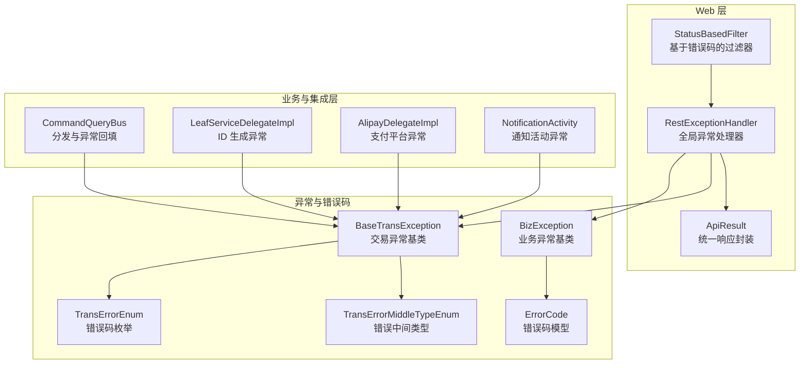
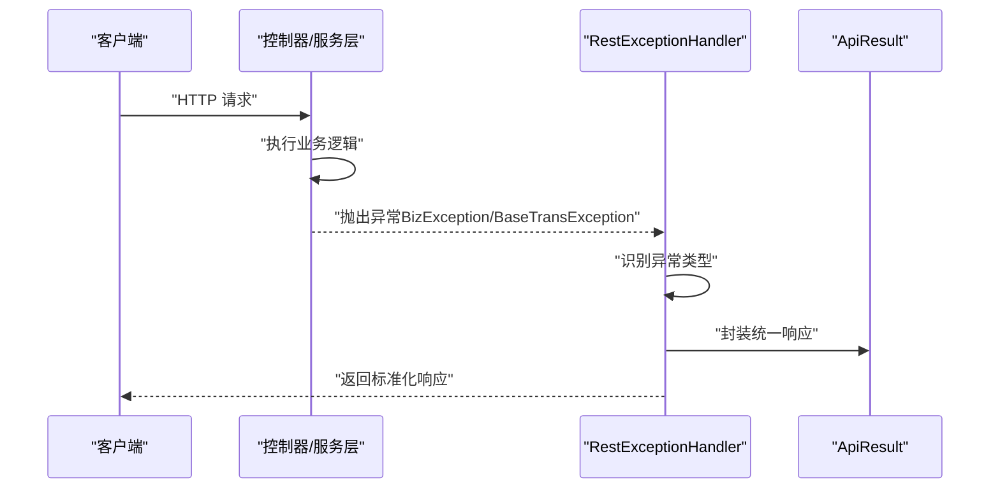
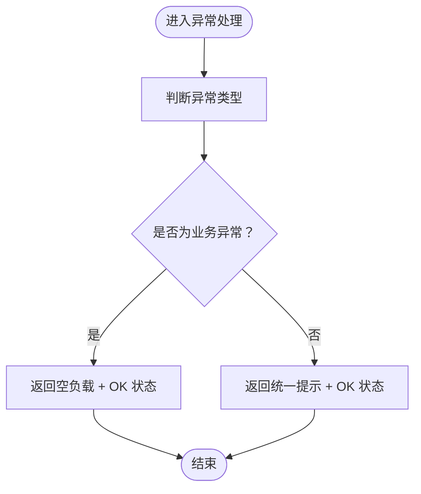
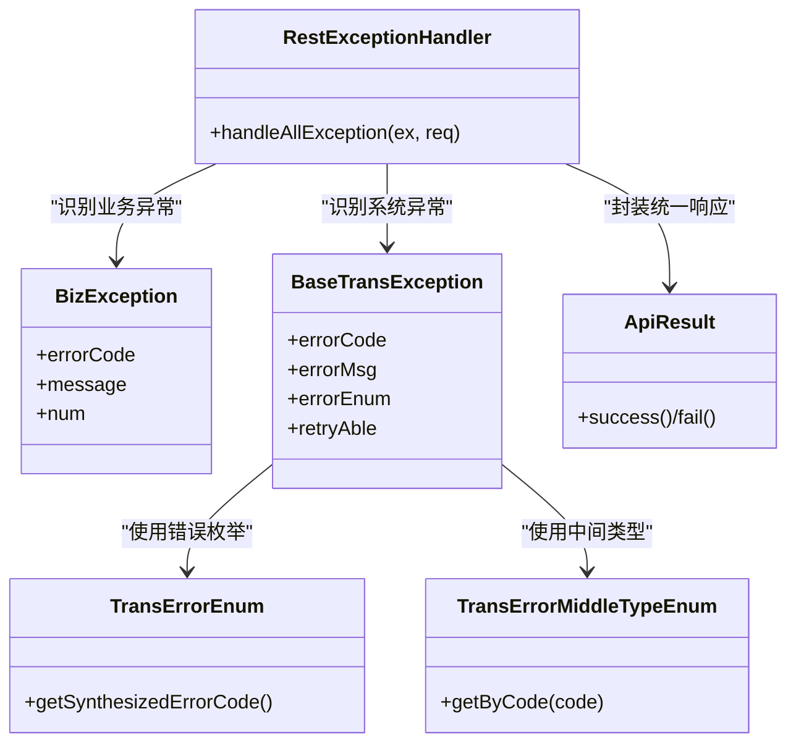

# 异常处理机制

<cite>
**本文引用的文件**
- [biz-service-impl/src/main/java/com/magicliang/transaction/sys/biz/service/impl/web/advice/RestExceptionHandler.java](file://biz-service-impl/src/main/java/com/magicliang/transaction/sys/biz/service/impl/web/advice/RestExceptionHandler.java)
- [common-util/src/main/java/com/magicliang/transaction/sys/common/exception/BizException.java](file://common-util/src/main/java/com/magicliang/transaction/sys/common/exception/BizException.java)
- [common-util/src/main/java/com/magicliang/transaction/sys/common/exception/BaseTransException.java](file://common-util/src/main/java/com/magicliang/transaction/sys/common/exception/BaseTransException.java)
- [common-util/src/main/java/com/magicliang/transaction/sys/common/exception/DistributedLockException.java](file://common-util/src/main/java/com/magicliang/transaction/sys/common/exception/DistributedLockException.java)
- [common-util/src/main/java/com/magicliang/transaction/sys/common/enums/TransErrorEnum.java](file://common-util/src/main/java/com/magicliang/transaction/sys/common/enums/TransErrorEnum.java)
- [common-util/src/main/java/com/magicliang/transaction/sys/common/enums/TransErrorMiddleTypeEnum.java](file://common-util/src/main/java/com/magicliang/transaction/sys/common/enums/TransErrorMiddleTypeEnum.java)
- [common-util/src/main/java/com/magicliang/transaction/sys/common/constant/ErrorCode.java](file://common-util/src/main/java/com/magicliang/transaction/sys/common/constant/ErrorCode.java)
- [common-util/src/main/java/com/magicliang/transaction/sys/common/constant/ErrorConstant.java](file://common-util/src/main/java/com/magicliang/transaction/sys/common/constant/ErrorConstant.java)
- [common-util/src/main/java/com/magicliang/transaction/sys/common/util/CustomExceptionUtil.java](file://common-util/src/main/java/com/magicliang/transaction/sys/common/util/CustomExceptionUtil.java)
- [biz-service-impl/src/main/java/com/magicliang/transaction/sys/biz/service/impl/web/model/vo/ApiResult.java](file://biz-service-impl/src/main/java/com/magicliang/transaction/sys/biz/service/impl/web/model/vo/ApiResult.java)
- [biz-service-impl/src/main/java/com/magicliang/transaction/sys/biz/service/impl/web/filter/StatusBasedFilter.java](file://biz-service-impl/src/main/java/com/magicliang/transaction/sys/biz/service/impl/web/filter/StatusBasedFilter.java)
- [biz-shared/src/main/java/com/magicliang/transaction/sys/biz/shared/locator/CommandQueryBus.java](file://biz-shared/src/main/java/com/magicliang/transaction/sys/biz/shared/locator/CommandQueryBus.java)
- [common-service-integration/src/main/java/com/magicliang/transaction/sys/common/service/integration/delegate/sequence/impl/LeafServiceDelegateImpl.java](file://common-service-integration/src/main/java/com/magicliang/transaction/sys/common/service/integration/delegate/sequence/impl/LeafServiceDelegateImpl.java)
- [common-service-integration/src/main/java/com/magicliang/transaction/sys/common/service/integration/delegate/alipay/impl/AlipayDelegateImpl.java](file://common-service-integration/src/main/java/com/magicliang/transaction/sys/common/service/integration/delegate/alipay/impl/AlipayDelegateImpl.java)
- [core-service/src/main/java/com/magicliang/transaction/sys/core/domain/activity/notification/NotificationActivity.java](file://core-service/src/main/java/com/magicliang/transaction/sys/core/domain/activity/notification/NotificationActivity.java)
</cite>

## 目录
1. [简介](#简介)
2. [项目结构](#项目结构)
3. [核心组件](#核心组件)
4. [架构总览](#架构总览)
5. [详细组件分析](#详细组件分析)
6. [依赖分析](#依赖分析)
7. [性能考虑](#性能考虑)
8. [故障排查指南](#故障排查指南)
9. [结论](#结论)
10. [附录](#附录)

## 简介
本文件聚焦于领域驱动交易系统的异常处理机制，系统性梳理了全局异常处理器 RestExceptionHandler 的设计与实现，以及围绕业务异常、系统异常与参数异常的统一处理策略。文档从异常分类、错误码定义、响应格式标准化等方面展开，解释如何通过异常处理器实现友好提示与完整信息传递，并给出最佳实践示例（以路径引用代替具体代码），帮助读者在 Web 层构建一致、可观测且易维护的异常处理体系。

## 项目结构
异常处理相关代码主要分布在以下模块与包中：
- Web 层增强与适配：biz-service-impl/web/advice（全局异常处理器）、web/model/vo（统一响应封装）
- 异常与错误码定义：common-util/exception、common-util/enums、common-util/constant
- 过滤器与拦截器：biz-service-impl/web/filter（状态与错误码过滤）
- 业务与集成层抛出异常：biz-shared、common-service-integration、core-service

图表来源
- [biz-service-impl/src/main/java/com/magicliang/transaction/sys/biz/service/impl/web/advice/RestExceptionHandler.java:1-39](file://biz-service-impl/src/main/java/com/magicliang/transaction/sys/biz/service/impl/web/advice/RestExceptionHandler.java#L1-L39)
- [biz-service-impl/src/main/java/com/magicliang/transaction/sys/biz/service/impl/web/model/vo/ApiResult.java:1-87](file://biz-service-impl/src/main/java/com/magicliang/transaction/sys/biz/service/impl/web/model/vo/ApiResult.java#L1-L87)
- [biz-service-impl/src/main/java/com/magicliang/transaction/sys/biz/service/impl/web/filter/StatusBasedFilter.java:38-60](file://biz-service-impl/src/main/java/com/magicliang/transaction/sys/biz/service/impl/web/filter/StatusBasedFilter.java#L38-L60)
- [common-util/src/main/java/com/magicliang/transaction/sys/common/exception/BizException.java:1-93](file://common-util/src/main/java/com/magicliang/transaction/sys/common/exception/BizException.java#L1-L93)
- [common-util/src/main/java/com/magicliang/transaction/sys/common/exception/BaseTransException.java:1-125](file://common-util/src/main/java/com/magicliang/transaction/sys/common/exception/BaseTransException.java#L1-L125)
- [common-util/src/main/java/com/magicliang/transaction/sys/common/enums/TransErrorEnum.java:1-327](file://common-util/src/main/java/com/magicliang/transaction/sys/common/enums/TransErrorEnum.java#L1-L327)
- [common-util/src/main/java/com/magicliang/transaction/sys/common/constant/ErrorCode.java:1-46](file://common-util/src/main/java/com/magicliang/transaction/sys/common/constant/ErrorCode.java#L1-L46)

章节来源
- [biz-service-impl/src/main/java/com/magicliang/transaction/sys/biz/service/impl/web/advice/RestExceptionHandler.java:1-39](file://biz-service-impl/src/main/java/com/magicliang/transaction/sys/biz/service/impl/web/advice/RestExceptionHandler.java#L1-L39)
- [common-util/src/main/java/com/magicliang/transaction/sys/common/exception/BizException.java:1-93](file://common-util/src/main/java/com/magicliang/transaction/sys/common/exception/BizException.java#L1-L93)
- [common-util/src/main/java/com/magicliang/transaction/sys/common/exception/BaseTransException.java:1-125](file://common-util/src/main/java/com/magicliang/transaction/sys/common/exception/BaseTransException.java#L1-L125)
- [common-util/src/main/java/com/magicliang/transaction/sys/common/enums/TransErrorEnum.java:1-327](file://common-util/src/main/java/com/magicliang/transaction/sys/common/enums/TransErrorEnum.java#L1-L327)
- [common-util/src/main/java/com/magicliang/transaction/sys/common/constant/ErrorCode.java:1-46](file://common-util/src/main/java/com/magicliang/transaction/sys/common/constant/ErrorCode.java#L1-L46)
- [biz-service-impl/src/main/java/com/magicliang/transaction/sys/biz/service/impl/web/model/vo/ApiResult.java:1-87](file://biz-service-impl/src/main/java/com/magicliang/transaction/sys/biz/service/impl/web/model/vo/ApiResult.java#L1-L87)
- [biz-service-impl/src/main/java/com/magicliang/transaction/sys/biz/service/impl/web/filter/StatusBasedFilter.java:38-60](file://biz-service-impl/src/main/java/com/magicliang/transaction/sys/biz/service/impl/web/filter/StatusBasedFilter.java#L38-L60)

## 核心组件
- 全局异常处理器：RestExceptionHandler 继承 Spring 的 ResponseEntityExceptionHandler，提供统一的异常捕获与响应封装能力。
- 业务异常基类：BizException 提供多种构造方式，支持错误码、枚举、Throwable 等组合，便于上层快速抛出与识别。
- 交易异常基类：BaseTransException 支持错误码枚举、自定义错误码与消息、是否可重试等字段，满足跨服务与跨系统的错误语义。
- 错误码体系：TransErrorEnum 定义了完整的错误码枚举集合，TransErrorMiddleTypeEnum 定义错误中间类型，ErrorCode 作为通用错误码模型。
- 统一响应封装：ApiResult 提供统一的成功/失败响应结构，便于前端消费与状态判断。
- 过滤器：StatusBasedFilter 提供基于错误码的过滤能力，作为异常处理的补充与扩展点。

章节来源
- [biz-service-impl/src/main/java/com/magicliang/transaction/sys/biz/service/impl/web/advice/RestExceptionHandler.java:24-38](file://biz-service-impl/src/main/java/com/magicliang/transaction/sys/biz/service/impl/web/advice/RestExceptionHandler.java#L24-L38)
- [common-util/src/main/java/com/magicliang/transaction/sys/common/exception/BizException.java:22-91](file://common-util/src/main/java/com/magicliang/transaction/sys/common/exception/BizException.java#L22-L91)
- [common-util/src/main/java/com/magicliang/transaction/sys/common/exception/BaseTransException.java:21-123](file://common-util/src/main/java/com/magicliang/transaction/sys/common/exception/BaseTransException.java#L21-L123)
- [common-util/src/main/java/com/magicliang/transaction/sys/common/enums/TransErrorEnum.java:22-325](file://common-util/src/main/java/com/magicliang/transaction/sys/common/enums/TransErrorEnum.java#L22-L325)
- [common-util/src/main/java/com/magicliang/transaction/sys/common/enums/TransErrorMiddleTypeEnum.java:17-48](file://common-util/src/main/java/com/magicliang/transaction/sys/common/enums/TransErrorMiddleTypeEnum.java#L17-L48)
- [common-util/src/main/java/com/magicliang/transaction/sys/common/constant/ErrorCode.java:22-44](file://common-util/src/main/java/com/magicliang/transaction/sys/common/constant/ErrorCode.java#L22-L44)
- [biz-service-impl/src/main/java/com/magicliang/transaction/sys/biz/service/impl/web/model/vo/ApiResult.java:16-85](file://biz-service-impl/src/main/java/com/magicliang/transaction/sys/biz/service/impl/web/model/vo/ApiResult.java#L16-L85)

## 架构总览
异常处理在 Web 层的职责链如下：
- 控制器或服务层抛出异常（业务异常 BizException 或交易异常 BaseTransException）。
- 全局异常处理器 RestExceptionHandler 捕获未处理异常，依据异常类型进行差异化处理。
- 对于业务异常，返回标准响应结构；对于系统异常，返回统一错误提示。
- 统一响应封装 ApiResult 保证前后端交互的一致性。
- 过滤器 StatusBasedFilter 可在特定场景下补充错误码与状态处理。

图表来源
- [biz-service-impl/src/main/java/com/magicliang/transaction/sys/biz/service/impl/web/advice/RestExceptionHandler.java:26-37](file://biz-service-impl/src/main/java/com/magicliang/transaction/sys/biz/service/impl/web/advice/RestExceptionHandler.java#L26-L37)
- [biz-service-impl/src/main/java/com/magicliang/transaction/sys/biz/service/impl/web/model/vo/ApiResult.java:35-70](file://biz-service-impl/src/main/java/com/magicliang/transaction/sys/biz/service/impl/web/model/vo/ApiResult.java#L35-L70)

## 详细组件分析

### 全局异常处理器 RestExceptionHandler
- 设计要点
  - 继承 ResponseEntityExceptionHandler，覆盖默认异常处理行为。
  - 使用 @ExceptionHandler 捕获 Exception.class，统一处理所有未捕获异常。
  - 区分业务异常（BizException）与系统异常，分别返回空负载与统一提示文本。
- 处理策略
  - 业务异常：返回 OK 状态与空负载，便于上层根据错误码与消息自行判定。
  - 系统异常：返回 OK 状态与“接口调用出错”提示，避免泄露内部细节。
- 扩展建议
  - 结合 ApiResult 统一输出结构，将错误码、消息、数据等字段纳入响应。
  - 记录异常日志并携带请求 URI、异常堆栈摘要等上下文信息。

图表来源
- [biz-service-impl/src/main/java/com/magicliang/transaction/sys/biz/service/impl/web/advice/RestExceptionHandler.java:26-37](file://biz-service-impl/src/main/java/com/magicliang/transaction/sys/biz/service/impl/web/advice/RestExceptionHandler.java#L26-L37)

章节来源
- [biz-service-impl/src/main/java/com/magicliang/transaction/sys/biz/service/impl/web/advice/RestExceptionHandler.java:24-38](file://biz-service-impl/src/main/java/com/magicliang/transaction/sys/biz/service/impl/web/advice/RestExceptionHandler.java#L24-L38)

### 业务异常基类 BizException
- 功能特性
  - 支持多种构造方式：字符串消息、ErrorCode、枚举、Throwable 及其组合。
  - 内置 errorCode、message、num 字段，便于携带结构化错误信息。
- 使用场景
  - 在业务层快速抛出带错误码与消息的异常，便于上层统一处理与前端展示。
- 最佳实践
  - 优先使用枚举或 ErrorCode 构造，确保错误码唯一且可追踪。
  - 保留根异常 cause，便于日志链路与问题定位。

章节来源
- [common-util/src/main/java/com/magicliang/transaction/sys/common/exception/BizException.java:22-91](file://common-util/src/main/java/com/magicliang/transaction/sys/common/exception/BizException.java#L22-L91)

### 交易异常基类 BaseTransException
- 功能特性
  - 支持错误码枚举、自定义错误码与消息、是否可重试等字段。
  - 构造函数自动合成错误码（结合系统码、中间类型与具体错误码）。
- 使用场景
  - 跨服务/跨系统调用时，统一错误语义与可重试策略。
- 最佳实践
  - 显式设置 retryAble 字段，指导上层重试策略。
  - 使用 TransErrorEnum 提供的标准错误码，避免重复定义。

章节来源
- [common-util/src/main/java/com/magicliang/transaction/sys/common/exception/BaseTransException.java:48-123](file://common-util/src/main/java/com/magicliang/transaction/sys/common/exception/BaseTransException.java#L48-L123)
- [common-util/src/main/java/com/magicliang/transaction/sys/common/enums/TransErrorEnum.java:321-325](file://common-util/src/main/java/com/magicliang/transaction/sys/common/enums/TransErrorEnum.java#L321-L325)
- [common-util/src/main/java/com/magicliang/transaction/sys/common/enums/TransErrorMiddleTypeEnum.java:50-58](file://common-util/src/main/java/com/magicliang/transaction/sys/common/enums/TransErrorMiddleTypeEnum.java#L50-L58)

### 错误码与常量
- 错误码模型：ErrorCode 提供 code、type、message 字段，便于序列化与传输。
- 错误常量：ErrorConstant 提供常用错误前缀常量，减少硬编码。
- 错误枚举：TransErrorEnum 定义了本系统业务、系统、第二方、第三方错误码集合，配合中间类型生成完整错误码。

章节来源
- [common-util/src/main/java/com/magicliang/transaction/sys/common/constant/ErrorCode.java:22-44](file://common-util/src/main/java/com/magicliang/transaction/sys/common/constant/ErrorCode.java#L22-L44)
- [common-util/src/main/java/com/magicliang/transaction/sys/common/constant/ErrorConstant.java:12-28](file://common-util/src/main/java/com/magicliang/transaction/sys/common/constant/ErrorConstant.java#L12-L28)
- [common-util/src/main/java/com/magicliang/transaction/sys/common/enums/TransErrorEnum.java:22-325](file://common-util/src/main/java/com/magicliang/transaction/sys/common/enums/TransErrorEnum.java#L22-L325)

### 统一响应封装 ApiResult
- 功能特性
  - 提供 success/fail 工厂方法，支持无参、字符串消息、带数据、带错误码等多种形式。
  - 统一 code/msg/data 结构，便于前端统一处理。
- 使用建议
  - 业务异常统一走 fail，传入错误码与消息；系统异常可直接使用 fail(RuntimeException)。
  - 成功响应使用 success，必要时传入消息与数据。

章节来源
- [biz-service-impl/src/main/java/com/magicliang/transaction/sys/biz/service/impl/web/model/vo/ApiResult.java:35-85](file://biz-service-impl/src/main/java/com/magicliang/transaction/sys/biz/service/impl/web/model/vo/ApiResult.java#L35-L85)

### 过滤器 StatusBasedFilter
- 功能特性
  - 基于错误码的过滤器，适合在特定路径（如健康检查）下进行状态与错误码处理。
  - 作为 Spring 原生 API 的替代方案，具备更好的迁移性与通用性。
- 使用建议
  - 将其与全局异常处理器配合使用，形成“过滤器前置 + 异常处理器兜底”的双重保障。

章节来源
- [biz-service-impl/src/main/java/com/magicliang/transaction/sys/biz/service/impl/web/filter/StatusBasedFilter.java:38-60](file://biz-service-impl/src/main/java/com/magicliang/transaction/sys/biz/service/impl/web/filter/StatusBasedFilter.java#L38-L60)

### 实际使用示例（以路径引用代替代码）
- 业务层抛出交易异常
  - [AbstractConcurrentFacade.java](file://biz-service-impl/src/main/java/com/magicliang/transaction/sys/biz/service/impl/facade/impl/AbstractConcurrentFacade.java#L66)
  - [CallbackHandler.java](file://biz-shared/src/main/java/com/magicliang/transaction/sys/biz/shared/handler/CallbackHandler.java#L170)
  - [NotificationActivity.java](file://core-service/src/main/java/com/magicliang/transaction/sys/core/domain/activity/notification/NotificationActivity.java#L71)
- 集成层抛出交易异常
  - [LeafServiceDelegateImpl.java](file://common-service-integration/src/main/java/com/magicliang/transaction/sys/common/service/integration/delegate/sequence/impl/LeafServiceDelegateImpl.java#L77)
  - [LeafServiceDelegateImpl.java](file://common-service-integration/src/main/java/com/magicliang/transaction/sys/common/service/integration/delegate/sequence/impl/LeafServiceDelegateImpl.java#L80)
  - [LeafServiceDelegateImpl.java](file://common-service-integration/src/main/java/com/magicliang/transaction/sys/common/service/integration/delegate/sequence/impl/LeafServiceDelegateImpl.java#L97)
  - [LeafServiceDelegateImpl.java](file://common-service-integration/src/main/java/com/magicliang/transaction/sys/common/service/integration/delegate/sequence/impl/LeafServiceDelegateImpl.java#L101)
  - [LeafServiceDelegateImpl.java](file://common-service-integration/src/main/java/com/magicliang/transaction/sys/common/service/integration/delegate/sequence/impl/LeafServiceDelegateImpl.java#L104)
  - [AlipayDelegateImpl.java](file://common-service-integration/src/main/java/com/magicliang/transaction/sys/common/service/integration/delegate/alipay/impl/AlipayDelegateImpl.java#L51)
- 断言与校验抛出交易异常
  - [AssertUtils.java](file://common-util/src/main/java/com/magicliang/transaction/sys/common/util/AssertUtils.java#L104)

章节来源
- [biz-service-impl/src/main/java/com/magicliang/transaction/sys/biz/service/impl/facade/impl/AbstractConcurrentFacade.java](file://biz-service-impl/src/main/java/com/magicliang/transaction/sys/biz/service/impl/facade/impl/AbstractConcurrentFacade.java#L66)
- [biz-shared/src/main/java/com/magicliang/transaction/sys/biz/shared/handler/CallbackHandler.java](file://biz-shared/src/main/java/com/magicliang/transaction/sys/biz/shared/handler/CallbackHandler.java#L170)
- [core-service/src/main/java/com/magicliang/transaction/sys/core/domain/activity/notification/NotificationActivity.java](file://core-service/src/main/java/com/magicliang/transaction/sys/core/domain/activity/notification/NotificationActivity.java#L71)
- [common-service-integration/src/main/java/com/magicliang/transaction/sys/common/service/integration/delegate/sequence/impl/LeafServiceDelegateImpl.java](file://common-service-integration/src/main/java/com/magicliang/transaction/sys/common/service/integration/delegate/sequence/impl/LeafServiceDelegateImpl.java#L77)
- [common-service-integration/src/main/java/com/magicliang/transaction/sys/common/service/integration/delegate/sequence/impl/LeafServiceDelegateImpl.java](file://common-service-integration/src/main/java/com/magicliang/transaction/sys/common/service/integration/delegate/sequence/impl/LeafServiceDelegateImpl.java#L80)
- [common-service-integration/src/main/java/com/magicliang/transaction/sys/common/service/integration/delegate/sequence/impl/LeafServiceDelegateImpl.java](file://common-service-integration/src/main/java/com/magicliang/transaction/sys/common/service/integration/delegate/sequence/impl/LeafServiceDelegateImpl.java#L97)
- [common-service-integration/src/main/java/com/magicliang/transaction/sys/common/service/integration/delegate/sequence/impl/LeafServiceDelegateImpl.java](file://common-service-integration/src/main/java/com/magicliang/transaction/sys/common/service/integration/delegate/sequence/impl/LeafServiceDelegateImpl.java#L101)
- [common-service-integration/src/main/java/com/magicliang/transaction/sys/common/service/integration/delegate/sequence/impl/LeafServiceDelegateImpl.java](file://common-service-integration/src/main/java/com/magicliang/transaction/sys/common/service/integration/delegate/sequence/impl/LeafServiceDelegateImpl.java#L104)
- [common-service-integration/src/main/java/com/magicliang/transaction/sys/common/service/integration/delegate/alipay/impl/AlipayDelegateImpl.java](file://common-service-integration/src/main/java/com/magicliang/transaction/sys/common/service/integration/delegate/alipay/impl/AlipayDelegateImpl.java#L51)
- [common-util/src/main/java/com/magicliang/transaction/sys/common/util/AssertUtils.java](file://common-util/src/main/java/com/magicliang/transaction/sys/common/util/AssertUtils.java#L104)

## 依赖分析
- 组件耦合
  - RestExceptionHandler 依赖 BizException 与 BaseTransException，用于区分业务与系统异常。
  - BaseTransException 依赖 TransErrorEnum 与 TransErrorMiddleTypeEnum，用于合成错误码。
  - ApiResult 作为统一响应载体，被控制器与异常处理器共同使用。
- 外部依赖
  - Spring MVC 异常处理基础设施（ResponseEntityExceptionHandler）。
  - 日志框架（slf4j）用于记录异常上下文。

图表来源
- [biz-service-impl/src/main/java/com/magicliang/transaction/sys/biz/service/impl/web/advice/RestExceptionHandler.java:24-38](file://biz-service-impl/src/main/java/com/magicliang/transaction/sys/biz/service/impl/web/advice/RestExceptionHandler.java#L24-L38)
- [common-util/src/main/java/com/magicliang/transaction/sys/common/exception/BizException.java:22-91](file://common-util/src/main/java/com/magicliang/transaction/sys/common/exception/BizException.java#L22-L91)
- [common-util/src/main/java/com/magicliang/transaction/sys/common/exception/BaseTransException.java:48-123](file://common-util/src/main/java/com/magicliang/transaction/sys/common/exception/BaseTransException.java#L48-L123)
- [common-util/src/main/java/com/magicliang/transaction/sys/common/enums/TransErrorEnum.java:321-325](file://common-util/src/main/java/com/magicliang/transaction/sys/common/enums/TransErrorEnum.java#L321-L325)
- [common-util/src/main/java/com/magicliang/transaction/sys/common/enums/TransErrorMiddleTypeEnum.java:66-76](file://common-util/src/main/java/com/magicliang/transaction/sys/common/enums/TransErrorMiddleTypeEnum.java#L66-L76)
- [biz-service-impl/src/main/java/com/magicliang/transaction/sys/biz/service/impl/web/model/vo/ApiResult.java:35-85](file://biz-service-impl/src/main/java/com/magicliang/transaction/sys/biz/service/impl/web/model/vo/ApiResult.java#L35-L85)

章节来源
- [common-util/src/main/java/com/magicliang/transaction/sys/common/enums/TransErrorEnum.java:304-314](file://common-util/src/main/java/com/magicliang/transaction/sys/common/enums/TransErrorEnum.java#L304-L314)
- [common-util/src/main/java/com/magicliang/transaction/sys/common/enums/TransErrorMiddleTypeEnum.java:66-76](file://common-util/src/main/java/com/magicliang/transaction/sys/common/enums/TransErrorMiddleTypeEnum.java#L66-L76)

## 性能考虑
- 异常处理成本控制
  - 避免在高频路径中频繁抛出异常；优先使用断言与校验提前拦截无效输入。
  - 对于可预期的业务异常，尽量在入口处进行参数校验与状态检查，减少异常传播开销。
- 响应封装与序列化
  - 统一响应结构（ApiResult）有利于前端缓存与渲染，但需注意序列化开销；建议在大数据量场景下按需返回 data。
- 日志与监控
  - 异常日志应包含关键上下文（请求 URI、用户标识、traceId 等），避免过度打印导致 IO 压力。

## 故障排查指南
- 常见问题
  - 业务异常未被识别：确认是否使用 BizException 或 BaseTransException 抛出，避免直接抛出原始运行时异常。
  - 错误码缺失：检查是否使用 TransErrorEnum 或 ErrorCode 正确构造，避免硬编码错误码。
  - 响应格式不一致：确认控制器返回值是否通过 ApiResult 统一封装。
- 排查步骤
  - 查看全局异常处理器的处理分支与返回状态。
  - 检查过滤器是否对特定路径进行了额外处理。
  - 核对业务层抛出异常的构造方式与错误码来源。
  - 使用日志工具定位异常堆栈与上下文信息。

章节来源
- [biz-service-impl/src/main/java/com/magicliang/transaction/sys/biz/service/impl/web/advice/RestExceptionHandler.java:26-37](file://biz-service-impl/src/main/java/com/magicliang/transaction/sys/biz/service/impl/web/advice/RestExceptionHandler.java#L26-L37)
- [biz-service-impl/src/main/java/com/magicliang/transaction/sys/biz/service/impl/web/filter/StatusBasedFilter.java:38-60](file://biz-service-impl/src/main/java/com/magicliang/transaction/sys/biz/service/impl/web/filter/StatusBasedFilter.java#L38-L60)
- [common-util/src/main/java/com/magicliang/transaction/sys/common/util/CustomExceptionUtil.java:47-57](file://common-util/src/main/java/com/magicliang/transaction/sys/common/util/CustomExceptionUtil.java#L47-L57)

## 结论
该异常处理机制通过全局异常处理器与统一响应封装，实现了对业务异常、系统异常与参数异常的标准化处理。结合完善的错误码体系与可重试策略，能够为前端提供一致、可读性强的错误信息，并为运维与监控提供可靠的数据支撑。建议在后续演进中进一步完善错误码枚举覆盖、响应字段扩展与日志上下文丰富度，持续提升系统的稳定性与可观测性。

## 附录
- 最佳实践清单
  - 使用 BizException/BaseTransException 明确异常类型与语义。
  - 优先使用 TransErrorEnum 与 ErrorCode，避免硬编码。
  - 统一通过 ApiResult 返回响应，保持前后端契约稳定。
  - 在异常处理器中记录关键上下文并控制日志级别。
  - 对可重试异常明确 retryAble 字段，指导上层重试策略。