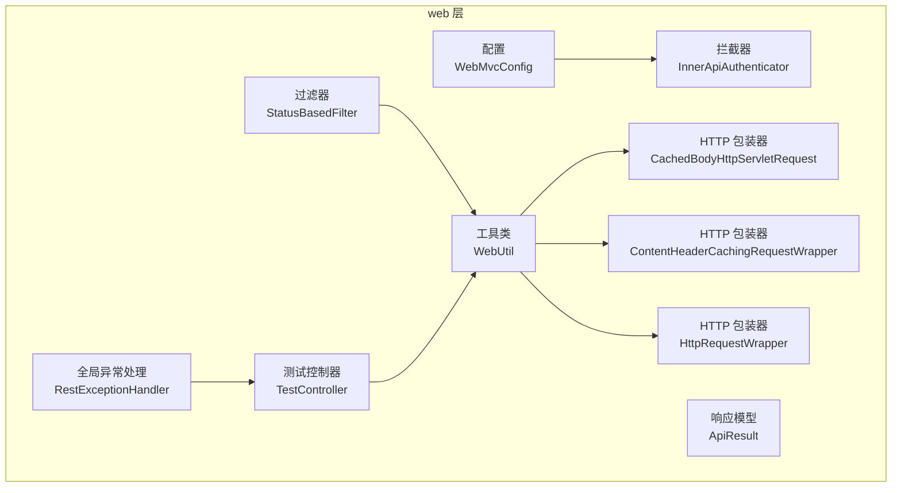
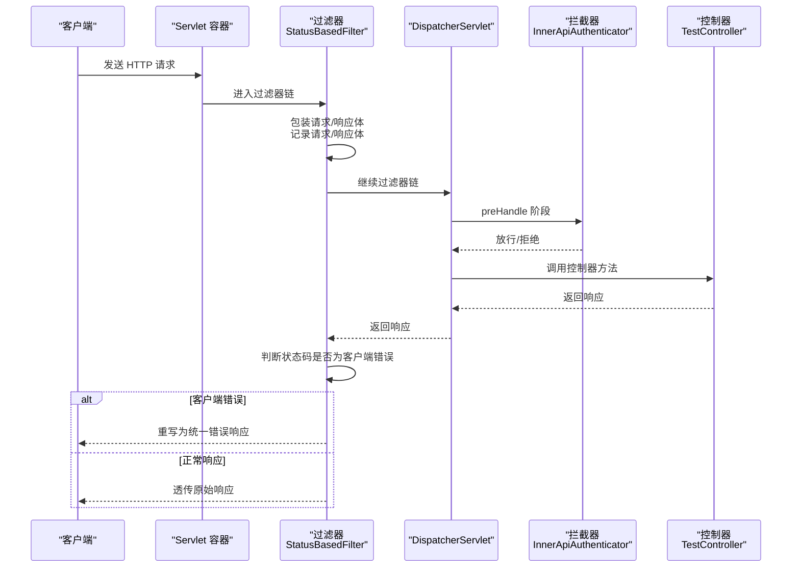
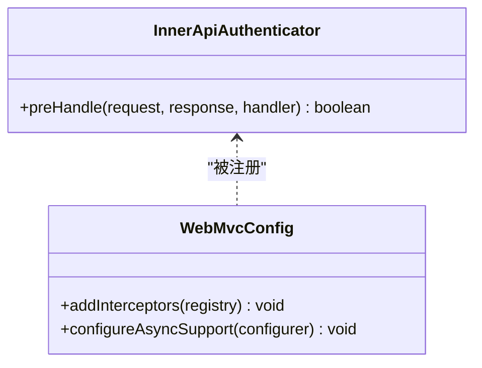
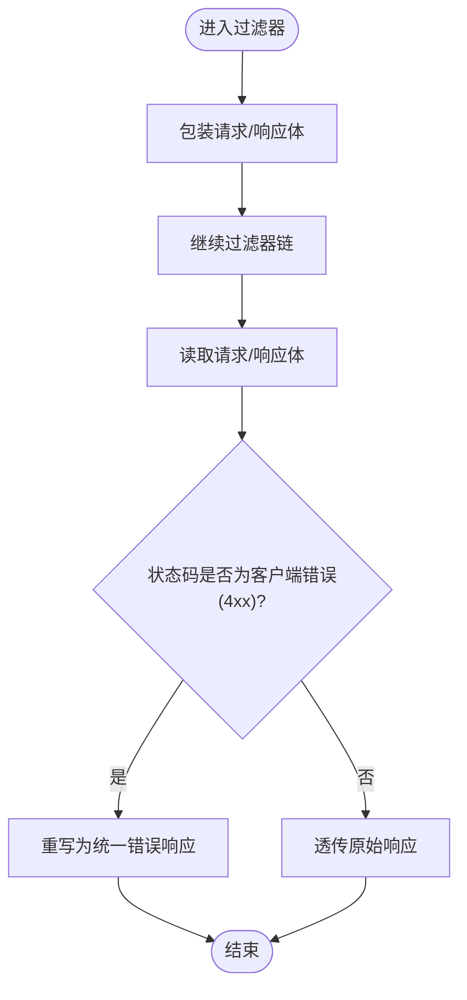
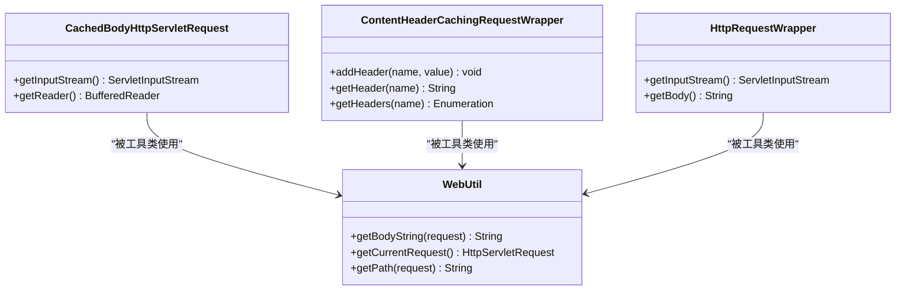
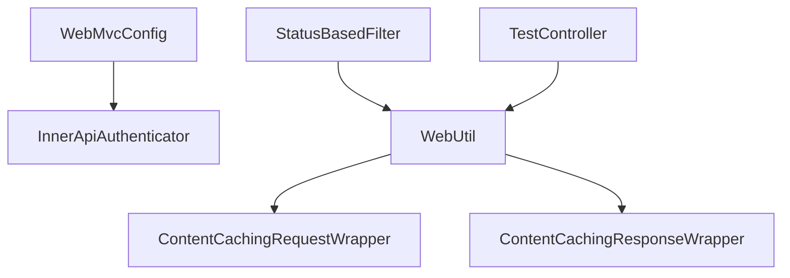

# 拦截器与过滤器

<cite>
**本文引用的文件**   
- [InnerApiAuthenticator.java](file://biz-service-impl/src/main/java/com/magicliang/transaction/sys/biz/service/impl/web/interceptor/InnerApiAuthenticator.java)
- [StatusBasedFilter.java](file://biz-service-impl/src/main/java/com/magicliang/transaction/sys/biz/service/impl/web/filter/StatusBasedFilter.java)
- [WebMvcConfig.java](file://biz-service-impl/src/main/java/com/magicliang/transaction/sys/biz/service/impl/web/config/WebMvcConfig.java)
- [WebUtil.java](file://biz-service-impl/src/main/java/com/magicliang/transaction/sys/biz/service/impl/web/util/WebUtil.java)
- [CachedBodyHttpServletRequest.java](file://biz-service-impl/src/main/java/com/magicliang/transaction/sys/biz/service/impl/web/http/CachedBodyHttpServletRequest.java)
- [ContentHeaderCachingRequestWrapper.java](file://biz-service-impl/src/main/java/com/magicliang/transaction/sys/biz/service/impl/web/http/ContentHeaderCachingRequestWrapper.java)
- [HttpRequestWrapper.java](file://biz-service-impl/src/main/java/com/magicliang/transaction/sys/biz/service/impl/web/http/HttpRequestWrapper.java)
- [ApiResult.java](file://biz-service-impl/src/main/java/com/magicliang/transaction/sys/biz/service/impl/web/model/vo/ApiResult.java)
- [RestExceptionHandler.java](file://biz-service-impl/src/main/java/com/magicliang/transaction/sys/biz/service/impl/web/advice/RestExceptionHandler.java)
- [TestController.java](file://biz-service-impl/src/main/java/com/magicliang/transaction/sys/biz/service/impl/web/controller/TestController.java)
</cite>

## 目录
1. [引言](#引言)
2. [项目结构](#项目结构)
3. [核心组件](#核心组件)
4. [架构总览](#架构总览)
5. [详细组件分析](#详细组件分析)
6. [依赖分析](#依赖分析)
7. [性能考虑](#性能考虑)
8. [故障排查指南](#故障排查指南)
9. [结论](#结论)
10. [附录](#附录)

## 引言
本章节面向拦截器与过滤器模块，系统性阐述内部 API 认证拦截器 InnerApiAuthenticator 与基于状态的过滤器 StatusBasedFilter 的设计与实现。重点覆盖以下方面：
- 拦截器如何实现 API 安全认证（请求签名验证、权限校验、访问控制）的扩展路径与最佳实践；
- 过滤器如何处理 HTTP 请求的状态检查与预处理（请求头处理、响应头设置、异常拦截）；
- 配置注册、执行顺序、异常处理的最佳实践；
- 拦截器与过滤器在整个 Web 请求处理链路中的作用与位置。

## 项目结构
拦截器与过滤器位于业务实现模块 biz-service-impl 的 web 子包中，分别位于 interceptor 与 filter 目录；同时配合 WebMvcConfig 进行拦截器注册，WebUtil 提供通用的请求/响应处理工具，以及若干 HTTP 包装器用于增强请求/响应能力；ApiResult 作为统一响应载体；RestExceptionHandler 提供全局异常处理骨架。

图表来源
- [WebMvcConfig.java:39-45](file://biz-service-impl/src/main/java/com/magicliang/transaction/sys/biz/service/impl/web/config/WebMvcConfig.java#L39-L45)
- [InnerApiAuthenticator.java:18-26](file://biz-service-impl/src/main/java/com/magicliang/transaction/sys/biz/service/impl/web/interceptor/InnerApiAuthenticator.java#L18-L26)
- [StatusBasedFilter.java:38-86](file://biz-service-impl/src/main/java/com/magicliang/transaction/sys/biz/service/impl/web/filter/StatusBasedFilter.java#L38-L86)
- [WebUtil.java:34-510](file://biz-service-impl/src/main/java/com/magicliang/transaction/sys/biz/service/impl/web/util/WebUtil.java#L34-L510)
- [CachedBodyHttpServletRequest.java:23-77](file://biz-service-impl/src/main/java/com/magicliang/transaction/sys/biz/service/impl/web/http/CachedBodyHttpServletRequest.java#L23-L77)
- [ContentHeaderCachingRequestWrapper.java:24-104](file://biz-service-impl/src/main/java/com/magicliang/transaction/sys/biz/service/impl/web/http/ContentHeaderCachingRequestWrapper.java#L24-L104)
- [HttpRequestWrapper.java:20-59](file://biz-service-impl/src/main/java/com/magicliang/transaction/sys/biz/service/impl/web/http/HttpRequestWrapper.java#L20-L59)
- [ApiResult.java:16-87](file://biz-service-impl/src/main/java/com/magicliang/transaction/sys/biz/service/impl/web/model/vo/ApiResult.java#L16-L87)
- [RestExceptionHandler.java:24-38](file://biz-service-impl/src/main/java/com/magicliang/transaction/sys/biz/service/impl/web/advice/RestExceptionHandler.java#L24-L38)
- [TestController.java:48-100](file://biz-service-impl/src/main/java/com/magicliang/transaction/sys/biz/service/impl/web/controller/TestController.java#L48-L100)

章节来源
- [WebMvcConfig.java:25-74](file://biz-service-impl/src/main/java/com/magicliang/transaction/sys/biz/service/impl/web/config/WebMvcConfig.java#L25-L74)
- [InnerApiAuthenticator.java:18-26](file://biz-service-impl/src/main/java/com/magicliang/transaction/sys/biz/service/impl/web/interceptor/InnerApiAuthenticator.java#L18-L26)
- [StatusBasedFilter.java:38-157](file://biz-service-impl/src/main/java/com/magicliang/transaction/sys/biz/service/impl/web/filter/StatusBasedFilter.java#L38-L157)
- [WebUtil.java:34-510](file://biz-service-impl/src/main/java/com/magicliang/transaction/sys/biz/service/impl/web/util/WebUtil.java#L34-L510)

## 核心组件
- 内部 API 认证拦截器 InnerApiAuthenticator：基于 Spring MVC 的 AsyncHandlerInterceptor，负责在请求进入控制器前进行认证与授权判定。当前实现返回放行，实际认证逻辑可在此扩展。
- 基于状态的过滤器 StatusBasedFilter：继承 OncePerRequestFilter，对响应状态进行检查，若为客户端错误（4xx），则重写响应为统一错误格式；否则透传原始响应。该过滤器通过 ContentCachingRequestWrapper/ResponseWrapper 缓存请求/响应体，便于日志记录与状态判断。
- WebMvcConfig：注册拦截器并排除 Swagger 相关路径，同时配置异步支持与线程池任务执行器。
- WebUtil：提供获取当前请求、读取请求体、解析 JSON、读取 Cookie、添加请求头、路径拼接等常用工具方法，支撑拦截器与过滤器的实现。
- HTTP 包装器：CachedBodyHttpServletRequest、ContentHeaderCachingRequestWrapper、HttpRequestWrapper 提供请求体与请求头的缓存与复用能力，避免流一次性消费带来的限制。
- ApiResult：统一响应载体，便于在异常或业务失败时返回一致的数据结构。
- RestExceptionHandler：全局异常处理骨架，可与过滤器配合实现统一错误响应。

章节来源
- [InnerApiAuthenticator.java:20-25](file://biz-service-impl/src/main/java/com/magicliang/transaction/sys/biz/service/impl/web/interceptor/InnerApiAuthenticator.java#L20-L25)
- [StatusBasedFilter.java:38-157](file://biz-service-impl/src/main/java/com/magicliang/transaction/sys/biz/service/impl/web/filter/StatusBasedFilter.java#L38-L157)
- [WebMvcConfig.java:39-55](file://biz-service-impl/src/main/java/com/magicliang/transaction/sys/biz/service/impl/web/config/WebMvcConfig.java#L39-L55)
- [WebUtil.java:118-277](file://biz-service-impl/src/main/java/com/magicliang/transaction/sys/biz/service/impl/web/util/WebUtil.java#L118-L277)
- [ApiResult.java:16-87](file://biz-service-impl/src/main/java/com/magicliang/transaction/sys/biz/service/impl/web/model/vo/ApiResult.java#L16-L87)
- [RestExceptionHandler.java:24-38](file://biz-service-impl/src/main/java/com/magicliang/transaction/sys/biz/service/impl/web/advice/RestExceptionHandler.java#L24-L38)

## 架构总览
拦截器与过滤器在 Spring Web MVC 的请求处理链路中分别处于不同阶段：
- 拦截器（HandlerInterceptor）：在 DispatcherServlet 分发到具体控制器之前执行，适合做认证、鉴权、访问控制等横切逻辑。
- 过滤器（Filter）：在 Servlet 容器层面生效，早于 Spring MVC 初始化，适合做响应状态检查、统一错误输出、请求/响应体缓存等。

图表来源
- [StatusBasedFilter.java:48-86](file://biz-service-impl/src/main/java/com/magicliang/transaction/sys/biz/service/impl/web/filter/StatusBasedFilter.java#L48-L86)
- [WebMvcConfig.java:39-45](file://biz-service-impl/src/main/java/com/magicliang/transaction/sys/biz/service/impl/web/config/WebMvcConfig.java#L39-L45)
- [TestController.java:65-100](file://biz-service-impl/src/main/java/com/magicliang/transaction/sys/biz/service/impl/web/controller/TestController.java#L65-L100)

## 详细组件分析

### 内部 API 认证拦截器 InnerApiAuthenticator
- 设计要点
  - 实现 AsyncHandlerInterceptor，具备异步场景下的拦截能力。
  - 当前 preHandle 返回放行，实际认证逻辑可在此扩展（例如：请求签名验证、权限校验、访问控制）。
- 执行顺序与注册
  - 通过 WebMvcConfig.addInterceptors 注册，匹配所有路径并排除 Swagger 相关路径，确保网关校验拦截器不影响文档访问。
- 最佳实践
  - 在 preHandle 中完成签名/权限校验，必要时向请求上下文注入用户信息或权限标识。
  - 对于异步控制器，确保 AsyncHandlerInterceptor 的异步支持生效（由 AsyncSupportConfigurer 配置）。
  - 对于跨域、静态资源等场景，合理配置排除路径，避免误伤。

图表来源
- [InnerApiAuthenticator.java:20-25](file://biz-service-impl/src/main/java/com/magicliang/transaction/sys/biz/service/impl/web/interceptor/InnerApiAuthenticator.java#L20-L25)
- [WebMvcConfig.java:27-45](file://biz-service-impl/src/main/java/com/magicliang/transaction/sys/biz/service/impl/web/config/WebMvcConfig.java#L27-L45)

章节来源
- [InnerApiAuthenticator.java:18-26](file://biz-service-impl/src/main/java/com/magicliang/transaction/sys/biz/service/impl/web/interceptor/InnerApiAuthenticator.java#L18-L26)
- [WebMvcConfig.java:39-45](file://biz-service-impl/src/main/java/com/magicliang/transaction/sys/biz/service/impl/web/config/WebMvcConfig.java#L39-L45)

### 基于状态的过滤器 StatusBasedFilter
- 设计要点
  - 继承 OncePerRequestFilter，确保每个请求只处理一次。
  - 使用 ContentCachingRequestWrapper/ResponseWrapper 包装请求与响应，以便在过滤器链结束后读取请求/响应体并记录日志。
  - 通过 isClientError 判断响应状态是否为客户端错误（4xx），若是则 onClientError 重写响应为统一错误格式；否则 copyBodyToResponse 透传原始响应。
  - shouldNotFilter 排除健康检查路径，避免对监控接口产生干扰。
- 请求/响应体处理
  - WebUtil 提供 getBodyString 方法，支持从 ContentCachingRequestWrapper/ResponseWrapper 中读取缓存的请求/响应体。
  - 对于请求体的多次消费问题，通过包装器避免 InputStream 一次性消费导致的异常。
- 响应头处理
  - onClientError 中先 reset 原响应，再重建响应头，最后设置状态码与错误内容，保证输出一致性。
- 最佳实践
  - 在 doFilterInternal 中先包装再调用 filterChain.doFilter，确保能正确捕获响应状态与内容。
  - 对于需要透传的响应，务必在重写错误响应前 copyBodyToResponse，避免输出流被提前消费。
  - 如需迁移至其他 Servlet 技术栈，使用 Filter 的方式更具备可移植性。

图表来源
- [StatusBasedFilter.java:48-86](file://biz-service-impl/src/main/java/com/magicliang/transaction/sys/biz/service/impl/web/filter/StatusBasedFilter.java#L48-L86)
- [StatusBasedFilter.java:95-111](file://biz-service-impl/src/main/java/com/magicliang/transaction/sys/biz/service/impl/web/filter/StatusBasedFilter.java#L95-L111)
- [WebUtil.java:118-124](file://biz-service-impl/src/main/java/com/magicliang/transaction/sys/biz/service/impl/web/util/WebUtil.java#L118-L124)

章节来源
- [StatusBasedFilter.java:38-157](file://biz-service-impl/src/main/java/com/magicliang/transaction/sys/biz/service/impl/web/filter/StatusBasedFilter.java#L38-L157)
- [WebUtil.java:118-277](file://biz-service-impl/src/main/java/com/magicliang/transaction/sys/biz/service/impl/web/util/WebUtil.java#L118-L277)

### HTTP 包装器与工具类协同
- CachedBodyHttpServletRequest：将原始请求体缓存为字节数组，支持多次读取与复用，避免流一次性消费问题。
- ContentHeaderCachingRequestWrapper：在 ContentCachingRequestWrapper 基础上缓存请求头，支持动态添加与读取请求头。
- HttpRequestWrapper：将请求体缓存为字符串，提供 ServletInputStream 的复用实现。
- WebUtil：提供 getBodyString、getCurrentRequest、getPath 等常用方法，支撑拦截器与过滤器的实现。

图表来源
- [CachedBodyHttpServletRequest.java:23-77](file://biz-service-impl/src/main/java/com/magicliang/transaction/sys/biz/service/impl/web/http/CachedBodyHttpServletRequest.java#L23-L77)
- [ContentHeaderCachingRequestWrapper.java:24-104](file://biz-service-impl/src/main/java/com/magicliang/transaction/sys/biz/service/impl/web/http/ContentHeaderCachingRequestWrapper.java#L24-L104)
- [HttpRequestWrapper.java:20-59](file://biz-service-impl/src/main/java/com/magicliang/transaction/sys/biz/service/impl/web/http/HttpRequestWrapper.java#L20-L59)
- [WebUtil.java:118-124](file://biz-service-impl/src/main/java/com/magicliang/transaction/sys/biz/service/impl/web/util/WebUtil.java#L118-L124)

章节来源
- [CachedBodyHttpServletRequest.java:23-77](file://biz-service-impl/src/main/java/com/magicliang/transaction/sys/biz/service/impl/web/http/CachedBodyHttpServletRequest.java#L23-L77)
- [ContentHeaderCachingRequestWrapper.java:24-104](file://biz-service-impl/src/main/java/com/magicliang/transaction/sys/biz/service/impl/web/http/ContentHeaderCachingRequestWrapper.java#L24-L104)
- [HttpRequestWrapper.java:20-59](file://biz-service-impl/src/main/java/com/magicliang/transaction/sys/biz/service/impl/web/http/HttpRequestWrapper.java#L20-L59)
- [WebUtil.java:118-277](file://biz-service-impl/src/main/java/com/magicliang/transaction/sys/biz/service/impl/web/util/WebUtil.java#L118-L277)

### 统一响应与异常处理
- ApiResult：提供 success/fail 多种工厂方法，便于在控制器或过滤器中构造统一响应。
- RestExceptionHandler：提供全局异常处理骨架，可与过滤器配合实现统一错误响应，避免业务层重复处理异常。

章节来源
- [ApiResult.java:16-87](file://biz-service-impl/src/main/java/com/magicliang/transaction/sys/biz/service/impl/web/model/vo/ApiResult.java#L16-L87)
- [RestExceptionHandler.java:24-38](file://biz-service-impl/src/main/java/com/magicliang/transaction/sys/biz/service/impl/web/advice/RestExceptionHandler.java#L24-L38)

## 依赖分析
- 拦截器与过滤器的耦合度低，职责清晰：拦截器负责认证与授权，过滤器负责状态检查与统一错误输出。
- WebUtil 作为工具类被过滤器广泛使用，提供请求/响应体读取与路径拼接等能力。
- HTTP 包装器为请求/响应体的缓存与复用提供基础能力，避免流一次性消费带来的限制。
- WebMvcConfig 将拦截器注册到 Spring MVC，确保其在控制器前生效。

图表来源
- [WebMvcConfig.java:39-45](file://biz-service-impl/src/main/java/com/magicliang/transaction/sys/biz/service/impl/web/config/WebMvcConfig.java#L39-L45)
- [StatusBasedFilter.java:48-86](file://biz-service-impl/src/main/java/com/magicliang/transaction/sys/biz/service/impl/web/filter/StatusBasedFilter.java#L48-L86)
- [WebUtil.java:118-124](file://biz-service-impl/src/main/java/com/magicliang/transaction/sys/biz/service/impl/web/util/WebUtil.java#L118-L124)
- [TestController.java:65-100](file://biz-service-impl/src/main/java/com/magicliang/transaction/sys/biz/service/impl/web/controller/TestController.java#L65-L100)

章节来源
- [WebMvcConfig.java:39-45](file://biz-service-impl/src/main/java/com/magicliang/transaction/sys/biz/service/impl/web/config/WebMvcConfig.java#L39-L45)
- [StatusBasedFilter.java:48-86](file://biz-service-impl/src/main/java/com/magicliang/transaction/sys/biz/service/impl/web/filter/StatusBasedFilter.java#L48-L86)
- [WebUtil.java:118-277](file://biz-service-impl/src/main/java/com/magicliang/transaction/sys/biz/service/impl/web/util/WebUtil.java#L118-L277)

## 性能考虑
- 请求/响应体缓存：ContentCachingRequestWrapper/ResponseWrapper 会在内存中缓存请求/响应体，大体积请求/响应可能导致内存压力。建议：
  - 控制缓存大小阈值，仅对必要路径启用缓存；
  - 对于大文件上传/下载场景，优先采用流式处理，避免将整个请求/响应体加载到内存。
- 日志输出：过滤器会对请求/响应体进行日志记录，建议在生产环境降低日志级别或按需开关，避免日志风暴。
- 过滤器链顺序：将状态检查过滤器置于较前位置，避免后续处理器产生大量中间状态，减少不必要的处理成本。

## 故障排查指南
- 拦截器未生效
  - 检查 WebMvcConfig 是否正确注册拦截器及排除路径；
  - 确认控制器方法未被排除路径影响。
- 过滤器未拦截到状态
  - 确保在 doFilterInternal 中先包装再调用 filterChain.doFilter；
  - 检查 shouldNotFilter 是否排除了目标路径。
- 响应头丢失
  - 在 onClientError 中先 reset 原响应，再重建响应头，最后设置状态码与内容。
- 请求体为空
  - 确保使用 ContentCachingRequestWrapper 包装请求体；
  - 避免在过滤器链之前尝试读取请求体，防止底层 InputStream 被提前消费。
- 全局异常处理
  - 结合 RestExceptionHandler 与过滤器，确保异常场景返回统一错误格式。

章节来源
- [WebMvcConfig.java:39-45](file://biz-service-impl/src/main/java/com/magicliang/transaction/sys/biz/service/impl/web/config/WebMvcConfig.java#L39-L45)
- [StatusBasedFilter.java:48-86](file://biz-service-impl/src/main/java/com/magicliang/transaction/sys/biz/service/impl/web/filter/StatusBasedFilter.java#L48-L86)
- [StatusBasedFilter.java:95-111](file://biz-service-impl/src/main/java/com/magicliang/transaction/sys/biz/service/impl/web/filter/StatusBasedFilter.java#L95-L111)
- [WebUtil.java:353-402](file://biz-service-impl/src/main/java/com/magicliang/transaction/sys/biz/service/impl/web/util/WebUtil.java#L353-L402)
- [RestExceptionHandler.java:24-38](file://biz-service-impl/src/main/java/com/magicliang/transaction/sys/biz/service/impl/web/advice/RestExceptionHandler.java#L24-L38)

## 结论
- InnerApiAuthenticator 提供了可扩展的内部 API 认证入口，当前实现为放行，后续可无缝接入签名验证、权限校验与访问控制逻辑。
- StatusBasedFilter 通过请求/响应体缓存与状态判断，实现了统一错误输出与响应透传，具备良好的可移植性与可维护性。
- WebUtil 与 HTTP 包装器为拦截器与过滤器提供了稳定的基础能力，有效规避了流一次性消费与响应头丢失等问题。
- 建议在生产环境中结合性能与日志策略，谨慎启用请求/响应体缓存与日志记录，确保系统稳定性与可观测性。

## 附录
- 配置注册与执行顺序
  - 拦截器注册：WebMvcConfig.addInterceptors，匹配 /** 并排除 Swagger 路径。
  - 过滤器注册：可通过 WebMvcConfig 或 @WebFilter 注解注册，注意与拦截器的执行顺序。
- 最佳实践清单
  - 拦截器：在 preHandle 中完成认证与授权，必要时注入上下文信息；对异步控制器确保异步支持生效。
  - 过滤器：先包装再调用过滤器链，避免提前消费输出流；客户端错误时先 reset 原响应，再重建响应头与状态码。
  - 工具类：使用 WebUtil 统一读取请求/响应体与路径拼接，避免重复实现。
  - 异常处理：结合 RestExceptionHandler 与过滤器，确保异常场景返回统一错误格式。

章节来源
- [WebMvcConfig.java:39-55](file://biz-service-impl/src/main/java/com/magicliang/transaction/sys/biz/service/impl/web/config/WebMvcConfig.java#L39-L55)
- [StatusBasedFilter.java:48-86](file://biz-service-impl/src/main/java/com/magicliang/transaction/sys/biz/service/impl/web/filter/StatusBasedFilter.java#L48-L86)
- [WebUtil.java:118-277](file://biz-service-impl/src/main/java/com/magicliang/transaction/sys/biz/service/impl/web/util/WebUtil.java#L118-L277)
- [RestExceptionHandler.java:24-38](file://biz-service-impl/src/main/java/com/magicliang/transaction/sys/biz/service/impl/web/advice/RestExceptionHandler.java#L24-L38)