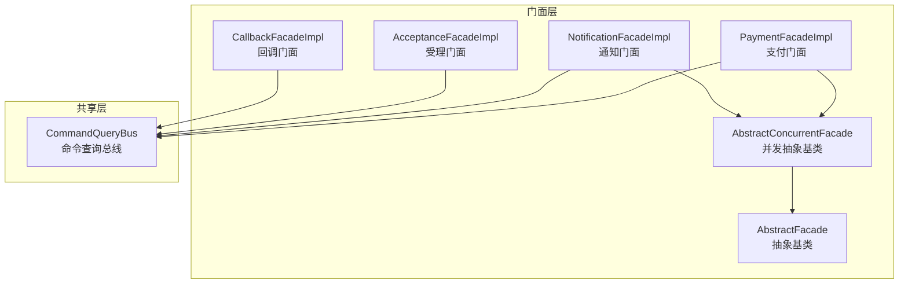
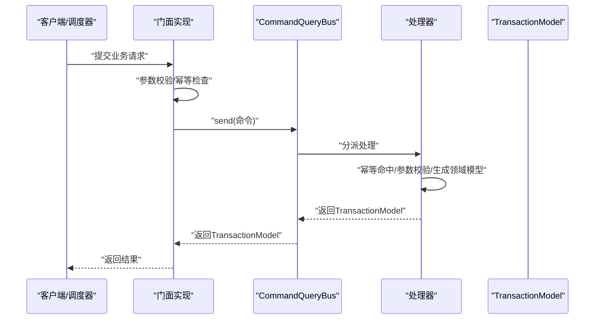
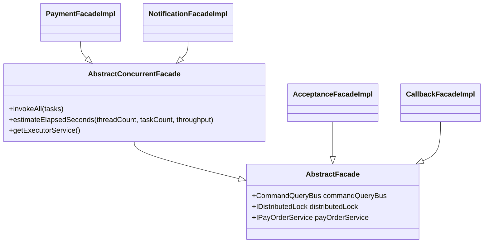
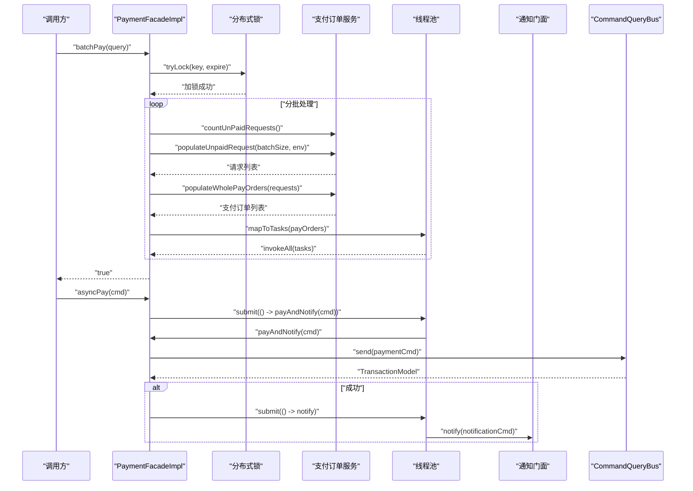
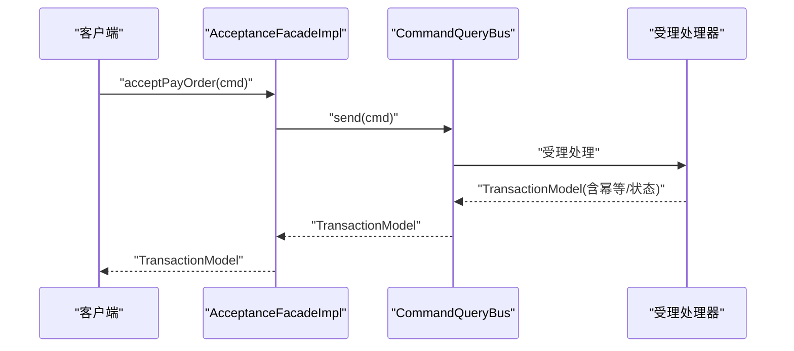
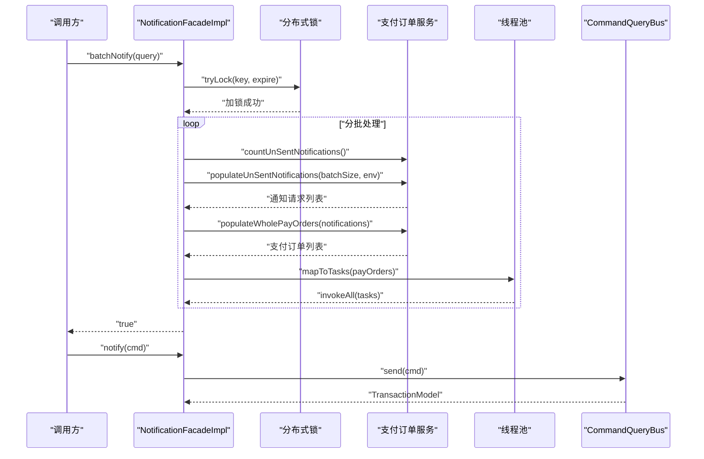
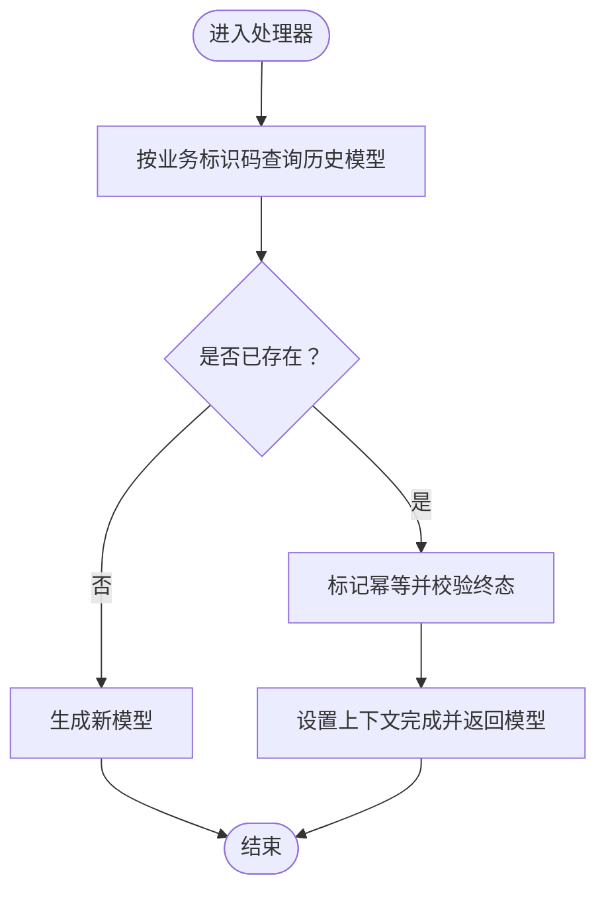
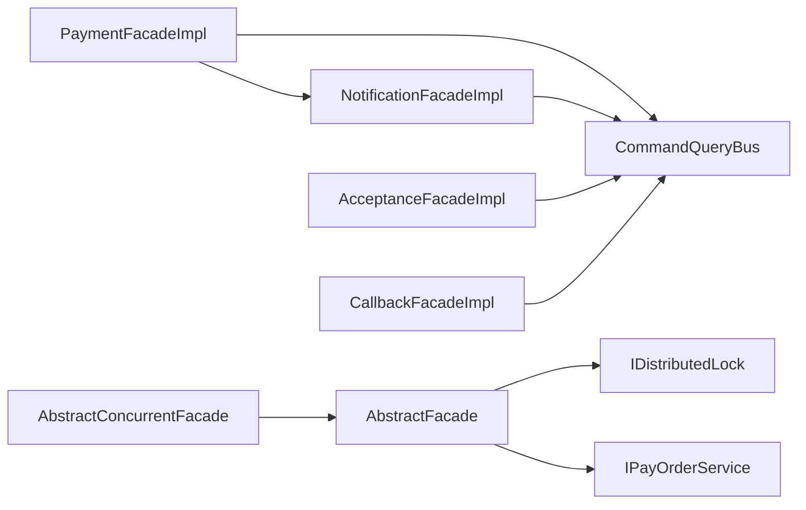

# 门面实现

<cite>
**本文引用的文件**
- [AbstractFacade.java](file://biz-service-impl/src/main/java/com/magicliang/transaction/sys/biz/service/impl/facade/impl/AbstractFacade.java)
- [AbstractConcurrentFacade.java](file://biz-service-impl/src/main/java/com/magicliang/transaction/sys/biz/service/impl/facade/impl/AbstractConcurrentFacade.java)
- [PaymentFacadeImpl.java](file://biz-service-impl/src/main/java/com/magicliang/transaction/sys/biz/service/impl/facade/impl/PaymentFacadeImpl.java)
- [AcceptanceFacadeImpl.java](file://biz-service-impl/src/main/java/com/magicliang/transaction/sys/biz/service/impl/facade/impl/AcceptanceFacadeImpl.java)
- [NotificationFacadeImpl.java](file://biz-service-impl/src/main/java/com/magicliang/transaction/sys/biz/service/impl/facade/impl/NotificationFacadeImpl.java)
- [CallbackFacadeImpl.java](file://biz-service-impl/src/main/java/com/magicliang/transaction/sys/biz/service/impl/facade/impl/CallbackFacadeImpl.java)
- [IAcceptanceFacade.java](file://biz-service-impl/src/main/java/com/magicliang/transaction/sys/biz/service/impl/facade/IAcceptanceFacade.java)
- [IPaymentFacade.java](file://biz-service-impl/src/main/java/com/magicliang/transaction/sys/biz/service/impl/facade/IPaymentFacade.java)
- [INotificationFacade.java](file://biz-service-impl/src/main/java/com/magicliang/transaction/sys/biz/service/impl/facade/INotificationFacade.java)
- [ICallbackFacade.java](file://biz-service-impl/src/main/java/com/magicliang/transaction/sys/biz/service/impl/facade/ICallbackFacade.java)
- [CommandQueryBus.java](file://biz-shared/src/main/java/com/magicliang/transaction/sys/biz/shared/locator/CommandQueryBus.java)
- [AcceptanceHandler.java](file://biz-shared/src/main/java/com/magicliang/transaction/sys/biz/shared/handler/AcceptanceHandler.java)
</cite>

## 目录
1. [简介](#简介)
2. [项目结构](#项目结构)
3. [核心组件](#核心组件)
4. [架构总览](#架构总览)
5. [详细组件分析](#详细组件分析)
6. [依赖分析](#依赖分析)
7. [性能考虑](#性能考虑)
8. [故障排查指南](#故障排查指南)
9. [结论](#结论)

## 简介
本章节概述门面实现模块在系统中的定位与价值：门面层作为业务逻辑的统一入口，向上屏蔽底层服务与总线细节，向下编排处理器与分布式锁、线程池等基础设施，提供幂等性、参数校验、异常处理与事务一致性保障。本文聚焦抽象基类与三大核心门面（支付、受理、通知）的实现，阐述其设计模式、并发控制与事务编排策略，并给出可落地的最佳实践。

## 项目结构
门面实现位于 biz-service-impl 模块的 facade.impl 包中，包含抽象基类与具体门面实现；同时在 facade 接口包中定义了各门面的对外契约。门面通过共享模块中的 CommandQueryBus 将请求路由到对应的处理器，再由处理器驱动领域模型与事件。

图表来源
- [AbstractFacade.java:17-36](file://biz-service-impl/src/main/java/com/magicliang/transaction/sys/biz/service/impl/facade/impl/AbstractFacade.java#L17-L36)
- [AbstractConcurrentFacade.java:25-80](file://biz-service-impl/src/main/java/com/magicliang/transaction/sys/biz/service/impl/facade/impl/AbstractConcurrentFacade.java#L25-L80)
- [PaymentFacadeImpl.java:34-165](file://biz-service-impl/src/main/java/com/magicliang/transaction/sys/biz/service/impl/facade/impl/PaymentFacadeImpl.java#L34-L165)
- [NotificationFacadeImpl.java:31-126](file://biz-service-impl/src/main/java/com/magicliang/transaction/sys/biz/service/impl/facade/impl/NotificationFacadeImpl.java#L31-L126)
- [AcceptanceFacadeImpl.java:20-32](file://biz-service-impl/src/main/java/com/magicliang/transaction/sys/biz/service/impl/facade/impl/AcceptanceFacadeImpl.java#L20-L32)
- [CallbackFacadeImpl.java:20-33](file://biz-service-impl/src/main/java/com/magicliang/transaction/sys/biz/service/impl/facade/impl/CallbackFacadeImpl.java#L20-L33)
- [CommandQueryBus.java:27-33](file://biz-shared/src/main/java/com/magicliang/transaction/sys/biz/shared/locator/CommandQueryBus.java#L27-L33)

章节来源
- [AbstractFacade.java:1-37](file://biz-service-impl/src/main/java/com/magicliang/transaction/sys/biz/service/impl/facade/impl/AbstractFacade.java#L1-L37)
- [AbstractConcurrentFacade.java:1-95](file://biz-service-impl/src/main/java/com/magicliang/transaction/sys/biz/service/impl/facade/impl/AbstractConcurrentFacade.java#L1-L95)
- [PaymentFacadeImpl.java:1-166](file://biz-service-impl/src/main/java/com/magicliang/transaction/sys/biz/service/impl/facade/impl/PaymentFacadeImpl.java#L1-L166)
- [AcceptanceFacadeImpl.java:1-33](file://biz-service-impl/src/main/java/com/magicliang/transaction/sys/biz/service/impl/facade/impl/AcceptanceFacadeImpl.java#L1-L33)
- [NotificationFacadeImpl.java:1-127](file://biz-service-impl/src/main/java/com/magicliang/transaction/sys/biz/service/impl/facade/impl/NotificationFacadeImpl.java#L1-L127)
- [CallbackFacadeImpl.java:1-34](file://biz-service-impl/src/main/java/com/magicliang/transaction/sys/biz/service/impl/facade/impl/CallbackFacadeImpl.java#L1-L34)
- [IAcceptanceFacade.java:1-25](file://biz-service-impl/src/main/java/com/magicliang/transaction/sys/biz/service/impl/facade/IAcceptanceFacade.java#L1-L25)
- [IPaymentFacade.java:1-58](file://biz-service-impl/src/main/java/com/magicliang/transaction/sys/biz/service/impl/facade/IPaymentFacade.java#L1-L58)
- [INotificationFacade.java:1-43](file://biz-service-impl/src/main/java/com/magicliang/transaction/sys/biz/service/impl/facade/INotificationFacade.java#L1-L43)
- [ICallbackFacade.java:1-25](file://biz-service-impl/src/main/java/com/magicliang/transaction/sys/biz/service/impl/facade/ICallbackFacade.java#L1-L25)
- [CommandQueryBus.java:1-33](file://biz-shared/src/main/java/com/magicliang/transaction/sys/biz/shared/locator/CommandQueryBus.java#L1-L33)

## 核心组件
- 抽象门面基类 AbstractFacade：注入命令查询总线、分布式锁与支付订单服务，为具体门面提供通用能力。
- 并发抽象基类 AbstractConcurrentFacade：封装并发执行模板、结果统计与异常聚合，提供吞吐量估算与线程池使用规范。
- 支付门面 PaymentFacadeImpl：负责单笔支付、批量支付、异步支付与支付后通知的编排，结合分布式锁与线程池提升吞吐。
- 受理门面 AcceptanceFacadeImpl：面向受理用例的统一入口，委托给命令查询总线。
- 通知门面 NotificationFacadeImpl：负责未发送通知的批量发送与异步通知编排，具备与支付门面类似的并发与锁策略。
- 回调门面 CallbackFacadeImpl：面向下游回调的统一入口，委托给命令查询总线。

章节来源
- [AbstractFacade.java:17-36](file://biz-service-impl/src/main/java/com/magicliang/transaction/sys/biz/service/impl/facade/impl/AbstractFacade.java#L17-L36)
- [AbstractConcurrentFacade.java:25-80](file://biz-service-impl/src/main/java/com/magicliang/transaction/sys/biz/service/impl/facade/impl/AbstractConcurrentFacade.java#L25-L80)
- [PaymentFacadeImpl.java:34-165](file://biz-service-impl/src/main/java/com/magicliang/transaction/sys/biz/service/impl/facade/impl/PaymentFacadeImpl.java#L34-L165)
- [AcceptanceFacadeImpl.java:20-32](file://biz-service-impl/src/main/java/com/magicliang/transaction/sys/biz/service/impl/facade/impl/AcceptanceFacadeImpl.java#L20-L32)
- [NotificationFacadeImpl.java:31-126](file://biz-service-impl/src/main/java/com/magicliang/transaction/sys/biz/service/impl/facade/impl/NotificationFacadeImpl.java#L31-L126)
- [CallbackFacadeImpl.java:20-33](file://biz-service-impl/src/main/java/com/magicliang/transaction/sys/biz/service/impl/facade/impl/CallbackFacadeImpl.java#L20-L33)

## 架构总览
门面层通过 CommandQueryBus 将请求路由至对应处理器，处理器内部实现幂等性、参数校验与领域模型构建，最终返回 TransactionModel。门面层负责：
- 参数校验与转换（如从实体生成命令）
- 幂等性判定与短路返回
- 分布式锁保护批处理作业
- 并发执行与结果聚合
- 异常捕获与日志记录

图表来源
- [PaymentFacadeImpl.java:115-147](file://biz-service-impl/src/main/java/com/magicliang/transaction/sys/biz/service/impl/facade/impl/PaymentFacadeImpl.java#L115-L147)
- [NotificationFacadeImpl.java:107-110](file://biz-service-impl/src/main/java/com/magicliang/transaction/sys/biz/service/impl/facade/impl/NotificationFacadeImpl.java#L107-L110)
- [AcceptanceFacadeImpl.java:28-31](file://biz-service-impl/src/main/java/com/magicliang/transaction/sys/biz/service/impl/facade/impl/AcceptanceFacadeImpl.java#L28-L31)
- [CallbackFacadeImpl.java:28-31](file://biz-service-impl/src/main/java/com/magicliang/transaction/sys/biz/service/impl/facade/impl/CallbackFacadeImpl.java#L28-L31)
- [CommandQueryBus.java:27-33](file://biz-shared/src/main/java/com/magicliang/transaction/sys/biz/shared/locator/CommandQueryBus.java#L27-L33)

## 详细组件分析

### 抽象基类与并发基类
- AbstractFacade：统一注入 CommandQueryBus、IDistributedLock、IPayOrderService，为具体门面提供跨域通用能力。
- AbstractConcurrentFacade：提供并发执行模板 invokeAll、吞吐量估算 estimateElapsedSeconds，以及对异常的统一聚合与日志输出。

图表来源
- [AbstractFacade.java:17-36](file://biz-service-impl/src/main/java/com/magicliang/transaction/sys/biz/service/impl/facade/impl/AbstractFacade.java#L17-L36)
- [AbstractConcurrentFacade.java:25-80](file://biz-service-impl/src/main/java/com/magicliang/transaction/sys/biz/service/impl/facade/impl/AbstractConcurrentFacade.java#L25-L80)
- [PaymentFacadeImpl.java:34](file://biz-service-impl/src/main/java/com/magicliang/transaction/sys/biz/service/impl/facade/impl/PaymentFacadeImpl.java#L34)
- [NotificationFacadeImpl.java:31](file://biz-service-impl/src/main/java/com/magicliang/transaction/sys/biz/service/impl/facade/impl/NotificationFacadeImpl.java#L31)
- [AcceptanceFacadeImpl.java:20](file://biz-service-impl/src/main/java/com/magicliang/transaction/sys/biz/service/impl/facade/impl/AcceptanceFacadeImpl.java#L20)
- [CallbackFacadeImpl.java:20](file://biz-service-impl/src/main/java/com/magicliang/transaction/sys/biz/service/impl/facade/impl/CallbackFacadeImpl.java#L20)

章节来源
- [AbstractFacade.java:1-37](file://biz-service-impl/src/main/java/com/magicliang/transaction/sys/biz/service/impl/facade/impl/AbstractFacade.java#L1-L37)
- [AbstractConcurrentFacade.java:1-95](file://biz-service-impl/src/main/java/com/magicliang/transaction/sys/biz/service/impl/facade/impl/AbstractConcurrentFacade.java#L1-L95)

### 支付门面 PaymentFacadeImpl
- 单笔支付：直接通过 CommandQueryBus 发送 PaymentCommand。
- 批量支付：基于 Approximate Count 估算耗时，使用分布式锁保护批处理循环，分批拉取未支付请求并转为支付任务并发执行。
- 异步支付：在独立线程池中执行 payAndNotify，完成后异步触发通知。
- 幂等与短路：若支付成功，异步触发通知；失败则返回错误模型。

图表来源
- [PaymentFacadeImpl.java:66-93](file://biz-service-impl/src/main/java/com/magicliang/transaction/sys/biz/service/impl/facade/impl/PaymentFacadeImpl.java#L66-L93)
- [PaymentFacadeImpl.java:100-107](file://biz-service-impl/src/main/java/com/magicliang/transaction/sys/biz/service/impl/facade/impl/PaymentFacadeImpl.java#L100-L107)
- [PaymentFacadeImpl.java:126-147](file://biz-service-impl/src/main/java/com/magicliang/transaction/sys/biz/service/impl/facade/impl/PaymentFacadeImpl.java#L126-L147)

章节来源
- [PaymentFacadeImpl.java:1-166](file://biz-service-impl/src/main/java/com/magicliang/transaction/sys/biz/service/impl/facade/impl/PaymentFacadeImpl.java#L1-L166)

### 受理门面 AcceptanceFacadeImpl
- 面向受理用例，接收 AcceptanceCommand，直接通过 CommandQueryBus 路由到受理处理器。
- 处理器内部实现幂等性与参数校验，必要时提前结束并返回幂等标记。

图表来源
- [AcceptanceFacadeImpl.java:28-31](file://biz-service-impl/src/main/java/com/magicliang/transaction/sys/biz/service/impl/facade/impl/AcceptanceFacadeImpl.java#L28-L31)
- [AcceptanceHandler.java:100-128](file://biz-shared/src/main/java/com/magicliang/transaction/sys/biz/shared/handler/AcceptanceHandler.java#L100-L128)

章节来源
- [AcceptanceFacadeImpl.java:1-33](file://biz-service-impl/src/main/java/com/magicliang/transaction/sys/biz/service/impl/facade/impl/AcceptanceFacadeImpl.java#L1-L33)
- [AcceptanceHandler.java:100-128](file://biz-shared/src/main/java/com/magicliang/transaction/sys/biz/shared/handler/AcceptanceHandler.java#L100-L128)

### 通知门面 NotificationFacadeImpl
- 批量通知：基于 Approximate Count 估算耗时，使用分布式锁保护批处理循环，分批拉取未发送通知并并发执行。
- 单笔通知：直接通过 CommandQueryBus 发送 NotificationCommand。
- 任务映射：将支付订单实体映射为通知命令并提交线程池并发执行。

图表来源
- [NotificationFacadeImpl.java:57-85](file://biz-service-impl/src/main/java/com/magicliang/transaction/sys/biz/service/impl/facade/impl/NotificationFacadeImpl.java#L57-L85)
- [NotificationFacadeImpl.java:92-99](file://biz-service-impl/src/main/java/com/magicliang/transaction/sys/biz/service/impl/facade/impl/NotificationFacadeImpl.java#L92-L99)
- [NotificationFacadeImpl.java:107-110](file://biz-service-impl/src/main/java/com/magicliang/transaction/sys/biz/service/impl/facade/impl/NotificationFacadeImpl.java#L107-L110)

章节来源
- [NotificationFacadeImpl.java:1-127](file://biz-service-impl/src/main/java/com/magicliang/transaction/sys/biz/service/impl/facade/impl/NotificationFacadeImpl.java#L1-L127)

### 回调门面 CallbackFacadeImpl
- 面向下游回调，接收 CallbackCommand，通过 CommandQueryBus 路由到回调处理器，用于更新支付订单状态。

章节来源
- [CallbackFacadeImpl.java:1-34](file://biz-service-impl/src/main/java/com/magicliang/transaction/sys/biz/service/impl/facade/impl/CallbackFacadeImpl.java#L1-L34)

### 幂等性处理流程
- 处理器在 populateModel 中根据业务标识码查询是否存在已处理的领域模型，若命中则设置幂等标志位并直接返回，避免重复执行。
- 门面层在返回 TransactionModel 后，可根据 success/idempotent 标志决定后续动作（如支付成功后再通知）。

图表来源
- [AcceptanceHandler.java:106-127](file://biz-shared/src/main/java/com/magicliang/transaction/sys/biz/shared/handler/AcceptanceHandler.java#L106-L127)

章节来源
- [AcceptanceHandler.java:100-128](file://biz-shared/src/main/java/com/magicliang/transaction/sys/biz/shared/handler/AcceptanceHandler.java#L100-L128)

## 依赖分析
- 门面层依赖共享模块的 CommandQueryBus，实现请求路由与处理器分派。
- 门面层依赖分布式锁与支付订单服务，用于批处理作业的并发保护与数据准备。
- 具体门面之间存在横向依赖：支付门面在 payAndNotify 成功后依赖通知门面进行异步通知。

图表来源
- [PaymentFacadeImpl.java:57-58](file://biz-service-impl/src/main/java/com/magicliang/transaction/sys/biz/service/impl/facade/impl/PaymentFacadeImpl.java#L57-L58)
- [AbstractFacade.java:22-35](file://biz-service-impl/src/main/java/com/magicliang/transaction/sys/biz/service/impl/facade/impl/AbstractFacade.java#L22-L35)
- [CommandQueryBus.java:32-33](file://biz-shared/src/main/java/com/magicliang/transaction/sys/biz/shared/locator/CommandQueryBus.java#L32-L33)

章节来源
- [PaymentFacadeImpl.java:1-166](file://biz-service-impl/src/main/java/com/magicliang/transaction/sys/biz/service/impl/facade/impl/PaymentFacadeImpl.java#L1-L166)
- [AbstractFacade.java:1-37](file://biz-service-impl/src/main/java/com/magicliang/transaction/sys/biz/service/impl/facade/impl/AbstractFacade.java#L1-L37)
- [CommandQueryBus.java:1-33](file://biz-shared/src/main/java/com/magicliang/transaction/sys/biz/shared/locator/CommandQueryBus.java#L1-L33)

## 性能考虑
- 吞吐量估算：通过 estimateElapsedSeconds 基于线程数、任务数与单线程吞吐量估算执行时间，并叠加固定补充时间，确保锁超时合理。
- 并发执行：使用线程池并发执行任务，invokeAll 统一收集结果并统计成功/失败/幂等次数，便于监控与告警。
- 批处理保护：使用分布式锁保护批处理循环，避免多实例并发导致的数据竞争与重复执行。
- 异步解耦：支付成功后异步触发通知，降低主流程延迟，提升用户体验。

章节来源
- [AbstractConcurrentFacade.java:90-93](file://biz-service-impl/src/main/java/com/magicliang/transaction/sys/biz/service/impl/facade/impl/AbstractConcurrentFacade.java#L90-L93)
- [PaymentFacadeImpl.java:73-74](file://biz-service-impl/src/main/java/com/magicliang/transaction/sys/biz/service/impl/facade/impl/PaymentFacadeImpl.java#L73-L74)
- [NotificationFacadeImpl.java:65-66](file://biz-service-impl/src/main/java/com/magicliang/transaction/sys/biz/service/impl/facade/impl/NotificationFacadeImpl.java#L65-L66)

## 故障排查指南
- 幂等性问题：若出现重复处理或状态不一致，检查处理器幂等逻辑与 TransactionModel 的幂等标志位设置。
- 并发异常：invokeAll 对 ExecutionException 进行统一包装并抛出，需关注异常日志与重试策略。
- 锁竞争：批处理失败通常源于分布式锁获取失败，建议增大线程池容量或调整批大小与锁超时。
- 异步通知：确认线程池容量与通知门面的吞吐量配置，避免通知积压。

章节来源
- [AbstractConcurrentFacade.java:62-73](file://biz-service-impl/src/main/java/com/magicliang/transaction/sys/biz/service/impl/facade/impl/AbstractConcurrentFacade.java#L62-L73)
- [PaymentFacadeImpl.java:77-91](file://biz-service-impl/src/main/java/com/magicliang/transaction/sys/biz/service/impl/facade/impl/PaymentFacadeImpl.java#L77-L91)
- [NotificationFacadeImpl.java:69-84](file://biz-service-impl/src/main/java/com/magicliang/transaction/sys/biz/service/impl/facade/impl/NotificationFacadeImpl.java#L69-L84)

## 结论
门面实现模块通过抽象基类与并发基类，统一了参数校验、幂等处理、分布式锁与线程池的使用规范；并通过 CommandQueryBus 将业务请求路由到处理器，实现领域模型与事件的正确流转。支付、受理、通知与回调四大门面分别覆盖核心业务路径，既保证了高内聚的用例边界，又提供了良好的扩展性与可观测性。建议在生产环境中持续优化吞吐量估算、锁超时与线程池配置，并完善异常与重试策略，以进一步提升稳定性与性能。