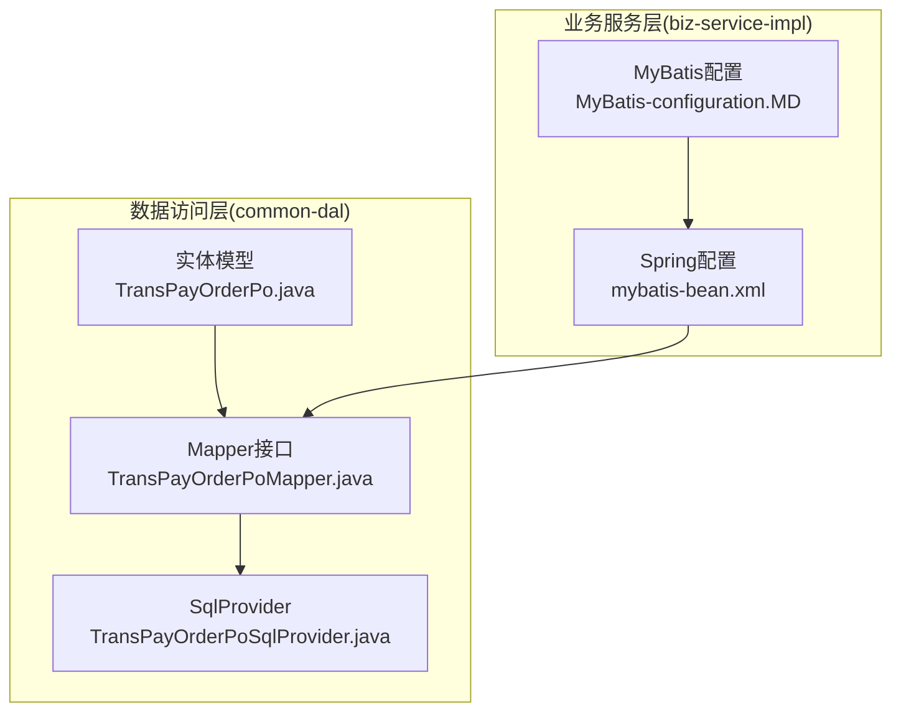
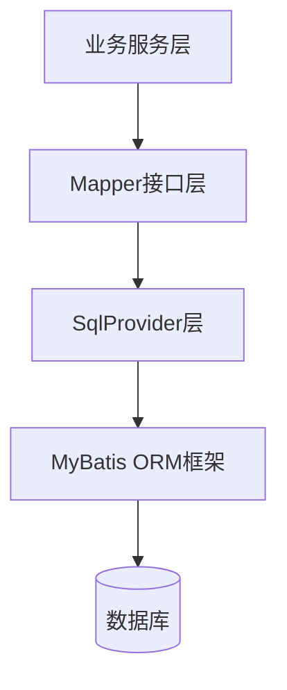
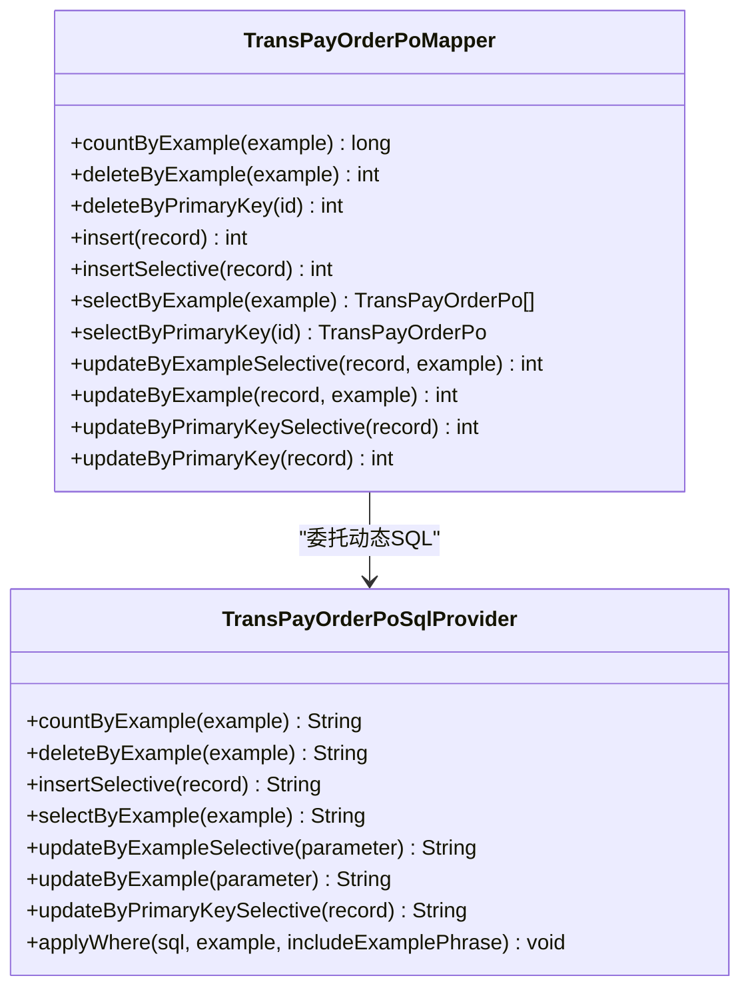
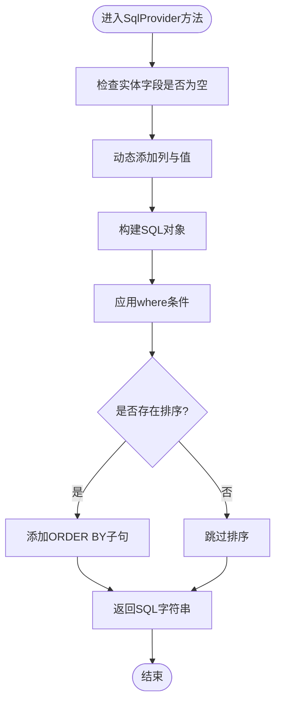
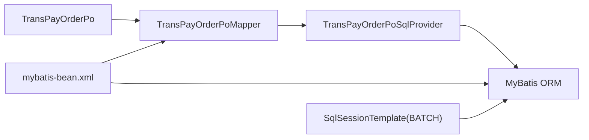

# Mapper接口实现

<cite>
**本文档引用的文件**
- [TransPayOrderPoMapper.java](file://common-dal/src/main/java/com/magicliang/transaction/sys/common/dal/mybatis/mapper/TransPayOrderPoMapper.java)
- [TransPayOrderPoSqlProvider.java](file://common-dal/src/main/java/com/magicliang/transaction/sys/common/dal/mybatis/mapper/TransPayOrderPoSqlProvider.java)
- [TransPayOrderPo.java](file://common-dal/src/main/java/com/magicliang/transaction/sys/common/dal/mybatis/po/TransPayOrderPo.java)
- [TransPayOrderPoExample.java](file://common-dal/src/main/java/com/magicliang/transaction/sys/common/dal/mybatis/po/TransPayOrderPoExample.java)
- [TransAlipaySubOrderPoMapper.java](file://common-dal/src/main/java/com/magicliang/transaction/sys/common/dal/mybatis/mapper/TransAlipaySubOrderPoMapper.java)
- [TransBankCardSubOrderPoMapper.java](file://common-dal/src/main/java/com/magicliang/transaction/sys/common/dal/mybatis/mapper/TransBankCardSubOrderPoMapper.java)
- [TransChannelRequestPoMapper.java](file://common-dal/src/main/java/com/magicliang/transaction/sys/common/dal/mybatis/mapper/TransChannelRequestPoMapper.java)
- [MyBatis-configuration.MD](file://common-dal/src/main/java/com/magicliang/transaction/sys/common/dal/mybatis/MyBatis-configuration.MD)
- [mybatis-bean.xml](file://biz-service-impl/src/main/resources/spring/mybatis-bean.xml)
</cite>

## 目录
1. [简介](#简介)
2. [项目结构](#项目结构)
3. [核心组件](#核心组件)
4. [架构概览](#架构概览)
5. [详细组件分析](#详细组件分析)
6. [依赖关系分析](#依赖关系分析)
7. [性能考量](#性能考量)
8. [故障排查指南](#故障排查指南)
9. [结论](#结论)

## 简介
本文档深入解析MyBatis Mapper接口的设计与实现，以TransPayOrderPoMapper为核心示例，全面阐述注解驱动的CRUD操作、SqlProvider动态SQL生成机制，并总结Mapper接口编程的最佳实践。该系统采用MyBatis Generator自动生成Mapper接口与SqlProvider，结合Spring框架完成依赖注入与事务管理，形成清晰的分层架构。

## 项目结构
项目采用模块化组织，核心数据访问层位于common-dal模块，包含实体模型、Mapper接口与SqlProvider实现。biz-service-impl模块负责业务服务与Spring配置，通过XML配置完成MyBatis的初始化与Mapper扫描。

**图表来源**
- [TransPayOrderPoMapper.java:1-267](file://common-dal/src/main/java/com/magicliang/transaction/sys/common/dal/mybatis/mapper/TransPayOrderPoMapper.java#L1-L267)
- [TransPayOrderPoSqlProvider.java:1-610](file://common-dal/src/main/java/com/magicliang/transaction/sys/common/dal/mybatis/mapper/TransPayOrderPoSqlProvider.java#L1-L610)
- [mybatis-bean.xml:1-29](file://biz-service-impl/src/main/resources/spring/mybatis-bean.xml#L1-L29)

**章节来源**
- [TransPayOrderPoMapper.java:1-267](file://common-dal/src/main/java/com/magicliang/transaction/sys/common/dal/mybatis/mapper/TransPayOrderPoMapper.java#L1-L267)
- [mybatis-bean.xml:1-29](file://biz-service-impl/src/main/resources/spring/mybatis-bean.xml#L1-L29)

## 核心组件
- 实体模型：TransPayOrderPo封装数据库表字段，提供getter/setter方法，用于ORM映射。
- Mapper接口：定义CRUD与条件查询方法，使用MyBatis注解声明SQL或委托给SqlProvider。
- SqlProvider：动态生成SQL，支持条件拼接、批量更新与复杂查询逻辑。
- Spring配置：通过XML配置SqlSessionFactory、MapperScannerConfigurer与SqlSessionTemplate，启用BATCH执行器提升批量写入性能。

**章节来源**
- [TransPayOrderPo.java:1-800](file://common-dal/src/main/java/com/magicliang/transaction/sys/common/dal/mybatis/po/TransPayOrderPo.java#L1-L800)
- [TransPayOrderPoMapper.java:20-267](file://common-dal/src/main/java/com/magicliang/transaction/sys/common/dal/mybatis/mapper/TransPayOrderPoMapper.java#L20-L267)
- [TransPayOrderPoSqlProvider.java:11-610](file://common-dal/src/main/java/com/magicliang/transaction/sys/common/dal/mybatis/mapper/TransPayOrderPoSqlProvider.java#L11-L610)
- [mybatis-bean.xml:15-28](file://biz-service-impl/src/main/resources/spring/mybatis-bean.xml#L15-L28)

## 架构概览
系统采用分层架构，数据访问层通过Mapper接口屏蔽底层SQL细节，业务层通过依赖注入使用Mapper进行数据操作。MyBatis Generator确保接口与实体的一致性，SqlProvider提供灵活的动态SQL能力。

**图表来源**
- [TransPayOrderPoMapper.java:28-266](file://common-dal/src/main/java/com/magicliang/transaction/sys/common/dal/mybatis/mapper/TransPayOrderPoMapper.java#L28-L266)
- [TransPayOrderPoSqlProvider.java:19-503](file://common-dal/src/main/java/com/magicliang/transaction/sys/common/dal/mybatis/mapper/TransPayOrderPoSqlProvider.java#L19-L503)

## 详细组件分析

### TransPayOrderPoMapper：注解驱动的CRUD实现
该Mapper接口展示了完整的CRUD操作模式，涵盖静态SQL与动态SQL两种方式：

- 计数与删除：使用@SelectProvider/@DeleteProvider委托给SqlProvider，实现条件计数与批量删除。
- 主键删除：使用@Delete注解直接声明SQL，简洁高效。
- 插入操作：使用@Insert注解完整字段插入，并通过@SelectKey获取自增主键。
- 条件查询：使用@SelectProvider/@Select注解，结合@Results完成复杂结果映射。
- 更新操作：支持选择性更新与全量更新，均通过SqlProvider实现动态SET子句。

**图表来源**
- [TransPayOrderPoMapper.java:28-266](file://common-dal/src/main/java/com/magicliang/transaction/sys/common/dal/mybatis/mapper/TransPayOrderPoMapper.java#L28-L266)
- [TransPayOrderPoSqlProvider.java:19-503](file://common-dal/src/main/java/com/magicliang/transaction/sys/common/dal/mybatis/mapper/TransPayOrderPoSqlProvider.java#L19-L503)

**章节来源**
- [TransPayOrderPoMapper.java:28-266](file://common-dal/src/main/java/com/magicliang/transaction/sys/common/dal/mybatis/mapper/TransPayOrderPoMapper.java#L28-L266)

### 注解详解与最佳实践
- @SelectProvider/@DeleteProvider/@UpdateProvider：将SQL生成逻辑委托给SqlProvider，便于维护复杂条件与动态拼接。
- @Select/@Insert/@Update/@Delete：适用于固定SQL，减少Provider调用开销。
- @Results/@Result：精确控制列名与属性映射，避免大小写与命名差异导致的映射失败。
- @Param：在Provider方法中明确参数名称，增强可读性与可维护性。
- @SelectKey：在插入后获取自增主键，确保后续关联操作可用。

**章节来源**
- [TransPayOrderPoMapper.java:8-18](file://common-dal/src/main/java/com/magicliang/transaction/sys/common/dal/mybatis/mapper/TransPayOrderPoMapper.java#L8-L18)
- [TransPayOrderPoMapper.java:108-143](file://common-dal/src/main/java/com/magicliang/transaction/sys/common/dal/mybatis/mapper/TransPayOrderPoMapper.java#L108-L143)

### SqlProvider动态SQL生成机制
SqlProvider通过Apache.ibatis.jdbc.SQL构建器动态生成SQL，具备以下特性：
- 条件拼接：根据实体字段是否为空决定是否添加对应列，实现选择性插入与更新。
- 复杂查询：支持distinct、orderBy、where条件链式拼接，满足多样化查询需求。
- 参数绑定：使用占位符与jdbcType绑定，确保类型安全与性能优化。
- 重复利用：applyWhere方法统一处理Criteria与Criterion，避免重复逻辑。

**图表来源**
- [TransPayOrderPoSqlProvider.java:45-157](file://common-dal/src/main/java/com/magicliang/transaction/sys/common/dal/mybatis/mapper/TransPayOrderPoSqlProvider.java#L45-L157)
- [TransPayOrderPoSqlProvider.java:512-609](file://common-dal/src/main/java/com/magicliang/transaction/sys/common/dal/mybatis/mapper/TransPayOrderPoSqlProvider.java#L512-L609)

**章节来源**
- [TransPayOrderPoSqlProvider.java:19-208](file://common-dal/src/main/java/com/magicliang/transaction/sys/common/dal/mybatis/mapper/TransPayOrderPoSqlProvider.java#L19-L208)
- [TransPayOrderPoSqlProvider.java:512-609](file://common-dal/src/main/java/com/magicliang/transaction/sys/common/dal/mybatis/mapper/TransPayOrderPoSqlProvider.java#L512-L609)

### 复杂查询与批量操作示例
- 多表关联查询：通过@SelectProvider在SqlProvider中拼接join与where条件，实现跨表查询。
- 批量更新：在Provider中使用循环遍历集合，逐条生成SET子句，结合SqlSessionTemplate的BATCH执行器提升性能。
- 条件分页：结合Example的orderByClause与limit/offset参数，实现分页查询。
- BLOB字段处理：针对包含LONGVARCHAR字段的表，使用WithBLOBs版本的实体与对应的Mapper方法。

**章节来源**
- [TransChannelRequestPoMapper.java:98-119](file://common-dal/src/main/java/com/magicliang/transaction/sys/common/dal/mybatis/mapper/TransChannelRequestPoMapper.java#L98-L119)
- [mybatis-bean.xml:22-28](file://biz-service-impl/src/main/resources/spring/mybatis-bean.xml#L22-L28)

### 其他Mapper接口对比分析
- TransAlipaySubOrderPoMapper：简化版Mapper，字段较少，适合演示基本注解用法。
- TransBankCardSubOrderPoMapper：中等复杂度Mapper，展示更多字段与复杂映射。
- TransChannelRequestPoMapper：包含BLOB字段的Mapper，演示WithBLOBs实体的使用。

**章节来源**
- [TransAlipaySubOrderPoMapper.java:28-162](file://common-dal/src/main/java/com/magicliang/transaction/sys/common/dal/mybatis/mapper/TransAlipaySubOrderPoMapper.java#L28-L162)
- [TransBankCardSubOrderPoMapper.java:28-187](file://common-dal/src/main/java/com/magicliang/transaction/sys/common/dal/mybatis/mapper/TransBankCardSubOrderPoMapper.java#L28-L187)
- [TransChannelRequestPoMapper.java:29-274](file://common-dal/src/main/java/com/magicliang/transaction/sys/common/dal/mybatis/mapper/TransChannelRequestPoMapper.java#L29-L274)

## 依赖关系分析
- Mapper接口依赖实体模型与SqlProvider，通过注解建立编译期契约。
- SqlProvider依赖实体模型的字段信息与Example的条件结构，生成动态SQL。
- Spring配置依赖MyBatis框架，通过MapperScannerConfigurer自动注册Mapper到IoC容器。
- SqlSessionTemplate配置为BATCH执行器，提升批量写入性能。

**图表来源**
- [TransPayOrderPoMapper.java:3-5](file://common-dal/src/main/java/com/magicliang/transaction/sys/common/dal/mybatis/mapper/TransPayOrderPoMapper.java#L3-L5)
- [mybatis-bean.xml:16-28](file://biz-service-impl/src/main/resources/spring/mybatis-bean.xml#L16-L28)

**章节来源**
- [mybatis-bean.xml:16-28](file://biz-service-impl/src/main/resources/spring/mybatis-bean.xml#L16-L28)

## 性能考量
- 执行器类型：SqlSessionTemplate配置为BATCH，适合大量写操作场景，减少JDBC往返次数。
- 连接池配置：HikariCP提供高性能连接池，建议根据业务并发调整最小空闲与最大池大小。
- 动态SQL优化：SqlProvider按需拼接条件，避免不必要的列与表扫描。
- 结果映射：精确的@Results配置减少反射开销，提升序列化性能。

**章节来源**
- [MyBatis-configuration.MD:5-16](file://common-dal/src/main/java/com/magicliang/transaction/sys/common/dal/mybatis/MyBatis-configuration.MD#L5-L16)
- [mybatis-bean.xml:22-28](file://biz-service-impl/src/main/resources/spring/mybatis-bean.xml#L22-L28)

## 故障排查指南
- 映射异常：检查@Results中的column与property是否匹配，确认jdbcType设置正确。
- 参数绑定错误：核对@Param注解与SqlProvider中的占位符名称一致。
- SQL语法错误：在SqlProvider中打印生成的SQL字符串，定位条件拼接问题。
- 事务未生效：确认DataSourceTransactionManager与MyBatis数据源一致，避免跨数据源事务失效。

**章节来源**
- [TransPayOrderPoMapper.java:108-143](file://common-dal/src/main/java/com/magicliang/transaction/sys/common/dal/mybatis/mapper/TransPayOrderPoMapper.java#L108-L143)
- [MyBatis-configuration.MD:26-27](file://common-dal/src/main/java/com/magicliang/transaction/sys/common/dal/mybatis/MyBatis-configuration.MD#L26-L27)

## 结论
该Mapper接口实现通过注解与SqlProvider的组合，实现了高内聚、低耦合的数据访问层。注解驱动的CRUD操作简洁直观，SqlProvider提供了强大的动态SQL能力，结合Spring配置与BATCH执行器，形成了高效的持久化解决方案。遵循本文档的最佳实践，可在保证代码可读性的同时，获得优异的运行性能。