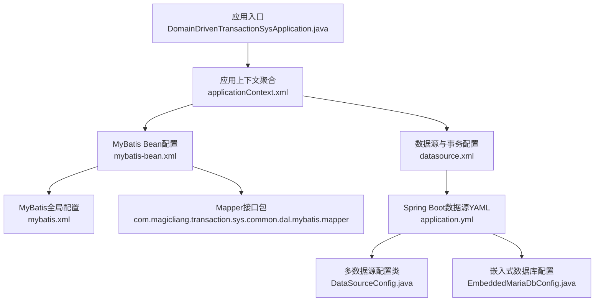
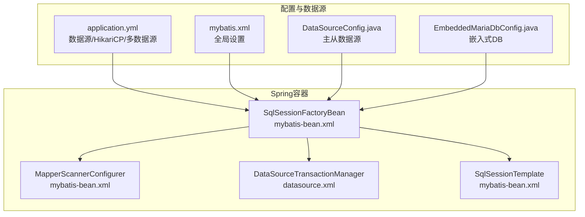
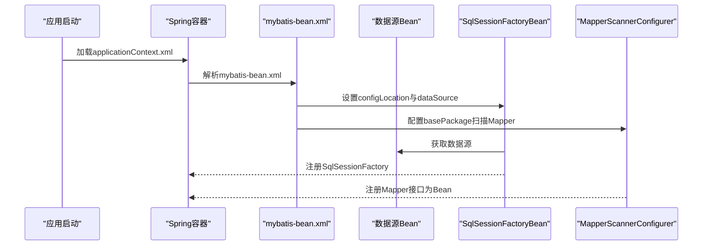
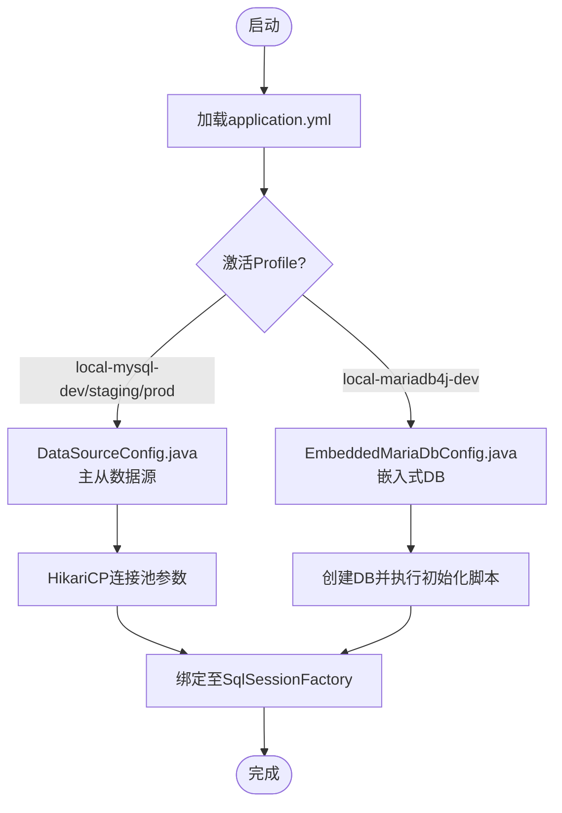
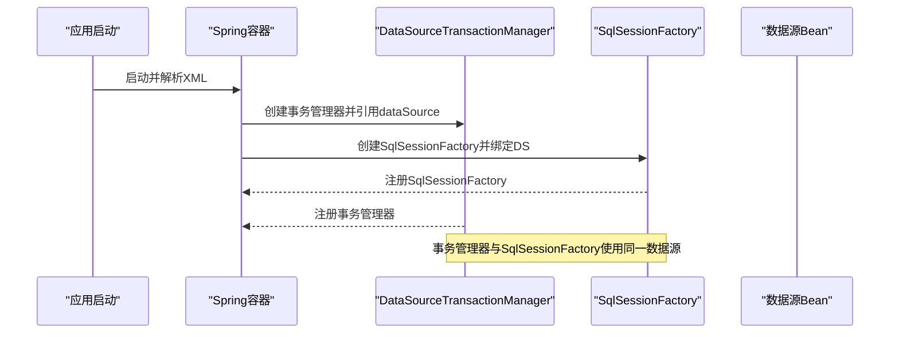
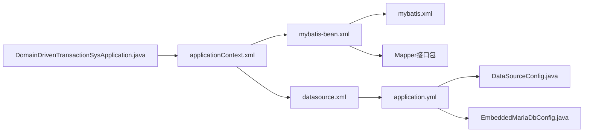

# MyBatis配置

<cite>
**本文引用的文件**   
- [mybatis.xml](file://biz-service-impl/src/main/resources/mybatis/mybatis.xml)
- [mybatis-bean.xml](file://biz-service-impl/src/main/resources/spring/mybatis-bean.xml)
- [datasource.xml](file://biz-service-impl/src/main/resources/spring/datasource.xml)
- [application.yml](file://biz-service-impl/src/main/resources/application.yml)
- [applicationContext.xml](file://biz-service-impl/src/main/resources/applicationContext.xml)
- [DomainDrivenTransactionSysApplication.java](file://biz-service-impl/src/main/java/com/magicliang/transaction/sys/DomainDrivenTransactionSysApplication.java)
- [DataSourceConfig.java](file://common-dal/src/main/java/com/magicliang/transaction/sys/common/dal/datasource/DataSourceConfig.java)
- [EmbeddedMariaDbConfig.java](file://common-dal/src/main/java/com/magicliang/transaction/sys/common/dal/datasource/EmbeddedMariaDbConfig.java)
- [TransPayOrderPoMapper.java](file://common-dal/src/main/java/com/magicliang/transaction/sys/common/dal/mybatis/mapper/TransPayOrderPoMapper.java)
- [MyBatis-configuration.MD](file://common-dal/src/main/java/com/magicliang/transaction/sys/common/dal/mybatis/MyBatis-configuration.MD)
</cite>

## 目录
1. [简介](#简介)
2. [项目结构](#项目结构)
3. [核心组件](#核心组件)
4. [架构总览](#架构总览)
5. [详细组件分析](#详细组件分析)
6. [依赖分析](#依赖分析)
7. [性能考量](#性能考量)
8. [故障排查指南](#故障排查指南)
9. [结论](#结论)
10. [附录](#附录)

## 简介
本文件围绕数据访问层的MyBatis配置与使用展开，结合仓库中的实际配置，系统性说明以下主题：
- MyBatis全局配置文件mybatis.xml的设置要点与影响
- 数据源与连接池配置（HikariCP）及多数据源方案
- 事务管理器配置与Spring事务集成
- MyBatis核心配置项（typeAliases、mappers、plugins等）的作用与配置方法
- Spring集成配置（MapperScannerConfigurer与自动扫描机制）
- 性能优化、缓存策略、插件扩展与最佳实践
- 通过配置实现数据库连接池管理与事务控制

## 项目结构
MyBatis相关配置主要分布在如下位置：
- MyBatis全局配置：biz-service-impl/src/main/resources/mybatis/mybatis.xml
- Spring XML配置：biz-service-impl/src/main/resources/spring/mybatis-bean.xml、datasource.xml
- Spring Boot YAML配置：biz-service-impl/src/main/resources/application.yml
- 应用上下文聚合：biz-service-impl/src/main/resources/applicationContext.xml
- 应用入口与事务开关：biz-service-impl/src/main/java/com/magicliang/transaction/sys/DomainDrivenTransactionSysApplication.java
- 数据源与多数据源配置：common-dal/src/main/java/com/magicliang/transaction/sys/common/dal/datasource/DataSourceConfig.java、EmbeddedMariaDbConfig.java
- Mapper接口示例：common-dal/src/main/java/com/magicliang/transaction/sys/common/dal/mybatis/mapper/TransPayOrderPoMapper.java
- MyBatis配置说明文档：common-dal/src/main/java/com/magicliang/transaction/sys/common/dal/mybatis/MyBatis-configuration.MD

**图表来源**
- [applicationContext.xml:1-10](file://biz-service-impl/src/main/resources/applicationContext.xml#L1-L10)
- [mybatis-bean.xml:1-30](file://biz-service-impl/src/main/resources/spring/mybatis-bean.xml#L1-L30)
- [datasource.xml:1-16](file://biz-service-impl/src/main/resources/spring/datasource.xml#L1-L16)
- [mybatis.xml:1-18](file://biz-service-impl/src/main/resources/mybatis/mybatis.xml#L1-L18)
- [application.yml:17-47](file://biz-service-impl/src/main/resources/application.yml#L17-L47)
- [DataSourceConfig.java:22-82](file://common-dal/src/main/java/com/magicliang/transaction/sys/common/dal/datasource/DataSourceConfig.java#L22-L82)
- [EmbeddedMariaDbConfig.java:1-184](file://common-dal/src/main/java/com/magicliang/transaction/sys/common/dal/datasource/EmbeddedMariaDbConfig.java#L1-L184)

**章节来源**
- [applicationContext.xml:1-10](file://biz-service-impl/src/main/resources/applicationContext.xml#L1-L10)
- [mybatis-bean.xml:1-30](file://biz-service-impl/src/main/resources/spring/mybatis-bean.xml#L1-L30)
- [datasource.xml:1-16](file://biz-service-impl/src/main/resources/spring/datasource.xml#L1-L16)
- [mybatis.xml:1-18](file://biz-service-impl/src/main/resources/mybatis/mybatis.xml#L1-L18)
- [application.yml:17-47](file://biz-service-impl/src/main/resources/application.yml#L17-L47)
- [DataSourceConfig.java:22-82](file://common-dal/src/main/java/com/magicliang/transaction/sys/common/dal/datasource/DataSourceConfig.java#L22-L82)
- [EmbeddedMariaDbConfig.java:1-184](file://common-dal/src/main/java/com/magicliang/transaction/sys/common/dal/datasource/EmbeddedMariaDbConfig.java#L1-L184)

## 核心组件
- MyBatis全局配置（mybatis.xml）
  - 包含属性与基础设置，例如方言、缓存开关、本地缓存作用域、默认执行器类型等。
  - 该配置文件用于SqlSessionFactoryBean的configLocation属性，作为MyBatis的全局入口。

- Spring集成Bean（mybatis-bean.xml）
  - SqlSessionFactoryBean：绑定数据源与全局配置文件，负责创建SqlSessionFactory。
  - MapperScannerConfigurer：扫描指定包下的Mapper接口，注册为Spring Bean。
  - SqlSessionTemplate：基于SqlSessionFactory与执行器类型（默认BATCH）封装会话，便于DAO层使用。

- 数据源与事务（datasource.xml + application.yml + DataSourceConfig.java + EmbeddedMariaDbConfig.java）
  - application.yml：集中配置HikariCP连接池参数、多数据源（master/slave）、SQL初始化脚本路径等。
  - DataSourceConfig.java：按Profile提供主从数据源Bean，并标注Primary以避免歧义。
  - EmbeddedMariaDbConfig.java：在特定Profile下提供嵌入式MariaDB4j数据源，便于本地开发与测试。
  - datasource.xml：定义DataSourceTransactionManager，确保事务管理器与数据源一致。

- 应用入口（DomainDrivenTransactionSysApplication.java）
  - 开启@EnableTransactionManagement，启用Spring声明式事务。
  - 通过@ImportResource加载applicationContext.xml，统一引入XML配置。

**章节来源**
- [mybatis.xml:1-18](file://biz-service-impl/src/main/resources/mybatis/mybatis.xml#L1-L18)
- [mybatis-bean.xml:6-28](file://biz-service-impl/src/main/resources/spring/mybatis-bean.xml#L6-L28)
- [datasource.xml:8-14](file://biz-service-impl/src/main/resources/spring/datasource.xml#L8-L14)
- [application.yml:17-47](file://biz-service-impl/src/main/resources/application.yml#L17-L47)
- [DataSourceConfig.java:33-52](file://common-dal/src/main/java/com/magicliang/transaction/sys/common/dal/datasource/DataSourceConfig.java#L33-L52)
- [EmbeddedMariaDbConfig.java:55-96](file://common-dal/src/main/java/com/magicliang/transaction/sys/common/dal/datasource/EmbeddedMariaDbConfig.java#L55-L96)
- [DomainDrivenTransactionSysApplication.java:54-61](file://biz-service-impl/src/main/java/com/magicliang/transaction/sys/DomainDrivenTransactionSysApplication.java#L54-L61)

## 架构总览
MyBatis在本项目中的运行架构如下：
- 应用启动时，DomainDrivenTransactionSysApplication加载applicationContext.xml，进而引入mybatis-bean.xml与datasource.xml。
- mybatis-bean.xml中通过SqlSessionFactoryBean绑定application.yml中的数据源与mybatis.xml全局配置。
- MapperScannerConfigurer扫描Mapper接口包，将接口注册为Spring Bean，供业务层注入使用。
- 事务管理由DataSourceTransactionManager统一管理，确保与数据源一致。

**图表来源**
- [mybatis-bean.xml:6-28](file://biz-service-impl/src/main/resources/spring/mybatis-bean.xml#L6-L28)
- [datasource.xml:8-14](file://biz-service-impl/src/main/resources/spring/datasource.xml#L8-L14)
- [application.yml:17-47](file://biz-service-impl/src/main/resources/application.yml#L17-L47)
- [mybatis.xml:1-18](file://biz-service-impl/src/main/resources/mybatis/mybatis.xml#L1-L18)
- [DataSourceConfig.java:33-52](file://common-dal/src/main/java/com/magicliang/transaction/sys/common/dal/datasource/DataSourceConfig.java#L33-L52)
- [EmbeddedMariaDbConfig.java:55-96](file://common-dal/src/main/java/com/magicliang/transaction/sys/common/dal/datasource/EmbeddedMariaDbConfig.java#L55-L96)

## 详细组件分析

### MyBatis全局配置（mybatis.xml）
- 属性与设置
  - dialect：用于方言设置（如mysql），可影响分页或方言相关特性。
  - cacheEnabled：关闭二级缓存，降低一致性复杂度，适合交易系统。
  - localCacheScope：设置为STATEMENT，关闭一级缓存，避免会话级缓存带来的脏读风险。
  - jdbcTypeForNull：统一空值处理策略。
  - defaultExecutorType：默认执行器类型设为BATCH，有利于批量写入场景。

- 影响范围
  - 作为SqlSessionFactoryBean的configLocation，直接影响SqlSessionFactory的行为。
  - 与application.yml中的mybatis.configuration.mapUnderscoreToCamelCase共同作用，提升字段映射体验。

**章节来源**
- [mybatis.xml:5-15](file://biz-service-impl/src/main/resources/mybatis/mybatis.xml#L5-L15)
- [application.yml:41-46](file://biz-service-impl/src/main/resources/application.yml#L41-L46)

### Spring集成Bean（mybatis-bean.xml）
- SqlSessionFactoryBean
  - configLocation指向mybatis.xml，dataSource引用已存在的数据源Bean。
  - 可选mapperLocations用于指定XML映射文件位置（当前注释未启用）。

- MapperScannerConfigurer
  - 扫描com.magicliang.transaction.sys.common.dal.mybatis.mapper包，将Mapper接口注册为Spring Bean。
  - 与Spring Boot的@MapperScan互斥，此处采用XML方式更可控。

- SqlSessionTemplate
  - 基于SqlSessionFactory与执行器类型（BATCH）封装，便于DAO层批量操作。

**图表来源**
- [mybatis-bean.xml:6-20](file://biz-service-impl/src/main/resources/spring/mybatis-bean.xml#L6-L20)
- [applicationContext.xml:4-5](file://biz-service-impl/src/main/resources/applicationContext.xml#L4-L5)

**章节来源**
- [mybatis-bean.xml:6-28](file://biz-service-impl/src/main/resources/spring/mybatis-bean.xml#L6-L28)
- [applicationContext.xml:4-5](file://biz-service-impl/src/main/resources/applicationContext.xml#L4-L5)

### 数据源与连接池（application.yml + DataSourceConfig.java + EmbeddedMariaDbConfig.java）
- application.yml
  - HikariCP参数：pool-name、minimum-idle、maximum-pool-size、max-lifetime、connection-timeout等。
  - 多数据源：master与slave1，支持Profile切换。
  - SQL初始化：schema-locations与data-locations，支持不同环境。

- DataSourceConfig.java
  - @Primary标注主数据源，按Profile提供主从数据源Bean。
  - 与SqlSessionFactory与事务管理器保持一致的数据源引用，避免事务失效。

- EmbeddedMariaDbConfig.java
  - 在local-mariadb4j-dev Profile下，提供嵌入式MariaDB4j数据源，便于本地快速验证。
  - 自动创建数据库、执行初始化脚本，简化开发与测试流程。

**图表来源**
- [application.yml:17-47](file://biz-service-impl/src/main/resources/application.yml#L17-L47)
- [DataSourceConfig.java:33-52](file://common-dal/src/main/java/com/magicliang/transaction/sys/common/dal/datasource/DataSourceConfig.java#L33-L52)
- [EmbeddedMariaDbConfig.java:55-96](file://common-dal/src/main/java/com/magicliang/transaction/sys/common/dal/datasource/EmbeddedMariaDbConfig.java#L55-L96)

**章节来源**
- [application.yml:17-47](file://biz-service-impl/src/main/resources/application.yml#L17-L47)
- [DataSourceConfig.java:33-52](file://common-dal/src/main/java/com/magicliang/transaction/sys/common/dal/datasource/DataSourceConfig.java#L33-L52)
- [EmbeddedMariaDbConfig.java:55-96](file://common-dal/src/main/java/com/magicliang/transaction/sys/common/dal/datasource/EmbeddedMariaDbConfig.java#L55-L96)

### 事务管理（datasource.xml + DomainDrivenTransactionSysApplication.java）
- datasource.xml
  - 定义DataSourceTransactionManager，引用名为dataSource的Bean，确保与MyBatis数据源一致。

- DomainDrivenTransactionSysApplication.java
  - @EnableTransactionManagement开启事务管理。
  - @ImportResource引入applicationContext.xml，统一加载XML配置。

**图表来源**
- [datasource.xml:8-14](file://biz-service-impl/src/main/resources/spring/datasource.xml#L8-L14)
- [mybatis-bean.xml:6-10](file://biz-service-impl/src/main/resources/spring/mybatis-bean.xml#L6-L10)
- [DomainDrivenTransactionSysApplication.java:54-61](file://biz-service-impl/src/main/java/com/magicliang/transaction/sys/DomainDrivenTransactionSysApplication.java#L54-L61)

**章节来源**
- [datasource.xml:8-14](file://biz-service-impl/src/main/resources/spring/datasource.xml#L8-L14)
- [DomainDrivenTransactionSysApplication.java:54-61](file://biz-service-impl/src/main/java/com/magicliang/transaction/sys/DomainDrivenTransactionSysApplication.java#L54-L61)

### Mapper接口与自动扫描（TransPayOrderPoMapper.java + MapperScannerConfigurer）
- Mapper接口
  - TransPayOrderPoMapper提供标准的CRUD与条件查询方法，配合SqlProvider类实现动态SQL。
  - 通过@Mapper注解或MapperScannerConfigurer注册为Spring Bean。

- MapperScannerConfigurer
  - 扫描com.magicliang.transaction.sys.common.dal.mybatis.mapper包，将接口注册为Spring Bean，便于业务层注入使用。

**章节来源**
- [TransPayOrderPoMapper.java:20-267](file://common-dal/src/main/java/com/magicliang/transaction/sys/common/dal/mybatis/mapper/TransPayOrderPoMapper.java#L20-L267)
- [mybatis-bean.xml:15-20](file://biz-service-impl/src/main/resources/spring/mybatis-bean.xml#L15-L20)

## 依赖分析
- 组件耦合关系
  - SqlSessionFactoryBean依赖数据源Bean与mybatis.xml。
  - MapperScannerConfigurer依赖basePackage与SqlSessionFactory。
  - DataSourceTransactionManager依赖数据源Bean，需与SqlSessionFactory使用同一数据源。
  - 应用入口通过@ImportResource引入applicationContext.xml，统一加载上述Bean。

- 外部依赖与集成点
  - HikariCP连接池参数来自application.yml。
  - 多数据源通过DataSourceConfig.java按Profile提供。
  - 嵌入式数据库通过EmbeddedMariaDbConfig.java在特定Profile启用。

**图表来源**
- [DomainDrivenTransactionSysApplication.java:54-61](file://biz-service-impl/src/main/java/com/magicliang/transaction/sys/DomainDrivenTransactionSysApplication.java#L54-L61)
- [applicationContext.xml:4-5](file://biz-service-impl/src/main/resources/applicationContext.xml#L4-L5)
- [mybatis-bean.xml:6-20](file://biz-service-impl/src/main/resources/spring/mybatis-bean.xml#L6-L20)
- [datasource.xml:8-14](file://biz-service-impl/src/main/resources/spring/datasource.xml#L8-L14)
- [mybatis.xml:1-18](file://biz-service-impl/src/main/resources/mybatis/mybatis.xml#L1-L18)
- [application.yml:17-47](file://biz-service-impl/src/main/resources/application.yml#L17-L47)
- [DataSourceConfig.java:33-52](file://common-dal/src/main/java/com/magicliang/transaction/sys/common/dal/datasource/DataSourceConfig.java#L33-L52)
- [EmbeddedMariaDbConfig.java:55-96](file://common-dal/src/main/java/com/magicliang/transaction/sys/common/dal/datasource/EmbeddedMariaDbConfig.java#L55-L96)

**章节来源**
- [DomainDrivenTransactionSysApplication.java:54-61](file://biz-service-impl/src/main/java/com/magicliang/transaction/sys/DomainDrivenTransactionSysApplication.java#L54-L61)
- [applicationContext.xml:4-5](file://biz-service-impl/src/main/resources/applicationContext.xml#L4-L5)
- [mybatis-bean.xml:6-20](file://biz-service-impl/src/main/resources/spring/mybatis-bean.xml#L6-L20)
- [datasource.xml:8-14](file://biz-service-impl/src/main/resources/spring/datasource.xml#L8-L14)
- [mybatis.xml:1-18](file://biz-service-impl/src/main/resources/mybatis/mybatis.xml#L1-L18)
- [application.yml:17-47](file://biz-service-impl/src/main/resources/application.yml#L17-L47)
- [DataSourceConfig.java:33-52](file://common-dal/src/main/java/com/magicliang/transaction/sys/common/dal/datasource/DataSourceConfig.java#L33-L52)
- [EmbeddedMariaDbConfig.java:55-96](file://common-dal/src/main/java/com/magicliang/transaction/sys/common/dal/datasource/EmbeddedMariaDbConfig.java#L55-L96)

## 性能考量
- 缓存策略
  - 已在mybatis.xml关闭二级缓存与一级缓存，降低一致性成本，适合高并发交易系统。
  - 如需缓存，建议在业务层或Redis层面实现，避免MyBatis缓存带来的复杂性。

- 批量执行
  - defaultExecutorType设为BATCH，有利于批量插入/更新。
  - SqlSessionTemplate同样使用BATCH执行器类型，DAO层可直接复用。

- 连接池参数
  - application.yml中HikariCP参数（最小空闲、最大池大小、最大生命周期、连接超时）应根据QPS与实例规格调优。
  - 建议结合压测结果调整minimum-idle与maximum-pool-size，避免连接不足或过度占用。

- 字段映射
  - application.yml中mapUnderscoreToCamelCase开启，减少命名转换成本，提升可维护性。

**章节来源**
- [mybatis.xml:9-14](file://biz-service-impl/src/main/resources/mybatis/mybatis.xml#L9-L14)
- [mybatis-bean.xml:24-28](file://biz-service-impl/src/main/resources/spring/mybatis-bean.xml#L24-L28)
- [application.yml:24-29](file://biz-service-impl/src/main/resources/application.yml#L24-L29)
- [application.yml:41-46](file://biz-service-impl/src/main/resources/application.yml#L41-L46)

## 故障排查指南
- 事务无效或跨数据源事务异常
  - 确认DataSourceTransactionManager引用的数据源与SqlSessionFactory一致。
  - 若使用多数据源，确保事务管理器与SqlSessionFactory绑定同一数据源。

- 启动失败提示数据源URL未配置
  - application.yml中若使用自动配置数据源，需确保URL与驱动正确配置。
  - 若使用XML或Java Config提供数据源，需排除DataSourceAutoConfiguration。

- 嵌入式数据库启动失败
  - 检查local-mariadb4j-dev Profile下的端口、用户名、密码与schemaName是否正确。
  - 确保初始化脚本路径与文件存在。

- Mapper未被扫描
  - 确认MapperScannerConfigurer的basePackage与Mapper接口所在包一致。
  - 避免与@MapperScan同时使用，防止冲突。

**章节来源**
- [datasource.xml:8-14](file://biz-service-impl/src/main/resources/spring/datasource.xml#L8-L14)
- [DomainDrivenTransactionSysApplication.java:22-51](file://biz-service-impl/src/main/java/com/magicliang/transaction/sys/DomainDrivenTransactionSysApplication.java#L22-L51)
- [EmbeddedMariaDbConfig.java:142-158](file://common-dal/src/main/java/com/magicliang/transaction/sys/common/dal/datasource/EmbeddedMariaDbConfig.java#L142-L158)
- [mybatis-bean.xml:15-20](file://biz-service-impl/src/main/resources/spring/mybatis-bean.xml#L15-L20)

## 结论
本项目通过XML与YAML相结合的方式，实现了MyBatis在Spring环境中的稳定集成：
- 明确的数据源与事务管理策略，确保一致性与可靠性
- 清晰的Mapper扫描机制，降低配置复杂度
- 面向性能的缓存与执行器配置，满足交易系统的高吞吐需求
- 多数据源与嵌入式数据库支持，兼顾生产与本地开发场景

建议在生产环境中持续监控连接池指标与事务行为，结合业务峰值进行参数微调，并在需要缓存的场景采用应用层缓存方案。

## 附录
- MyBatis核心配置项说明（结合本项目实际）
  - typeAliases：在application.yml中通过type-aliases-package指定实体包，简化别名配置。
  - mappers：通过MapperScannerConfigurer扫描接口包，无需逐个声明。
  - plugins：未在此项目中显式配置，如需扩展可按需添加。

- 多数据源与事务一致性
  - 严格保证SqlSessionFactory与DataSourceTransactionManager使用同一数据源，避免跨数据源事务失效。

- 参考文档
  - MyBatis配置说明文档：common-dal/src/main/java/com/magicliang/transaction/sys/common/dal/mybatis/MyBatis-configuration.MD

**章节来源**
- [application.yml:41-46](file://biz-service-impl/src/main/resources/application.yml#L41-L46)
- [mybatis-bean.xml:15-20](file://biz-service-impl/src/main/resources/spring/mybatis-bean.xml#L15-L20)
- [MyBatis-configuration.MD:1-34](file://common-dal/src/main/java/com/magicliang/transaction/sys/common/dal/mybatis/MyBatis-configuration.MD#L1-L34)