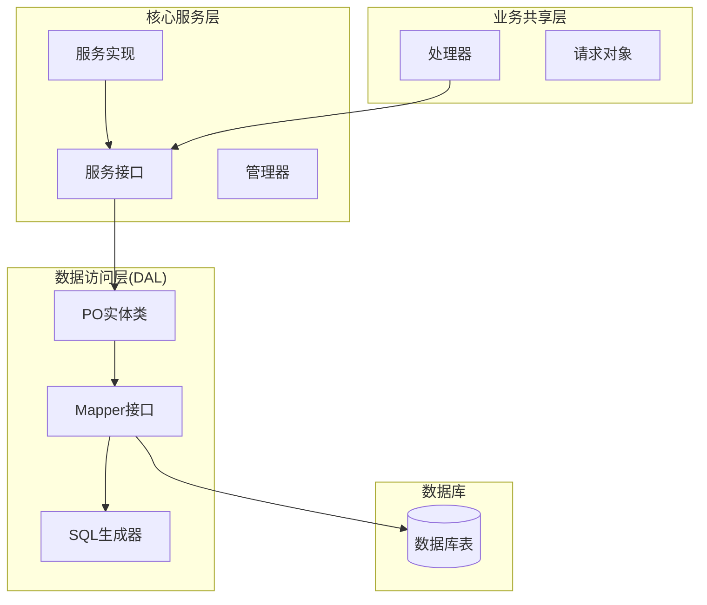
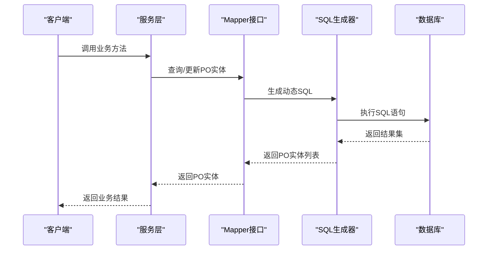
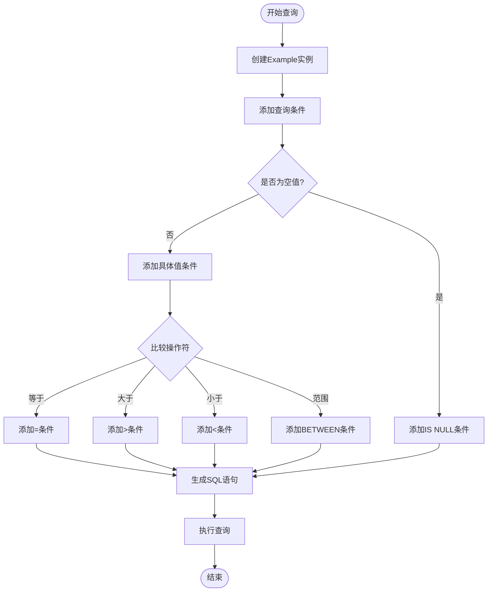
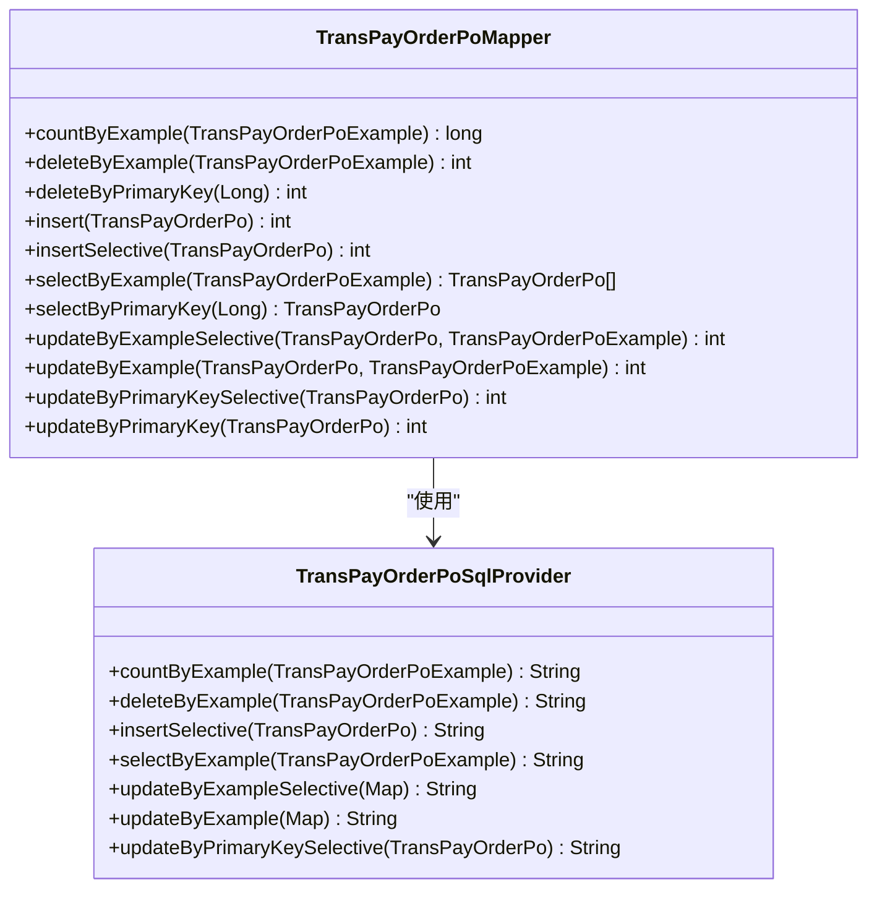
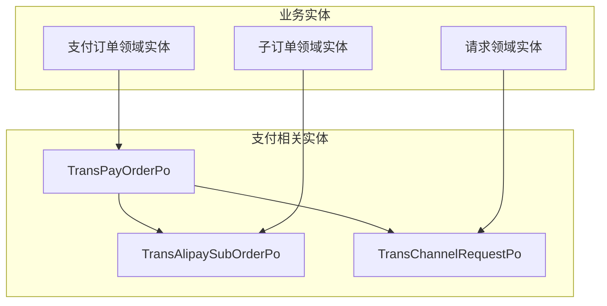
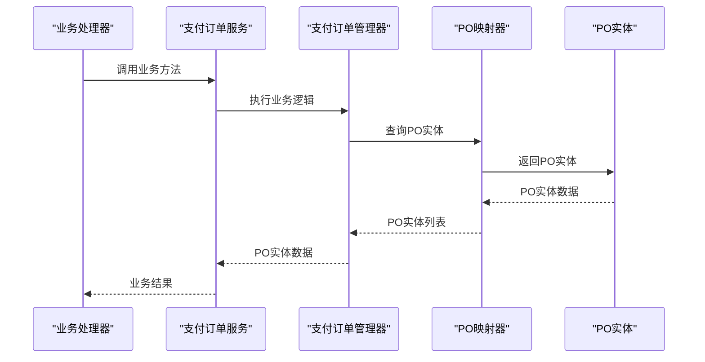

# PO实体设计

<cite>
**本文档引用的文件**
- [TransPayOrderPo.java](file://common-dal/src/main/java/com/magicliang/transaction/sys/common/dal/mybatis/po/TransPayOrderPo.java)
- [TransPayOrderPoExample.java](file://common-dal/src/main/java/com/magicliang/transaction/sys/common/dal/mybatis/po/TransPayOrderPoExample.java)
- [TransPayOrderPoMapper.java](file://common-dal/src/main/java/com/magicliang/transaction/sys/common/dal/mybatis/mapper/TransPayOrderPoMapper.java)
- [TransPayOrderPoSqlProvider.java](file://common-dal/src/main/java/com/magicliang/transaction/sys/common/dal/mybatis/mapper/TransPayOrderPoSqlProvider.java)
- [TransAlipaySubOrderPo.java](file://common-dal/src/main/java/com/magicliang/transaction/sys/common/dal/mybatis/po/TransAlipaySubOrderPo.java)
- [TransChannelRequestPo.java](file://common-dal/src/main/java/com/magicliang/transaction/sys/common/dal/mybatis/po/TransChannelRequestPo.java)
- [PayOrderServiceImpl.java](file://core-service/src/main/java/com/magicliang/transaction/sys/core/service/impl/PayOrderServiceImpl.java)
- [IPayOrderService.java](file://core-service/src/main/java/com/magicliang/transaction/sys/core/service/IPayOrderService.java)
- [PaymentHandler.java](file://biz-shared/src/main/java/com/magicliang/transaction/sys/biz/shared/handler/PaymentHandler.java)
- [AcceptanceHandler.java](file://biz-shared/src/main/java/com/magicliang/transaction/sys/biz/shared/handler/AcceptanceHandler.java)
- [package-info.java](file://common-dal/src/main/java/com/magicliang/transaction/sys/common/dal/package-info.java)
</cite>

## 目录
1. [简介](#简介)
2. [项目结构](#项目结构)
3. [核心组件](#核心组件)
4. [架构概览](#架构概览)
5. [详细组件分析](#详细组件分析)
6. [依赖关系分析](#依赖关系分析)
7. [性能考虑](#性能考虑)
8. [故障排除指南](#故障排除指南)
9. [结论](#结论)

## 简介

本文档深入介绍了该交易系统中的持久化对象(PO)设计原则和实现方式，重点以TransPayOrderPo支付订单PO为例，详细说明实体类的字段定义、Getter/Setter方法、toString方法等。文档还解释了PO与数据库表字段的映射关系，包括字段命名规范、数据类型对应关系、空值处理等。同时介绍了Example类的使用，包括条件查询、排序、分页等功能的实现，并提供了PO类设计的最佳实践，包括字段约束、默认值设置、版本控制等。

## 项目结构

该交易系统采用分层架构设计，PO实体位于数据访问层(common-dal)，通过MyBatis框架实现与数据库的映射。整个项目的文件组织遵循模块化原则，每个模块都有明确的职责分工。

**图表来源**
- [TransPayOrderPo.java:1-1046](file://common-dal/src/main/java/com/magicliang/transaction/sys/common/dal/mybatis/po/TransPayOrderPo.java#L1-L1046)
- [TransPayOrderPoMapper.java:1-267](file://common-dal/src/main/java/com/magicliang/transaction/sys/common/dal/mybatis/mapper/TransPayOrderPoMapper.java#L1-L267)

**章节来源**
- [package-info.java:1-11](file://common-dal/src/main/java/com/magicliang/transaction/sys/common/dal/package-info.java#L1-L11)

## 核心组件

### PO实体类设计原则

该系统中的PO实体类遵循以下设计原则：

1. **字段映射一致性**：每个PO类都与对应的数据库表建立一一对应的映射关系
2. **类型安全**：严格的数据类型匹配，确保Java类型与数据库类型的一致性
3. **空值处理**：合理的空值处理策略，避免NullPointerException
4. **命名规范**：遵循驼峰命名法，保持代码风格统一
5. **可扩展性**：支持版本控制和扩展字段

### TransPayOrderPo支付订单PO详解

TransPayOrderPo是系统中最核心的PO实体，代表支付订单的完整信息。该实体包含30多个字段，涵盖了支付订单的所有关键信息。

**主要字段分类**：

1. **基础标识字段**
   - `id`: 自增物理主键
   - `payOrderNo`: 支付订单号（业务主键）
   - `version`: 版本号（用于乐观锁）

2. **业务标识字段**
   - `sysCode`: 支付订单来源系统
   - `bizIdentifyNo`: 业务标识码
   - `bizUniqueNo`: 上游业务号

3. **金额和渠道字段**
   - `money`: 支付单金额（单位：分）
   - `payChannelType`: 支付通道类型
   - `targetAccountType`: 目标账户类型

4. **状态和时间字段**
   - `status`: 支付状态
   - 各种时间戳字段：受理时间、支付开始时间、成功时间、失败时间、关闭时间、退票时间

5. **扩展信息字段**
   - `memo`: 支付备注
   - `extendInfo`: 平台扩展信息
   - `bizInfo`: 业务扩展信息

**章节来源**
- [TransPayOrderPo.java:1-1046](file://common-dal/src/main/java/com/magicliang/transaction/sys/common/dal/mybatis/po/TransPayOrderPo.java#L1-L1046)

## 架构概览

该系统的PO实体设计采用了典型的三层架构模式，通过MyBatis框架实现了ORM映射。

**图表来源**
- [TransPayOrderPoMapper.java:28-267](file://common-dal/src/main/java/com/magicliang/transaction/sys/common/dal/mybatis/mapper/TransPayOrderPoMapper.java#L28-L267)
- [TransPayOrderPoSqlProvider.java:19-610](file://common-dal/src/main/java/com/magicliang/transaction/sys/common/dal/mybatis/mapper/TransPayOrderPoSqlProvider.java#L19-L610)

## 详细组件分析

### TransPayOrderPo实体类分析

#### 字段定义和映射关系

TransPayOrderPo类的字段定义严格遵循数据库表tb_trans_pay_order的结构设计：

```mermaid
classDiagram
class TransPayOrderPo {
+Long id
+Date gmtCreated
+Date gmtModified
+Long payOrderNo
+String sysCode
+String bizIdentifyNo
+String bizUniqueNo
+Long money
+Integer payChannelType
+Integer targetAccountType
+Integer accountingEntry
+Date gmtAcceptedTime
+Date gmtPaymentBeginTime
+Date gmtPaymentSuccessTime
+Date gmtPaymentFailureTime
+Date gmtPaymentClosedTime
+Date gmtPaymentBouncedTime
+Integer status
+Integer version
+String memo
+String channelPaymentTraceNo
+String channelDishonorTraceNo
+String channelErrorCode
+String businessEntity
+String notifyUri
+String extendInfo
+String bizInfo
+Integer env
+getId() Long
+setId(Long)
+getGmtCreated() Date
+setGmtCreated(Date)
+getGmtModified() Date
+setGmtModified(Date)
+getPayOrderNo() Long
+setPayOrderNo(Long)
+getSysCode() String
+setSysCode(String)
+getBizIdentifyNo() String
+setBizIdentifyNo(String)
+getBizUniqueNo() String
+setBizUniqueNo(String)
+getMoney() Long
+setMoney(Long)
+getPayChannelType() Integer
+setPayChannelType(Integer)
+getTargetAccountType() Integer
+setTargetAccountType(Integer)
+getAccountingEntry() Integer
+setAccountingEntry(Integer)
+getGmtAcceptedTime() Date
+setGmtAcceptedTime(Date)
+getGmtPaymentBeginTime() Date
+setGmtPaymentBeginTime(Date)
+getGmtPaymentSuccessTime() Date
+setGmtPaymentSuccessTime(Date)
+getGmtPaymentFailureTime() Date
+setGmtPaymentFailureTime(Date)
+getGmtPaymentClosedTime() Date
+setGmtPaymentClosedTime(Date)
+getGmtPaymentBouncedTime() Date
+setGmtPaymentBouncedTime(Date)
+getStatus() Integer
+setStatus(Integer)
+getVersion() Integer
+setVersion(Integer)
+getMemo() String
+setMemo(String)
+getChannelPaymentTraceNo() String
+setChannelPaymentTraceNo(String)
+getChannelDishonorTraceNo() String
+setChannelDishonorTraceNo(String)
+getChannelErrorCode() String
+setChannelErrorCode(String)
+getBusinessEntity() String
+setBusinessEntity(String)
+getNotifyUri() String
+setNotifyUri(String)
+getExtendInfo() String
+setExtendInfo(String)
+getBizInfo() String
+setBizInfo(String)
+getEnv() Integer
+setEnv(Integer)
+equals(Object) boolean
+hashCode() int
}
```

**图表来源**
- [TransPayOrderPo.java:9-1046](file://common-dal/src/main/java/com/magicliang/transaction/sys/common/dal/mybatis/po/TransPayOrderPo.java#L9-L1046)

#### Getter/Setter方法设计

每个字段都配备了完整的Getter和Setter方法，遵循以下设计原则：

1. **空值安全**：对于String类型的字段，在Setter方法中添加了空值检查和trim处理
2. **类型转换**：确保数据类型的一致性和安全性
3. **命名规范**：遵循标准的JavaBean命名约定

#### 数据类型映射关系

PO实体与数据库字段的类型映射关系：

| Java类型 | 数据库类型 | 描述 |
|---------|-----------|------|
| Long | BIGINT | 主键、业务主键、金额等数值字段 |
| Integer | INTEGER | 状态码、类型枚举等整型字段 |
| Date | TIMESTAMP | 时间戳字段 |
| String | VARCHAR | 文本字段 |

**章节来源**
- [TransPayOrderPo.java:20-1046](file://common-dal/src/main/java/com/magicliang/transaction/sys/common/dal/mybatis/po/TransPayOrderPo.java#L20-L1046)

### Example类使用详解

TransPayOrderPoExample类提供了强大的条件查询功能，支持复杂的查询组合。

#### 条件查询构建

Example类通过Criteria内部类构建查询条件：

**图表来源**
- [TransPayOrderPoExample.java:158-2096](file://common-dal/src/main/java/com/magicliang/transaction/sys/common/dal/mybatis/po/TransPayOrderPoExample.java#L158-L2096)

#### 排序和分页支持

Example类支持多种排序和分页功能：

1. **排序功能**：通过`orderByClause`属性设置排序规则
2. **去重功能**：通过`distinct`属性控制是否去重
3. **分页功能**：结合Mapper接口的分页查询方法实现

**章节来源**
- [TransPayOrderPoExample.java:15-151](file://common-dal/src/main/java/com/magicliang/transaction/sys/common/dal/mybatis/po/TransPayOrderPoExample.java#L15-L151)

### Mapper接口设计

TransPayOrderPoMapper接口定义了PO实体的各种数据库操作方法：

**图表来源**
- [TransPayOrderPoMapper.java:20-267](file://common-dal/src/main/java/com/magicliang/transaction/sys/common/dal/mybatis/mapper/TransPayOrderPoMapper.java#L20-L267)
- [TransPayOrderPoSqlProvider.java:11-610](file://common-dal/src/main/java/com/magicliang/transaction/sys/common/dal/mybatis/mapper/TransPayOrderPoSqlProvider.java#L11-L610)

**章节来源**
- [TransPayOrderPoMapper.java:1-267](file://common-dal/src/main/java/com/magicliang/transaction/sys/common/dal/mybatis/mapper/TransPayOrderPoMapper.java#L1-L267)

## 依赖关系分析

### 实体间关系

系统中的PO实体之间存在清晰的依赖关系：

**图表来源**
- [TransPayOrderPo.java:1-1046](file://common-dal/src/main/java/com/magicliang/transaction/sys/common/dal/mybatis/po/TransPayOrderPo.java#L1-L1046)
- [TransAlipaySubOrderPo.java:1-257](file://common-dal/src/main/java/com/magicliang/transaction/sys/common/dal/mybatis/po/TransAlipaySubOrderPo.java#L1-L257)
- [TransChannelRequestPo.java:1-544](file://common-dal/src/main/java/com/magicliang/transaction/sys/common/dal/mybatis/po/TransChannelRequestPo.java#L1-L544)

### 服务层集成

PO实体通过服务层实现业务逻辑：

**图表来源**
- [PayOrderServiceImpl.java:33-80](file://core-service/src/main/java/com/magicliang/transaction/sys/core/service/impl/PayOrderServiceImpl.java#L33-L80)
- [IPayOrderService.java:1-42](file://core-service/src/main/java/com/magicliang/transaction/sys/core/service/IPayOrderService.java#L1-L42)

**章节来源**
- [PayOrderServiceImpl.java:33-80](file://core-service/src/main/java/com/magicliang/transaction/sys/core/service/impl/PayOrderServiceImpl.java#L33-L80)
- [PaymentHandler.java:72-103](file://biz-shared/src/main/java/com/magicliang/transaction/sys/biz/shared/handler/PaymentHandler.java#L72-L103)
- [AcceptanceHandler.java:100-128](file://biz-shared/src/main/java/com/magicliang/transaction/sys/biz/shared/handler/AcceptanceHandler.java#L100-L128)

## 性能考虑

### 查询优化策略

1. **索引利用**：合理设计数据库索引，特别是业务主键和常用查询字段
2. **分页查询**：对于大量数据的查询，建议使用分页机制
3. **选择性字段**：在查询时只选择必要的字段，减少数据传输
4. **缓存策略**：对于频繁查询但不经常变化的数据，考虑使用缓存

### 写入优化

1. **批量操作**：对于大量数据的插入或更新，考虑使用批量操作
2. **事务管理**：合理使用事务，避免长时间持有数据库连接
3. **版本控制**：利用version字段实现乐观锁，避免并发冲突

## 故障排除指南

### 常见问题及解决方案

1. **字段映射错误**
   - 症状：查询结果中某些字段为null
   - 解决方案：检查PO类字段与数据库字段的映射关系，确认字段名和类型一致

2. **空值异常**
   - 症状：出现NullPointerException
   - 解决方案：在使用字符串字段前进行空值检查，或在Setter方法中添加空值处理

3. **类型转换错误**
   - 症状：出现ClassCastException
   - 解决方案：确认Java类型与数据库类型的一致性，必要时进行显式类型转换

4. **查询性能问题**
   - 症状：查询响应时间过长
   - 解决方案：检查数据库索引设计，优化查询条件，考虑添加适当的索引

**章节来源**
- [TransPayOrderPo.java:426-800](file://common-dal/src/main/java/com/magicliang/transaction/sys/common/dal/mybatis/po/TransPayOrderPo.java#L426-L800)

## 结论

该交易系统的PO实体设计体现了良好的软件工程实践，具有以下特点：

1. **标准化设计**：遵循统一的命名规范和设计原则
2. **类型安全**：严格的类型映射确保数据一致性
3. **可扩展性**：支持版本控制和扩展字段
4. **性能优化**：通过MyBatis框架实现高效的数据库操作
5. **易于维护**：清晰的代码结构和完善的注释说明

通过TransPayOrderPo等核心PO实体的设计，系统实现了从数据库到业务逻辑的完整数据流转，为上层业务功能提供了稳定可靠的数据支撑。建议在实际开发中继续遵循这些设计原则，确保系统的可维护性和扩展性。