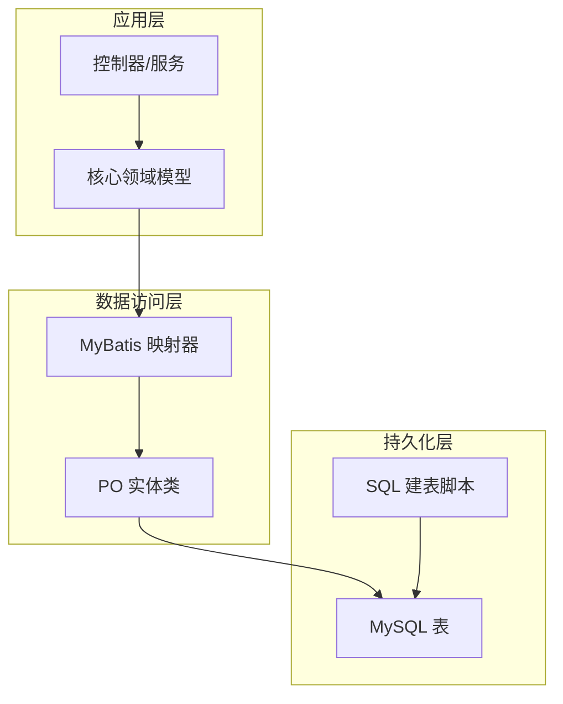
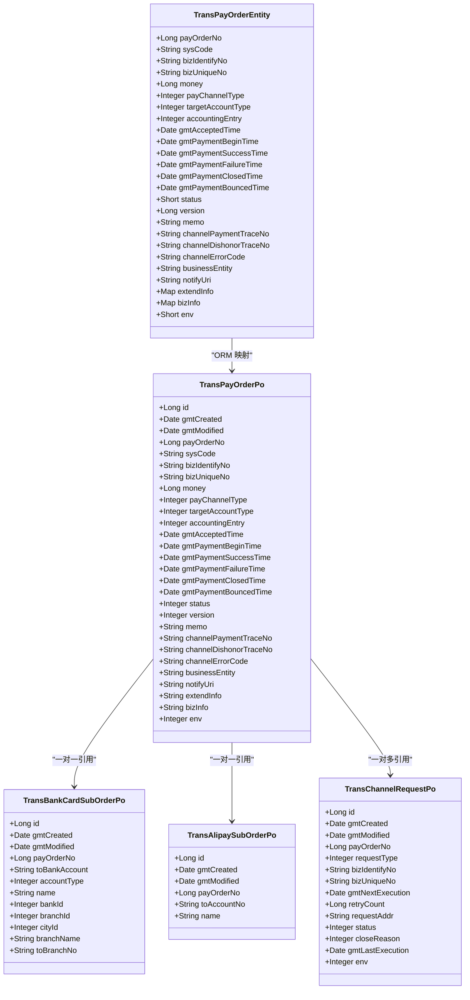
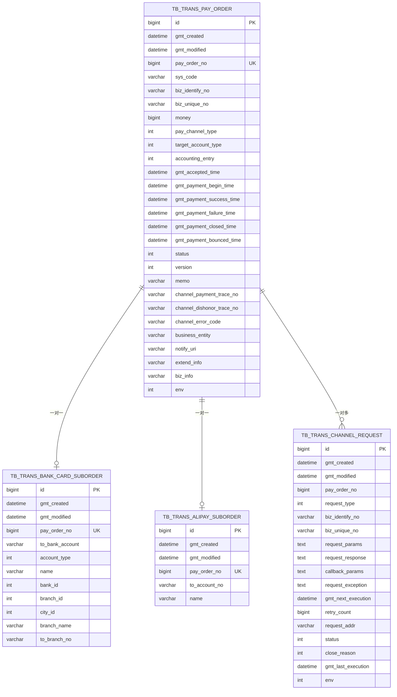
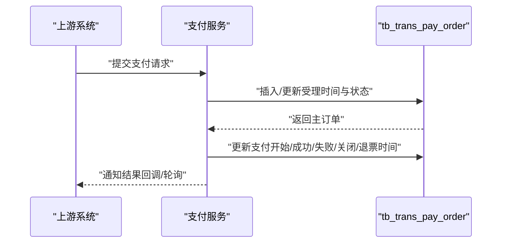
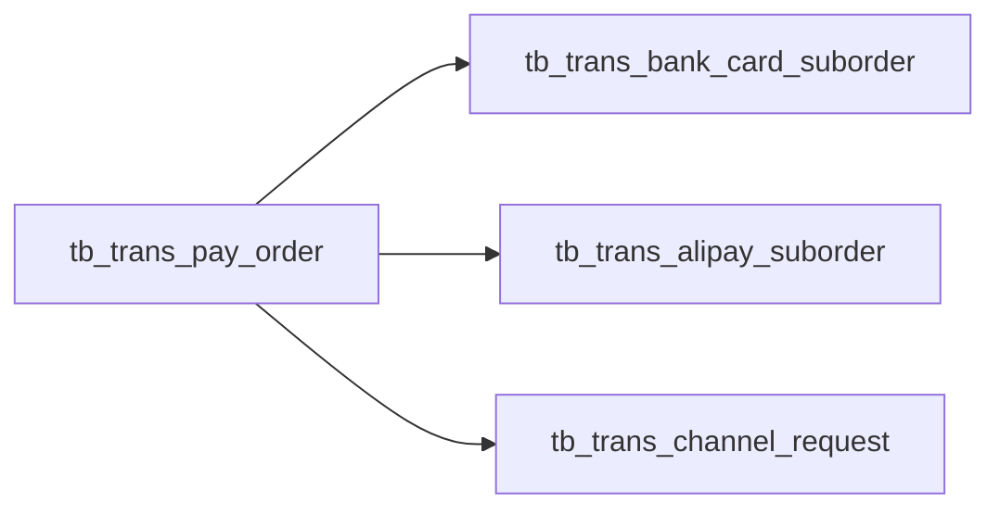

# 数据库表结构设计

<cite>
**本文档引用的文件**
- [schema.ddl](file://biz-service-impl/src/main/resources/sql/mysql/schema.ddl)
- [data.sql](file://biz-service-impl/src/main/resources/sql/mysql/data.sql)
- [tc-init-privileges.sql](file://common-dal/src/main/resources/sql/tc-init-privileges.sql)
- [TransPayOrderPo.java](file://common-dal/src/main/java/com/magicliang/transaction/sys/common/dal/mybatis/po/TransPayOrderPo.java)
- [TransBankCardSubOrderPo.java](file://common-dal/src/main/java/com/magicliang/transaction/sys/common/dal/mybatis/po/TransBankCardSubOrderPo.java)
- [TransAlipaySubOrderPo.java](file://common-dal/src/main/java/com/magicliang/transaction/sys/common/dal/mybatis/po/TransAlipaySubOrderPo.java)
- [TransChannelRequestPo.java](file://common-dal/src/main/java/com/magicliang/transaction/sys/common/dal/mybatis/po/TransChannelRequestPo.java)
- [TransPayOrderEntity.java](file://core-model/src/main/java/com/magicliang/transaction/sys/core/model/entity/TransPayOrderEntity.java)
- [TransAlipaySubOrderEntity.java](file://core-model/src/main/java/com/magicliang/transaction/sys/core/model/entity/TransAlipaySubOrderEntity.java)
</cite>

## 目录
1. [简介](#简介)
2. [项目结构](#项目结构)
3. [核心组件](#核心组件)
4. [架构总览](#架构总览)
5. [详细组件分析](#详细组件分析)
6. [依赖分析](#依赖分析)
7. [性能考量](#性能考量)
8. [故障排查指南](#故障排查指南)
9. [结论](#结论)
10. [附录](#附录)

## 简介
本文件围绕交易系统的数据库表结构设计展开，重点以支付订单主表 tb_trans_pay_order 为例，系统阐述字段的业务含义、数据类型与约束、主键与外键设计、索引策略与性能考量，并结合领域模型与ORM映射PO类，给出规范化与反规范化权衡、分表分片建议以及支撑高并发与大数据量的实践路径。同时，结合DDL注释与代码注释，总结表结构演进与版本管理的要点。

## 项目结构
交易系统采用分层与模块化组织，数据库相关的核心文件集中在 SQL 脚本与 MyBatis PO 映射层：
- SQL 脚本位于 biz-service-impl 的 MySQL 资源目录，包含建表DDL与测试数据占位
- MyBatis PO 类位于 common-dal 的 mybatis/po 包，对应各表的Java实体映射
- 领域模型位于 core-model，体现业务语义与状态流转，驱动数据库设计

**图表来源**
- [schema.ddl:1-145](file://biz-service-impl/src/main/resources/sql/mysql/schema.ddl#L1-L145)
- [TransPayOrderPo.java:1-1046](file://common-dal/src/main/java/com/magicliang/transaction/sys/common/dal/mybatis/po/TransPayOrderPo.java#L1-L1046)

**章节来源**
- [schema.ddl:1-145](file://biz-service-impl/src/main/resources/sql/mysql/schema.ddl#L1-L145)
- [data.sql:1-2](file://biz-service-impl/src/main/resources/sql/mysql/data.sql#L1-L2)

## 核心组件
本节聚焦支付订单主表 tb_trans_pay_order 的字段设计与约束，结合领域模型与ORM映射，说明各字段的业务含义、数据类型与约束、索引策略与版本控制。

- 主键与审计字段
  - id：自增物理主键，单表唯一
  - gmt_created/gmt_modified：创建与最后修改时间，默认值策略明确，便于审计与排序
- 业务主键与来源
  - pay_order_no：支付订单号，业务主键，全局唯一
  - sys_code：支付订单来源系统
  - biz_identify_no/biz_unique_no：上游业务标识与上游业务号，联合唯一，可作为分表键候选
- 金额与账户
  - money：支付金额（分），全为正数
  - target_account_type：目标账户类型（银行卡/账户余额）
- 支付通道与会计
  - pay_channel_type：支付通道类型（如支付宝/微信）
  - accounting_entry：会计记账方向（借/贷）
- 时间与时序
  - gmt_accepted_time：受理时间
  - gmt_payment_begin_time/gmt_payment_success_time/gmt_payment_failure_time/gmt_payment_closed_time/gmt_payment_bounced_time：支付关键节点时间
- 状态与版本
  - status：支付状态（初始化/支付中/成功/失败/关闭/退票）
  - version：乐观锁版本号
- 渠道与通知
  - channel_payment_trace_no/channel_dishonor_trace_no：渠道支付/退票流水号
  - channel_error_code：支付错误码
  - business_entity/notify_uri：支付主体与通知地址
- 扩展信息
  - extend_info/biz_info：平台能力抽象与透传业务信息（JSON格式）
- 环境字段
  - env：运行环境标识（dev/test/staging/prod）

索引策略
- 唯一索引
  - uniq_pay_order_no：业务主键唯一
  - uniq_biz_request：上游业务唯一性约束
- 普通索引
  - idx_status_modified：状态+更新时间复合索引，适用于按状态检索与时间范围限定
- 其他表参考
  - tb_trans_bank_card_suborder：银行卡子订单，一对一引用主订单
  - tb_trans_alipay_suborder：支付宝子订单，一对一引用主订单
  - tb_trans_channel_request：渠道请求表，按支付单+请求类型唯一，支持任务调度

**章节来源**
- [schema.ddl:9-78](file://biz-service-impl/src/main/resources/sql/mysql/schema.ddl#L9-L78)
- [TransPayOrderPo.java:1-1046](file://common-dal/src/main/java/com/magicliang/transaction/sys/common/dal/mybatis/po/TransPayOrderPo.java#L1-L1046)
- [TransPayOrderEntity.java:1-216](file://core-model/src/main/java/com/magicliang/transaction/sys/core/model/entity/TransPayOrderEntity.java#L1-L216)

## 架构总览
从领域模型到数据库表的映射关系如下：

**图表来源**
- [TransPayOrderEntity.java:1-216](file://core-model/src/main/java/com/magicliang/transaction/sys/core/model/entity/TransPayOrderEntity.java#L1-L216)
- [TransPayOrderPo.java:1-1046](file://common-dal/src/main/java/com/magicliang/transaction/sys/common/dal/mybatis/po/TransPayOrderPo.java#L1-L1046)
- [TransBankCardSubOrderPo.java:1-471](file://common-dal/src/main/java/com/magicliang/transaction/sys/common/dal/mybatis/po/TransBankCardSubOrderPo.java#L1-L471)
- [TransAlipaySubOrderPo.java:1-257](file://common-dal/src/main/java/com/magicliang/transaction/sys/common/dal/mybatis/po/TransAlipaySubOrderPo.java#L1-L257)
- [TransChannelRequestPo.java:1-544](file://common-dal/src/main/java/com/magicliang/transaction/sys/common/dal/mybatis/po/TransChannelRequestPo.java#L1-L544)

## 详细组件分析

### 支付订单主表 tb_trans_pay_order 设计详解
- 字段业务含义与约束
  - 业务主键：pay_order_no 全局唯一，作为查询与幂等的关键
  - 上游标识：biz_identify_no 与 biz_unique_no 联合唯一，支持按上游业务维度分表
  - 金额 money 以分为单位，统一计量，避免浮点误差
  - 支付通道与账户类型：pay_channel_type、target_account_type 用于路由与风控
  - 会计方向：accounting_entry 保证账务一致性
  - 时间序列：受理与各阶段时间字段，便于审计与统计
  - 状态与版本：status 与 version 支持状态机与乐观锁
  - 渠道与通知：channel_* 与 notify_uri 提供链路追踪与回调
  - 扩展信息：extend_info/biz_info 以 JSON 承载平台与业务能力
  - 环境字段：env 用于隔离不同运行环境
- 主键与外键
  - 主键：id（自增物理主键）
  - 外键：子订单与渠道请求均通过 pay_order_no 引用主订单，形成一对一/一对多关系
- 索引策略
  - 唯一索引：uniq_pay_order_no、uniq_biz_request
  - 复合索引：idx_status_modified，需配合时间范围过滤，避免回表开销
- 版本与演进
  - DDL 注释强调建表规范、字段命名与注释风格，体现长期维护的可读性与一致性
  - 版本字段 version 默认值为 1，便于乐观锁与迁移兼容

**图表来源**
- [schema.ddl:9-144](file://biz-service-impl/src/main/resources/sql/mysql/schema.ddl#L9-L144)
- [TransBankCardSubOrderPo.java:1-471](file://common-dal/src/main/java/com/magicliang/transaction/sys/common/dal/mybatis/po/TransBankCardSubOrderPo.java#L1-L471)
- [TransAlipaySubOrderPo.java:1-257](file://common-dal/src/main/java/com/magicliang/transaction/sys/common/dal/mybatis/po/TransAlipaySubOrderPo.java#L1-L257)
- [TransChannelRequestPo.java:1-544](file://common-dal/src/main/java/com/magicliang/transaction/sys/common/dal/mybatis/po/TransChannelRequestPo.java#L1-L544)

**章节来源**
- [schema.ddl:9-78](file://biz-service-impl/src/main/resources/sql/mysql/schema.ddl#L9-L78)
- [TransPayOrderPo.java:1-1046](file://common-dal/src/main/java/com/magicliang/transaction/sys/common/dal/mybatis/po/TransPayOrderPo.java#L1-L1046)

### 支付流程时序（概念示意）
以下序列图展示从受理到完成的关键时间点与状态变化，体现表结构对业务时序的支持。

[此图为概念示意，不直接映射具体源码文件]

### 字段演进与版本管理（基于DDL注释）
- 建表规范与注释风格：DDL 中明确建表规范、字段命名与注释风格，确保跨团队协作的一致性
- 字段默认值与时间戳：统一 gmt_created/gmt_modified 的默认值策略，减少迁移成本
- 版本字段：version 默认值 1，便于后续版本控制与迁移
- 索引策略注释：对状态/时间维度索引的适用场景与注意事项进行了说明，指导查询优化

**章节来源**
- [schema.ddl:1-81](file://biz-service-impl/src/main/resources/sql/mysql/schema.ddl#L1-L81)

## 依赖分析
- 表间依赖
  - tb_trans_bank_card_suborder 与 tb_trans_alipay_suborder 通过 pay_order_no 引用 tb_trans_pay_order，形成一对一关系
  - tb_trans_channel_request 通过 pay_order_no 引用 tb_trans_pay_order，形成一对多关系
- ORM 映射依赖
  - PO 类与数据库表字段一一对应，确保领域模型与持久化层的一致性
- 环境与权限
  - 测试容器初始化脚本授予 test 用户全局权限，便于自动化测试与初始化

**图表来源**
- [schema.ddl:83-144](file://biz-service-impl/src/main/resources/sql/mysql/schema.ddl#L83-L144)

**章节来源**
- [schema.ddl:83-144](file://biz-service-impl/src/main/resources/sql/mysql/schema.ddl#L83-L144)
- [tc-init-privileges.sql:1-4](file://common-dal/src/main/resources/sql/tc-init-privileges.sql#L1-L4)

## 性能考量
- 索引设计
  - 唯一索引：uniq_pay_order_no、uniq_biz_request，保障业务唯一性与查询稳定性
  - 复合索引：idx_status_modified 需配合时间范围过滤，避免区分度不足导致的回表与排序开销
- 查询优化建议
  - 按状态查询时，务必限定时间范围；必要时拆分从表或引入物化视图
  - 对高频查询字段组合建立合适索引，避免过多覆盖索引导致写入放大
- 写入优化
  - gmt_modified 默认值策略减少更新开销
  - 金额字段使用整型（分）避免浮点误差与比较复杂度
- 分表分片建议
  - biz_unique_no + biz_identify_no 组合作为分表键候选，兼顾上游业务唯一性与分片均匀性
  - 业务主键 pay_order_no 也可作为分表键，但需评估全局唯一生成算法与迁移成本
- 任务调度
  - channel_request 表的 gmt_next_execution + status 复合索引支持高效的任务调度扫描

[本节为通用性能建议，不直接分析具体源码文件]

## 故障排查指南
- 唯一约束冲突
  - 若出现 uniq_pay_order_no 或 uniq_biz_request 冲突，检查上游幂等键与业务主键生成策略
- 状态机异常
  - 核对 status 更新规则与版本号 version，避免并发更新导致的覆盖
- 时间字段为空
  - gmt_payment_* 等时间字段允许为空，需在查询时处理空值场景
- 索引未命中
  - 检查查询是否带有时间范围与合适的过滤条件，避免全表扫描
- 测试环境权限
  - 如遇初始化失败，确认 test 用户权限与初始化脚本执行顺序

**章节来源**
- [schema.ddl:68-78](file://biz-service-impl/src/main/resources/sql/mysql/schema.ddl#L68-L78)
- [tc-init-privileges.sql:1-4](file://common-dal/src/main/resources/sql/tc-init-privileges.sql#L1-L4)

## 结论
tb_trans_pay_order 表遵循领域驱动设计，以业务主键为核心，结合时间序列、状态机与版本控制，形成清晰的交易生命周期建模。通过合理的索引策略与分表键选择，可在高并发与大数据量场景下保持良好的查询与写入性能。ORM 映射与领域模型保持一致，有助于降低耦合并提升可维护性。

## 附录
- 规范化与反规范化权衡
  - 规范化：减少冗余，提升一致性，但可能增加连接与回表
  - 反规范化：在热点查询上引入冗余字段（如状态、金额摘要），降低查询复杂度
- 分区策略
  - 按时间分区（月/日）与按业务键分区（biz_unique_no + biz_identify_no）结合，兼顾冷热数据与查询分布
- 迁移与版本管理
  - 通过 DDL 注释与版本字段，确保迁移过程中的可追溯性与兼容性

[本节为通用实践建议，不直接分析具体源码文件]