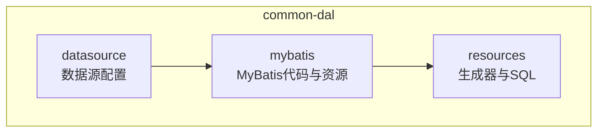
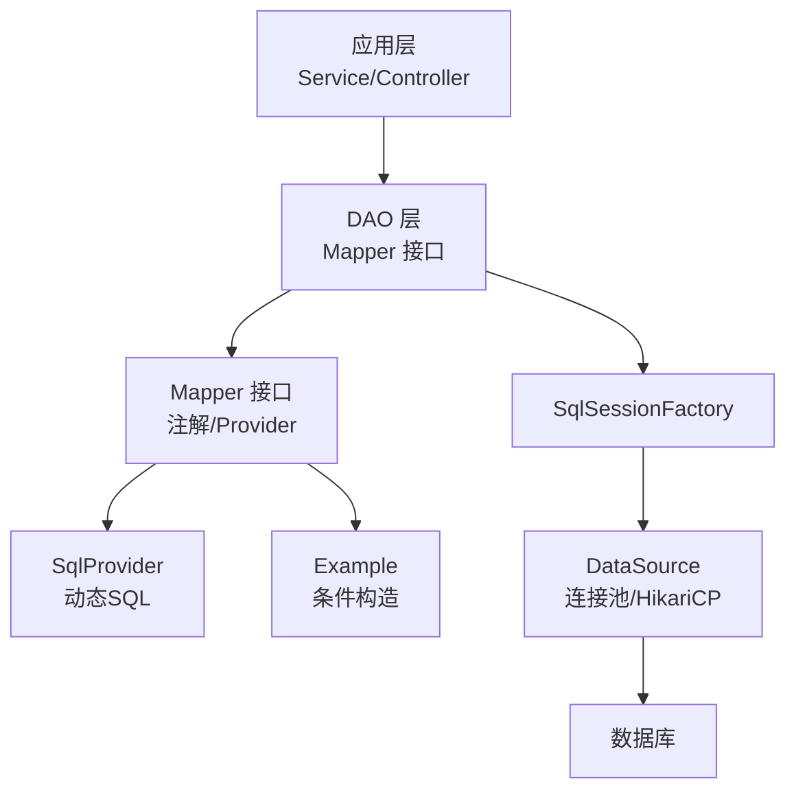
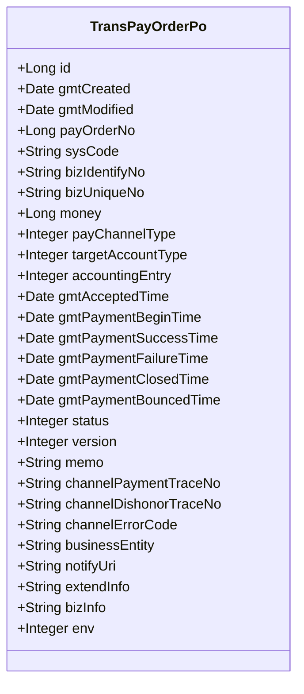
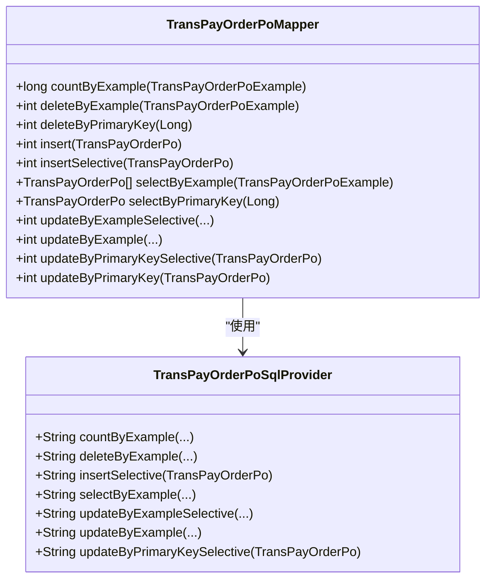
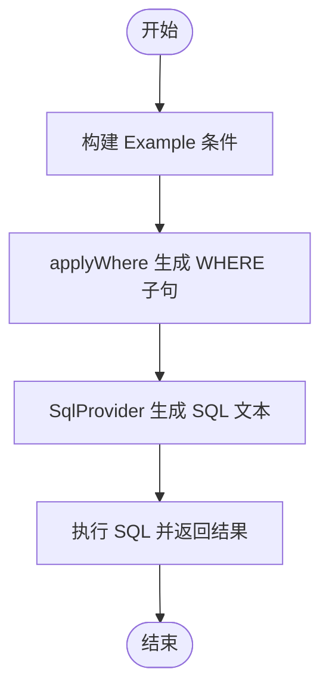
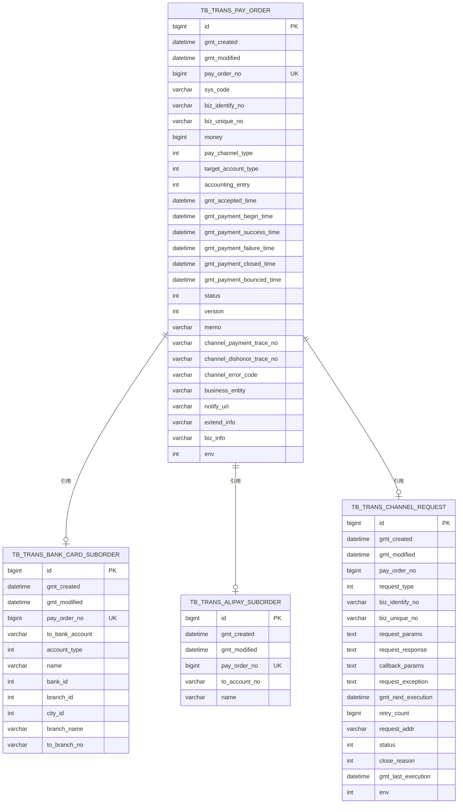
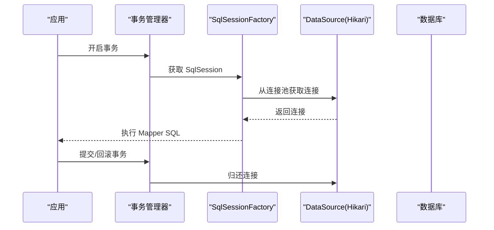
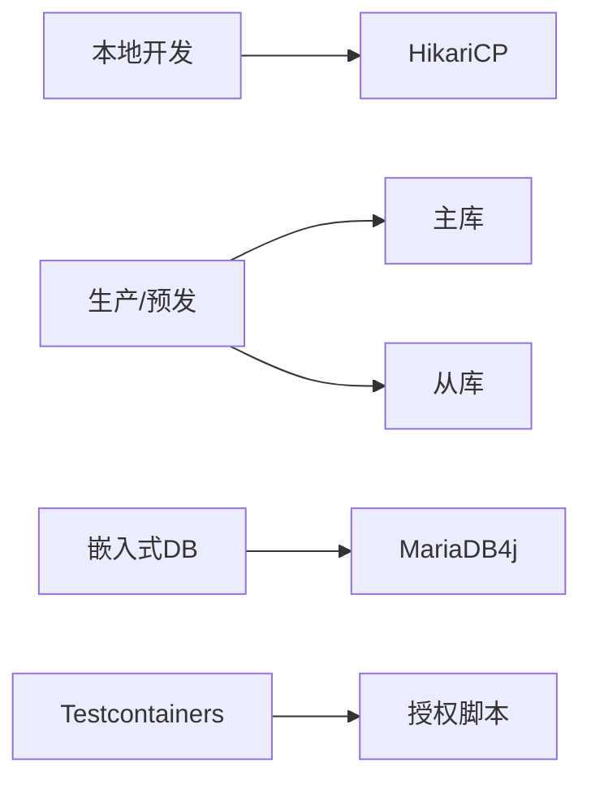
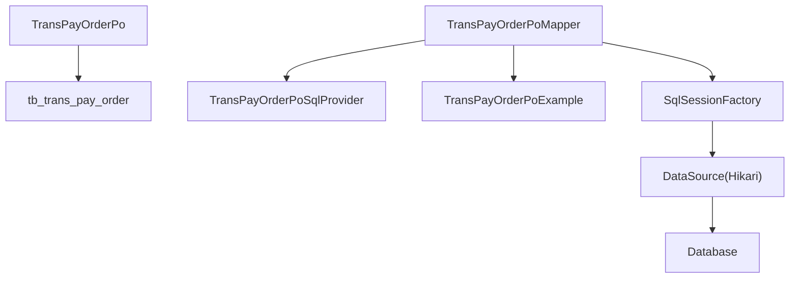

# 数据访问层

<cite>
**本文档引用的文件**
- [TransPayOrderPo.java](file://common-dal/src/main/java/com/magicliang/transaction/sys/common/dal/mybatis/po/TransPayOrderPo.java)
- [TransPayOrderPoMapper.java](file://common-dal/src/main/java/com/magicliang/transaction/sys/common/dal/mybatis/mapper/TransPayOrderPoMapper.java)
- [TransPayOrderPoSqlProvider.java](file://common-dal/src/main/java/com/magicliang/transaction/sys/common/dal/mybatis/mapper/TransPayOrderPoSqlProvider.java)
- [TransPayOrderPoExample.java](file://common-dal/src/main/java/com/magicliang/transaction/sys/common/dal/mybatis/po/TransPayOrderPoExample.java)
- [TransBankCardSubOrderPoMapper.java](file://common-dal/src/main/java/com/magicliang/transaction/sys/common/dal/mybatis/mapper/TransBankCardSubOrderPoMapper.java)
- [TransAlipaySubOrderPoMapper.java](file://common-dal/src/main/java/com/magicliang/transaction/sys/common/dal/mybatis/mapper/TransAlipaySubOrderPoMapper.java)
- [MyBatis-configuration.MD](file://common-dal/src/main/java/com/magicliang/transaction/sys/common/dal/mybatis/MyBatis-configuration.MD)
- [generatorConfig.xml](file://common-dal/src/main/resources/autogen/generatorConfig.xml)
- [DataSourceConfig.java](file://common-dal/src/main/java/com/magicliang/transaction/sys/common/dal/datasource/DataSourceConfig.java)
- [EmbeddedMariaDbConfig.java](file://common-dal/src/main/java/com/magicliang/transaction/sys/common/dal/datasource/EmbeddedMariaDbConfig.java)
- [datasource.xml](file://biz-service-impl/src/main/resources/spring/datasource.xml)
- [mybatis-bean.xml](file://biz-service-impl/src/main/resources/spring/mybatis-bean.xml)
- [tc-init-privileges.sql](file://common-dal/src/main/resources/sql/tc-init-privileges.sql)
- [schema.ddl](file://biz-service-impl/src/main/resources/sql/mysql/schema.ddl)
- [data.sql](file://biz-service-impl/src/main/resources/sql/mysql/data.sql)
</cite>

## 目录
1. [简介](#简介)
2. [项目结构](#项目结构)
3. [核心组件](#核心组件)
4. [架构总览](#架构总览)
5. [详细组件分析](#详细组件分析)
6. [依赖分析](#依赖分析)
7. [性能考量](#性能考量)
8. [故障排查指南](#故障排查指南)
9. [结论](#结论)
10. [附录](#附录)

## 简介
本章节面向数据访问层（common-dal）的读者，系统性阐述该模块如何支撑领域驱动设计下的数据持久化需求。重点覆盖以下方面：
- PO（持久对象）与数据库表的映射关系及字段语义
- MyBatis 配置与 Mapper 接口实现方式（注解与 SqlProvider）
- 示例：TransPayOrderPo 的字段定义、业务含义与查询条件构造
- 数据库表结构设计原则（主键、外键、索引）
- 连接池与事务管理配置建议
- DAO 层增删改查最佳实践与性能优化要点

## 项目结构
common-dal 模块采用按职责分层的组织方式：
- datasource：数据源配置（含本地嵌入式 MariaDB4j 支持）
- mybatis：MyBatis 相关代码与资源
  - po：实体类（PO）与 Example 查询条件类
  - mapper：Mapper 接口与 SqlProvider 动态 SQL
- resources：自动生成器配置与初始化 SQL

**图表来源**
- [DataSourceConfig.java:22-81](file://common-dal/src/main/java/com/magicliang/transaction/sys/common/dal/datasource/DataSourceConfig.java#L22-L81)
- [EmbeddedMariaDbConfig.java:37-183](file://common-dal/src/main/java/com/magicliang/transaction/sys/common/dal/datasource/EmbeddedMariaDbConfig.java#L37-L183)
- [generatorConfig.xml:6-63](file://common-dal/src/main/resources/autogen/generatorConfig.xml#L6-L63)

**章节来源**
- [DataSourceConfig.java:22-81](file://common-dal/src/main/java/com/magicliang/transaction/sys/common/dal/datasource/DataSourceConfig.java#L22-L81)
- [EmbeddedMariaDbConfig.java:37-183](file://common-dal/src/main/java/com/magicliang/transaction/sys/common/dal/datasource/EmbeddedMariaDbConfig.java#L37-L183)
- [generatorConfig.xml:6-63](file://common-dal/src/main/resources/autogen/generatorConfig.xml#L6-L63)

## 核心组件
- PO 类：封装数据库表记录，提供字段访问器与业务语义注释
- Mapper 接口：声明 CRUD 与条件查询方法，结合注解或 SqlProvider 实现 SQL
- SqlProvider：动态 SQL 构造器，支持复杂条件拼装
- Example：条件构造器，用于便捷构建 where 条件与排序
- 数据源配置：支持多环境（本地嵌入式、生产主从）与连接池参数

**章节来源**
- [TransPayOrderPo.java:9-320](file://common-dal/src/main/java/com/magicliang/transaction/sys/common/dal/mybatis/po/TransPayOrderPo.java#L9-L320)
- [TransPayOrderPoMapper.java:20-267](file://common-dal/src/main/java/com/magicliang/transaction/sys/common/dal/mybatis/mapper/TransPayOrderPoMapper.java#L20-L267)
- [TransPayOrderPoSqlProvider.java:11-610](file://common-dal/src/main/java/com/magicliang/transaction/sys/common/dal/mybatis/mapper/TransPayOrderPoSqlProvider.java#L11-L610)
- [TransPayOrderPoExample.java:7-150](file://common-dal/src/main/java/com/magicliang/transaction/sys/common/dal/mybatis/po/TransPayOrderPoExample.java#L7-L150)
- [MyBatis-configuration.MD:1-34](file://common-dal/src/main/java/com/magicliang/transaction/sys/common/dal/mybatis/MyBatis-configuration.MD#L1-L34)

## 架构总览
数据访问层整体架构围绕 MyBatis 与 Spring 集成展开，通过数据源配置、SqlSessionFactory、Mapper 接口与 SqlProvider 形成清晰的分层。

**图表来源**
- [mybatis-bean.xml:6-28](file://biz-service-impl/src/main/resources/spring/mybatis-bean.xml#L6-L28)
- [datasource.xml:8-14](file://biz-service-impl/src/main/resources/spring/datasource.xml#L8-L14)
- [DataSourceConfig.java:33-52](file://common-dal/src/main/java/com/magicliang/transaction/sys/common/dal/datasource/DataSourceConfig.java#L33-L52)
- [TransPayOrderPoMapper.java:20-267](file://common-dal/src/main/java/com/magicliang/transaction/sys/common/dal/mybatis/mapper/TransPayOrderPoMapper.java#L20-L267)
- [TransPayOrderPoSqlProvider.java:11-610](file://common-dal/src/main/java/com/magicliang/transaction/sys/common/dal/mybatis/mapper/TransPayOrderPoSqlProvider.java#L11-L610)

## 详细组件分析

### TransPayOrderPo（支付订单 PO）
- 映射表：tb_trans_pay_order
- 字段设计遵循“业务主键 + 多阶段时间 + 状态 + 版本 + 扩展信息”的聚合根模型
- 关键字段与业务含义（节选）
  - 支付订单号 pay_order_no：业务主键，全局唯一
  - 上游系统标识 sys_code、业务标识 biz_identify_no、上游业务号 biz_unique_no：联合唯一，可用作分表键
  - 金额 money：单位分，全为正数
  - 支付通道类型 pay_channel_type、目标账户类型 target_account_type、会计分录 accounting_entry
  - 多阶段时间：受理、开始、成功、失败、关闭、退票时间
  - 状态 status、版本 version、备注 memo
  - 渠道流水号 channel_payment_trace_no、退票流水号 channel_dishonor_trace_no、错误码 channel_error_code
  - 通知地址 notify_uri、扩展信息 extend_info/biz_info、环境 env
- PO 提供标准 getter/setter 与字符串字段 trim 处理

**图表来源**
- [TransPayOrderPo.java:9-320](file://common-dal/src/main/java/com/magicliang/transaction/sys/common/dal/mybatis/po/TransPayOrderPo.java#L9-L320)

**章节来源**
- [TransPayOrderPo.java:9-320](file://common-dal/src/main/java/com/magicliang/transaction/sys/common/dal/mybatis/po/TransPayOrderPo.java#L9-L320)

### Mapper 接口与 SqlProvider
- 注解方式：Mapper 接口通过 @Select/@Insert/@Update/@Delete 等注解直接编写 SQL
- Provider 方式：通过 @SelectProvider/@InsertProvider/@UpdateProvider/@DeleteProvider 引用 SqlProvider，集中处理动态 SQL
- 示例：TransPayOrderPoMapper
  - 提供 countByExample/deleteByExample/selectByExample/updateByExample 等方法
  - insertSelective 与 updateByPrimaryKeySelective 支持按需插入/更新
  - 使用 @Results 映射结果集到 PO

**图表来源**
- [TransPayOrderPoMapper.java:20-267](file://common-dal/src/main/java/com/magicliang/transaction/sys/common/dal/mybatis/mapper/TransPayOrderPoMapper.java#L20-L267)
- [TransPayOrderPoSqlProvider.java:11-610](file://common-dal/src/main/java/com/magicliang/transaction/sys/common/dal/mybatis/mapper/TransPayOrderPoSqlProvider.java#L11-L610)

**章节来源**
- [TransPayOrderPoMapper.java:20-267](file://common-dal/src/main/java/com/magicliang/transaction/sys/common/dal/mybatis/mapper/TransPayOrderPoMapper.java#L20-L267)
- [TransPayOrderPoSqlProvider.java:11-610](file://common-dal/src/main/java/com/magicliang/transaction/sys/common/dal/mybatis/mapper/TransPayOrderPoSqlProvider.java#L11-L610)

### Example 条件构造与动态 SQL
- Example 提供链式条件构建（andXxx、orXxx、between、in 等），并生成 where 条件
- SqlProvider 内部使用 org.apache.ibatis.jdbc.SQL 构建 SELECT/INSERT/UPDATE/DELETE
- applyWhere 方法负责将 Example 条件转换为 WHERE 子句

**图表来源**
- [TransPayOrderPoExample.java:158-610](file://common-dal/src/main/java/com/magicliang/transaction/sys/common/dal/mybatis/po/TransPayOrderPoExample.java#L158-L610)
- [TransPayOrderPoSqlProvider.java:512-610](file://common-dal/src/main/java/com/magicliang/transaction/sys/common/dal/mybatis/mapper/TransPayOrderPoSqlProvider.java#L512-L610)

**章节来源**
- [TransPayOrderPoExample.java:158-610](file://common-dal/src/main/java/com/magicliang/transaction/sys/common/dal/mybatis/po/TransPayOrderPoExample.java#L158-L610)
- [TransPayOrderPoSqlProvider.java:512-610](file://common-dal/src/main/java/com/magicliang/transaction/sys/common/dal/mybatis/mapper/TransPayOrderPoSqlProvider.java#L512-L610)

### 数据库表结构设计
- 主键：单表唯一自增主键 id
- 业务主键：pay_order_no（全局唯一）
- 联合唯一：biz_unique_no + biz_identify_no（上游业务唯一）
- 索引设计：
  - 状态 + 修改时间复合索引 idx_status_modified
  - 通道请求表按业务唯一与下次执行时间建立索引
- 字段类型与约束：
  - 时间字段使用 DATETIME，避免 0000-00-00 缺省值
  - JSON 扩展字段使用 VARCHAR 并约定格式
  - 版本字段带默认值，支持乐观锁

**图表来源**
- [schema.ddl:9-78](file://biz-service-impl/src/main/resources/sql/mysql/schema.ddl#L9-L78)
- [schema.ddl:84-103](file://biz-service-impl/src/main/resources/sql/mysql/schema.ddl#L84-L103)
- [schema.ddl:106-117](file://biz-service-impl/src/main/resources/sql/mysql/schema.ddl#L106-L117)
- [schema.ddl:120-144](file://biz-service-impl/src/main/resources/sql/mysql/schema.ddl#L120-L144)

**章节来源**
- [schema.ddl:9-78](file://biz-service-impl/src/main/resources/sql/mysql/schema.ddl#L9-L78)
- [schema.ddl:84-103](file://biz-service-impl/src/main/resources/sql/mysql/schema.ddl#L84-L103)
- [schema.ddl:106-117](file://biz-service-impl/src/main/resources/sql/mysql/schema.ddl#L106-L117)
- [schema.ddl:120-144](file://biz-service-impl/src/main/resources/sql/mysql/schema.ddl#L120-L144)

### MyBatis 配置与连接池
- 连接池：HikariCP（默认），可通过 YAML 配置池参数（最小空闲、最大池大小、最大存活时间、连接超时）
- 多数据源：主库与从库分离，确保事务管理器与 SqlSessionFactory 使用同一数据源
- XML 配置：SqlSessionFactory、MapperScannerConfigurer、SqlSessionTemplate（推荐批量执行）

**图表来源**
- [MyBatis-configuration.MD:1-34](file://common-dal/src/main/java/com/magicliang/transaction/sys/common/dal/mybatis/MyBatis-configuration.MD#L1-L34)
- [datasource.xml:8-14](file://biz-service-impl/src/main/resources/spring/datasource.xml#L8-L14)
- [mybatis-bean.xml:6-28](file://biz-service-impl/src/main/resources/spring/mybatis-bean.xml#L6-L28)

**章节来源**
- [MyBatis-configuration.MD:1-34](file://common-dal/src/main/java/com/magicliang/transaction/sys/common/dal/mybatis/MyBatis-configuration.MD#L1-L34)
- [datasource.xml:8-14](file://biz-service-impl/src/main/resources/spring/datasource.xml#L8-L14)
- [mybatis-bean.xml:6-28](file://biz-service-impl/src/main/resources/spring/mybatis-bean.xml#L6-L28)

### 数据源配置与环境隔离
- 生产/预发/线上：主从分离，使用 Spring Boot 配置属性绑定
- 本地嵌入式：MariaDB4j 通过 Spring Service 启动，自动初始化数据库与脚本
- Testcontainers：初始化用户权限脚本，便于容器化测试

**图表来源**
- [DataSourceConfig.java:33-52](file://common-dal/src/main/java/com/magicliang/transaction/sys/common/dal/datasource/DataSourceConfig.java#L33-L52)
- [EmbeddedMariaDbConfig.java:55-96](file://common-dal/src/main/java/com/magicliang/transaction/sys/common/dal/datasource/EmbeddedMariaDbConfig.java#L55-L96)
- [tc-init-privileges.sql:1-4](file://common-dal/src/main/resources/sql/tc-init-privileges.sql#L1-L4)

**章节来源**
- [DataSourceConfig.java:33-52](file://common-dal/src/main/java/com/magicliang/transaction/sys/common/dal/datasource/DataSourceConfig.java#L33-L52)
- [EmbeddedMariaDbConfig.java:55-96](file://common-dal/src/main/java/com/magicliang/transaction/sys/common/dal/datasource/EmbeddedMariaDbConfig.java#L55-L96)
- [tc-init-privileges.sql:1-4](file://common-dal/src/main/resources/sql/tc-init-privileges.sql#L1-L4)

### DAO 层增删改查最佳实践
- 使用 Provider 封装复杂条件，保持 Mapper 接口简洁
- insertSelective/updateByPrimaryKeySelective 仅更新非空字段，降低写放大
- Example 条件链式构建，避免手写 SQL 出错
- 事务边界明确，批量写入使用 SqlSessionTemplate 的 BATCH 执行器
- 索引命中优先：按业务主键、联合唯一、状态+时间等维度建立索引
- 避免 N+1 查询：合理使用 join 或批量查询

**章节来源**
- [TransPayOrderPoMapper.java:97-99](file://common-dal/src/main/java/com/magicliang/transaction/sys/common/dal/mybatis/mapper/TransPayOrderPoMapper.java#L97-L99)
- [TransPayOrderPoMapper.java:226-227](file://common-dal/src/main/java/com/magicliang/transaction/sys/common/dal/mybatis/mapper/TransPayOrderPoMapper.java#L226-L227)
- [mybatis-bean.xml:24-28](file://biz-service-impl/src/main/resources/spring/mybatis-bean.xml#L24-L28)
- [schema.ddl:75-78](file://biz-service-impl/src/main/resources/sql/mysql/schema.ddl#L75-L78)

## 依赖分析
- Mapper 与 SqlProvider：强耦合（Provider 由 Mapper 注解引用）
- PO 与表：一一对应，字段命名与注释保持一致
- Example 与 Provider：条件共享，Provider 依赖 Example 的 where 片段
- 数据源与事务：事务管理器需与 SqlSessionFactory 使用相同数据源，避免无事务问题

**图表来源**
- [TransPayOrderPo.java:9-320](file://common-dal/src/main/java/com/magicliang/transaction/sys/common/dal/mybatis/po/TransPayOrderPo.java#L9-L320)
- [TransPayOrderPoMapper.java:20-267](file://common-dal/src/main/java/com/magicliang/transaction/sys/common/dal/mybatis/mapper/TransPayOrderPoMapper.java#L20-L267)
- [TransPayOrderPoSqlProvider.java:11-610](file://common-dal/src/main/java/com/magicliang/transaction/sys/common/dal/mybatis/mapper/TransPayOrderPoSqlProvider.java#L11-L610)
- [TransPayOrderPoExample.java:7-150](file://common-dal/src/main/java/com/magicliang/transaction/sys/common/dal/mybatis/po/TransPayOrderPoExample.java#L7-L150)
- [mybatis-bean.xml:6-13](file://biz-service-impl/src/main/resources/spring/mybatis-bean.xml#L6-L13)
- [datasource.xml:8-14](file://biz-service-impl/src/main/resources/spring/datasource.xml#L8-L14)

**章节来源**
- [TransPayOrderPoMapper.java:20-267](file://common-dal/src/main/java/com/magicliang/transaction/sys/common/dal/mybatis/mapper/TransPayOrderPoMapper.java#L20-L267)
- [TransPayOrderPoSqlProvider.java:11-610](file://common-dal/src/main/java/com/magicliang/transaction/sys/common/dal/mybatis/mapper/TransPayOrderPoSqlProvider.java#L11-L610)
- [TransPayOrderPoExample.java:7-150](file://common-dal/src/main/java/com/magicliang/transaction/sys/common/dal/mybatis/po/TransPayOrderPoExample.java#L7-L150)
- [mybatis-bean.xml:6-13](file://biz-service-impl/src/main/resources/spring/mybatis-bean.xml#L6-L13)
- [datasource.xml:8-14](file://biz-service-impl/src/main/resources/spring/datasource.xml#L8-L14)

## 性能考量
- 连接池参数：根据并发与 QPS 调整最小空闲、最大池大小、最大存活时间与连接超时
- 索引设计：避免冗余索引，优先覆盖高频查询与业务主键
- 批量写入：使用 SqlSessionTemplate 的 BATCH 执行器减少往返
- 动态 SQL：避免不必要的 OR 条件与函数包裹导致索引失效
- 事务粒度：尽量缩短事务时间，减少锁竞争

[本节为通用指导，无需具体文件引用]

## 故障排查指南
- 无事务问题：确认事务管理器与 SqlSessionFactory 使用同一数据源
- 嵌入式数据库启动失败：检查端口配置与 OpenSSL 依赖
- Testcontainers 权限不足：执行初始化授权脚本
- Example 条件无效：核对条件链是否正确、是否遗漏 isValid 校验

**章节来源**
- [datasource.xml:8-14](file://biz-service-impl/src/main/resources/spring/datasource.xml#L8-L14)
- [EmbeddedMariaDbConfig.java:147-157](file://common-dal/src/main/java/com/magicliang/transaction/sys/common/dal/datasource/EmbeddedMariaDbConfig.java#L147-L157)
- [tc-init-privileges.sql:1-4](file://common-dal/src/main/resources/sql/tc-init-privileges.sql#L1-L4)

## 结论
common-dal 模块通过规范的 PO/DO 映射、清晰的 Mapper/SqlProvider 分层与完善的 MyBatis/Spring 集成，为领域驱动设计提供了稳定可靠的数据访问基础设施。遵循本文档的表结构设计原则、连接池与事务配置建议以及 DAO 层最佳实践，可在保证一致性的同时提升系统性能与可维护性。

## 附录
- 自动生成器配置：MyBatis Generator 配置文件，定义 PO 与 Mapper 生成路径与表映射
- 示例子订单 Mapper：银行卡与支付宝子订单的 Mapper 与 SqlProvider，体现聚合与引用关系

**章节来源**
- [generatorConfig.xml:6-63](file://common-dal/src/main/resources/autogen/generatorConfig.xml#L6-L63)
- [TransBankCardSubOrderPoMapper.java:20-188](file://common-dal/src/main/java/com/magicliang/transaction/sys/common/dal/mybatis/mapper/TransBankCardSubOrderPoMapper.java#L20-L188)
- [TransAlipaySubOrderPoMapper.java:20-163](file://common-dal/src/main/java/com/magicliang/transaction/sys/common/dal/mybatis/mapper/TransAlipaySubOrderPoMapper.java#L20-L163)