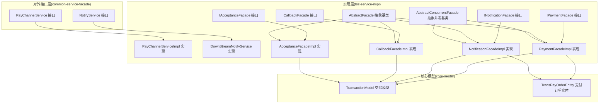
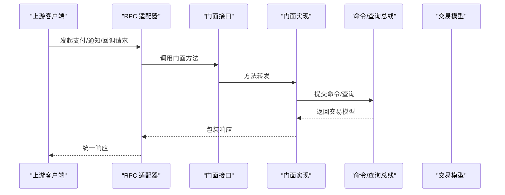
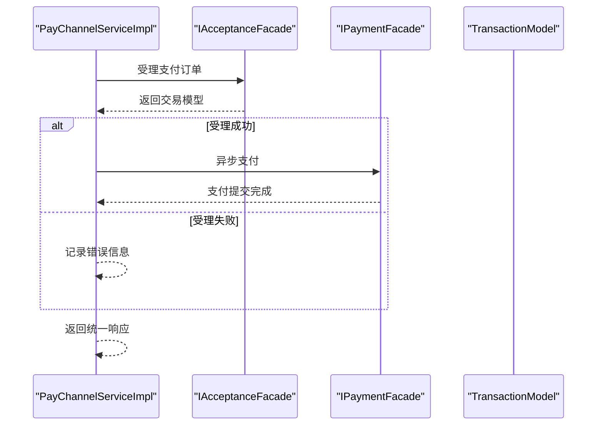
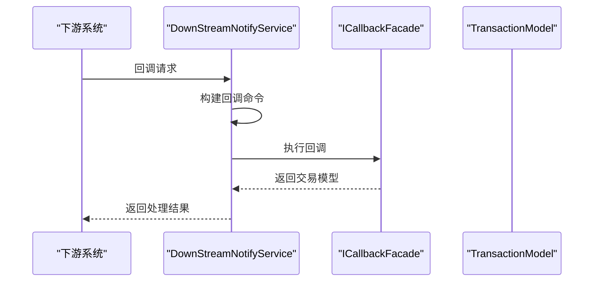
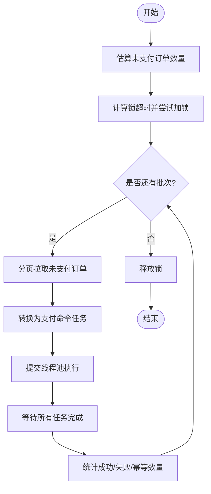
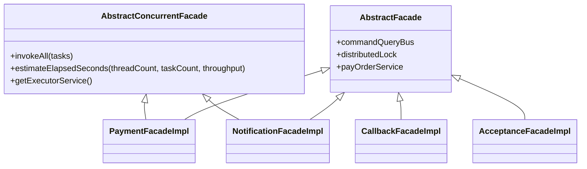
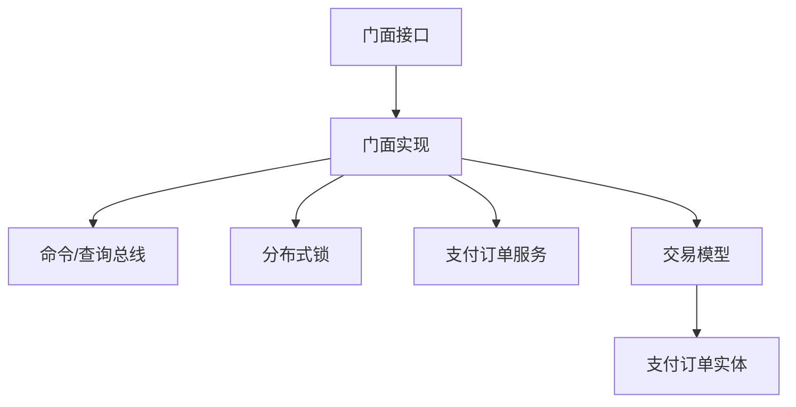

# 服务门面层

<cite>
**本文引用的文件**
- [PayChannelService.java](file://common-service-facade/src/main/java/com/magicliang/transaction/sys/common/service/facade/PayChannelService.java)
- [NotifyService.java](file://common-service-facade/src/main/java/com/magicliang/transaction/sys/common/service/facade/NotifyService.java)
- [PayChannelServiceImpl.java](file://biz-service-impl/src/main/java/com/magicliang/transaction/sys/biz/service/impl/rpc/PayChannelServiceImpl.java)
- [DownStreamNotifyService.java](file://biz-service-impl/src/main/java/com/magicliang/transaction/sys/biz/service/impl/rpc/DownStreamNotifyService.java)
- [IPaymentFacade.java](file://biz-service-impl/src/main/java/com/magicliang/transaction/sys/biz/service/impl/facade/IPaymentFacade.java)
- [INotificationFacade.java](file://biz-service-impl/src/main/java/com/magicliang/transaction/sys/biz/service/impl/facade/INotificationFacade.java)
- [ICallbackFacade.java](file://biz-service-impl/src/main/java/com/magicliang/transaction/sys/biz/service/impl/facade/ICallbackFacade.java)
- [IAcceptanceFacade.java](file://biz-service-impl/src/main/java/com/magicliang/transaction/sys/biz/service/impl/facade/IAcceptanceFacade.java)
- [PaymentFacadeImpl.java](file://biz-service-impl/src/main/java/com/magicliang/transaction/sys/biz/service/impl/facade/impl/PaymentFacadeImpl.java)
- [NotificationFacadeImpl.java](file://biz-service-impl/src/main/java/com/magicliang/transaction/sys/biz/service/impl/facade/impl/NotificationFacadeImpl.java)
- [CallbackFacadeImpl.java](file://biz-service-impl/src/main/java/com/magicliang/transaction/sys/biz/service/impl/facade/impl/CallbackFacadeImpl.java)
- [AcceptanceFacadeImpl.java](file://biz-service-impl/src/main/java/com/magicliang/transaction/sys/biz/service/impl/facade/impl/AcceptanceFacadeImpl.java)
- [AbstractFacade.java](file://biz-service-impl/src/main/java/com/magicliang/transaction/sys/biz/service/impl/facade/impl/AbstractFacade.java)
- [AbstractConcurrentFacade.java](file://biz-service-impl/src/main/java/com/magicliang/transaction/sys/biz/service/impl/facade/impl/AbstractConcurrentFacade.java)
- [TransactionModel.java](file://core-model/src/main/java/com/magicliang/transaction/sys/core/model/context/TransactionModel.java)
- [TransPayOrderEntity.java](file://core-model/src/main/java/com/magicliang/transaction/sys/core/model/entity/TransPayOrderEntity.java)
</cite>

## 目录
1. [引言](#引言)
2. [项目结构](#项目结构)
3. [核心组件](#核心组件)
4. [架构总览](#架构总览)
5. [详细组件分析](#详细组件分析)
6. [依赖分析](#依赖分析)
7. [性能考量](#性能考量)
8. [故障排查指南](#故障排查指南)
9. [结论](#结论)
10. [附录](#附录)

## 引言
本文件聚焦于 common-service-facade 模块所承载的“服务门面层”，系统性阐述其作为对外服务接口抽象层的设计与实现。门面层向上屏蔽内部复杂度，向下对接领域服务与基础设施，统一了支付、通知、回调、受理等核心能力的调用入口，确保上层应用获得稳定、一致且可演进的服务接口。

## 项目结构
- common-service-facade：对外服务接口的契约定义（门面接口），不包含实现细节，仅声明服务职责与边界。
- biz-service-impl：门面接口的具体实现，负责编排领域服务、转换请求/响应、协调异步任务与线程池，并通过 RPC 适配器承接上游调用或下游回调。
- core-model：跨层共享的核心数据模型，如交易上下文与领域实体，保证门面层与领域层之间的契约稳定。

图示来源
- [PayChannelService.java:12-14](file://common-service-facade/src/main/java/com/magicliang/transaction/sys/common/service/facade/PayChannelService.java#L12-L14)
- [NotifyService.java:13-15](file://common-service-facade/src/main/java/com/magicliang/transaction/sys/common/service/facade/NotifyService.java#L13-L15)
- [PayChannelServiceImpl.java:25-68](file://biz-service-impl/src/main/java/com/magicliang/transaction/sys/biz/service/impl/rpc/PayChannelServiceImpl.java#L25-L68)
- [DownStreamNotifyService.java:22-66](file://biz-service-impl/src/main/java/com/magicliang/transaction/sys/biz/service/impl/rpc/DownStreamNotifyService.java#L22-L66)
- [IPaymentFacade.java:18-57](file://biz-service-impl/src/main/java/com/magicliang/transaction/sys/biz/service/impl/facade/IPaymentFacade.java#L18-L57)
- [INotificationFacade.java:18-42](file://biz-service-impl/src/main/java/com/magicliang/transaction/sys/biz/service/impl/facade/INotificationFacade.java#L18-L42)
- [ICallbackFacade.java:15-24](file://biz-service-impl/src/main/java/com/magicliang/transaction/sys/biz/service/impl/facade/ICallbackFacade.java#L15-L24)
- [IAcceptanceFacade.java:15-24](file://biz-service-impl/src/main/java/com/magicliang/transaction/sys/biz/service/impl/facade/IAcceptanceFacade.java#L15-L24)
- [PaymentFacadeImpl.java:34-147](file://biz-service-impl/src/main/java/com/magicliang/transaction/sys/biz/service/impl/facade/impl/PaymentFacadeImpl.java#L34-L147)
- [NotificationFacadeImpl.java:31-110](file://biz-service-impl/src/main/java/com/magicliang/transaction/sys/biz/service/impl/facade/impl/NotificationFacadeImpl.java#L31-L110)
- [CallbackFacadeImpl.java:20-31](file://biz-service-impl/src/main/java/com/magicliang/transaction/sys/biz/service/impl/facade/impl/CallbackFacadeImpl.java#L20-L31)
- [AcceptanceFacadeImpl.java:19-31](file://biz-service-impl/src/main/java/com/magicliang/transaction/sys/biz/service/impl/facade/impl/AcceptanceFacadeImpl.java#L19-L31)
- [AbstractFacade.java:17-36](file://biz-service-impl/src/main/java/com/magicliang/transaction/sys/biz/service/impl/facade/impl/AbstractFacade.java#L17-L36)
- [AbstractConcurrentFacade.java:25-93](file://biz-service-impl/src/main/java/com/magicliang/transaction/sys/biz/service/impl/facade/impl/AbstractConcurrentFacade.java#L25-L93)
- [TransactionModel.java:17-43](file://core-model/src/main/java/com/magicliang/transaction/sys/core/model/context/TransactionModel.java#L17-L43)
- [TransPayOrderEntity.java:32-215](file://core-model/src/main/java/com/magicliang/transaction/sys/core/model/entity/TransPayOrderEntity.java#L32-L215)

章节来源
- [PayChannelService.java:12-14](file://common-service-facade/src/main/java/com/magicliang/transaction/sys/common/service/facade/PayChannelService.java#L12-L14)
- [NotifyService.java:13-15](file://common-service-facade/src/main/java/com/magicliang/transaction/sys/common/service/facade/NotifyService.java#L13-L15)
- [PayChannelServiceImpl.java:25-68](file://biz-service-impl/src/main/java/com/magicliang/transaction/sys/biz/service/impl/rpc/PayChannelServiceImpl.java#L25-L68)
- [DownStreamNotifyService.java:22-66](file://biz-service-impl/src/main/java/com/magicliang/transaction/sys/biz/service/impl/rpc/DownStreamNotifyService.java#L22-L66)
- [IPaymentFacade.java:18-57](file://biz-service-impl/src/main/java/com/magicliang/transaction/sys/biz/service/impl/facade/IPaymentFacade.java#L18-L57)
- [INotificationFacade.java:18-42](file://biz-service-impl/src/main/java/com/magicliang/transaction/sys/biz/service/impl/facade/INotificationFacade.java#L18-L42)
- [ICallbackFacade.java:15-24](file://biz-service-impl/src/main/java/com/magicliang/transaction/sys/biz/service/impl/facade/ICallbackFacade.java#L15-L24)
- [IAcceptanceFacade.java:15-24](file://biz-service-impl/src/main/java/com/magicliang/transaction/sys/biz/service/impl/facade/IAcceptanceFacade.java#L15-L24)
- [PaymentFacadeImpl.java:34-147](file://biz-service-impl/src/main/java/com/magicliang/transaction/sys/biz/service/impl/facade/impl/PaymentFacadeImpl.java#L34-L147)
- [NotificationFacadeImpl.java:31-110](file://biz-service-impl/src/main/java/com/magicliang/transaction/sys/biz/service/impl/facade/impl/NotificationFacadeImpl.java#L31-L110)
- [CallbackFacadeImpl.java:20-31](file://biz-service-impl/src/main/java/com/magicliang/transaction/sys/biz/service/impl/facade/impl/CallbackFacadeImpl.java#L20-L31)
- [AcceptanceFacadeImpl.java:19-31](file://biz-service-impl/src/main/java/com/magicliang/transaction/sys/biz/service/impl/facade/impl/AcceptanceFacadeImpl.java#L19-L31)
- [AbstractFacade.java:17-36](file://biz-service-impl/src/main/java/com/magicliang/transaction/sys/biz/service/impl/facade/impl/AbstractFacade.java#L17-L36)
- [AbstractConcurrentFacade.java:25-93](file://biz-service-impl/src/main/java/com/magicliang/transaction/sys/biz/service/impl/facade/impl/AbstractConcurrentFacade.java#L25-L93)
- [TransactionModel.java:17-43](file://core-model/src/main/java/com/magicliang/transaction/sys/core/model/context/TransactionModel.java#L17-L43)
- [TransPayOrderEntity.java:32-215](file://core-model/src/main/java/com/magicliang/transaction/sys/core/model/entity/TransPayOrderEntity.java#L32-L215)

## 核心组件
- 门面接口（对外）
  - 支付通道服务接口：定义面向上游的支付通道调用契约，作为统一入口承接外部请求。
  - 通知服务接口：定义远端下游回调/通知的统一入口，便于集中处理回调与通知逻辑。
- 门面实现（对内）
  - 支付门面：负责支付受理、批量支付、异步支付与支付后通知编排。
  - 通知门面：负责未发送通知的批量扫描与发送。
  - 回调门面：负责下游回调的受理与订单状态更新。
  - 受理门面：负责支付订单的受理与前置校验。
- 抽象基类
  - 抽象门面：注入命令/查询总线、分布式锁与支付订单服务，统一门面层依赖。
  - 并发抽象门面：提供批量任务执行、线程池编排、超时估算与异常归集。
- 核心模型
  - 交易模型：封装一次操作的执行结果、幂等标记与错误信息。
  - 支付订单实体：承载支付订单的完整领域属性与状态变迁。

章节来源
- [PayChannelService.java:12-14](file://common-service-facade/src/main/java/com/magicliang/transaction/sys/common/service/facade/PayChannelService.java#L12-L14)
- [NotifyService.java:13-15](file://common-service-facade/src/main/java/com/magicliang/transaction/sys/common/service/facade/NotifyService.java#L13-L15)
- [IPaymentFacade.java:18-57](file://biz-service-impl/src/main/java/com/magicliang/transaction/sys/biz/service/impl/facade/IPaymentFacade.java#L18-L57)
- [INotificationFacade.java:18-42](file://biz-service-impl/src/main/java/com/magicliang/transaction/sys/biz/service/impl/facade/INotificationFacade.java#L18-L42)
- [ICallbackFacade.java:15-24](file://biz-service-impl/src/main/java/com/magicliang/transaction/sys/biz/service/impl/facade/ICallbackFacade.java#L15-L24)
- [IAcceptanceFacade.java:15-24](file://biz-service-impl/src/main/java/com/magicliang/transaction/sys/biz/service/impl/facade/IAcceptanceFacade.java#L15-L24)
- [AbstractFacade.java:17-36](file://biz-service-impl/src/main/java/com/magicliang/transaction/sys/biz/service/impl/facade/impl/AbstractFacade.java#L17-L36)
- [AbstractConcurrentFacade.java:25-93](file://biz-service-impl/src/main/java/com/magicliang/transaction/sys/biz/service/impl/facade/impl/AbstractConcurrentFacade.java#L25-L93)
- [TransactionModel.java:17-43](file://core-model/src/main/java/com/magicliang/transaction/sys/core/model/context/TransactionModel.java#L17-L43)
- [TransPayOrderEntity.java:32-215](file://core-model/src/main/java/com/magicliang/transaction/sys/core/model/entity/TransPayOrderEntity.java#L32-L215)

## 架构总览
门面层采用“接口隔离 + 实现编排”的设计，通过 RPC 适配器承接外部请求，再委派给门面接口；门面实现进一步委派至领域服务与基础设施，最终落盘到数据库或下游系统。整体以 TransactionModel 为统一返回载体，贯穿成功/失败、幂等与错误信息。

图示来源
- [PayChannelServiceImpl.java:45-67](file://biz-service-impl/src/main/java/com/magicliang/transaction/sys/biz/service/impl/rpc/PayChannelServiceImpl.java#L45-L67)
- [DownStreamNotifyService.java:46-65](file://biz-service-impl/src/main/java/com/magicliang/transaction/sys/biz/service/impl/rpc/DownStreamNotifyService.java#L46-L65)
- [PaymentFacadeImpl.java:115-147](file://biz-service-impl/src/main/java/com/magicliang/transaction/sys/biz/service/impl/facade/impl/PaymentFacadeImpl.java#L115-L147)
- [NotificationFacadeImpl.java:107-110](file://biz-service-impl/src/main/java/com/magicliang/transaction/sys/biz/service/impl/facade/impl/NotificationFacadeImpl.java#L107-L110)
- [CallbackFacadeImpl.java:28-31](file://biz-service-impl/src/main/java/com/magicliang/transaction/sys/biz/service/impl/facade/impl/CallbackFacadeImpl.java#L28-L31)
- [AcceptanceFacadeImpl.java:28-31](file://biz-service-impl/src/main/java/com/magicliang/transaction/sys/biz/service/impl/facade/impl/AcceptanceFacadeImpl.java#L28-L31)
- [TransactionModel.java:17-43](file://core-model/src/main/java/com/magicliang/transaction/sys/core/model/context/TransactionModel.java#L17-L43)

## 详细组件分析

### 支付通道服务 PayChannelService 与实现 PayChannelServiceImpl
- 设计原则
  - 门面接口最小可用：仅声明方法签名，避免泄露实现细节。
  - RPC 适配器职责：负责请求转换、幂等与异常兜底，不参与业务决策。
- 功能要点
  - 将上游支付请求转换为受理命令，调用受理门面完成受理。
  - 若受理成功，触发支付门面的异步支付流程，确保受理即支付的体验。
  - 统一返回包装对象，隐藏底层字段映射细节。
- 安全与幂等
  - 通过受理门面返回的交易模型判断幂等标记，避免重复处理。
  - RPC 层预留验签位置，便于后续接入安全校验。

图示来源
- [PayChannelServiceImpl.java:45-67](file://biz-service-impl/src/main/java/com/magicliang/transaction/sys/biz/service/impl/rpc/PayChannelServiceImpl.java#L45-L67)
- [IAcceptanceFacade.java:15-24](file://biz-service-impl/src/main/java/com/magicliang/transaction/sys/biz/service/impl/facade/IAcceptanceFacade.java#L15-L24)
- [IPaymentFacade.java:56-56](file://biz-service-impl/src/main/java/com/magicliang/transaction/sys/biz/service/impl/facade/IPaymentFacade.java#L56-L56)

章节来源
- [PayChannelService.java:12-14](file://common-service-facade/src/main/java/com/magicliang/transaction/sys/common/service/facade/PayChannelService.java#L12-L14)
- [PayChannelServiceImpl.java:25-80](file://biz-service-impl/src/main/java/com/magicliang/transaction/sys/biz/service/impl/rpc/PayChannelServiceImpl.java#L25-L80)

### 通知服务 NotifyService 与实现 DownStreamNotifyService
- 设计原则
  - 下游回调统一入口：屏蔽不同下游协议差异，集中处理验签、解析与回写。
  - 失败隔离：异常捕获与日志记录，保证回调不影响上游调用方。
- 功能要点
  - 构造回调命令，调用回调门面完成订单状态更新。
  - 统一返回“成功/失败”标志，便于下游识别处理结果。
- 安全与幂等
  - 预留验签逻辑，建议结合上游公钥与签名算法实现。
  - 通过交易模型的幂等标记避免重复回调导致的二次处理。

图示来源
- [DownStreamNotifyService.java:46-66](file://biz-service-impl/src/main/java/com/magicliang/transaction/sys/biz/service/impl/rpc/DownStreamNotifyService.java#L46-L66)
- [ICallbackFacade.java:15-24](file://biz-service-impl/src/main/java/com/magicliang/transaction/sys/biz/service/impl/facade/ICallbackFacade.java#L15-L24)

章节来源
- [NotifyService.java:13-15](file://common-service-facade/src/main/java/com/magicliang/transaction/sys/common/service/facade/NotifyService.java#L13-L15)
- [DownStreamNotifyService.java:22-78](file://biz-service-impl/src/main/java/com/magicliang/transaction/sys/biz/service/impl/rpc/DownStreamNotifyService.java#L22-L78)

### 支付门面 IPaymentFacade 与实现 PaymentFacadeImpl
- 设计原则
  - 批量处理与并发执行：通过线程池与任务拆分提升吞吐。
  - 分布式锁与弹性超时：根据任务规模动态估算锁超时，避免死锁与抖动。
  - 异步通知：支付成功后异步触发通知，降低主流程延迟。
- 功能要点
  - 批量支付：分页拉取未支付订单，批量执行并统计结果。
  - 异步支付：提交支付任务后立即返回，后台线程池执行并触发通知。
  - 幂等统计：汇总成功、失败与幂等次数，便于监控与告警。
- 性能与稳定性
  - 吞吐估算：基于线程数与单线程吞吐量估算执行时间，并叠加补充时间。
  - 异常归集：统一捕获执行异常并转换为领域异常，避免线程池异常穿透。

图示来源
- [PaymentFacadeImpl.java:66-92](file://biz-service-impl/src/main/java/com/magicliang/transaction/sys/biz/service/impl/facade/impl/PaymentFacadeImpl.java#L66-L92)
- [AbstractConcurrentFacade.java:37-73](file://biz-service-impl/src/main/java/com/magicliang/transaction/sys/biz/service/impl/facade/impl/AbstractConcurrentFacade.java#L37-L73)
- [AbstractConcurrentFacade.java:90-93](file://biz-service-impl/src/main/java/com/magicliang/transaction/sys/biz/service/impl/facade/impl/AbstractConcurrentFacade.java#L90-L93)

章节来源
- [IPaymentFacade.java:18-57](file://biz-service-impl/src/main/java/com/magicliang/transaction/sys/biz/service/impl/facade/IPaymentFacade.java#L18-L57)
- [PaymentFacadeImpl.java:34-166](file://biz-service-impl/src/main/java/com/magicliang/transaction/sys/biz/service/impl/facade/impl/PaymentFacadeImpl.java#L34-L166)
- [AbstractConcurrentFacade.java:25-93](file://biz-service-impl/src/main/java/com/magicliang/transaction/sys/biz/service/impl/facade/impl/AbstractConcurrentFacade.java#L25-L93)

### 通知门面 INotificationFacade 与实现 NotificationFacadeImpl
- 设计原则
  - 批量通知与并发执行：与支付门面类似，采用线程池与任务拆分。
  - 分布式锁保护：避免多实例并发扫描与发送导致的数据竞争。
- 功能要点
  - 批量通知：分页拉取未发送通知，批量发送并统计结果。
  - 任务映射：将支付订单实体映射为通知命令，提交至命令总线执行。
- 性能与稳定性
  - 吞吐估算：基于线程数与单线程吞吐量估算执行时间，并叠加补充时间。
  - 日志与可观测：记录批次统计信息，便于问题定位与容量规划。

章节来源
- [INotificationFacade.java:18-42](file://biz-service-impl/src/main/java/com/magicliang/transaction/sys/biz/service/impl/facade/INotificationFacade.java#L18-L42)
- [NotificationFacadeImpl.java:31-127](file://biz-service-impl/src/main/java/com/magicliang/transaction/sys/biz/service/impl/facade/impl/NotificationFacadeImpl.java#L31-L127)
- [AbstractConcurrentFacade.java:25-93](file://biz-service-impl/src/main/java/com/magicliang/transaction/sys/biz/service/impl/facade/impl/AbstractConcurrentFacade.java#L25-L93)

### 回调门面 ICallbackFacade 与实现 CallbackFacadeImpl
- 设计原则
  - 回调即受理：回调门面直接将回调命令提交至命令总线，完成订单状态更新。
  - 简洁实现：避免在门面层引入过多业务逻辑，保持职责单一。
- 功能要点
  - 回调执行：接收回调命令，返回交易模型，供 RPC 层统一处理。

章节来源
- [ICallbackFacade.java:15-24](file://biz-service-impl/src/main/java/com/magicliang/transaction/sys/biz/service/impl/facade/ICallbackFacade.java#L15-L24)
- [CallbackFacadeImpl.java:20-33](file://biz-service-impl/src/main/java/com/magicliang/transaction/sys/biz/service/impl/facade/impl/CallbackFacadeImpl.java#L20-L33)

### 受理门面 IAcceptanceFacade 与实现 AcceptanceFacadeImpl
- 设计原则
  - 受理即预处理：受理门面负责订单的初始校验与状态变更，为后续支付/通知奠定基础。
- 功能要点
  - 受理执行：接收受理命令，返回交易模型，供 RPC 层统一处理。

章节来源
- [IAcceptanceFacade.java:15-24](file://biz-service-impl/src/main/java/com/magicliang/transaction/sys/biz/service/impl/facade/IAcceptanceFacade.java#L15-L24)
- [AcceptanceFacadeImpl.java:19-33](file://biz-service-impl/src/main/java/com/magicliang/transaction/sys/biz/service/impl/facade/impl/AcceptanceFacadeImpl.java#L19-L33)

### 抽象基类 AbstractFacade 与 AbstractConcurrentFacade
- 设计原则
  - 依赖注入：统一注入命令/查询总线、分布式锁与支付订单服务，减少重复代码。
  - 并发抽象：提供批量任务执行、线程池编排与异常归集，屏蔽并发细节。
- 功能要点
  - invokeAll：批量提交任务并同步等待结果，统计成功/失败/幂等数量。
  - estimateElapsedSeconds：基于吞吐量估算执行时间，叠加补充时间保障稳定性。

图示来源
- [AbstractFacade.java:17-36](file://biz-service-impl/src/main/java/com/magicliang/transaction/sys/biz/service/impl/facade/impl/AbstractFacade.java#L17-L36)
- [AbstractConcurrentFacade.java:25-93](file://biz-service-impl/src/main/java/com/magicliang/transaction/sys/biz/service/impl/facade/impl/AbstractConcurrentFacade.java#L25-L93)
- [PaymentFacadeImpl.java:34-34](file://biz-service-impl/src/main/java/com/magicliang/transaction/sys/biz/service/impl/facade/impl/PaymentFacadeImpl.java#L34-L34)
- [NotificationFacadeImpl.java:31-31](file://biz-service-impl/src/main/java/com/magicliang/transaction/sys/biz/service/impl/facade/impl/NotificationFacadeImpl.java#L31-L31)
- [CallbackFacadeImpl.java:20-20](file://biz-service-impl/src/main/java/com/magicliang/transaction/sys/biz/service/impl/facade/impl/CallbackFacadeImpl.java#L20-L20)
- [AcceptanceFacadeImpl.java:19-19](file://biz-service-impl/src/main/java/com/magicliang/transaction/sys/biz/service/impl/facade/impl/AcceptanceFacadeImpl.java#L19-L19)

章节来源
- [AbstractFacade.java:17-36](file://biz-service-impl/src/main/java/com/magicliang/transaction/sys/biz/service/impl/facade/impl/AbstractFacade.java#L17-L36)
- [AbstractConcurrentFacade.java:25-93](file://biz-service-impl/src/main/java/com/magicliang/transaction/sys/biz/service/impl/facade/impl/AbstractConcurrentFacade.java#L25-L93)

### 核心数据模型
- 交易模型 TransactionModel
  - 字段：支付订单、成功标记、幂等标记、错误码与错误信息。
  - 作用：作为门面层与 RPC 层的统一返回载体，屏蔽底层实现差异。
- 支付订单实体 TransPayOrderEntity
  - 字段：订单号、金额、渠道类型、目标账户类型、状态、版本、扩展信息等。
  - 作用：承载领域聚合根状态与行为，支撑门面层的编排与持久化。

章节来源
- [TransactionModel.java:17-43](file://core-model/src/main/java/com/magicliang/transaction/sys/core/model/context/TransactionModel.java#L17-L43)
- [TransPayOrderEntity.java:32-215](file://core-model/src/main/java/com/magicliang/transaction/sys/core/model/entity/TransPayOrderEntity.java#L32-L215)

## 依赖分析
- 松耦合
  - 对外仅暴露门面接口，实现细节由具体实现类承担，上层无需感知内部变化。
  - 通过命令/查询总线解耦门面与领域处理器，便于演进与替换。
- 可观测与可维护
  - 统一的交易模型与异常体系，便于集中监控与告警。
  - 并发抽象基类提供统一的线程池与超时策略，降低实现成本。

图示来源
- [AbstractFacade.java:17-36](file://biz-service-impl/src/main/java/com/magicliang/transaction/sys/biz/service/impl/facade/impl/AbstractFacade.java#L17-L36)
- [AbstractConcurrentFacade.java:25-93](file://biz-service-impl/src/main/java/com/magicliang/transaction/sys/biz/service/impl/facade/impl/AbstractConcurrentFacade.java#L25-L93)
- [TransactionModel.java:17-43](file://core-model/src/main/java/com/magicliang/transaction/sys/core/model/context/TransactionModel.java#L17-L43)
- [TransPayOrderEntity.java:32-215](file://core-model/src/main/java/com/magicliang/transaction/sys/core/model/entity/TransPayOrderEntity.java#L32-L215)

章节来源
- [AbstractFacade.java:17-36](file://biz-service-impl/src/main/java/com/magicliang/transaction/sys/biz/service/impl/facade/impl/AbstractFacade.java#L17-L36)
- [AbstractConcurrentFacade.java:25-93](file://biz-service-impl/src/main/java/com/magicliang/transaction/sys/biz/service/impl/facade/impl/AbstractConcurrentFacade.java#L25-L93)
- [TransactionModel.java:17-43](file://core-model/src/main/java/com/magicliang/transaction/sys/core/model/context/TransactionModel.java#L17-L43)
- [TransPayOrderEntity.java:32-215](file://core-model/src/main/java/com/magicliang/transaction/sys/core/model/entity/TransPayOrderEntity.java#L32-L215)

## 性能考量
- 吞吐估算与锁超时
  - 基于线程数与单线程吞吐量估算执行时间，并叠加补充时间，避免锁窗口不准导致的资源争用。
- 线程池与批处理
  - 批量任务拆分为独立 Callable，统一提交线程池执行，完成后同步收集结果，统计成功/失败/幂等数量。
- 异步通知
  - 支付成功后异步触发通知，降低主流程延迟，提升用户体验。
- 监控与告警
  - 建议在门面层埋点统计：批次总量、成功数、失败数、幂等数与平均耗时，便于容量规划与问题定位。

章节来源
- [AbstractConcurrentFacade.java:90-93](file://biz-service-impl/src/main/java/com/magicliang/transaction/sys/biz/service/impl/facade/impl/AbstractConcurrentFacade.java#L90-L93)
- [PaymentFacadeImpl.java:66-92](file://biz-service-impl/src/main/java/com/magicliang/transaction/sys/biz/service/impl/facade/impl/PaymentFacadeImpl.java#L66-L92)
- [NotificationFacadeImpl.java:57-84](file://biz-service-impl/src/main/java/com/magicliang/transaction/sys/biz/service/impl/facade/impl/NotificationFacadeImpl.java#L57-L84)

## 故障排查指南
- RPC 层异常
  - 回调异常：捕获并记录异常日志，返回失败标志，避免影响下游调用方。
  - 支付异常：受理失败时记录错误码与错误信息，便于上层重试或人工干预。
- 并发层异常
  - 线程池异常：统一捕获执行异常并转换为领域异常，避免异常穿透。
  - 中断处理：正确处理线程中断，恢复中断状态并记录日志。
- 幂等与一致性
  - 通过交易模型的幂等标记避免重复处理；若出现重复回调，需结合幂等策略进行去重。

章节来源
- [DownStreamNotifyService.java:59-65](file://biz-service-impl/src/main/java/com/magicliang/transaction/sys/biz/service/impl/rpc/DownStreamNotifyService.java#L59-L65)
- [AbstractConcurrentFacade.java:62-72](file://biz-service-impl/src/main/java/com/magicliang/transaction/sys/biz/service/impl/facade/impl/AbstractConcurrentFacade.java#L62-L72)
- [TransactionModel.java:17-43](file://core-model/src/main/java/com/magicliang/transaction/sys/core/model/context/TransactionModel.java#L17-L43)

## 结论
common-service-facade 模块通过清晰的门面接口与实现分离，构建了稳定、可演进的服务统一入口。配合并发抽象基类与统一交易模型，门面层实现了对外服务的解耦与标准化，为上层应用提供了可靠的支付、通知与回调能力。建议在实际落地中完善安全校验、熔断降级与可观测性建设，持续优化吞吐与稳定性。

## 附录
- 最佳实践
  - 超时设置：根据业务 SLA 与吞吐估算设置锁超时与线程池任务超时。
  - 重试机制：对瞬时失败采用指数退避重试，对幂等失败避免重复处理。
  - 熔断降级：在下游不稳定时启用快速失败或降级策略，保护主干链路。
  - 安全控制：在 RPC 层实现验签与访问鉴权，确保接口安全。
  - 版本管理：通过接口命名与包结构区分版本，逐步迁移，保证向后兼容。