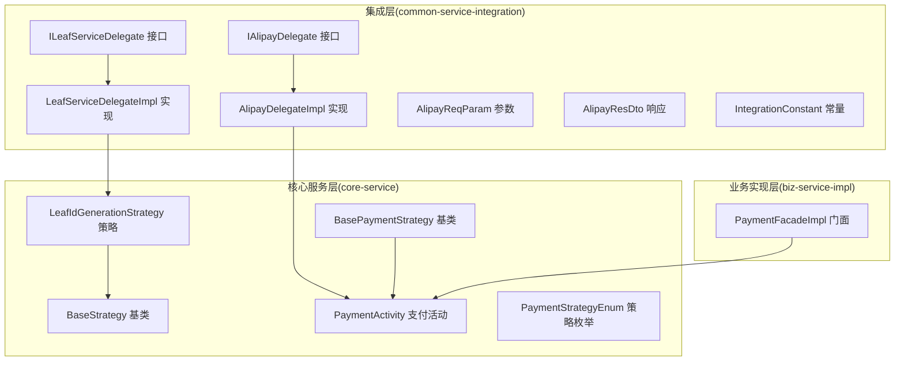
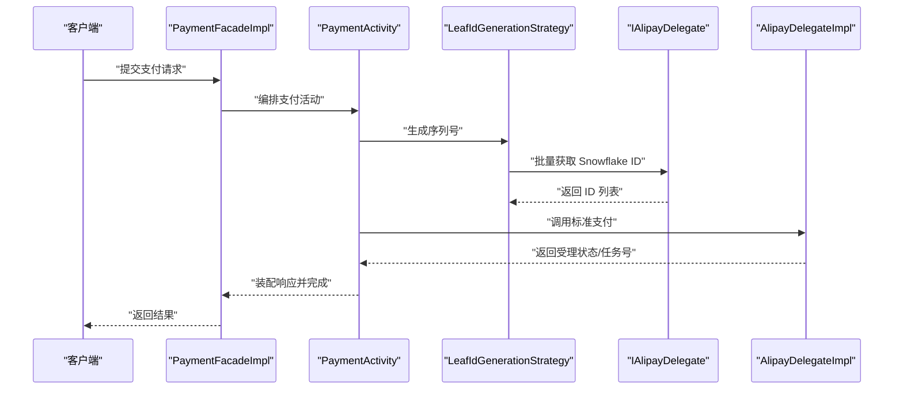
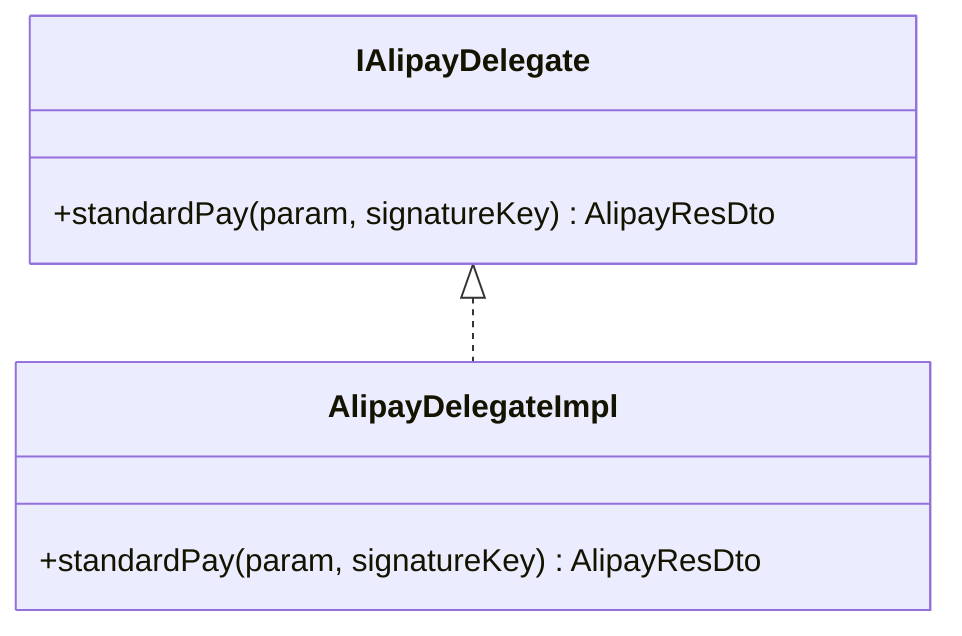
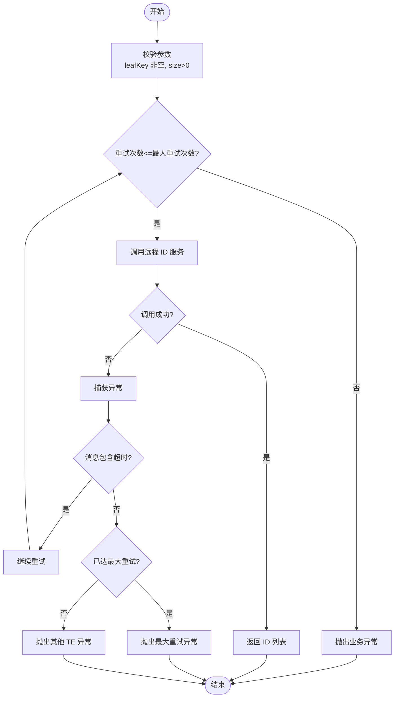
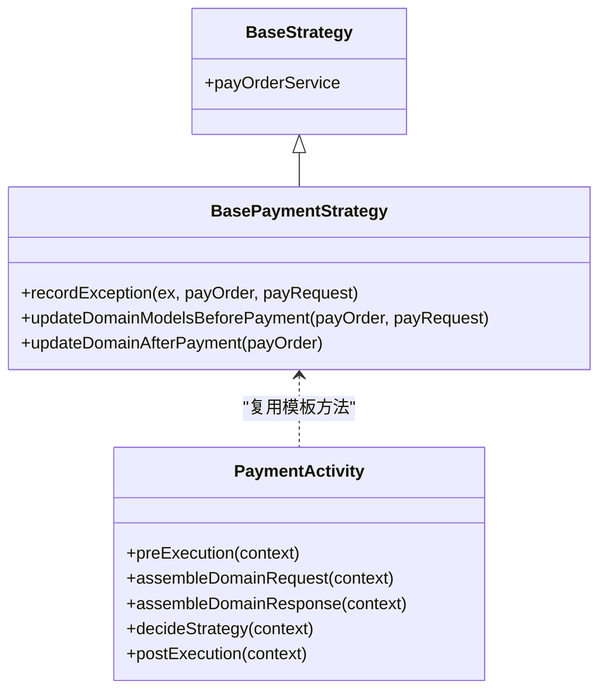
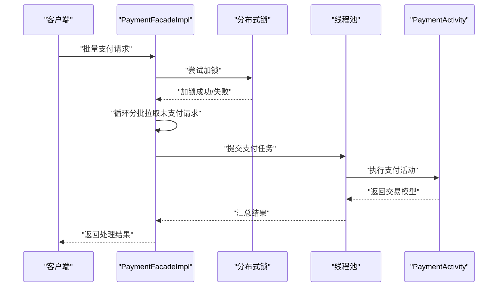
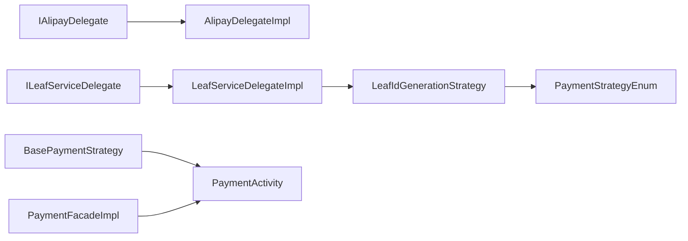

# 支付渠道集成

<cite>
**本文引用的文件**
- [IAlipayDelegate.java](file://common-service-integration/src/main/java/com/magicliang/transaction/sys/common/service/integration/delegate/alipay/IAlipayDelegate.java)
- [AlipayDelegateImpl.java](file://common-service-integration/src/main/java/com/magicliang/transaction/sys/common/service/integration/delegate/alipay/impl/AlipayDelegateImpl.java)
- [ILeafServiceDelegate.java](file://common-service-integration/src/main/java/com/magicliang/transaction/sys/common/service/integration/delegate/sequence/ILeafServiceDelegate.java)
- [LeafServiceDelegateImpl.java](file://common-service-integration/src/main/java/com/magicliang/transaction/sys/common/service/integration/delegate/sequence/impl/LeafServiceDelegateImpl.java)
- [AlipayReqParam.java](file://common-service-integration/src/main/java/com/magicliang/transaction/sys/common/service/integration/param/AlipayReqParam.java)
- [AlipayResDto.java](file://common-service-integration/src/main/java/com/magicliang/transaction/sys/common/service/integration/param/AlipayResDto.java)
- [IntegrationConstant.java](file://common-service-integration/src/main/java/com/magicliang/transaction/sys/common/service/integration/constant/IntegrationConstant.java)
- [LeafIdGenerationStrategy.java](file://core-service/src/main/java/com/magicliang/transaction/sys/core/domain/strategy/idgeneration/LeafIdGenerationStrategy.java)
- [BaseStrategy.java](file://core-service/src/main/java/com/magicliang/transaction/sys/core/domain/strategy/BaseStrategy.java)
- [BasePaymentStrategy.java](file://core-service/src/main/java/com/magicliang/transaction/sys/core/domain/strategy/payment/BasePaymentStrategy.java)
- [PaymentActivity.java](file://core-service/src/main/java/com/magicliang/transaction/sys/core/domain/activity/payment/PaymentActivity.java)
- [PaymentStrategyEnum.java](file://core-service/src/main/java/com/magicliang/transaction/sys/core/domain/enums/PaymentStrategyEnum.java)
- [PaymentFacadeImpl.java](file://biz-service-impl/src/main/java/com/magicliang/transaction/sys/biz/service/impl/facade/impl/PaymentFacadeImpl.java)
</cite>

## 目录
1. [简介](#简介)
2. [项目结构](#项目结构)
3. [核心组件](#核心组件)
4. [架构总览](#架构总览)
5. [组件详解](#组件详解)
6. [依赖关系分析](#依赖关系分析)
7. [性能考量](#性能考量)
8. [故障排查指南](#故障排查指南)
9. [结论](#结论)
10. [附录](#附录)

## 简介
本文件围绕支付渠道集成模块，系统阐述委托模式在支付通道抽象中的应用，重点解析 IAlipayDelegate 接口与 AlipayDelegateImpl 实现的设计意图与使用方式；同时深入说明序列号生成服务（Leaf）的委托接口与实现机制，以及分布式 ID 生成策略。文档还提供从配置管理、接口调用到错误处理的完整开发流程，并总结与不同支付渠道的集成差异与适配方案。

## 项目结构
支付渠道集成相关代码主要分布在以下模块：
- common-service-integration：集成层，包含支付渠道委托接口与实现、参数与响应 DTO、集成常量等
- core-service：核心服务层，包含策略、活动、领域服务等，负责编排支付流程与 ID 生成
- biz-service-impl：业务实现层，提供门面与控制器，承接外部调用并驱动核心流程

图表来源
- [IAlipayDelegate.java:1-30](file://common-service-integration/src/main/java/com/magicliang/transaction/sys/common/service/integration/delegate/alipay/IAlipayDelegate.java#L1-L30)
- [AlipayDelegateImpl.java:1-55](file://common-service-integration/src/main/java/com/magicliang/transaction/sys/common/service/integration/delegate/alipay/impl/AlipayDelegateImpl.java#L1-L55)
- [ILeafServiceDelegate.java:1-33](file://common-service-integration/src/main/java/com/magicliang/transaction/sys/common/service/integration/delegate/sequence/ILeafServiceDelegate.java#L1-L33)
- [LeafServiceDelegateImpl.java:1-108](file://common-service-integration/src/main/java/com/magicliang/transaction/sys/common/service/integration/delegate/sequence/impl/LeafServiceDelegateImpl.java#L1-L108)
- [AlipayReqParam.java:1-49](file://common-service-integration/src/main/java/com/magicliang/transaction/sys/common/service/integration/param/AlipayReqParam.java#L1-L49)
- [AlipayResDto.java:1-187](file://common-service-integration/src/main/java/com/magicliang/transaction/sys/common/service/integration/param/AlipayResDto.java#L1-L187)
- [IntegrationConstant.java:1-45](file://common-service-integration/src/main/java/com/magicliang/transaction/sys/common/service/integration/constant/IntegrationConstant.java#L1-L45)
- [LeafIdGenerationStrategy.java:1-59](file://core-service/src/main/java/com/magicliang/transaction/sys/core/domain/strategy/idgeneration/LeafIdGenerationStrategy.java#L1-L59)
- [BaseStrategy.java:1-23](file://core-service/src/main/java/com/magicliang/transaction/sys/core/domain/strategy/BaseStrategy.java#L1-L23)
- [BasePaymentStrategy.java:1-93](file://core-service/src/main/java/com/magicliang/transaction/sys/core/domain/strategy/payment/BasePaymentStrategy.java#L1-L93)
- [PaymentActivity.java:1-202](file://core-service/src/main/java/com/magicliang/transaction/sys/core/domain/activity/payment/PaymentActivity.java#L1-L202)
- [PaymentStrategyEnum.java:1-73](file://core-service/src/main/java/com/magicliang/transaction/sys/core/domain/enums/PaymentStrategyEnum.java#L1-L73)
- [PaymentFacadeImpl.java:1-166](file://biz-service-impl/src/main/java/com/magicliang/transaction/sys/biz/service/impl/facade/impl/PaymentFacadeImpl.java#L1-L166)

章节来源
- [IAlipayDelegate.java:1-30](file://common-service-integration/src/main/java/com/magicliang/transaction/sys/common/service/integration/delegate/alipay/IAlipayDelegate.java#L1-L30)
- [AlipayDelegateImpl.java:1-55](file://common-service-integration/src/main/java/com/magicliang/transaction/sys/common/service/integration/delegate/alipay/impl/AlipayDelegateImpl.java#L1-L55)
- [ILeafServiceDelegate.java:1-33](file://common-service-integration/src/main/java/com/magicliang/transaction/sys/common/service/integration/delegate/sequence/ILeafServiceDelegate.java#L1-L33)
- [LeafServiceDelegateImpl.java:1-108](file://common-service-integration/src/main/java/com/magicliang/transaction/sys/common/service/integration/delegate/sequence/impl/LeafServiceDelegateImpl.java#L1-L108)
- [AlipayReqParam.java:1-49](file://common-service-integration/src/main/java/com/magicliang/transaction/sys/common/service/integration/param/AlipayReqParam.java#L1-L49)
- [AlipayResDto.java:1-187](file://common-service-integration/src/main/java/com/magicliang/transaction/sys/common/service/integration/param/AlipayResDto.java#L1-L187)
- [IntegrationConstant.java:1-45](file://common-service-integration/src/main/java/com/magicliang/transaction/sys/common/service/integration/constant/IntegrationConstant.java#L1-L45)
- [LeafIdGenerationStrategy.java:1-59](file://core-service/src/main/java/com/magicliang/transaction/sys/core/domain/strategy/idgeneration/LeafIdGenerationStrategy.java#L1-L59)
- [BaseStrategy.java:1-23](file://core-service/src/main/java/com/magicliang/transaction/sys/core/domain/strategy/BaseStrategy.java#L1-L23)
- [BasePaymentStrategy.java:1-93](file://core-service/src/main/java/com/magicliang/transaction/sys/core/domain/strategy/payment/BasePaymentStrategy.java#L1-L93)
- [PaymentActivity.java:1-202](file://core-service/src/main/java/com/magicliang/transaction/sys/core/domain/activity/payment/PaymentActivity.java#L1-L202)
- [PaymentStrategyEnum.java:1-73](file://core-service/src/main/java/com/magicliang/transaction/sys/core/domain/enums/PaymentStrategyEnum.java#L1-L73)
- [PaymentFacadeImpl.java:1-166](file://biz-service-impl/src/main/java/com/magicliang/transaction/sys/biz/service/impl/facade/impl/PaymentFacadeImpl.java#L1-L166)

## 核心组件
- 支付宝委托接口与实现
  - IAlipayDelegate：定义标准支付能力，屏蔽具体渠道细节
  - AlipayDelegateImpl：实现标准支付流程骨架，预留参数校验、签名、远端调用与日志记录等步骤
- 序列号生成委托接口与实现
  - ILeafServiceDelegate：定义单个与批量 Snowflake ID 获取能力
  - LeafServiceDelegateImpl：实现带重试的 ID 获取逻辑，区分超时与其他异常并进行分类处理
- 参数与响应
  - AlipayReqParam：封装支付请求所需字段（如账户、金额、备注）
  - AlipayResDto：封装受理状态、任务号、错误码与错误信息，并提供构建器
- 集成常量
  - IntegrationConstant：定义编码格式与 Leaf Key 等常量
- 核心策略与活动
  - LeafIdGenerationStrategy：调用 ILeafServiceDelegate 执行 ID 批量生成
  - BaseStrategy/BasePaymentStrategy：提供基础能力与异常处理模板
  - PaymentActivity：编排支付活动，决策策略并校验响应关键字段
  - PaymentStrategyEnum：支付策略枚举（当前包含 AlipayBalance）

章节来源
- [IAlipayDelegate.java:15-29](file://common-service-integration/src/main/java/com/magicliang/transaction/sys/common/service/integration/delegate/alipay/IAlipayDelegate.java#L15-L29)
- [AlipayDelegateImpl.java:24-55](file://common-service-integration/src/main/java/com/magicliang/transaction/sys/common/service/integration/delegate/alipay/impl/AlipayDelegateImpl.java#L24-L55)
- [ILeafServiceDelegate.java:14-32](file://common-service-integration/src/main/java/com/magicliang/transaction/sys/common/service/integration/delegate/sequence/ILeafServiceDelegate.java#L14-L32)
- [LeafServiceDelegateImpl.java:25-108](file://common-service-integration/src/main/java/com/magicliang/transaction/sys/common/service/integration/delegate/sequence/impl/LeafServiceDelegateImpl.java#L25-L108)
- [AlipayReqParam.java:21-48](file://common-service-integration/src/main/java/com/magicliang/transaction/sys/common/service/integration/param/AlipayReqParam.java#L21-L48)
- [AlipayResDto.java:24-186](file://common-service-integration/src/main/java/com/magicliang/transaction/sys/common/service/integration/param/AlipayResDto.java#L24-L186)
- [IntegrationConstant.java:12-44](file://common-service-integration/src/main/java/com/magicliang/transaction/sys/common/service/integration/constant/IntegrationConstant.java#L12-L44)
- [LeafIdGenerationStrategy.java:25-58](file://core-service/src/main/java/com/magicliang/transaction/sys/core/domain/strategy/idgeneration/LeafIdGenerationStrategy.java#L25-L58)
- [BaseStrategy.java:15-22](file://core-service/src/main/java/com/magicliang/transaction/sys/core/domain/strategy/BaseStrategy.java#L15-L22)
- [BasePaymentStrategy.java:28-92](file://core-service/src/main/java/com/magicliang/transaction/sys/core/domain/strategy/payment/BasePaymentStrategy.java#L28-L92)
- [PaymentActivity.java:38-133](file://core-service/src/main/java/com/magicliang/transaction/sys/core/domain/activity/payment/PaymentActivity.java#L38-L133)
- [PaymentStrategyEnum.java:18-25](file://core-service/src/main/java/com/magicliang/transaction/sys/core/domain/enums/PaymentStrategyEnum.java#L18-L25)

## 架构总览
支付渠道集成采用“委托 + 策略 + 活动”的分层架构：
- 领域活动（PaymentActivity）负责编排与决策
- 策略（LeafIdGenerationStrategy、BasePaymentStrategy）负责具体执行与异常处理
- 委托（IAlipayDelegate、ILeafServiceDelegate）负责与外部系统交互
- 门面（PaymentFacadeImpl）对外暴露批量支付与异步支付能力

图表来源
- [PaymentFacadeImpl.java:115-147](file://biz-service-impl/src/main/java/com/magicliang/transaction/sys/biz/service/impl/facade/impl/PaymentFacadeImpl.java#L115-L147)
- [PaymentActivity.java:130-133](file://core-service/src/main/java/com/magicliang/transaction/sys/core/domain/activity/payment/PaymentActivity.java#L130-L133)
- [LeafIdGenerationStrategy.java:40-47](file://core-service/src/main/java/com/magicliang/transaction/sys/core/domain/strategy/idgeneration/LeafIdGenerationStrategy.java#L40-L47)
- [IAlipayDelegate.java:15-29](file://common-service-integration/src/main/java/com/magicliang/transaction/sys/common/service/integration/delegate/alipay/IAlipayDelegate.java#L15-L29)
- [AlipayDelegateImpl.java:40-53](file://common-service-integration/src/main/java/com/magicliang/transaction/sys/common/service/integration/delegate/alipay/impl/AlipayDelegateImpl.java#L40-L53)

## 组件详解

### 支付宝委托接口与实现（IAlipayDelegate 与 AlipayDelegateImpl）
- 设计要点
  - IAlipayDelegate 将“标准支付”抽象为统一入口，隐藏签名、回调、鉴权等跨通道共性
  - AlipayDelegateImpl 提供标准支付流程骨架：参数校验、签名构造、远端调用、日志输出与异常抛出
- 使用方法
  - 在核心策略或活动层注入 IAlipayDelegate，传入 AlipayReqParam 与签名密钥，获得 AlipayResDto
  - 对受理状态与任务号进行判读，必要时进行重试或回退
- 关键路径参考
  - [IAlipayDelegate.standardPay(...):28-28](file://common-service-integration/src/main/java/com/magicliang/transaction/sys/common/service/integration/delegate/alipay/IAlipayDelegate.java#L28-L28)
  - [AlipayDelegateImpl.standardPay(...):40-53](file://common-service-integration/src/main/java/com/magicliang/transaction/sys/common/service/integration/delegate/alipay/impl/AlipayDelegateImpl.java#L40-L53)

图表来源
- [IAlipayDelegate.java:15-29](file://common-service-integration/src/main/java/com/magicliang/transaction/sys/common/service/integration/delegate/alipay/IAlipayDelegate.java#L15-L29)
- [AlipayDelegateImpl.java:24-55](file://common-service-integration/src/main/java/com/magicliang/transaction/sys/common/service/integration/delegate/alipay/impl/AlipayDelegateImpl.java#L24-L55)

章节来源
- [IAlipayDelegate.java:15-29](file://common-service-integration/src/main/java/com/magicliang/transaction/sys/common/service/integration/delegate/alipay/IAlipayDelegate.java#L15-L29)
- [AlipayDelegateImpl.java:24-55](file://common-service-integration/src/main/java/com/magicliang/transaction/sys/common/service/integration/delegate/alipay/impl/AlipayDelegateImpl.java#L24-L55)
- [AlipayReqParam.java:21-48](file://common-service-integration/src/main/java/com/magicliang/transaction/sys/common/service/integration/param/AlipayReqParam.java#L21-L48)
- [AlipayResDto.java:24-186](file://common-service-integration/src/main/java/com/magicliang/transaction/sys/common/service/integration/param/AlipayResDto.java#L24-L186)

### 序列号生成委托接口与实现（ILeafServiceDelegate 与 LeafServiceDelegateImpl）
- 设计要点
  - ILeafServiceDelegate 提供单个与批量 Snowflake ID 获取能力
  - LeafServiceDelegateImpl 实现重试机制：对超时类异常进行“继续重试”，对其他异常按最大重试次数分类抛出
- 分布式 ID 生成策略
  - LeafIdGenerationStrategy 通过 ILeafServiceDelegate 批量获取 ID 并写入响应
  - IntegrationConstant 中定义了用于生成支付单号的 Leaf Key
- 关键路径参考
  - [ILeafServiceDelegate.nextSnowflakeId(...):22-22](file://common-service-integration/src/main/java/com/magicliang/transaction/sys/common/service/integration/delegate/sequence/ILeafServiceDelegate.java#L22-L22)
  - [ILeafServiceDelegate.getSnowflakeBatch(...):31-31](file://common-service-integration/src/main/java/com/magicliang/transaction/sys/common/service/integration/delegate/sequence/ILeafServiceDelegate.java#L31-L31)
  - [LeafServiceDelegateImpl.nextSnowflakeId(...):43-48](file://common-service-integration/src/main/java/com/magicliang/transaction/sys/common/service/integration/delegate/sequence/impl/LeafServiceDelegateImpl.java#L43-L48)
  - [LeafServiceDelegateImpl.getSnowflakeBatch(...):57-82](file://common-service-integration/src/main/java/com/magicliang/transaction/sys/common/service/integration/delegate/sequence/impl/LeafServiceDelegateImpl.java#L57-L82)
  - [LeafIdGenerationStrategy.execute(...):40-47](file://core-service/src/main/java/com/magicliang/transaction/sys/core/domain/strategy/idgeneration/LeafIdGenerationStrategy.java#L40-L47)
  - [IntegrationConstant.LEAF_KEY:22-22](file://common-service-integration/src/main/java/com/magicliang/transaction/sys/common/service/integration/constant/IntegrationConstant.java#L22-L22)

图表来源
- [LeafServiceDelegateImpl.java:57-106](file://common-service-integration/src/main/java/com/magicliang/transaction/sys/common/service/integration/delegate/sequence/impl/LeafServiceDelegateImpl.java#L57-L106)

章节来源
- [ILeafServiceDelegate.java:14-32](file://common-service-integration/src/main/java/com/magicliang/transaction/sys/common/service/integration/delegate/sequence/ILeafServiceDelegate.java#L14-L32)
- [LeafServiceDelegateImpl.java:25-108](file://common-service-integration/src/main/java/com/magicliang/transaction/sys/common/service/integration/delegate/sequence/impl/LeafServiceDelegateImpl.java#L25-L108)
- [LeafIdGenerationStrategy.java:25-58](file://core-service/src/main/java/com/magicliang/transaction/sys/core/domain/strategy/idgeneration/LeafIdGenerationStrategy.java#L25-L58)
- [IntegrationConstant.java:12-44](file://common-service-integration/src/main/java/com/magicliang/transaction/sys/common/service/integration/constant/IntegrationConstant.java#L12-L44)

### 支付活动与策略（PaymentActivity 与 BasePaymentStrategy）
- PaymentActivity
  - 决策策略：当前固定返回 AlipayBalance
  - 前置校验：支付订单、支付请求、策略有效性
  - 后置校验：校验渠道流水号，决定是否触发通知
- BasePaymentStrategy
  - 提供异常记录与领域模型更新模板：失败时保持中间态并记录异常，成功后更新支付订单与请求
- 关键路径参考
  - [PaymentActivity.decideStrategy(...):130-133](file://core-service/src/main/java/com/magicliang/transaction/sys/core/domain/activity/payment/PaymentActivity.java#L130-L133)
  - [PaymentActivity.postExecution(...):150-169](file://core-service/src/main/java/com/magicliang/transaction/sys/core/domain/activity/payment/PaymentActivity.java#L150-L169)
  - [BasePaymentStrategy.recordException(...):50-64](file://core-service/src/main/java/com/magicliang/transaction/sys/core/domain/strategy/payment/BasePaymentStrategy.java#L50-L64)
  - [BasePaymentStrategy.updateDomainModelsBeforePayment(...):82-90](file://core-service/src/main/java/com/magicliang/transaction/sys/core/domain/strategy/payment/BasePaymentStrategy.java#L82-L90)

图表来源
- [BaseStrategy.java:15-22](file://core-service/src/main/java/com/magicliang/transaction/sys/core/domain/strategy/BaseStrategy.java#L15-L22)
- [BasePaymentStrategy.java:28-92](file://core-service/src/main/java/com/magicliang/transaction/sys/core/domain/strategy/payment/BasePaymentStrategy.java#L28-L92)
- [PaymentActivity.java:38-133](file://core-service/src/main/java/com/magicliang/transaction/sys/core/domain/activity/payment/PaymentActivity.java#L38-L133)

章节来源
- [PaymentActivity.java:38-133](file://core-service/src/main/java/com/magicliang/transaction/sys/core/domain/activity/payment/PaymentActivity.java#L38-L133)
- [BasePaymentStrategy.java:28-92](file://core-service/src/main/java/com/magicliang/transaction/sys/core/domain/strategy/payment/BasePaymentStrategy.java#L28-L92)
- [PaymentStrategyEnum.java:18-25](file://core-service/src/main/java/com/magicliang/transaction/sys/core/domain/enums/PaymentStrategyEnum.java#L18-L25)

### 门面与批量处理（PaymentFacadeImpl）
- 批量支付流程
  - 估算锁超时，循环分批拉取未支付请求，加分布式锁后执行
  - 将支付订单映射为任务，使用线程池并发执行
  - 支付成功后异步触发通知
- 关键路径参考
  - [PaymentFacadeImpl.batchPay(UnPaidOrderQuery):66-93](file://biz-service-impl/src/main/java/com/magicliang/transaction/sys/biz/service/impl/facade/impl/PaymentFacadeImpl.java#L66-L93)
  - [PaymentFacadeImpl.batchPay(List):100-107](file://biz-service-impl/src/main/java/com/magicliang/transaction/sys/biz/service/impl/facade/impl/PaymentFacadeImpl.java#L100-L107)
  - [PaymentFacadeImpl.payAndNotify(...):136-147](file://biz-service-impl/src/main/java/com/magicliang/transaction/sys/biz/service/impl/facade/impl/PaymentFacadeImpl.java#L136-L147)

图表来源
- [PaymentFacadeImpl.java:66-107](file://biz-service-impl/src/main/java/com/magicliang/transaction/sys/biz/service/impl/facade/impl/PaymentFacadeImpl.java#L66-L107)

章节来源
- [PaymentFacadeImpl.java:32-166](file://biz-service-impl/src/main/java/com/magicliang/transaction/sys/biz/service/impl/facade/impl/PaymentFacadeImpl.java#L32-L166)

## 依赖关系分析
- 接口与实现
  - IAlipayDelegate ← AlipayDelegateImpl：支付通道抽象与实现分离
  - ILeafServiceDelegate ← LeafServiceDelegateImpl：ID 生成抽象与实现分离
- 策略与活动
  - LeafIdGenerationStrategy 依赖 ILeafServiceDelegate
  - PaymentActivity 依赖 PaymentStrategyEnum 并通过策略模板（BasePaymentStrategy）复用异常与模型更新逻辑
- 门面与核心
  - PaymentFacadeImpl 驱动 PaymentActivity，形成“门面 → 活动 → 策略/委托”的调用链

图表来源
- [IAlipayDelegate.java:15-29](file://common-service-integration/src/main/java/com/magicliang/transaction/sys/common/service/integration/delegate/alipay/IAlipayDelegate.java#L15-L29)
- [AlipayDelegateImpl.java:24-55](file://common-service-integration/src/main/java/com/magicliang/transaction/sys/common/service/integration/delegate/alipay/impl/AlipayDelegateImpl.java#L24-L55)
- [ILeafServiceDelegate.java:14-32](file://common-service-integration/src/main/java/com/magicliang/transaction/sys/common/service/integration/delegate/sequence/ILeafServiceDelegate.java#L14-L32)
- [LeafServiceDelegateImpl.java:25-108](file://common-service-integration/src/main/java/com/magicliang/transaction/sys/common/service/integration/delegate/sequence/impl/LeafServiceDelegateImpl.java#L25-L108)
- [LeafIdGenerationStrategy.java:25-58](file://core-service/src/main/java/com/magicliang/transaction/sys/core/domain/strategy/idgeneration/LeafIdGenerationStrategy.java#L25-L58)
- [BasePaymentStrategy.java:28-92](file://core-service/src/main/java/com/magicliang/transaction/sys/core/domain/strategy/payment/BasePaymentStrategy.java#L28-L92)
- [PaymentActivity.java:38-133](file://core-service/src/main/java/com/magicliang/transaction/sys/core/domain/activity/payment/PaymentActivity.java#L38-L133)
- [PaymentStrategyEnum.java:18-25](file://core-service/src/main/java/com/magicliang/transaction/sys/core/domain/enums/PaymentStrategyEnum.java#L18-L25)
- [PaymentFacadeImpl.java:32-166](file://biz-service-impl/src/main/java/com/magicliang/transaction/sys/biz/service/impl/facade/impl/PaymentFacadeImpl.java#L32-L166)

章节来源
- [LeafIdGenerationStrategy.java:25-58](file://core-service/src/main/java/com/magicliang/transaction/sys/core/domain/strategy/idgeneration/LeafIdGenerationStrategy.java#L25-L58)
- [PaymentActivity.java:38-133](file://core-service/src/main/java/com/magicliang/transaction/sys/core/domain/activity/payment/PaymentActivity.java#L38-L133)
- [PaymentFacadeImpl.java:32-166](file://biz-service-impl/src/main/java/com/magicliang/transaction/sys/biz/service/impl/facade/impl/PaymentFacadeImpl.java#L32-L166)

## 性能考量
- 批量支付吞吐
  - 门面中给出单线程每秒约 7 笔支付的估算，结合数据库写入耗时，指导线程池规模与锁超时设置
- 重试与超时
  - ID 生成委托对“超时”类异常采取继续重试策略，避免因瞬时网络抖动导致失败
- 并发与锁
  - 批量支付采用分布式锁保护，循环分批拉取与执行，降低长事务风险

章节来源
- [PaymentFacadeImpl.java:37-93](file://biz-service-impl/src/main/java/com/magicliang/transaction/sys/biz/service/impl/facade/impl/PaymentFacadeImpl.java#L37-L93)
- [LeafServiceDelegateImpl.java:90-106](file://common-service-integration/src/main/java/com/magicliang/transaction/sys/common/service/integration/delegate/sequence/impl/LeafServiceDelegateImpl.java#L90-L106)

## 故障排查指南
- 支付受理状态与任务号
  - 使用 AlipayResDto 的状态与任务号进行判读，若状态为失败需检查错误码与错误信息
  - 参考路径：[AlipayResDto 字段与构建器:24-186](file://common-service-integration/src/main/java/com/magicliang/transaction/sys/common/service/integration/param/AlipayResDto.java#L24-L186)
- 异常分类与重试
  - ID 生成异常按“超时”“最大重试”“其他 TE”三类处理，优先确认是否为超时并允许继续重试
  - 参考路径：[LeafServiceDelegateImpl.throwException(...):90-106](file://common-service-integration/src/main/java/com/magicliang/transaction/sys/common/service/integration/delegate/sequence/impl/LeafServiceDelegateImpl.java#L90-L106)
- 支付活动后置校验
  - 若渠道流水号为空，活动会抛出无效流水号异常，需检查上游调用与下游返回
  - 参考路径：[PaymentActivity.postExecution(...):150-169](file://core-service/src/main/java/com/magicliang/transaction/sys/core/domain/activity/payment/PaymentActivity.java#L150-L169)
- 异常记录与模型更新
  - 支付策略基类提供异常记录模板，确保失败时订单与请求状态正确迁移
  - 参考路径：[BasePaymentStrategy.recordException(...):50-64](file://core-service/src/main/java/com/magicliang/transaction/sys/core/domain/strategy/payment/BasePaymentStrategy.java#L50-L64)

章节来源
- [AlipayResDto.java:24-186](file://common-service-integration/src/main/java/com/magicliang/transaction/sys/common/service/integration/param/AlipayResDto.java#L24-L186)
- [LeafServiceDelegateImpl.java:90-106](file://common-service-integration/src/main/java/com/magicliang/transaction/sys/common/service/integration/delegate/sequence/impl/LeafServiceDelegateImpl.java#L90-L106)
- [PaymentActivity.java:150-169](file://core-service/src/main/java/com/magicliang/transaction/sys/core/domain/activity/payment/PaymentActivity.java#L150-L169)
- [BasePaymentStrategy.java:50-64](file://core-service/src/main/java/com/magicliang/transaction/sys/core/domain/strategy/payment/BasePaymentStrategy.java#L50-L64)

## 结论
本支付渠道集成模块通过委托接口与实现分离、策略与活动编排、以及门面的批量处理能力，实现了支付通道的统一抽象与可扩展。序列号生成采用带重试的分布式 ID 生成策略，保障高并发下的稳定性。整体架构清晰、职责分明，便于后续扩展更多支付渠道与增强容错能力。

## 附录
- 开发流程建议
  - 配置管理：在 IntegrationConstant 中维护渠道常量与 Key，确保各环境一致
  - 接口调用：通过 IAlipayDelegate 标准化调用，统一参数校验与日志记录
  - 错误处理：遵循策略基类模板，对异常进行分类与幂等处理
  - 扩展支付渠道：新增 IAlipayDelegate 实现，保持与现有活动与策略的兼容
- 与不同支付渠道的集成差异与适配
  - 差异点：签名算法、回调地址、错误码语义、受理状态含义
  - 适配方案：在委托实现中封装差异化逻辑，保持接口不变；通过策略枚举与活动决策扩展新渠道