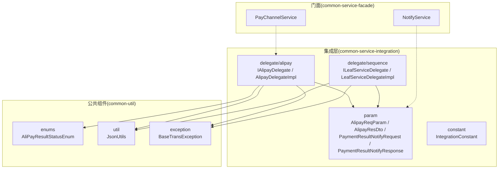
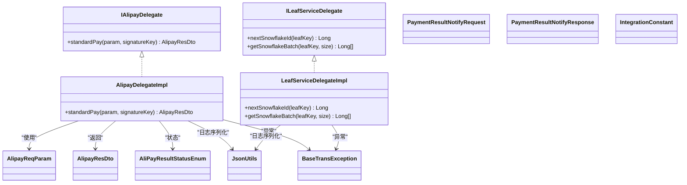
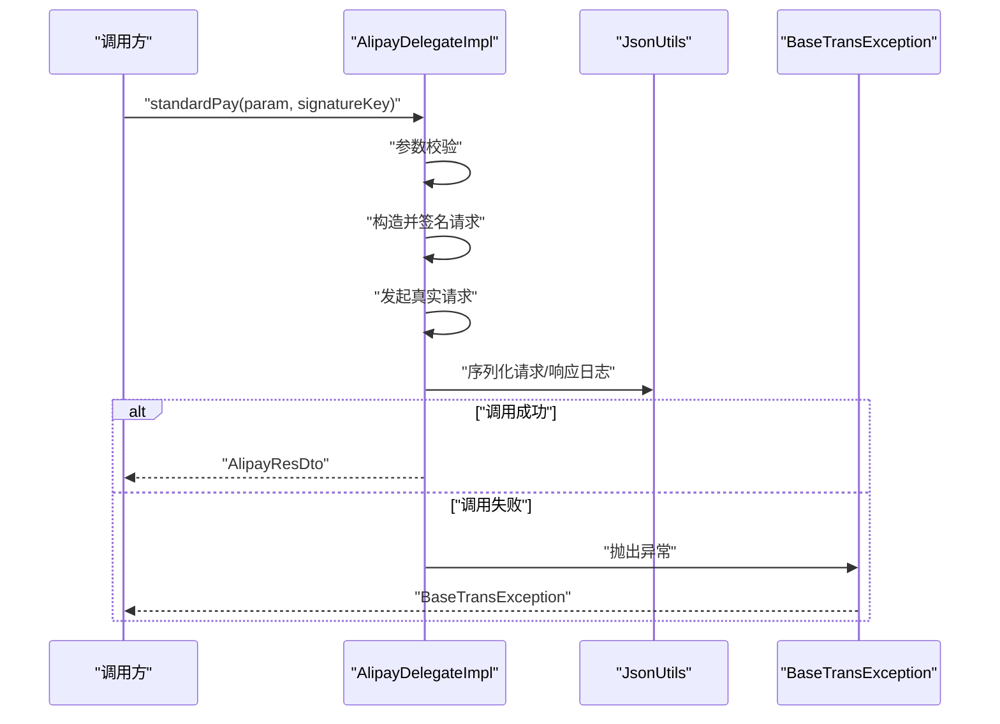
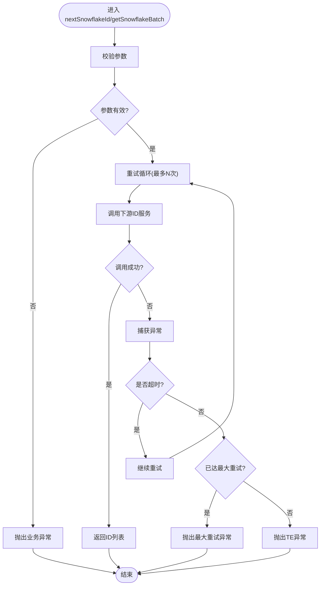
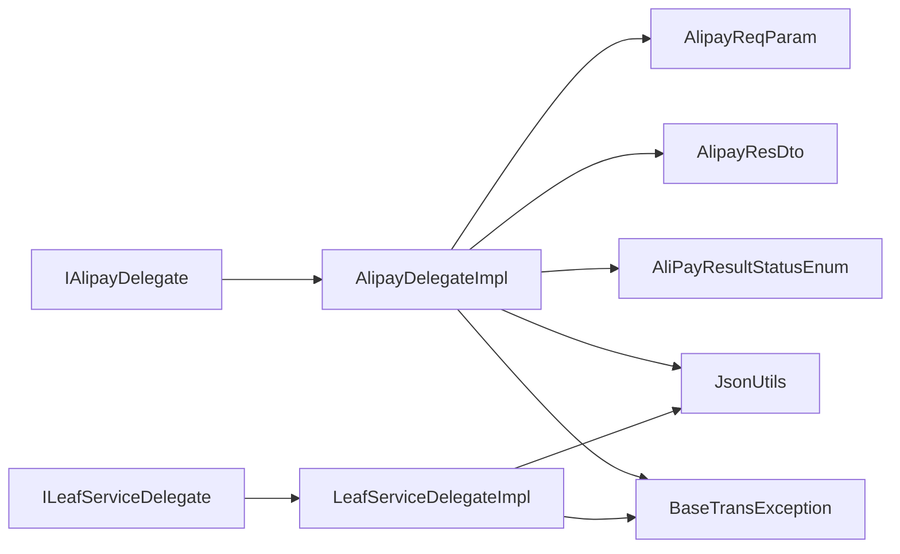

# 服务集成层

<cite>
**本文引用的文件**
- [AlipayDelegateImpl.java](file://common-service-integration/src/main/java/com/magicliang/transaction/sys/common/service/integration/delegate/alipay/impl/AlipayDelegateImpl.java)
- [IAlipayDelegate.java](file://common-service-integration/src/main/java/com/magicliang/transaction/sys/common/service/integration/delegate/alipay/IAlipayDelegate.java)
- [ILeafServiceDelegate.java](file://common-service-integration/src/main/java/com/magicliang/transaction/sys/common/service/integration/delegate/sequence/ILeafServiceDelegate.java)
- [LeafServiceDelegateImpl.java](file://common-service-integration/src/main/java/com/magicliang/transaction/sys/common/service/integration/delegate/sequence/impl/LeafServiceDelegateImpl.java)
- [AlipayReqParam.java](file://common-service-integration/src/main/java/com/magicliang/transaction/sys/common/service/integration/param/AlipayReqParam.java)
- [AlipayResDto.java](file://common-service-integration/src/main/java/com/magicliang/transaction/sys/common/service/integration/param/AlipayResDto.java)
- [PaymentResultNotifyRequest.java](file://common-service-integration/src/main/java/com/magicliang/transaction/sys/common/service/integration/param/PaymentResultNotifyRequest.java)
- [PaymentResultNotifyResponse.java](file://common-service-integration/src/main/java/com/magicliang/transaction/sys/common/service/integration/param/PaymentResultNotifyResponse.java)
- [IntegrationConstant.java](file://common-service-integration/src/main/java/com/magicliang/transaction/sys/common/service/integration/constant/IntegrationConstant.java)
- [AliPayResultStatusEnum.java](file://common-util/src/main/java/com/magicliang/transaction/sys/common/enums/AliPayResultStatusEnum.java)
- [JsonUtils.java](file://common-util/src/main/java/com/magicliang/transaction/sys/common/util/JsonUtils.java)
- [BaseTransException.java](file://common-util/src/main/java/com/magicliang/transaction/sys/common/exception/BaseTransException.java)
- [PayChannelService.java](file://common-service-facade/src/main/java/com/magicliang/transaction/sys/common/service/facade/PayChannelService.java)
- [NotifyService.java](file://common-service-facade/src/main/java/com/magicliang/transaction/sys/common/service/facade/NotifyService.java)
</cite>

## 目录
1. [引言](#引言)
2. [项目结构](#项目结构)
3. [核心组件](#核心组件)
4. [架构总览](#架构总览)
5. [详细组件分析](#详细组件分析)
6. [依赖分析](#依赖分析)
7. [性能考量](#性能考量)
8. [故障排查指南](#故障排查指南)
9. [结论](#结论)
10. [附录](#附录)

## 引言
本文件聚焦于 common-service-integration 模块，系统性阐述其作为第三方系统集成“桥接层”的职责与实现方式，覆盖支付渠道集成、通知处理、参数封装等关键能力。重点解析委托模式在支付渠道抽象与切换中的应用，梳理集成参数模型（如 AlipayReqParam、PaymentResultNotifyRequest）的定义与使用边界，并说明与第三方系统的通信协议要点（请求签名、响应解析、错误处理）。最后给出集成开发的最佳实践，包括配置管理、安全控制、监控告警等运维建议。

## 项目结构
common-service-integration 模块采用按职责分层的组织方式：
- delegate：对外部系统能力的委托抽象与实现，当前包含支付宝委托与顺序号（雪花 ID）委托两类
- param：面向第三方系统的请求/响应参数与 DTO
- constant：集成层常量定义
- 与之协作的公共组件来自 common-util（枚举、工具、异常）、common-service-facade（门面接口）

图表来源
- [AlipayDelegateImpl.java:1-55](file://common-service-integration/src/main/java/com/magicliang/transaction/sys/common/service/integration/delegate/alipay/impl/AlipayDelegateImpl.java#L1-L55)
- [IAlipayDelegate.java:1-30](file://common-service-integration/src/main/java/com/magicliang/transaction/sys/common/service/integration/delegate/alipay/IAlipayDelegate.java#L1-L30)
- [ILeafServiceDelegate.java:1-33](file://common-service-integration/src/main/java/com/magicliang/transaction/sys/common/service/integration/delegate/sequence/ILeafServiceDelegate.java#L1-L33)
- [LeafServiceDelegateImpl.java:1-108](file://common-service-integration/src/main/java/com/magicliang/transaction/sys/common/service/integration/delegate/sequence/impl/LeafServiceDelegateImpl.java#L1-L108)
- [AlipayReqParam.java:1-49](file://common-service-integration/src/main/java/com/magicliang/transaction/sys/common/service/integration/param/AlipayReqParam.java#L1-L49)
- [AlipayResDto.java:1-187](file://common-service-integration/src/main/java/com/magicliang/transaction/sys/common/service/integration/param/AlipayResDto.java#L1-L187)
- [PaymentResultNotifyRequest.java:1-55](file://common-service-integration/src/main/java/com/magicliang/transaction/sys/common/service/integration/param/PaymentResultNotifyRequest.java#L1-L55)
- [PaymentResultNotifyResponse.java:1-142](file://common-service-integration/src/main/java/com/magicliang/transaction/sys/common/service/integration/param/PaymentResultNotifyResponse.java#L1-L142)
- [IntegrationConstant.java:1-45](file://common-service-integration/src/main/java/com/magicliang/transaction/sys/common/service/integration/constant/IntegrationConstant.java#L1-L45)
- [AliPayResultStatusEnum.java:1-62](file://common-util/src/main/java/com/magicliang/transaction/sys/common/enums/AliPayResultStatusEnum.java#L1-L62)
- [JsonUtils.java:1-293](file://common-util/src/main/java/com/magicliang/transaction/sys/common/util/JsonUtils.java#L1-L293)
- [BaseTransException.java:1-125](file://common-util/src/main/java/com/magicliang/transaction/sys/common/exception/BaseTransException.java#L1-L125)
- [PayChannelService.java:1-15](file://common-service-facade/src/main/java/com/magicliang/transaction/sys/common/service/facade/PayChannelService.java#L1-L15)
- [NotifyService.java:1-16](file://common-service-facade/src/main/java/com/magicliang/transaction/sys/common/service/facade/NotifyService.java#L1-L16)

章节来源
- [AlipayDelegateImpl.java:1-55](file://common-service-integration/src/main/java/com/magicliang/transaction/sys/common/service/integration/delegate/alipay/impl/AlipayDelegateImpl.java#L1-L55)
- [IAlipayDelegate.java:1-30](file://common-service-integration/src/main/java/com/magicliang/transaction/sys/common/service/integration/delegate/alipay/IAlipayDelegate.java#L1-L30)
- [ILeafServiceDelegate.java:1-33](file://common-service-integration/src/main/java/com/magicliang/transaction/sys/common/service/integration/delegate/sequence/ILeafServiceDelegate.java#L1-L33)
- [LeafServiceDelegateImpl.java:1-108](file://common-service-integration/src/main/java/com/magicliang/transaction/sys/common/service/integration/delegate/sequence/impl/LeafServiceDelegateImpl.java#L1-L108)
- [AlipayReqParam.java:1-49](file://common-service-integration/src/main/java/com/magicliang/transaction/sys/common/service/integration/param/AlipayReqParam.java#L1-L49)
- [AlipayResDto.java:1-187](file://common-service-integration/src/main/java/com/magicliang/transaction/sys/common/service/integration/param/AlipayResDto.java#L1-L187)
- [PaymentResultNotifyRequest.java:1-55](file://common-service-integration/src/main/java/com/magicliang/transaction/sys/common/service/integration/param/PaymentResultNotifyRequest.java#L1-L55)
- [PaymentResultNotifyResponse.java:1-142](file://common-service-integration/src/main/java/com/magicliang/transaction/sys/common/service/integration/param/PaymentResultNotifyResponse.java#L1-L142)
- [IntegrationConstant.java:1-45](file://common-service-integration/src/main/java/com/magicliang/transaction/sys/common/service/integration/constant/IntegrationConstant.java#L1-L45)
- [AliPayResultStatusEnum.java:1-62](file://common-util/src/main/java/com/magicliang/transaction/sys/common/enums/AliPayResultStatusEnum.java#L1-L62)
- [JsonUtils.java:1-293](file://common-util/src/main/java/com/magicliang/transaction/sys/common/util/JsonUtils.java#L1-L293)
- [BaseTransException.java:1-125](file://common-util/src/main/java/com/magicliang/transaction/sys/common/exception/BaseTransException.java#L1-L125)
- [PayChannelService.java:1-15](file://common-service-facade/src/main/java/com/magicliang/transaction/sys/common/service/facade/PayChannelService.java#L1-L15)
- [NotifyService.java:1-16](file://common-service-facade/src/main/java/com/magicliang/transaction/sys/common/service/facade/NotifyService.java#L1-L16)

## 核心组件
- 支付宝委托接口与实现：IAlipayDelegate 定义标准支付入口；AlipayDelegateImpl 提供委托实现骨架，负责参数校验、签名、请求构造与日志记录等流程占位
- 顺序号委托接口与实现：ILeafServiceDelegate 定义雪花 ID 获取能力；LeafServiceDelegateImpl 提供单条与批量 ID 获取、重试与异常转换逻辑
- 参数与 DTO：AlipayReqParam、AlipayResDto、PaymentResultNotifyRequest、PaymentResultNotifyResponse 统一请求/响应契约
- 常量：IntegrationConstant 提供编码、Leaf Key 等常量
- 枚举与工具：AliPayResultStatusEnum 表示受理状态；JsonUtils 提供 JSON 序列化/反序列化；BaseTransException 提供统一异常模型
- 门面接口：PayChannelService、NotifyService 作为上层调用的门面契约

章节来源
- [IAlipayDelegate.java:1-30](file://common-service-integration/src/main/java/com/magicliang/transaction/sys/common/service/integration/delegate/alipay/IAlipayDelegate.java#L1-L30)
- [AlipayDelegateImpl.java:1-55](file://common-service-integration/src/main/java/com/magicliang/transaction/sys/common/service/integration/delegate/alipay/impl/AlipayDelegateImpl.java#L1-L55)
- [ILeafServiceDelegate.java:1-33](file://common-service-integration/src/main/java/com/magicliang/transaction/sys/common/service/integration/delegate/sequence/ILeafServiceDelegate.java#L1-L33)
- [LeafServiceDelegateImpl.java:1-108](file://common-service-integration/src/main/java/com/magicliang/transaction/sys/common/service/integration/delegate/sequence/impl/LeafServiceDelegateImpl.java#L1-L108)
- [AlipayReqParam.java:1-49](file://common-service-integration/src/main/java/com/magicliang/transaction/sys/common/service/integration/param/AlipayReqParam.java#L1-L49)
- [AlipayResDto.java:1-187](file://common-service-integration/src/main/java/com/magicliang/transaction/sys/common/service/integration/param/AlipayResDto.java#L1-L187)
- [PaymentResultNotifyRequest.java:1-55](file://common-service-integration/src/main/java/com/magicliang/transaction/sys/common/service/integration/param/PaymentResultNotifyRequest.java#L1-L55)
- [PaymentResultNotifyResponse.java:1-142](file://common-service-integration/src/main/java/com/magicliang/transaction/sys/common/service/integration/param/PaymentResultNotifyResponse.java#L1-L142)
- [IntegrationConstant.java:1-45](file://common-service-integration/src/main/java/com/magicliang/transaction/sys/common/service/integration/constant/IntegrationConstant.java#L1-L45)
- [AliPayResultStatusEnum.java:1-62](file://common-util/src/main/java/com/magicliang/transaction/sys/common/enums/AliPayResultStatusEnum.java#L1-L62)
- [JsonUtils.java:1-293](file://common-util/src/main/java/com/magicliang/transaction/sys/common/util/JsonUtils.java#L1-L293)
- [BaseTransException.java:1-125](file://common-util/src/main/java/com/magicliang/transaction/sys/common/exception/BaseTransException.java#L1-L125)
- [PayChannelService.java:1-15](file://common-service-facade/src/main/java/com/magicliang/transaction/sys/common/service/facade/PayChannelService.java#L1-L15)
- [NotifyService.java:1-16](file://common-service-facade/src/main/java/com/magicliang/transaction/sys/common/service/facade/NotifyService.java#L1-L16)

## 架构总览
集成层通过委托接口向上屏蔽第三方差异，向下对接具体外部系统。支付场景由 IAlipayDelegate 抽象，AlipayDelegateImpl 实现；ID 场景由 ILeafServiceDelegate 抽象，LeafServiceDelegateImpl 实现。参数与 DTO 作为契约贯穿请求/响应链路；异常与工具提供一致的错误处理与序列化能力；门面接口为上层业务提供稳定调用面。

图表来源
- [IAlipayDelegate.java:1-30](file://common-service-integration/src/main/java/com/magicliang/transaction/sys/common/service/integration/delegate/alipay/IAlipayDelegate.java#L1-L30)
- [AlipayDelegateImpl.java:1-55](file://common-service-integration/src/main/java/com/magicliang/transaction/sys/common/service/integration/delegate/alipay/impl/AlipayDelegateImpl.java#L1-L55)
- [ILeafServiceDelegate.java:1-33](file://common-service-integration/src/main/java/com/magicliang/transaction/sys/common/service/integration/delegate/sequence/ILeafServiceDelegate.java#L1-L33)
- [LeafServiceDelegateImpl.java:1-108](file://common-service-integration/src/main/java/com/magicliang/transaction/sys/common/service/integration/delegate/sequence/impl/LeafServiceDelegateImpl.java#L1-L108)
- [AlipayReqParam.java:1-49](file://common-service-integration/src/main/java/com/magicliang/transaction/sys/common/service/integration/param/AlipayReqParam.java#L1-L49)
- [AlipayResDto.java:1-187](file://common-service-integration/src/main/java/com/magicliang/transaction/sys/common/service/integration/param/AlipayResDto.java#L1-L187)
- [PaymentResultNotifyRequest.java:1-55](file://common-service-integration/src/main/java/com/magicliang/transaction/sys/common/service/integration/param/PaymentResultNotifyRequest.java#L1-L55)
- [PaymentResultNotifyResponse.java:1-142](file://common-service-integration/src/main/java/com/magicliang/transaction/sys/common/service/integration/param/PaymentResultNotifyResponse.java#L1-L142)
- [AliPayResultStatusEnum.java:1-62](file://common-util/src/main/java/com/magicliang/transaction/sys/common/enums/AliPayResultStatusEnum.java#L1-L62)
- [JsonUtils.java:1-293](file://common-util/src/main/java/com/magicliang/transaction/sys/common/util/JsonUtils.java#L1-L293)
- [BaseTransException.java:1-125](file://common-util/src/main/java/com/magicliang/transaction/sys/common/exception/BaseTransException.java#L1-L125)

## 详细组件分析

### 支付宝委托：IAlipayDelegate 与 AlipayDelegateImpl
- 设计意图：通过接口抽象支付能力，使上层业务不直接依赖具体第三方 SDK 或网络细节，便于替换与扩展
- 关键方法：standardPay(AlipayReqParam, String) 返回 AlipayResDto
- 实现要点：
  - 参数校验：使用断言工具确保输入合法
  - 请求构造与签名：预留签名与请求组装位置
  - 真实调用：占位实现，待接入第三方支付网关
  - 日志记录：使用 JsonUtils 输出请求与响应上下文
  - 异常处理：统一抛出 BaseTransException，携带错误码与消息

图表来源
- [AlipayDelegateImpl.java:40-53](file://common-service-integration/src/main/java/com/magicliang/transaction/sys/common/service/integration/delegate/alipay/impl/AlipayDelegateImpl.java#L40-L53)
- [JsonUtils.java:143-145](file://common-util/src/main/java/com/magicliang/transaction/sys/common/util/JsonUtils.java#L143-L145)
- [BaseTransException.java:102-123](file://common-util/src/main/java/com/magicliang/transaction/sys/common/exception/BaseTransException.java#L102-L123)

章节来源
- [IAlipayDelegate.java:15-28](file://common-service-integration/src/main/java/com/magicliang/transaction/sys/common/service/integration/delegate/alipay/IAlipayDelegate.java#L15-L28)
- [AlipayDelegateImpl.java:24-53](file://common-service-integration/src/main/java/com/magicliang/transaction/sys/common/service/integration/delegate/alipay/impl/AlipayDelegateImpl.java#L24-L53)

### 顺序号委托：ILeafServiceDelegate 与 LeafServiceDelegateImpl
- 设计意图：为分布式场景提供全局唯一递增 ID（雪花 ID），支持单条与批量获取
- 关键方法：nextSnowflakeId、getSnowflakeBatch
- 实现要点：
  - 参数校验：确保 leafKey 与批量大小合法
  - 重试机制：固定最大重试次数，区分超时与其他异常
  - 异常转换：将底层异常映射为统一错误码与消息
  - 日志记录：使用 JsonUtils 输出上下文

图表来源
- [LeafServiceDelegateImpl.java:44-106](file://common-service-integration/src/main/java/com/magicliang/transaction/sys/common/service/integration/delegate/sequence/impl/LeafServiceDelegateImpl.java#L44-L106)

章节来源
- [ILeafServiceDelegate.java:14-31](file://common-service-integration/src/main/java/com/magicliang/transaction/sys/common/service/integration/delegate/sequence/ILeafServiceDelegate.java#L14-L31)
- [LeafServiceDelegateImpl.java:25-106](file://common-service-integration/src/main/java/com/magicliang/transaction/sys/common/service/integration/delegate/sequence/impl/LeafServiceDelegateImpl.java#L25-L106)

### 参数与 DTO：AlipayReqParam、AlipayResDto、PaymentResultNotifyRequest、PaymentResultNotifyResponse
- AlipayReqParam：封装支付发起所需的关键字段，如出资账户、进款账户、金额（分）、备注等；注释强调金额使用字符串规避浮点风险
- AlipayResDto：封装受理状态、任务 ID、错误码与错误信息；提供静态建造器用于快速构建成功/失败结果
- PaymentResultNotifyRequest：封装第三方回调请求的关键字段，如业务主键、上游系统编号、业务标识码、业务唯一号、是否成功、错误码与错误信息
- PaymentResultNotifyResponse：封装回调响应的成功标志与错误信息，提供建造器

章节来源
- [AlipayReqParam.java:21-48](file://common-service-integration/src/main/java/com/magicliang/transaction/sys/common/service/integration/param/AlipayReqParam.java#L21-L48)
- [AlipayResDto.java:24-186](file://common-service-integration/src/main/java/com/magicliang/transaction/sys/common/service/integration/param/AlipayResDto.java#L24-L186)
- [PaymentResultNotifyRequest.java:16-54](file://common-service-integration/src/main/java/com/magicliang/transaction/sys/common/service/integration/param/PaymentResultNotifyRequest.java#L16-L54)
- [PaymentResultNotifyResponse.java:14-141](file://common-service-integration/src/main/java/com/magicliang/transaction/sys/common/service/integration/param/PaymentResultNotifyResponse.java#L14-L141)

### 常量与枚举
- IntegrationConstant：提供 UTF8 编码常量、Leaf Key 等
- AliPayResultStatusEnum：定义受理状态（成功/失败），并提供按状态码查询枚举的方法

章节来源
- [IntegrationConstant.java:12-44](file://common-service-integration/src/main/java/com/magicliang/transaction/sys/common/service/integration/constant/IntegrationConstant.java#L12-L44)
- [AliPayResultStatusEnum.java:18-61](file://common-util/src/main/java/com/magicliang/transaction/sys/common/enums/AliPayResultStatusEnum.java#L18-L61)

### 与门面接口的关系
- PayChannelService、NotifyService 作为门面契约，集成层通过委托实现具体能力，保持上层调用的稳定性与一致性

章节来源
- [PayChannelService.java:12-14](file://common-service-facade/src/main/java/com/magicliang/transaction/sys/common/service/facade/PayChannelService.java#L12-L14)
- [NotifyService.java:13-15](file://common-service-facade/src/main/java/com/magicliang/transaction/sys/common/service/facade/NotifyService.java#L13-L15)

## 依赖分析
- 内聚性：各委托实现与其参数/DTO耦合紧密，职责清晰
- 耦合度：委托接口向上屏蔽第三方差异；与公共工具（JsonUtils）、异常（BaseTransException）存在横切依赖
- 外部依赖：未在源码中显式引入第三方 SDK，通过占位实现预留接入点
- 循环依赖：未发现循环依赖迹象

图表来源
- [IAlipayDelegate.java:1-30](file://common-service-integration/src/main/java/com/magicliang/transaction/sys/common/service/integration/delegate/alipay/IAlipayDelegate.java#L1-L30)
- [AlipayDelegateImpl.java:1-55](file://common-service-integration/src/main/java/com/magicliang/transaction/sys/common/service/integration/delegate/alipay/impl/AlipayDelegateImpl.java#L1-L55)
- [ILeafServiceDelegate.java:1-33](file://common-service-integration/src/main/java/com/magicliang/transaction/sys/common/service/integration/delegate/sequence/ILeafServiceDelegate.java#L1-L33)
- [LeafServiceDelegateImpl.java:1-108](file://common-service-integration/src/main/java/com/magicliang/transaction/sys/common/service/integration/delegate/sequence/impl/LeafServiceDelegateImpl.java#L1-L108)
- [AlipayReqParam.java:1-49](file://common-service-integration/src/main/java/com/magicliang/transaction/sys/common/service/integration/param/AlipayReqParam.java#L1-L49)
- [AlipayResDto.java:1-187](file://common-service-integration/src/main/java/com/magicliang/transaction/sys/common/service/integration/param/AlipayResDto.java#L1-L187)
- [AliPayResultStatusEnum.java:1-62](file://common-util/src/main/java/com/magicliang/transaction/sys/common/enums/AliPayResultStatusEnum.java#L1-L62)
- [JsonUtils.java:1-293](file://common-util/src/main/java/com/magicliang/transaction/sys/common/util/JsonUtils.java#L1-L293)
- [BaseTransException.java:1-125](file://common-util/src/main/java/com/magicliang/transaction/sys/common/exception/BaseTransException.java#L1-L125)

## 性能考量
- JSON 序列化：JsonUtils 提供多种 ObjectMapper 实例与缓存策略，建议在日志输出场景优先使用 NON_EMPTY 策略，减少无效字段传输
- 重试策略：LeafServiceDelegateImpl 的固定重试次数与超时识别有助于提升可用性，需结合下游 SLA 调整重试上限与退避策略
- DTO 构建：AlipayResDto/ PaymentResultNotifyResponse 的建造器模式可降低对象构造成本，避免频繁反射初始化

## 故障排查指南
- 支付回调处理
  - 输入校验：确认 PaymentResultNotifyRequest 的关键字段（业务主键、系统编号、业务标识码、唯一号）完整
  - 状态判断：依据受理状态与错误码决定是否重试或记录失败
  - 日志定位：利用 JsonUtils 输出请求/响应上下文，配合异常堆栈快速定位问题
- ID 生成异常
  - 参数校验：确保 leafKey 非空、批量大小为正
  - 重试判定：区分超时与 TE 异常，分别走继续重试或抛出最大重试异常路径
  - 异常映射：根据错误码与消息定位具体原因
- 统一异常模型
  - BaseTransException 提供错误码、消息与可重试标记，便于上层统一处理与监控

章节来源
- [PaymentResultNotifyRequest.java:16-54](file://common-service-integration/src/main/java/com/magicliang/transaction/sys/common/service/integration/param/PaymentResultNotifyRequest.java#L16-L54)
- [AlipayResDto.java:24-186](file://common-service-integration/src/main/java/com/magicliang/transaction/sys/common/service/integration/param/AlipayResDto.java#L24-L186)
- [LeafServiceDelegateImpl.java:58-106](file://common-service-integration/src/main/java/com/magicliang/transaction/sys/common/service/integration/delegate/sequence/impl/LeafServiceDelegateImpl.java#L58-L106)
- [BaseTransException.java:21-123](file://common-util/src/main/java/com/magicliang/transaction/sys/common/exception/BaseTransException.java#L21-L123)

## 结论
common-service-integration 通过委托模式实现了对第三方系统的抽象与隔离，参数与 DTO 明确了请求/响应契约，配合统一异常与工具类提升了可维护性与可观测性。当前实现以占位为主，后续应补充第三方支付网关接入、回调签名验证、ID 服务对接与完善的重试/熔断策略，以满足生产级要求。

## 附录
- 集成开发最佳实践
  - 配置管理：集中管理下游地址、密钥、超时等参数，支持环境隔离与动态更新
  - 安全控制：请求签名与回调验签、敏感字段脱敏、访问鉴权
  - 监控告警：埋点关键指标（成功率、耗时、重试次数）、异常分级告警
  - 文档与契约：参数与 DTO 的变更需同步更新接口文档与版本管理