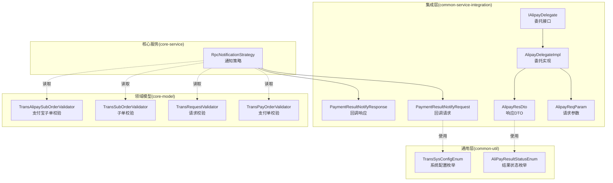
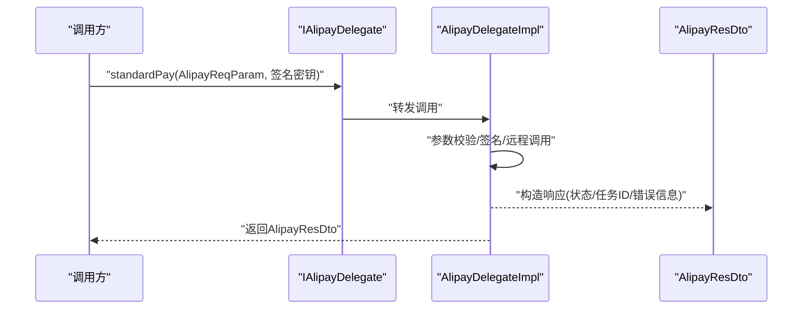
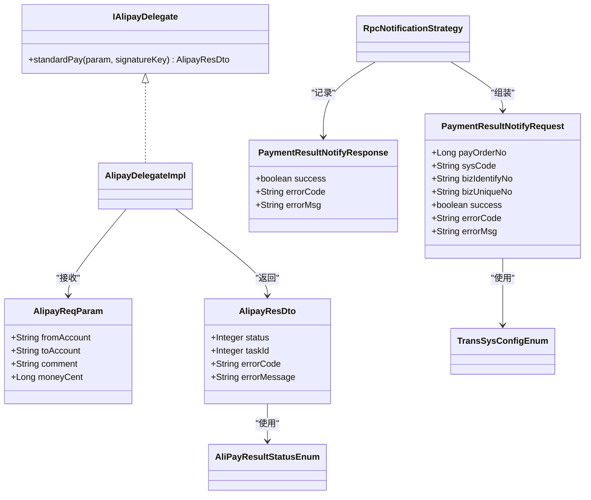

# 集成参数封装

<cite>
**本文引用的文件**
- [AlipayReqParam.java](file://common-service-integration/src/main/java/com/magicliang/transaction/sys/common/service/integration/param/AlipayReqParam.java)
- [AlipayResDto.java](file://common-service-integration/src/main/java/com/magicliang/transaction/sys/common/service/integration/param/AlipayResDto.java)
- [PaymentResultNotifyRequest.java](file://common-service-integration/src/main/java/com/magicliang/transaction/sys/common/service/integration/param/PaymentResultNotifyRequest.java)
- [PaymentResultNotifyResponse.java](file://common-service-integration/src/main/java/com/magicliang/transaction/sys/common/service/integration/param/PaymentResultNotifyResponse.java)
- [IAlipayDelegate.java](file://common-service-integration/src/main/java/com/magicliang/transaction/sys/common/service/integration/delegate/alipay/IAlipayDelegate.java)
- [AlipayDelegateImpl.java](file://common-service-integration/src/main/java/com/magicliang/transaction/sys/common/service/integration/delegate/alipay/impl/AlipayDelegateImpl.java)
- [RpcNotificationStrategy.java](file://core-service/src/main/java/com/magicliang/transaction/sys/core/domain/strategy/notification/RpcNotificationStrategy.java)
- [AliPayResultStatusEnum.java](file://common-util/src/main/java/com/magicliang/transaction/sys/common/enums/AliPayResultStatusEnum.java)
- [TransSysConfigEnum.java](file://common-util/src/main/java/com/magicliang/transaction/sys/common/enums/TransSysConfigEnum.java)
- [TransPayOrderValidator.java](file://core-model/src/main/java/com/magicliang/transaction/sys/core/model/entity/validator/TransPayOrderValidator.java)
- [TransRequestValidator.java](file://core-model/src/main/java/com/magicliang/transaction/sys/core/model/entity/validator/TransRequestValidator.java)
- [TransSubOrderValidator.java](file://core-model/src/main/java/com/magicliang/transaction/sys/core/model/entity/validator/TransSubOrderValidator.java)
- [TransAlipaySubOrderValidator.java](file://core-model/src/main/java/com/magicliang/transaction/sys/core/model/entity/validator/TransAlipaySubOrderValidator.java)
</cite>

## 目录
1. [简介](#简介)
2. [项目结构](#项目结构)
3. [核心组件](#核心组件)
4. [架构总览](#架构总览)
5. [组件详解](#组件详解)
6. [依赖关系分析](#依赖关系分析)
7. [性能考量](#性能考量)
8. [故障排查指南](#故障排查指南)
9. [结论](#结论)
10. [附录](#附录)

## 简介
本章节面向“集成参数封装”主题，聚焦于以下参数类的设计与使用：AlipayReqParam（支付宝请求参数）、AlipayResDto（支付宝响应DTO）、PaymentResultNotifyRequest（支付结果回调请求）与 PaymentResultNotifyResponse（支付结果回调响应）。文档旨在说明统一参数模型如何降低第三方系统对接复杂度，提升一致性、可维护性与可测试性；并给出字段定义、数据类型、验证规则与使用场景，以及参数传递的最佳实践（参数校验、数据转换、异常处理等）。

## 项目结构
围绕参数封装的相关模块分布如下：
- common-service-integration：集成层参数与委托接口，包含参数类与对外委托接口
- common-util：通用工具与枚举，提供状态码、系统编码等基础能力
- core-service：核心服务层，包含通知策略与领域模型交互
- core-model：领域模型与校验器，确保业务实体的完整性与一致性

图表来源
- [AlipayReqParam.java:1-49](file://common-service-integration/src/main/java/com/magicliang/transaction/sys/common/service/integration/param/AlipayReqParam.java#L1-L49)
- [AlipayResDto.java:1-187](file://common-service-integration/src/main/java/com/magicliang/transaction/sys/common/service/integration/param/AlipayResDto.java#L1-L187)
- [PaymentResultNotifyRequest.java:1-55](file://common-service-integration/src/main/java/com/magicliang/transaction/sys/common/service/integration/param/PaymentResultNotifyRequest.java#L1-L55)
- [PaymentResultNotifyResponse.java:1-142](file://common-service-integration/src/main/java/com/magicliang/transaction/sys/common/service/integration/param/PaymentResultNotifyResponse.java#L1-L142)
- [IAlipayDelegate.java:1-29](file://common-service-integration/src/main/java/com/magicliang/transaction/sys/common/service/integration/delegate/alipay/IAlipayDelegate.java#L1-L29)
- [AlipayDelegateImpl.java:1-55](file://common-service-integration/src/main/java/com/magicliang/transaction/sys/common/service/integration/delegate/alipay/impl/AlipayDelegateImpl.java#L1-L55)
- [RpcNotificationStrategy.java:98-241](file://core-service/src/main/java/com/magicliang/transaction/sys/core/domain/strategy/notification/RpcNotificationStrategy.java#L98-L241)
- [AliPayResultStatusEnum.java:1-62](file://common-util/src/main/java/com/magicliang/transaction/sys/common/enums/AliPayResultStatusEnum.java#L1-L62)
- [TransSysConfigEnum.java:1-83](file://common-util/src/main/java/com/magicliang/transaction/sys/common/enums/TransSysConfigEnum.java#L1-L83)
- [TransPayOrderValidator.java:1-37](file://core-model/src/main/java/com/magicliang/transaction/sys/core/model/entity/validator/TransPayOrderValidator.java#L1-L37)
- [TransRequestValidator.java:1-42](file://core-model/src/main/java/com/magicliang/transaction/sys/core/model/entity/validator/TransRequestValidator.java#L1-L42)
- [TransSubOrderValidator.java:1-43](file://core-model/src/main/java/com/magicliang/transaction/sys/core/model/entity/validator/TransSubOrderValidator.java#L1-L43)
- [TransAlipaySubOrderValidator.java:1-36](file://core-model/src/main/java/com/magicliang/transaction/sys/core/model/entity/validator/TransAlipaySubOrderValidator.java#L1-L36)

章节来源
- [AlipayReqParam.java:1-49](file://common-service-integration/src/main/java/com/magicliang/transaction/sys/common/service/integration/param/AlipayReqParam.java#L1-L49)
- [AlipayResDto.java:1-187](file://common-service-integration/src/main/java/com/magicliang/transaction/sys/common/service/integration/param/AlipayResDto.java#L1-L187)
- [PaymentResultNotifyRequest.java:1-55](file://common-service-integration/src/main/java/com/magicliang/transaction/sys/common/service/integration/param/PaymentResultNotifyRequest.java#L1-L55)
- [PaymentResultNotifyResponse.java:1-142](file://common-service-integration/src/main/java/com/magicliang/transaction/sys/common/service/integration/param/PaymentResultNotifyResponse.java#L1-L142)
- [IAlipayDelegate.java:1-29](file://common-service-integration/src/main/java/com/magicliang/transaction/sys/common/service/integration/delegate/alipay/IAlipayDelegate.java#L1-L29)
- [AlipayDelegateImpl.java:1-55](file://common-service-integration/src/main/java/com/magicliang/transaction/sys/common/service/integration/delegate/alipay/impl/AlipayDelegateImpl.java#L1-L55)
- [RpcNotificationStrategy.java:98-241](file://core-service/src/main/java/com/magicliang/transaction/sys/core/domain/strategy/notification/RpcNotificationStrategy.java#L98-L241)
- [AliPayResultStatusEnum.java:1-62](file://common-util/src/main/java/com/magicliang/transaction/sys/common/enums/AliPayResultStatusEnum.java#L1-L62)
- [TransSysConfigEnum.java:1-83](file://common-util/src/main/java/com/magicliang/transaction/sys/common/enums/TransSysConfigEnum.java#L1-L83)
- [TransPayOrderValidator.java:1-37](file://core-model/src/main/java/com/magicliang/transaction/sys/core/model/entity/validator/TransPayOrderValidator.java#L1-L37)
- [TransRequestValidator.java:1-42](file://core-model/src/main/java/com/magicliang/transaction/sys/core/model/entity/validator/TransRequestValidator.java#L1-L42)
- [TransSubOrderValidator.java:1-43](file://core-model/src/main/java/com/magicliang/transaction/sys/core/model/entity/validator/TransSubOrderValidator.java#L1-L43)
- [TransAlipaySubOrderValidator.java:1-36](file://core-model/src/main/java/com/magicliang/transaction/sys/core/model/entity/validator/TransAlipaySubOrderValidator.java#L1-L36)

## 核心组件
本节对四个关键参数类进行深入解析，涵盖字段定义、数据类型、验证规则与使用场景，并结合委托接口与通知策略展示其在实际流程中的作用。

- AlipayReqParam（支付宝请求参数）
  - 字段与类型：fromAccount（字符串）、toAccount（字符串）、comment（字符串）、moneyCent（长整型，单位分）
  - 设计要点：金额采用“分”为单位并以Long存储，避免浮点精度问题；Builder注解便于构造
  - 使用场景：作为标准支付调用的输入参数，传入委托实现进行签名与远程调用
  - 章节来源
    - [AlipayReqParam.java:21-48](file://common-service-integration/src/main/java/com/magicliang/transaction/sys/common/service/integration/param/AlipayReqParam.java#L21-L48)

- AlipayResDto（支付宝响应DTO）
  - 字段与类型：status（整型，参考AliPayResultStatusEnum）、taskId（整型）、errorCode（字符串）、errorMessage（字符串）
  - 设计要点：提供静态构建器方法，支持成功/失败两种快速构造；内部Builder用于控制不可变性与Jackson兼容
  - 使用场景：封装第三方支付平台返回的受理状态、任务ID及错误信息
  - 章节来源
    - [AlipayResDto.java:24-186](file://common-service-integration/src/main/java/com/magicliang/transaction/sys/common/service/integration/param/AlipayResDto.java#L24-L186)
    - [AliPayResultStatusEnum.java:18-30](file://common-util/src/main/java/com/magicliang/transaction/sys/common/enums/AliPayResultStatusEnum.java#L18-L30)

- PaymentResultNotifyRequest（支付结果回调请求）
  - 字段与类型：payOrderNo（长整型）、sysCode（字符串，参考TransSysConfigEnum）、bizIdentifyNo（字符串）、bizUniqueNo（字符串）、success（布尔）、errorCode（字符串）、errorMsg（字符串）
  - 设计要点：承载上游系统回调所需的关键业务标识与结果状态；与系统配置枚举绑定，保证来源系统的规范性
  - 使用场景：核心服务在通知阶段组装回调请求，下发给上游系统
  - 章节来源
    - [PaymentResultNotifyRequest.java:16-54](file://common-service-integration/src/main/java/com/magicliang/transaction/sys/common/service/integration/param/PaymentResultNotifyRequest.java#L16-L54)
    - [TransSysConfigEnum.java:18-35](file://common-util/src/main/java/com/magicliang/transaction/sys/common/enums/TransSysConfigEnum.java#L18-L35)

- PaymentResultNotifyResponse（支付结果回调响应）
  - 字段与类型：success（布尔）、errorCode（字符串）、errorMsg（字符串）
  - 设计要点：提供静态构建器方法，支持快速构造成功/失败响应；内部Builder用于不可变对象构建
  - 使用场景：核心服务在通知阶段记录回调结果并更新领域模型状态
  - 章节来源
    - [PaymentResultNotifyResponse.java:15-141](file://common-service-integration/src/main/java/com/magicliang/transaction/sys/common/service/integration/param/PaymentResultNotifyResponse.java#L15-L141)

## 架构总览
下图展示了参数封装在整体架构中的位置与流转关系：集成层负责参数模型与对外委托；核心服务层负责业务编排与通知策略；通用层提供枚举与工具；领域模型层提供校验器保障数据完整性。

图表来源
- [IAlipayDelegate.java:15-28](file://common-service-integration/src/main/java/com/magicliang/transaction/sys/common/service/integration/delegate/alipay/IAlipayDelegate.java#L15-L28)
- [AlipayDelegateImpl.java:40-53](file://common-service-integration/src/main/java/com/magicliang/transaction/sys/common/service/integration/delegate/alipay/impl/AlipayDelegateImpl.java#L40-L53)
- [AlipayResDto.java:110-131](file://common-service-integration/src/main/java/com/magicliang/transaction/sys/common/service/integration/param/AlipayResDto.java#L110-L131)

章节来源
- [IAlipayDelegate.java:1-29](file://common-service-integration/src/main/java/com/magicliang/transaction/sys/common/service/integration/delegate/alipay/IAlipayDelegate.java#L1-L29)
- [AlipayDelegateImpl.java:1-55](file://common-service-integration/src/main/java/com/magicliang/transaction/sys/common/service/integration/delegate/alipay/impl/AlipayDelegateImpl.java#L1-L55)
- [AlipayResDto.java:1-187](file://common-service-integration/src/main/java/com/magicliang/transaction/sys/common/service/integration/param/AlipayResDto.java#L1-L187)

## 组件详解

### 支付宝请求参数 AlipayReqParam
- 设计目标：统一第三方支付请求的输入模型，屏蔽底层差异，便于校验与序列化
- 关键字段说明
  - fromAccount：出资账户（字符串），用于标识付款方
  - toAccount：进款账户（字符串），用于标识收款方
  - comment：支付备注（字符串），用于附加说明
  - moneyCent：付款金额（长整型，单位分），避免浮点误差
- 数据类型与约束
  - fromAccount/toAccount/comment：字符串，建议长度限制与字符集校验
  - moneyCent：正整数，范围建议在1至40亿之间（对应1-40万元）
- 使用场景
  - 作为标准支付调用的输入参数，配合签名与远程调用
- 最佳实践
  - 参数校验：使用断言工具确保非空与范围合法
  - 数据转换：金额统一以“分”为单位，避免小数点运算
  - 异常处理：捕获转换异常并映射为业务异常

章节来源
- [AlipayReqParam.java:21-48](file://common-service-integration/src/main/java/com/magicliang/transaction/sys/common/service/integration/param/AlipayReqParam.java#L21-L48)

### 支付宝响应 DTO AlipayResDto
- 设计目标：标准化第三方支付平台返回的受理状态与错误信息
- 关键字段说明
  - status：受理状态（整型），参考AliPayResultStatusEnum
  - taskId：任务ID（整型），仅在受理成功时出现
  - errorCode/errorMessage：错误码与错误信息（字符串），仅在受理失败时出现
- 构造方式
  - 提供静态构建器方法：buildSuccessResult、buildFailureResult
  - 内部Builder用于不可变对象构建，兼顾Jackson序列化需求
- 使用场景
  - 将第三方返回封装为统一对象，便于后续处理与日志记录
- 最佳实践
  - 状态判断：先判断status再读取taskId或错误信息
  - 错误处理：根据错误码决定是否重试或终止流程

章节来源
- [AlipayResDto.java:24-186](file://common-service-integration/src/main/java/com/magicliang/transaction/sys/common/service/integration/param/AlipayResDto.java#L24-L186)
- [AliPayResultStatusEnum.java:18-30](file://common-util/src/main/java/com/magicliang/transaction/sys/common/enums/AliPayResultStatusEnum.java#L18-L30)

### 支付结果回调请求 PaymentResultNotifyRequest
- 设计目标：统一上游系统回调所需的业务标识与结果状态
- 关键字段说明
  - payOrderNo：支付订单号（长整型），全局唯一
  - sysCode：来源系统编码（字符串），参考TransSysConfigEnum
  - bizIdentifyNo/bizUniqueNo：业务标识码与唯一编号（字符串），联合保证全局唯一
  - success：是否成功（布尔）
  - errorCode/errorMsg：错误码与错误信息（字符串）
- 使用场景
  - 核心服务在通知阶段组装回调请求，下发给上游系统
- 最佳实践
  - 唯一性：确保bizIdentifyNo与bizUniqueNo组合的全局唯一
  - 来源校验：sysCode需匹配系统配置枚举，避免非法来源

章节来源
- [PaymentResultNotifyRequest.java:16-54](file://common-service-integration/src/main/java/com/magicliang/transaction/sys/common/service/integration/param/PaymentResultNotifyRequest.java#L16-L54)
- [TransSysConfigEnum.java:18-35](file://common-util/src/main/java/com/magicliang/transaction/sys/common/enums/TransSysConfigEnum.java#L18-L35)

### 支付结果回调响应 PaymentResultNotifyResponse
- 设计目标：标准化上游系统回调后的响应结果
- 关键字段说明
  - success：是否成功（布尔）
  - errorCode/errorMsg：错误码与错误信息（字符串）
- 构造方式
  - 提供静态构建器方法：buildSuccessResult、buildFailureResult
  - 内部Builder用于不可变对象构建
- 使用场景
  - 核心服务在通知阶段记录回调结果并更新领域模型状态
- 最佳实践
  - 成功/失败分支：根据success决定状态更新策略
  - 日志记录：将响应序列化后存入领域模型，便于审计与重试

章节来源
- [PaymentResultNotifyResponse.java:15-141](file://common-service-integration/src/main/java/com/magicliang/transaction/sys/common/service/integration/param/PaymentResultNotifyResponse.java#L15-L141)

### 参数封装与业务逻辑分离
- 设计原则
  - 参数类仅承载数据与简单工厂/构建器，不包含业务逻辑
  - 业务逻辑集中在核心服务层（如通知策略），通过参数类进行数据传递
- 可维护性
  - 参数类稳定不变，业务变化通过策略与处理器扩展
- 可测试性
  - 参数类可独立单元测试；业务逻辑通过参数类注入进行测试

章节来源
- [RpcNotificationStrategy.java:98-241](file://core-service/src/main/java/com/magicliang/transaction/sys/core/domain/strategy/notification/RpcNotificationStrategy.java#L98-L241)

## 依赖关系分析
- 参数类之间的依赖
  - AlipayResDto依赖AliPayResultStatusEnum进行状态映射
  - PaymentResultNotifyRequest依赖TransSysConfigEnum进行系统来源校验
- 参数类与委托接口的关系
  - IAlipayDelegate定义标准支付方法，AlipayDelegateImpl实现具体逻辑
- 参数类与领域模型校验器的关系
  - 核心服务在组装回调请求时读取领域模型，校验器保障实体完整性

图表来源
- [AlipayReqParam.java:21-48](file://common-service-integration/src/main/java/com/magicliang/transaction/sys/common/service/integration/param/AlipayReqParam.java#L21-L48)
- [AlipayResDto.java:24-186](file://common-service-integration/src/main/java/com/magicliang/transaction/sys/common/service/integration/param/AlipayResDto.java#L24-L186)
- [PaymentResultNotifyRequest.java:16-54](file://common-service-integration/src/main/java/com/magicliang/transaction/sys/common/service/integration/param/PaymentResultNotifyRequest.java#L16-L54)
- [PaymentResultNotifyResponse.java:15-141](file://common-service-integration/src/main/java/com/magicliang/transaction/sys/common/service/integration/param/PaymentResultNotifyResponse.java#L15-L141)
- [IAlipayDelegate.java:15-28](file://common-service-integration/src/main/java/com/magicliang/transaction/sys/common/service/integration/delegate/alipay/IAlipayDelegate.java#L15-L28)
- [AlipayDelegateImpl.java:40-53](file://common-service-integration/src/main/java/com/magicliang/transaction/sys/common/service/integration/delegate/alipay/impl/AlipayDelegateImpl.java#L40-L53)
- [RpcNotificationStrategy.java:98-241](file://core-service/src/main/java/com/magicliang/transaction/sys/core/domain/strategy/notification/RpcNotificationStrategy.java#L98-L241)
- [AliPayResultStatusEnum.java:18-30](file://common-util/src/main/java/com/magicliang/transaction/sys/common/enums/AliPayResultStatusEnum.java#L18-L30)
- [TransSysConfigEnum.java:18-35](file://common-util/src/main/java/com/magicliang/transaction/sys/common/enums/TransSysConfigEnum.java#L18-L35)

章节来源
- [IAlipayDelegate.java:1-29](file://common-service-integration/src/main/java/com/magicliang/transaction/sys/common/service/integration/delegate/alipay/IAlipayDelegate.java#L1-L29)
- [AlipayDelegateImpl.java:1-55](file://common-service-integration/src/main/java/com/magicliang/transaction/sys/common/service/integration/delegate/alipay/impl/AlipayDelegateImpl.java#L1-L55)
- [RpcNotificationStrategy.java:98-241](file://core-service/src/main/java/com/magicliang/transaction/sys/core/domain/strategy/notification/RpcNotificationStrategy.java#L98-L241)
- [AliPayResultStatusEnum.java:1-62](file://common-util/src/main/java/com/magicliang/transaction/sys/common/enums/AliPayResultStatusEnum.java#L1-L62)
- [TransSysConfigEnum.java:1-83](file://common-util/src/main/java/com/magicliang/transaction/sys/common/enums/TransSysConfigEnum.java#L1-L83)

## 性能考量
- 参数封装的性能开销
  - 参数类为轻量数据载体，构造与序列化成本低
  - 建议在委托实现与核心服务层避免重复构造，复用已有的参数对象
- 通知阶段的性能
  - 通知策略按请求优先级排序，批量发送时注意线程池与队列容量
  - 对于高并发场景，建议结合分布式锁与弹性计算吞吐量，避免资源争用

## 故障排查指南
- 参数校验失败
  - 支付订单/请求/子单校验器提供断言保护，若出现无效参数，应检查字段非空与枚举映射
  - 章节来源
    - [TransPayOrderValidator.java:33-37](file://core-model/src/main/java/com/magicliang/transaction/sys/core/model/entity/validator/TransPayOrderValidator.java#L33-L37)
    - [TransRequestValidator.java:32-41](file://core-model/src/main/java/com/magicliang/transaction/sys/core/model/entity/validator/TransRequestValidator.java#L32-L41)
    - [TransSubOrderValidator.java:32-42](file://core-model/src/main/java/com/magicliang/transaction/sys/core/model/entity/validator/TransSubOrderValidator.java#L32-L42)
    - [TransAlipaySubOrderValidator.java:31-35](file://core-model/src/main/java/com/magicliang/transaction/sys/core/model/entity/validator/TransAlipaySubOrderValidator.java#L31-L35)
- 回调请求组装异常
  - 核心服务在组装回调请求时依赖领域模型状态，若状态不一致会导致错误码与消息异常
  - 章节来源
    - [RpcNotificationStrategy.java:131-182](file://core-service/src/main/java/com/magicliang/transaction/sys/core/domain/strategy/notification/RpcNotificationStrategy.java#L131-L182)
- 响应记录与异常处理
  - 通知策略在记录响应与异常时会更新领域模型状态与时间戳，若异常未正确记录，需检查异常捕获与序列化
  - 章节来源
    - [RpcNotificationStrategy.java:206-241](file://core-service/src/main/java/com/magicliang/transaction/sys/core/domain/strategy/notification/RpcNotificationStrategy.java#L206-L241)

## 结论
通过统一的参数封装模型，系统实现了第三方支付与通知的标准化与解耦：参数类承担数据载体职责，委托接口与核心服务承载业务编排，通用枚举与校验器保障一致性与可靠性。该设计提升了可维护性与可测试性，降低了对接复杂度与风险。

## 附录
- 参数传递最佳实践清单
  - 参数校验：在进入委托实现与核心服务前进行断言校验
  - 数据转换：金额统一为“分”，避免浮点误差
  - 异常处理：捕获并映射为业务异常，保留上下文信息
  - 不可变性：优先使用Builder或构造器，减少可变状态带来的副作用
  - 序列化：确保与JSON库兼容，必要时提供无参构造器