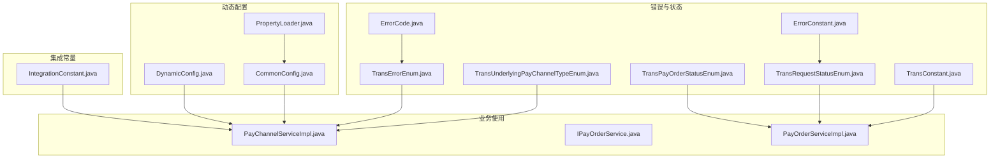
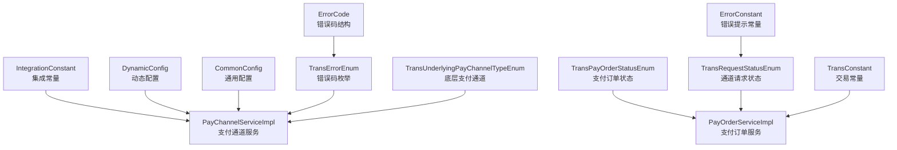
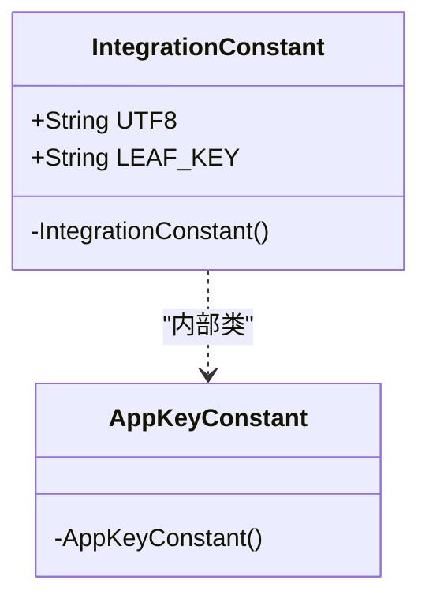
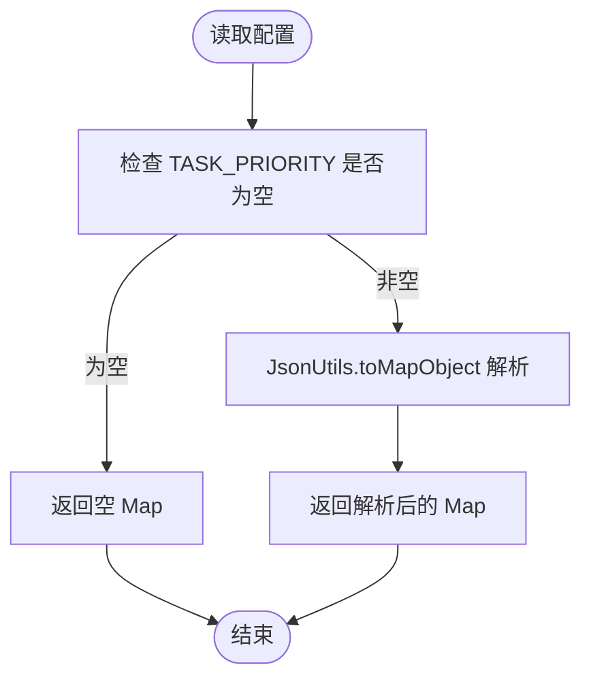
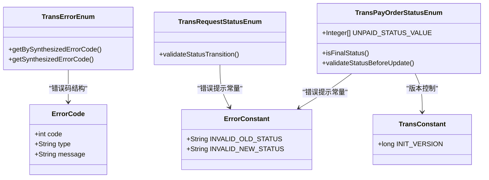
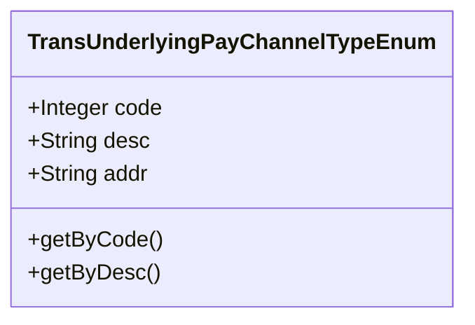
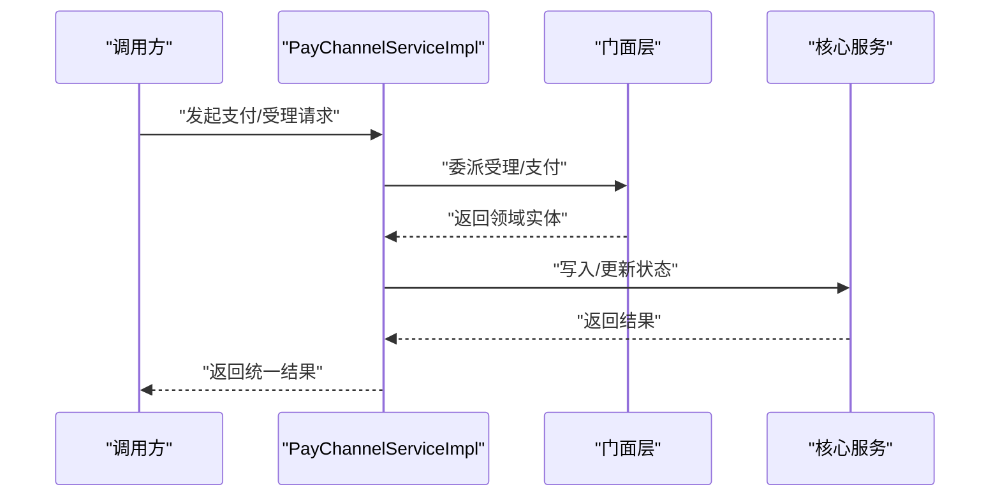
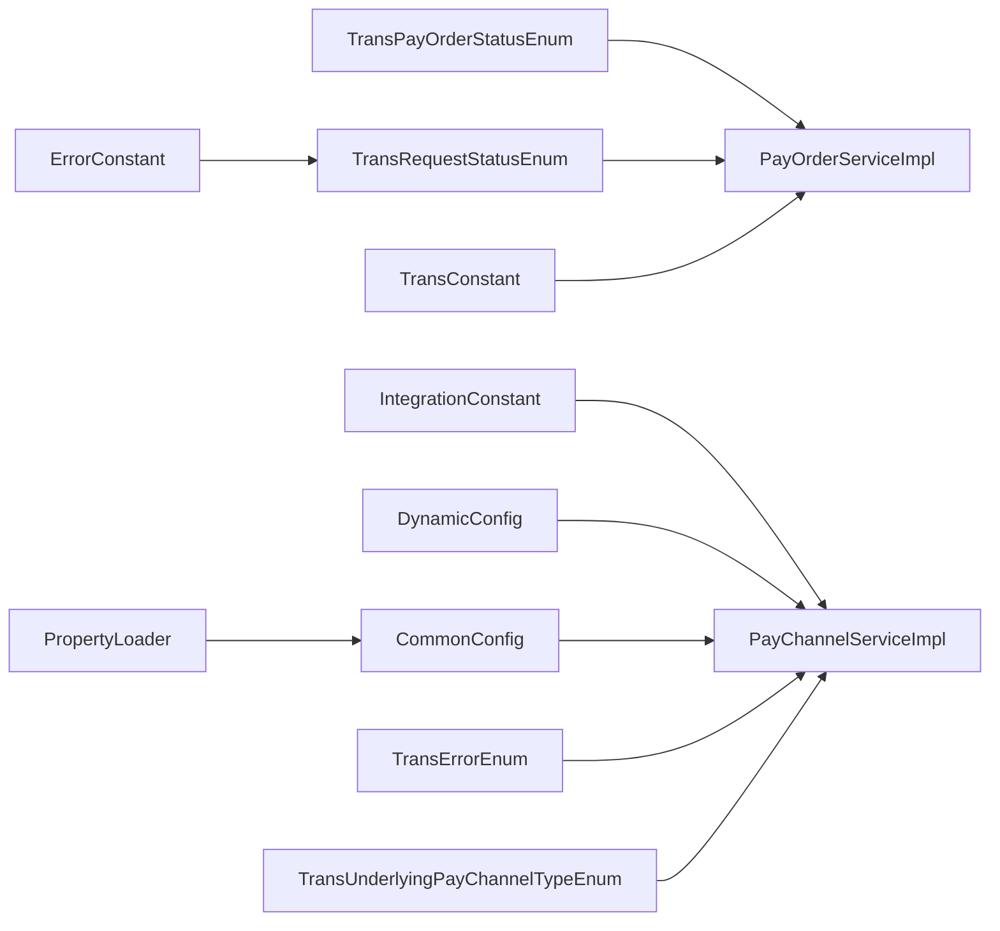

# 集成常量定义

<cite>
**本文引用的文件**
- [IntegrationConstant.java](file://common-service-integration/src/main/java/com/magicliang/transaction/sys/common/service/integration/constant/IntegrationConstant.java)
- [DynamicConfig.java](file://core-service/src/main/java/com/magicliang/transaction/sys/core/config/DynamicConfig.java)
- [CommonConfig.java](file://core-service/src/main/java/com/magicliang/transaction/sys/core/config/CommonConfig.java)
- [TransErrorEnum.java](file://common-util/src/main/java/com/magicliang/transaction/sys/common/enums/TransErrorEnum.java)
- [TransPayOrderStatusEnum.java](file://common-util/src/main/java/com/magicliang/transaction/sys/common/enums/TransPayOrderStatusEnum.java)
- [TransRequestStatusEnum.java](file://common-util/src/main/java/com/magicliang/transaction/sys/common/enums/TransRequestStatusEnum.java)
- [TransUnderlyingPayChannelTypeEnum.java](file://common-util/src/main/java/com/magicliang/transaction/sys/common/enums/TransUnderlyingPayChannelTypeEnum.java)
- [ErrorCode.java](file://common-util/src/main/java/com/magicliang/transaction/sys/common/constant/ErrorCode.java)
- [ErrorConstant.java](file://common-util/src/main/java/com/magicliang/transaction/sys/common/constant/ErrorConstant.java)
- [TransConstant.java](file://common-util/src/main/java/com/magicliang/transaction/sys/common/constant/TransConstant.java)
- [PayChannelServiceImpl.java](file://biz-service-impl/src/main/java/com/magicliang/transaction/sys/biz/service/impl/rpc/PayChannelServiceImpl.java)
- [IPayOrderService.java](file://core-service/src/main/java/com/magicliang/transaction/sys/core/service/IPayOrderService.java)
- [PayOrderServiceImpl.java](file://core-service/src/main/java/com/magicliang/transaction/sys/core/service/impl/PayOrderServiceImpl.java)
- [PropertyLoader.java](file://core-service/src/main/java/com/magicliang/transaction/sys/core/config/PropertyLoader.java)
</cite>

## 目录
1. [简介](#简介)
2. [项目结构](#项目结构)
3. [核心组件](#核心组件)
4. [架构总览](#架构总览)
5. [详细组件分析](#详细组件分析)
6. [依赖分析](#依赖分析)
7. [性能考量](#性能考量)
8. [故障排查指南](#故障排查指南)
9. [结论](#结论)
10. [附录](#附录)

## 简介
本文件聚焦于“集成常量定义”模块，系统化梳理 IntegrationConstant 中的常量与配置参数，并结合错误码、状态枚举、底层支付通道枚举等配套常量，说明它们在整个交易集成体系中的作用与重要性。文档还提供常量使用的最佳实践（命名规范、版本管理、变更控制）以及与配置文件的关系和运行时动态更新的实现思路。

## 项目结构
集成常量定义主要位于以下模块与包中：
- 集成常量：common-service-integration → constant
- 动态配置：core-service → config
- 通用配置：core-service → config
- 错误码与状态：common-util → enums 与 constant
- 业务使用点：biz-service-impl → rpc；core-service → service

图表来源
- [IntegrationConstant.java:1-45](file://common-service-integration/src/main/java/com/magicliang/transaction/sys/common/service/integration/constant/IntegrationConstant.java#L1-L45)
- [DynamicConfig.java:1-44](file://core-service/src/main/java/com/magicliang/transaction/sys/core/config/DynamicConfig.java#L1-L44)
- [CommonConfig.java:1-45](file://core-service/src/main/java/com/magicliang/transaction/sys/core/config/CommonConfig.java#L1-L45)
- [TransErrorEnum.java:1-327](file://common-util/src/main/java/com/magicliang/transaction/sys/common/enums/TransErrorEnum.java#L1-L327)
- [TransPayOrderStatusEnum.java:1-205](file://common-util/src/main/java/com/magicliang/transaction/sys/common/enums/TransPayOrderStatusEnum.java#L1-L205)
- [TransRequestStatusEnum.java:1-162](file://common-util/src/main/java/com/magicliang/transaction/sys/common/enums/TransRequestStatusEnum.java#L1-L162)
- [TransUnderlyingPayChannelTypeEnum.java:1-82](file://common-util/src/main/java/com/magicliang/transaction/sys/common/enums/TransUnderlyingPayChannelTypeEnum.java#L1-L82)
- [ErrorCode.java:1-46](file://common-util/src/main/java/com/magicliang/transaction/sys/common/constant/ErrorCode.java#L1-L46)
- [ErrorConstant.java:1-30](file://common-util/src/main/java/com/magicliang/transaction/sys/common/constant/ErrorConstant.java#L1-L30)
- [TransConstant.java:1-27](file://common-util/src/main/java/com/magicliang/transaction/sys/common/constant/TransConstant.java#L1-L27)
- [PayChannelServiceImpl.java:1-37](file://biz-service-impl/src/main/java/com/magicliang/transaction/sys/biz/service/impl/rpc/PayChannelServiceImpl.java#L1-L37)
- [IPayOrderService.java:93-156](file://core-service/src/main/java/com/magicliang/transaction/sys/core/service/IPayOrderService.java#L93-L156)
- [PayOrderServiceImpl.java:223-251](file://core-service/src/main/java/com/magicliang/transaction/sys/core/service/impl/PayOrderServiceImpl.java#L223-L251)
- [PropertyLoader.java:1-55](file://core-service/src/main/java/com/magicliang/transaction/sys/core/config/PropertyLoader.java#L1-L55)

章节来源
- [IntegrationConstant.java:1-45](file://common-service-integration/src/main/java/com/magicliang/transaction/sys/common/service/integration/constant/IntegrationConstant.java#L1-L45)
- [DynamicConfig.java:1-44](file://core-service/src/main/java/com/magicliang/transaction/sys/core/config/DynamicConfig.java#L1-L44)
- [CommonConfig.java:1-45](file://core-service/src/main/java/com/magicliang/transaction/sys/core/config/CommonConfig.java#L1-L45)

## 核心组件
本节对 IntegrationConstant 以及与其协同的常量与配置进行分门别类说明，帮助读者快速理解各常量的用途与边界。

- 字符集编码常量
  - UTF8：统一字符集编码标识，用于跨模块文本处理一致性保障。
  - 用途：HTTP 请求/响应、日志输出、序列化/反序列化等场景的字符集约定。
  - 章节来源
    - [IntegrationConstant.java:17](file://common-service-integration/src/main/java/com/magicliang/transaction/sys/common/service/integration/constant/IntegrationConstant.java#L17)

- 分布式 ID 生成键常量
  - LEAF_KEY：本应用使用的分布式 ID 生成键名，用于全局唯一单据号生成。
  - 用途：支付订单号等关键主键生成，确保跨节点唯一性与可追踪性。
  - 章节来源
    - [IntegrationConstant.java:22](file://common-service-integration/src/main/java/com/magicliang/transaction/sys/common/service/integration/constant/IntegrationConstant.java#L22)

- 动态配置常量
  - UNPAID_ORDER_QUERY_BATCH_SIZE：每次查询未支付订单的批处理大小，用于批量拉取与吞吐优化。
  - TASK_PRIORITY：任务优先级 JSON 配置串，按业务标识映射线程优先级。
  - 用途：运行时可调的性能与调度参数，避免硬编码带来的运维成本。
  - 章节来源
    - [DynamicConfig.java:24](file://core-service/src/main/java/com/magicliang/transaction/sys/core/config/DynamicConfig.java#L24)
    - [DynamicConfig.java:29](file://core-service/src/main/java/com/magicliang/transaction/sys/core/config/DynamicConfig.java#L29)
    - [DynamicConfig.java:36-42](file://core-service/src/main/java/com/magicliang/transaction/sys/core/config/DynamicConfig.java#L36-L42)

- 通用配置常量
  - env：环境标识，配合枚举 TransEnvEnum 使用。
  - lockExpiration：分布式锁默认过期时间（秒）。
  - mockMode：是否启用挡板测试模式。
  - servicePort：服务端口。
  - 用途：集中化环境与运行参数管理，便于多环境部署与灰度发布。
  - 章节来源
    - [CommonConfig.java:27](file://core-service/src/main/java/com/magicliang/transaction/sys/core/config/CommonConfig.java#L27)
    - [CommonConfig.java:32](file://core-service/src/main/java/com/magicliang/transaction/sys/core/config/CommonConfig.java#L32)
    - [CommonConfig.java:38](file://core-service/src/main/java/com/magicliang/transaction/sys/core/config/CommonConfig.java#L38)
    - [CommonConfig.java:43](file://core-service/src/main/java/com/magicliang/transaction/sys/core/config/CommonConfig.java#L43)

- 错误码与状态常量
  - TransErrorEnum：统一错误码枚举，包含业务错误、系统错误、第三方错误等类别，提供合成错误码能力与可重试标记。
  - ErrorConstant：错误提示常量前缀，如无效旧状态、无效新状态等。
  - ErrorCode：错误码数据结构，包含 code、type、message 字段。
  - TransPayOrderStatusEnum：支付订单状态枚举（INIT/PENDING/SUCCESS/FAILED/CLOSED/BOUNCED），含终态判断与状态迁移校验。
  - TransRequestStatusEnum：通道请求状态枚举（INIT/PENDING/SUCCESS/FAILED/CLOSED），含状态迁移断言。
  - TransConstant：交易常量，如初始化版本号。
  - 用途：统一错误语义、状态流转与版本控制，降低跨模块沟通成本。
  - 章节来源
    - [TransErrorEnum.java:22-327](file://common-util/src/main/java/com/magicliang/transaction/sys/common/enums/TransErrorEnum.java#L22-L327)
    - [ErrorConstant.java:12-30](file://common-util/src/main/java/com/magicliang/transaction/sys/common/constant/ErrorConstant.java#L12-L30)
    - [ErrorCode.java:19-46](file://common-util/src/main/java/com/magicliang/transaction/sys/common/constant/ErrorCode.java#L19-L46)
    - [TransPayOrderStatusEnum.java:26-205](file://common-util/src/main/java/com/magicliang/transaction/sys/common/enums/TransPayOrderStatusEnum.java#L26-L205)
    - [TransRequestStatusEnum.java:25-162](file://common-util/src/main/java/com/magicliang/transaction/sys/common/enums/TransRequestStatusEnum.java#L25-L162)
    - [TransConstant.java:12-27](file://common-util/src/main/java/com/magicliang/transaction/sys/common/constant/TransConstant.java#L12-L27)

- 底层支付通道枚举
  - TransUnderlyingPayChannelTypeEnum：底层支付通道类型（如 ALI_PAY、WEIXIN_PAY），包含 code、desc、addr 等字段及按 code/desc 查询方法。
  - 用途：抽象支付通道差异，便于路由与配置管理。
  - 章节来源
    - [TransUnderlyingPayChannelTypeEnum.java:18-82](file://common-util/src/main/java/com/magicliang/transaction/sys/common/enums/TransUnderlyingPayChannelTypeEnum.java#L18-L82)

## 架构总览
下图展示集成常量在系统中的位置与交互关系，强调其作为“契约层”的作用：向上支撑业务与配置，向下约束错误与状态。

图表来源
- [IntegrationConstant.java:1-45](file://common-service-integration/src/main/java/com/magicliang/transaction/sys/common/service/integration/constant/IntegrationConstant.java#L1-L45)
- [DynamicConfig.java:1-44](file://core-service/src/main/java/com/magicliang/transaction/sys/core/config/DynamicConfig.java#L1-L44)
- [CommonConfig.java:1-45](file://core-service/src/main/java/com/magicliang/transaction/sys/core/config/CommonConfig.java#L1-L45)
- [TransErrorEnum.java:1-327](file://common-util/src/main/java/com/magicliang/transaction/sys/common/enums/TransErrorEnum.java#L1-L327)
- [TransPayOrderStatusEnum.java:1-205](file://common-util/src/main/java/com/magicliang/transaction/sys/common/enums/TransPayOrderStatusEnum.java#L1-L205)
- [TransRequestStatusEnum.java:1-162](file://common-util/src/main/java/com/magicliang/transaction/sys/common/enums/TransRequestStatusEnum.java#L1-L162)
- [TransUnderlyingPayChannelTypeEnum.java:1-82](file://common-util/src/main/java/com/magicliang/transaction/sys/common/enums/TransUnderlyingPayChannelTypeEnum.java#L1-L82)
- [ErrorCode.java:1-46](file://common-util/src/main/java/com/magicliang/transaction/sys/common/constant/ErrorCode.java#L1-L46)
- [ErrorConstant.java:1-30](file://common-util/src/main/java/com/magicliang/transaction/sys/common/constant/ErrorConstant.java#L1-L30)
- [TransConstant.java:1-27](file://common-util/src/main/java/com/magicliang/transaction/sys/common/constant/TransConstant.java#L1-L27)
- [PayChannelServiceImpl.java:1-37](file://biz-service-impl/src/main/java/com/magicliang/transaction/sys/biz/service/impl/rpc/PayChannelServiceImpl.java#L1-L37)
- [PayOrderServiceImpl.java:223-251](file://core-service/src/main/java/com/magicliang/transaction/sys/core/service/impl/PayOrderServiceImpl.java#L223-L251)

## 详细组件分析

### 组件一：IntegrationConstant（集成常量）
- 角色定位
  - 提供跨模块共享的常量定义，包括字符集、分布式 ID 键等。
  - 采用静态常量与内部类组织方式，保证常量的可发现性与可维护性。
- 关键常量
  - UTF8：统一字符集标识。
  - LEAF_KEY：分布式 ID 生成键。
- 设计要点
  - 私有构造器防止实例化，内部类 AppKeyConstant 留作未来扩展。
- 使用建议
  - 所有涉及字符串编码与 ID 生成的模块应直接引用该常量，避免魔法字符串。
- 章节来源
  - [IntegrationConstant.java:12-45](file://common-service-integration/src/main/java/com/magicliang/transaction/sys/common/service/integration/constant/IntegrationConstant.java#L12-L45)

图表来源
- [IntegrationConstant.java:12-45](file://common-service-integration/src/main/java/com/magicliang/transaction/sys/common/service/integration/constant/IntegrationConstant.java#L12-L45)

### 组件二：动态配置 DynamicConfig
- 角色定位
  - 提供运行时可调整的配置项，如批处理大小与任务优先级映射。
- 关键字段
  - UNPAID_ORDER_QUERY_BATCH_SIZE：批处理大小，默认值为 500。
  - TASK_PRIORITY：JSON 字符串，描述业务标识到线程优先级的映射。
  - getTaskPriorities()：解析 JSON 并返回 Map。
- 使用建议
  - 通过外部配置中心或环境变量注入，避免重启。
  - 对 JSON 结构进行健壮性校验，空值返回空 Map。
- 章节来源
  - [DynamicConfig.java:19-43](file://core-service/src/main/java/com/magicliang/transaction/sys/core/config/DynamicConfig.java#L19-L43)

图表来源
- [DynamicConfig.java:36-42](file://core-service/src/main/java/com/magicliang/transaction/sys/core/config/DynamicConfig.java#L36-L42)

### 组件三：通用配置 CommonConfig
- 角色定位
  - 通过 @ConfigurationProperties 绑定 application.yml 中的 common.* 属性。
- 关键字段
  - env：环境标识。
  - lockExpiration：分布式锁过期时间（秒）。
  - mockMode：挡板测试开关。
  - servicePort：服务端口。
- 使用建议
  - 与环境隔离配置配合，确保不同环境参数一致。
- 章节来源
  - [CommonConfig.java:20-44](file://core-service/src/main/java/com/magicliang/transaction/sys/core/config/CommonConfig.java#L20-L44)

### 组件四：错误码与状态常量
- 错误码枚举 TransErrorEnum
  - 分类：业务错误、系统错误、第三方错误。
  - 能力：合成错误码、按合成码查找枚举、可重试标记。
  - 章节来源
    - [TransErrorEnum.java:22-327](file://common-util/src/main/java/com/magicliang/transaction/sys/common/enums/TransErrorEnum.java#L22-L327)

- 错误提示常量 ErrorConstant
  - 提供无效状态提示前缀，统一错误消息格式。
  - 章节来源
    - [ErrorConstant.java:12-30](file://common-util/src/main/java/com/magicliang/transaction/sys/common/constant/ErrorConstant.java#L12-L30)

- 错误码数据结构 ErrorCode
  - 字段：code、type、message。
  - 章节来源
    - [ErrorCode.java:19-46](file://common-util/src/main/java/com/magicliang/transaction/sys/common/constant/ErrorCode.java#L19-L46)

- 支付订单状态枚举 TransPayOrderStatusEnum
  - 终态与非终态划分，状态迁移校验逻辑。
  - 章节来源
    - [TransPayOrderStatusEnum.java:26-205](file://common-util/src/main/java/com/magicliang/transaction/sys/common/enums/TransPayOrderStatusEnum.java#L26-L205)

- 通道请求状态枚举 TransRequestStatusEnum
  - 状态迁移断言，确保状态变更合法。
  - 章节来源
    - [TransRequestStatusEnum.java:25-162](file://common-util/src/main/java/com/magicliang/transaction/sys/common/enums/TransRequestStatusEnum.java#L25-L162)

- 交易常量 TransConstant
  - 初始化版本号等基础常量。
  - 章节来源
    - [TransConstant.java:12-27](file://common-util/src/main/java/com/magicliang/transaction/sys/common/constant/TransConstant.java#L12-L27)

图表来源
- [TransErrorEnum.java:22-327](file://common-util/src/main/java/com/magicliang/transaction/sys/common/enums/TransErrorEnum.java#L22-L327)
- [ErrorCode.java:19-46](file://common-util/src/main/java/com/magicliang/transaction/sys/common/constant/ErrorCode.java#L19-L46)
- [ErrorConstant.java:12-30](file://common-util/src/main/java/com/magicliang/transaction/sys/common/constant/ErrorConstant.java#L12-L30)
- [TransPayOrderStatusEnum.java:26-205](file://common-util/src/main/java/com/magicliang/transaction/sys/common/enums/TransPayOrderStatusEnum.java#L26-L205)
- [TransRequestStatusEnum.java:25-162](file://common-util/src/main/java/com/magicliang/transaction/sys/common/enums/TransRequestStatusEnum.java#L25-L162)
- [TransConstant.java:12-27](file://common-util/src/main/java/com/magicliang/transaction/sys/common/constant/TransConstant.java#L12-L27)

### 组件五：底层支付通道枚举
- 角色定位
  - 抽象底层支付通道差异，提供 code/desc 查询方法。
- 章节来源
  - [TransUnderlyingPayChannelTypeEnum.java:18-82](file://common-util/src/main/java/com/magicliang/transaction/sys/common/enums/TransUnderlyingPayChannelTypeEnum.java#L18-L82)

图表来源
- [TransUnderlyingPayChannelTypeEnum.java:18-82](file://common-util/src/main/java/com/magicliang/transaction/sys/common/enums/TransUnderlyingPayChannelTypeEnum.java#L18-L82)

### 组件六：业务使用示例（PayChannelServiceImpl）
- 角色定位
  - 作为业务入口，组合使用集成常量、动态配置、错误码与状态枚举。
- 关键交互
  - 通过 @Service("payChannelService") 暴露 RPC 接口。
  - 依赖 IAcceptanceFacade 与 IPaymentFacade 完成受理与支付流程。
- 章节来源
  - [PayChannelServiceImpl.java:25-37](file://biz-service-impl/src/main/java/com/magicliang/transaction/sys/biz/service/impl/rpc/PayChannelServiceImpl.java#L25-L37)

图表来源
- [PayChannelServiceImpl.java:25-37](file://biz-service-impl/src/main/java/com/magicliang/transaction/sys/biz/service/impl/rpc/PayChannelServiceImpl.java#L25-L37)

## 依赖分析
- 内聚性
  - IntegrationConstant 与 DynamicConfig/CommonConfig 低耦合，分别承担“集成契约”和“运行时配置”的职责。
- 耦合度
  - 业务层（PayChannelServiceImpl）依赖错误码与状态枚举，确保状态迁移与错误处理一致。
- 外部依赖
  - PropertyLoader 为配置加载提供占位符解析能力，便于与 Spring 环境集成。
- 潜在循环依赖
  - 常量与配置之间无直接循环依赖，但业务层可能间接依赖多处常量，需注意避免过度耦合。

图表来源
- [IntegrationConstant.java:1-45](file://common-service-integration/src/main/java/com/magicliang/transaction/sys/common/service/integration/constant/IntegrationConstant.java#L1-L45)
- [DynamicConfig.java:1-44](file://core-service/src/main/java/com/magicliang/transaction/sys/core/config/DynamicConfig.java#L1-L44)
- [CommonConfig.java:1-45](file://core-service/src/main/java/com/magicliang/transaction/sys/core/config/CommonConfig.java#L1-L45)
- [TransErrorEnum.java:1-327](file://common-util/src/main/java/com/magicliang/transaction/sys/common/enums/TransErrorEnum.java#L1-L327)
- [TransPayOrderStatusEnum.java:1-205](file://common-util/src/main/java/com/magicliang/transaction/sys/common/enums/TransPayOrderStatusEnum.java#L1-L205)
- [TransRequestStatusEnum.java:1-162](file://common-util/src/main/java/com/magicliang/transaction/sys/common/enums/TransRequestStatusEnum.java#L1-L162)
- [TransUnderlyingPayChannelTypeEnum.java:1-82](file://common-util/src/main/java/com/magicliang/transaction/sys/common/enums/TransUnderlyingPayChannelTypeEnum.java#L1-L82)
- [ErrorConstant.java:1-30](file://common-util/src/main/java/com/magicliang/transaction/sys/common/constant/ErrorConstant.java#L1-L30)
- [TransConstant.java:1-27](file://common-util/src/main/java/com/magicliang/transaction/sys/common/constant/TransConstant.java#L1-L27)
- [PayChannelServiceImpl.java:1-37](file://biz-service-impl/src/main/java/com/magicliang/transaction/sys/biz/service/impl/rpc/PayChannelServiceImpl.java#L1-L37)
- [PayOrderServiceImpl.java:223-251](file://core-service/src/main/java/com/magicliang/transaction/sys/core/service/impl/PayOrderServiceImpl.java#L223-L251)
- [PropertyLoader.java:1-55](file://core-service/src/main/java/com/magicliang/transaction/sys/core/config/PropertyLoader.java#L1-L55)

## 性能考量
- 批处理大小
  - UNPAID_ORDER_QUERY_BATCH_SIZE 控制未支付订单扫描吞吐，过大可能导致内存压力，过小增加调用频次。
  - 建议结合数据库负载与 GC 行为进行压测调优。
- 任务优先级映射
  - TASK_PRIORITY 通过 JSON 描述业务标识到线程优先级的映射，合理分配可提升关键路径吞吐。
- 字符集一致性
  - UTF8 统一编码减少转码开销与乱码风险。

## 故障排查指南
- 状态迁移异常
  - 若出现“无效旧状态/新状态”提示，检查 TransRequestStatusEnum.validateStatusTransition 与 TransPayOrderStatusEnum.validateStatusBeforeUpdate 的断言条件。
  - 章节来源
    - [TransRequestStatusEnum.java:145-162](file://common-util/src/main/java/com/magicliang/transaction/sys/common/enums/TransRequestStatusEnum.java#L145-L162)
    - [TransPayOrderStatusEnum.java:175-203](file://common-util/src/main/java/com/magicliang/transaction/sys/common/enums/TransPayOrderStatusEnum.java#L175-L203)
    - [ErrorConstant.java:17-21](file://common-util/src/main/java/com/magicliang/transaction/sys/common/constant/ErrorConstant.java#L17-L21)

- 错误码定位
  - 使用 TransErrorEnum.getBySynthesizedErrorCode 快速定位错误类型与可重试性。
  - 章节来源
    - [TransErrorEnum.java:304-325](file://common-util/src/main/java/com/magicliang/transaction/sys/common/enums/TransErrorEnum.java#L304-L325)

- 支付订单状态终态判断
  - 使用 isSuccessFinalStatus/isBadFinalStatus/isBounced 快速判定结果。
  - 章节来源
    - [TransPayOrderStatusEnum.java:142-167](file://common-util/src/main/java/com/magicliang/transaction/sys/common/enums/TransPayOrderStatusEnum.java#L142-L167)

- 动态配置解析失败
  - TASK_PRIORITY 非法 JSON 将返回空 Map，需检查配置中心下发内容。
  - 章节来源
    - [DynamicConfig.java:36-42](file://core-service/src/main/java/com/magicliang/transaction/sys/core/config/DynamicConfig.java#L36-L42)

## 结论
IntegrationConstant 与配套的动态配置、错误码与状态枚举共同构成了系统集成的“常量契约”。通过统一的常量与配置管理，能够显著提升系统的可维护性、一致性与可观测性。建议在团队内推广统一的命名规范与变更流程，确保常量与配置的演进可控、可追溯。

## 附录

### 常量使用最佳实践
- 命名规范
  - 常量采用全大写下划线风格，语义清晰且具上下文。
  - 内部类用于分组，避免命名冲突。
- 版本管理
  - 对关键常量（如 LEAF_KEY、UNPAID_ORDER_QUERY_BATCH_SIZE）建立变更记录，配合 Git 标签与发布说明。
- 变更控制
  - 常量修改需评审，避免破坏向后兼容；必要时提供迁移指引。
- 运行时动态更新
  - 通过配置中心下发 DynamicConfig 与 CommonConfig，结合 PropertyLoader 生效。
  - 对 JSON 类配置（如 TASK_PRIORITY）进行严格校验，防止解析异常导致降级。

### 与配置文件的关系
- application.yml 中的 common.* 属性绑定至 CommonConfig。
- 动态配置项（如批处理大小、任务优先级）通过外部配置中心注入，避免硬编码。
- PropertyLoader 提供占位符解析能力，便于与 Spring 环境集成。

章节来源
- [CommonConfig.java:18-44](file://core-service/src/main/java/com/magicliang/transaction/sys/core/config/CommonConfig.java#L18-L44)
- [PropertyLoader.java:25-41](file://core-service/src/main/java/com/magicliang/transaction/sys/core/config/PropertyLoader.java#L25-L41)