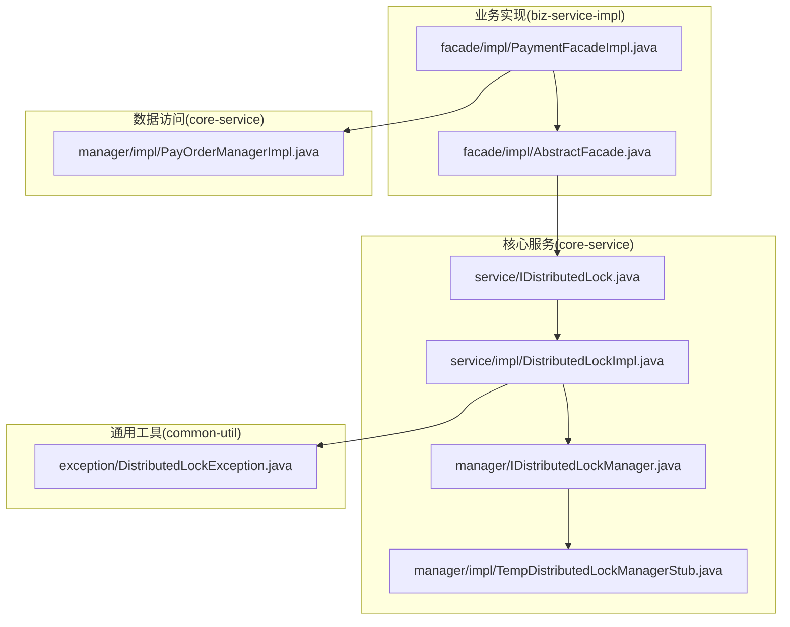
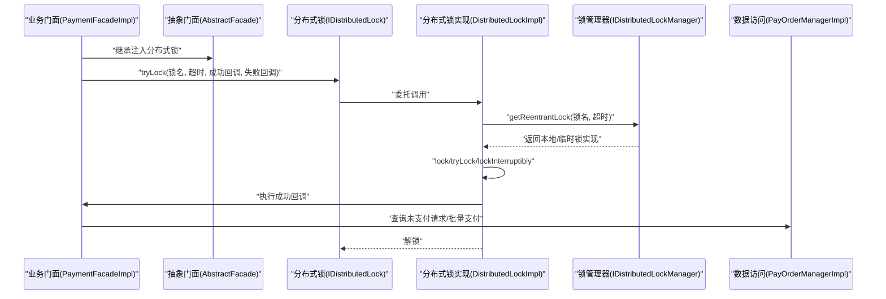
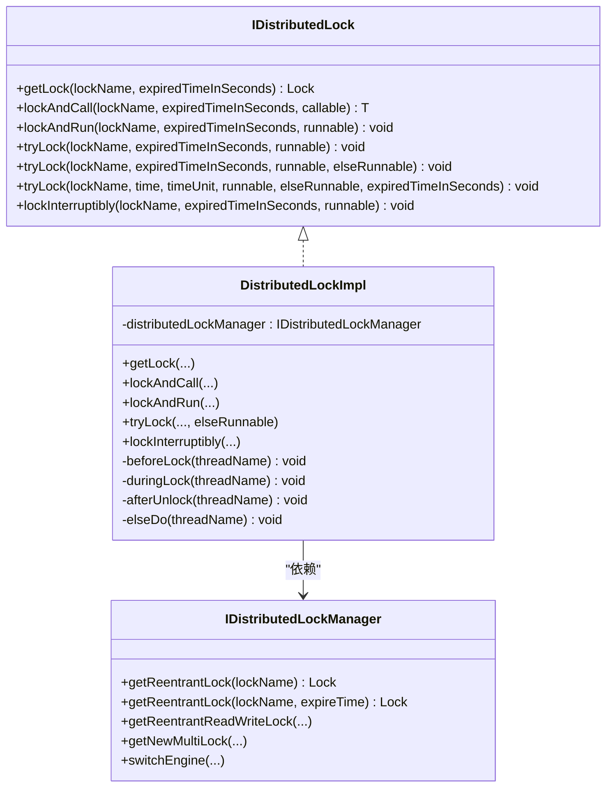
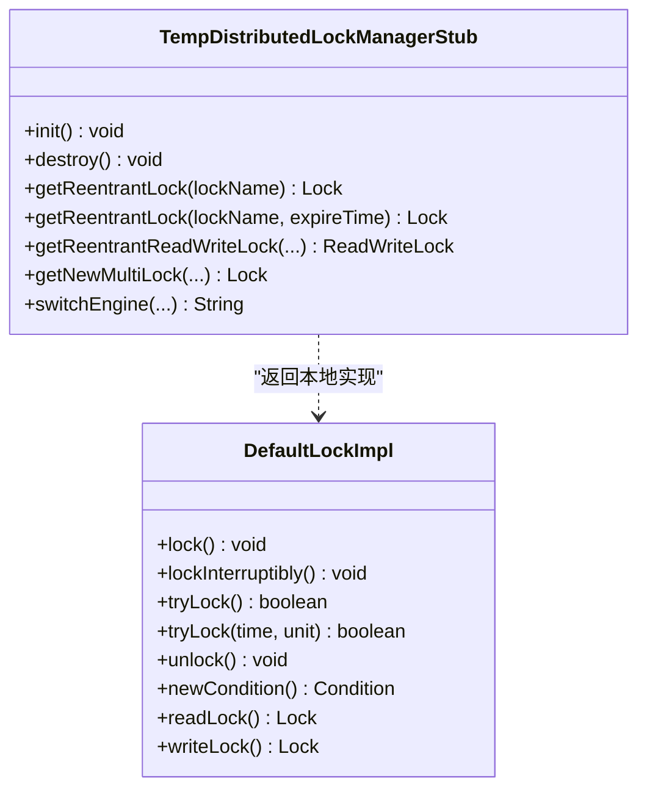
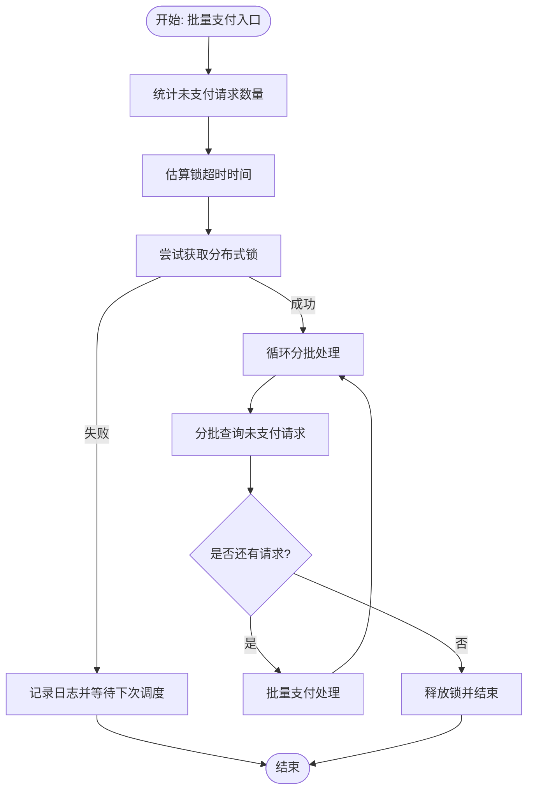
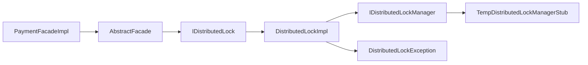

# 分布式锁实现

<cite>
**本文引用的文件**
- [DistributedLockImpl.java](file://core-service/src/main/java/com/magicliang/transaction/sys/core/service/impl/DistributedLockImpl.java)
- [IDistributedLock.java](file://core-service/src/main/java/com/magicliang/transaction/sys/core/service/IDistributedLock.java)
- [IDistributedLockManager.java](file://core-service/src/main/java/com/magicliang/transaction/sys/core/manager/IDistributedLockManager.java)
- [TempDistributedLockManagerStub.java](file://core-service/src/main/java/com/magicliang/transaction/sys/core/manager/impl/TempDistributedLockManagerStub.java)
- [DistributedLockException.java](file://common-util/src/main/java/com/magicliang/transaction/sys/common/exception/DistributedLockException.java)
- [PaymentFacadeImpl.java](file://biz-service-impl/src/main/java/com/magicliang/transaction/sys/biz/service/impl/facade/impl/PaymentFacadeImpl.java)
- [AbstractFacade.java](file://biz-service-impl/src/main/java/com/magicliang/transaction/sys/biz/service/impl/facade/impl/AbstractFacade.java)
- [PayOrderManagerImpl.java](file://core-service/src/main/java/com/magicliang/transaction/sys/core/manager/impl/PayOrderManagerImpl.java)
</cite>

## 目录
1. [简介](#简介)
2. [项目结构](#项目结构)
3. [核心组件](#核心组件)
4. [架构总览](#架构总览)
5. [详细组件分析](#详细组件分析)
6. [依赖分析](#依赖分析)
7. [性能考量](#性能考量)
8. [故障排查指南](#故障排查指南)
9. [结论](#结论)
10. [附录](#附录)

## 简介
本文件围绕分布式锁实现进行系统化说明，重点覆盖以下方面：
- DistributedLockImpl 的实现原理与使用方式
- 分布式锁在事务一致性保障中的关键作用
- 分布式锁的获取、释放与超时处理机制
- 临时分布式锁管理器的实现与测试用途
- 在支付订单并发控制中的应用场景（幂等性与状态冲突避免）
- 使用最佳实践（锁粒度设计、死锁预防、性能优化）
- 与业务流程的集成方式与异常处理机制

## 项目结构
分布式锁相关代码主要分布在如下模块与包中：
- 接口与实现层：core-service 下的 service 与 manager 包
- 通用异常：common-util 下的 exception 包
- 业务集成：biz-service-impl 下的 facade 包
- 数据访问与事务：core-service 下的 manager 实现类

图表来源
- [IDistributedLock.java:1-98](file://core-service/src/main/java/com/magicliang/transaction/sys/core/service/IDistributedLock.java#L1-L98)
- [DistributedLockImpl.java:1-275](file://core-service/src/main/java/com/magicliang/transaction/sys/core/service/impl/DistributedLockImpl.java#L1-L275)
- [IDistributedLockManager.java:1-43](file://core-service/src/main/java/com/magicliang/transaction/sys/core/manager/IDistributedLockManager.java#L1-L43)
- [TempDistributedLockManagerStub.java:1-319](file://core-service/src/main/java/com/magicliang/transaction/sys/core/manager/impl/TempDistributedLockManagerStub.java#L1-L319)
- [DistributedLockException.java:1-32](file://common-util/src/main/java/com/magicliang/transaction/sys/common/exception/DistributedLockException.java#L1-L32)
- [AbstractFacade.java:1-36](file://biz-service-impl/src/main/java/com/magicliang/transaction/sys/biz/service/impl/facade/impl/AbstractFacade.java#L1-L36)
- [PaymentFacadeImpl.java:1-166](file://biz-service-impl/src/main/java/com/magicliang/transaction/sys/biz/service/impl/facade/impl/PaymentFacadeImpl.java#L1-L166)
- [PayOrderManagerImpl.java:1-526](file://core-service/src/main/java/com/magicliang/transaction/sys/core/manager/impl/PayOrderManagerImpl.java#L1-L526)

章节来源
- [IDistributedLock.java:1-98](file://core-service/src/main/java/com/magicliang/transaction/sys/core/service/IDistributedLock.java#L1-L98)
- [DistributedLockImpl.java:1-275](file://core-service/src/main/java/com/magicliang/transaction/sys/core/service/impl/DistributedLockImpl.java#L1-L275)
- [IDistributedLockManager.java:1-43](file://core-service/src/main/java/com/magicliang/transaction/sys/core/manager/IDistributedLockManager.java#L1-L43)
- [TempDistributedLockManagerStub.java:1-319](file://core-service/src/main/java/com/magicliang/transaction/sys/core/manager/impl/TempDistributedLockManagerStub.java#L1-L319)
- [DistributedLockException.java:1-32](file://common-util/src/main/java/com/magicliang/transaction/sys/common/exception/DistributedLockException.java#L1-L32)
- [AbstractFacade.java:1-36](file://biz-service-impl/src/main/java/com/magicliang/transaction/sys/biz/service/impl/facade/impl/AbstractFacade.java#L1-L36)
- [PaymentFacadeImpl.java:1-166](file://biz-service-impl/src/main/java/com/magicliang/transaction/sys/biz/service/impl/facade/impl/PaymentFacadeImpl.java#L1-L166)
- [PayOrderManagerImpl.java:1-526](file://core-service/src/main/java/com/magicliang/transaction/sys/core/manager/impl/PayOrderManagerImpl.java#L1-L526)

## 核心组件
- 分布式锁接口：定义统一的加锁与执行能力，包括阻塞/可中断/试锁/带超时的试锁等。
- 分布式锁实现：封装对底层管理器的调用，负责参数校验、日志记录、异常转换与锁生命周期管理。
- 分布式锁管理器接口：抽象底层分布式锁引擎的获取与切换能力。
- 临时分布式锁管理器桩：在开发/测试阶段提供本地无实际分布式能力的默认实现，便于单元测试与快速验证。
- 业务集成：门面层通过注入分布式锁接口，将锁应用于批量支付等高并发场景。

章节来源
- [IDistributedLock.java:16-97](file://core-service/src/main/java/com/magicliang/transaction/sys/core/service/IDistributedLock.java#L16-L97)
- [DistributedLockImpl.java:26-275](file://core-service/src/main/java/com/magicliang/transaction/sys/core/service/impl/DistributedLockImpl.java#L26-L275)
- [IDistributedLockManager.java:15-42](file://core-service/src/main/java/com/magicliang/transaction/sys/core/manager/IDistributedLockManager.java#L15-L42)
- [TempDistributedLockManagerStub.java:19-319](file://core-service/src/main/java/com/magicliang/transaction/sys/core/manager/impl/TempDistributedLockManagerStub.java#L19-L319)
- [AbstractFacade.java:26-29](file://biz-service-impl/src/main/java/com/magicliang/transaction/sys/biz/service/impl/facade/impl/AbstractFacade.java#L26-L29)

## 架构总览
分布式锁在系统中的位置与交互如下：

图表来源
- [PaymentFacadeImpl.java:66-93](file://biz-service-impl/src/main/java/com/magicliang/transaction/sys/biz/service/impl/facade/impl/PaymentFacadeImpl.java#L66-L93)
- [AbstractFacade.java:26-29](file://biz-service-impl/src/main/java/com/magicliang/transaction/sys/biz/service/impl/facade/impl/AbstractFacade.java#L26-L29)
- [IDistributedLock.java:16-97](file://core-service/src/main/java/com/magicliang/transaction/sys/core/service/IDistributedLock.java#L16-L97)
- [DistributedLockImpl.java:41-237](file://core-service/src/main/java/com/magicliang/transaction/sys/core/service/impl/DistributedLockImpl.java#L41-L237)
- [IDistributedLockManager.java:15-42](file://core-service/src/main/java/com/magicliang/transaction/sys/core/manager/IDistributedLockManager.java#L15-L42)
- [PayOrderManagerImpl.java:146-162](file://core-service/src/main/java/com/magicliang/transaction/sys/core/manager/impl/PayOrderManagerImpl.java#L146-L162)

## 详细组件分析

### 分布式锁接口与实现
- 接口职责：提供多种加锁与执行模式，包括阻塞、可中断、试锁、带超时试锁；以及“加锁后求值”的封装。
- 实现要点：
  - 参数校验：锁名与过期时间必须有效。
  - 生命周期钩子：在获取锁前、持有锁期间、释放锁后分别记录日志。
  - 异常处理：将底层异常包装为业务异常，便于上层捕获与治理。
  - 释放保证：通过 finally 确保锁释放，避免死锁。

图表来源
- [IDistributedLock.java:16-97](file://core-service/src/main/java/com/magicliang/transaction/sys/core/service/IDistributedLock.java#L16-L97)
- [DistributedLockImpl.java:26-275](file://core-service/src/main/java/com/magicliang/transaction/sys/core/service/impl/DistributedLockImpl.java#L26-L275)
- [IDistributedLockManager.java:15-42](file://core-service/src/main/java/com/magicliang/transaction/sys/core/manager/IDistributedLockManager.java#L15-L42)

章节来源
- [IDistributedLock.java:16-97](file://core-service/src/main/java/com/magicliang/transaction/sys/core/service/IDistributedLock.java#L16-L97)
- [DistributedLockImpl.java:26-275](file://core-service/src/main/java/com/magicliang/transaction/sys/core/service/impl/DistributedLockImpl.java#L26-L275)

### 临时分布式锁管理器桩
- 设计目的：在开发/测试阶段提供本地锁实现，屏蔽真实分布式锁依赖，便于单元测试与快速验证。
- 行为特征：所有锁方法均为空实现或恒定返回，不提供真正的并发保护。
- 使用建议：仅用于测试与本地开发；生产环境需替换为真实分布式锁实现并通过管理器切换。

图表来源
- [TempDistributedLockManagerStub.java:19-319](file://core-service/src/main/java/com/magicliang/transaction/sys/core/manager/impl/TempDistributedLockManagerStub.java#L19-L319)

章节来源
- [TempDistributedLockManagerStub.java:19-319](file://core-service/src/main/java/com/magicliang/transaction/sys/core/manager/impl/TempDistributedLockManagerStub.java#L19-L319)

### 异常处理与日志
- 异常类型：分布式锁异常继承自业务异常，便于统一治理。
- 日志策略：在获取锁前、持有锁期间、释放锁后与回退分支均有日志输出，便于定位问题。

章节来源
- [DistributedLockException.java:12-31](file://common-util/src/main/java/com/magicliang/transaction/sys/common/exception/DistributedLockException.java#L12-L31)
- [DistributedLockImpl.java:244-273](file://core-service/src/main/java/com/magicliang/transaction/sys/core/service/impl/DistributedLockImpl.java#L244-L273)

### 支付订单并发控制与业务集成
- 锁粒度设计：以门面级操作命名锁，例如批量支付场景使用统一锁名，避免跨节点重复执行。
- 超时估算：根据线程数、未支付订单近似数量与吞吐量估算锁超时时间，确保批处理在超时前完成。
- 幂等性与状态冲突避免：通过锁保护“查询-计算-更新”原子片段，结合数据库层面的幂等约束（如版本号、唯一键）降低冲突概率。
- 回退策略：当无法获取锁时，记录日志并等待下次调度，避免阻塞整体流程。

图表来源
- [PaymentFacadeImpl.java:66-93](file://biz-service-impl/src/main/java/com/magicliang/transaction/sys/biz/service/impl/facade/impl/PaymentFacadeImpl.java#L66-L93)
- [AbstractFacade.java:26-29](file://biz-service-impl/src/main/java/com/magicliang/transaction/sys/biz/service/impl/facade/impl/AbstractFacade.java#L26-L29)
- [PayOrderManagerImpl.java:146-162](file://core-service/src/main/java/com/magicliang/transaction/sys/core/manager/impl/PayOrderManagerImpl.java#L146-L162)

章节来源
- [PaymentFacadeImpl.java:66-93](file://biz-service-impl/src/main/java/com/magicliang/transaction/sys/biz/service/impl/facade/impl/PaymentFacadeImpl.java#L66-L93)
- [AbstractFacade.java:26-29](file://biz-service-impl/src/main/java/com/magicliang/transaction/sys/biz/service/impl/facade/impl/AbstractFacade.java#L26-L29)
- [PayOrderManagerImpl.java:146-162](file://core-service/src/main/java/com/magicliang/transaction/sys/core/manager/impl/PayOrderManagerImpl.java#L146-L162)

## 依赖分析
- 组件耦合：
  - 业务门面通过抽象基类注入分布式锁接口，实现与具体实现解耦。
  - 分布式锁实现依赖锁管理器接口，便于在运行时切换不同引擎。
  - 临时管理器桩提供默认实现，便于测试与开发。
- 外部依赖：
  - Spring 容器负责依赖注入。
  - Apache Commons Lang 用于字符串校验。
  - 日志框架用于记录锁生命周期事件。

图表来源
- [PaymentFacadeImpl.java:1-166](file://biz-service-impl/src/main/java/com/magicliang/transaction/sys/biz/service/impl/facade/impl/PaymentFacadeImpl.java#L1-L166)
- [AbstractFacade.java:1-36](file://biz-service-impl/src/main/java/com/magicliang/transaction/sys/biz/service/impl/facade/impl/AbstractFacade.java#L1-L36)
- [IDistributedLock.java:1-98](file://core-service/src/main/java/com/magicliang/transaction/sys/core/service/IDistributedLock.java#L1-L98)
- [DistributedLockImpl.java:1-275](file://core-service/src/main/java/com/magicliang/transaction/sys/core/service/impl/DistributedLockImpl.java#L1-L275)
- [IDistributedLockManager.java:1-43](file://core-service/src/main/java/com/magicliang/transaction/sys/core/manager/IDistributedLockManager.java#L1-L43)
- [TempDistributedLockManagerStub.java:1-319](file://core-service/src/main/java/com/magicliang/transaction/sys/core/manager/impl/TempDistributedLockManagerStub.java#L1-L319)
- [DistributedLockException.java:1-32](file://common-util/src/main/java/com/magicliang/transaction/sys/common/exception/DistributedLockException.java#L1-L32)

章节来源
- [IDistributedLock.java:1-98](file://core-service/src/main/java/com/magicliang/transaction/sys/core/service/IDistributedLock.java#L1-L98)
- [DistributedLockImpl.java:1-275](file://core-service/src/main/java/com/magicliang/transaction/sys/core/service/impl/DistributedLockImpl.java#L1-L275)
- [IDistributedLockManager.java:1-43](file://core-service/src/main/java/com/magicliang/transaction/sys/core/manager/IDistributedLockManager.java#L1-L43)
- [TempDistributedLockManagerStub.java:1-319](file://core-service/src/main/java/com/magicliang/transaction/sys/core/manager/impl/TempDistributedLockManagerStub.java#L1-L319)
- [DistributedLockException.java:1-32](file://common-util/src/main/java/com/magicliang/transaction/sys/common/exception/DistributedLockException.java#L1-L32)
- [AbstractFacade.java:1-36](file://biz-service-impl/src/main/java/com/magicliang/transaction/sys/biz/service/impl/facade/impl/AbstractFacade.java#L1-L36)
- [PaymentFacadeImpl.java:1-166](file://biz-service-impl/src/main/java/com/magicliang/transaction/sys/biz/service/impl/facade/impl/PaymentFacadeImpl.java#L1-L166)

## 性能考量
- 锁粒度设计
  - 将锁作用域限定在“批处理”级别，避免过细粒度过多锁竞争；同时避免过粗导致串行化影响吞吐。
  - 对于批量支付，使用统一锁名，确保同一时刻只有一个实例在执行该批处理。
- 超时策略
  - 基于线程数、未支付订单数量与吞吐量估算锁超时时间，避免长时间持锁造成积压。
  - 超时时间应留有余量，以应对突发流量与数据库延迟。
- 并发与回退
  - 无法获取锁时立即回退并等待下次调度，避免阻塞队列堆积。
  - 结合线程池与异步通知，提升整体吞吐与响应性。
- 数据库层面的幂等
  - 利用版本号、唯一键与状态机约束，减少锁外冲突概率，提高整体性能。

## 故障排查指南
- 常见问题
  - 锁名非法或过期时间无效：触发分布式锁异常，检查调用方传参。
  - 无法获取锁：查看日志中“否则执行”分支，确认回退策略是否生效。
  - 死锁风险：确保 finally 中释放锁；避免在锁内进行耗时操作或再次获取锁。
- 排查步骤
  - 检查分布式锁实现的日志输出，定位锁生命周期。
  - 核对业务侧锁超时时间与批处理耗时，必要时调整。
  - 在测试环境使用临时管理器桩验证流程正确性。

章节来源
- [DistributedLockException.java:12-31](file://common-util/src/main/java/com/magicliang/transaction/sys/common/exception/DistributedLockException.java#L12-L31)
- [DistributedLockImpl.java:43-48](file://core-service/src/main/java/com/magicliang/transaction/sys/core/service/impl/DistributedLockImpl.java#L43-L48)
- [TempDistributedLockManagerStub.java:87-319](file://core-service/src/main/java/com/magicliang/transaction/sys/core/manager/impl/TempDistributedLockManagerStub.java#L87-L319)

## 结论
本实现通过清晰的接口与实现分离、可插拔的锁管理器以及完善的生命周期钩子，提供了稳定可靠的分布式锁能力。在支付订单的高并发场景中，配合合理的锁粒度、超时估算与幂等约束，能够有效避免状态冲突与重复执行，保障事务一致性。建议在生产环境中替换为真实的分布式锁引擎，并持续监控锁争用与超时情况，以优化性能与稳定性。

## 附录
- 使用建议清单
  - 明确锁粒度：按业务边界划分，避免过度竞争。
  - 合理设置超时：基于历史数据与容量规划估算。
  - 异常与回退：统一异常类型，失败时及时回退并重试。
  - 测试先行：使用临时管理器桩进行单元测试与压力验证。
  - 监控与告警：关注锁等待时间、失败率与超时次数。