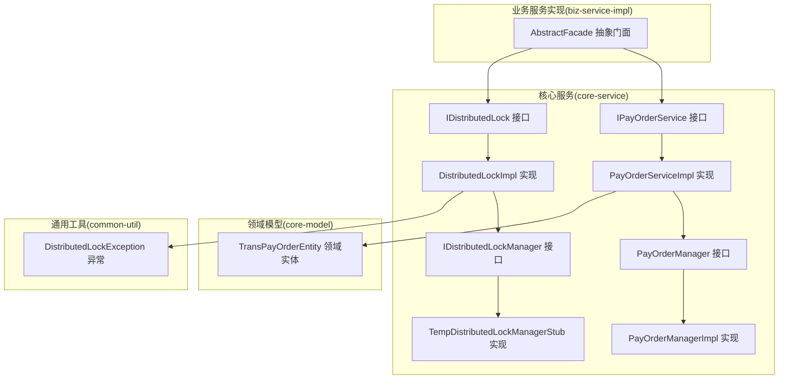
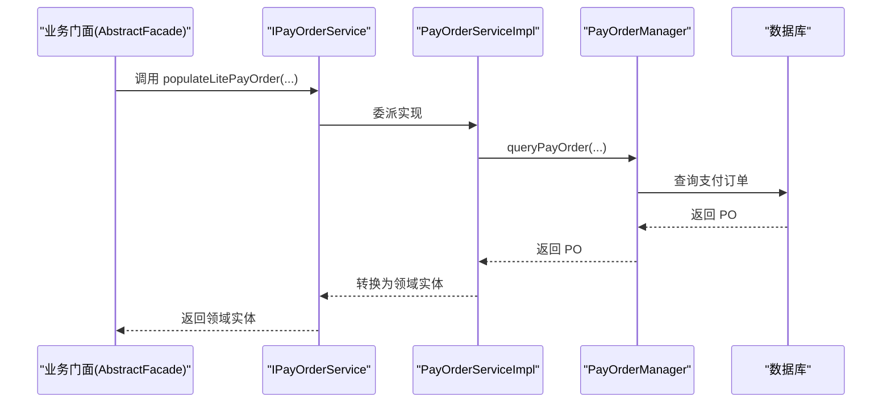
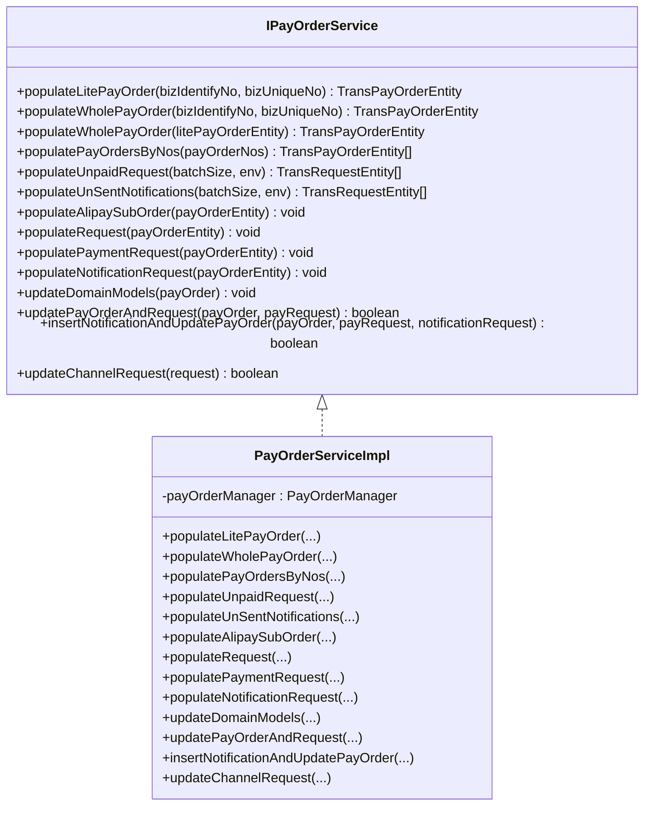
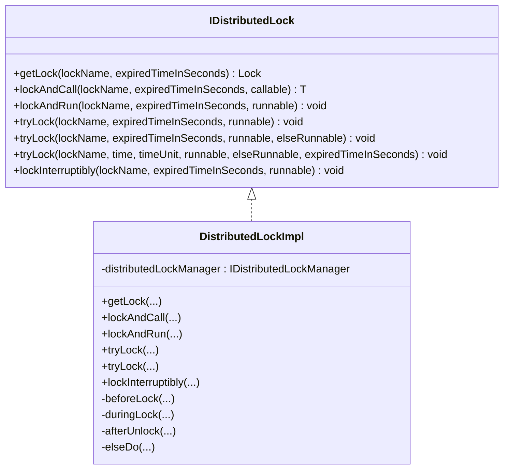
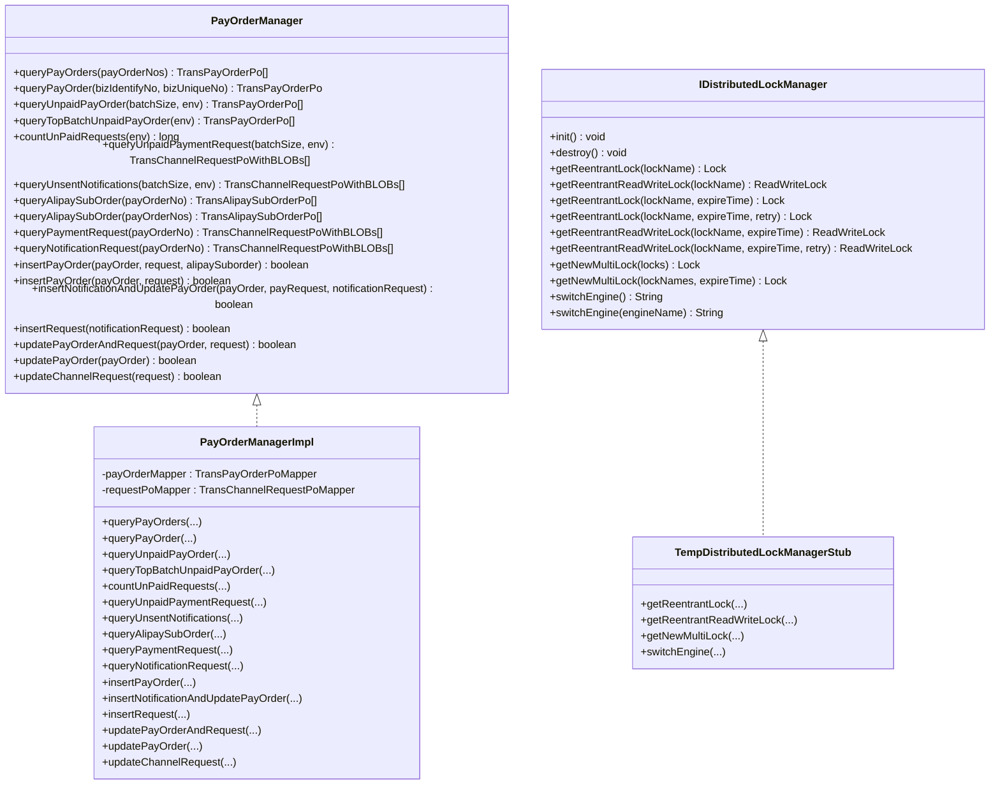
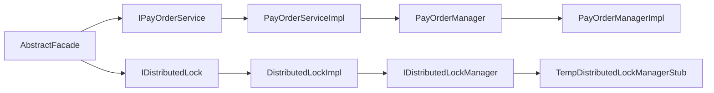

# 服务接口设计

<cite>
**本文引用的文件**
- [IPayOrderService.java](file://core-service/src/main/java/com/magicliang/transaction/sys/core/service/IPayOrderService.java)
- [IDistributedLock.java](file://core-service/src/main/java/com/magicliang/transaction/sys/core/service/IDistributedLock.java)
- [PayOrderManager.java](file://core-service/src/main/java/com/magicliang/transaction/sys/core/manager/PayOrderManager.java)
- [IDistributedLockManager.java](file://core-service/src/main/java/com/magicliang/transaction/sys/core/manager/IDistributedLockManager.java)
- [PayOrderServiceImpl.java](file://core-service/src/main/java/com/magicliang/transaction/sys/core/service/impl/PayOrderServiceImpl.java)
- [DistributedLockImpl.java](file://core-service/src/main/java/com/magicliang/transaction/sys/core/service/impl/DistributedLockImpl.java)
- [PayOrderManagerImpl.java](file://core-service/src/main/java/com/magicliang/transaction/sys/core/manager/impl/PayOrderManagerImpl.java)
- [TempDistributedLockManagerStub.java](file://core-service/src/main/java/com/magicliang/transaction/sys/core/manager/impl/TempDistributedLockManagerStub.java)
- [TransPayOrderEntity.java](file://core-model/src/main/java/com/magicliang/transaction/sys/core/model/entity/TransPayOrderEntity.java)
- [DistributedLockException.java](file://common-util/src/main/java/com/magicliang/transaction/sys/common/exception/DistributedLockException.java)
- [AbstractFacade.java](file://biz-service-impl/src/main/java/com/magicliang/transaction/sys/biz/service/impl/facade/impl/AbstractFacade.java)
</cite>

## 目录
1. [简介](#简介)
2. [项目结构](#项目结构)
3. [核心组件](#核心组件)
4. [架构总览](#架构总览)
5. [详细组件分析](#详细组件分析)
6. [依赖关系分析](#依赖关系分析)
7. [性能考量](#性能考量)
8. [故障排查指南](#故障排查指南)
9. [结论](#结论)
10. [附录](#附录)

## 简介
本文件围绕领域驱动交易系统中的服务接口设计展开，重点阐述以下目标：
- IPayOrderService 支付订单服务接口的设计理念与实现规范
- IDistributedLock 分布式锁接口的设计思路
- PayOrderManager 与 IDistributedLockManager 的职责划分与接口设计原则
- 如何通过接口设计体现开闭原则与依赖倒置原则
- 接口抽象层次的设计考虑
- 接口使用示例与最佳实践
- 接口版本管理、向后兼容性与扩展点设计

## 项目结构
该系统采用多模块分层架构，核心服务位于 core-service 模块，领域模型位于 core-model 模块，通用工具位于 common-util 模块，业务服务实现位于 biz-service-impl 模块。接口设计遵循“接口隔离、依赖倒置”的原则，通过抽象接口与实现类解耦业务逻辑与基础设施。

图表来源
- [IPayOrderService.java:16-156](file://core-service/src/main/java/com/magicliang/transaction/sys/core/service/IPayOrderService.java#L16-L156)
- [IDistributedLock.java:16-96](file://core-service/src/main/java/com/magicliang/transaction/sys/core/service/IDistributedLock.java#L16-L96)
- [PayOrderManager.java:18-186](file://core-service/src/main/java/com/magicliang/transaction/sys/core/manager/PayOrderManager.java#L18-L186)
- [IDistributedLockManager.java:15-42](file://core-service/src/main/java/com/magicliang/transaction/sys/core/manager/IDistributedLockManager.java#L15-L42)
- [PayOrderServiceImpl.java:43-460](file://core-service/src/main/java/com/magicliang/transaction/sys/core/service/impl/PayOrderServiceImpl.java#L43-L460)
- [DistributedLockImpl.java:26-275](file://core-service/src/main/java/com/magicliang/transaction/sys/core/service/impl/DistributedLockImpl.java#L26-L275)
- [PayOrderManagerImpl.java:41-526](file://core-service/src/main/java/com/magicliang/transaction/sys/core/manager/impl/PayOrderManagerImpl.java#L41-L526)
- [TempDistributedLockManagerStub.java:20-319](file://core-service/src/main/java/com/magicliang/transaction/sys/core/manager/impl/TempDistributedLockManagerStub.java#L20-L319)
- [TransPayOrderEntity.java:32-200](file://core-model/src/main/java/com/magicliang/transaction/sys/core/model/entity/TransPayOrderEntity.java#L32-L200)
- [DistributedLockException.java:12-31](file://common-util/src/main/java/com/magicliang/transaction/sys/common/exception/DistributedLockException.java#L12-L31)
- [AbstractFacade.java:17-36](file://biz-service-impl/src/main/java/com/magicliang/transaction/sys/biz/service/impl/facade/impl/AbstractFacade.java#L17-L36)

章节来源
- [IPayOrderService.java:16-156](file://core-service/src/main/java/com/magicliang/transaction/sys/core/service/IPayOrderService.java#L16-L156)
- [IDistributedLock.java:16-96](file://core-service/src/main/java/com/magicliang/transaction/sys/core/service/IDistributedLock.java#L16-L96)
- [PayOrderManager.java:18-186](file://core-service/src/main/java/com/magicliang/transaction/sys/core/manager/PayOrderManager.java#L18-L186)
- [IDistributedLockManager.java:15-42](file://core-service/src/main/java/com/magicliang/transaction/sys/core/manager/IDistributedLockManager.java#L15-L42)
- [PayOrderServiceImpl.java:43-460](file://core-service/src/main/java/com/magicliang/transaction/sys/core/service/impl/PayOrderServiceImpl.java#L43-L460)
- [DistributedLockImpl.java:26-275](file://core-service/src/main/java/com/magicliang/transaction/sys/core/service/impl/DistributedLockImpl.java#L26-L275)
- [PayOrderManagerImpl.java:41-526](file://core-service/src/main/java/com/magicliang/transaction/sys/core/manager/impl/PayOrderManagerImpl.java#L41-L526)
- [TempDistributedLockManagerStub.java:20-319](file://core-service/src/main/java/com/magicliang/transaction/sys/core/manager/impl/TempDistributedLockManagerStub.java#L20-L319)
- [TransPayOrderEntity.java:32-200](file://core-model/src/main/java/com/magicliang/transaction/sys/core/model/entity/TransPayOrderEntity.java#L32-L200)
- [DistributedLockException.java:12-31](file://common-util/src/main/java/com/magicliang/transaction/sys/common/exception/DistributedLockException.java#L12-L31)
- [AbstractFacade.java:17-36](file://biz-service-impl/src/main/java/com/magicliang/transaction/sys/biz/service/impl/facade/impl/AbstractFacade.java#L17-L36)

## 核心组件
- IPayOrderService：定义支付订单服务的领域操作契约，包括订单填充、请求查询、通知处理、事务内更新等。
- IDistributedLock：定义分布式锁的统一抽象，提供多种加锁与执行模式，确保跨进程/跨节点的一致性。
- PayOrderManager：定义支付订单的底层数据访问与事务操作契约，负责与数据库交互。
- IDistributedLockManager：定义分布式锁底层依赖的管理器契约，负责具体锁引擎的获取与切换。
- 实现类：PayOrderServiceImpl、DistributedLockImpl、PayOrderManagerImpl、TempDistributedLockManagerStub 分别实现上述接口，承担具体职责。

章节来源
- [IPayOrderService.java:16-156](file://core-service/src/main/java/com/magicliang/transaction/sys/core/service/IPayOrderService.java#L16-L156)
- [IDistributedLock.java:16-96](file://core-service/src/main/java/com/magicliang/transaction/sys/core/service/IDistributedLock.java#L16-L96)
- [PayOrderManager.java:18-186](file://core-service/src/main/java/com/magicliang/transaction/sys/core/manager/PayOrderManager.java#L18-L186)
- [IDistributedLockManager.java:15-42](file://core-service/src/main/java/com/magicliang/transaction/sys/core/manager/IDistributedLockManager.java#L15-L42)
- [PayOrderServiceImpl.java:43-460](file://core-service/src/main/java/com/magicliang/transaction/sys/core/service/impl/PayOrderServiceImpl.java#L43-L460)
- [DistributedLockImpl.java:26-275](file://core-service/src/main/java/com/magicliang/transaction/sys/core/service/impl/DistributedLockImpl.java#L26-L275)
- [PayOrderManagerImpl.java:41-526](file://core-service/src/main/java/com/magicliang/transaction/sys/core/manager/impl/PayOrderManagerImpl.java#L41-L526)
- [TempDistributedLockManagerStub.java:20-319](file://core-service/src/main/java/com/magicliang/transaction/sys/core/manager/impl/TempDistributedLockManagerStub.java#L20-L319)

## 架构总览
系统采用“接口抽象 + 实现类”分层设计，业务层通过接口调用，实现类负责具体逻辑；分布式锁通过 IDistributedLock 与 IDistributedLockManager 解耦锁引擎与业务逻辑；支付订单服务通过 IPayOrderService 与 PayOrderManager 解耦领域模型与数据访问。

图表来源
- [AbstractFacade.java:29-35](file://biz-service-impl/src/main/java/com/magicliang/transaction/sys/biz/service/impl/facade/impl/AbstractFacade.java#L29-L35)
- [IPayOrderService.java:58-65](file://core-service/src/main/java/com/magicliang/transaction/sys/core/service/IPayOrderService.java#L58-L65)
- [PayOrderServiceImpl.java:58-65](file://core-service/src/main/java/com/magicliang/transaction/sys/core/service/impl/PayOrderServiceImpl.java#L58-L65)
- [PayOrderManager.java:43-43](file://core-service/src/main/java/com/magicliang/transaction/sys/core/manager/PayOrderManager.java#L43-L43)
- [PayOrderManagerImpl.java:87-98](file://core-service/src/main/java/com/magicliang/transaction/sys/core/manager/impl/PayOrderManagerImpl.java#L87-L98)

## 详细组件分析

### IPayOrderService 设计与实现规范
- 设计理念
  - 领域服务接口，聚焦支付订单的“领域行为”，而非数据访问细节。
  - 通过“轻量级填充”与“完整填充”区分不同粒度的订单装配，保证性能与一致性平衡。
  - 统一事务内更新入口，确保订单与请求的原子性。
- 关键职责
  - 订单填充：populateLitePayOrder、populateWholePayOrder、populatePayOrdersByNos
  - 请求与通知装配：populateRequest、populatePaymentRequest、populateNotificationRequest、populateUnpaidRequest、populateUnSentNotifications
  - 事务更新：updateDomainModels、updatePayOrderAndRequest、insertNotificationAndUpdatePayOrder、updateChannelRequest
- 实现规范
  - 参数校验与异常处理：对空集合、非法状态进行防御性处理。
  - 转换与映射：通过 Convertor 将 PO 转为领域实体，保持领域模型纯净。
  - 通知策略：根据订单状态与帮助类决定是否插入通知请求，保证最终一致性。

图表来源
- [IPayOrderService.java:16-156](file://core-service/src/main/java/com/magicliang/transaction/sys/core/service/IPayOrderService.java#L16-L156)
- [PayOrderServiceImpl.java:43-460](file://core-service/src/main/java/com/magicliang/transaction/sys/core/service/impl/PayOrderServiceImpl.java#L43-L460)

章节来源
- [IPayOrderService.java:16-156](file://core-service/src/main/java/com/magicliang/transaction/sys/core/service/IPayOrderService.java#L16-L156)
- [PayOrderServiceImpl.java:58-346](file://core-service/src/main/java/com/magicliang/transaction/sys/core/service/impl/PayOrderServiceImpl.java#L58-L346)
- [TransPayOrderEntity.java:32-200](file://core-model/src/main/java/com/magicliang/transaction/sys/core/model/entity/TransPayOrderEntity.java#L32-L200)

### IDistributedLock 设计思路
- 设计理念
  - 统一分布式锁抽象，屏蔽底层锁引擎差异，支持多种加锁与执行模式。
  - 明确超时与重试策略，提供 tryLock、lockAndRun、lockAndCall、lockInterruptibly 等丰富能力。
- 关键职责
  - 获取锁：getLock
  - 执行封装：lockAndCall、lockAndRun
  - 试锁：tryLock（含计时与回退回调）
  - 可中断阻塞：lockInterruptibly
- 实现要点
  - 参数校验：锁名与过期时间必须有效。
  - 生命周期钩子：beforeLock、duringLock、afterUnlock、elseDo，便于监控与审计。
  - 异常包装：将底层异常包装为分布式锁专用异常，便于上层识别与处理。

图表来源
- [IDistributedLock.java:16-96](file://core-service/src/main/java/com/magicliang/transaction/sys/core/service/IDistributedLock.java#L16-L96)
- [DistributedLockImpl.java:26-275](file://core-service/src/main/java/com/magicliang/transaction/sys/core/service/impl/DistributedLockImpl.java#L26-L275)
- [IDistributedLockManager.java:15-42](file://core-service/src/main/java/com/magicliang/transaction/sys/core/manager/IDistributedLockManager.java#L15-L42)
- [TempDistributedLockManagerStub.java:20-319](file://core-service/src/main/java/com/magicliang/transaction/sys/core/manager/impl/TempDistributedLockManagerStub.java#L20-L319)

章节来源
- [IDistributedLock.java:16-96](file://core-service/src/main/java/com/magicliang/transaction/sys/core/service/IDistributedLock.java#L16-L96)
- [DistributedLockImpl.java:42-237](file://core-service/src/main/java/com/magicliang/transaction/sys/core/service/impl/DistributedLockImpl.java#L42-L237)
- [DistributedLockException.java:12-31](file://common-util/src/main/java/com/magicliang/transaction/sys/common/exception/DistributedLockException.java#L12-L31)

### PayOrderManager 与 IDistributedLockManager 职责划分
- PayOrderManager
  - 职责：面向支付订单的底层数据访问与事务操作，屏蔽 MyBatis Mapper 细节。
  - 设计原则：接口最小化、职责单一；提供批量查询、分页查询、条件构建等能力。
  - 事务控制：通过注解声明事务边界，确保更新与插入的原子性。
- IDistributedLockManager
  - 职责：提供具体锁实现的获取与管理，支持多种锁类型与多锁组合。
  - 设计原则：接口稳定、扩展灵活；支持引擎切换与参数化配置。
- 两者协作
  - 业务层通过 IPayOrderService 调用 PayOrderManager 完成数据访问。
  - 分布式锁通过 IDistributedLock 调用 IDistributedLockManager 获取具体锁实现。

图表来源
- [PayOrderManager.java:18-186](file://core-service/src/main/java/com/magicliang/transaction/sys/core/manager/PayOrderManager.java#L18-L186)
- [PayOrderManagerImpl.java:41-526](file://core-service/src/main/java/com/magicliang/transaction/sys/core/manager/impl/PayOrderManagerImpl.java#L41-L526)
- [IDistributedLockManager.java:15-42](file://core-service/src/main/java/com/magicliang/transaction/sys/core/manager/IDistributedLockManager.java#L15-L42)
- [TempDistributedLockManagerStub.java:20-319](file://core-service/src/main/java/com/magicliang/transaction/sys/core/manager/impl/TempDistributedLockManagerStub.java#L20-L319)

章节来源
- [PayOrderManager.java:18-186](file://core-service/src/main/java/com/magicliang/transaction/sys/core/manager/PayOrderManager.java#L18-L186)
- [PayOrderManagerImpl.java:68-331](file://core-service/src/main/java/com/magicliang/transaction/sys/core/manager/impl/PayOrderManagerImpl.java#L68-L331)
- [IDistributedLockManager.java:15-42](file://core-service/src/main/java/com/magicliang/transaction/sys/core/manager/IDistributedLockManager.java#L15-L42)
- [TempDistributedLockManagerStub.java:20-319](file://core-service/src/main/java/com/magicliang/transaction/sys/core/manager/impl/TempDistributedLockManagerStub.java#L20-L319)

### 接口设计如何体现开闭原则与依赖倒置原则
- 开闭原则
  - 对扩展开放：新增支付场景或锁策略可通过实现新接口或扩展实现类，不修改既有接口。
  - 对修改封闭：核心接口保持稳定，避免频繁变更；通过适配器或装饰器扩展功能。
- 依赖倒置原则
  - 高层模块（业务门面、服务实现）依赖抽象（接口），不依赖具体实现。
  - 通过 Spring 注入实现解耦，业务层仅感知接口契约。

章节来源
- [AbstractFacade.java:28-35](file://biz-service-impl/src/main/java/com/magicliang/transaction/sys/biz/service/impl/facade/impl/AbstractFacade.java#L28-L35)
- [IPayOrderService.java:16-156](file://core-service/src/main/java/com/magicliang/transaction/sys/core/service/IPayOrderService.java#L16-L156)
- [IDistributedLock.java:16-96](file://core-service/src/main/java/com/magicliang/transaction/sys/core/service/IDistributedLock.java#L16-L96)

### 接口使用示例与最佳实践
- 使用 IPayOrderService
  - 轻量级填充：通过 populateLitePayOrder 获取基础订单实体，后续按需填充请求与子订单。
  - 完整填充：populateWholePayOrder 结合 populateRequest、populateAlipaySubOrder、populateNotificationRequest。
  - 事务更新：updateDomainModels 统一处理订单与请求的更新与通知插入。
- 使用 IDistributedLock
  - 简单加锁：getLock 获取锁实例，手动 lock/unlock。
  - 执行封装：lockAndRun 或 lockAndCall 自动加锁解锁并执行任务。
  - 试锁策略：tryLock 支持立即返回或计时等待，失败时执行回退逻辑。
- 最佳实践
  - 锁名命名规范：全局唯一且语义清晰，避免死锁与雪崩。
  - 超时时间合理设置：兼顾响应与稳定性，避免长时间阻塞。
  - 异常处理：捕获并包装分布式锁异常，便于上层统一处理。

章节来源
- [PayOrderServiceImpl.java:58-346](file://core-service/src/main/java/com/magicliang/transaction/sys/core/service/impl/PayOrderServiceImpl.java#L58-L346)
- [DistributedLockImpl.java:42-237](file://core-service/src/main/java/com/magicliang/transaction/sys/core/service/impl/DistributedLockImpl.java#L42-L237)
- [DistributedLockException.java:12-31](file://common-util/src/main/java/com/magicliang/transaction/sys/common/exception/DistributedLockException.java#L12-L31)

### 接口版本管理、向后兼容性与扩展点设计
- 版本管理
  - 接口保持稳定，新增方法以默认实现或适配器形式提供，避免破坏既有实现。
  - 通过注解（如 @Deprecated）标记过时方法，逐步迁移。
- 向后兼容性
  - 数据访问层通过 Mapper 与 Example 条件构建，保证查询语义稳定。
  - 领域实体字段扩展通过 Map 或 JSON 字段承载，避免频繁修改实体结构。
- 扩展点设计
  - 分布式锁引擎可切换：IDistributedLockManager 提供 switchEngine 能力。
  - 支付订单查询可分区与分页：提供 DEFAULT_BATCH 与分页查询工具。
  - 多锁组合：支持多锁合并，满足复杂并发控制需求。

章节来源
- [PayOrderManagerImpl.java:48-435](file://core-service/src/main/java/com/magicliang/transaction/sys/core/manager/impl/PayOrderManagerImpl.java#L48-L435)
- [IDistributedLockManager.java:39-41](file://core-service/src/main/java/com/magicliang/transaction/sys/core/manager/IDistributedLockManager.java#L39-L41)
- [TempDistributedLockManagerStub.java:77-85](file://core-service/src/main/java/com/magicliang/transaction/sys/core/manager/impl/TempDistributedLockManagerStub.java#L77-L85)

## 依赖关系分析
- 接口依赖
  - IPayOrderService 依赖 PayOrderManager 与领域实体转换器。
  - IDistributedLock 依赖 IDistributedLockManager 与异常包装。
- 实现依赖
  - PayOrderServiceImpl 依赖 PayOrderManagerImpl 与转换器。
  - DistributedLockImpl 依赖 IDistributedLockManager 与分布式锁异常。
- 业务依赖
  - AbstractFacade 依赖 IPayOrderService 与 IDistributedLock，作为业务层入口。

图表来源
- [AbstractFacade.java:28-35](file://biz-service-impl/src/main/java/com/magicliang/transaction/sys/biz/service/impl/facade/impl/AbstractFacade.java#L28-L35)
- [IPayOrderService.java:16-156](file://core-service/src/main/java/com/magicliang/transaction/sys/core/service/IPayOrderService.java#L16-L156)
- [IDistributedLock.java:16-96](file://core-service/src/main/java/com/magicliang/transaction/sys/core/service/IDistributedLock.java#L16-L96)
- [PayOrderServiceImpl.java:43-460](file://core-service/src/main/java/com/magicliang/transaction/sys/core/service/impl/PayOrderServiceImpl.java#L43-L460)
- [DistributedLockImpl.java:26-275](file://core-service/src/main/java/com/magicliang/transaction/sys/core/service/impl/DistributedLockImpl.java#L26-L275)
- [PayOrderManager.java:18-186](file://core-service/src/main/java/com/magicliang/transaction/sys/core/manager/PayOrderManager.java#L18-L186)
- [IDistributedLockManager.java:15-42](file://core-service/src/main/java/com/magicliang/transaction/sys/core/manager/IDistributedLockManager.java#L15-L42)
- [PayOrderManagerImpl.java:41-526](file://core-service/src/main/java/com/magicliang/transaction/sys/core/manager/impl/PayOrderManagerImpl.java#L41-L526)
- [TempDistributedLockManagerStub.java:20-319](file://core-service/src/main/java/com/magicliang/transaction/sys/core/manager/impl/TempDistributedLockManagerStub.java#L20-L319)

章节来源
- [AbstractFacade.java:28-35](file://biz-service-impl/src/main/java/com/magicliang/transaction/sys/biz/service/impl/facade/impl/AbstractFacade.java#L28-L35)
- [PayOrderServiceImpl.java:48-49](file://core-service/src/main/java/com/magicliang/transaction/sys/core/service/impl/PayOrderServiceImpl.java#L48-L49)
- [DistributedLockImpl.java:31-32](file://core-service/src/main/java/com/magicliang/transaction/sys/core/service/impl/DistributedLockImpl.java#L31-L32)

## 性能考量
- 批量查询与分页
  - DEFAULT_BATCH 控制单次 IN 查询规模，避免 SQL 过长与数据库压力过大。
  - 分页查询结合 PageHelper 与流式收集，降低内存占用。
- 锁性能
  - 合理设置过期时间与重试次数，避免长时间阻塞。
  - 优先使用 tryLock 与计时 tryLock，减少阻塞风险。
- 转换与映射
  - 使用流式转换与一次性收集，避免中间对象过多。

章节来源
- [PayOrderManagerImpl.java:48-435](file://core-service/src/main/java/com/magicliang/transaction/sys/core/manager/impl/PayOrderManagerImpl.java#L48-L435)
- [DistributedLockImpl.java:42-237](file://core-service/src/main/java/com/magicliang/transaction/sys/core/service/impl/DistributedLockImpl.java#L42-L237)

## 故障排查指南
- 分布式锁异常
  - 现象：加锁失败或超时。
  - 排查：检查锁名是否为空、过期时间是否合理、底层锁引擎状态。
  - 处理：捕获 DistributedLockException 并记录日志，必要时降级或重试。
- 订单填充异常
  - 现象：订单完整性校验失败或请求为空。
  - 排查：确认业务标识与唯一标识是否匹配、数据库是否存在对应记录。
  - 处理：返回空值或抛出业务异常，避免脏数据进入领域模型。

章节来源
- [DistributedLockException.java:12-31](file://common-util/src/main/java/com/magicliang/transaction/sys/common/exception/DistributedLockException.java#L12-L31)
- [PayOrderServiceImpl.java:203-205](file://core-service/src/main/java/com/magicliang/transaction/sys/core/service/impl/PayOrderServiceImpl.java#L203-L205)

## 结论
本接口设计通过清晰的职责划分与稳定的抽象契约，实现了业务逻辑与基础设施的解耦。IPayOrderService 与 IDistributedLock 的设计体现了开闭原则与依赖倒置原则，既保证了现有功能的稳定性，又为未来的扩展提供了清晰路径。通过合理的性能考量与故障排查机制，系统能够在高并发场景下保持可靠与高效。

## 附录
- 接口与实现对照
  - IPayOrderService ↔ PayOrderServiceImpl
  - IDistributedLock ↔ DistributedLockImpl
  - PayOrderManager ↔ PayOrderManagerImpl
  - IDistributedLockManager ↔ TempDistributedLockManagerStub
- 关键实体
  - TransPayOrderEntity：支付订单领域实体，承载聚合根与附属对象。