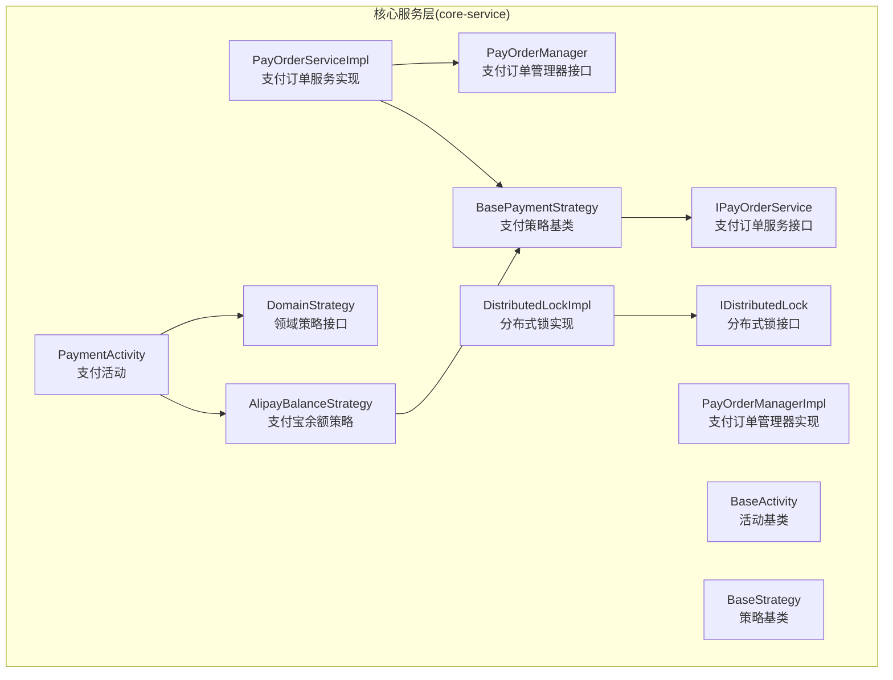
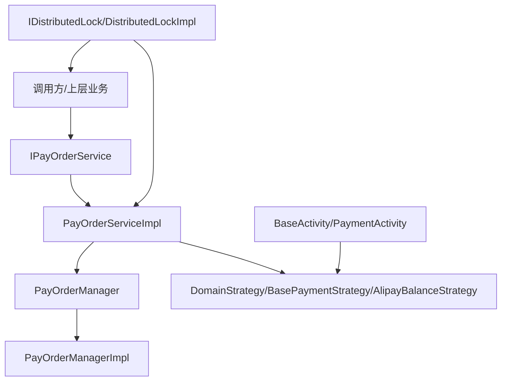
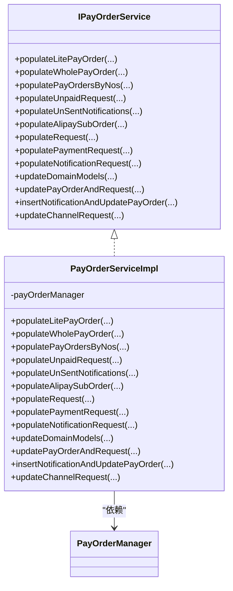
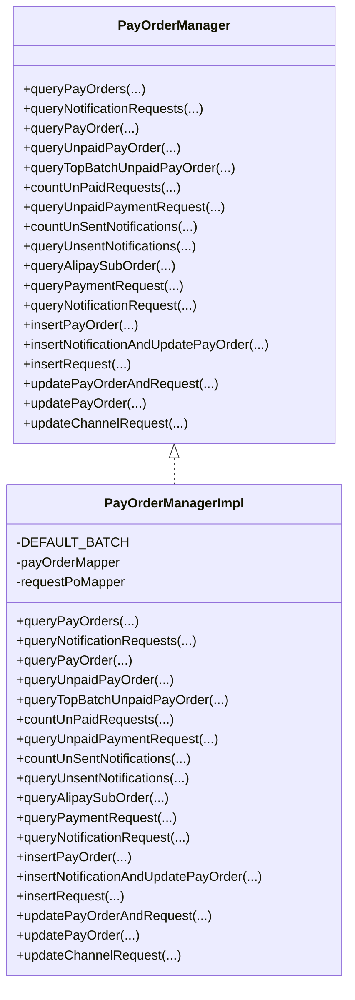
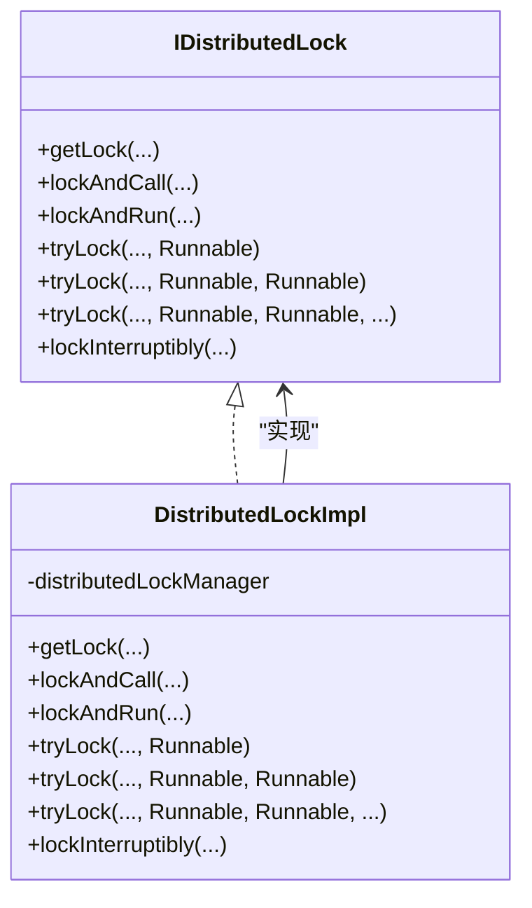
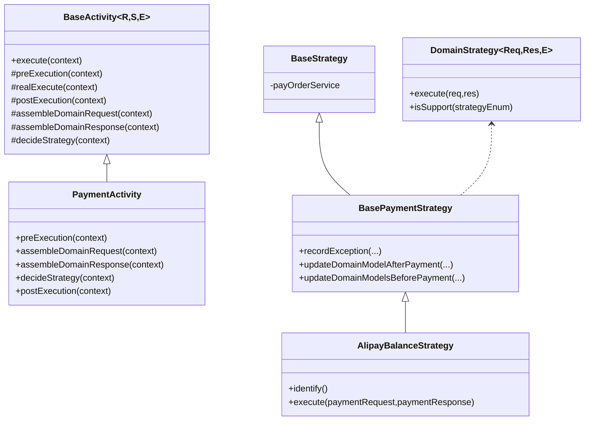
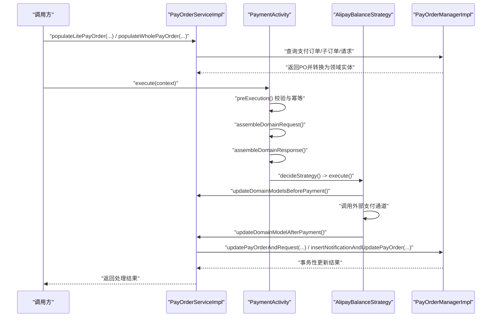
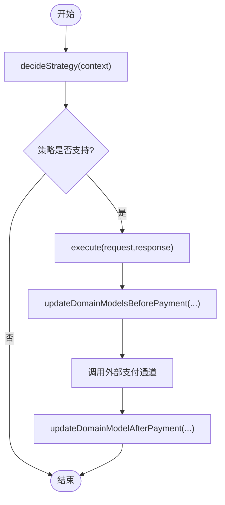
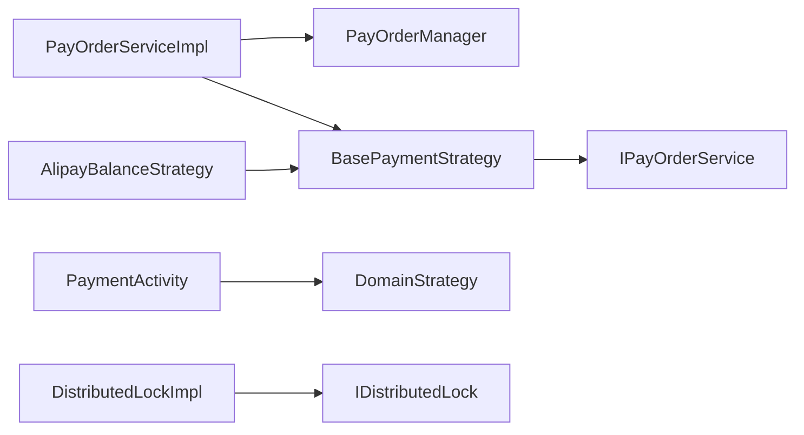

# 核心服务层

<cite>
**本文引用的文件**
- [IPayOrderService.java](file://core-service/src/main/java/com/magicliang/transaction/sys/core/service/IPayOrderService.java)
- [PayOrderServiceImpl.java](file://core-service/src/main/java/com/magicliang/transaction/sys/core/service/impl/PayOrderServiceImpl.java)
- [PayOrderManager.java](file://core-service/src/main/java/com/magicliang/transaction/sys/core/manager/PayOrderManager.java)
- [PayOrderManagerImpl.java](file://core-service/src/main/java/com/magicliang/transaction/sys/core/manager/impl/PayOrderManagerImpl.java)
- [IDistributedLock.java](file://core-service/src/main/java/com/magicliang/transaction/sys/core/service/IDistributedLock.java)
- [DistributedLockImpl.java](file://core-service/src/main/java/com/magicliang/transaction/sys/core/service/impl/DistributedLockImpl.java)
- [BaseActivity.java](file://core-service/src/main/java/com/magicliang/transaction/sys/core/domain/activity/BaseActivity.java)
- [PaymentActivity.java](file://core-service/src/main/java/com/magicliang/transaction/sys/core/domain/activity/payment/PaymentActivity.java)
- [BaseStrategy.java](file://core-service/src/main/java/com/magicliang/transaction/sys/core/domain/strategy/BaseStrategy.java)
- [DomainStrategy.java](file://core-service/src/main/java/com/magicliang/transaction/sys/core/domain/strategy/DomainStrategy.java)
- [BasePaymentStrategy.java](file://core-service/src/main/java/com/magicliang/transaction/sys/core/domain/strategy/payment/BasePaymentStrategy.java)
- [AlipayBalanceStrategy.java](file://core-service/src/main/java/com/magicliang/transaction/sys/core/domain/strategy/payment/AlipayBalanceStrategy.java)
</cite>

## 目录
1. [简介](#简介)
2. [项目结构](#项目结构)
3. [核心组件](#核心组件)
4. [架构总览](#架构总览)
5. [详细组件分析](#详细组件分析)
6. [依赖分析](#依赖分析)
7. [性能考量](#性能考量)
8. [故障排查指南](#故障排查指南)
9. [结论](#结论)
10. [附录](#附录)

## 简介
本章节面向“核心服务层”，聚焦于 core-service 模块的业务逻辑核心实现，系统性阐述以下主题：
- 服务接口设计与职责边界：以 IPayOrderService 为核心，说明支付订单服务的领域能力与契约。
- 活动模式在业务流程编排中的应用：通过 BaseActivity 与 PaymentActivity，展示如何以“活动”为单位组织跨子系统的流程编排。
- 策略模式实现与支付渠道动态切换：以 BaseStrategy/DomainStrategy 为基础，结合 BasePaymentStrategy 与 AlipayBalanceStrategy，演示如何按策略点动态选择支付策略。
- 分布式锁的实现与使用：IDistributedLock 接口与 DistributedLockImpl 的实现，支撑高并发下的幂等与一致性。
- 业务活动生命周期管理：从模型装载、前置/后置钩子、策略执行到结果回填的完整生命周期。
- 业务流程示例：从订单创建到支付完成的端到端处理流程。

## 项目结构
core-service 模块采用“服务层 + 管理器层 + 领域活动与策略 + 分布式锁”的分层设计：
- 服务层：对外暴露业务能力，负责领域模型的装载、更新与事务协调。
- 管理器层：封装数据访问与事务控制，屏蔽持久化细节。
- 领域活动与策略：以 BaseActivity 为骨架，通过策略点驱动具体策略执行。
- 分布式锁：提供统一的分布式锁抽象与实现，保障并发安全。

图表来源
- [IPayOrderService.java:16-156](file://core-service/src/main/java/com/magicliang/transaction/sys/core/service/IPayOrderService.java#L16-L156)
- [PayOrderServiceImpl.java:43-460](file://core-service/src/main/java/com/magicliang/transaction/sys/core/service/impl/PayOrderServiceImpl.java#L43-L460)
- [PayOrderManager.java:18-186](file://core-service/src/main/java/com/magicliang/transaction/sys/core/manager/PayOrderManager.java#L18-L186)
- [PayOrderManagerImpl.java:41-526](file://core-service/src/main/java/com/magicliang/transaction/sys/core/manager/impl/PayOrderManagerImpl.java#L41-L526)
- [BaseActivity.java:28-139](file://core-service/src/main/java/com/magicliang/transaction/sys/core/domain/activity/BaseActivity.java#L28-L139)
- [PaymentActivity.java:38-202](file://core-service/src/main/java/com/magicliang/transaction/sys/core/domain/activity/payment/PaymentActivity.java#L38-L202)
- [BaseStrategy.java:15-23](file://core-service/src/main/java/com/magicliang/transaction/sys/core/domain/strategy/BaseStrategy.java#L15-L23)
- [DomainStrategy.java:16-37](file://core-service/src/main/java/com/magicliang/transaction/sys/core/domain/strategy/DomainStrategy.java#L16-L37)
- [BasePaymentStrategy.java:28-93](file://core-service/src/main/java/com/magicliang/transaction/sys/core/domain/strategy/payment/BasePaymentStrategy.java#L28-L93)
- [AlipayBalanceStrategy.java:32-138](file://core-service/src/main/java/com/magicliang/transaction/sys/core/domain/strategy/payment/AlipayBalanceStrategy.java#L32-L138)
- [IDistributedLock.java:16-97](file://core-service/src/main/java/com/magicliang/transaction/sys/core/service/IDistributedLock.java#L16-L97)
- [DistributedLockImpl.java:26-275](file://core-service/src/main/java/com/magicliang/transaction/sys/core/service/impl/DistributedLockImpl.java#L26-L275)

章节来源
- [IPayOrderService.java:16-156](file://core-service/src/main/java/com/magicliang/transaction/sys/core/service/IPayOrderService.java#L16-L156)
- [PayOrderServiceImpl.java:43-460](file://core-service/src/main/java/com/magicliang/transaction/sys/core/service/impl/PayOrderServiceImpl.java#L43-L460)
- [PayOrderManager.java:18-186](file://core-service/src/main/java/com/magicliang/transaction/sys/core/manager/PayOrderManager.java#L18-L186)
- [PayOrderManagerImpl.java:41-526](file://core-service/src/main/java/com/magicliang/transaction/sys/core/manager/impl/PayOrderManagerImpl.java#L41-L526)
- [BaseActivity.java:28-139](file://core-service/src/main/java/com/magicliang/transaction/sys/core/domain/activity/BaseActivity.java#L28-L139)
- [PaymentActivity.java:38-202](file://core-service/src/main/java/com/magicliang/transaction/sys/core/domain/activity/payment/PaymentActivity.java#L38-L202)
- [BaseStrategy.java:15-23](file://core-service/src/main/java/com/magicliang/transaction/sys/core/domain/strategy/BaseStrategy.java#L15-L23)
- [DomainStrategy.java:16-37](file://core-service/src/main/java/com/magicliang/transaction/sys/core/domain/strategy/DomainStrategy.java#L16-L37)
- [BasePaymentStrategy.java:28-93](file://core-service/src/main/java/com/magicliang/transaction/sys/core/domain/strategy/payment/BasePaymentStrategy.java#L28-L93)
- [AlipayBalanceStrategy.java:32-138](file://core-service/src/main/java/com/magicliang/transaction/sys/core/domain/strategy/payment/AlipayBalanceStrategy.java#L32-L138)
- [IDistributedLock.java:16-97](file://core-service/src/main/java/com/magicliang/transaction/sys/core/service/IDistributedLock.java#L16-L97)
- [DistributedLockImpl.java:26-275](file://core-service/src/main/java/com/magicliang/transaction/sys/core/service/impl/DistributedLockImpl.java#L26-L275)

## 核心组件
- 支付订单服务接口与实现
  - IPayOrderService：定义支付订单的装载、填充、计数、弹出子订单、请求填充、更新与事务性写入等能力。
  - PayOrderServiceImpl：实现上述接口，负责将 PO/实体转换为领域模型，填充子订单与请求，维护通知请求的生成时机，并在事务内更新支付订单与请求。
- 支付订单管理器接口与实现
  - PayOrderManager：定义查询、计数、分页查询、插入与更新等数据访问能力。
  - PayOrderManagerImpl：提供分页与分区查询、事务性更新与插入、占位实现（注释提示后续完善）。
- 分布式锁服务接口与实现
  - IDistributedLock：提供多种加锁与执行方式（阻塞、可中断、定时试锁、带回退回调等）。
  - DistributedLockImpl：基于底层分布式锁管理器实现，提供日志与异常包装。
- 领域活动与策略
  - BaseActivity：活动骨架，包含前置/真实/后置三阶段执行与策略点决策。
  - PaymentActivity：支付活动，负责支付前状态迁移、请求组装、策略点决策与后置校验。
  - BaseStrategy/DomainStrategy/BasePaymentStrategy：策略抽象与支付策略基类，提供异常记录、支付前后模型更新等通用逻辑。
  - AlipayBalanceStrategy：具体策略，对接外部支付通道，记录请求/响应并更新领域模型状态。

章节来源
- [IPayOrderService.java:16-156](file://core-service/src/main/java/com/magicliang/transaction/sys/core/service/IPayOrderService.java#L16-L156)
- [PayOrderServiceImpl.java:43-460](file://core-service/src/main/java/com/magicliang/transaction/sys/core/service/impl/PayOrderServiceImpl.java#L43-L460)
- [PayOrderManager.java:18-186](file://core-service/src/main/java/com/magicliang/transaction/sys/core/manager/PayOrderManager.java#L18-L186)
- [PayOrderManagerImpl.java:41-526](file://core-service/src/main/java/com/magicliang/transaction/sys/core/manager/impl/PayOrderManagerImpl.java#L41-L526)
- [IDistributedLock.java:16-97](file://core-service/src/main/java/com/magicliang/transaction/sys/core/service/IDistributedLock.java#L16-L97)
- [DistributedLockImpl.java:26-275](file://core-service/src/main/java/com/magicliang/transaction/sys/core/service/impl/DistributedLockImpl.java#L26-L275)
- [BaseActivity.java:28-139](file://core-service/src/main/java/com/magicliang/transaction/sys/core/domain/activity/BaseActivity.java#L28-L139)
- [PaymentActivity.java:38-202](file://core-service/src/main/java/com/magicliang/transaction/sys/core/domain/activity/payment/PaymentActivity.java#L38-L202)
- [BaseStrategy.java:15-23](file://core-service/src/main/java/com/magicliang/transaction/sys/core/domain/strategy/BaseStrategy.java#L15-L23)
- [DomainStrategy.java:16-37](file://core-service/src/main/java/com/magicliang/transaction/sys/core/domain/strategy/DomainStrategy.java#L16-L37)
- [BasePaymentStrategy.java:28-93](file://core-service/src/main/java/com/magicliang/transaction/sys/core/domain/strategy/payment/BasePaymentStrategy.java#L28-L93)
- [AlipayBalanceStrategy.java:32-138](file://core-service/src/main/java/com/magicliang/transaction/sys/core/domain/strategy/payment/AlipayBalanceStrategy.java#L32-L138)

## 架构总览
核心服务层通过“服务层-管理器层-活动与策略-锁”的分层协作，形成清晰的职责边界与扩展点：
- 服务层负责领域模型的装载与更新，协调事务与通知请求生成。
- 管理器层负责数据访问与事务控制，提供分页与分区查询能力。
- 活动层负责流程编排与策略点决策，策略层负责具体渠道实现。
- 锁层提供并发控制与幂等保障。

图表来源
- [PayOrderServiceImpl.java:43-460](file://core-service/src/main/java/com/magicliang/transaction/sys/core/service/impl/PayOrderServiceImpl.java#L43-L460)
- [PayOrderManagerImpl.java:41-526](file://core-service/src/main/java/com/magicliang/transaction/sys/core/manager/impl/PayOrderManagerImpl.java#L41-L526)
- [BaseActivity.java:28-139](file://core-service/src/main/java/com/magicliang/transaction/sys/core/domain/activity/BaseActivity.java#L28-L139)
- [PaymentActivity.java:38-202](file://core-service/src/main/java/com/magicliang/transaction/sys/core/domain/activity/payment/PaymentActivity.java#L38-L202)
- [BasePaymentStrategy.java:28-93](file://core-service/src/main/java/com/magicliang/transaction/sys/core/domain/strategy/payment/BasePaymentStrategy.java#L28-L93)
- [AlipayBalanceStrategy.java:32-138](file://core-service/src/main/java/com/magicliang/transaction/sys/core/domain/strategy/payment/AlipayBalanceStrategy.java#L32-L138)
- [DistributedLockImpl.java:26-275](file://core-service/src/main/java/com/magicliang/transaction/sys/core/service/impl/DistributedLockImpl.java#L26-L275)

## 详细组件分析

### 支付订单服务接口与实现
- 设计要点
  - 轻量级与完整模型填充：支持仅填充支付订单主干或进一步填充子订单与请求。
  - 请求与通知的批量查询与计数：支持按环境与批次大小查询未支付请求与未发送通知。
  - 子订单与请求的弹出与填充：确保在不同阶段按需加载子订单与请求。
  - 事务性更新：提供“插入通知并更新支付订单”与“更新支付订单与请求”的事务接口。
- 实现要点
  - 统一使用转换器将 PO 转为领域实体，保证模型一致性。
  - 在更新前设置时间戳与重试次数，确保调度与可观测性。
  - 根据业务规则决定是否生成通知请求，并在事务内完成插入与更新。

图表来源
- [IPayOrderService.java:16-156](file://core-service/src/main/java/com/magicliang/transaction/sys/core/service/IPayOrderService.java#L16-L156)
- [PayOrderServiceImpl.java:43-460](file://core-service/src/main/java/com/magicliang/transaction/sys/core/service/impl/PayOrderServiceImpl.java#L43-L460)

章节来源
- [IPayOrderService.java:16-156](file://core-service/src/main/java/com/magicliang/transaction/sys/core/service/IPayOrderService.java#L16-L156)
- [PayOrderServiceImpl.java:43-460](file://core-service/src/main/java/com/magicliang/transaction/sys/core/service/impl/PayOrderServiceImpl.java#L43-L460)

### 支付订单管理器接口与实现
- 设计要点
  - 查询与计数：支持按环境与状态查询未支付订单与请求，提供分页与分区查询能力。
  - 事务性操作：提供插入支付订单与请求、插入通知并更新支付订单、更新支付订单与请求等事务接口。
- 实现要点
  - 分页查询通过 PageHelper 与自定义分页工具实现，避免一次性加载大量数据。
  - 分区查询将长列表拆分为固定批次，降低单次查询压力。
  - 占位实现注释提示后续完善，当前返回布尔值以满足编译与契约。

图表来源
- [PayOrderManager.java:18-186](file://core-service/src/main/java/com/magicliang/transaction/sys/core/manager/PayOrderManager.java#L18-L186)
- [PayOrderManagerImpl.java:41-526](file://core-service/src/main/java/com/magicliang/transaction/sys/core/manager/impl/PayOrderManagerImpl.java#L41-L526)

章节来源
- [PayOrderManager.java:18-186](file://core-service/src/main/java/com/magicliang/transaction/sys/core/manager/PayOrderManager.java#L18-L186)
- [PayOrderManagerImpl.java:41-526](file://core-service/src/main/java/com/magicliang/transaction/sys/core/manager/impl/PayOrderManagerImpl.java#L41-L526)

### 分布式锁服务接口与实现
- 设计要点
  - 多种加锁与执行模式：阻塞、可中断、定时试锁、带回退回调等。
  - 生命周期钩子：在加锁前、加锁中、解锁后与回退时提供日志与回调。
- 实现要点
  - 参数校验与异常包装，确保非法参数与异常传播的一致性。
  - 委托底层分布式锁管理器获取可重入锁，保证线程安全。

图表来源
- [IDistributedLock.java:16-97](file://core-service/src/main/java/com/magicliang/transaction/sys/core/service/IDistributedLock.java#L16-L97)
- [DistributedLockImpl.java:26-275](file://core-service/src/main/java/com/magicliang/transaction/sys/core/service/impl/DistributedLockImpl.java#L26-L275)

章节来源
- [IDistributedLock.java:16-97](file://core-service/src/main/java/com/magicliang/transaction/sys/core/service/IDistributedLock.java#L16-L97)
- [DistributedLockImpl.java:26-275](file://core-service/src/main/java/com/magicliang/transaction/sys/core/service/impl/DistributedLockImpl.java#L26-L275)

### 活动模式与策略模式
- 活动模式
  - BaseActivity：定义 preExecution/realExecute/postExecution 三阶段，策略点决策在 realExecute 中进行。
  - PaymentActivity：在 preExecution 中进行前置校验（模型非空、状态未达终态、策略点有效），在 postExecution 中进行后置校验与状态迁移。
- 策略模式
  - BaseStrategy/DomainStrategy：策略接口与基类，策略通过 identify() 与 isSupport() 决定是否激活。
  - BasePaymentStrategy：支付策略基类，提供异常记录、支付前后模型更新等通用逻辑。
  - AlipayBalanceStrategy：具体策略，组装请求参数、调用外部支付通道、记录响应与异常，并更新领域模型状态。

图表来源
- [BaseActivity.java:28-139](file://core-service/src/main/java/com/magicliang/transaction/sys/core/domain/activity/BaseActivity.java#L28-L139)
- [PaymentActivity.java:38-202](file://core-service/src/main/java/com/magicliang/transaction/sys/core/domain/activity/payment/PaymentActivity.java#L38-L202)
- [DomainStrategy.java:16-37](file://core-service/src/main/java/com/magicliang/transaction/sys/core/domain/strategy/DomainStrategy.java#L16-L37)
- [BaseStrategy.java:15-23](file://core-service/src/main/java/com/magicliang/transaction/sys/core/domain/strategy/BaseStrategy.java#L15-L23)
- [BasePaymentStrategy.java:28-93](file://core-service/src/main/java/com/magicliang/transaction/sys/core/domain/strategy/payment/BasePaymentStrategy.java#L28-L93)
- [AlipayBalanceStrategy.java:32-138](file://core-service/src/main/java/com/magicliang/transaction/sys/core/domain/strategy/payment/AlipayBalanceStrategy.java#L32-L138)

章节来源
- [BaseActivity.java:28-139](file://core-service/src/main/java/com/magicliang/transaction/sys/core/domain/activity/BaseActivity.java#L28-L139)
- [PaymentActivity.java:38-202](file://core-service/src/main/java/com/magicliang/transaction/sys/core/domain/activity/payment/PaymentActivity.java#L38-L202)
- [DomainStrategy.java:16-37](file://core-service/src/main/java/com/magicliang/transaction/sys/core/domain/strategy/DomainStrategy.java#L16-L37)
- [BaseStrategy.java:15-23](file://core-service/src/main/java/com/magicliang/transaction/sys/core/domain/strategy/BaseStrategy.java#L15-L23)
- [BasePaymentStrategy.java:28-93](file://core-service/src/main/java/com/magicliang/transaction/sys/core/domain/strategy/payment/BasePaymentStrategy.java#L28-L93)
- [AlipayBalanceStrategy.java:32-138](file://core-service/src/main/java/com/magicliang/transaction/sys/core/domain/strategy/payment/AlipayBalanceStrategy.java#L32-L138)

### 支付流程时序图（从订单创建到支付完成）
该时序图展示一次支付请求从活动编排到策略执行再到模型更新的完整过程。

图表来源
- [PayOrderServiceImpl.java:43-460](file://core-service/src/main/java/com/magicliang/transaction/sys/core/service/impl/PayOrderServiceImpl.java#L43-L460)
- [PaymentActivity.java:38-202](file://core-service/src/main/java/com/magicliang/transaction/sys/core/domain/activity/payment/PaymentActivity.java#L38-L202)
- [AlipayBalanceStrategy.java:32-138](file://core-service/src/main/java/com/magicliang/transaction/sys/core/domain/strategy/payment/AlipayBalanceStrategy.java#L32-L138)
- [PayOrderManagerImpl.java:41-526](file://core-service/src/main/java/com/magicliang/transaction/sys/core/manager/impl/PayOrderManagerImpl.java#L41-L526)

章节来源
- [PayOrderServiceImpl.java:43-460](file://core-service/src/main/java/com/magicliang/transaction/sys/core/service/impl/PayOrderServiceImpl.java#L43-L460)
- [PaymentActivity.java:38-202](file://core-service/src/main/java/com/magicliang/transaction/sys/core/domain/activity/payment/PaymentActivity.java#L38-L202)
- [AlipayBalanceStrategy.java:32-138](file://core-service/src/main/java/com/magicliang/transaction/sys/core/domain/strategy/payment/AlipayBalanceStrategy.java#L32-L138)
- [PayOrderManagerImpl.java:41-526](file://core-service/src/main/java/com/magicliang/transaction/sys/core/manager/impl/PayOrderManagerImpl.java#L41-L526)

### 支付策略执行流程（策略模式）
该流程图展示策略选择与执行的关键路径，强调策略点决策与异常处理。

图表来源
- [PaymentActivity.java:129-133](file://core-service/src/main/java/com/magicliang/transaction/sys/core/domain/activity/payment/PaymentActivity.java#L129-L133)
- [BasePaymentStrategy.java:71-90](file://core-service/src/main/java/com/magicliang/transaction/sys/core/domain/strategy/payment/BasePaymentStrategy.java#L71-L90)
- [AlipayBalanceStrategy.java:56-81](file://core-service/src/main/java/com/magicliang/transaction/sys/core/domain/strategy/payment/AlipayBalanceStrategy.java#L56-L81)

章节来源
- [PaymentActivity.java:129-133](file://core-service/src/main/java/com/magicliang/transaction/sys/core/domain/activity/payment/PaymentActivity.java#L129-L133)
- [BasePaymentStrategy.java:71-90](file://core-service/src/main/java/com/magicliang/transaction/sys/core/domain/strategy/payment/BasePaymentStrategy.java#L71-L90)
- [AlipayBalanceStrategy.java:56-81](file://core-service/src/main/java/com/magicliang/transaction/sys/core/domain/strategy/payment/AlipayBalanceStrategy.java#L56-L81)

## 依赖分析
- 服务层与管理器层
  - PayOrderServiceImpl 依赖 PayOrderManager 接口，通过注入实现解耦与可测试性。
  - 管理器实现提供分页与分区查询，避免大数据量查询带来的性能问题。
- 活动与策略层
  - PaymentActivity 通过构造注入获取多个 DomainStrategy 实现，运行时按策略点决策选择具体策略。
  - BasePaymentStrategy 依赖 IPayOrderService，确保策略执行前后对领域模型的更新。
- 分布式锁
  - DistributedLockImpl 依赖底层分布式锁管理器，提供统一的加锁与执行接口，便于在高并发场景下保证幂等。

图表来源
- [PayOrderServiceImpl.java:43-460](file://core-service/src/main/java/com/magicliang/transaction/sys/core/service/impl/PayOrderServiceImpl.java#L43-L460)
- [PayOrderManager.java:18-186](file://core-service/src/main/java/com/magicliang/transaction/sys/core/manager/PayOrderManager.java#L18-L186)
- [BasePaymentStrategy.java:28-93](file://core-service/src/main/java/com/magicliang/transaction/sys/core/domain/strategy/payment/BasePaymentStrategy.java#L28-L93)
- [PaymentActivity.java:38-202](file://core-service/src/main/java/com/magicliang/transaction/sys/core/domain/activity/payment/PaymentActivity.java#L38-L202)
- [AlipayBalanceStrategy.java:32-138](file://core-service/src/main/java/com/magicliang/transaction/sys/core/domain/strategy/payment/AlipayBalanceStrategy.java#L32-L138)
- [DistributedLockImpl.java:26-275](file://core-service/src/main/java/com/magicliang/transaction/sys/core/service/impl/DistributedLockImpl.java#L26-L275)

章节来源
- [PayOrderServiceImpl.java:43-460](file://core-service/src/main/java/com/magicliang/transaction/sys/core/service/impl/PayOrderServiceImpl.java#L43-L460)
- [PayOrderManager.java:18-186](file://core-service/src/main/java/com/magicliang/transaction/sys/core/manager/PayOrderManager.java#L18-L186)
- [BasePaymentStrategy.java:28-93](file://core-service/src/main/java/com/magicliang/transaction/sys/core/domain/strategy/payment/BasePaymentStrategy.java#L28-L93)
- [PaymentActivity.java:38-202](file://core-service/src/main/java/com/magicliang/transaction/sys/core/domain/activity/payment/PaymentActivity.java#L38-L202)
- [AlipayBalanceStrategy.java:32-138](file://core-service/src/main/java/com/magicliang/transaction/sys/core/domain/strategy/payment/AlipayBalanceStrategy.java#L32-L138)
- [DistributedLockImpl.java:26-275](file://core-service/src/main/java/com/magicliang/transaction/sys/core/service/impl/DistributedLockImpl.java#L26-L275)

## 性能考量
- 分页与分区查询
  - 管理器层通过 DEFAULT_BATCH 控制单次查询规模，避免一次性加载大量数据导致的内存与锁竞争。
  - 分页查询结合 PageHelper 与自定义分页工具，减少排序与回表开销。
- 事务性更新
  - 服务层在更新前设置时间戳与重试次数，确保调度与可观测性；在事务内完成插入通知与更新支付订单，减少重复查询。
- 并发控制
  - 分布式锁提供多种加锁方式，避免高并发下的重复执行与资源竞争。

## 故障排查指南
- 支付订单状态异常
  - 检查 PaymentActivity 的前置校验与状态迁移逻辑，确认支付请求与支付订单的状态是否符合预期。
- 策略执行失败
  - 查看 BasePaymentStrategy 的异常记录逻辑与 AlipayBalanceStrategy 的响应处理，定位外部通道返回的错误码与异常信息。
- 事务更新失败
  - 检查 PayOrderManagerImpl 的事务性更新接口与返回值，确认是否满足“更新一行”的期望。
- 分布式锁问题
  - 检查 DistributedLockImpl 的参数校验与异常包装，确认锁名与过期时间是否合理。

章节来源
- [PaymentActivity.java:52-87](file://core-service/src/main/java/com/magicliang/transaction/sys/core/domain/activity/payment/PaymentActivity.java#L52-L87)
- [BasePaymentStrategy.java:50-64](file://core-service/src/main/java/com/magicliang/transaction/sys/core/domain/strategy/payment/BasePaymentStrategy.java#L50-L64)
- [AlipayBalanceStrategy.java:104-135](file://core-service/src/main/java/com/magicliang/transaction/sys/core/domain/strategy/payment/AlipayBalanceStrategy.java#L104-L135)
- [PayOrderManagerImpl.java:295-302](file://core-service/src/main/java/com/magicliang/transaction/sys/core/manager/impl/PayOrderManagerImpl.java#L295-L302)
- [DistributedLockImpl.java:42-83](file://core-service/src/main/java/com/magicliang/transaction/sys/core/service/impl/DistributedLockImpl.java#L42-L83)

## 结论
core-service 模块通过清晰的分层设计与可扩展的活动/策略机制，实现了支付订单服务的高内聚低耦合。服务层与管理器层的职责划分、活动与策略的解耦、以及分布式锁的并发控制，共同构成了稳定可靠的业务核心。建议在后续迭代中逐步完善管理器层的占位实现，并持续优化分页与分区查询策略，以应对更大规模的数据访问需求。

## 附录
- 术语
  - 领域模型：由 PO 转换而来的实体，承载业务状态与行为。
  - 活动：以流程为导向的编排单元，包含前置/真实/后置三阶段。
  - 策略：根据策略点动态选择的具体实现，具备可插拔特性。
  - 分布式锁：在分布式环境下提供互斥访问的锁抽象。