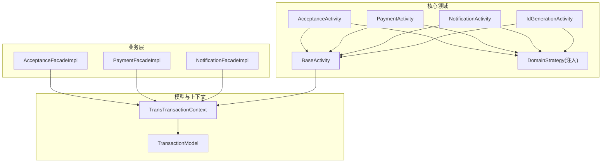
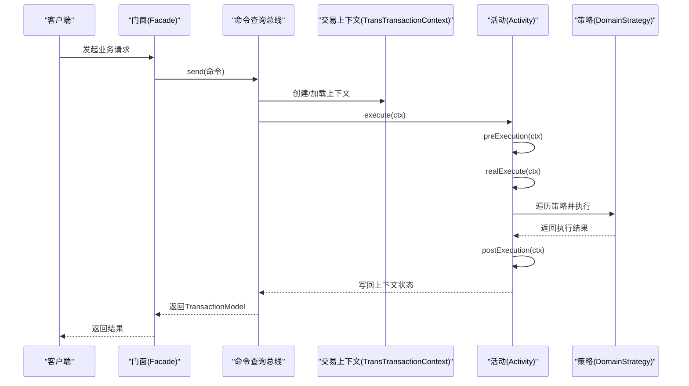
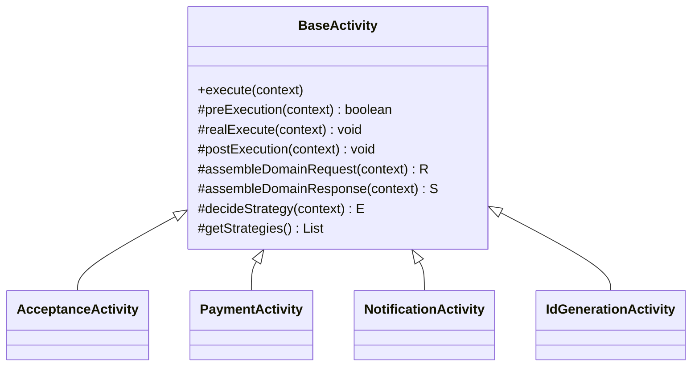
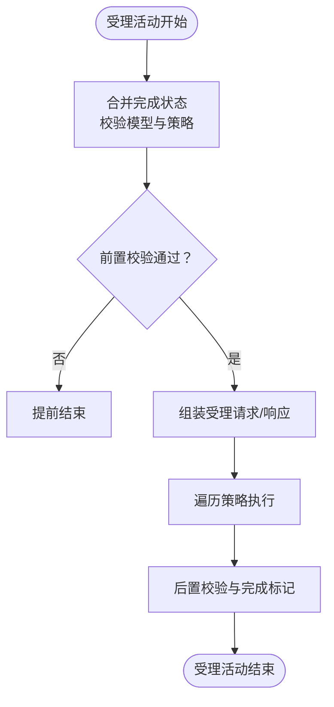
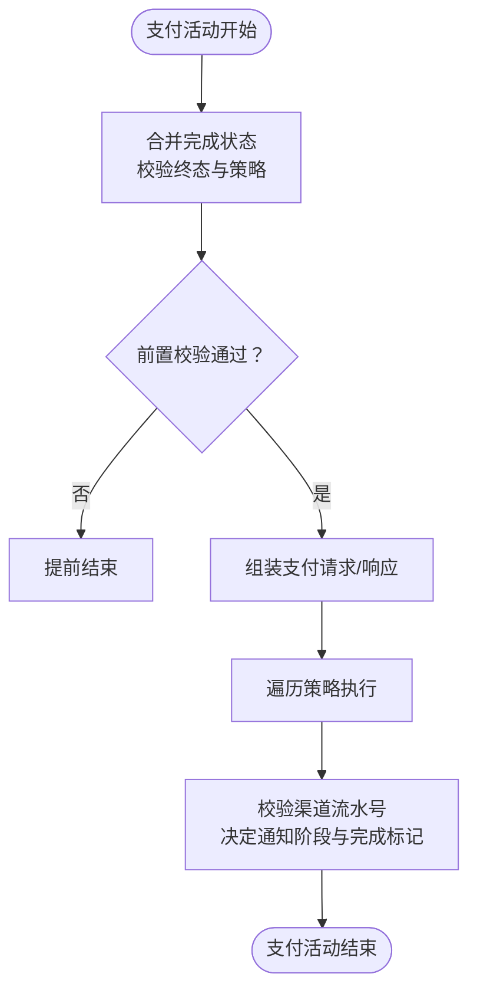
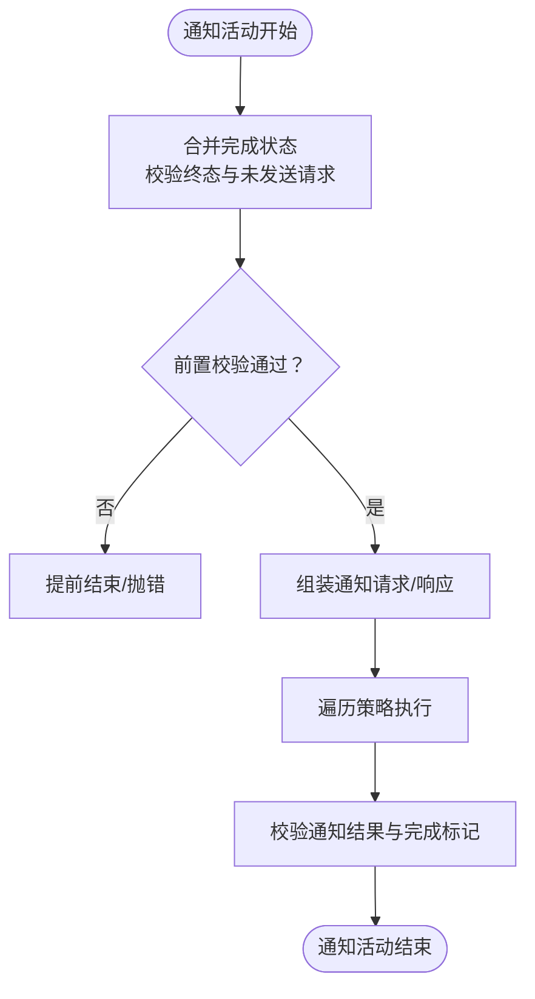
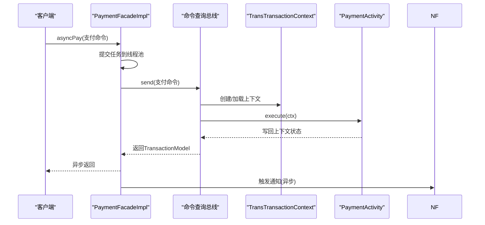
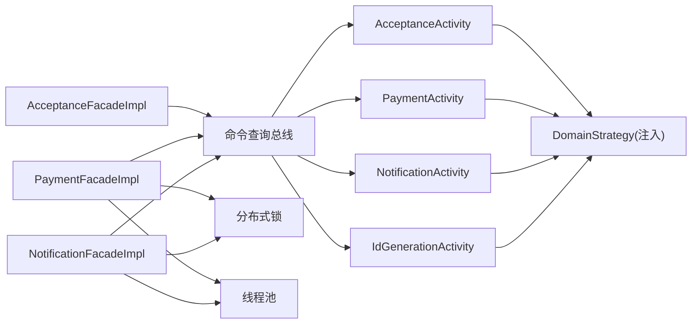

# 活动模式实现

<cite>
**本文引用的文件**
- [BaseActivity.java](file://core-service/src/main/java/com/magicliang/transaction/sys/core/domain/activity/BaseActivity.java)
- [AcceptanceActivity.java](file://core-service/src/main/java/com/magicliang/transaction/sys/core/domain/activity/acceptance/AcceptanceActivity.java)
- [PaymentActivity.java](file://core-service/src/main/java/com/magicliang/transaction/sys/core/domain/activity/payment/PaymentActivity.java)
- [NotificationActivity.java](file://core-service/src/main/java/com/magicliang/transaction/sys/core/domain/activity/notification/NotificationActivity.java)
- [IdGenerationActivity.java](file://core-service/src/main/java/com/magicliang/transaction/sys/core/domain/activity/idgeneration/IdGenerationActivity.java)
- [AcceptanceFacadeImpl.java](file://biz-service-impl/src/main/java/com/magicliang/transaction/sys/biz/service/impl/facade/impl/AcceptanceFacadeImpl.java)
- [PaymentFacadeImpl.java](file://biz-service-impl/src/main/java/com/magicliang/transaction/sys/biz/service/impl/facade/impl/PaymentFacadeImpl.java)
- [NotificationFacadeImpl.java](file://biz-service-impl/src/main/java/com/magicliang/transaction/sys/biz/service/impl/facade/impl/NotificationFacadeImpl.java)
- [AbstractFacade.java](file://biz-service-impl/src/main/java/com/magicliang/transaction/sys/biz/service/impl/facade/impl/AbstractFacade.java)
- [BaseStrategy.java](file://core-service/src/main/java/com/magicliang/transaction/sys/core/domain/strategy/BaseStrategy.java)
- [TransTransactionContext.java](file://core-model/src/main/java/com/magicliang/transaction/sys/core/model/context/TransTransactionContext.java)
- [TransactionModel.java](file://core-model/src/main/java/com/magicliang/transaction/sys/core/model/context/TransactionModel.java)
</cite>

## 目录
1. [简介](#简介)
2. [项目结构](#项目结构)
3. [核心组件](#核心组件)
4. [架构总览](#架构总览)
5. [详细组件分析](#详细组件分析)
6. [依赖分析](#依赖分析)
7. [性能考虑](#性能考虑)
8. [故障排查指南](#故障排查指南)
9. [结论](#结论)
10. [附录](#附录)

## 简介
本文件围绕“活动模式”在领域驱动交易系统中的实现进行系统化说明，重点阐述 BaseActivity 基类的设计思想与职责边界，以及 AcceptanceActivity、PaymentActivity、NotificationActivity 等核心业务活动的执行流程、状态管理与异常处理机制。文档同时解释活动模式如何实现业务流程的封装与复用，如何通过上下文对象 TransTransactionContext 实现跨活动的数据传递与状态同步，并给出从业务受理到支付完成的完整编排示例。

## 项目结构
本项目采用多模块分层组织，其中与活动模式直接相关的核心代码位于以下模块：
- core-service：核心领域服务与活动实现（含 BaseActivity 与各 Activity）
- core-model：领域模型与上下文定义（含 TransTransactionContext、TransactionModel）
- biz-service-impl：业务门面实现（Facade），负责编排与并发控制
- core-domain-strategy：策略层（Strategy），由各 Activity 注入并按策略点执行

图表来源
- [BaseActivity.java:28-139](file://core-service/src/main/java/com/magicliang/transaction/sys/core/domain/activity/BaseActivity.java#L28-L139)
- [AcceptanceActivity.java:43-198](file://core-service/src/main/java/com/magicliang/transaction/sys/core/domain/activity/acceptance/AcceptanceActivity.java#L43-L198)
- [PaymentActivity.java:38-202](file://core-service/src/main/java/com/magicliang/transaction/sys/core/domain/activity/payment/PaymentActivity.java#L38-L202)
- [NotificationActivity.java:42-183](file://core-service/src/main/java/com/magicliang/transaction/sys/core/domain/activity/notification/NotificationActivity.java#L42-L183)
- [IdGenerationActivity.java:37-163](file://core-service/src/main/java/com/magicliang/transaction/sys/core/domain/activity/idgeneration/IdGenerationActivity.java#L37-L163)
- [TransTransactionContext.java](file://core-model/src/main/java/com/magicliang/transaction/sys/core/model/context/TransTransactionContext.java)
- [TransactionModel.java](file://core-model/src/main/java/com/magicliang/transaction/sys/core/model/context/TransactionModel.java)

章节来源
- [BaseActivity.java:28-139](file://core-service/src/main/java/com/magicliang/transaction/sys/core/domain/activity/BaseActivity.java#L28-L139)
- [AcceptanceActivity.java:43-198](file://core-service/src/main/java/com/magicliang/transaction/sys/core/domain/activity/acceptance/AcceptanceActivity.java#L43-L198)
- [PaymentActivity.java:38-202](file://core-service/src/main/java/com/magicliang/transaction/sys/core/domain/activity/payment/PaymentActivity.java#L38-L202)
- [NotificationActivity.java:42-183](file://core-service/src/main/java/com/magicliang/transaction/sys/core/domain/activity/notification/NotificationActivity.java#L42-L183)
- [IdGenerationActivity.java:37-163](file://core-service/src/main/java/com/magicliang/transaction/sys/core/domain/activity/idgeneration/IdGenerationActivity.java#L37-L163)
- [TransTransactionContext.java](file://core-model/src/main/java/com/magicliang/transaction/sys/core/model/context/TransTransactionContext.java)
- [TransactionModel.java](file://core-model/src/main/java/com/magicliang/transaction/sys/core/model/context/TransactionModel.java)

## 核心组件
- BaseActivity：活动基类，定义统一的 execute 生命周期（前置钩子 → 真执行 → 后置钩子），并抽象出组装请求/响应、策略点决策与策略集合注入等职责。
- AcceptanceActivity：受理活动，负责支付单据的初始建模与幂等校验，完成后标记受理完成。
- PaymentActivity：支付活动，负责支付请求的状态迁移与幂等校验，完成后根据支付结果决定是否进入通知阶段。
- NotificationActivity：通知活动，负责对已达成终态的支付单据进行下游通知，完成后标记通知完成。
- IdGenerationActivity：ID 生成活动，负责为受理阶段生成全局唯一支付单号并回填至模型。
- Facade 层：门面实现（AcceptanceFacadeImpl、PaymentFacadeImpl、NotificationFacadeImpl）负责编排、并发与锁控制，并通过命令查询总线触发活动执行。
- 上下文与模型：TransTransactionContext 统一承载交易上下文与状态位；TransactionModel 封装领域实体与请求/响应对象。

章节来源
- [BaseActivity.java:28-139](file://core-service/src/main/java/com/magicliang/transaction/sys/core/domain/activity/BaseActivity.java#L28-L139)
- [AcceptanceActivity.java:43-198](file://core-service/src/main/java/com/magicliang/transaction/sys/core/domain/activity/acceptance/AcceptanceActivity.java#L43-L198)
- [PaymentActivity.java:38-202](file://core-service/src/main/java/com/magicliang/transaction/sys/core/domain/activity/payment/PaymentActivity.java#L38-L202)
- [NotificationActivity.java:42-183](file://core-service/src/main/java/com/magicliang/transaction/sys/core/domain/activity/notification/NotificationActivity.java#L42-L183)
- [IdGenerationActivity.java:37-163](file://core-service/src/main/java/com/magicliang/transaction/sys/core/domain/activity/idgeneration/IdGenerationActivity.java#L37-L163)
- [AcceptanceFacadeImpl.java:20-33](file://biz-service-impl/src/main/java/com/magicliang/transaction/sys/biz/service/impl/facade/impl/AcceptanceFacadeImpl.java#L20-L33)
- [PaymentFacadeImpl.java:34-166](file://biz-service-impl/src/main/java/com/magicliang/transaction/sys/biz/service/impl/facade/impl/PaymentFacadeImpl.java#L34-L166)
- [NotificationFacadeImpl.java:31-127](file://biz-service-impl/src/main/java/com/magicliang/transaction/sys/biz/service/impl/facade/impl/NotificationFacadeImpl.java#L31-L127)
- [AbstractFacade.java:17-37](file://biz-service-impl/src/main/java/com/magicliang/transaction/sys/biz/service/impl/facade/impl/AbstractFacade.java#L17-L37)

## 架构总览
活动模式通过 BaseActivity 统一生命周期与策略分发，结合 Facade 层的编排与并发控制，形成“门面 → 活动 → 策略”的清晰分层。上下文对象 TransTransactionContext 在各环节之间传递状态与数据，确保跨活动的一致性与可追踪性。

图表来源
- [BaseActivity.java:42-84](file://core-service/src/main/java/com/magicliang/transaction/sys/core/domain/activity/BaseActivity.java#L42-L84)
- [AcceptanceActivity.java:56-92](file://core-service/src/main/java/com/magicliang/transaction/sys/core/domain/activity/acceptance/AcceptanceActivity.java#L56-L92)
- [PaymentActivity.java:52-87](file://core-service/src/main/java/com/magicliang/transaction/sys/core/domain/activity/payment/PaymentActivity.java#L52-L87)
- [NotificationActivity.java:55-88](file://core-service/src/main/java/com/magicliang/transaction/sys/core/domain/activity/notification/NotificationActivity.java#L55-L88)
- [TransTransactionContext.java](file://core-model/src/main/java/com/magicliang/transaction/sys/core/model/context/TransTransactionContext.java)

## 详细组件分析

### BaseActivity 基类设计
- 生命周期
  - execute：统一入口，依次调用 preExecution → realExecute → postExecution。
  - preExecution：前置校验与幂等判断，必要时提前结束。
  - realExecute：组装请求/响应，遍历策略集合并执行支持当前策略点的策略。
  - postExecution：后置校验与状态写回。
- 关键抽象
  - assembleDomainRequest/assembleDomainResponse：由子类实现，负责将领域模型转换为请求/响应。
  - decideStrategy：策略点决策，子类实现具体策略选择逻辑。
  - getStrategies：返回策略集合，由 Spring 注入。
- 状态与上下文
  - 使用 TransTransactionContext 保存/读取状态位（如受理/支付/通知完成标志），并在 preExecution 中合并父类与上下文的完成状态，支持外部通过上下文提前终止流程。

图表来源
- [BaseActivity.java:28-139](file://core-service/src/main/java/com/magicliang/transaction/sys/core/domain/activity/BaseActivity.java#L28-L139)
- [AcceptanceActivity.java:43](file://core-service/src/main/java/com/magicliang/transaction/sys/core/domain/activity/acceptance/AcceptanceActivity.java#L43)
- [PaymentActivity.java:38](file://core-service/src/main/java/com/magicliang/transaction/sys/core/domain/activity/payment/PaymentActivity.java#L38)
- [NotificationActivity.java:42](file://core-service/src/main/java/com/magicliang/transaction/sys/core/domain/activity/notification/NotificationActivity.java#L42)
- [IdGenerationActivity.java:37](file://core-service/src/main/java/com/magicliang/transaction/sys/core/domain/activity/idgeneration/IdGenerationActivity.java#L37)

章节来源
- [BaseActivity.java:42-139](file://core-service/src/main/java/com/magicliang/transaction/sys/core/domain/activity/BaseActivity.java#L42-L139)

### 受理活动（AcceptanceActivity）
- 前置校验
  - 合并父类完成状态与上下文完成状态，若已完成则提前返回。
  - 对支付订单、子订单、支付请求进行插入前校验。
  - 校验策略点非空。
- 请求/响应组装
  - 将受理后的支付订单与请求状态迁移到初始态，并设置环境、版本、时间戳等。
- 后置处理
  - 校验受理返回的支付单号非空，完成后置完成标志。

图表来源
- [AcceptanceActivity.java:56-162](file://core-service/src/main/java/com/magicliang/transaction/sys/core/domain/activity/acceptance/AcceptanceActivity.java#L56-L162)

章节来源
- [AcceptanceActivity.java:56-162](file://core-service/src/main/java/com/magicliang/transaction/sys/core/domain/activity/acceptance/AcceptanceActivity.java#L56-L162)

### 支付活动（PaymentActivity）
- 前置校验
  - 合并完成状态，若已完成或支付单据/请求已处于终态则提前返回。
  - 校验策略点非空。
- 请求/响应组装
  - 更新支付订单与支付请求的状态、时间与重试次数，准备支付请求体。
- 后置处理
  - 校验渠道流水号非空，依据支付结果决定是否进入通知阶段，并标记支付完成。

图表来源
- [PaymentActivity.java:52-169](file://core-service/src/main/java/com/magicliang/transaction/sys/core/domain/activity/payment/PaymentActivity.java#L52-L169)

章节来源
- [PaymentActivity.java:52-169](file://core-service/src/main/java/com/magicliang/transaction/sys/core/domain/activity/payment/PaymentActivity.java#L52-L169)

### 通知活动（NotificationActivity）
- 前置校验
  - 合并完成状态，若已完成或支付单据未达终态则抛错或提前返回。
  - 校验待通知请求集合非空且存在未发送项。
  - 校验策略点非空。
- 请求/响应组装
  - 仅更新未发送通知请求的状态与时间戳，准备通知请求体。
- 后置处理
  - 校验通知结果成功，完成后置完成标记。

图表来源
- [NotificationActivity.java:55-181](file://core-service/src/main/java/com/magicliang/transaction/sys/core/domain/activity/notification/NotificationActivity.java#L55-L181)

章节来源
- [NotificationActivity.java:55-181](file://core-service/src/main/java/com/magicliang/transaction/sys/core/domain/activity/notification/NotificationActivity.java#L55-L181)

### ID 生成活动（IdGenerationActivity）
- 前置校验
  - 合并完成状态，校验模型与策略点。
- 请求/响应组装
  - 设置序列键与批次大小，准备 ID 生成请求。
- 后置处理
  - 校验返回的 ID 非空且合法，回填支付单号至支付订单、子订单与支付请求，并标记 ID 生成完成。

章节来源
- [IdGenerationActivity.java:50-160](file://core-service/src/main/java/com/magicliang/transaction/sys/core/domain/activity/idgeneration/IdGenerationActivity.java#L50-L160)

### 门面层编排与并发控制
- AcceptanceFacadeImpl：将受理命令通过命令查询总线发送，返回交易模型。
- PaymentFacadeImpl：支持批量支付、异步支付与支付后通知；内部通过分布式锁与线程池控制吞吐与并发。
- NotificationFacadeImpl：支持批量通知与异步通知；同样通过分布式锁与线程池控制吞吐与并发。

图表来源
- [PaymentFacadeImpl.java:126-147](file://biz-service-impl/src/main/java/com/magicliang/transaction/sys/biz/service/impl/facade/impl/PaymentFacadeImpl.java#L126-L147)
- [NotificationFacadeImpl.java:107-110](file://biz-service-impl/src/main/java/com/magicliang/transaction/sys/biz/service/impl/facade/impl/NotificationFacadeImpl.java#L107-L110)
- [PaymentActivity.java:150-169](file://core-service/src/main/java/com/magicliang/transaction/sys/core/domain/activity/payment/PaymentActivity.java#L150-L169)

章节来源
- [AcceptanceFacadeImpl.java:28-31](file://biz-service-impl/src/main/java/com/magicliang/transaction/sys/biz/service/impl/facade/impl/AcceptanceFacadeImpl.java#L28-L31)
- [PaymentFacadeImpl.java:66-147](file://biz-service-impl/src/main/java/com/magicliang/transaction/sys/biz/service/impl/facade/impl/PaymentFacadeImpl.java#L66-L147)
- [NotificationFacadeImpl.java:57-110](file://biz-service-impl/src/main/java/com/magicliang/transaction/sys/biz/service/impl/facade/impl/NotificationFacadeImpl.java#L57-L110)

## 依赖分析
- 组件耦合
  - BaseActivity 与各 Activity：继承关系，共享生命周期与策略分发。
  - 各 Activity 与 DomainStrategy：通过 Spring 注入策略集合，按策略点执行。
  - Facade 与 Activity：通过命令查询总线解耦，Facade 负责并发与锁控制。
- 外部依赖
  - 分布式锁：用于批量操作的互斥控制。
  - 线程池：用于批量支付与批量通知的并发执行。
  - 上下文与模型：TransTransactionContext 与 TransactionModel 作为跨活动的数据载体。

图表来源
- [AbstractFacade.java:22-35](file://biz-service-impl/src/main/java/com/magicliang/transaction/sys/biz/service/impl/facade/impl/AbstractFacade.java#L22-L35)
- [BaseStrategy.java:20-22](file://core-service/src/main/java/com/magicliang/transaction/sys/core/domain/strategy/BaseStrategy.java#L20-L22)
- [PaymentFacadeImpl.java:50-52](file://biz-service-impl/src/main/java/com/magicliang/transaction/sys/biz/service/impl/facade/impl/PaymentFacadeImpl.java#L50-L52)
- [NotificationFacadeImpl.java:45-48](file://biz-service-impl/src/main/java/com/magicliang/transaction/sys/biz/service/impl/facade/impl/NotificationFacadeImpl.java#L45-L48)

章节来源
- [AbstractFacade.java:22-35](file://biz-service-impl/src/main/java/com/magicliang/transaction/sys/biz/service/impl/facade/impl/AbstractFacade.java#L22-L35)
- [BaseStrategy.java:20-22](file://core-service/src/main/java/com/magicliang/transaction/sys/core/domain/strategy/BaseStrategy.java#L20-L22)
- [PaymentFacadeImpl.java:50-52](file://biz-service-impl/src/main/java/com/magicliang/transaction/sys/biz/service/impl/facade/impl/PaymentFacadeImpl.java#L50-L52)
- [NotificationFacadeImpl.java:45-48](file://biz-service-impl/src/main/java/com/magicliang/transaction/sys/biz/service/impl/facade/impl/NotificationFacadeImpl.java#L45-L48)

## 性能考虑
- 并发与吞吐
  - PaymentFacadeImpl 与 NotificationFacadeImpl 通过估算未处理任务数量与线程数，动态计算锁超时时间，避免长时间阻塞。
  - 采用线程池并发执行批量任务，吞吐量与延迟受策略执行耗时与数据库写入时间影响。
- 幂等与局部重试
  - 各活动在 preExecution 中进行局部幂等校验，避免重复执行。
  - 支付请求与通知请求在组装阶段更新重试次数，便于后续重试策略。
- 锁竞争与批处理
  - 批处理循环中通过分布式锁保护资源访问，减少锁竞争带来的抖动。

章节来源
- [PaymentFacadeImpl.java:67-93](file://biz-service-impl/src/main/java/com/magicliang/transaction/sys/biz/service/impl/facade/impl/PaymentFacadeImpl.java#L67-L93)
- [NotificationFacadeImpl.java:57-85](file://biz-service-impl/src/main/java/com/magicliang/transaction/sys/biz/service/impl/facade/impl/NotificationFacadeImpl.java#L57-L85)
- [PaymentActivity.java:68-80](file://core-service/src/main/java/com/magicliang/transaction/sys/core/domain/activity/payment/PaymentActivity.java#L68-L80)
- [NotificationActivity.java:79-83](file://core-service/src/main/java/com/magicliang/transaction/sys/core/domain/activity/notification/NotificationActivity.java#L79-L83)

## 故障排查指南
- 常见错误与定位
  - 支付单据/请求为空：受理与支付前置校验会断言模型非空，检查上游传参与 ID 生成是否正确。
  - 策略点为空：decideStrategy 返回空会导致断言失败，检查策略枚举与注入。
  - 支付请求终态：若支付请求已处于终态，支付活动将提前结束，需确认上游状态迁移。
  - 通知请求未发送：通知活动要求支付单据达到终态且存在未发送通知请求，否则抛错或提前结束。
  - 渠道流水号为空：支付后置校验要求渠道流水号非空，检查下游通道返回。
- 排查步骤建议
  - 查看 TransTransactionContext 中各完成状态位与模型字段变化。
  - 结合日志定位具体活动的 preExecution/realExecute/postExecution 执行路径。
  - 检查分布式锁是否被长时间占用，必要时调整批处理大小与线程数。

章节来源
- [AcceptanceActivity.java:67-88](file://core-service/src/main/java/com/magicliang/transaction/sys/core/domain/activity/acceptance/AcceptanceActivity.java#L67-L88)
- [PaymentActivity.java:63-83](file://core-service/src/main/java/com/magicliang/transaction/sys/core/domain/activity/payment/PaymentActivity.java#L63-L83)
- [NotificationActivity.java:67-86](file://core-service/src/main/java/com/magicliang/transaction/sys/core/domain/activity/notification/NotificationActivity.java#L67-L86)
- [PaymentActivity.java:158-161](file://core-service/src/main/java/com/magicliang/transaction/sys/core/domain/activity/payment/PaymentActivity.java#L158-L161)

## 结论
活动模式通过 BaseActivity 统一生命周期与策略分发，将业务流程拆分为可复用、可扩展的活动单元；配合 Facade 层的编排与并发控制，实现了从受理到支付再到通知的完整链路。TransTransactionContext 作为跨活动的数据与状态载体，确保了流程的可追踪与一致性。通过幂等校验、局部重试与分布式锁等机制，系统在高并发场景下具备良好的稳定性与可维护性。

## 附录
- 业务流程示例（受理 → 支付 → 通知）
  1) 受理阶段：AcceptanceActivity 校验并建模，完成后标记受理完成。
  2) 支付阶段：PaymentActivity 校验终态与策略，组装支付请求并执行策略，完成后根据结果决定是否进入通知。
  3) 通知阶段：NotificationActivity 校验终态与未发送请求，组装通知请求并执行策略，完成后标记通知完成。
- 数据传递与状态同步
  - 通过 TransTransactionContext 传递 TransactionModel 与完成状态位，确保各活动读取一致的上下文。
- 事务一致性保证
  - 采用分布式锁与幂等校验降低并发冲突；活动内断言与后置校验保障结果正确性；最终状态以模型字段为准。