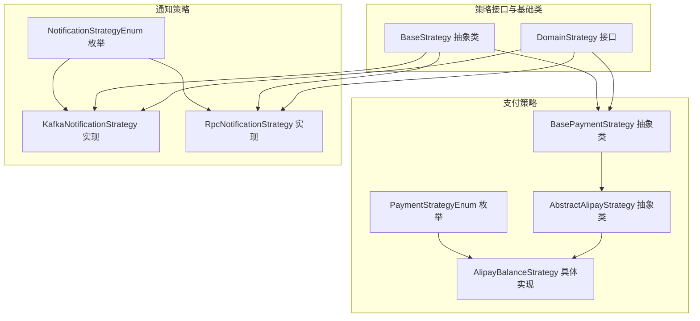
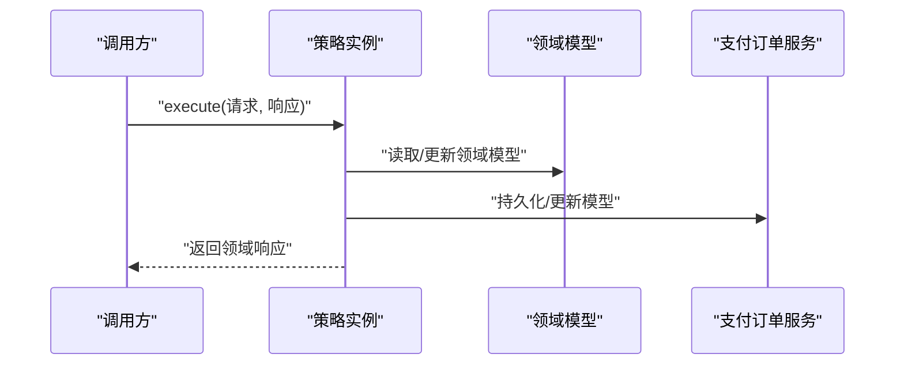
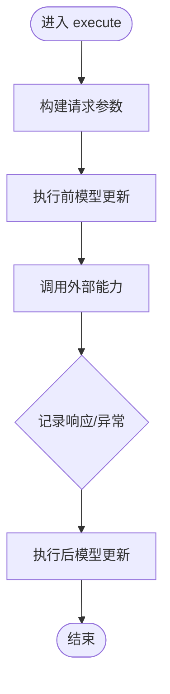
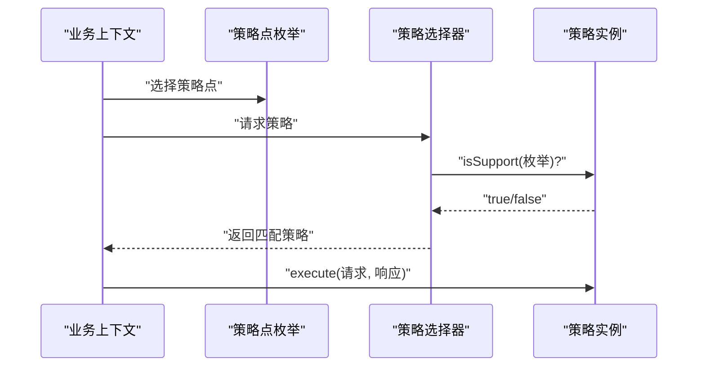
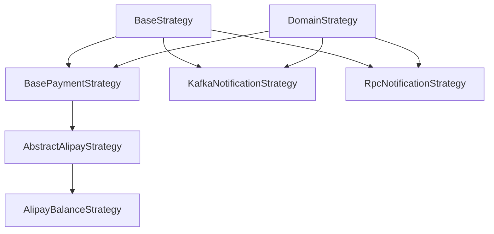

# 策略模式应用

<cite>
**本文引用的文件**
- [BaseStrategy.java](file://core-service/src/main/java/com/magicliang/transaction/sys/core/domain/strategy/BaseStrategy.java)
- [DomainStrategy.java](file://core-service/src/main/java/com/magicliang/transaction/sys/core/domain/strategy/DomainStrategy.java)
- [BasePaymentStrategy.java](file://core-service/src/main/java/com/magicliang/transaction/sys/core/domain/strategy/payment/BasePaymentStrategy.java)
- [AbstractAlipayStrategy.java](file://core-service/src/main/java/com/magicliang/transaction/sys/core/domain/strategy/payment/AbstractAlipayStrategy.java)
- [AlipayBalanceStrategy.java](file://core-service/src/main/java/com/magicliang/transaction/sys/core/domain/strategy/payment/AlipayBalanceStrategy.java)
- [PaymentStrategyEnum.java](file://core-service/src/main/java/com/magicliang/transaction/sys/core/domain/enums/PaymentStrategyEnum.java)
- [KafkaNotificationStrategy.java](file://core-service/src/main/java/com/magicliang/transaction/sys/core/domain/strategy/notification/KafkaNotificationStrategy.java)
- [RpcNotificationStrategy.java](file://core-service/src/main/java/com/magicliang/transaction/sys/core/domain/strategy/notification/RpcNotificationStrategy.java)
- [NotificationStrategyEnum.java](file://core-service/src/main/java/com/magicliang/transaction/sys/core/domain/enums/NotificationStrategyEnum.java)
</cite>

## 目录
1. [引言](#引言)
2. [项目结构](#项目结构)
3. [核心组件](#核心组件)
4. [架构总览](#架构总览)
5. [详细组件分析](#详细组件分析)
6. [依赖分析](#依赖分析)
7. [性能考虑](#性能考虑)
8. [故障排查指南](#故障排查指南)
9. [结论](#结论)
10. [附录](#附录)

## 引言
本文件围绕领域驱动交易系统中的策略模式应用展开，重点阐述以下主题：
- 基类设计：BaseStrategy 与 DomainStrategy 的职责划分与协作方式
- 支付策略层次：BasePaymentStrategy、AbstractAlipayStrategy 与具体实现 AlipayBalanceStrategy 的继承关系与职责边界
- 通知策略实现：KafkaNotificationStrategy 与 RpcNotificationStrategy 的差异与适用场景
- 策略注册、查找与动态切换：基于枚举标识与 isSupport 的匹配机制
- 工厂模式结合：策略与工厂的协同以实现运行时选择
- 策略扩展最佳实践：如何安全地新增策略并保持系统稳定

## 项目结构
策略模式在系统中的分布主要集中在 core-service 模块的 domain 层，围绕“支付”和“通知”两大业务域展开：
- 支付策略：位于 payment 包下，包含抽象基类与具体实现
- 通知策略：位于 notification 包下，包含多种通知实现
- 策略接口与基础类：位于 strategy 包下，统一约束策略行为与生命周期



图表来源
- [DomainStrategy.java:16-36](file://core-service/src/main/java/com/magicliang/transaction/sys/core/domain/strategy/DomainStrategy.java#L16-L36)
- [BaseStrategy.java:15-22](file://core-service/src/main/java/com/magicliang/transaction/sys/core/domain/strategy/BaseStrategy.java#L15-L22)
- [BasePaymentStrategy.java:28-29](file://core-service/src/main/java/com/magicliang/transaction/sys/core/domain/strategy/payment/BasePaymentStrategy.java#L28-L29)
- [AbstractAlipayStrategy.java:12-14](file://core-service/src/main/java/com/magicliang/transaction/sys/core/domain/strategy/payment/AbstractAlipayStrategy.java#L12-L14)
- [AlipayBalanceStrategy.java:32-48](file://core-service/src/main/java/com/magicliang/transaction/sys/core/domain/strategy/payment/AlipayBalanceStrategy.java#L32-L48)
- [PaymentStrategyEnum.java:18-25](file://core-service/src/main/java/com/magicliang/transaction/sys/core/domain/enums/PaymentStrategyEnum.java#L18-L25)
- [KafkaNotificationStrategy.java:22-33](file://core-service/src/main/java/com/magicliang/transaction/sys/core/domain/strategy/notification/KafkaNotificationStrategy.java#L22-L33)
- [RpcNotificationStrategy.java:48-71](file://core-service/src/main/java/com/magicliang/transaction/sys/core/domain/strategy/notification/RpcNotificationStrategy.java#L48-L71)
- [NotificationStrategyEnum.java:18-29](file://core-service/src/main/java/com/magicliang/transaction/sys/core/domain/enums/NotificationStrategyEnum.java#L18-L29)

章节来源
- [BaseStrategy.java:15-22](file://core-service/src/main/java/com/magicliang/transaction/sys/core/domain/strategy/BaseStrategy.java#L15-L22)
- [DomainStrategy.java:16-36](file://core-service/src/main/java/com/magicliang/transaction/sys/core/domain/strategy/DomainStrategy.java#L16-L36)
- [BasePaymentStrategy.java:28-29](file://core-service/src/main/java/com/magicliang/transaction/sys/core/domain/strategy/payment/BasePaymentStrategy.java#L28-L29)
- [AbstractAlipayStrategy.java:12-14](file://core-service/src/main/java/com/magicliang/transaction/sys/core/domain/strategy/payment/AbstractAlipayStrategy.java#L12-L14)
- [AlipayBalanceStrategy.java:32-48](file://core-service/src/main/java/com/magicliang/transaction/sys/core/domain/strategy/payment/AlipayBalanceStrategy.java#L32-L48)
- [PaymentStrategyEnum.java:18-25](file://core-service/src/main/java/com/magicliang/transaction/sys/core/domain/enums/PaymentStrategyEnum.java#L18-L25)
- [KafkaNotificationStrategy.java:22-33](file://core-service/src/main/java/com/magicliang/transaction/sys/core/domain/strategy/notification/KafkaNotificationStrategy.java#L22-L33)
- [RpcNotificationStrategy.java:48-71](file://core-service/src/main/java/com/magicliang/transaction/sys/core/domain/strategy/notification/RpcNotificationStrategy.java#L48-L71)
- [NotificationStrategyEnum.java:18-29](file://core-service/src/main/java/com/magicliang/transaction/sys/core/domain/enums/NotificationStrategyEnum.java#L18-L29)

## 核心组件
本节聚焦策略模式的核心构件及其职责：
- BaseStrategy：注入通用服务（如支付订单服务），为所有策略提供基础设施
- DomainStrategy：定义策略的统一接口，包含 execute 与 identify/isSupport 能力
- BasePaymentStrategy：支付域策略的抽象基类，封装支付流程的前置/后置处理与异常记录
- AbstractAlipayStrategy：支付宝域策略的抽象层，作为 AlipayBalanceStrategy 的父类
- AlipayBalanceStrategy：具体支付策略，对接外部支付宝余额转账能力
- KafkaNotificationStrategy：基于消息队列的通知策略（占位实现）
- RpcNotificationStrategy：基于 RPC 的通知策略，负责下游回调通知与状态更新
- PaymentStrategyEnum、NotificationStrategyEnum：策略点枚举，用于策略识别与匹配

章节来源
- [BaseStrategy.java:15-22](file://core-service/src/main/java/com/magicliang/transaction/sys/core/domain/strategy/BaseStrategy.java#L15-L22)
- [DomainStrategy.java:16-36](file://core-service/src/main/java/com/magicliang/transaction/sys/core/domain/strategy/DomainStrategy.java#L16-L36)
- [BasePaymentStrategy.java:28-29](file://core-service/src/main/java/com/magicliang/transaction/sys/core/domain/strategy/payment/BasePaymentStrategy.java#L28-L29)
- [AbstractAlipayStrategy.java:12-14](file://core-service/src/main/java/com/magicliang/transaction/sys/core/domain/strategy/payment/AbstractAlipayStrategy.java#L12-L14)
- [AlipayBalanceStrategy.java:32-48](file://core-service/src/main/java/com/magicliang/transaction/sys/core/domain/strategy/payment/AlipayBalanceStrategy.java#L32-L48)
- [KafkaNotificationStrategy.java:22-33](file://core-service/src/main/java/com/magicliang/transaction/sys/core/domain/strategy/notification/KafkaNotificationStrategy.java#L22-L33)
- [RpcNotificationStrategy.java:48-71](file://core-service/src/main/java/com/magicliang/transaction/sys/core/domain/strategy/notification/RpcNotificationStrategy.java#L48-L71)
- [PaymentStrategyEnum.java:18-25](file://core-service/src/main/java/com/magicliang/transaction/sys/core/domain/enums/PaymentStrategyEnum.java#L18-L25)
- [NotificationStrategyEnum.java:18-29](file://core-service/src/main/java/com/magicliang/transaction/sys/core/domain/enums/NotificationStrategyEnum.java#L18-L29)

## 架构总览
策略模式在系统中的整体交互如下：
- 外部或上层模块根据业务上下文选择合适的策略点枚举
- 策略实例通过 identify 与 isSupport 进行匹配，确保只激活对应策略
- 策略内部完成领域请求处理，并通过统一的领域响应返回结果
- 支付策略在执行前后分别进行领域模型更新，保证一致性
- 通知策略根据配置与订单状态决定是否发送通知及如何记录结果



图表来源
- [BasePaymentStrategy.java:71-90](file://core-service/src/main/java/com/magicliang/transaction/sys/core/domain/strategy/payment/BasePaymentStrategy.java#L71-L90)
- [AlipayBalanceStrategy.java:57-81](file://core-service/src/main/java/com/magicliang/transaction/sys/core/domain/strategy/payment/AlipayBalanceStrategy.java#L57-L81)
- [RpcNotificationStrategy.java:79-121](file://core-service/src/main/java/com/magicliang/transaction/sys/core/domain/strategy/notification/RpcNotificationStrategy.java#L79-L121)

## 详细组件分析

### 支付策略层次结构
支付策略采用三层继承结构：
- BasePaymentStrategy：提供支付流程的通用逻辑，包括异常记录、执行前/后模型更新等
- AbstractAlipayStrategy：支付宝域策略的抽象层，便于扩展更多支付宝相关策略
- AlipayBalanceStrategy：具体策略，对接外部支付宝余额转账能力，完成请求构建、调用与结果记录

```mermaid
classDiagram
class BaseStrategy {
"+payOrderService"
}
class DomainStrategy {
"+execute(req,res)"
"+identify()"
"+isSupport(strategyEnum)"
}
class BasePaymentStrategy {
"+recordException(...)"
"+updateDomainModelAfterPayment(...)"
"+updateDomainModelsBeforePayment(...)"
}
class AbstractAlipayStrategy
class AlipayBalanceStrategy {
"+identify()"
"+execute(...)"
}
BaseStrategy <|-- BasePaymentStrategy
DomainStrategy <|.. BasePaymentStrategy
BasePaymentStrategy <|-- AbstractAlipayStrategy
AbstractAlipayStrategy <|-- AlipayBalanceStrategy
```

图表来源
- [BaseStrategy.java:15-22](file://core-service/src/main/java/com/magicliang/transaction/sys/core/domain/strategy/BaseStrategy.java#L15-L22)
- [DomainStrategy.java:16-36](file://core-service/src/main/java/com/magicliang/transaction/sys/core/domain/strategy/DomainStrategy.java#L16-L36)
- [BasePaymentStrategy.java:28-29](file://core-service/src/main/java/com/magicliang/transaction/sys/core/domain/strategy/payment/BasePaymentStrategy.java#L28-L29)
- [AbstractAlipayStrategy.java:12-14](file://core-service/src/main/java/com/magicliang/transaction/sys/core/domain/strategy/payment/AbstractAlipayStrategy.java#L12-L14)
- [AlipayBalanceStrategy.java:32-48](file://core-service/src/main/java/com/magicliang/transaction/sys/core/domain/strategy/payment/AlipayBalanceStrategy.java#L32-L48)

章节来源
- [BasePaymentStrategy.java:28-29](file://core-service/src/main/java/com/magicliang/transaction/sys/core/domain/strategy/payment/BasePaymentStrategy.java#L28-L29)
- [AbstractAlipayStrategy.java:12-14](file://core-service/src/main/java/com/magicliang/transaction/sys/core/domain/strategy/payment/AbstractAlipayStrategy.java#L12-L14)
- [AlipayBalanceStrategy.java:32-48](file://core-service/src/main/java/com/magicliang/transaction/sys/core/domain/strategy/payment/AlipayBalanceStrategy.java#L32-L48)

### 支付策略执行流程（以 AlipayBalanceStrategy 为例）
该流程展示了支付策略的典型执行路径：构建请求参数、执行前模型更新、调用外部能力、记录响应/异常、执行后模型更新。



图表来源
- [AlipayBalanceStrategy.java:57-81](file://core-service/src/main/java/com/magicliang/transaction/sys/core/domain/strategy/payment/AlipayBalanceStrategy.java#L57-L81)
- [BasePaymentStrategy.java:71-90](file://core-service/src/main/java/com/magicliang/transaction/sys/core/domain/strategy/payment/BasePaymentStrategy.java#L71-L90)

章节来源
- [AlipayBalanceStrategy.java:57-81](file://core-service/src/main/java/com/magicliang/transaction/sys/core/domain/strategy/payment/AlipayBalanceStrategy.java#L57-L81)
- [BasePaymentStrategy.java:71-90](file://core-service/src/main/java/com/magicliang/transaction/sys/core/domain/strategy/payment/BasePaymentStrategy.java#L71-L90)

### 通知策略实现与选择
通知策略包含两种实现：
- KafkaNotificationStrategy：标识为 Kafka，当前为占位实现（未实现 execute）
- RpcNotificationStrategy：标识为 RPC，实现通知发送、状态更新与异常记录

策略选择与切换机制：
- 通过 NotificationStrategyEnum 枚举标识策略类型
- 策略实例的 identify 返回对应枚举值
- isSupport 默认通过 identify 与传入枚举比较决定是否激活

```mermaid
classDiagram
class BaseStrategy
class DomainStrategy {
"+execute(req,res)"
"+identify()"
"+isSupport(strategyEnum)"
}
class KafkaNotificationStrategy {
"+identify() 返回 Kafka"
"+execute(...) 抛出不支持异常"
}
class RpcNotificationStrategy {
"+identify() 返回 RPC"
"+execute(...)"
}
class NotificationStrategyEnum {
"+KAFKA"
"+RPC"
}
BaseStrategy <|-- KafkaNotificationStrategy
BaseStrategy <|-- RpcNotificationStrategy
DomainStrategy <|.. KafkaNotificationStrategy
DomainStrategy <|.. RpcNotificationStrategy
NotificationStrategyEnum --> KafkaNotificationStrategy : "标识"
NotificationStrategyEnum --> RpcNotificationStrategy : "标识"
```

图表来源
- [KafkaNotificationStrategy.java:22-45](file://core-service/src/main/java/com/magicliang/transaction/sys/core/domain/strategy/notification/KafkaNotificationStrategy.java#L22-L45)
- [RpcNotificationStrategy.java:48-121](file://core-service/src/main/java/com/magicliang/transaction/sys/core/domain/strategy/notification/RpcNotificationStrategy.java#L48-L121)
- [NotificationStrategyEnum.java:18-29](file://core-service/src/main/java/com/magicliang/transaction/sys/core/domain/enums/NotificationStrategyEnum.java#L18-L29)

章节来源
- [KafkaNotificationStrategy.java:22-45](file://core-service/src/main/java/com/magicliang/transaction/sys/core/domain/strategy/notification/KafkaNotificationStrategy.java#L22-L45)
- [RpcNotificationStrategy.java:48-121](file://core-service/src/main/java/com/magicliang/transaction/sys/core/domain/strategy/notification/RpcNotificationStrategy.java#L48-L121)
- [NotificationStrategyEnum.java:18-29](file://core-service/src/main/java/com/magicliang/transaction/sys/core/domain/enums/NotificationStrategyEnum.java#L18-L29)

### 策略注册、查找与动态切换
- 策略注册：策略类通过 Spring 组件注解（如 @Component）注册为 Bean，由容器管理
- 策略查找：通过策略点枚举与策略实例的 identify/isSupport 进行匹配
- 动态切换：根据业务上下文选择不同的策略点枚举，从而激活对应的策略实现



图表来源
- [DomainStrategy.java:33-35](file://core-service/src/main/java/com/magicliang/transaction/sys/core/domain/strategy/DomainStrategy.java#L33-L35)
- [PaymentStrategyEnum.java:43-53](file://core-service/src/main/java/com/magicliang/transaction/sys/core/domain/enums/PaymentStrategyEnum.java#L43-L53)
- [NotificationStrategyEnum.java:47-57](file://core-service/src/main/java/com/magicliang/transaction/sys/core/domain/enums/NotificationStrategyEnum.java#L47-L57)

章节来源
- [DomainStrategy.java:33-35](file://core-service/src/main/java/com/magicliang/transaction/sys/core/domain/strategy/DomainStrategy.java#L33-L35)
- [PaymentStrategyEnum.java:43-53](file://core-service/src/main/java/com/magicliang/transaction/sys/core/domain/enums/PaymentStrategyEnum.java#L43-L53)
- [NotificationStrategyEnum.java:47-57](file://core-service/src/main/java/com/magicliang/transaction/sys/core/domain/enums/NotificationStrategyEnum.java#L47-L57)

### 工厂模式结合与运行时选择
- 工厂职责：根据策略点枚举与请求上下文，从容器中检索并返回匹配的策略实例
- 运行时选择：在执行前完成策略选择，避免硬编码分支；通过 isSupport 与 identify 保证策略激活的准确性
- 扩展性：新增策略仅需实现 DomainStrategy 接口、定义枚举项并注册为 Bean 即可

章节来源
- [DomainStrategy.java:16-36](file://core-service/src/main/java/com/magicliang/transaction/sys/core/domain/strategy/DomainStrategy.java#L16-L36)
- [BaseStrategy.java:15-22](file://core-service/src/main/java/com/magicliang/transaction/sys/core/domain/strategy/BaseStrategy.java#L15-L22)

## 依赖分析
策略之间的依赖关系清晰，遵循“高层抽象依赖于低层实现”的原则：
- BaseStrategy 为所有策略提供基础设施
- DomainStrategy 定义统一接口，策略实现遵循该接口
- 支付策略链路：BasePaymentStrategy -> AbstractAlipayStrategy -> AlipayBalanceStrategy
- 通知策略链路：KafkaNotificationStrategy 与 RpcNotificationStrategy 并行存在，互不依赖



图表来源
- [BaseStrategy.java:15-22](file://core-service/src/main/java/com/magicliang/transaction/sys/core/domain/strategy/BaseStrategy.java#L15-L22)
- [DomainStrategy.java:16-36](file://core-service/src/main/java/com/magicliang/transaction/sys/core/domain/strategy/DomainStrategy.java#L16-L36)
- [BasePaymentStrategy.java:28-29](file://core-service/src/main/java/com/magicliang/transaction/sys/core/domain/strategy/payment/BasePaymentStrategy.java#L28-L29)
- [AbstractAlipayStrategy.java:12-14](file://core-service/src/main/java/com/magicliang/transaction/sys/core/domain/strategy/payment/AbstractAlipayStrategy.java#L12-L14)
- [AlipayBalanceStrategy.java:32-48](file://core-service/src/main/java/com/magicliang/transaction/sys/core/domain/strategy/payment/AlipayBalanceStrategy.java#L32-L48)
- [KafkaNotificationStrategy.java:22-33](file://core-service/src/main/java/com/magicliang/transaction/sys/core/domain/strategy/notification/KafkaNotificationStrategy.java#L22-L33)
- [RpcNotificationStrategy.java:48-71](file://core-service/src/main/java/com/magicliang/transaction/sys/core/domain/strategy/notification/RpcNotificationStrategy.java#L48-L71)

章节来源
- [BaseStrategy.java:15-22](file://core-service/src/main/java/com/magicliang/transaction/sys/core/domain/strategy/BaseStrategy.java#L15-L22)
- [DomainStrategy.java:16-36](file://core-service/src/main/java/com/magicliang/transaction/sys/core/domain/strategy/DomainStrategy.java#L16-L36)
- [BasePaymentStrategy.java:28-29](file://core-service/src/main/java/com/magicliang/transaction/sys/core/domain/strategy/payment/BasePaymentStrategy.java#L28-L29)
- [AbstractAlipayStrategy.java:12-14](file://core-service/src/main/java/com/magicliang/transaction/sys/core/domain/strategy/payment/AbstractAlipayStrategy.java#L12-L14)
- [AlipayBalanceStrategy.java:32-48](file://core-service/src/main/java/com/magicliang/transaction/sys/core/domain/strategy/payment/AlipayBalanceStrategy.java#L32-L48)
- [KafkaNotificationStrategy.java:22-33](file://core-service/src/main/java/com/magicliang/transaction/sys/core/domain/strategy/notification/KafkaNotificationStrategy.java#L22-L33)
- [RpcNotificationStrategy.java:48-71](file://core-service/src/main/java/com/magicliang/transaction/sys/core/domain/strategy/notification/RpcNotificationStrategy.java#L48-L71)

## 性能考虑
- 策略选择开销：通过枚举与接口方法匹配，开销极低，适合高频调用
- 持久化与事务：策略在执行前后对领域模型进行更新，建议结合事务管理保证一致性
- 外部调用：支付与通知策略均涉及外部系统调用，建议引入超时控制与熔断降级
- 日志与监控：建议在策略执行的关键节点埋点，便于追踪与性能分析

## 故障排查指南
- 支付策略异常：recordException 会记录异常信息并保持订单中间态，便于后续重试
- 通知策略异常：RpcNotificationStrategy 在 try-catch 中记录异常并更新请求状态
- 策略未激活：确认策略的 identify 与枚举一致，isSupport 是否按预期返回 true
- Kafka 策略占位：KafkaNotificationStrategy 当前未实现 execute，调用会抛出不支持异常

章节来源
- [BasePaymentStrategy.java:50-64](file://core-service/src/main/java/com/magicliang/transaction/sys/core/domain/strategy/payment/BasePaymentStrategy.java#L50-L64)
- [RpcNotificationStrategy.java:113-116](file://core-service/src/main/java/com/magicliang/transaction/sys/core/domain/strategy/notification/RpcNotificationStrategy.java#L113-L116)
- [KafkaNotificationStrategy.java](file://core-service/src/main/java/com/magicliang/transaction/sys/core/domain/strategy/notification/KafkaNotificationStrategy.java#L44)

## 结论
本系统通过策略模式实现了支付与通知领域的高内聚、低耦合设计：
- 基类与接口明确了职责边界，策略实现遵循统一规范
- 支付策略链路清晰，易于扩展新的支付渠道
- 通知策略提供了可插拔的实现，满足不同下游集成需求
- 通过枚举与 isSupport 的匹配机制，实现了策略的动态选择与切换
- 建议在工厂层进一步完善策略注册与缓存，提升运行时性能与可维护性

## 附录
- 策略扩展最佳实践
  - 新增策略：实现 DomainStrategy 接口，定义 identify 与 execute
  - 注册策略：使用 Spring 组件注解注册为 Bean
  - 枚举扩展：在对应枚举中添加新条目，确保 identify 返回正确值
  - 测试策略：编写单元测试验证 execute 与异常处理逻辑
  - 文档与监控：补充策略说明与关键指标埋点